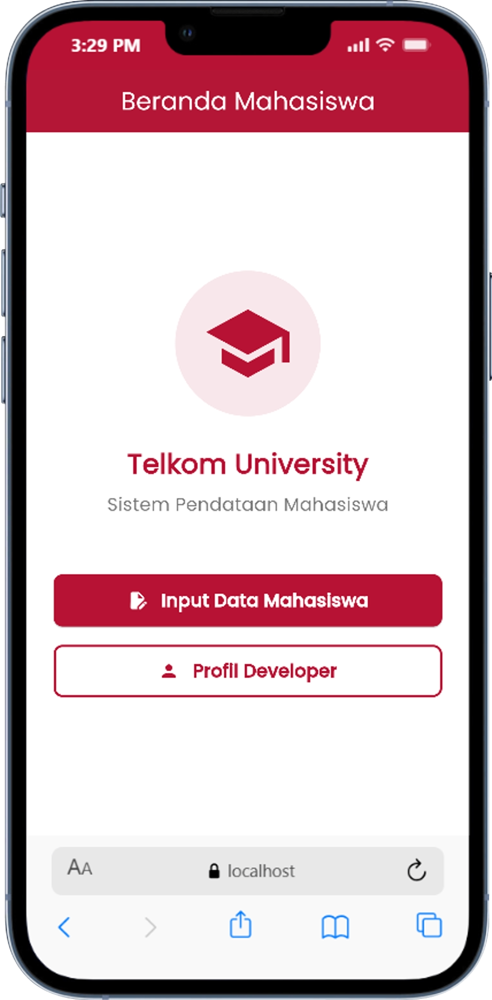

<div align="center">
  <br />
  <h1>LAPORAN PRAKTIKUM <br>APLIKASI BERBASIS PLATFORM</h1>
  <br />
  <h3>MODUL 7 <br> NAVIGATION & STATE MANAGEMENT</h3>
  <br />
   
  <br />
  <br />
  <br />
  <h3>Disusun Oleh :</h3>
  <p>
    <strong>NOFITA FITRIYANI</strong><br>
    <strong>2311102001</strong><br>
    <strong>S1 IF-11-REG01</strong>
  </p>
  <br />
  <br />
  <h3>Dosen Pengampu :</h3>
  <p>
    <strong>Dimas Fanny Hebrasianto Permadi, S.ST., M.Kom</strong>
  </p>
  <br />
  <br />
    <h4>Asisten Praktikum :</h4>
    <strong> Apri Pandu Wicaksono </strong> <br>
    <strong>Rangga Pradarrell Fathi</strong>
  <br />
  <h3>LABORATORIUM HIGH PERFORMANCE
 <br>FAKULTAS INFORMATIKA <br>UNIVERSITAS TELKOM PURWOKERTO <br>2026</h3>
</div>

---

## 1. Dasar Teori

#### 1.1 Flutter
Flutter merupakan framework open-source yang dikembangkan oleh Google untuk membangun aplikasi mobile, web, dan desktop menggunakan satu basis kode (single codebase). Flutter menggunakan bahasa pemrograman Dart dan menyediakan berbagai widget yang memudahkan pengembangan antarmuka pengguna (UI) secara cepat dan responsif.

Flutter menerapkan konsep widget sebagai komponen utama dalam pembuatan tampilan aplikasi. Setiap elemen pada antarmuka, seperti teks, tombol, gambar, maupun layout, dibangun menggunakan widget.

Implementasi Flutter pada praktikum ini digunakan untuk membuat tampilan antarmuka sederhana yang terdiri dari beberapa widget seperti `Column, Padding, dan TextField`.

#### 1.2 Widget Pada Flutter
Widget merupakan komponen dasar dalam Flutter yang digunakan untuk membangun tampilan aplikasi. Widget dapat berupa elemen visual maupun pengatur layout tampilan.

Secara umum, widget pada Flutter dibagi menjadi dua jenis, yaitu:

1. StatelessWidget
Widget yang tampilannya bersifat tetap dan tidak berubah selama aplikasi berjalan.
2. StatefulWidget
Widget yang dapat berubah tampilannya sesuai dengan perubahan data atau state aplikasi.

Pada program praktikum ini digunakan StatefulWidget pada halaman utama aplikasi untuk mengatur tampilan form input.

#### 1.3 Widget Column
`Column` merupakan widget layout pada Flutter yang digunakan untuk menyusun beberapa widget secara vertikal dari atas ke bawah.

Widget `Column` memiliki beberapa properti, salah satunya crossAxisAlignment yang digunakan untuk mengatur posisi horizontal widget di dalam `Column`.

Pada praktikum ini, widget `Column` digunakan untuk menampilkan dua buah TextField secara vertikal sehingga tampilan aplikasi menjadi lebih terstruktur.

#### 1.4 Widget Padding
`Padding` merupakan widget yang digunakan untuk memberikan jarak pada suatu widget terhadap widget lain maupun terhadap sisi layar.

Penggunaan `Padding` bertujuan agar tampilan antarmuka lebih rapi dan nyaman dilihat pengguna.

Pada program praktikum, widget `Padding` digunakan untuk memberikan jarak di sekitar TextField sehingga kolom input tidak menempel langsung pada sisi layar.

#### 1.5 Widget TextField
`TextField` merupakan widget input pada Flutter yang digunakan untuk menerima masukan berupa teks dari pengguna.

Widget `TextField` memiliki beberapa properti penting, antara lain:
- `hintText` → menampilkan teks petunjuk pada kolom input.
- `border` → memberikan garis tepi pada input.
- `controller` → mengatur dan mengambil data input pengguna.

Pada praktikum ini, `TextField` digunakan untuk membuat dua buah kolom input teks dengan tampilan border berbentuk kotak menggunakan `OutlineInputBorder()`.

#### 1.6 Material Design
Material Design merupakan pedoman desain antarmuka yang dikembangkan oleh Google untuk menciptakan tampilan aplikasi yang konsisten, modern, dan responsif.

Flutter menyediakan library `material.dart` yang berisi berbagai widget Material Design seperti:
- Scaffold
- AppBar
- TextField
- Button
- Card

#### 1.7 SnackBar
SnackBar adalah komponen notifikasi sederhana yang muncul sementara di bagian bawah layar. SnackBar biasanya digunakan untuk memberikan informasi kepada pengguna, misalnya notifikasi bahwa suatu aksi berhasil dilakukan setelah tombol ditekan.

---

## 2. Source Code dan Implementasinya
### HOME PAGE (Beranda)
```
import 'package:flutter/material.dart';

import 'form_page.dart';
import 'profile_page.dart';

class HomePage extends StatelessWidget {
  const HomePage({super.key});

  @override
  Widget build(BuildContext context) {
    return Scaffold(
      appBar: AppBar(
        title: const Text('Beranda Mahasiswa'),
      ),
      body: Center(
        child: SingleChildScrollView(
          padding: const EdgeInsets.all(24.0),
          child: Column(
            mainAxisAlignment: MainAxisAlignment.center,
            children: [
              Container(
                padding: const EdgeInsets.all(24),
                decoration: BoxDecoration(
                  color: const Color(0xFFB71234).withOpacity(0.1),
                  shape: BoxShape.circle,
                ),
                child: const Icon(
                  Icons.school,
                  size: 80,
                  color: Color(0xFFB71234),
                ),
              ),
              const SizedBox(height: 24),
              const Text(
                'Telkom University',
                style: TextStyle(
                  fontSize: 24,
                  fontWeight: FontWeight.bold,
                  color: Color(0xFFB71234),
                ),
              ),
              const SizedBox(height: 8),
              const Text(
                'Sistem Pendataan Mahasiswa',
                style: TextStyle(
                  fontSize: 16, 
                  color: Colors.black54
                ),
              ),
              const SizedBox(height: 50),
              ElevatedButton(
                onPressed: () {
                  Navigator.push(
                    context,
                    MaterialPageRoute(builder: (context) => const FormPage()),
                  );
                },
                style: ElevatedButton.styleFrom(
                  backgroundColor: const Color(0xFFB71234),
                  foregroundColor: Colors.white,
                  padding: const EdgeInsets.symmetric(vertical: 16, horizontal: 24),
                  minimumSize: const Size(double.infinity, 54),
                  shape: RoundedRectangleBorder(
                    borderRadius: BorderRadius.circular(8),
                  ),
                ),
                child: const Row(
                  mainAxisAlignment: MainAxisAlignment.center,
                  children: [
                    Icon(Icons.edit_document),
                    SizedBox(width: 12),
                    Text(
                      'Input Data Mahasiswa', 
                      style: TextStyle(fontSize: 16, fontWeight: FontWeight.bold)
                    ),
                  ],
                ),
              ),
              const SizedBox(height: 16),
              OutlinedButton(
                onPressed: () {
                  Navigator.push(
                    context,
                    MaterialPageRoute(builder: (context) => const ProfilePage()),
                  );
                },
                style: OutlinedButton.styleFrom(
                  foregroundColor: const Color(0xFFB71234),
                  side: const BorderSide(color: Color(0xFFB71234), width: 2),
                  padding: const EdgeInsets.symmetric(vertical: 16, horizontal: 24),
                  minimumSize: const Size(double.infinity, 54),
                  shape: RoundedRectangleBorder(
                    borderRadius: BorderRadius.circular(8),
                  ),
                ),
                child: const Row(
                  mainAxisAlignment: MainAxisAlignment.center,
                  children: [
                    Icon(Icons.person),
                    SizedBox(width: 12),
                    Text(
                      'Profil Developer', 
                      style: TextStyle(fontSize: 16, fontWeight: FontWeight.bold)
                    ),
                  ],
                ),
              ),
            ],
          ),
        ),
      ),
    );
  }
}
```
### FORM PAGE (Halaman Input)
```
import 'package:flutter/material.dart';

class FormPage extends StatefulWidget {
  const FormPage({super.key});

  @override
  State<FormPage> createState() => _FormPageState();
}

class _FormPageState extends State<FormPage> {
  final _namaController = TextEditingController();
  final _nimController = TextEditingController();
  final _kelasController = TextEditingController();

  // Menggunakan List untuk menyimpan banyak data sekaligus
  final List<Map<String, String>> _listMahasiswa = [];

  void _simpanData() {
    // Validasi sederhana
    if (_namaController.text.isEmpty || 
        _nimController.text.isEmpty || 
        _kelasController.text.isEmpty) {
      ScaffoldMessenger.of(context).showSnackBar(
        const SnackBar(
          content: Text('Harap isi semua data terlebih dahulu!'),
          backgroundColor: Colors.red,
          behavior: SnackBarBehavior.floating,
        ),
      );
      return;
    }

    // Menambahkan data baru ke dalam list history
    setState(() {
      _listMahasiswa.add({
        'nama': _namaController.text,
        'nim': _nimController.text,
        'kelas': _kelasController.text,
      });
    });

    // Tampilkan SnackBar sukses
    ScaffoldMessenger.of(context).showSnackBar(
      SnackBar(
        content: const Row(
          children: [
            Icon(Icons.check_circle, color: Colors.white),
            SizedBox(width: 10),
            Text(
              'Data Mahasiswa Berhasil Disimpan!',
              style: TextStyle(color: Colors.white, fontSize: 15),
            ),
          ],
        ),
        backgroundColor: Colors.green.shade700,
        behavior: SnackBarBehavior.floating,
        duration: const Duration(seconds: 2),
      ),
    );

    // Kosongkan form agar siap diisi lagi
    _namaController.clear();
    _nimController.clear();
    _kelasController.clear();
  }

  @override
  void dispose() {
    _namaController.dispose();
    _nimController.dispose();
    _kelasController.dispose();
    super.dispose();
  }

  @override
  Widget build(BuildContext context) {
    return Scaffold(
      appBar: AppBar(
        title: const Text('Form Data Mahasiswa'),
      ),
      body: SingleChildScrollView(
        child: Padding(
          padding: const EdgeInsets.all(24.0),
          child: Column(
            crossAxisAlignment: CrossAxisAlignment.stretch,
            children: [
              const Text(
                'Lengkapi Data Berikut',
                style: TextStyle(
                  fontSize: 18, 
                  fontWeight: FontWeight.bold, 
                  color: Color(0xFFB71234)
                ),
              ),
              const SizedBox(height: 20),
              TextField(
                controller: _namaController,
                decoration: const InputDecoration(
                  labelText: 'Nama Lengkap',
                  border: OutlineInputBorder(),
                  prefixIcon: Icon(Icons.person),
                ),
              ),
              const SizedBox(height: 16),
              TextField(
                controller: _nimController,
                keyboardType: TextInputType.number,
                decoration: const InputDecoration(
                  labelText: 'NIM Mahasiswa',
                  border: OutlineInputBorder(),
                  prefixIcon: Icon(Icons.badge),
                ),
              ),
              const SizedBox(height: 16),
              TextField(
                controller: _kelasController,
                decoration: const InputDecoration(
                  labelText: 'Kelas',
                  border: OutlineInputBorder(),
                  prefixIcon: Icon(Icons.class_),
                ),
              ),
              const SizedBox(height: 24),
              ElevatedButton(
                onPressed: _simpanData,
                style: ElevatedButton.styleFrom(
                  backgroundColor: const Color(0xFFB71234),
                  foregroundColor: Colors.white,
                  padding: const EdgeInsets.symmetric(vertical: 16),
                  shape: RoundedRectangleBorder(
                    borderRadius: BorderRadius.circular(8),
                  ),
                ),
                child: const Text('SIMPAN', style: TextStyle(fontSize: 16, fontWeight: FontWeight.bold)),
              ),
              
              // Menampilkan daftar semua data yang sudah disimpan (seperti history)
              if (_listMahasiswa.isNotEmpty) ...[
                const SizedBox(height: 40),
                const Text(
                  'Daftar Mahasiswa Tersimpan',
                  style: TextStyle(
                    fontSize: 18, 
                    fontWeight: FontWeight.bold, 
                    color: Color(0xFFB71234)
                  ),
                ),
                const SizedBox(height: 16),
                ListView.builder(
                  shrinkWrap: true, // Wajib jika di dalam SingleChildScrollView
                  physics: const NeverScrollableScrollPhysics(), // Scroll diurus parent
                  itemCount: _listMahasiswa.length,
                  itemBuilder: (context, index) {
                    final data = _listMahasiswa[index];
                    return Container(
                      margin: const EdgeInsets.only(bottom: 12),
                      padding: const EdgeInsets.all(16),
                      decoration: BoxDecoration(
                        color: Colors.white,
                        border: Border.all(color: Colors.grey.shade400),
                        borderRadius: BorderRadius.circular(8),
                      ),
                      child: Column(
                        crossAxisAlignment: CrossAxisAlignment.start,
                        children: [
                          Row(
                            children: [
                              CircleAvatar(
                                radius: 14,
                                backgroundColor: const Color(0xFFB71234),
                                child: Text(
                                  '${index + 1}',
                                  style: const TextStyle(
                                    color: Colors.white, 
                                    fontSize: 12, 
                                    fontWeight: FontWeight.bold
                                  ),
                                ),
                              ),
                              const SizedBox(width: 8),
                              Expanded(
                                child: Text(
                                  data['nama'] ?? '-',
                                  style: const TextStyle(
                                    fontSize: 16,
                                    fontWeight: FontWeight.bold,
                                    color: Color(0xFFB71234),
                                  ),
                                ),
                              ),
                            ],
                          ),
                          const Divider(color: Colors.black12),
                          const SizedBox(height: 4),
                          Text('NIM   : ${data['nim']}', style: const TextStyle(fontSize: 15)),
                          const SizedBox(height: 4),
                          Text('Kelas : ${data['kelas']}', style: const TextStyle(fontSize: 15)),
                        ],
                      ),
                    );
                  },
                ),
              ],
            ],
          ),
        ),
      ),
    );
  }
}

```

### PROFILE PAGE (Profil)
```
import 'package:flutter/material.dart';

class ProfilePage extends StatelessWidget {
  const ProfilePage({super.key});

  @override
  Widget build(BuildContext context) {
    return Scaffold(
      appBar: AppBar(
        title: const Text('Profil Developer'),
      ),
      body: Center(
        child: Padding(
          padding: const EdgeInsets.all(24.0),
          child: Column(
            mainAxisAlignment: MainAxisAlignment.center,
            children: [
              const CircleAvatar(
                radius: 60,
                backgroundColor: Color(0xFFB71234),
                child: Icon(
                  Icons.person,
                  size: 80,
                  color: Colors.white,
                ),
              ),
              const SizedBox(height: 24),
              const Text(
                'Nofita Fitriyani',
                style: TextStyle(
                  fontSize: 24,
                  fontWeight: FontWeight.bold,
                  color: Colors.black87,
                ),
              ),
              const SizedBox(height: 8),
              const Text(
                '2311102001',
                style: TextStyle(
                  fontSize: 18,
                  fontWeight: FontWeight.w600,
                  color: Color(0xFFB71234),
                ),
              ),
              const SizedBox(height: 4),
              const Text(
                'S1IF-11-01',
                style: TextStyle(
                  fontSize: 16,
                  color: Colors.black54,
                ),
              ),
              const SizedBox(height: 32),
              Container(
                padding: const EdgeInsets.all(16),
                decoration: BoxDecoration(
                  color: Colors.grey.shade100,
                  borderRadius: BorderRadius.circular(8),
                  border: Border.all(color: Colors.grey.shade300),
                ),
                child: const Text(
                  'Aplikasi Berbasis Platform\nTelkom University',
                  textAlign: TextAlign.center,
                  style: TextStyle(fontSize: 16, height: 1.5),
                ),
              ),
              const SizedBox(height: 40),
              ElevatedButton.icon(
                onPressed: () {
                  Navigator.pop(context);
                },
                icon: const Icon(Icons.arrow_back),
                label: const Text('Kembali'),
                style: ElevatedButton.styleFrom(
                  backgroundColor: const Color(0xFFB71234),
                  foregroundColor: Colors.white,
                  padding: const EdgeInsets.symmetric(horizontal: 24, vertical: 12),
                  shape: RoundedRectangleBorder(
                    borderRadius: BorderRadius.circular(8),
                  ),
                ),
              ),
            ],
          ),
        ),
      ),
    );
  }
}

```

### MAIN DART
```
import 'package:flutter/material.dart';
import 'package:google_fonts/google_fonts.dart';

import 'home_page.dart';

void main() {
  runApp(const MyApp());
}

class MyApp extends StatelessWidget {
  const MyApp({super.key});

  @override
  Widget build(BuildContext context) {
    return MaterialApp(
      title: 'Data Mahasiswa',
      theme: ThemeData(
        scaffoldBackgroundColor: Colors.white,
        colorScheme: ColorScheme.fromSeed(
          seedColor: const Color(0xFFB71234),
          primary: const Color(0xFFB71234),
        ),
        useMaterial3: true,
        textTheme: GoogleFonts.poppinsTextTheme(
          Theme.of(context).textTheme,
        ),
        appBarTheme: const AppBarTheme(
          backgroundColor: Color(0xFFB71234),
          foregroundColor: Colors.white,
          centerTitle: true,
          elevation: 2,
        ),
      ),
      home: const HomePage(),
      debugShowCheckedModeBanner: false,
    );
  }
}

```

## 3. OUTPUT

<div style="display: flex; gap: 16px;">
  
  
  
</div>

<div style="display: flex; gap: 16px;">
  
  
</div>