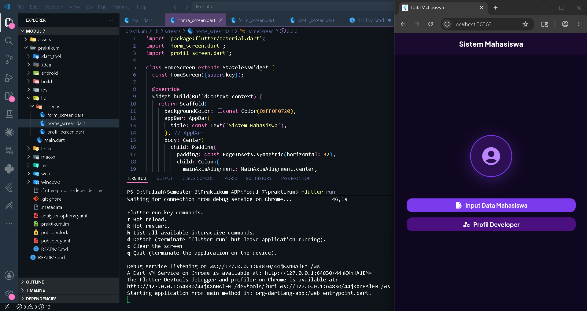
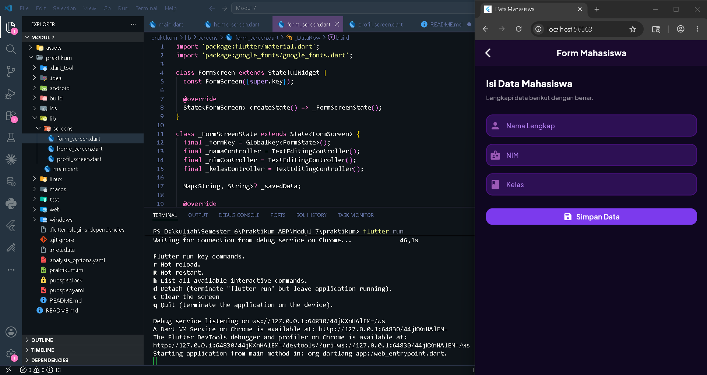
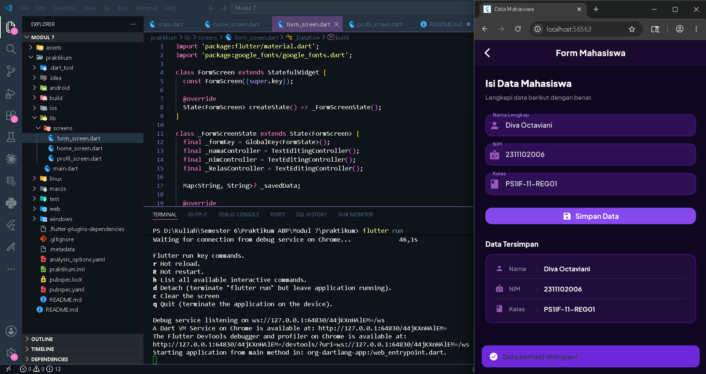
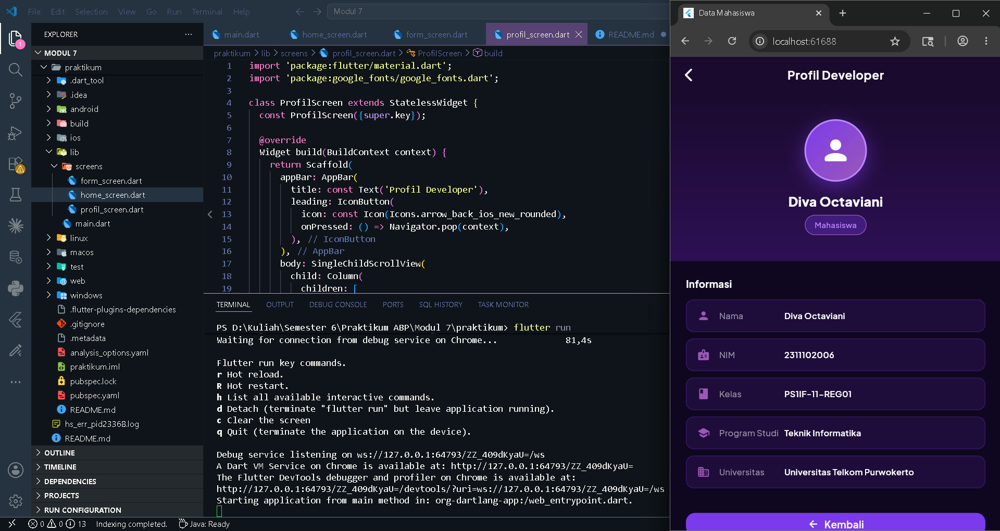

<div align="center">

## LAPORAN PRAKTIKUM <br> APLIKASI BERBASIS PLATFORM

<br>

### MODUL 7
### MOBILE

<br>
<br>


<br>
<br>
<br>

**Disusun oleh:**

**Diva Octaviani**  
**2311102006**

<br>

**KELAS PS1IF-11-REG01**

**Dosen: Dimas Fanny Hebrasianto Permadi, S.ST., M.Kom**

<br><br>

## PROGRAM STUDI S1 TEKNIK INFORMATIKA <br> FAKULTAS INFORMATIKA <br> UNIVERSITAS TELKOM PURWOKERTO <br> 2026 <br><br>

</div>

---

## 1. Dasar Teori

Flutter adalah framework open-source dari Google untuk membangun aplikasi mobile, web, dan desktop dari satu codebase menggunakan bahasa Dart. Pada praktikum ini, beberapa konsep utama yang digunakan adalah sebagai berikut.

**StatefulWidget** adalah widget yang memiliki state yang dapat berubah selama lifecycle aplikasi berjalan. Setiap kali state berubah melalui pemanggilan `setState()`, Flutter akan merender ulang tampilan widget tersebut. StatefulWidget terdiri dari dua kelas, yaitu kelas widget itu sendiri dan kelas State yang menyimpan data yang dapat berubah.

**StatelessWidget** adalah widget yang tidak memiliki state internal yang dapat berubah. Widget ini hanya merender tampilan berdasarkan properti yang diterima saat pembuatannya dan tidak akan berubah selama lifecycle berlangsung. StatelessWidget cocok digunakan untuk bagian UI yang bersifat statis.

**Navigator** adalah widget yang mengelola stack halaman (route) dalam aplikasi Flutter. `Navigator.push()` digunakan untuk berpindah ke halaman baru dengan menambahkannya ke atas stack, sedangkan `Navigator.pop()` digunakan untuk kembali ke halaman sebelumnya dengan menghapus halaman teratas dari stack. Perpindahan halaman dilakukan menggunakan `MaterialPageRoute`.

**Google Fonts** adalah package Flutter yang memungkinkan penggunaan font dari Google Fonts secara langsung tanpa perlu mengunduh dan mendaftarkan font secara manual. Package ini diimpor melalui `pubspec.yaml` dan digunakan dengan memanggil, misalnya, `GoogleFonts.plusJakartaSans()`.

**Form dan TextFormField** adalah widget yang digunakan untuk menangani input pengguna beserta validasinya. `Form` membungkus satu atau lebih `TextFormField` dan menggunakan `GlobalKey<FormState>` untuk mengakses metode seperti `validate()`. Properti `validator` pada `TextFormField` digunakan untuk mendefinisikan aturan validasi input.

**SnackBar** adalah notifikasi sementara yang muncul di bagian bawah layar. SnackBar ditampilkan menggunakan `ScaffoldMessenger.of(context).showSnackBar()` dan biasanya digunakan untuk memberikan umpan balik singkat kepada pengguna setelah suatu aksi dilakukan.

---

## 2. Hasil Praktikum

### Langkah-Langkah:

**1.** Buka Visual Studio Code dan buat project Flutter baru dengan nama `praktikum`.

**2.** Tambahkan dependency `google_fonts` pada file `pubspec.yaml`:

```yaml
dependencies:
  flutter:
    sdk: flutter
  google_fonts: ^6.2.1
```

**3.** Jalankan `flutter pub get` di terminal untuk mengunduh package.

**4.** Buat folder `lib/screens/` dan buat tiga file di dalamnya: `home_screen.dart`, `form_screen.dart`, dan `profil_screen.dart`.

**5.** Buka `lib/main.dart`, hapus semua kode bawaan, lalu tambahkan kode berikut sebagai entry point aplikasi:

```dart
import 'package:flutter/material.dart';
import 'package:google_fonts/google_fonts.dart';
import 'screens/home_screen.dart';

void main() {
  runApp(const MyApp());
}

class MyApp extends StatelessWidget {
  const MyApp({super.key});

  @override
  Widget build(BuildContext context) {
    return MaterialApp(
      title: 'Sistem Mahasiswa',
      debugShowCheckedModeBanner: false,
      theme: ThemeData(
        useMaterial3: true,
        colorScheme: ColorScheme.fromSeed(
          seedColor: const Color(0xFF6A0DAD),
          brightness: Brightness.dark,
          primary: const Color(0xFF9B59B6),
          secondary: const Color(0xFFD4A0F7),
          surface: const Color(0xFF1A0A2E),
          onSurface: Colors.white,
        ),
        scaffoldBackgroundColor: const Color(0xFF0F0720),
        textTheme: GoogleFonts.plusJakartaSansTextTheme(
          ThemeData.dark().textTheme,
        ),
      ),
      home: const HomeScreen(),
    );
  }
}
```

**6.** Buat `home_screen.dart` sebagai halaman utama menggunakan `StatelessWidget`. Halaman ini menampilkan ikon dan dua tombol navigasi menggunakan `Navigator.push` untuk berpindah ke halaman Form dan Profil:

```dart
import 'package:flutter/material.dart';
import 'form_screen.dart';
import 'profil_screen.dart';

class HomeScreen extends StatelessWidget {
  const HomeScreen({super.key});

  @override
  Widget build(BuildContext context) {
    return Scaffold(
      appBar: AppBar(
        title: const Text('Sistem Mahasiswa'),
      ),
      body: Center(
        child: Padding(
          padding: const EdgeInsets.symmetric(horizontal: 32),
          child: Column(
            mainAxisAlignment: MainAxisAlignment.center,
            children: [
              Container(
                width: 110,
                height: 110,
                decoration: BoxDecoration(
                  shape: BoxShape.circle,
                  color: const Color(0xFF2D1054),
                  border: Border.all(color: const Color(0xFF7C3AED), width: 2),
                ),
                child: const Icon(
                  Icons.account_circle_rounded,
                  size: 56,
                  color: Color(0xFFBB86FC),
                ),
              ),
              const SizedBox(height: 56),
              SizedBox(
                width: double.infinity,
                child: ElevatedButton.icon(
                  onPressed: () {
                    Navigator.push(
                      context,
                      MaterialPageRoute(builder: (_) => const FormScreen()),
                    );
                  },
                  icon: const Icon(Icons.edit_document, size: 20),
                  label: const Text('Input Data Mahasiswa'),
                ),
              ),
              const SizedBox(height: 14),
              SizedBox(
                width: double.infinity,
                child: ElevatedButton.icon(
                  onPressed: () {
                    Navigator.push(
                      context,
                      MaterialPageRoute(builder: (_) => const ProfilScreen()),
                    );
                  },
                  icon: const Icon(Icons.manage_accounts_rounded, size: 20),
                  label: const Text('Profil Developer'),
                ),
              ),
            ],
          ),
        ),
      ),
    );
  }
}
```

**7.** Buat `form_screen.dart` menggunakan `StatefulWidget` karena halaman ini perlu menyimpan dan menampilkan data yang diinput. Form memiliki tiga field: Nama, NIM, dan Kelas. Saat tombol Simpan ditekan, data divalidasi lalu ditampilkan di bawah form, dan SnackBar muncul sebagai notifikasi:

```dart
import 'package:flutter/material.dart';
import 'package:google_fonts/google_fonts.dart';

class FormScreen extends StatefulWidget {
  const FormScreen({super.key});

  @override
  State<FormScreen> createState() => _FormScreenState();
}

class _FormScreenState extends State<FormScreen> {
  final _formKey = GlobalKey<FormState>();
  final _namaController = TextEditingController();
  final _nimController = TextEditingController();
  final _kelasController = TextEditingController();

  Map<String, String>? _savedData;

  void _simpanData() {
    if (_formKey.currentState!.validate()) {
      setState(() {
        _savedData = {
          'nama': _namaController.text.trim(),
          'nim': _nimController.text.trim(),
          'kelas': _kelasController.text.trim(),
        };
      });
      ScaffoldMessenger.of(context).showSnackBar(
        SnackBar(
          content: const Text('Data berhasil disimpan!'),
          backgroundColor: const Color(0xFF6D28D9),
          behavior: SnackBarBehavior.floating,
        ),
      );
    }
  }

  @override
  Widget build(BuildContext context) {
    return Scaffold(
      appBar: AppBar(
        title: const Text('Form Mahasiswa'),
        leading: IconButton(
          icon: const Icon(Icons.arrow_back_ios_new_rounded),
          onPressed: () => Navigator.pop(context),
        ),
      ),
      body: SingleChildScrollView(
        padding: const EdgeInsets.all(24),
        child: Column(
          crossAxisAlignment: CrossAxisAlignment.start,
          children: [
            Form(
              key: _formKey,
              child: Column(
                children: [
                  TextFormField(
                    controller: _namaController,
                    decoration: const InputDecoration(
                      labelText: 'Nama Lengkap',
                      prefixIcon: Icon(Icons.person_rounded),
                    ),
                    validator: (value) {
                      if (value == null || value.trim().isEmpty) {
                        return 'Nama tidak boleh kosong';
                      }
                      return null;
                    },
                  ),
                  const SizedBox(height: 16),
                  TextFormField(
                    controller: _nimController,
                    decoration: const InputDecoration(
                      labelText: 'NIM',
                      prefixIcon: Icon(Icons.badge_rounded),
                    ),
                    validator: (value) {
                      if (value == null || value.trim().isEmpty) {
                        return 'NIM tidak boleh kosong';
                      }
                      return null;
                    },
                  ),
                  const SizedBox(height: 16),
                  TextFormField(
                    controller: _kelasController,
                    decoration: const InputDecoration(
                      labelText: 'Kelas',
                      prefixIcon: Icon(Icons.class_rounded),
                    ),
                    validator: (value) {
                      if (value == null || value.trim().isEmpty) {
                        return 'Kelas tidak boleh kosong';
                      }
                      return null;
                    },
                  ),
                  const SizedBox(height: 28),
                  SizedBox(
                    width: double.infinity,
                    child: ElevatedButton.icon(
                      onPressed: _simpanData,
                      icon: const Icon(Icons.save_rounded),
                      label: const Text('Simpan Data'),
                    ),
                  ),
                ],
              ),
            ),
            if (_savedData != null) ...[
              const SizedBox(height: 32),
              // Tampilkan data tersimpan
            ],
          ],
        ),
      ),
    );
  }
}
```

**8.** Buat `profil_screen.dart` menggunakan `StatelessWidget` karena halaman ini hanya menampilkan data statis milik developer. Halaman ini menggunakan `Navigator.pop` pada tombol kembali:

```dart
import 'package:flutter/material.dart';

class ProfilScreen extends StatelessWidget {
  const ProfilScreen({super.key});

  @override
  Widget build(BuildContext context) {
    return Scaffold(
      appBar: AppBar(
        title: const Text('Profil Developer'),
        leading: IconButton(
          icon: const Icon(Icons.arrow_back_ios_new_rounded),
          onPressed: () => Navigator.pop(context),
        ),
      ),
      body: Padding(
        padding: const EdgeInsets.all(24),
        child: Column(
          children: [
            // Avatar dan informasi developer
            const Icon(Icons.person_rounded, size: 80),
            const SizedBox(height: 16),
            const Text('Diva Octaviani'),
            // Info tiles
          ],
        ),
      ),
    );
  }
}
```

**9.** Jalankan aplikasi dengan perintah `flutter run` di terminal, lalu pilih platform yang diinginkan.

### Output:







