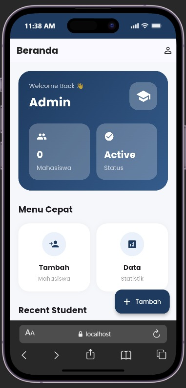
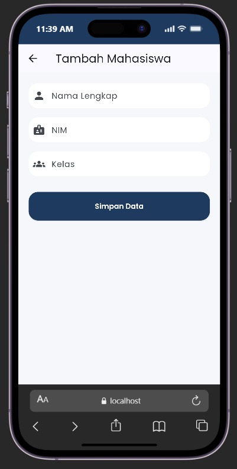
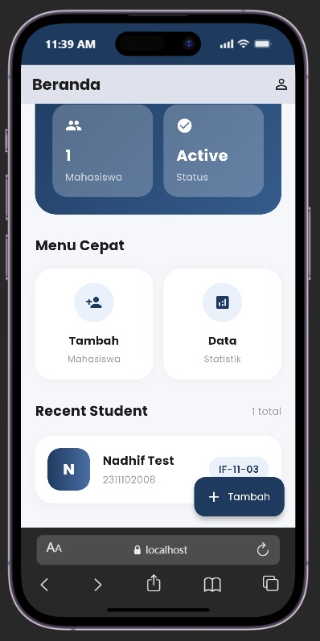
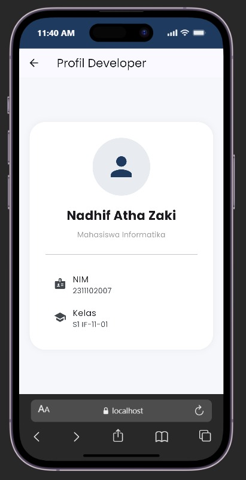

<div align="center">
  <br />

  <h1>
    LAPORAN PRAKTIKUM <br>
    APLIKASI BERBASIS PLATFORM
  </h1>

  <br />

  <h3>Modul 7 Mobile</h3>
  <h3>DATA MAHASISWA</h3>

  <br />

  <p align="center">
    
  </p>

  <br />
  <br />
  <br />

  <h3>Disusun Oleh :</h3>

  <p>
    <strong>Nadhif Atha Zaki</strong><br>
    <strong>2311102007</strong><br>
    <strong>S1 IF-11-01</strong>
  </p>

  <br />

  <h3>Dosen Pengampu :</h3>

  <p>
    <strong>Dimas Fanny Hebrasianto Permadi, S.ST., M.Kom</strong>
  </p>

  <br />
  <br />

  <h4>Asisten Praktikum :</h4>

  <strong>Apri Pandu Wicaksono</strong><br>
  <strong>Rangga Pradarrell Fathi</strong>

  <br />
  <br />

  <h3>
    LABORATORIUM HIGH PERFORMANCE
    <br>FAKULTAS INFORMATIKA
    <br>UNIVERSITAS TELKOM PURWOKERTO
    <br>2026
  </h3>
</div>

<hr>

## Dasar Teori

Flutter merupakan framework yang digunakan untuk membuat aplikasi multiplatform seperti Android, iOS, web, dan desktop hanya dengan satu basis kode. Dalam Flutter, tampilan aplikasi dibangun menggunakan widget. Setiap bagian aplikasi seperti teks, tombol, form input, ikon, layout, dan halaman dibuat dengan menyusun widget-widget yang tersedia.

Pada praktikum Modul 7 ini, aplikasi yang dibuat adalah aplikasi sederhana bertema **Data Mahasiswa** dengan nama **StudentHub**. Aplikasi ini memiliki tiga halaman utama, yaitu halaman dashboard, halaman tambah mahasiswa, dan halaman profil developer. Aplikasi dibuat dengan tampilan clean dan modern menggunakan tema warna biru navy serta font Poppins agar terlihat profesional dan nyaman digunakan.

Widget `MaterialApp` digunakan sebagai struktur utama aplikasi. Widget ini berfungsi untuk mengatur judul aplikasi, tema, font, warna, dan halaman pertama yang akan ditampilkan. Pada aplikasi ini, `MaterialApp` juga digunakan untuk menghilangkan tulisan debug di pojok kanan atas dengan properti `debugShowCheckedModeBanner: false`.

Widget `Scaffold` digunakan sebagai kerangka dasar pada setiap halaman aplikasi. Di dalam `Scaffold`, terdapat beberapa bagian seperti `AppBar`, `body`, dan `FloatingActionButton`. `AppBar` digunakan sebagai bagian header halaman, `body` digunakan untuk menampilkan isi utama aplikasi, sedangkan `FloatingActionButton` digunakan sebagai tombol cepat untuk menambahkan data mahasiswa baru.

Aplikasi ini menggunakan `StatelessWidget` dan `StatefulWidget`. `StatelessWidget` digunakan pada bagian yang tidak membutuhkan perubahan data secara langsung, seperti `MyApp` dan halaman profil developer. Sedangkan `StatefulWidget` digunakan pada halaman dashboard dan halaman form mahasiswa karena terdapat data yang dapat berubah, yaitu daftar mahasiswa yang ditambahkan oleh pengguna.

Navigasi antarhalaman dilakukan menggunakan `Navigator.push` dan `Navigator.pop`. `Navigator.push` digunakan untuk berpindah dari dashboard ke halaman tambah mahasiswa atau halaman profil developer. Sedangkan `Navigator.pop` digunakan untuk kembali ke halaman sebelumnya.

Pada halaman form mahasiswa, digunakan widget `TextField` untuk menerima input dari pengguna. Form tersebut berisi tiga input, yaitu nama lengkap, NIM, dan kelas. Untuk mengambil nilai dari input tersebut, digunakan `TextEditingController`. Setelah pengguna menekan tombol simpan, data akan diproses dan ditambahkan ke daftar mahasiswa yang tampil pada dashboard.

Aplikasi ini juga menggunakan `SnackBar` sebagai notifikasi. SnackBar akan muncul ketika semua data belum terisi oleh pengguna. Dengan adanya SnackBar, pengguna dapat mengetahui apakah proses input data berhasil atau masih terdapat data yang belum lengkap.

Package `google_fonts` digunakan untuk menerapkan font Poppins pada aplikasi. Font ini dipilih agar tampilan aplikasi lebih rapi, modern, dan nyaman dilihat. Selain itu, aplikasi juga menggunakan beberapa widget tambahan seperti `Container`, `Column`, `Row`, `Expanded`, `ListView.builder`, `ElevatedButton`, `Icon`, dan `CircleAvatar` untuk membuat tampilan aplikasi menjadi lebih tertata dan menarik.

## Code Program

```dart
import 'package:flutter/material.dart';
import 'package:google_fonts/google_fonts.dart';

void main() {
  runApp(const MyApp());
}

class Mahasiswa {
  final String nama;
  final String nim;
  final String kelas;

  Mahasiswa({required this.nama, required this.nim, required this.kelas});
}

class MyApp extends StatelessWidget {
  const MyApp({super.key});

  static const Color primaryBlue = Color(0xFF1E3A5F);
  static const Color secondaryBlue = Color(0xFF4A6FA5);
  static const Color bgColor = Color(0xFFF5F7FB);

  @override
  Widget build(BuildContext context) {
    return MaterialApp(
      debugShowCheckedModeBanner: false,
      title: 'StudentHub',
      theme: ThemeData(
        useMaterial3: true,
        scaffoldBackgroundColor: bgColor,
        textTheme: GoogleFonts.poppinsTextTheme(),
        colorScheme: ColorScheme.fromSeed(
          seedColor: primaryBlue,
          primary: primaryBlue,
        ),
      ),
      home: const DashboardPage(),
    );
  }
}

class DashboardPage extends StatefulWidget {
  const DashboardPage({super.key});

  @override
  State<DashboardPage> createState() => _DashboardPageState();
}

class _DashboardPageState extends State<DashboardPage> {
  final List<Mahasiswa> daftarMahasiswa = [];

  void tambahMahasiswa(Mahasiswa mahasiswa) {
    setState(() {
      daftarMahasiswa.add(mahasiswa);
    });
  }

  Widget buildInfoCard({
    required String title,
    required String value,
    required IconData icon,
  }) {
    return Container(
      padding: const EdgeInsets.all(18),
      decoration: BoxDecoration(
        color: Colors.white24,
        borderRadius: BorderRadius.circular(20),
      ),
      child: Column(
        crossAxisAlignment: CrossAxisAlignment.start,
        children: [
          Icon(icon, color: Colors.white),
          const SizedBox(height: 15),
          Text(
            value,
            style: GoogleFonts.poppins(
              color: Colors.white,
              fontSize: 22,
              fontWeight: FontWeight.bold,
            ),
          ),
          const SizedBox(height: 5),
          Text(title, style: GoogleFonts.poppins(color: Colors.white70)),
        ],
      ),
    );
  }

  Widget buildMenuCard({
    required IconData icon,
    required String title,
    required String subtitle,
  }) {
    return Container(
      padding: const EdgeInsets.all(20),
      decoration: BoxDecoration(
        color: Colors.white,
        borderRadius: BorderRadius.circular(25),
        boxShadow: [
          BoxShadow(color: Colors.black.withOpacity(0.04), blurRadius: 10),
        ],
      ),
      child: Column(
        children: [
          CircleAvatar(
            radius: 28,
            backgroundColor: const Color(0xFFEAF1FB),
            child: Icon(icon, color: const Color(0xFF1E3A5F)),
          ),
          const SizedBox(height: 15),
          Text(
            title,
            style: GoogleFonts.poppins(
              fontWeight: FontWeight.bold,
              fontSize: 16,
            ),
          ),
          const SizedBox(height: 5),
          Text(
            subtitle,
            style: GoogleFonts.poppins(color: Colors.grey, fontSize: 13),
          ),
        ],
      ),
    );
  }

  @override
  Widget build(BuildContext context) {
    const Color primaryBlue = Color(0xFF1E3A5F);

    return Scaffold(
      appBar: AppBar(
        title: Text(
          "StudentHub",
          style: GoogleFonts.poppins(
            fontWeight: FontWeight.bold,
            color: Colors.black87,
          ),
        ),
        actions: [
          IconButton(
            icon: const Icon(Icons.person_outline, color: Colors.black87),
            onPressed: () {
              Navigator.push(
                context,
                MaterialPageRoute(builder: (_) => const ProfilDeveloperPage()),
              );
            },
          ),
        ],
      ),
      body: SingleChildScrollView(
        padding: const EdgeInsets.all(20),
        child: Column(
          crossAxisAlignment: CrossAxisAlignment.start,
          children: [
            Container(
              width: double.infinity,
              padding: const EdgeInsets.all(25),
              decoration: BoxDecoration(
                gradient: const LinearGradient(
                  colors: [Color(0xFF1E3A5F), Color(0xFF355C8C)],
                  begin: Alignment.topLeft,
                  end: Alignment.bottomRight,
                ),
                borderRadius: BorderRadius.circular(30),
              ),
              child: Column(
                crossAxisAlignment: CrossAxisAlignment.start,
                children: [
                  Row(
                    mainAxisAlignment: MainAxisAlignment.spaceBetween,
                    children: [
                      Column(
                        crossAxisAlignment: CrossAxisAlignment.start,
                        children: [
                          Text(
                            "Welcome Back 👋",
                            style: GoogleFonts.poppins(
                              color: Colors.white70,
                              fontSize: 14,
                            ),
                          ),
                          const SizedBox(height: 8),
                          Text(
                            "StudentHub",
                            style: GoogleFonts.poppins(
                              color: Colors.white,
                              fontSize: 28,
                              fontWeight: FontWeight.bold,
                            ),
                          ),
                        ],
                      ),
                      Container(
                        padding: const EdgeInsets.all(15),
                        decoration: BoxDecoration(
                          color: Colors.white24,
                          borderRadius: BorderRadius.circular(20),
                        ),
                        child: const Icon(
                          Icons.school,
                          color: Colors.white,
                          size: 35,
                        ),
                      ),
                    ],
                  ),
                  const SizedBox(height: 30),
                  Row(
                    children: [
                      Expanded(
                        child: buildInfoCard(
                          title: "Mahasiswa",
                          value: "${daftarMahasiswa.length}",
                          icon: Icons.people,
                        ),
                      ),
                      const SizedBox(width: 15),
                      Expanded(
                        child: buildInfoCard(
                          title: "Status",
                          value: "Active",
                          icon: Icons.check_circle,
                        ),
                      ),
                    ],
                  ),
                ],
              ),
            ),
            const SizedBox(height: 30),
            Text(
              "Menu Cepat",
              style: GoogleFonts.poppins(
                fontSize: 20,
                fontWeight: FontWeight.bold,
              ),
            ),
            const SizedBox(height: 18),
            Row(
              children: [
                Expanded(
                  child: buildMenuCard(
                    icon: Icons.person_add,
                    title: "Tambah",
                    subtitle: "Mahasiswa",
                  ),
                ),
                const SizedBox(width: 15),
                Expanded(
                  child: buildMenuCard(
                    icon: Icons.analytics,
                    title: "Data",
                    subtitle: "Statistik",
                  ),
                ),
              ],
            ),
            const SizedBox(height: 30),
            Row(
              mainAxisAlignment: MainAxisAlignment.spaceBetween,
              children: [
                Text(
                  "Recent Student",
                  style: GoogleFonts.poppins(
                    fontSize: 20,
                    fontWeight: FontWeight.bold,
                  ),
                ),
                Text(
                  "${daftarMahasiswa.length} total",
                  style: GoogleFonts.poppins(color: Colors.grey),
                ),
              ],
            ),
            const SizedBox(height: 20),
            daftarMahasiswa.isEmpty
                ? Container(
                    width: double.infinity,
                    padding: const EdgeInsets.all(40),
                    decoration: BoxDecoration(
                      color: Colors.white,
                      borderRadius: BorderRadius.circular(25),
                    ),
                    child: Column(
                      children: [
                        Icon(
                          Icons.folder_open,
                          size: 80,
                          color: Colors.grey.shade400,
                        ),
                        const SizedBox(height: 20),
                        Text(
                          "Belum Ada Data",
                          style: GoogleFonts.poppins(
                            fontSize: 20,
                            fontWeight: FontWeight.bold,
                          ),
                        ),
                        const SizedBox(height: 10),
                        Text(
                          "Tambahkan mahasiswa baru",
                          style: GoogleFonts.poppins(color: Colors.grey),
                        ),
                      ],
                    ),
                  )
                : ListView.builder(
                    itemCount: daftarMahasiswa.length,
                    shrinkWrap: true,
                    physics: const NeverScrollableScrollPhysics(),
                    itemBuilder: (context, index) {
                      final mahasiswa = daftarMahasiswa[index];
                      return Container(
                        margin: const EdgeInsets.only(bottom: 15),
                        padding: const EdgeInsets.all(18),
                        decoration: BoxDecoration(
                          color: Colors.white,
                          borderRadius: BorderRadius.circular(25),
                          boxShadow: [
                            BoxShadow(
                              color: Colors.black.withOpacity(0.04),
                              blurRadius: 10,
                              offset: const Offset(0, 5),
                            ),
                          ],
                        ),
                        child: Row(
                          children: [
                            Container(
                              width: 60,
                              height: 60,
                              decoration: BoxDecoration(
                                gradient: const LinearGradient(
                                  colors: [
                                    Color(0xFF1E3A5F),
                                    Color(0xFF4A6FA5),
                                  ],
                                ),
                                borderRadius: BorderRadius.circular(18),
                              ),
                              child: Center(
                                child: Text(
                                  mahasiswa.nama[0].toUpperCase(),
                                  style: GoogleFonts.poppins(
                                    color: Colors.white,
                                    fontWeight: FontWeight.bold,
                                    fontSize: 22,
                                  ),
                                ),
                              ),
                            ),
                            const SizedBox(width: 18),
                            Expanded(
                              child: Column(
                                crossAxisAlignment: CrossAxisAlignment.start,
                                children: [
                                  Text(
                                    mahasiswa.nama,
                                    style: GoogleFonts.poppins(
                                      fontSize: 17,
                                      fontWeight: FontWeight.bold,
                                    ),
                                  ),
                                  const SizedBox(height: 5),
                                  Text(
                                    mahasiswa.nim,
                                    style: GoogleFonts.poppins(
                                      color: Colors.grey,
                                    ),
                                  ),
                                ],
                              ),
                            ),
                            Container(
                              padding: const EdgeInsets.symmetric(
                                horizontal: 14,
                                vertical: 8,
                              ),
                              decoration: BoxDecoration(
                                color: const Color(0xFFEAF1FB),
                                borderRadius: BorderRadius.circular(20),
                              ),
                              child: Text(
                                mahasiswa.kelas,
                                style: GoogleFonts.poppins(
                                  color: const Color(0xFF1E3A5F),
                                  fontWeight: FontWeight.w600,
                                ),
                              ),
                            ),
                          ],
                        ),
                      );
                    },
                  ),
          ],
        ),
      ),
      floatingActionButton: FloatingActionButton.extended(
        backgroundColor: primaryBlue,
        foregroundColor: Colors.white,
        onPressed: () {
          Navigator.push(
            context,
            MaterialPageRoute(
              builder: (_) => FormMahasiswaPage(onSimpan: tambahMahasiswa),
            ),
          );
        },
        icon: const Icon(Icons.add),
        label: const Text("Tambah"),
      ),
    );
  }
}

class FormMahasiswaPage extends StatefulWidget {
  final Function(Mahasiswa) onSimpan;

  const FormMahasiswaPage({super.key, required this.onSimpan});

  @override
  State<FormMahasiswaPage> createState() => _FormMahasiswaPageState();
}

class _FormMahasiswaPageState extends State<FormMahasiswaPage> {
  final namaController = TextEditingController();
  final nimController = TextEditingController();
  final kelasController = TextEditingController();

  void simpanData() {
    if (namaController.text.isEmpty ||
        nimController.text.isEmpty ||
        kelasController.text.isEmpty) {
      ScaffoldMessenger.of(
        context,
      ).showSnackBar(const SnackBar(content: Text("Semua data harus diisi")));
      return;
    }

    widget.onSimpan(
      Mahasiswa(
        nama: namaController.text,
        nim: nimController.text,
        kelas: kelasController.text,
      ),
    );

    Navigator.pop(context);
  }

  Widget buildTextField({
    required TextEditingController controller,
    required String label,
    required IconData icon,
  }) {
    return TextField(
      controller: controller,
      decoration: InputDecoration(
        prefixIcon: Icon(icon),
        labelText: label,
        filled: true,
        fillColor: Colors.white,
        border: OutlineInputBorder(
          borderRadius: BorderRadius.circular(18),
          borderSide: BorderSide.none,
        ),
      ),
    );
  }

  @override
  Widget build(BuildContext context) {
    const Color primaryBlue = Color(0xFF1E3A5F);

    return Scaffold(
      appBar: AppBar(title: const Text("Tambah Mahasiswa")),
      body: Padding(
        padding: const EdgeInsets.all(20),
        child: Column(
          children: [
            buildTextField(
              controller: namaController,
              label: "Nama Lengkap",
              icon: Icons.person,
            ),
            const SizedBox(height: 18),
            buildTextField(
              controller: nimController,
              label: "NIM",
              icon: Icons.badge,
            ),
            const SizedBox(height: 18),
            buildTextField(
              controller: kelasController,
              label: "Kelas",
              icon: Icons.groups,
            ),
            const SizedBox(height: 30),
            SizedBox(
              width: double.infinity,
              height: 55,
              child: ElevatedButton(
                style: ElevatedButton.styleFrom(
                  backgroundColor: primaryBlue,
                  foregroundColor: Colors.white,
                  shape: RoundedRectangleBorder(
                    borderRadius: BorderRadius.circular(18),
                  ),
                ),
                onPressed: simpanData,
                child: Text(
                  "Simpan Data",
                  style: GoogleFonts.poppins(fontWeight: FontWeight.w600),
                ),
              ),
            ),
          ],
        ),
      ),
    );
  }
}

class ProfilDeveloperPage extends StatelessWidget {
  const ProfilDeveloperPage({super.key});

  @override
  Widget build(BuildContext context) {
    const Color primaryBlue = Color(0xFF1E3A5F);

    return Scaffold(
      appBar: AppBar(title: const Text("Profil Developer")),
      body: Center(
        child: Padding(
          padding: const EdgeInsets.all(20),
          child: Container(
            width: double.infinity,
            padding: const EdgeInsets.all(30),
            decoration: BoxDecoration(
              color: Colors.white,
              borderRadius: BorderRadius.circular(30),
              boxShadow: [
                BoxShadow(
                  color: Colors.black.withOpacity(0.05),
                  blurRadius: 10,
                ),
              ],
            ),
            child: Column(
              mainAxisSize: MainAxisSize.min,
              children: [
                CircleAvatar(
                  radius: 55,
                  backgroundColor: primaryBlue.withOpacity(0.1),
                  child: const Icon(Icons.person, size: 60, color: primaryBlue),
                ),
                const SizedBox(height: 20),
                Text(
                  "Nadhif Atha Zaki",
                  style: GoogleFonts.poppins(
                    fontSize: 24,
                    fontWeight: FontWeight.bold,
                  ),
                ),
                const SizedBox(height: 10),
                Text(
                  "Mahasiswa Informatika",
                  style: GoogleFonts.poppins(color: Colors.grey),
                ),
                const SizedBox(height: 20),
                const Divider(),
                const SizedBox(height: 15),
                ListTile(
                  leading: const Icon(Icons.badge),
                  title: Text("NIM", style: GoogleFonts.poppins()),
                  subtitle: Text("2311102007", style: GoogleFonts.poppins()),
                ),
                ListTile(
                  leading: const Icon(Icons.school),
                  title: Text("Kelas", style: GoogleFonts.poppins()),
                  subtitle: Text("S1 IF-11-01", style: GoogleFonts.poppins()),
                ),
              ],
            ),
          ),
        ),
      ),
    );
  }
}
```

## Penjelasan Program

Program Flutter ini diawali dengan melakukan import package `material.dart` dan `google_fonts.dart`. Package `material.dart` digunakan untuk memakai komponen Material Design seperti `MaterialApp`, `Scaffold`, `AppBar`, `TextField`, `ElevatedButton`, `SnackBar`, dan beberapa widget lainnya. Sedangkan package `google_fonts.dart` digunakan agar aplikasi dapat memakai font Poppins, sehingga tampilan aplikasi terlihat lebih modern dan rapi.

Fungsi `main()` merupakan fungsi utama yang pertama kali dijalankan saat aplikasi dibuka. Di dalam fungsi tersebut terdapat `runApp(const MyApp());` yang berfungsi untuk menjalankan widget utama aplikasi, yaitu `MyApp`.

Pada program ini terdapat class `Mahasiswa` yang digunakan sebagai model data. Class ini memiliki tiga atribut, yaitu `nama`, `nim`, dan `kelas`. Data dari class ini nantinya digunakan untuk menyimpan input mahasiswa yang dimasukkan oleh pengguna melalui halaman form.

Class `MyApp` merupakan turunan dari `StatelessWidget`. Pada class ini, aplikasi menggunakan `MaterialApp` sebagai struktur utama. Di dalam `MaterialApp`, terdapat pengaturan title aplikasi dengan nama `StudentHub`, menghilangkan banner debug menggunakan `debugShowCheckedModeBanner: false`, dan pengaturan tema aplikasi menggunakan `ThemeData`. Tema aplikasi menggunakan warna biru navy (`primaryBlue = Color(0xFF1E3A5F)`) sebagai warna utama dengan latar belakang abu-abu terang (`bgColor = Color(0xFFF5F7FB)`). Pada bagian `ThemeData`, digunakan `GoogleFonts.poppinsTextTheme()` agar seluruh teks dalam aplikasi menggunakan font Poppins.

Halaman utama aplikasi adalah `DashboardPage`. Class ini menggunakan `StatefulWidget` karena data mahasiswa yang tampil di dashboard dapat berubah ketika pengguna menambahkan data baru. Di dalam `_DashboardPageState`, terdapat variabel `daftarMahasiswa` dengan tipe `List<Mahasiswa>` yang digunakan untuk menyimpan seluruh data mahasiswa yang sudah ditambahkan.

Method `tambahMahasiswa()` digunakan untuk menambahkan data mahasiswa baru ke dalam list `daftarMahasiswa`. Method ini menggunakan `setState()` agar tampilan dashboard langsung diperbarui ketika data baru berhasil ditambahkan. Dengan begitu, data mahasiswa yang diinput dari form dapat langsung tampil di halaman dashboard.

Pada `_DashboardPageState` terdapat dua helper widget, yaitu `buildInfoCard()` dan `buildMenuCard()`. Widget `buildInfoCard()` digunakan untuk menampilkan kartu informasi di dalam banner header dashboard, seperti jumlah mahasiswa dan status aktif. Widget `buildMenuCard()` digunakan untuk membuat kartu menu cepat berupa tombol Tambah Mahasiswa dan Data Statistik.

Pada halaman dashboard, tampilan dibuat menggunakan `Scaffold` dengan `AppBar` berjudul `StudentHub`. Pada bagian kanan `AppBar`, terdapat icon profil yang dapat ditekan untuk membuka halaman profil developer. Navigasi ke halaman profil dilakukan menggunakan `Navigator.push`.

Bagian utama dashboard menggunakan widget `SingleChildScrollView` agar konten dapat di-scroll. Di dalamnya terdapat widget `Column` untuk menyusun komponen secara vertikal. Di bagian atas terdapat `Container` berbentuk banner dengan warna gradasi biru navy. Banner ini menampilkan sapaan "Welcome Back 👋", nama aplikasi, icon sekolah, serta dua buah `InfoCard` yang menampilkan jumlah mahasiswa terdaftar dan status aktif.

Di bawah banner terdapat bagian "Menu Cepat" yang memuat dua `MenuCard` berjajar secara horizontal menggunakan `Row` dan `Expanded`. Menu card pertama berlabel "Tambah Mahasiswa" dan menu card kedua berlabel "Data Statistik".

Di bawah bagian menu cepat terdapat bagian "Recent Student" yang menampilkan daftar mahasiswa. Jika belum ada data yang ditambahkan, maka aplikasi akan menampilkan tampilan kosong berisi icon `folder_open` dan teks "Belum Ada Data". Namun, jika sudah ada data mahasiswa, maka data akan ditampilkan menggunakan `ListView.builder` dengan parameter `shrinkWrap: true` dan `NeverScrollableScrollPhysics` agar list dapat bekerja di dalam `SingleChildScrollView`.

Setiap item mahasiswa ditampilkan dalam bentuk card menggunakan `Container`. Di dalam card terdapat avatar berbentuk kotak dengan sudut melengkung yang menampilkan inisial huruf pertama nama mahasiswa menggunakan gradasi warna biru. Selain itu terdapat nama lengkap, NIM, serta label kelas yang ditampilkan dalam badge berwarna biru muda.

Pada bagian bawah kanan dashboard terdapat `FloatingActionButton.extended` dengan teks "Tambah". Tombol ini digunakan untuk berpindah ke halaman tambah mahasiswa. Ketika tombol ditekan, aplikasi akan menjalankan `Navigator.push` menuju halaman `FormMahasiswaPage`.

Class `FormMahasiswaPage` merupakan halaman untuk mengisi data mahasiswa. Halaman ini menggunakan `StatefulWidget` karena terdapat input yang dikontrol menggunakan `TextEditingController`. Terdapat tiga controller, yaitu `namaController`, `nimController`, dan `kelasController`, yang masing-masing digunakan untuk mengambil nilai dari input nama, NIM, dan kelas.

Pada halaman form, terdapat helper widget `buildTextField()` yang digunakan untuk membuat `TextField` secara konsisten. Setiap `TextField` memiliki `prefixIcon`, `labelText`, serta tampilan yang sama dengan `fillColor` putih dan sudut melengkung menggunakan `OutlineInputBorder`.

Pada method `simpanData()`, program mengambil nilai dari setiap `TextField` menggunakan properti `.text`. Setelah itu, program melakukan validasi sederhana. Jika salah satu input masih kosong, maka akan muncul `SnackBar` dengan pesan "Semua data harus diisi". Jika semua data sudah lengkap, maka program akan membuat object baru dari class `Mahasiswa` yang berisi nama, NIM, dan kelas. Setelah itu, data dikirim kembali ke dashboard melalui `widget.onSimpan(mahasiswa)` dan halaman form langsung ditutup menggunakan `Navigator.pop`.

Class `ProfilDeveloperPage` digunakan untuk menampilkan profil developer aplikasi. Halaman ini menggunakan `StatelessWidget` karena tidak ada data yang berubah. Pada halaman profil, ditampilkan avatar icon profil, nama developer yaitu **Nadhif Atha Zaki**, keterangan "Mahasiswa Informatika", serta dua `ListTile` yang masing-masing menampilkan NIM `2311102007` dan kelas `S1 IF-11-01`. Seluruh tampilan profil dibungkus dalam `Container` berdesain card putih dengan `BoxShadow` agar terlihat bersih dan profesional.

Secara keseluruhan, aplikasi ini sudah menerapkan beberapa ketentuan pada praktikum, yaitu penggunaan `StatefulWidget`, `StatelessWidget`, `Navigator.push`, `Navigator.pop`, package Google Fonts, `AppBar`, `Container`, `Column`, `Row`, `ElevatedButton`, `FloatingActionButton`, `Icon`, `CircleAvatar`, serta tema warna biru navy yang konsisten. Selain itu, aplikasi juga dapat menampilkan data mahasiswa yang diinput ke halaman dashboard dan memberikan notifikasi menggunakan `SnackBar`.

## Tampilan

### 1. Tampilan Dashboard Ketika Belum Ada Data



### 2. Tampilan Form Tambah Mahasiswa



### 3. Tampilan Dashboard Setelah Data Ditambahkan



### 4. Tampilan Profil Developer



## Kesimpulan

Berdasarkan praktikum yang telah dilakukan, dapat disimpulkan bahwa Flutter dapat digunakan untuk membuat aplikasi sederhana dengan beberapa halaman yang saling terhubung. Pada aplikasi StudentHub, pengguna dapat berpindah dari dashboard ke halaman form mahasiswa dan halaman profil developer menggunakan `Navigator.push`, serta kembali ke halaman sebelumnya menggunakan `Navigator.pop`.

Aplikasi ini menggunakan `StatefulWidget` pada halaman dashboard dan form mahasiswa karena terdapat data yang dapat berubah, yaitu daftar mahasiswa yang ditambahkan oleh pengguna. Perubahan data dilakukan menggunakan `setState()`, sehingga tampilan dashboard dapat langsung diperbarui ketika data baru berhasil disimpan.

Form mahasiswa dibuat menggunakan `TextField` dan `TextEditingController` untuk mengambil input berupa nama, NIM, dan kelas melalui helper widget `buildTextField()`. Setelah tombol simpan ditekan, data akan divalidasi terlebih dahulu. Jika data masih kosong, aplikasi akan menampilkan notifikasi menggunakan `SnackBar`. Jika data sudah lengkap, data mahasiswa akan langsung muncul di dashboard dan halaman form akan otomatis tertutup.

Selain memenuhi fungsi utama, aplikasi ini juga dibuat dengan tampilan bersih dan profesional menggunakan tema warna biru navy serta font Poppins dari package `google_fonts`. Dari praktikum ini, dapat dipahami bahwa penggunaan widget seperti `MaterialApp`, `Scaffold`, `AppBar`, `Container`, `Column`, `Row`, `TextField`, `ElevatedButton`, `FloatingActionButton`, `SnackBar`, dan `ListView.builder` sangat penting dalam membangun aplikasi Flutter yang interaktif dan nyaman digunakan.
