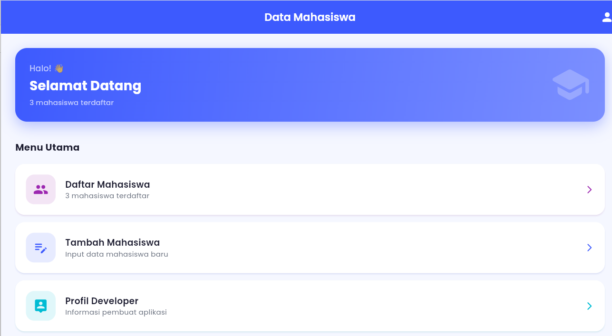
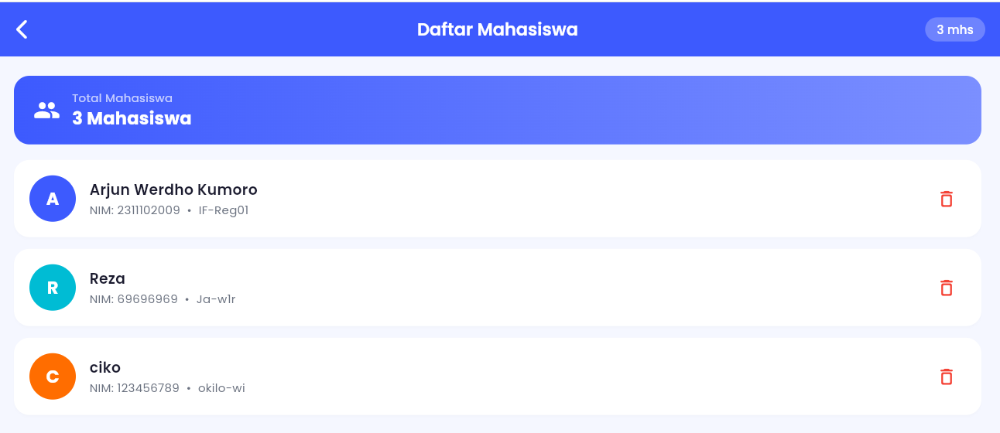
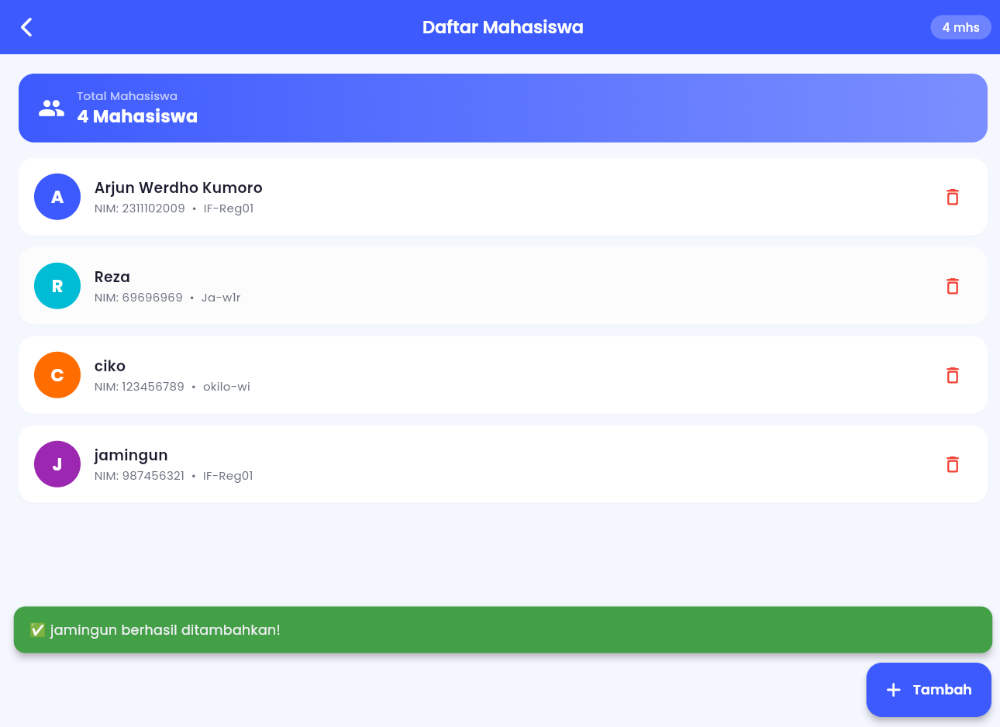

<div align="center">
  <br />
  <h1>LAPORAN PRAKTIKUM <br>APLIKASI BERBASIS PLATFORM</h1>
  <br />
  <h3>MODUL 07 - Flutter <br> Data Mahasiswa  </h3>
  <br />
   
  <br />
  <br />
  <br />
  <h3>Disusun Oleh :</h3>
  <p>
    <strong>Arjun Werdho Kumoro</strong><br>
    <strong>2311102009</strong><br>
    <strong>IF-11-REG01</strong>
  </p>
  <br />
  <h3>Dosen Pengampu :</h3>
  <p>
    <strong>Dimas Fanny Hebrasianto Permadi, S.ST., M.Kom</strong>
  </p>
  <br />
  <br />
    <h4>Asisten Praktikum :</h4>
    <strong> Apri Pandu Wicaksono </strong> <br>
    <strong>Rangga Pradarrell Fathi</strong>
  <br />
  <h3>LABORATORIUM HIGH PERFORMANCE
 <br>FAKULTAS INFORMATIKA <br>UNIVERSITAS TELKOM PURWOKERTO <br>2026</h3>
</div>


---

## 📋 Deskripsi Aplikasi

Aplikasi **Data Mahasiswa** adalah aplikasi mobile berbasis Flutter yang memungkinkan pengguna untuk mengelola data mahasiswa secara sederhana. Aplikasi ini memiliki 3 halaman utama yaitu Home, Form Mahasiswa, dan Profil Developer, serta halaman tambahan Daftar Mahasiswa.

---

## 🗂️ Struktur Project

```
data_mahasiswa/
├── pubspec.yaml                        # Konfigurasi project & dependencies
│
└── lib/
    ├── main.dart                       # Entry point aplikasi
    │
    ├── theme/
    │   └── app_theme.dart              # Konfigurasi tema & palet warna
    │
    ├── models/
    │   └── mahasiswa_model.dart        # Model data Mahasiswa
    │
    ├── widgets/
    │   └── custom_widgets.dart         # Widget reusable:
    │                                   #   • CustomTextField
    │                                   #   • InfoCard
    │                                   #   • SectionHeader
    └── pages/
        ├── home_page.dart              # Halaman 1: Home
        ├── form_mahasiswa_page.dart    # Halaman 2: Form input mahasiswa
        ├── daftar_mahasiswa_page.dart  # Halaman 3: Daftar mahasiswa
        └── profil_developer_page.dart  # Halaman 4: Profil developer
```

---

## ✅ Fitur yang Diimplementasikan

### Fitur Wajib
| No | Fitur | Status |
|---|---|---|
| 1 | Halaman Home | ✅ |
| 2 | Halaman Form Mahasiswa (Nama, NIM, Kelas) | ✅ |
| 3 | Halaman Profil Developer | ✅ |
| 4 | Tombol Simpan pada Form | ✅ |
| 5 | SnackBar notifikasi berhasil simpan | ✅ |
| 6 | `StatefulWidget` | ✅ |
| 7 | `StatelessWidget` | ✅ |
| 8 | `Navigator.push` & `Navigator.pop` | ✅ |
| 9 | Google Fonts package | ✅ |
| 10 | AppBar | ✅ |
| 11 | Container | ✅ |
| 12 | Column | ✅ |
| 13 | ElevatedButton | ✅ |

### Fitur Bonus
| No | Fitur | Status |
|---|---|---|
| 1 | Icon pada setiap halaman dan tombol | ✅ |
| 2 | Tema warna menarik (gradient indigo-purple) | ✅ |

### Fitur Tambahan
| No | Fitur | Keterangan |
|---|---|---|
| 1 | Halaman Daftar Mahasiswa | Menampilkan semua data mahasiswa yang ditambahkan |
| 2 | Tambah Mahasiswa baru | Form input yang mengembalikan data ke halaman daftar |
| 3 | Hapus Mahasiswa | Konfirmasi dialog sebelum menghapus |
| 4 | Detail Mahasiswa | Bottom sheet untuk melihat detail |
| 5 | Empty State | Tampilan khusus saat belum ada data |
| 6 | State Management | Data tersimpan di `HomePage` agar tidak hilang saat navigasi |

---

## 📦 Dependencies

```yaml
dependencies:
  flutter:
    sdk: flutter
  google_fonts: ^6.2.1
  cupertino_icons: ^1.0.8
```

---

## 🏗️ Konsep yang Digunakan

### 1. StatefulWidget vs StatelessWidget
- **StatelessWidget** digunakan pada `ProfilDeveloperPage` dan widget-widget kecil yang tidak membutuhkan perubahan state.
- **StatefulWidget** digunakan pada `HomePage`, `FormMahasiswaPage`, dan `DaftarMahasiswaPage` karena membutuhkan `setState()` untuk memperbarui tampilan.

### 2. Navigator.push & Navigator.pop
```dart
// Push ke halaman baru dan tunggu hasil (return value)
final result = await Navigator.push<MahasiswaModel>(
  context,
  MaterialPageRoute(builder: (_) => const FormMahasiswaPage()),
);

// Pop dan kembalikan data ke halaman sebelumnya
Navigator.pop(context, data);
```

### 3. State Management (Lifting State Up)
Data list mahasiswa disimpan di `HomePage` (parent) dan di-pass ke `DaftarMahasiswaPage` (child) agar data tidak hilang saat berpindah halaman.

```dart
// Di HomePage — list disimpan di sini
final List<MahasiswaModel> _daftarMahasiswa = [];

// Di-pass ke DaftarMahasiswaPage
DaftarMahasiswaPage(
  daftarMahasiswa: _daftarMahasiswa,
  onDataChanged: () => setState(() {}),
)
```

### 4. Google Fonts
```dart
Text(
  'Selamat Datang',
  style: GoogleFonts.poppins(
    fontSize: 22,
    fontWeight: FontWeight.bold,
  ),
)
```

### 5. SnackBar
```dart
ScaffoldMessenger.of(context).showSnackBar(
  SnackBar(
    content: Text('✅ Data berhasil disimpan!'),
    backgroundColor: Colors.green,
    behavior: SnackBarBehavior.floating,
  ),
);
```

---

## 🎨 Tema & Warna

| Nama | Hex | Kegunaan |
|---|---|---|
| Primary | `#3D5AFE` | Warna utama, AppBar, tombol |
| Secondary | `#00BCD4` | Aksen kedua, info card |
| Accent | `#FF6D00` | Peringatan, aksen ketiga |
| Background | `#F5F7FF` | Latar halaman |
| Text Dark | `#1A1A2E` | Teks utama |
| Text Light | `#6B7280` | Teks sekunder / placeholder |

---

## 🔄 Alur Navigasi

```
HomePage
  ├──► DaftarMahasiswaPage
  │         └──► FormMahasiswaPage ──► (pop + return data) ──► DaftarMahasiswaPage
  │
  ├──► FormMahasiswaPage ──► (pop + return data) ──► HomePage
  │
  └──► ProfilDeveloperPage
```

---

## ▶️ Cara Menjalankan

```bash
# 1. Masuk ke folder project
cd data_mahasiswa

# 2. Install dependencies
flutter pub get

# 3. Jalankan aplikasi
flutter run
```

---

## 💻 Source Code Lengkap

### 📄 `pubspec.yaml`

```yaml
name: data_mahasiswa
description: Aplikasi Data Mahasiswa - Modul 7 Flutter

publish_to: 'none'
version: 1.0.0+1

environment:
  sdk: '>=3.0.0 <4.0.0'

dependencies:
  flutter:
    sdk: flutter
  google_fonts: ^6.2.1
  cupertino_icons: ^1.0.8

dev_dependencies:
  flutter_test:
    sdk: flutter
  flutter_lints: ^3.0.0

flutter:
  uses-material-design: true
```

---

### 📄 `lib/main.dart`

```dart
import 'package:flutter/material.dart';
import 'theme/app_theme.dart';
import 'pages/home_page.dart';

void main() {
  runApp(const MyApp());
}

class MyApp extends StatelessWidget {
  const MyApp({super.key});

  @override
  Widget build(BuildContext context) {
    return MaterialApp(
      title: 'Data Mahasiswa',
      debugShowCheckedModeBanner: false,
      theme: AppTheme.lightTheme,
      home: const HomePage(),
    );
  }
}
```

---

### 📄 `lib/theme/app_theme.dart`

```dart
import 'package:flutter/material.dart';
import 'package:google_fonts/google_fonts.dart';

class AppTheme {
  static const Color primary     = Color(0xFF3D5AFE);
  static const Color secondary   = Color(0xFF00BCD4);
  static const Color accent      = Color(0xFFFF6D00);
  static const Color background  = Color(0xFFF5F7FF);
  static const Color cardColor   = Colors.white;
  static const Color textDark    = Color(0xFF1A1A2E);
  static const Color textLight   = Color(0xFF6B7280);

  static ThemeData get lightTheme => ThemeData(
    useMaterial3: true,
    colorScheme: ColorScheme.fromSeed(
      seedColor: primary,
      secondary: secondary,
      background: background,
    ),
    scaffoldBackgroundColor: background,
    textTheme: GoogleFonts.poppinsTextTheme(),
    appBarTheme: AppBarTheme(
      backgroundColor: primary,
      foregroundColor: Colors.white,
      elevation: 0,
      centerTitle: true,
      titleTextStyle: GoogleFonts.poppins(
        fontSize: 18,
        fontWeight: FontWeight.w600,
        color: Colors.white,
      ),
    ),
    elevatedButtonTheme: ElevatedButtonThemeData(
      style: ElevatedButton.styleFrom(
        backgroundColor: primary,
        foregroundColor: Colors.white,
        elevation: 2,
        shape: RoundedRectangleBorder(
          borderRadius: BorderRadius.circular(14),
        ),
        padding: const EdgeInsets.symmetric(vertical: 14),
        textStyle: GoogleFonts.poppins(
          fontWeight: FontWeight.w600,
          fontSize: 15,
        ),
      ),
    ),
    inputDecorationTheme: InputDecorationTheme(
      filled: true,
      fillColor: Colors.white,
      contentPadding: const EdgeInsets.symmetric(horizontal: 16, vertical: 14),
      border: OutlineInputBorder(
        borderRadius: BorderRadius.circular(14),
        borderSide: const BorderSide(color: Color(0xFFE0E0E0)),
      ),
      enabledBorder: OutlineInputBorder(
        borderRadius: BorderRadius.circular(14),
        borderSide: const BorderSide(color: Color(0xFFE0E0E0)),
      ),
      focusedBorder: OutlineInputBorder(
        borderRadius: BorderRadius.circular(14),
        borderSide: const BorderSide(color: primary, width: 2),
      ),
      labelStyle: GoogleFonts.poppins(color: textLight),
      floatingLabelStyle: GoogleFonts.poppins(color: primary),
    ),
  );
}
```

---

### 📄 `lib/models/mahasiswa_model.dart`

```dart
class MahasiswaModel {
  final String nama;
  final String nim;
  final String kelas;

  MahasiswaModel({
    required this.nama,
    required this.nim,
    required this.kelas,
  });
}
```

---

### 📄 `lib/widgets/custom_widgets.dart`

```dart
import 'package:flutter/material.dart';
import 'package:google_fonts/google_fonts.dart';
import '../theme/app_theme.dart';

// ─── Custom TextField ────────────────────────────────────────────────────────
class CustomTextField extends StatelessWidget {
  final TextEditingController controller;
  final String label;
  final IconData icon;
  final TextInputType keyboardType;

  const CustomTextField({
    super.key,
    required this.controller,
    required this.label,
    required this.icon,
    this.keyboardType = TextInputType.text,
  });

  @override
  Widget build(BuildContext context) {
    return TextField(
      controller: controller,
      keyboardType: keyboardType,
      style: GoogleFonts.poppins(fontSize: 14, color: AppTheme.textDark),
      decoration: InputDecoration(
        labelText: label,
        prefixIcon: Icon(icon, color: AppTheme.primary, size: 20),
      ),
    );
  }
}

// ─── Info Card ───────────────────────────────────────────────────────────────
class InfoCard extends StatelessWidget {
  final IconData icon;
  final String label;
  final String value;
  final Color color;

  const InfoCard({
    super.key,
    required this.icon,
    required this.label,
    required this.value,
    this.color = AppTheme.primary,
  });

  @override
  Widget build(BuildContext context) {
    return Container(
      margin: const EdgeInsets.only(bottom: 12),
      padding: const EdgeInsets.symmetric(horizontal: 16, vertical: 14),
      decoration: BoxDecoration(
        color: color.withOpacity(0.08),
        borderRadius: BorderRadius.circular(14),
        border: Border.all(color: color.withOpacity(0.25)),
      ),
      child: Row(
        children: [
          Container(
            padding: const EdgeInsets.all(8),
            decoration: BoxDecoration(
              color: color.withOpacity(0.15),
              borderRadius: BorderRadius.circular(10),
            ),
            child: Icon(icon, color: color, size: 20),
          ),
          const SizedBox(width: 14),
          Column(
            crossAxisAlignment: CrossAxisAlignment.start,
            children: [
              Text(label,
                  style: GoogleFonts.poppins(
                      fontSize: 11,
                      color: AppTheme.textLight,
                      fontWeight: FontWeight.w500)),
              Text(value,
                  style: GoogleFonts.poppins(
                      fontSize: 15,
                      color: AppTheme.textDark,
                      fontWeight: FontWeight.w600)),
            ],
          ),
        ],
      ),
    );
  }
}

// ─── Section Header ──────────────────────────────────────────────────────────
class SectionHeader extends StatelessWidget {
  final String title;

  const SectionHeader({super.key, required this.title});

  @override
  Widget build(BuildContext context) {
    return Row(
      children: [
        Container(
          width: 4,
          height: 20,
          decoration: BoxDecoration(
            color: AppTheme.primary,
            borderRadius: BorderRadius.circular(2),
          ),
        ),
        const SizedBox(width: 8),
        Text(
          title,
          style: GoogleFonts.poppins(
            fontSize: 16,
            fontWeight: FontWeight.w700,
            color: AppTheme.textDark,
          ),
        ),
      ],
    );
  }
}
```

---

### 📄 `lib/pages/home_page.dart`

```dart
import 'package:flutter/material.dart';
import 'package:google_fonts/google_fonts.dart';
import '../theme/app_theme.dart';
import '../models/mahasiswa_model.dart';
import 'daftar_mahasiswa_page.dart';
import 'form_mahasiswa_page.dart';
import 'profil_developer_page.dart';

class HomePage extends StatefulWidget {
  const HomePage({super.key});

  @override
  State<HomePage> createState() => _HomePageState();
}

class _HomePageState extends State<HomePage> {
  final List<MahasiswaModel> _daftarMahasiswa = [];

  @override
  Widget build(BuildContext context) {
    return Scaffold(
      appBar: AppBar(
        title: const Text('Data Mahasiswa'),
        actions: [
          IconButton(
            icon: const Icon(Icons.person_rounded),
            onPressed: () => Navigator.push(context,
                MaterialPageRoute(builder: (_) => const ProfilDeveloperPage())),
          ),
        ],
      ),
      body: SingleChildScrollView(
        padding: const EdgeInsets.all(24),
        child: Column(
          crossAxisAlignment: CrossAxisAlignment.start,
          children: [
            // ── Hero Banner ──────────────────────────────────────────
            Container(
              width: double.infinity,
              padding: const EdgeInsets.all(24),
              decoration: BoxDecoration(
                gradient: const LinearGradient(
                  colors: [AppTheme.primary, Color(0xFF7B8FFF)],
                  begin: Alignment.topLeft,
                  end: Alignment.bottomRight,
                ),
                borderRadius: BorderRadius.circular(20),
                boxShadow: [
                  BoxShadow(
                    color: AppTheme.primary.withOpacity(0.35),
                    blurRadius: 20,
                    offset: const Offset(0, 8),
                  ),
                ],
              ),
              child: Row(
                children: [
                  Expanded(
                    child: Column(
                      crossAxisAlignment: CrossAxisAlignment.start,
                      children: [
                        Text('Halo! 👋',
                            style: GoogleFonts.poppins(
                                color: Colors.white70, fontSize: 14)),
                        const SizedBox(height: 4),
                        Text('Selamat Datang',
                            style: GoogleFonts.poppins(
                                color: Colors.white,
                                fontSize: 22,
                                fontWeight: FontWeight.bold)),
                        const SizedBox(height: 4),
                        Text('${_daftarMahasiswa.length} mahasiswa terdaftar',
                            style: GoogleFonts.poppins(
                                color: Colors.white70, fontSize: 12)),
                      ],
                    ),
                  ),
                  const Icon(Icons.school_rounded,
                      size: 70, color: Colors.white24),
                ],
              ),
            ),

            const SizedBox(height: 32),

            Text('Menu Utama',
                style: GoogleFonts.poppins(
                    fontSize: 16,
                    fontWeight: FontWeight.w700,
                    color: AppTheme.textDark)),
            const SizedBox(height: 16),

            _MenuCard(
              icon: Icons.people_rounded,
              title: 'Daftar Mahasiswa',
              subtitle: '${_daftarMahasiswa.length} mahasiswa terdaftar',
              color: const Color(0xFF9C27B0),
              onTap: () async {
                await Navigator.push(
                  context,
                  MaterialPageRoute(
                    builder: (_) => DaftarMahasiswaPage(
                      daftarMahasiswa: _daftarMahasiswa,
                      onDataChanged: () => setState(() {}),
                    ),
                  ),
                );
                setState(() {});
              },
            ),
            const SizedBox(height: 12),
            _MenuCard(
              icon: Icons.edit_note_rounded,
              title: 'Tambah Mahasiswa',
              subtitle: 'Input data mahasiswa baru',
              color: AppTheme.primary,
              onTap: () async {
                final result = await Navigator.push<MahasiswaModel>(
                  context,
                  MaterialPageRoute(builder: (_) => const FormMahasiswaPage()),
                );
                if (result != null) {
                  setState(() => _daftarMahasiswa.add(result));
                }
              },
            ),
            const SizedBox(height: 12),
            _MenuCard(
              icon: Icons.person_pin_rounded,
              title: 'Profil Developer',
              subtitle: 'Informasi pembuat aplikasi',
              color: AppTheme.secondary,
              onTap: () => Navigator.push(context,
                  MaterialPageRoute(builder: (_) => const ProfilDeveloperPage())),
            ),
          ],
        ),
      ),
    );
  }
}

class _MenuCard extends StatelessWidget {
  final IconData icon;
  final String title;
  final String subtitle;
  final Color color;
  final VoidCallback onTap;

  const _MenuCard({
    required this.icon,
    required this.title,
    required this.subtitle,
    required this.color,
    required this.onTap,
  });

  @override
  Widget build(BuildContext context) {
    return Material(
      color: Colors.white,
      borderRadius: BorderRadius.circular(16),
      elevation: 2,
      shadowColor: color.withOpacity(0.2),
      child: InkWell(
        borderRadius: BorderRadius.circular(16),
        onTap: onTap,
        child: Padding(
          padding: const EdgeInsets.all(18),
          child: Row(
            children: [
              Container(
                padding: const EdgeInsets.all(12),
                decoration: BoxDecoration(
                  color: color.withOpacity(0.12),
                  borderRadius: BorderRadius.circular(14),
                ),
                child: Icon(icon, color: color, size: 26),
              ),
              const SizedBox(width: 16),
              Expanded(
                child: Column(
                  crossAxisAlignment: CrossAxisAlignment.start,
                  children: [
                    Text(title,
                        style: GoogleFonts.poppins(
                            fontWeight: FontWeight.w600,
                            fontSize: 15,
                            color: AppTheme.textDark)),
                    Text(subtitle,
                        style: GoogleFonts.poppins(
                            fontSize: 12, color: AppTheme.textLight)),
                  ],
                ),
              ),
              Icon(Icons.arrow_forward_ios_rounded, size: 16, color: color),
            ],
          ),
        ),
      ),
    );
  }
}
```

---

### 📄 `lib/pages/form_mahasiswa_page.dart`

```dart
import 'package:flutter/material.dart';
import 'package:google_fonts/google_fonts.dart';
import '../theme/app_theme.dart';
import '../models/mahasiswa_model.dart';
import '../widgets/custom_widgets.dart';

class FormMahasiswaPage extends StatefulWidget {
  const FormMahasiswaPage({super.key});

  @override
  State<FormMahasiswaPage> createState() => _FormMahasiswaPageState();
}

class _FormMahasiswaPageState extends State<FormMahasiswaPage> {
  final _namaController  = TextEditingController();
  final _nimController   = TextEditingController();
  final _kelasController = TextEditingController();

  void _simpan() {
    if (_namaController.text.isEmpty ||
        _nimController.text.isEmpty ||
        _kelasController.text.isEmpty) {
      ScaffoldMessenger.of(context).showSnackBar(
        SnackBar(
          content: Text('⚠️  Semua field harus diisi!',
              style: GoogleFonts.poppins()),
          backgroundColor: AppTheme.accent,
          behavior: SnackBarBehavior.floating,
          shape: RoundedRectangleBorder(
              borderRadius: BorderRadius.circular(12)),
        ),
      );
      return;
    }

    final data = MahasiswaModel(
      nama: _namaController.text.trim(),
      nim: _nimController.text.trim(),
      kelas: _kelasController.text.trim(),
    );

    Navigator.pop(context, data);
  }

  void _reset() {
    _namaController.clear();
    _nimController.clear();
    _kelasController.clear();
  }

  @override
  void dispose() {
    _namaController.dispose();
    _nimController.dispose();
    _kelasController.dispose();
    super.dispose();
  }

  @override
  Widget build(BuildContext context) {
    return Scaffold(
      appBar: AppBar(
        title: const Text('Tambah Mahasiswa'),
        leading: IconButton(
          icon: const Icon(Icons.arrow_back_ios_new_rounded),
          onPressed: () => Navigator.pop(context),
        ),
      ),
      body: SingleChildScrollView(
        padding: const EdgeInsets.all(24),
        child: Container(
          padding: const EdgeInsets.all(20),
          decoration: BoxDecoration(
            color: Colors.white,
            borderRadius: BorderRadius.circular(20),
            boxShadow: [
              BoxShadow(
                color: Colors.black.withOpacity(0.06),
                blurRadius: 16,
                offset: const Offset(0, 4),
              ),
            ],
          ),
          child: Column(
            crossAxisAlignment: CrossAxisAlignment.start,
            children: [
              const SectionHeader(title: 'Data Mahasiswa'),
              const SizedBox(height: 20),
              CustomTextField(
                controller: _namaController,
                label: 'Nama Lengkap',
                icon: Icons.person_rounded,
              ),
              const SizedBox(height: 14),
              CustomTextField(
                controller: _nimController,
                label: 'NIM',
                icon: Icons.badge_rounded,
                keyboardType: TextInputType.number,
              ),
              const SizedBox(height: 14),
              CustomTextField(
                controller: _kelasController,
                label: 'Kelas',
                icon: Icons.class_rounded,
              ),
              const SizedBox(height: 24),
              Row(
                children: [
                  Expanded(
                    child: ElevatedButton.icon(
                      onPressed: _simpan,
                      icon: const Icon(Icons.save_rounded, size: 18),
                      label: const Text('Simpan'),
                    ),
                  ),
                  const SizedBox(width: 12),
                  OutlinedButton(
                    onPressed: _reset,
                    style: OutlinedButton.styleFrom(
                      padding: const EdgeInsets.symmetric(
                          horizontal: 18, vertical: 14),
                      side: const BorderSide(color: AppTheme.primary),
                      shape: RoundedRectangleBorder(
                          borderRadius: BorderRadius.circular(14)),
                    ),
                    child: const Icon(Icons.refresh_rounded,
                        color: AppTheme.primary),
                  ),
                ],
              ),
            ],
          ),
        ),
      ),
    );
  }
}
```

---

### 📄 `lib/pages/daftar_mahasiswa_page.dart`

```dart
import 'package:flutter/material.dart';
import 'package:google_fonts/google_fonts.dart';
import '../theme/app_theme.dart';
import '../models/mahasiswa_model.dart';
import '../widgets/custom_widgets.dart';
import 'form_mahasiswa_page.dart';

class DaftarMahasiswaPage extends StatefulWidget {
  final List<MahasiswaModel> daftarMahasiswa;
  final VoidCallback onDataChanged;

  const DaftarMahasiswaPage({
    super.key,
    required this.daftarMahasiswa,
    required this.onDataChanged,
  });

  @override
  State<DaftarMahasiswaPage> createState() => _DaftarMahasiswaPageState();
}

class _DaftarMahasiswaPageState extends State<DaftarMahasiswaPage> {
  List<MahasiswaModel> get _list => widget.daftarMahasiswa;

  void _tambahMahasiswa() async {
    final result = await Navigator.push<MahasiswaModel>(
      context,
      MaterialPageRoute(builder: (_) => const FormMahasiswaPage()),
    );

    if (result != null) {
      setState(() => _list.add(result));
      widget.onDataChanged();
      ScaffoldMessenger.of(context).showSnackBar(
        SnackBar(
          content: Text('✅ ${result.nama} berhasil ditambahkan!',
              style: GoogleFonts.poppins()),
          backgroundColor: Colors.green.shade600,
          behavior: SnackBarBehavior.floating,
          shape: RoundedRectangleBorder(
              borderRadius: BorderRadius.circular(12)),
        ),
      );
    }
  }

  void _hapusMahasiswa(int index) {
    final nama = _list[index].nama;
    showDialog(
      context: context,
      builder: (_) => AlertDialog(
        shape: RoundedRectangleBorder(
            borderRadius: BorderRadius.circular(20)),
        title: Text('Hapus Data',
            style: GoogleFonts.poppins(fontWeight: FontWeight.bold)),
        content: Text('Hapus data $nama dari daftar?',
            style: GoogleFonts.poppins()),
        actions: [
          TextButton(
            onPressed: () => Navigator.pop(context),
            child: Text('Batal',
                style: GoogleFonts.poppins(color: AppTheme.textLight)),
          ),
          ElevatedButton(
            onPressed: () {
              setState(() => _list.removeAt(index));
              widget.onDataChanged();
              Navigator.pop(context);
              ScaffoldMessenger.of(context).showSnackBar(
                SnackBar(
                  content: Text('🗑️ Data $nama dihapus',
                      style: GoogleFonts.poppins()),
                  backgroundColor: Colors.red.shade600,
                  behavior: SnackBarBehavior.floating,
                  shape: RoundedRectangleBorder(
                      borderRadius: BorderRadius.circular(12)),
                ),
              );
            },
            style: ElevatedButton.styleFrom(
                backgroundColor: Colors.red.shade600),
            child: Text('Hapus', style: GoogleFonts.poppins()),
          ),
        ],
      ),
    );
  }

  void _lihatDetail(MahasiswaModel mhs) {
    showModalBottomSheet(
      context: context,
      isScrollControlled: true,
      backgroundColor: Colors.transparent,
      builder: (_) => Container(
        padding: const EdgeInsets.all(24),
        decoration: const BoxDecoration(
          color: Colors.white,
          borderRadius: BorderRadius.vertical(top: Radius.circular(24)),
        ),
        child: Column(
          mainAxisSize: MainAxisSize.min,
          crossAxisAlignment: CrossAxisAlignment.start,
          children: [
            Center(
              child: Container(
                width: 40,
                height: 4,
                decoration: BoxDecoration(
                  color: Colors.grey.shade300,
                  borderRadius: BorderRadius.circular(2),
                ),
              ),
            ),
            const SizedBox(height: 20),
            const SectionHeader(title: 'Detail Mahasiswa'),
            const SizedBox(height: 16),
            InfoCard(
                icon: Icons.person_rounded,
                label: 'Nama',
                value: mhs.nama,
                color: AppTheme.primary),
            InfoCard(
                icon: Icons.badge_rounded,
                label: 'NIM',
                value: mhs.nim,
                color: AppTheme.secondary),
            InfoCard(
                icon: Icons.class_rounded,
                label: 'Kelas',
                value: mhs.kelas,
                color: AppTheme.accent),
            const SizedBox(height: 8),
          ],
        ),
      ),
    );
  }

  @override
  Widget build(BuildContext context) {
    return Scaffold(
      appBar: AppBar(
        title: const Text('Daftar Mahasiswa'),
        leading: IconButton(
          icon: const Icon(Icons.arrow_back_ios_new_rounded),
          onPressed: () => Navigator.pop(context),
        ),
        actions: [
          Container(
            margin: const EdgeInsets.only(right: 16),
            padding:
                const EdgeInsets.symmetric(horizontal: 12, vertical: 4),
            decoration: BoxDecoration(
              color: Colors.white.withOpacity(0.25),
              borderRadius: BorderRadius.circular(20),
            ),
            child: Text('${_list.length} mhs',
                style: GoogleFonts.poppins(
                    color: Colors.white,
                    fontSize: 12,
                    fontWeight: FontWeight.w500)),
          ),
        ],
      ),
      body: _list.isEmpty ? _buildEmptyState() : _buildList(),
      floatingActionButton: FloatingActionButton.extended(
        onPressed: _tambahMahasiswa,
        backgroundColor: AppTheme.primary,
        foregroundColor: Colors.white,
        icon: const Icon(Icons.add_rounded),
        label: Text('Tambah',
            style: GoogleFonts.poppins(fontWeight: FontWeight.w600)),
      ),
    );
  }

  Widget _buildEmptyState() {
    return Center(
      child: Column(
        mainAxisAlignment: MainAxisAlignment.center,
        children: [
          Container(
            padding: const EdgeInsets.all(28),
            decoration: BoxDecoration(
              color: AppTheme.primary.withOpacity(0.08),
              shape: BoxShape.circle,
            ),
            child: const Icon(Icons.people_outline_rounded,
                size: 64, color: AppTheme.primary),
          ),
          const SizedBox(height: 20),
          Text('Belum ada mahasiswa',
              style: GoogleFonts.poppins(
                  fontSize: 17,
                  fontWeight: FontWeight.w600,
                  color: AppTheme.textDark)),
          const SizedBox(height: 6),
          Text('Tap tombol + untuk menambahkan',
              style: GoogleFonts.poppins(
                  fontSize: 13, color: AppTheme.textLight)),
        ],
      ),
    );
  }

  Widget _buildList() {
    return Column(
      children: [
        Container(
          margin: const EdgeInsets.fromLTRB(20, 20, 20, 8),
          padding:
              const EdgeInsets.symmetric(horizontal: 20, vertical: 14),
          decoration: BoxDecoration(
            gradient: const LinearGradient(
              colors: [AppTheme.primary, Color(0xFF7B8FFF)],
            ),
            borderRadius: BorderRadius.circular(16),
          ),
          child: Row(
            children: [
              const Icon(Icons.people_rounded,
                  color: Colors.white, size: 28),
              const SizedBox(width: 12),
              Column(
                crossAxisAlignment: CrossAxisAlignment.start,
                children: [
                  Text('Total Mahasiswa',
                      style: GoogleFonts.poppins(
                          color: Colors.white70, fontSize: 12)),
                  Text('${_list.length} Mahasiswa',
                      style: GoogleFonts.poppins(
                          color: Colors.white,
                          fontSize: 18,
                          fontWeight: FontWeight.bold)),
                ],
              ),
            ],
          ),
        ),
        Expanded(
          child: ListView.builder(
            padding: const EdgeInsets.fromLTRB(20, 8, 20, 90),
            itemCount: _list.length,
            itemBuilder: (context, index) {
              final mhs = _list[index];
              return _MahasiswaCard(
                mahasiswa: mhs,
                index: index,
                onTap: () => _lihatDetail(mhs),
                onDelete: () => _hapusMahasiswa(index),
              );
            },
          ),
        ),
      ],
    );
  }
}

class _MahasiswaCard extends StatelessWidget {
  final MahasiswaModel mahasiswa;
  final int index;
  final VoidCallback onTap;
  final VoidCallback onDelete;

  const _MahasiswaCard({
    required this.mahasiswa,
    required this.index,
    required this.onTap,
    required this.onDelete,
  });

  Color get _avatarColor {
    final colors = [
      AppTheme.primary,
      AppTheme.secondary,
      AppTheme.accent,
      Colors.purple,
      Colors.teal,
    ];
    return colors[index % colors.length];
  }

  @override
  Widget build(BuildContext context) {
    return Container(
      margin: const EdgeInsets.only(bottom: 12),
      child: Material(
        color: Colors.white,
        borderRadius: BorderRadius.circular(16),
        elevation: 2,
        shadowColor: Colors.black.withOpacity(0.06),
        child: InkWell(
          borderRadius: BorderRadius.circular(16),
          onTap: onTap,
          child: Padding(
            padding: const EdgeInsets.all(16),
            child: Row(
              children: [
                CircleAvatar(
                  radius: 24,
                  backgroundColor: _avatarColor,
                  child: Text(
                    mahasiswa.nama.isNotEmpty
                        ? mahasiswa.nama[0].toUpperCase()
                        : '?',
                    style: GoogleFonts.poppins(
                        color: Colors.white,
                        fontWeight: FontWeight.bold,
                        fontSize: 18),
                  ),
                ),
                const SizedBox(width: 14),
                Expanded(
                  child: Column(
                    crossAxisAlignment: CrossAxisAlignment.start,
                    children: [
                      Text(mahasiswa.nama,
                          style: GoogleFonts.poppins(
                              fontWeight: FontWeight.w600,
                              fontSize: 15,
                              color: AppTheme.textDark)),
                      const SizedBox(height: 2),
                      Text(
                          'NIM: ${mahasiswa.nim}  •  ${mahasiswa.kelas}',
                          style: GoogleFonts.poppins(
                              fontSize: 12,
                              color: AppTheme.textLight)),
                    ],
                  ),
                ),
                IconButton(
                  onPressed: onDelete,
                  icon: const Icon(Icons.delete_outline_rounded,
                      color: Colors.red, size: 22),
                ),
              ],
            ),
          ),
        ),
      ),
    );
  }
}
```

---

### 📄 `lib/pages/profil_developer_page.dart`

```dart
import 'package:flutter/material.dart';
import 'package:google_fonts/google_fonts.dart';
import '../theme/app_theme.dart';
import '../widgets/custom_widgets.dart';

class ProfilDeveloperPage extends StatelessWidget {
  const ProfilDeveloperPage({super.key});

  @override
  Widget build(BuildContext context) {
    return Scaffold(
      appBar: AppBar(
        title: const Text('Profil Developer'),
        leading: IconButton(
          icon: const Icon(Icons.arrow_back_ios_new_rounded),
          onPressed: () => Navigator.pop(context),
        ),
      ),
      body: SingleChildScrollView(
        padding: const EdgeInsets.all(24),
        child: Column(
          children: [
            // ── Avatar Section ───────────────────────────────────────
            Container(
              width: double.infinity,
              padding: const EdgeInsets.symmetric(vertical: 32),
              decoration: BoxDecoration(
                gradient: const LinearGradient(
                  colors: [AppTheme.primary, Color(0xFF7B8FFF)],
                  begin: Alignment.topLeft,
                  end: Alignment.bottomRight,
                ),
                borderRadius: BorderRadius.circular(24),
                boxShadow: [
                  BoxShadow(
                    color: AppTheme.primary.withOpacity(0.35),
                    blurRadius: 20,
                    offset: const Offset(0, 8),
                  ),
                ],
              ),
              child: Column(
                children: [
                  Container(
                    width: 90,
                    height: 90,
                    decoration: BoxDecoration(
                      color: Colors.white.withOpacity(0.25),
                      shape: BoxShape.circle,
                      border: Border.all(
                          color: Colors.white.withOpacity(0.6), width: 3),
                    ),
                    child: const Icon(Icons.person_rounded,
                        size: 50, color: Colors.white),
                  ),
                  const SizedBox(height: 16),
                  Text('Arjun Werdho Kumoro',
                      style: GoogleFonts.poppins(
                          color: Colors.white,
                          fontSize: 20,
                          fontWeight: FontWeight.bold)),
                  const SizedBox(height: 4),
                  Container(
                    padding: const EdgeInsets.symmetric(
                        horizontal: 14, vertical: 4),
                    decoration: BoxDecoration(
                      color: Colors.white.withOpacity(0.2),
                      borderRadius: BorderRadius.circular(20),
                    ),
                    child: Text('Flutter Developer',
                        style: GoogleFonts.poppins(
                            color: Colors.white, fontSize: 12)),
                  ),
                ],
              ),
            ),

            const SizedBox(height: 28),
            const SectionHeader(title: 'Informasi Mahasiswa'),
            const SizedBox(height: 16),

            const InfoCard(
              icon: Icons.person_rounded,
              label: 'Nama Lengkap',
              value: 'Arjun Werdho Kumoro',
              color: AppTheme.primary,
            ),
            const InfoCard(
              icon: Icons.badge_rounded,
              label: 'NIM',
              value: '2311102009',
              color: AppTheme.secondary,
            ),
            const InfoCard(
              icon: Icons.code_rounded,
              label: 'Program Studi',
              value: 'Teknik Informatika',
              color: AppTheme.accent,
            ),

            const SizedBox(height: 8),
            const SectionHeader(title: 'Tech Stack'),
            const SizedBox(height: 14),

            Wrap(
              spacing: 8,
              runSpacing: 8,
              children: ['Flutter', 'Dart', 'Firebase', 'Git', 'UI/UX']
                  .map((skill) => Chip(
                        label: Text(skill,
                            style: GoogleFonts.poppins(
                                fontSize: 12,
                                color: AppTheme.primary,
                                fontWeight: FontWeight.w500)),
                        backgroundColor: AppTheme.primary.withOpacity(0.1),
                        side: BorderSide(
                            color: AppTheme.primary.withOpacity(0.3)),
                        shape: RoundedRectangleBorder(
                            borderRadius: BorderRadius.circular(20)),
                      ))
                  .toList(),
            ),
          ],
        ),
      ),
    );
  }
}
```

---

## 📸 Halaman Aplikasi

| Halaman | Deskripsi |
|---|---|
| **Home** | Menu utama dengan hero banner dan navigasi ke semua halaman |
| **Daftar Mahasiswa** | Menampilkan list semua mahasiswa, bisa tambah & hapus |
| **Form Mahasiswa** | Input Nama, NIM, Kelas dengan validasi dan SnackBar |
| **Profil Developer** | Informasi developer dengan tech stack badge |

---
# Hasil
###  Tampilan Home


###  Daftar Mahasiswa


###  Tambah Mahasiswa


*Tugas Praktik Modul 7 – Flutter | Arjun Werdho Kumoro | 2311102009*
ENDOFFILE
echo "Done"