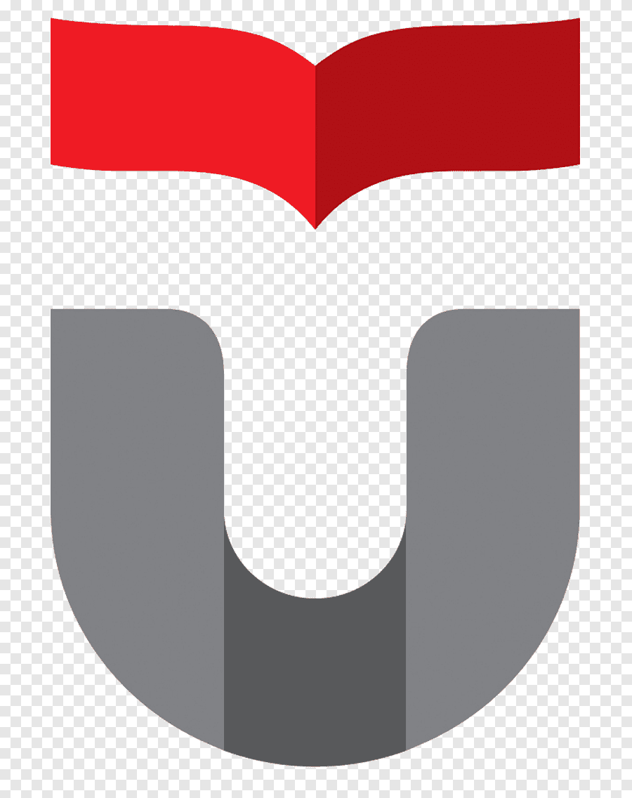
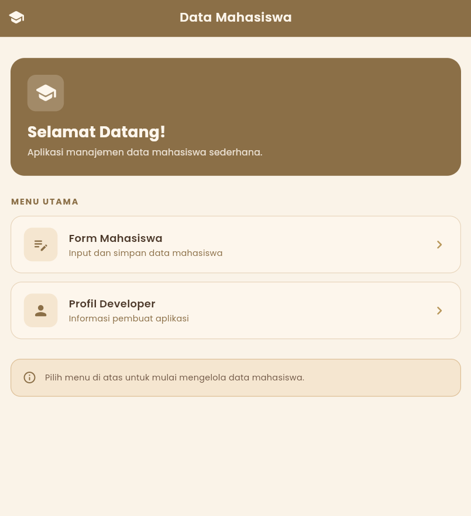
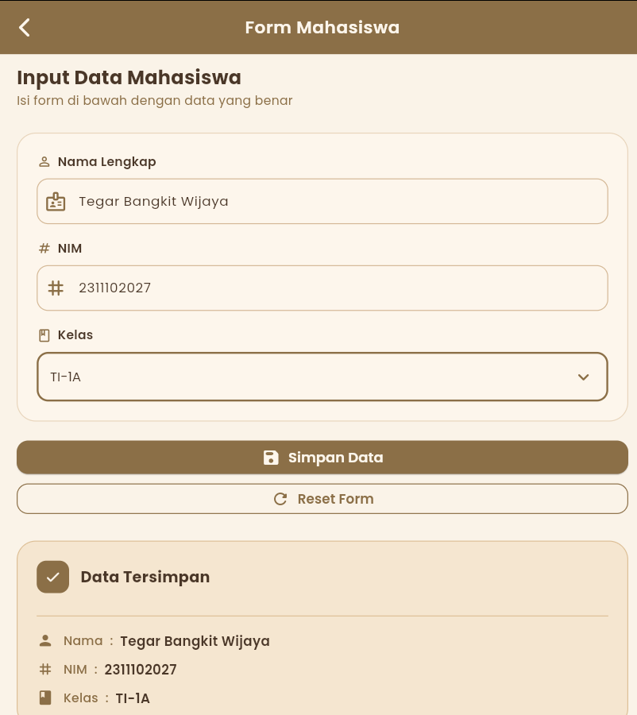
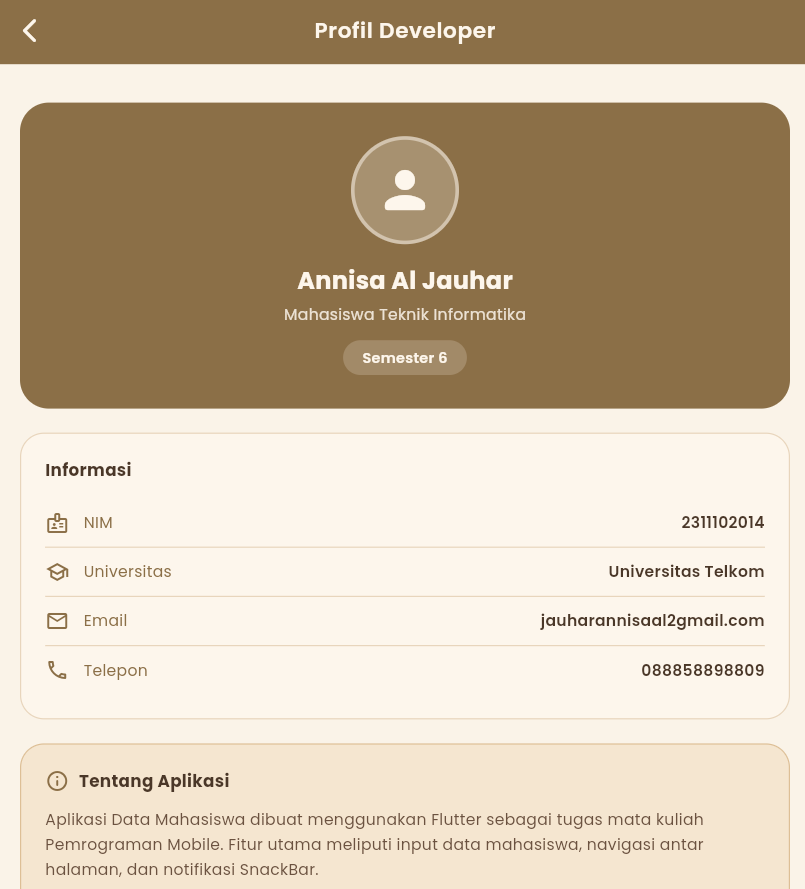

<div align="center">
  <br />
  <h1>LAPORAN PRAKTIKUM <br>APLIKASI BERBASIS PLATFORM</h1>
  <br />
  <h3>MODUL 7 <br> NAVIGATION & STATE MANAGEMENT</h3>
  <br />
   
  <br />
  <br />
  <br />
  <h3>Disusun Oleh :</h3>
  <p>
    <strong>ANNISA AL JAUHAR</strong><br>
    <strong>2311102013</strong><br>
    <strong>S1 IF-11-REG01</strong>
  </p>
  <br />
  <br />
  <h3>Dosen Pengampu :</h3>
  <p>
    <strong>Dimas Fanny Hebrasianto Permadi, S.ST., M.Kom</strong>
  </p>
  <br />
  <br />
  <h4>Asisten Praktikum :</h4>
  <strong>Apri Pandu Wicaksono</strong> <br>
  <strong>Rangga Pradarrell Fathi</strong>
  <br />
  <h3>LABORATORIUM HIGH PERFORMANCE
  <br>FAKULTAS INFORMATIKA <br>UNIVERSITAS TELKOM PURWOKERTO <br>2026</h3>
</div>

---

## 1. Dasar Teori

#### 1.1 Flutter
Flutter merupakan framework open-source yang dikembangkan oleh Google untuk membangun aplikasi mobile, web, dan desktop menggunakan satu basis kode (single codebase). Flutter menggunakan bahasa pemrograman Dart dan menyediakan berbagai widget yang memudahkan pengembangan antarmuka pengguna (UI) secara cepat dan responsif.

Flutter menerapkan konsep widget sebagai komponen utama dalam pembuatan tampilan aplikasi. Setiap elemen pada antarmuka, seperti teks, tombol, gambar, maupun layout, dibangun menggunakan widget.

Implementasi Flutter pada praktikum ini digunakan untuk membuat aplikasi Data Mahasiswa yang terdiri dari tiga halaman utama, yaitu halaman beranda, form input data, dan profil developer, dengan menggunakan berbagai widget seperti `Column`, `Container`, `TextField`, dan `ElevatedButton`.

#### 1.2 Widget Pada Flutter
Widget merupakan komponen dasar dalam Flutter yang digunakan untuk membangun tampilan aplikasi. Widget dapat berupa elemen visual maupun pengatur layout tampilan.

Secara umum, widget pada Flutter dibagi menjadi dua jenis, yaitu:

1. **StatelessWidget**  
Widget yang tampilannya bersifat tetap dan tidak berubah selama aplikasi berjalan. Pada praktikum ini, `StatelessWidget` digunakan pada halaman beranda (`HomePage`) dan halaman profil developer (`ProfilPage`) karena kedua halaman tersebut hanya menampilkan informasi statis.

2. **StatefulWidget**  
Widget yang dapat berubah tampilannya sesuai dengan perubahan data atau state aplikasi. Pada praktikum ini, `StatefulWidget` digunakan pada halaman form (`FormPage`) karena halaman tersebut mengelola input pengguna dan menampilkan data yang berubah-ubah.

#### 1.3 Widget Column
`Column` merupakan widget layout pada Flutter yang digunakan untuk menyusun beberapa widget secara vertikal dari atas ke bawah.

Widget `Column` memiliki beberapa properti penting, salah satunya `crossAxisAlignment` yang digunakan untuk mengatur posisi horizontal widget di dalam `Column`, dan `mainAxisAlignment` untuk mengatur posisi vertikal.

Pada praktikum ini, widget `Column` digunakan di seluruh halaman aplikasi untuk menyusun elemen-elemen tampilan secara vertikal, seperti tombol navigasi di halaman beranda, field input di halaman form, serta informasi profil di halaman profil developer.

#### 1.4 Widget Padding
`Padding` merupakan widget yang digunakan untuk memberikan jarak pada suatu widget terhadap widget lain maupun terhadap sisi layar.

Penggunaan `Padding` bertujuan agar tampilan antarmuka lebih rapi dan nyaman dilihat pengguna.

Pada praktikum ini, widget `Padding` digunakan di seluruh halaman dengan nilai `EdgeInsets.all(20)` atau `EdgeInsets.all(24)` untuk memberikan jarak yang konsisten antara konten dengan tepi layar.

#### 1.5 Widget TextField
`TextField` merupakan widget input pada Flutter yang digunakan untuk menerima masukan berupa teks dari pengguna.

Widget `TextField` memiliki beberapa properti penting, antara lain:
- `controller` → mengatur dan mengambil data input pengguna menggunakan `TextEditingController`.
- `decoration` → mengatur tampilan TextField, termasuk `labelText`, `border`, dan `prefixIcon`.
- `keyboardType` → menentukan jenis keyboard yang muncul, misalnya `TextInputType.number` untuk input angka.

Pada praktikum ini, `TextField` digunakan pada halaman form untuk membuat tiga kolom input, yaitu Nama Lengkap, NIM Mahasiswa, dan Kelas, dengan tampilan border berbentuk kotak menggunakan `OutlineInputBorder()`.

#### 1.6 Navigator (Navigasi Antar Halaman)
Navigator merupakan sistem manajemen halaman (routing) pada Flutter yang bekerja menggunakan konsep stack. Terdapat dua method utama yang digunakan:

- `Navigator.push()` → digunakan untuk berpindah ke halaman baru dengan menambahkan halaman tersebut ke atas stack.
- `Navigator.pop()` → digunakan untuk kembali ke halaman sebelumnya dengan menghapus halaman teratas dari stack.

Pada praktikum ini, `Navigator.push` digunakan pada halaman beranda untuk berpindah ke halaman form dan profil developer, sedangkan `Navigator.pop` digunakan pada tombol kembali di masing-masing halaman.

#### 1.7 Material Design
Material Design merupakan pedoman desain antarmuka yang dikembangkan oleh Google untuk menciptakan tampilan aplikasi yang konsisten, modern, dan responsif.

Flutter menyediakan library `material.dart` yang berisi berbagai widget Material Design seperti:
- `Scaffold` → struktur dasar halaman
- `AppBar` → header halaman
- `TextField` → kolom input teks
- `ElevatedButton` → tombol dengan efek elevasi
- `Container` → widget serbaguna untuk dekorasi dan layout

#### 1.8 SnackBar
SnackBar adalah komponen notifikasi sederhana yang muncul sementara di bagian bawah layar. SnackBar biasanya digunakan untuk memberikan informasi kepada pengguna, misalnya notifikasi bahwa suatu aksi berhasil dilakukan setelah tombol ditekan.

Pada praktikum ini, SnackBar digunakan dalam dua kondisi:
- **SnackBar merah** → muncul ketika pengguna menekan tombol Simpan namun ada field yang belum diisi.
- **SnackBar hijau** → muncul ketika data mahasiswa berhasil disimpan ke dalam daftar.

---

## 2. Source Code dan Implementasinya

### MAIN DART
```dart
import 'package:flutter/material.dart';
import 'package:google_fonts/google_fonts.dart';
import 'home_page.dart';

void main() {
  runApp(const DataMahasiswaApp());
}

class DataMahasiswaApp extends StatelessWidget {
  const DataMahasiswaApp({super.key});

  @override
  Widget build(BuildContext context) {
    return MaterialApp(
      title: 'Data Mahasiswa',
      debugShowCheckedModeBanner: false,
      theme: ThemeData(
        colorScheme: ColorScheme(
          brightness: Brightness.light,
          primary: const Color(0xFF8B6F47),
          onPrimary: const Color(0xFFFDF6EC),
          secondary: const Color(0xFFB8975A),
          onSecondary: const Color(0xFFFDF6EC),
          error: const Color(0xFFB85C38),
          onError: Colors.white,
          surface: const Color(0xFFFDF6EC),
          onSurface: const Color(0xFF4A3728),
          surfaceContainerHighest: const Color(0xFFF5E6D0),
          onSurfaceVariant: const Color(0xFF6B5240),
          outline: const Color(0xFFD4B896),
          outlineVariant: const Color(0xFFE8D5BC),
          shadow: Colors.black,
          scrim: Colors.black,
          inverseSurface: const Color(0xFF4A3728),
          onInverseSurface: const Color(0xFFFDF6EC),
          inversePrimary: const Color(0xFFD4A76A),
          primaryContainer: const Color(0xFFF5E6D0),
          onPrimaryContainer: const Color(0xFF4A3728),
          secondaryContainer: const Color(0xFFEDD9BA),
          onSecondaryContainer: const Color(0xFF4A3728),
          tertiaryContainer: const Color(0xFFFAF0E0),
          onTertiaryContainer: const Color(0xFF5C4030),
          tertiary: const Color(0xFF9E7A4A),
          onTertiary: const Color(0xFFFDF6EC),
          errorContainer: const Color(0xFFFDE8DF),
          onErrorContainer: const Color(0xFF5C1A05),
        ),
        scaffoldBackgroundColor: const Color(0xFFFAF3E8),
        textTheme: GoogleFonts.poppinsTextTheme(),
        useMaterial3: true,
        appBarTheme: AppBarTheme(
          backgroundColor: const Color(0xFF8B6F47),
          foregroundColor: const Color(0xFFFDF6EC),
          elevation: 0,
          centerTitle: true,
          titleTextStyle: GoogleFonts.poppins(
            color: const Color(0xFFFDF6EC),
            fontSize: 18,
            fontWeight: FontWeight.w600,
          ),
        ),
        elevatedButtonTheme: ElevatedButtonThemeData(
          style: ElevatedButton.styleFrom(
            backgroundColor: const Color(0xFF8B6F47),
            foregroundColor: const Color(0xFFFDF6EC),
            shape: RoundedRectangleBorder(borderRadius: BorderRadius.circular(12)),
            padding: const EdgeInsets.symmetric(horizontal: 24, vertical: 14),
          ),
        ),
      ),
      home: const HomePage(),
    );
  }
}
```

**Penjelasan:** `main.dart` merupakan entry point aplikasi. Di sini didefinisikan tema warna cream secara menyeluruh menggunakan `ThemeData` dengan `ColorScheme` kustom, font `Poppins` dari Google Fonts, serta konfigurasi `AppBar` dan `ElevatedButton` agar konsisten di seluruh halaman. Halaman pertama yang ditampilkan adalah `HomePage`.

---

### HOME PAGE (Beranda)
```dart
import 'package:flutter/material.dart';
import 'package:google_fonts/google_fonts.dart';
import 'form_page.dart';
import 'profil_page.dart';

class HomePage extends StatelessWidget {
  const HomePage({super.key});

  @override
  Widget build(BuildContext context) {
    return Scaffold(
      appBar: AppBar(
        title: const Text('Data Mahasiswa'),
        leading: const Padding(
          padding: EdgeInsets.all(10),
          child: Icon(Icons.school_rounded, size: 24),
        ),
      ),
      body: SingleChildScrollView(
        child: Padding(
          padding: const EdgeInsets.all(20),
          child: Column(
            crossAxisAlignment: CrossAxisAlignment.start,
            children: [
              const SizedBox(height: 10),
              _WelcomeBanner(),
              const SizedBox(height: 28),
              Text('MENU UTAMA', style: GoogleFonts.poppins(...)),
              const SizedBox(height: 12),
              _MenuCard(
                icon: Icons.edit_note_rounded,
                title: 'Form Mahasiswa',
                subtitle: 'Input dan simpan data mahasiswa',
                onTap: () => Navigator.push(
                  context,
                  MaterialPageRoute(builder: (_) => const FormPage()),
                ),
              ),
              const SizedBox(height: 12),
              _MenuCard(
                icon: Icons.person_rounded,
                title: 'Profil Developer',
                subtitle: 'Informasi pembuat aplikasi',
                onTap: () => Navigator.push(
                  context,
                  MaterialPageRoute(builder: (_) => const ProfilPage()),
                ),
              ),
            ],
          ),
        ),
      ),
    );
  }
}
```

**Penjelasan:** `HomePage` menggunakan `StatelessWidget` karena tidak ada state yang berubah. Halaman ini menampilkan banner selamat datang menggunakan `Container` dengan warna coklat cream, serta dua menu card untuk navigasi ke halaman Form Mahasiswa dan Profil Developer menggunakan `Navigator.push()`.

---

### FORM PAGE (Halaman Input)
```dart
import 'package:flutter/material.dart';
import 'package:google_fonts/google_fonts.dart';

class FormPage extends StatefulWidget {
  const FormPage({super.key});

  @override
  State<FormPage> createState() => _FormPageState();
}

class _FormPageState extends State<FormPage> {
  final TextEditingController _namaController = TextEditingController();
  final TextEditingController _nimController = TextEditingController();
  String? _kelasTerpilih;

  final List<String> _daftarKelas = [
    'TI-1A', 'TI-1B', 'TI-2A', 'TI-2B',
    'TI-3A', 'TI-3B', 'SI-1A', 'SI-2A',
  ];

  Map<String, String>? _dataTersimpan;

  void _simpanData() {
    if (_namaController.text.isEmpty ||
        _nimController.text.isEmpty ||
        _kelasTerpilih == null) {
      ScaffoldMessenger.of(context).showSnackBar(
        SnackBar(
          content: Text('Semua field wajib diisi!'),
          backgroundColor: const Color(0xFFB85C38),
          behavior: SnackBarBehavior.floating,
        ),
      );
      return;
    }

    setState(() {
      _dataTersimpan = {
        'nama': _namaController.text,
        'nim': _nimController.text,
        'kelas': _kelasTerpilih!,
      };
    });

    ScaffoldMessenger.of(context).showSnackBar(
      SnackBar(
        content: Row(
          children: [
            Icon(Icons.check_circle_rounded, color: Colors.white),
            SizedBox(width: 10),
            Text('Data berhasil disimpan!'),
          ],
        ),
        backgroundColor: const Color(0xFF6B8F5E),
        behavior: SnackBarBehavior.floating,
      ),
    );
  }

  @override
  Widget build(BuildContext context) {
    return Scaffold(
      appBar: AppBar(
        title: const Text('Form Mahasiswa'),
        leading: IconButton(
          icon: const Icon(Icons.arrow_back_ios_new_rounded),
          onPressed: () => Navigator.pop(context),
        ),
      ),
      body: SingleChildScrollView(
        padding: const EdgeInsets.all(20),
        child: Column(
          crossAxisAlignment: CrossAxisAlignment.start,
          children: [
            // Container form berisi TextField Nama, NIM, dan Dropdown Kelas
            Container(
              padding: const EdgeInsets.all(20),
              decoration: BoxDecoration(
                color: const Color(0xFFFDF6EC),
                borderRadius: BorderRadius.circular(20),
                border: Border.all(color: const Color(0xFFE8D5BC)),
              ),
              child: Column(
                children: [
                  TextField(controller: _namaController, ...),
                  TextField(controller: _nimController, ...),
                  // Dropdown Kelas
                  DropdownButton<String>(...),
                ],
              ),
            ),
            ElevatedButton.icon(
              onPressed: _simpanData,
              icon: const Icon(Icons.save_rounded),
              label: const Text('Simpan Data'),
            ),
            // Tampilkan data tersimpan jika ada
            if (_dataTersimpan != null) _HasilData(data: _dataTersimpan!),
          ],
        ),
      ),
    );
  }
}
```

**Penjelasan:** `FormPage` menggunakan `StatefulWidget` karena mengelola state berupa data input pengguna dan data yang telah disimpan. Halaman ini berisi tiga field input: Nama (TextField), NIM (TextField), dan Kelas (DropdownButton). Setelah tombol Simpan ditekan, dilakukan validasi — jika ada field kosong muncul SnackBar merah, jika lengkap muncul SnackBar hijau dan data ditampilkan di bawah form dalam widget `_HasilData`. Tombol back menggunakan `Navigator.pop()` untuk kembali ke beranda.

---

### PROFIL PAGE (Profil Developer)
```dart
import 'package:flutter/material.dart';
import 'package:google_fonts/google_fonts.dart';

class ProfilPage extends StatelessWidget {
  const ProfilPage({super.key});

  @override
  Widget build(BuildContext context) {
    return Scaffold(
      appBar: AppBar(
        title: const Text('Profil Developer'),
        leading: IconButton(
          icon: const Icon(Icons.arrow_back_ios_new_rounded),
          onPressed: () => Navigator.pop(context),
        ),
      ),
      body: SingleChildScrollView(
        padding: const EdgeInsets.all(20),
        child: Column(
          children: [
            // Container avatar dan nama developer
            Container(
              padding: const EdgeInsets.all(28),
              decoration: BoxDecoration(
                color: const Color(0xFF8B6F47),
                borderRadius: BorderRadius.circular(24),
              ),
              child: Column(
                children: [
                  // Avatar lingkaran
                  Container(
                    width: 90, height: 90,
                    decoration: BoxDecoration(shape: BoxShape.circle, ...),
                    child: const Icon(Icons.person_rounded, size: 50),
                  ),
                  Text('Annisa Al Jauhar', ...),
                  Text('Mahasiswa Teknik Informatika', ...),
                  Text('Semester 6', ...),
                ],
              ),
            ),
            // Container informasi detail (NIM, Universitas, Email, Telepon)
            Container(...),
            // Container tentang aplikasi + chip teknologi
            Container(...),
            ElevatedButton.icon(
              onPressed: () => Navigator.pop(context),
              icon: const Icon(Icons.home_rounded),
              label: const Text('Kembali ke Home'),
            ),
          ],
        ),
      ),
    );
  }
}
```

**Penjelasan:** `ProfilPage` menggunakan `StatelessWidget` karena hanya menampilkan informasi statis tentang developer. Halaman ini terdiri dari tiga `Container` utama: container avatar berisi foto/icon dan identitas developer, container informasi berisi NIM, universitas, email, dan telepon, serta container tentang aplikasi berisi deskripsi singkat dan chip teknologi yang digunakan. Tombol kembali menggunakan `Navigator.pop()`.

---

## 3. Output

**Halaman Beranda (Home Page)**



Halaman pertama yang muncul saat aplikasi dijalankan. Menampilkan banner selamat datang dengan warna cream coklat, serta dua menu card untuk navigasi ke Form Mahasiswa dan Profil Developer.

---

**Halaman Form Input Data Mahasiswa**



Halaman form berisi tiga field input: Nama Lengkap, NIM, dan dropdown pilihan Kelas. Setelah tombol Simpan ditekan, data ditampilkan di bawah form dan SnackBar notifikasi muncul di bagian bawah layar.

---

**Halaman Profil Developer**



Halaman yang menampilkan informasi developer pembuat aplikasi, meliputi nama, NIM, universitas, email, dan keterangan aplikasi. Terdapat tombol Kembali ke Home yang menggunakan `Navigator.pop()`.