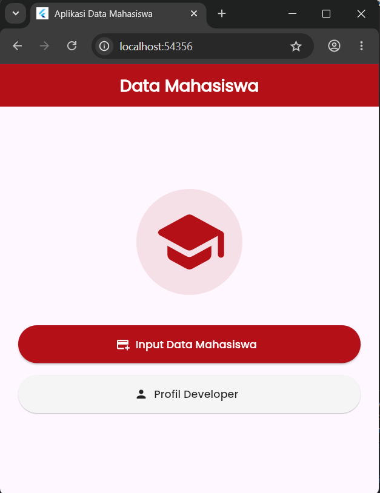
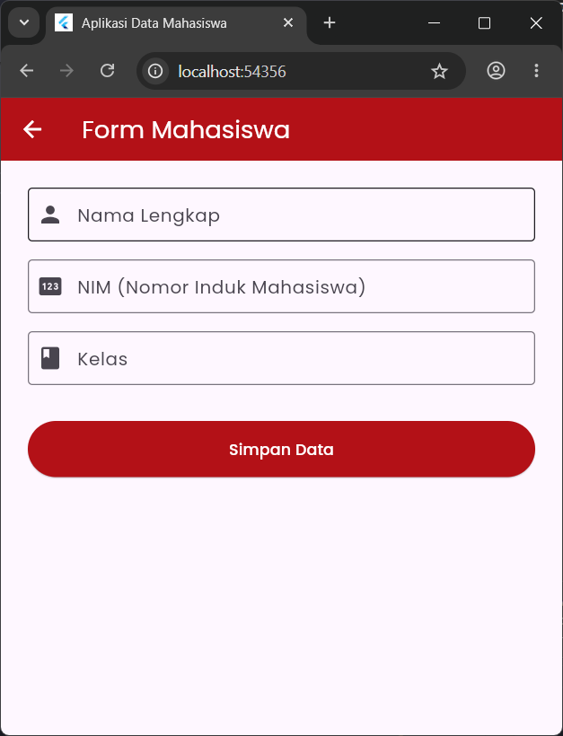
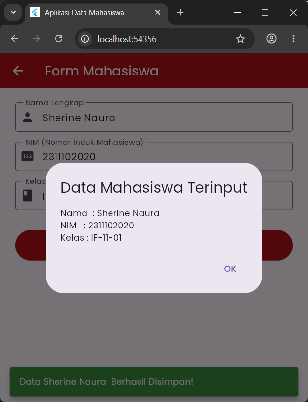
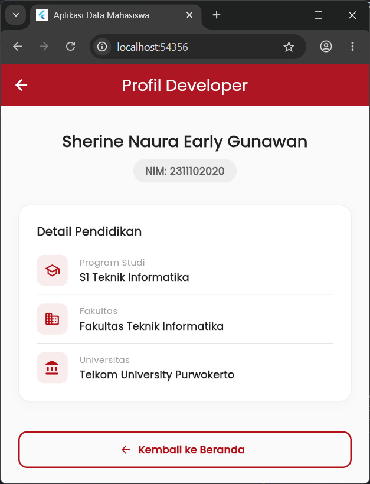

<div align="center">

# LAPORAN PRAKTIKUM
# APLIKASI BERBASIS PLATFORM


## MODUL 7
## MOBILE


**Disusun Oleh :**

**Sherine Naura Early Gunawan**

**2311102020**

**S1 IF-11-REG01**


**PROGRAM STUDI S1 INFORMATIKA**

**FAKULTAS INFORMATIKA**

**UNIVERSITAS TELKOM PURWOKERTO**

**2025/2026**

</div>

---

## 1. Dasar Teori


---

## 2. Penjelasan kode
```dart 
import 'package:flutter/material.dart';
import 'package:google_fonts/google_fonts.dart';

void main() {
  runApp(const MyApp());
}

class MyApp extends StatelessWidget {
  const MyApp({super.key});

  @override
  Widget build(BuildContext context) {
    return MaterialApp(
      debugShowCheckedModeBanner: false,
      title: 'Aplikasi Data Mahasiswa',
      theme: ThemeData(
        useMaterial3: true,
        textTheme: GoogleFonts.poppinsTextTheme(Theme.of(context).textTheme),
      ),
      home: const HomePage(),
    );
  }
}

class HomePage extends StatelessWidget {
  const HomePage({super.key});

  @override
  Widget build(BuildContext context) {
    const Color telkomMaroon = Color(0xFFB31117);

    return Scaffold(
      appBar: AppBar(
        title: const Text(
          'Data Mahasiswa',
          style: TextStyle(fontWeight: FontWeight.bold),
        ),
        backgroundColor: telkomMaroon,
        foregroundColor: Colors.white,
        centerTitle: true,
      ),
      body: Center(
        child: Padding(
          padding: const EdgeInsets.all(24.0),
          child: Column(
            mainAxisAlignment: MainAxisAlignment.center,
            children: [
              Container(
                padding: const EdgeInsets.all(20),
                decoration: BoxDecoration(
                  color: telkomMaroon.withOpacity(0.1),
                  shape: BoxShape.circle,
                ),
                child: const Icon(
                  Icons.school_rounded,
                  size: 100,
                  color: telkomMaroon,
                ),
              ),
              const SizedBox(height: 40),
              SizedBox(
                width: double.infinity,
                height: 50,
                child: ElevatedButton.icon(
                  onPressed: () {
                    Navigator.push(
                      context,
                      MaterialPageRoute(builder: (context) => const FormPage()),
                    );
                  },
                  icon: const Icon(Icons.add_card),
                  label: const Text('Input Data Mahasiswa'),
                  style: ElevatedButton.styleFrom(
                    backgroundColor: telkomMaroon,
                    foregroundColor: Colors.white,
                    elevation: 2,
                  ),
                ),
              ),
              const SizedBox(height: 16),
              SizedBox(
                width: double.infinity,
                height: 50,
                child: ElevatedButton.icon(
                  onPressed: () {
                    Navigator.push(
                      context,
                      MaterialPageRoute(
                        builder: (context) => const DeveloperPage(),
                      ),
                    );
                  },
                  icon: const Icon(Icons.person),
                  label: const Text('Profil Developer'),
                  style: ElevatedButton.styleFrom(
                    backgroundColor: Colors.grey[100],
                    foregroundColor: Colors.black87,
                    elevation: 1,
                  ),
                ),
              ),
            ],
          ),
        ),
      ),
    );
  }
}

class FormPage extends StatefulWidget {
  const FormPage({super.key});

  @override
  State<FormPage> createState() => _FormPageState();
}

class _FormPageState extends State<FormPage> {
  final _formKey = GlobalKey<FormState>();
  final TextEditingController _namaController = TextEditingController();
  final TextEditingController _nimController = TextEditingController();
  final TextEditingController _kelasController = TextEditingController();

  @override
  void dispose() {
    _namaController.dispose();
    _nimController.dispose();
    _kelasController.dispose();
    super.dispose();
  }

  void _simpanData() {
    if (_formKey.currentState!.validate()) {
      final String nama = _namaController.text;
      final String nim = _nimController.text;
      final String kelas = _kelasController.text;

      ScaffoldMessenger.of(context).showSnackBar(
        SnackBar(
          content: Text('Data $nama Berhasil Disimpan!'),
          backgroundColor: Colors.green[700],
          behavior: SnackBarBehavior.floating,
        ),
      );

      showDialog(
        context: context,
        builder: (context) => AlertDialog(
          title: const Text('Data Mahasiswa Terinput'),
          content: Column(
            mainAxisSize: MainAxisSize.min,
            crossAxisAlignment: CrossAxisAlignment.start,
            children: [
              Text('Nama  : $nama'),
              Text('NIM   : $nim'),
              Text('Kelas : $kelas'),
            ],
          ),
          actions: [
            TextButton(
              onPressed: () => Navigator.pop(context),
              child: const Text('OK'),
            ),
          ],
        ),
      );
    }
  }

  @override
  Widget build(BuildContext context) {
    const Color telkomMaroon = Color(0xFFB31117);

    return Scaffold(
      appBar: AppBar(
        title: const Text('Form Mahasiswa'),
        backgroundColor: telkomMaroon,
        foregroundColor: Colors.white,
      ),
      body: SingleChildScrollView(
        padding: const EdgeInsets.all(24.0),
        child: Form(
          key: _formKey,
          child: Column(
            crossAxisAlignment: CrossAxisAlignment.start,
            children: [
              TextFormField(
                controller: _namaController,
                decoration: const InputDecoration(
                  labelText: 'Nama Lengkap',
                  border: OutlineInputBorder(),
                  prefixIcon: Icon(Icons.person),
                ),
                validator: (value) {
                  if (value == null || value.isEmpty) {
                    return 'Nama tidak boleh kosong';
                  }
                  return null;
                },
              ),
              const SizedBox(height: 16),
              TextFormField(
                controller: _nimController,
                keyboardType: TextInputType.number,
                decoration: const InputDecoration(
                  labelText: 'NIM (Nomor Induk Mahasiswa)',
                  border: OutlineInputBorder(),
                  prefixIcon: Icon(Icons.pin),
                ),
                validator: (value) {
                  if (value == null || value.isEmpty) {
                    return 'NIM tidak boleh kosong';
                  }
                  return null;
                },
              ),
              const SizedBox(height: 16),
              TextFormField(
                controller: _kelasController,
                decoration: const InputDecoration(
                  labelText: 'Kelas',
                  border: OutlineInputBorder(),
                  prefixIcon: Icon(Icons.class_),
                ),
                validator: (value) {
                  if (value == null || value.isEmpty) {
                    return 'Kelas tidak boleh kosong';
                  }
                  return null;
                },
              ),
              const SizedBox(height: 32),
              SizedBox(
                width: double.infinity,
                height: 50,
                child: ElevatedButton(
                  onPressed: _simpanData,
                  style: ElevatedButton.styleFrom(
                    backgroundColor: telkomMaroon,
                    foregroundColor: Colors.white,
                  ),
                  child: const Text('Simpan Data'),
                ),
              ),
            ],
          ),
        ),
      ),
    );
  }
}

class DeveloperPage extends StatelessWidget {
  const DeveloperPage({super.key});

  @override
  Widget build(BuildContext context) {
    const Color telkomMaroon = Color(0xFFB31117);
    const Color telkomGold = Color(0xFFDDA126);

    return Scaffold(
      backgroundColor: Colors.grey[50],
      appBar: AppBar(
        title: const Text('Profil Developer'),
        backgroundColor: telkomMaroon,
        foregroundColor: Colors.white,
        centerTitle: true,
      ),
      body: SingleChildScrollView(
        padding: const EdgeInsets.all(24.0),
        child: Column(
          children: [
            const SizedBox(height: 10),
            // Bagian Header Nama & NIM Utama
            Text(
              'Sherine Naura Early Gunawan',
              textAlign: TextAlign.center,
              style: TextStyle(
                fontSize: 22,
                fontWeight: FontWeight.bold,
                color: Colors.grey[900],
              ),
            ),
            const SizedBox(height: 8),
            Container(
              padding: const EdgeInsets.symmetric(horizontal: 16, vertical: 6),
              decoration: BoxDecoration(
                color: Colors.grey[200],
                borderRadius: BorderRadius.circular(20),
              ),
              child: Text(
                'NIM: 2311102020',
                style: TextStyle(
                  fontSize: 14,
                  fontWeight: FontWeight.w600,
                  color: Colors.grey[700],
                ),
              ),
            ),
            const SizedBox(height: 30),

            // Kartu Detail Pendidikan (Sesuai mockup referensi)
            Container(
              padding: const EdgeInsets.all(24),
              width: double.infinity,
              decoration: BoxDecoration(
                color: Colors.white,
                borderRadius: BorderRadius.circular(16),
                border: Border.all(color: Colors.grey[200]!),
                boxShadow: [
                  BoxShadow(
                    color: Colors.black.withOpacity(0.02),
                    spreadRadius: 1,
                    blurRadius: 10,
                    offset: const Offset(0, 4),
                  ),
                ],
              ),
              child: Column(
                crossAxisAlignment: CrossAxisAlignment.start,
                children: [
                  const Text(
                    'Detail Pendidikan',
                    style: TextStyle(
                      fontSize: 16,
                      fontWeight: FontWeight.bold,
                      color: Colors.black87,
                    ),
                  ),
                  const SizedBox(height: 20),
                  _buildEducationTile(
                    icon: Icons.school_outlined,
                    label: 'Program Studi',
                    value: 'S1 Teknik Informatika',
                    accentColor: telkomMaroon,
                  ),
                  const Divider(height: 24, thickness: 0.5),
                  _buildEducationTile(
                    icon: Icons.domain_rounded,
                    label: 'Fakultas',
                    value: 'Fakultas Teknik Informatika',
                    accentColor: telkomMaroon,
                  ),
                  const Divider(height: 24, thickness: 0.5),
                  _buildEducationTile(
                    icon: Icons.account_balance_rounded,
                    label: 'Universitas',
                    value: 'Telkom University Purwokerto',
                    accentColor: telkomMaroon,
                  ),
                ],
              ),
            ),
            const SizedBox(height: 40),

            // Tombol Kembali ke Beranda
            SizedBox(
              width: double.infinity,
              height: 50,
              child: OutlinedButton.icon(
                onPressed: () {
                  Navigator.pop(context);
                },
                icon: const Icon(Icons.arrow_back, size: 18),
                label: const Text(
                  'Kembali ke Beranda',
                  style: TextStyle(fontWeight: FontWeight.bold),
                ),
                style: OutlinedButton.styleFrom(
                  foregroundColor: telkomMaroon,
                  side: const BorderSide(color: telkomMaroon, width: 2),
                  shape: RoundedRectangleBorder(
                    borderRadius: BorderRadius.circular(12),
                  ),
                ),
              ),
            ),
          ],
        ),
      ),
    );
  }

  // Komponen pembantu untuk baris Detail Pendidikan
  Widget _buildEducationTile({
    required IconData icon,
    required String label,
    required String value,
    required Color accentColor,
  }) {
    return Row(
      crossAxisAlignment: CrossAxisAlignment.center,
      children: [
        Container(
          padding: const EdgeInsets.all(10),
          decoration: BoxDecoration(
            color: accentColor.withOpacity(0.08),
            borderRadius: BorderRadius.circular(10),
          ),
          child: Icon(icon, color: accentColor, size: 22),
        ),
        const SizedBox(width: 16),
        Expanded(
          child: Column(
            crossAxisAlignment: CrossAxisAlignment.start,
            children: [
              Text(
                label,
                style: TextStyle(
                  fontSize: 12,
                  color: Colors.grey[500],
                  fontWeight: FontWeight.w500,
                ),
              ),
              const SizedBox(height: 2),
              Text(
                value,
                style: const TextStyle(
                  fontSize: 14,
                  fontWeight: FontWeight.bold,
                  color: Colors.black87,
                ),
              ),
            ],
          ),
        ),
      ],
    );
  }
}
```

## Penjelasan kode

### 1. Inisialisasi dan Konfigurasi Utama Aplikasi
```dart
import 'package:flutter/material.dart';
import 'package:google_fonts/google_fonts.dart';

void main() {
  runApp(const MyApp());
}
class MyApp extends StatelessWidget {
  const MyApp({super.key});

  @override
  Widget build(BuildContext context) {
    return MaterialApp(
      debugShowCheckedModeBanner: false,
      title: 'Aplikasi Data Mahasiswa',
      theme: ThemeData(
        useMaterial3: true,
        textTheme: GoogleFonts.poppinsTextTheme(Theme.of(context).textTheme),
      ),
      home: const HomePage(),
    );
  }
}
```
**Penjelasan:** Root aplikasi ini dideklarasikan melalui kelas MyApp, dengan memanfaatkan StatelessWidget karena Konfigurasi pada tahap awal ini bersifat konstan dan tidak mengalami perubahan data. Bagian ini juga mengatur tema universal aplikasi berbasis Material 3 serta mengintegrasikan paket GoogleFonts untuk mengubah seluruh jenis huruf secara otomatis menjadi font Poppins.

---
### 2. Halaman Beranda (Home Page)

```dart
class HomePage extends StatelessWidget {
  const HomePage({super.key});

  @override
  Widget build(BuildContext context) {
    const Color telkomMaroon = Color(0xFFB31117);

    return Scaffold(
      appBar: AppBar(
        title: const Text(
          'Data Mahasiswa',
          style: TextStyle(fontWeight: FontWeight.bold),
        ),
        backgroundColor: telkomMaroon,
        foregroundColor: Colors.white,
        centerTitle: true,
      ),
      body: Center(
        child: Padding(
          padding: const EdgeInsets.all(24.0),
          child: Column(
            mainAxisAlignment: MainAxisAlignment.center,
            children: [
              Container(
                padding: const EdgeInsets.all(20),
                decoration: BoxDecoration(
                  color: telkomMaroon.withOpacity(0.1),
                  shape: BoxShape.circle,
                ),
                child: const Icon(
                  Icons.school_rounded,
                  size: 100,
                  color: telkomMaroon,
                ),
              ),
              const SizedBox(height: 40),
              SizedBox(
                width: double.infinity,
                height: 50,
                child: ElevatedButton.icon(
                  onPressed: () {
                    Navigator.push(
                      context,
                      MaterialPageRoute(builder: (context) => const FormPage()),
                    );
                  },
                  icon: const Icon(Icons.add_card),
                  label: const Text('Input Data Mahasiswa'),
                  style: ElevatedButton.styleFrom(
                    backgroundColor: telkomMaroon,
                    foregroundColor: Colors.white,
                    elevation: 2,
                  ),
                ),
              ),
              const SizedBox(height: 16),
              SizedBox(
                width: double.infinity,
                height: 50,
                child: ElevatedButton.icon(
                  onPressed: () {
                    Navigator.push(
                      context,
                      MaterialPageRoute(
                        builder: (context) => const DeveloperPage(),
                      ),
                    );
                  },
                  icon: const Icon(Icons.person),
                  label: const Text('Profil Developer'),
                  style: ElevatedButton.styleFrom(
                    backgroundColor: Colors.grey[100],
                    foregroundColor: Colors.black87,
                    elevation: 1,
                  ),
                ),
              ),
            ],
          ),
        ),
      ),
    );
  }
}
```
**Penjelasan:** Halaman beranda dibangun menggunakan StatelessWidget dengan struktur utama Scaffold dan AppBar berwarna maroon. Bagian konten tengah (body) memanfaatkan kombinasi Center, Padding, dan tata letak vertikal Column untuk menyusun elemen secara rapi, komponen dekorasi Container lingkaran digunakan untuk membungkus sebuah ikon, sehingga ikon tersebut berada tepat di tengah. Kemudian disediakan dua komponen (tombol) ElevatedButton.icon dengan ukuran lebar penuh menggunakan double.infinity yang mengimplementasikan fungsi routing Navigator.push untuk mengarahkan navigasi pengguna menuju halaman formulir maupun profil developer.

---
### 3. Halaman Formulir 
```dart
class FormPage extends StatefulWidget {
  const FormPage({super.key});

  @override
  State<FormPage> createState() => _FormPageState();
}

class _FormPageState extends State<FormPage> {
  final _formKey = GlobalKey<FormState>();
  final TextEditingController _namaController = TextEditingController();
  final TextEditingController _nimController = TextEditingController();
  final TextEditingController _kelasController = TextEditingController();

  @override
  void dispose() {
    _namaController.dispose();
    _nimController.dispose();
    _kelasController.dispose();
    super.dispose();
  }

  void _simpanData() {
    if (_formKey.currentState!.validate()) {
      final String nama = _namaController.text;
      final String nim = _nimController.text;
      final String kelas = _kelasController.text;

      ScaffoldMessenger.of(context).showSnackBar(
        SnackBar(
          content: Text('Data $nama Berhasil Disimpan!'),
          backgroundColor: Colors.green[700],
          behavior: SnackBarBehavior.floating,
        ),
      );

      showDialog(
        context: context,
        builder: (context) => AlertDialog(
          title: const Text('Data Mahasiswa Terinput'),
          content: Column(
            mainAxisSize: MainAxisSize.min,
            crossAxisAlignment: CrossAxisAlignment.start,
            children: [
              Text('Nama  : $nama'),
              Text('NIM   : $nim'),
              Text('Kelas : $kelas'),
            ],
          ),
          actions: [
            TextButton(
              onPressed: () => Navigator.pop(context),
              child: const Text('OK'),
            ),
          ],
        ),
      );
    }
  }

  @override
  Widget build(BuildContext context) {
    const Color telkomMaroon = Color(0xFFB31117);

    return Scaffold(
      appBar: AppBar(
        title: const Text('Form Mahasiswa'),
        backgroundColor: telkomMaroon,
        foregroundColor: Colors.white,
      ),
      body: SingleChildScrollView(
        padding: const EdgeInsets.all(24.0),
        child: Form(
          key: _formKey,
          child: Column(
            crossAxisAlignment: CrossAxisAlignment.start,
            children: [
              TextFormField(
                controller: _namaController,
                decoration: const InputDecoration(
                  labelText: 'Nama Lengkap',
                  border: OutlineInputBorder(),
                  prefixIcon: Icon(Icons.person),
                ),
                validator: (value) {
                  if (value == null || value.isEmpty) {
                    return 'Nama tidak boleh kosong';
                  }
                  return null;
                },
              ),
              const SizedBox(height: 16),
              TextFormField(
                controller: _nimController,
                keyboardType: TextInputType.number,
                decoration: const InputDecoration(
                  labelText: 'NIM (Nomor Induk Mahasiswa)',
                  border: OutlineInputBorder(),
                  prefixIcon: Icon(Icons.pin),
                ),
                validator: (value) {
                  if (value == null || value.isEmpty) {
                    return 'NIM tidak boleh kosong';
                  }
                  return null;
                },
              ),
              const SizedBox(height: 16),
              TextFormField(
                controller: _kelasController,
                decoration: const InputDecoration(
                  labelText: 'Kelas',
                  border: OutlineInputBorder(),
                  prefixIcon: Icon(Icons.class_),
                ),
                validator: (value) {
                  if (value == null || value.isEmpty) {
                    return 'Kelas tidak boleh kosong';
                  }
                  return null;
                },
              ),
              const SizedBox(height: 32),
              SizedBox(
                width: double.infinity,
                height: 50,
                child: ElevatedButton(
                  onPressed: _simpanData,
                  style: ElevatedButton.styleFrom(
                    backgroundColor: telkomMaroon,
                    foregroundColor: Colors.white,
                  ),
                  child: const Text('Simpan Data'),
                ),
              ),
            ],
          ),
        ),
      ),
    );
  }
}
```
**Penjelasan:** Halaman formulir juga dirancang menggunakan StatefulWidget ntuk menangani perubahan status input secara dinamis dengan bantuan TextEditingController serta sebuah kunci _formKey untuk validasi form. Antarmuka form dibuat dengan komponen SingleChildScrollView agar responsif terhadap munculnya keyboard perangkat, di mana terdapat tiga kolom inputan TextFormField yaitu Nama, NIM, dan Kelas. FOrm ini dilengkapi dengan aturan validator untuk mencegah data kosong. Ketika fungsi _simpanData dieksekusi melalui tombol simpan, program akan memicu notifikasi sukses berupa SnackBar melayang di layar sekaligus menampilkan data hasil inputan pengguna di dalam kotak AlertDialog pop-up.

---
### 4. Halaman Profil Developer
``` dart
class DeveloperPage extends StatelessWidget {
  const DeveloperPage({super.key});

  @override
  Widget build(BuildContext context) {
    const Color telkomMaroon = Color(0xFFB31117);
    const Color telkomGold = Color(0xFFDDA126);

    return Scaffold(
      backgroundColor: Colors.grey[50],
      appBar: AppBar(
        title: const Text('Profil Developer'),
        backgroundColor: telkomMaroon,
        foregroundColor: Colors.white,
        centerTitle: true,
      ),
      body: SingleChildScrollView(
        padding: const EdgeInsets.all(24.0),
        child: Column(
          children: [
            const SizedBox(height: 10),
            // Bagian Header Nama & NIM Utama
            Text(
              'Sherine Naura Early Gunawan',
              textAlign: TextAlign.center,
              style: TextStyle(
                fontSize: 22,
                fontWeight: FontWeight.bold,
                color: Colors.grey[900],
              ),
            ),
            const SizedBox(height: 8),
            Container(
              padding: const EdgeInsets.symmetric(horizontal: 16, vertical: 6),
              decoration: BoxDecoration(
                color: Colors.grey[200],
                borderRadius: BorderRadius.circular(20),
              ),
              child: Text(
                'NIM: 2311102020',
                style: TextStyle(
                  fontSize: 14,
                  fontWeight: FontWeight.w600,
                  color: Colors.grey[700],
                ),
              ),
            ),
            const SizedBox(height: 30),

            // Kartu Detail Pendidikan (Sesuai mockup referensi)
            Container(
              padding: const EdgeInsets.all(24),
              width: double.infinity,
              decoration: BoxDecoration(
                color: Colors.white,
                borderRadius: BorderRadius.circular(16),
                border: Border.all(color: Colors.grey[200]!),
                boxShadow: [
                  BoxShadow(
                    color: Colors.black.withOpacity(0.02),
                    spreadRadius: 1,
                    blurRadius: 10,
                    offset: const Offset(0, 4),
                  ),
                ],
              ),
              child: Column(
                crossAxisAlignment: CrossAxisAlignment.start,
                children: [
                  const Text(
                    'Detail Pendidikan',
                    style: TextStyle(
                      fontSize: 16,
                      fontWeight: FontWeight.bold,
                      color: Colors.black87,
                    ),
                  ),
                  const SizedBox(height: 20),
                  _buildEducationTile(
                    icon: Icons.school_outlined,
                    label: 'Program Studi',
                    value: 'S1 Teknik Informatika',
                    accentColor: telkomMaroon,
                  ),
                  const Divider(height: 24, thickness: 0.5),
                  _buildEducationTile(
                    icon: Icons.domain_rounded,
                    label: 'Fakultas',
                    value: 'Fakultas Teknik Informatika',
                    accentColor: telkomMaroon,
                  ),
                  const Divider(height: 24, thickness: 0.5),
                  _buildEducationTile(
                    icon: Icons.account_balance_rounded,
                    label: 'Universitas',
                    value: 'Telkom University Purwokerto',
                    accentColor: telkomMaroon,
                  ),
                ],
              ),
            ),
            const SizedBox(height: 40),

            // Tombol Kembali ke Beranda
            SizedBox(
              width: double.infinity,
              height: 50,
              child: OutlinedButton.icon(
                onPressed: () {
                  Navigator.pop(context);
                },
                icon: const Icon(Icons.arrow_back, size: 18),
                label: const Text(
                  'Kembali ke Beranda',
                  style: TextStyle(fontWeight: FontWeight.bold),
                ),
                style: OutlinedButton.styleFrom(
                  foregroundColor: telkomMaroon,
                  side: const BorderSide(color: telkomMaroon, width: 2),
                  shape: RoundedRectangleBorder(
                    borderRadius: BorderRadius.circular(12),
                  ),
                ),
              ),
            ),
          ],
        ),
      ),
    );
  }

  // Komponen pembantu untuk baris Detail Pendidikan
  Widget _buildEducationTile({
    required IconData icon,
    required String label,
    required String value,
    required Color accentColor,
  }) {
    return Row(
      crossAxisAlignment: CrossAxisAlignment.center,
      children: [
        Container(
          padding: const EdgeInsets.all(10),
          decoration: BoxDecoration(
            color: accentColor.withOpacity(0.08),
            borderRadius: BorderRadius.circular(10),
          ),
          child: Icon(icon, color: accentColor, size: 22),
        ),
        const SizedBox(width: 16),
        Expanded(
          child: Column(
            crossAxisAlignment: CrossAxisAlignment.start,
            children: [
              Text(
                label,
                style: TextStyle(
                  fontSize: 12,
                  color: Colors.grey[500],
                  fontWeight: FontWeight.w500,
                ),
              ),
              const SizedBox(height: 2),
              Text(
                value,
                style: const TextStyle(
                  fontSize: 14,
                  fontWeight: FontWeight.bold,
                  color: Colors.black87,
                ),
              ),
            ],
          ),
        ),
      ],
    );
  }
}
```
**Penjelasan:** Halaman profil developer dibuat untuk menampilkan data kredensial pengembang secara terstruktur. Nama lengkap diletakkan di bagian atas sebagai visual utama bersama elemen badge penanda NIM, diikuti sebuah Container putih yang memanfaatkan fungsi pembantu kustom _buildEducationTile bersambung komponen Row horizontal untuk menyajikan baris detail program studi, fakultas, serta kampus Telkom University Purwokerto. Komponen halaman ini kemudian ditutup dengan tombol OutlinedButton.icon transparan bergaris tepi maroon yang memicu fungsi logika Navigator.pop untuk menghapus rute halaman profil dari tumpukan sistem navigasi saat ditekan, sehingga mengembalikan tampilan monitor ke halaman beranda secara aman.

---
## 3. Hasil

### 1. Halaman Home (Beranda).

<div align="center">
    
</div>

### 2. Halaman Form untuk menginputkan data mahasiswa. Akan memunculkan pop up notifikasi bahwa data berhasil disimpan.

<div align="center">
    
</div>

<div align="center">
    
</div>

### 3. Halaman Profil Developer.

<div align="center">
    
</div>