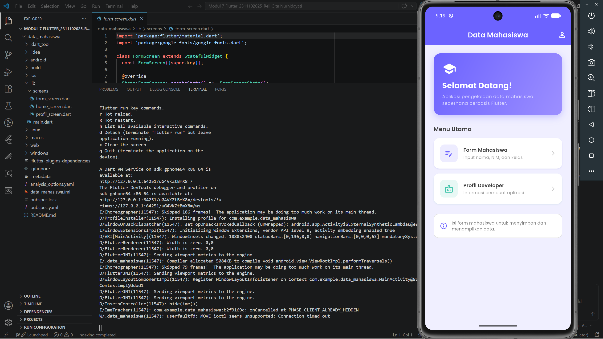
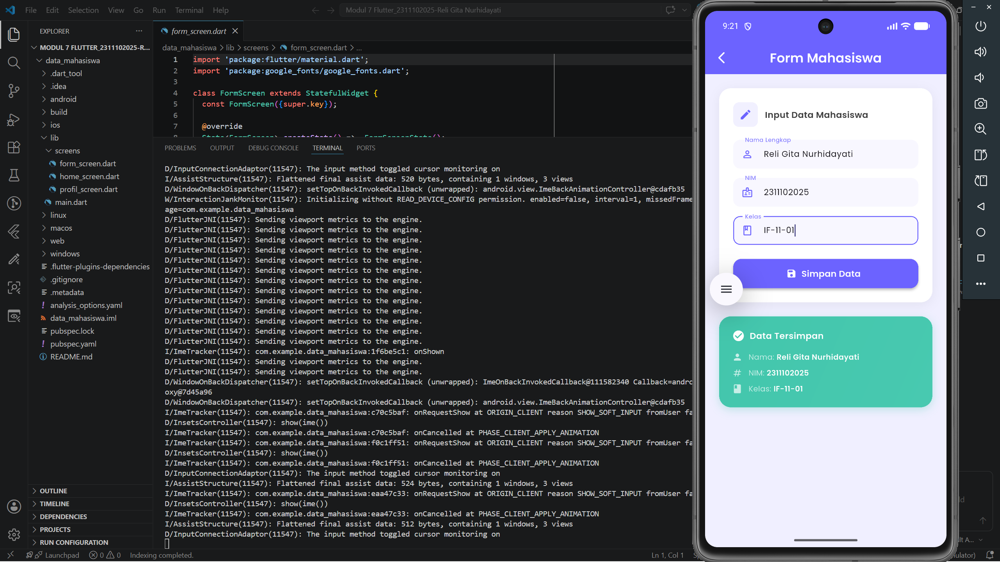
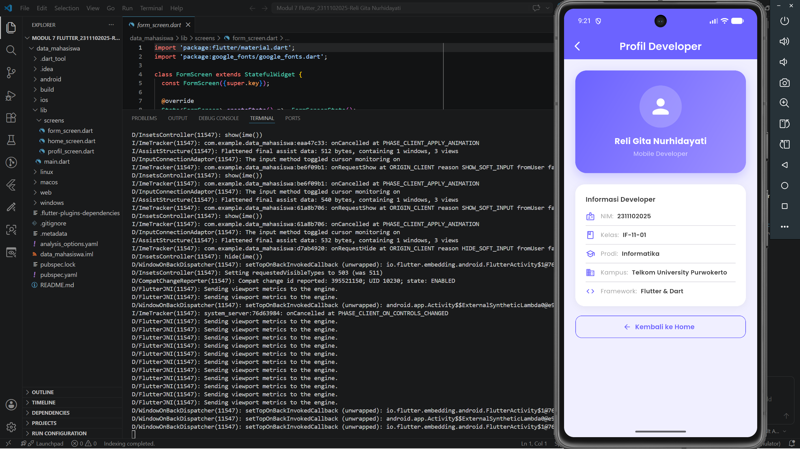

<div align="center">

# LAPORAN PRAKTIKUM
# APLIKASI BERBASIS PLATFORM

**MODUL 7**
**NAVIGATOR & STATEFUL WIDGET**


**Disusun Oleh :**

Reli Gita Nurhidayati
2311102025
S1 IF-11-01

**Dosen Pengampu :**

Dimas Fanny Hebrasianto Permadi, S.ST., M.Kom

**Asisten Praktikum :**

Apri Pandu Wicaksono
Rangga Pradarrell Fathi

---

**LABORATORIUM HIGH PERFORMANCE**
**FAKULTAS INFORMATIKA**
**TELKOM UNIVERSITY PURWOKERTO**
**2026**

</div>

---

## A. Deskripsi Aplikasi

Aplikasi Flutter sederhana bertema **"Data Mahasiswa"** yang memiliki 3 halaman utama:
- **Home** — Halaman utama dengan menu navigasi
- **Form Mahasiswa** — Input nama, NIM, kelas; menampilkan data + SnackBar notifikasi
- **Profil Developer** — Informasi lengkap pembuat aplikasi

---

## B. Widget yang Digunakan

Pada praktikum ini, beberapa widget dan fitur Flutter yang digunakan antara lain:

1. **StatefulWidget** digunakan pada halaman Form Mahasiswa karena halaman ini membutuhkan pembaruan tampilan secara dinamis saat data diinput dan tombol simpan ditekan.

2. **StatelessWidget** digunakan pada halaman Home dan Profil Developer karena kedua halaman tersebut tidak memerlukan perubahan state.

3. **Navigator.push** dan **Navigator.pop** digunakan untuk berpindah antar halaman. `Navigator.push` membuka halaman baru, sedangkan `Navigator.pop` digunakan untuk kembali ke halaman sebelumnya.

4. **Google Fonts (Poppins)** digunakan sebagai font utama di seluruh aplikasi agar tampilan lebih konsisten dan menarik.

5. **AppBar** diterapkan di setiap halaman sebagai header yang menampilkan judul halaman dan tombol navigasi.

6. **Container** digunakan untuk membuat card-card dekoratif seperti hero card pada halaman Home, card form input, dan card hasil data tersimpan.

7. **Column** digunakan untuk menyusun konten secara vertikal di setiap halaman.

8. **ElevatedButton** digunakan sebagai tombol Simpan Data pada halaman Form Mahasiswa.

9. **TextField** dan **TextEditingController** digunakan untuk menerima input nama, NIM, dan kelas dari pengguna, sekaligus mengambil nilainya saat tombol simpan ditekan.

10. **SnackBar** muncul sebagai notifikasi di bagian bawah layar, berwarna ungu jika data berhasil disimpan dan oranye jika ada field yang masih kosong.

---

## C. Penjelasan Kode

### 1. `main.dart`
File utama yang menjalankan aplikasi. Menggunakan `MaterialApp` dengan tema warna ungu (`0xFF6C63FF`) dan Google Fonts Poppins sebagai font utama.

### 2. `home_screen.dart`
Halaman utama menggunakan `StatelessWidget`. Menampilkan hero card sambutan dan dua menu card untuk navigasi ke Form Mahasiswa dan Profil Developer menggunakan `Navigator.push`.

### 3. `form_screen.dart`
Halaman form menggunakan `StatefulWidget` karena perlu menyimpan state data input. Saat tombol **Simpan Data** ditekan:
- Validasi semua field harus terisi
- Jika kosong → SnackBar warning warna orange
- Jika lengkap → `setState()` untuk update tampilan + SnackBar sukses warna ungu

### 4. `profil_screen.dart`
Halaman profil menggunakan `StatelessWidget`. Menampilkan informasi developer dengan avatar card gradient dan detail info. Tombol **Kembali ke Home** menggunakan `Navigator.pop`.

---

## D. Cara Menjalankan

```bash
# Install dependencies
flutter pub get

# Jalankan aplikasi
flutter run
```

---

## E. Hasil Tampilan (Screenshot)

### 1. Halaman Home

<div align="center">

</div>

### 2. Halaman Form Mahasiswa

<div align="center">

</div>

### 3. Halaman Profil Developer

<div align="center">

</div>

---


## F. Kesimpulan

Pada praktikum modul 7 ini, saya berhasil membangun aplikasi Flutter sederhana bertema Data Mahasiswa yang terdiri dari tiga halaman, yaitu Home, Form Mahasiswa, dan Profil Developer. Melalui praktikum ini, saya lebih memahami cara kerja Navigator dalam berpindah antar halaman menggunakan `Navigator.push` dan `Navigator.pop`, serta perbedaan penggunaan `StatefulWidget` dan `StatelessWidget` dalam kondisi yang berbeda.

Penggunaan `StatefulWidget` pada halaman Form Mahasiswa sangat membantu dalam mengelola perubahan data secara real-time, seperti menampilkan hasil input dan memunculkan notifikasi SnackBar saat tombol Simpan ditekan. Selain itu, penggunaan package Google Fonts membuat tampilan aplikasi menjadi lebih menarik dan profesional dibandingkan menggunakan font bawaan Flutter.

Secara keseluruhan, praktikum ini memberikan pemahaman yang lebih baik mengenai struktur aplikasi Flutter multi-halaman dan pengelolaan state sederhana yang merupakan dasar penting dalam pengembangan aplikasi mobile.
</div>
