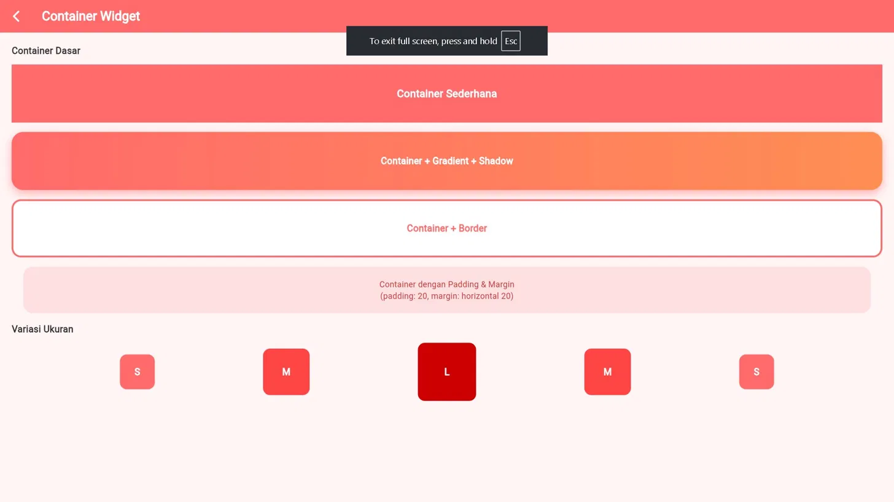
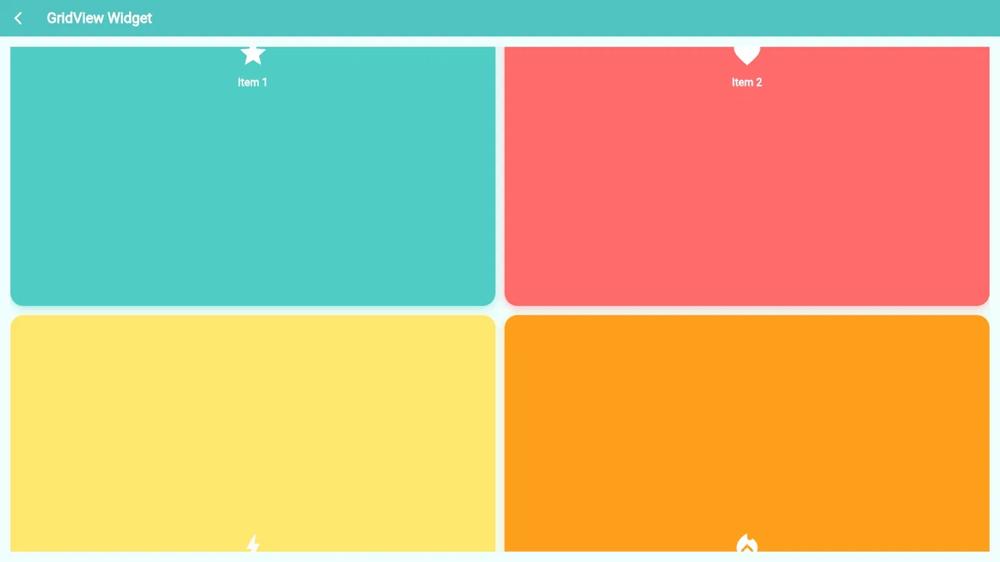
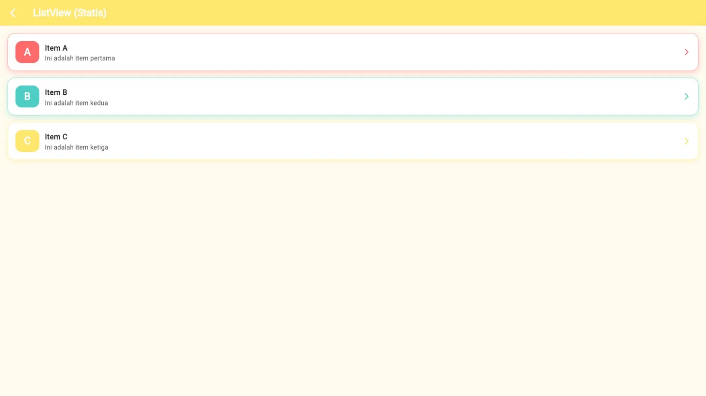
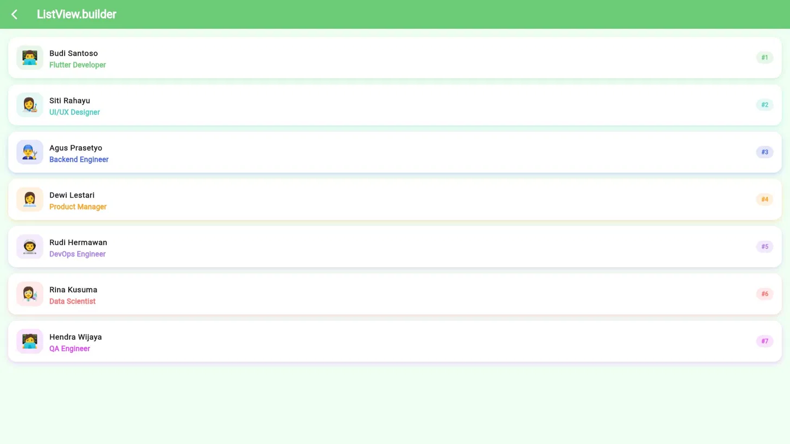
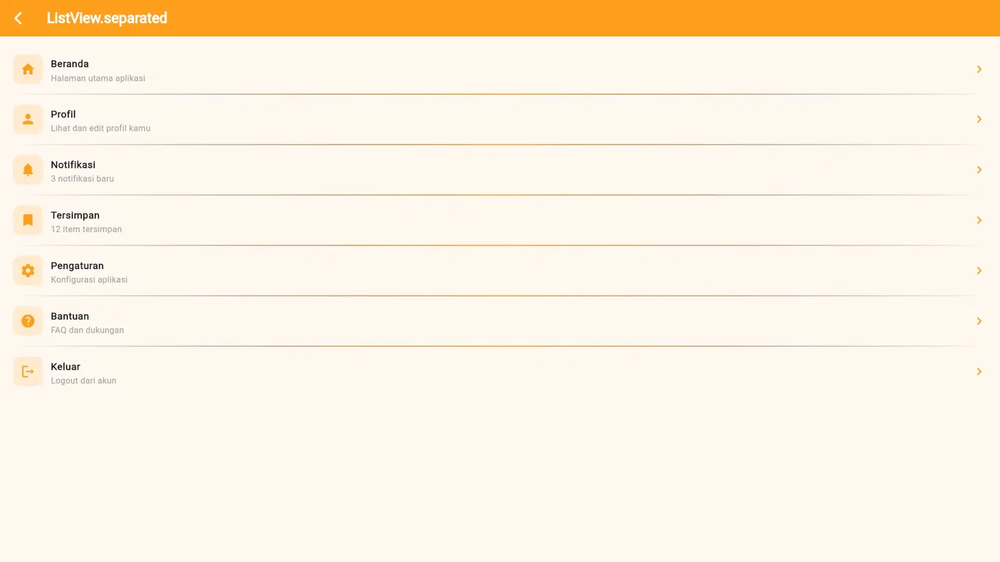
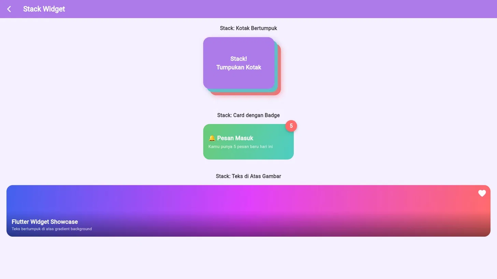

# LAPORAN PRAKTIKUM APLIKASI BERBASIS PLATFORM
## MODUL 6 — FLUTTER WIDGET SHOWCASE
### (Container, GridView, ListView, Stack)

---

**Disusun Oleh :**
- Nama : Tegar Bangkit Wijaya
- NIM : 2311102027
- Kelas : S1 IF-11-REG01


**Dosen Pengampu :** Dimas Fanny Hebrasianto Permadi, S.ST., M.Kom

**Asisten Praktikum :**
- Apri Pandu Wicaksono
- Rangga Pradarrell Fathi

**LABORATORIUM HIGH PERFORMANCE — FAKULTAS INFORMATIKA**
**UNIVERSITAS TELKOM PURWOKERTO — 2026**

---

## 1. Dasar Teori

### 1.1 Flutter
Flutter merupakan framework open-source yang dikembangkan oleh Google untuk membangun aplikasi mobile, web, dan desktop menggunakan satu basis kode (single codebase). Flutter menggunakan bahasa pemrograman Dart dan menyediakan berbagai widget yang memudahkan pengembangan antarmuka pengguna (UI) secara cepat dan responsif.

Implementasi Flutter pada praktikum ini digunakan untuk membuat aplikasi **Flutter Widget Showcase** yang menampilkan enam halaman demonstrasi widget yaitu Container, GridView, ListView (statis), ListView.builder, ListView.separated, dan Stack.

### 1.2 Widget Pada Flutter
Widget merupakan komponen dasar dalam Flutter yang digunakan untuk membangun tampilan aplikasi. Secara umum, widget pada Flutter dibagi menjadi dua jenis:

1. **StatelessWidget** — Widget yang tampilannya bersifat tetap dan tidak berubah selama aplikasi berjalan.
2. **StatefulWidget** — Widget yang dapat berubah tampilannya sesuai dengan perubahan data atau state aplikasi.

### 1.3 Widget Container
`Container` merupakan widget serbaguna pada Flutter yang digunakan untuk mengatur tampilan, dekorasi, dan ukuran suatu elemen. Properti utamanya antara lain:
- `width` & `height` — mengatur ukuran
- `color` — warna latar belakang
- `decoration` (BoxDecoration) — gradient, border, borderRadius, boxShadow
- `padding` — jarak konten ke tepi container
- `margin` — jarak container ke widget lain

### 1.4 Widget GridView
`GridView` digunakan untuk menampilkan kumpulan item dalam format grid (baris dan kolom). Pada praktikum ini digunakan `GridView.builder` dengan `SliverGridDelegateWithFixedCrossAxisCount` untuk menentukan jumlah kolom dan jarak antar item.

### 1.5 Widget ListView
Flutter menyediakan tiga varian ListView:
1. **ListView** (statis) — item tetap didefinisikan langsung di `children`.
2. **ListView.builder** — membangun item secara lazy menggunakan `itemBuilder`, cocok untuk daftar panjang/dinamis.
3. **ListView.separated** — sama seperti builder namun dengan widget pemisah antar item melalui `separatorBuilder`.

### 1.6 Widget Stack
`Stack` digunakan untuk menumpuk (overlap) beberapa widget di atas satu sama lain. Dikombinasikan dengan `Positioned` untuk mengatur posisi widget secara presisi menggunakan properti `top`, `bottom`, `left`, dan `right`.

### 1.7 Navigator (Navigasi Antar Halaman)
- `Navigator.push()` — berpindah ke halaman baru (menambah ke stack)
- `Navigator.pop()` — kembali ke halaman sebelumnya (hapus dari stack)

### 1.8 Material Design
Flutter menyediakan library `material.dart` yang berisi widget seperti `Scaffold`, `AppBar`, `GestureDetector`, `ListTile`, dan `Container`.

---

## 2. Source Code dan Implementasinya

### 2.1 main.dart

```dart
import 'package:flutter/material.dart';

void main() {
  runApp(const MyApp());
}

class MyApp extends StatelessWidget {
  const MyApp({super.key});

  @override
  Widget build(BuildContext context) {
    return MaterialApp(
      title: 'Flutter Widget Showcase',
      debugShowCheckedModeBanner: false,
      theme: ThemeData(
        colorScheme: ColorScheme.fromSeed(seedColor: Colors.deepPurple),
        useMaterial3: true,
      ),
      home: const HomePage(),
    );
  }
}
```

> **Penjelasan:** `main.dart` merupakan entry point aplikasi. Di sini didefinisikan konfigurasi dasar menggunakan `MaterialApp` dengan tema deep purple dan Material 3, serta halaman pertama yang ditampilkan adalah `HomePage`.

---

### 2.2 Home Page

```dart
class HomePage extends StatelessWidget {
  const HomePage({super.key});

  final List<Map<String, dynamic>> _menus = const [
    {
      'title': 'Container',
      'icon': Icons.square_rounded,
      'color': Color(0xFFFF6B6B),
      'page': ContainerPage(),
    },
    {
      'title': 'GridView',
      'icon': Icons.grid_view_rounded,
      'color': Color(0xFF4ECDC4),
      'page': GridViewPage(),
    },
    {
      'title': 'ListView',
      'icon': Icons.list_rounded,
      'color': Color(0xFFFFE66D),
      'page': ListViewPage(),
    },
    {
      'title': 'ListView.builder',
      'icon': Icons.view_list_rounded,
      'color': Color(0xFF6BCB77),
      'page': ListViewBuilderPage(),
    },
    {
      'title': 'ListView.separated',
      'icon': Icons.format_list_bulleted_rounded,
      'color': Color(0xFFFF9F1C),
      'page': ListViewSeparatedPage(),
    },
    {
      'title': 'Stack',
      'icon': Icons.layers_rounded,
      'color': Color(0xFFAD7BE9),
      'page': StackPage(),
    },
  ];

  @override
  Widget build(BuildContext context) {
    return Scaffold(
      backgroundColor: const Color(0xFFF0F4FF),
      appBar: AppBar(
        backgroundColor: const Color(0xFF4361EE),
        title: const Text(
          '🚀 Flutter Widget Showcase',
          style: TextStyle(
            color: Colors.white,
            fontWeight: FontWeight.bold,
            fontSize: 20,
          ),
        ),
        centerTitle: true,
        elevation: 0,
      ),
      body: Padding(
        padding: const EdgeInsets.all(16),
        child: GridView.builder(
          gridDelegate: const SliverGridDelegateWithFixedCrossAxisCount(
            crossAxisCount: 2,
            crossAxisSpacing: 16,
            mainAxisSpacing: 16,
            childAspectRatio: 1.2,
          ),
          itemCount: _menus.length,
          itemBuilder: (context, index) {
            final menu = _menus[index];
            return GestureDetector(
              onTap: () => Navigator.push(
                context,
                MaterialPageRoute(builder: (_) => menu['page'] as Widget),
              ),
              child: Container(
                decoration: BoxDecoration(
                  color: menu['color'] as Color,
                  borderRadius: BorderRadius.circular(20),
                  boxShadow: [
                    BoxShadow(
                      color: (menu['color'] as Color).withOpacity(0.5),
                      blurRadius: 10,
                      offset: const Offset(0, 4),
                    ),
                  ],
                ),
                child: Column(
                  mainAxisAlignment: MainAxisAlignment.center,
                  children: [
                    Icon(menu['icon'] as IconData, color: Colors.white, size: 42),
                    const SizedBox(height: 10),
                    Text(
                      menu['title'] as String,
                      style: const TextStyle(
                        color: Colors.white,
                        fontWeight: FontWeight.bold,
                        fontSize: 15,
                      ),
                      textAlign: TextAlign.center,
                    ),
                  ],
                ),
              ),
            );
          },
        ),
      ),
    );
  }
}
```

> **Penjelasan:** `HomePage` menggunakan `StatelessWidget` dan menampilkan enam menu card dalam format `GridView` dua kolom. Saat card ditekan, `Navigator.push()` membawa pengguna ke halaman yang sesuai.

---

### 2.3 Container Page

```dart
class ContainerPage extends StatelessWidget {
  const ContainerPage({super.key});

  @override
  Widget build(BuildContext context) {
    return Scaffold(
      backgroundColor: const Color(0xFFFFF5F5),
      appBar: _buildAppBar(context, 'Container Widget', const Color(0xFFFF6B6B)),
      body: SingleChildScrollView(
        padding: const EdgeInsets.all(20),
        child: Column(
          crossAxisAlignment: CrossAxisAlignment.stretch,
          children: [
            _sectionTitle('Container Dasar'),
            const SizedBox(height: 12),

            // Container sederhana
            Container(
              width: double.infinity,
              height: 100,
              color: const Color(0xFFFF6B6B),
              child: const Center(
                child: Text(
                  'Container Sederhana',
                  style: TextStyle(
                    color: Colors.white,
                    fontSize: 18,
                    fontWeight: FontWeight.bold,
                  ),
                ),
              ),
            ),
            const SizedBox(height: 16),

            // Container dengan gradient + shadow
            Container(
              width: double.infinity,
              height: 100,
              decoration: BoxDecoration(
                gradient: const LinearGradient(
                  colors: [Color(0xFFFF6B6B), Color(0xFFFF8E53)],
                  begin: Alignment.topLeft,
                  end: Alignment.bottomRight,
                ),
                borderRadius: BorderRadius.circular(20),
                boxShadow: [
                  BoxShadow(
                    color: const Color(0xFFFF6B6B).withOpacity(0.5),
                    blurRadius: 12,
                    offset: const Offset(0, 6),
                  ),
                ],
              ),
              child: const Center(
                child: Text(
                  'Container + Gradient + Shadow',
                  style: TextStyle(
                    color: Colors.white,
                    fontSize: 16,
                    fontWeight: FontWeight.bold,
                  ),
                ),
              ),
            ),
            const SizedBox(height: 16),

            // Container dengan border
            Container(
              width: double.infinity,
              height: 100,
              decoration: BoxDecoration(
                color: Colors.white,
                borderRadius: BorderRadius.circular(16),
                border: Border.all(color: const Color(0xFFFF6B6B), width: 3),
              ),
              child: const Center(
                child: Text(
                  'Container + Border',
                  style: TextStyle(
                    color: Color(0xFFFF6B6B),
                    fontSize: 16,
                    fontWeight: FontWeight.bold,
                  ),
                ),
              ),
            ),
            const SizedBox(height: 16),

            // Container dengan padding & margin
            Container(
              margin: const EdgeInsets.symmetric(horizontal: 20),
              padding: const EdgeInsets.all(20),
              decoration: BoxDecoration(
                color: const Color(0xFFFFE0E0),
                borderRadius: BorderRadius.circular(16),
              ),
              child: const Text(
                'Container dengan Padding & Margin\n(padding: 20, margin: horizontal 20)',
                style: TextStyle(color: Color(0xFFCC3333), fontSize: 14),
                textAlign: TextAlign.center,
              ),
            ),
            const SizedBox(height: 16),

            _sectionTitle('Variasi Ukuran'),
            const SizedBox(height: 12),
            Row(
              mainAxisAlignment: MainAxisAlignment.spaceEvenly,
              children: [
                _colorBox(60, const Color(0xFFFF6B6B), 'S'),
                _colorBox(80, const Color(0xFFFF4444), 'M'),
                _colorBox(100, const Color(0xFFCC0000), 'L'),
                _colorBox(80, const Color(0xFFFF4444), 'M'),
                _colorBox(60, const Color(0xFFFF6B6B), 'S'),
              ],
            ),
          ],
        ),
      ),
    );
  }

  Widget _colorBox(double size, Color color, String label) {
    return Container(
      width: size,
      height: size,
      decoration: BoxDecoration(
        color: color,
        borderRadius: BorderRadius.circular(12),
      ),
      child: Center(
        child: Text(
          label,
          style: const TextStyle(
            color: Colors.white,
            fontWeight: FontWeight.bold,
            fontSize: 16,
          ),
        ),
      ),
    );
  }
}
```

> **Penjelasan:** `ContainerPage` menampilkan empat variasi Container: warna solid, gradient + shadow, border, dan padding & margin. Di bagian bawah terdapat demonstrasi variasi ukuran S, M, L.

---

### 2.4 GridView Page

```dart
class GridViewPage extends StatelessWidget {
  const GridViewPage({super.key});

  final List<Map<String, dynamic>> _items = const [
    {'label': 'Item 1', 'icon': Icons.star, 'color': Color(0xFF4ECDC4)},
    {'label': 'Item 2', 'icon': Icons.favorite, 'color': Color(0xFFFF6B6B)},
    {'label': 'Item 3', 'icon': Icons.bolt, 'color': Color(0xFFFFE66D)},
    {'label': 'Item 4', 'icon': Icons.local_fire_department, 'color': Color(0xFFFF9F1C)},
    {'label': 'Item 5', 'icon': Icons.diamond, 'color': Color(0xFFAD7BE9)},
    {'label': 'Item 6', 'icon': Icons.rocket_launch, 'color': Color(0xFF6BCB77)},
    {'label': 'Item 7', 'icon': Icons.emoji_events, 'color': Color(0xFF4361EE)},
    {'label': 'Item 8', 'icon': Icons.palette, 'color': Color(0xFFE040FB)},
  ];

  @override
  Widget build(BuildContext context) {
    return Scaffold(
      backgroundColor: const Color(0xFFF0FFFD),
      appBar: _buildAppBar(context, 'GridView Widget', const Color(0xFF4ECDC4)),
      body: Padding(
        padding: const EdgeInsets.all(16),
        child: GridView.builder(
          gridDelegate: const SliverGridDelegateWithFixedCrossAxisCount(
            crossAxisCount: 2,
            crossAxisSpacing: 14,
            mainAxisSpacing: 14,
            childAspectRatio: 1.0,
          ),
          itemCount: _items.length,
          itemBuilder: (context, index) {
            final item = _items[index];
            return Container(
              decoration: BoxDecoration(
                color: item['color'] as Color,
                borderRadius: BorderRadius.circular(20),
                boxShadow: [
                  BoxShadow(
                    color: (item['color'] as Color).withOpacity(0.4),
                    blurRadius: 10,
                    offset: const Offset(0, 4),
                  ),
                ],
              ),
              child: Column(
                mainAxisAlignment: MainAxisAlignment.center,
                children: [
                  Icon(item['icon'] as IconData, color: Colors.white, size: 48),
                  const SizedBox(height: 10),
                  Text(
                    item['label'] as String,
                    style: const TextStyle(
                      color: Colors.white,
                      fontWeight: FontWeight.bold,
                      fontSize: 16,
                    ),
                  ),
                ],
              ),
            );
          },
        ),
      ),
    );
  }
}
```

> **Penjelasan:** `GridViewPage` menampilkan 8 item dalam grid 2 kolom menggunakan `GridView.builder`. Setiap item berupa card berwarna dengan ikon dan label. `childAspectRatio: 1.0` membuat setiap item berbentuk persegi.

---

### 2.5 ListView Page (Statis)

```dart
class ListViewPage extends StatelessWidget {
  const ListViewPage({super.key});

  @override
  Widget build(BuildContext context) {
    const items = [
      {'label': 'A', 'title': 'Item A', 'sub': 'Ini adalah item pertama', 'color': Color(0xFFFF6B6B)},
      {'label': 'B', 'title': 'Item B', 'sub': 'Ini adalah item kedua', 'color': Color(0xFF4ECDC4)},
      {'label': 'C', 'title': 'Item C', 'sub': 'Ini adalah item ketiga', 'color': Color(0xFFFFE66D)},
    ];

    return Scaffold(
      backgroundColor: const Color(0xFFFFFBF0),
      appBar: _buildAppBar(context, 'ListView (Statis)', const Color(0xFFFFE66D)),
      body: ListView(
        padding: const EdgeInsets.all(16),
        children: items.map((item) {
          return Container(
            margin: const EdgeInsets.only(bottom: 14),
            decoration: BoxDecoration(
              color: Colors.white,
              borderRadius: BorderRadius.circular(16),
              boxShadow: [
                BoxShadow(
                  color: (item['color'] as Color).withOpacity(0.3),
                  blurRadius: 10,
                  offset: const Offset(0, 4),
                ),
              ],
              border: Border.all(
                color: (item['color'] as Color).withOpacity(0.4),
                width: 1.5,
              ),
            ),
            child: ListTile(
              contentPadding: const EdgeInsets.symmetric(horizontal: 16, vertical: 8),
              leading: Container(
                width: 52,
                height: 52,
                decoration: BoxDecoration(
                  color: item['color'] as Color,
                  borderRadius: BorderRadius.circular(14),
                ),
                child: Center(
                  child: Text(
                    item['label'] as String,
                    style: const TextStyle(
                      color: Colors.white,
                      fontWeight: FontWeight.bold,
                      fontSize: 22,
                    ),
                  ),
                ),
              ),
              title: Text(
                item['title'] as String,
                style: const TextStyle(fontWeight: FontWeight.bold, fontSize: 16),
              ),
              subtitle: Text(item['sub'] as String),
              trailing: Icon(
                Icons.arrow_forward_ios_rounded,
                color: item['color'] as Color,
                size: 18,
              ),
            ),
          );
        }).toList(),
      ),
    );
  }
}
```

> **Penjelasan:** `ListViewPage` menampilkan 3 item statis (A, B, C) menggunakan `ListView` biasa. Data didefinisikan langsung sebagai list konstanta. Setiap item menggunakan `ListTile` dengan avatar berwarna, judul, subtitle, dan ikon panah.

---

### 2.6 ListView.builder Page

```dart
class ListViewBuilderPage extends StatelessWidget {
  const ListViewBuilderPage({super.key});

  final List<Map<String, dynamic>> _dataArray = const [
    {'name': 'Budi Santoso', 'role': 'Flutter Developer', 'avatar': '👨‍💻'},
    {'name': 'Siti Rahayu', 'role': 'UI/UX Designer', 'avatar': '👩‍🎨'},
    {'name': 'Agus Prasetyo', 'role': 'Backend Engineer', 'avatar': '👨‍🔧'},
    {'name': 'Dewi Lestari', 'role': 'Product Manager', 'avatar': '👩‍💼'},
    {'name': 'Rudi Hermawan', 'role': 'DevOps Engineer', 'avatar': '👨‍🚀'},
    {'name': 'Rina Kusuma', 'role': 'Data Scientist', 'avatar': '👩‍🔬'},
    {'name': 'Hendra Wijaya', 'role': 'QA Engineer', 'avatar': '🧑‍💻'},
  ];

  final List<Color> _colors = const [
    Color(0xFF6BCB77), Color(0xFF4ECDC4), Color(0xFF4361EE),
    Color(0xFFFF9F1C), Color(0xFFAD7BE9), Color(0xFFFF6B6B), Color(0xFFE040FB),
  ];

  @override
  Widget build(BuildContext context) {
    return Scaffold(
      backgroundColor: const Color(0xFFF0FFF4),
      appBar: _buildAppBar(context, 'ListView.builder', const Color(0xFF6BCB77)),
      body: ListView.builder(
        padding: const EdgeInsets.all(16),
        itemCount: _dataArray.length,
        itemBuilder: (context, index) {
          final item = _dataArray[index];
          final color = _colors[index % _colors.length];
          return Container(
            margin: const EdgeInsets.only(bottom: 12),
            decoration: BoxDecoration(
              color: Colors.white,
              borderRadius: BorderRadius.circular(16),
              boxShadow: [
                BoxShadow(
                  color: color.withOpacity(0.25),
                  blurRadius: 8,
                  offset: const Offset(0, 3),
                ),
              ],
            ),
            child: ListTile(
              contentPadding: const EdgeInsets.symmetric(horizontal: 16, vertical: 8),
              leading: Container(
                width: 52,
                height: 52,
                decoration: BoxDecoration(
                  color: color.withOpacity(0.15),
                  borderRadius: BorderRadius.circular(14),
                ),
                child: Center(
                  child: Text(item['avatar'] as String, style: const TextStyle(fontSize: 26)),
                ),
              ),
              title: Text(
                item['name'] as String,
                style: const TextStyle(fontWeight: FontWeight.bold, fontSize: 15),
              ),
              subtitle: Text(
                item['role'] as String,
                style: TextStyle(color: color, fontWeight: FontWeight.w600),
              ),
              trailing: Container(
                padding: const EdgeInsets.symmetric(horizontal: 10, vertical: 4),
                decoration: BoxDecoration(
                  color: color.withOpacity(0.15),
                  borderRadius: BorderRadius.circular(20),
                ),
                child: Text(
                  '#${index + 1}',
                  style: TextStyle(color: color, fontWeight: FontWeight.bold),
                ),
              ),
            ),
          );
        },
      ),
    );
  }
}
```

> **Penjelasan:** `ListViewBuilderPage` menggunakan `ListView.builder` untuk membangun 7 item secara dinamis. Warna item bergantian menggunakan `_colors[index % _colors.length]`. Setiap item menampilkan avatar emoji, nama, role berwarna, dan badge nomor urut.

---

### 2.7 ListView.separated Page

```dart
class ListViewSeparatedPage extends StatelessWidget {
  const ListViewSeparatedPage({super.key});

  final List<Map<String, dynamic>> _menuItems = const [
    {'icon': Icons.home_rounded, 'title': 'Beranda', 'sub': 'Halaman utama aplikasi'},
    {'icon': Icons.person_rounded, 'title': 'Profil', 'sub': 'Lihat dan edit profil kamu'},
    {'icon': Icons.notifications_rounded, 'title': 'Notifikasi', 'sub': '3 notifikasi baru'},
    {'icon': Icons.bookmark_rounded, 'title': 'Tersimpan', 'sub': '12 item tersimpan'},
    {'icon': Icons.settings_rounded, 'title': 'Pengaturan', 'sub': 'Konfigurasi aplikasi'},
    {'icon': Icons.help_rounded, 'title': 'Bantuan', 'sub': 'FAQ dan dukungan'},
    {'icon': Icons.logout_rounded, 'title': 'Keluar', 'sub': 'Logout dari akun'},
  ];

  @override
  Widget build(BuildContext context) {
    return Scaffold(
      backgroundColor: const Color(0xFFFFF8F0),
      appBar: _buildAppBar(context, 'ListView.separated', const Color(0xFFFF9F1C)),
      body: ListView.separated(
        padding: const EdgeInsets.symmetric(vertical: 12),
        itemCount: _menuItems.length,
        separatorBuilder: (context, index) => Container(
          margin: const EdgeInsets.symmetric(horizontal: 20),
          height: 1.5,
          decoration: BoxDecoration(
            gradient: const LinearGradient(
              colors: [Colors.transparent, Color(0xFFFF9F1C), Colors.transparent],
            ),
            borderRadius: BorderRadius.circular(10),
          ),
        ),
        itemBuilder: (context, index) {
          final item = _menuItems[index];
          return ListTile(
            contentPadding: const EdgeInsets.symmetric(horizontal: 20, vertical: 6),
            leading: Container(
              width: 46,
              height: 46,
              decoration: BoxDecoration(
                color: const Color(0xFFFF9F1C).withOpacity(0.15),
                borderRadius: BorderRadius.circular(12),
              ),
              child: Icon(item['icon'] as IconData, color: const Color(0xFFFF9F1C), size: 24),
            ),
            title: Text(
              item['title'] as String,
              style: const TextStyle(fontWeight: FontWeight.bold, fontSize: 15),
            ),
            subtitle: Text(
              item['sub'] as String,
              style: const TextStyle(color: Colors.grey, fontSize: 13),
            ),
            trailing: const Icon(Icons.chevron_right_rounded, color: Color(0xFFFF9F1C)),
          );
        },
      ),
    );
  }
}
```

> **Penjelasan:** `ListViewSeparatedPage` menggunakan `ListView.separated` untuk menampilkan 7 menu navigasi. `separatorBuilder` membuat garis pemisah gradient oranye di antara setiap item, menyerupai tampilan menu pengaturan aplikasi mobile.

---

### 2.8 Stack Page

```dart
class StackPage extends StatelessWidget {
  const StackPage({super.key});

  @override
  Widget build(BuildContext context) {
    return Scaffold(
      backgroundColor: const Color(0xFFF5F0FF),
      appBar: _buildAppBar(context, 'Stack Widget', const Color(0xFFAD7BE9)),
      body: SingleChildScrollView(
        padding: const EdgeInsets.all(20),
        child: Column(
          children: [
            _sectionTitle('Stack: Kotak Bertumpuk'),
            const SizedBox(height: 16),

            // Stack 1: Kotak Bertumpuk
            Center(
              child: SizedBox(
                width: 280,
                height: 200,
                child: Stack(
                  children: [
                    Positioned(
                      top: 20, left: 20,
                      child: Container(
                        width: 220, height: 160,
                        decoration: BoxDecoration(
                          color: const Color(0xFFFF6B6B),
                          borderRadius: BorderRadius.circular(20),
                        ),
                      ),
                    ),
                    Positioned(
                      top: 10, left: 10,
                      child: Container(
                        width: 220, height: 160,
                        decoration: BoxDecoration(
                          color: const Color(0xFF4ECDC4),
                          borderRadius: BorderRadius.circular(20),
                        ),
                      ),
                    ),
                    Positioned(
                      top: 0, left: 0,
                      child: Container(
                        width: 220, height: 160,
                        decoration: BoxDecoration(
                          color: const Color(0xFFAD7BE9),
                          borderRadius: BorderRadius.circular(20),
                        ),
                        child: const Center(
                          child: Text(
                            'Stack!\nTumpukan Kotak',
                            style: TextStyle(
                              color: Colors.white,
                              fontWeight: FontWeight.bold,
                              fontSize: 18,
                            ),
                            textAlign: TextAlign.center,
                          ),
                        ),
                      ),
                    ),
                  ],
                ),
              ),
            ),

            const SizedBox(height: 30),
            _sectionTitle('Stack: Card dengan Badge'),
            const SizedBox(height: 16),

            // Stack 2: Card dengan Badge
            Center(
              child: SizedBox(
                width: 280, height: 120,
                child: Stack(
                  clipBehavior: Clip.none,
                  children: [
                    Container(
                      width: 280, height: 110,
                      decoration: BoxDecoration(
                        gradient: const LinearGradient(
                          colors: [Color(0xFF6BCB77), Color(0xFF4ECDC4)],
                        ),
                        borderRadius: BorderRadius.circular(20),
                      ),
                      child: const Padding(
                        padding: EdgeInsets.all(16),
                        child: Column(
                          crossAxisAlignment: CrossAxisAlignment.start,
                          mainAxisAlignment: MainAxisAlignment.center,
                          children: [
                            Text('🔔 Pesan Masuk',
                              style: TextStyle(color: Colors.white, fontSize: 18, fontWeight: FontWeight.bold)),
                            SizedBox(height: 4),
                            Text('Kamu punya 5 pesan baru hari ini',
                              style: TextStyle(color: Colors.white70, fontSize: 13)),
                          ],
                        ),
                      ),
                    ),
                    Positioned(
                      top: -12, right: -10,
                      child: Container(
                        width: 36, height: 36,
                        decoration: const BoxDecoration(
                          color: Color(0xFFFF6B6B),
                          shape: BoxShape.circle,
                        ),
                        child: const Center(
                          child: Text('5',
                            style: TextStyle(color: Colors.white, fontWeight: FontWeight.bold, fontSize: 16)),
                        ),
                      ),
                    ),
                  ],
                ),
              ),
            ),

            const SizedBox(height: 30),
            _sectionTitle('Stack: Teks di Atas Gambar'),
            const SizedBox(height: 16),

            // Stack 3: Gradient Overlay + Teks
            ClipRRect(
              borderRadius: BorderRadius.circular(20),
              child: Stack(
                children: [
                  Container(
                    height: 160,
                    decoration: const BoxDecoration(
                      gradient: LinearGradient(
                        colors: [Color(0xFF4361EE), Color(0xFFE040FB), Color(0xFFFF6B6B)],
                        begin: Alignment.topLeft,
                        end: Alignment.bottomRight,
                      ),
                    ),
                  ),
                  Positioned(
                    bottom: 0, left: 0, right: 0,
                    child: Container(
                      height: 80,
                      decoration: const BoxDecoration(
                        gradient: LinearGradient(
                          colors: [Colors.transparent, Colors.black45],
                          begin: Alignment.topCenter,
                          end: Alignment.bottomCenter,
                        ),
                      ),
                    ),
                  ),
                  const Positioned(
                    bottom: 16, left: 16, right: 16,
                    child: Column(
                      crossAxisAlignment: CrossAxisAlignment.start,
                      children: [
                        Text('Flutter Widget Showcase',
                          style: TextStyle(color: Colors.white, fontSize: 18, fontWeight: FontWeight.bold)),
                        Text('Teks bertumpuk di atas gradient background',
                          style: TextStyle(color: Colors.white70, fontSize: 12)),
                      ],
                    ),
                  ),
                  const Positioned(
                    top: 12, right: 12,
                    child: Icon(Icons.favorite_rounded, color: Colors.white, size: 28),
                  ),
                ],
              ),
            ),
          ],
        ),
      ),
    );
  }
}
```

> **Penjelasan:** `StackPage` menampilkan 3 demonstrasi Stack: kotak bertumpuk dengan offset, card dengan badge yang melampaui batas (`clipBehavior: Clip.none`), dan teks di atas gradient dengan dark overlay.

---

### 2.9 Helper Widgets

```dart
PreferredSizeWidget _buildAppBar(BuildContext context, String title, Color color) {
  return AppBar(
    backgroundColor: color,
    title: Text(title, style: const TextStyle(color: Colors.white, fontWeight: FontWeight.bold)),
    leading: IconButton(
      icon: const Icon(Icons.arrow_back_ios_rounded, color: Colors.white),
      onPressed: () => Navigator.pop(context),
    ),
    elevation: 0,
  );
}

Widget _sectionTitle(String text) {
  return Text(
    text,
    style: const TextStyle(fontSize: 16, fontWeight: FontWeight.bold, color: Color(0xFF333333)),
  );
}
```

> **Penjelasan:** Dua helper function yang digunakan bersama di semua halaman. `_buildAppBar` membuat AppBar dengan warna kustom dan tombol back, sedangkan `_sectionTitle` membuat judul bagian yang konsisten.

---

## 3. Output

### 3.1 Container Widget
Menampilkan berbagai variasi Container: warna solid, gradient + shadow, border, padding & margin, serta variasi ukuran S, M, L.



---

### 3.2 GridView Widget
Menampilkan 8 item dalam format grid 2 kolom, masing-masing berupa card berwarna dengan ikon dan label.



---

### 3.3 ListView (Statis)
Menampilkan 3 item statis (A, B, C) dengan desain card menggunakan ListTile, avatar berwarna, dan ikon panah.



---

### 3.4 ListView.builder
Menampilkan 7 profil karyawan secara dinamis dengan warna bergantian dan badge nomor urut.



---

### 3.5 ListView.separated
Menampilkan 7 menu navigasi dengan pemisah berupa garis gradient oranye di antara setiap item.



---

### 3.6 Stack Widget
Menampilkan 3 demonstrasi Stack: kotak bertumpuk, card dengan badge notifikasi, dan teks di atas gradient background.

