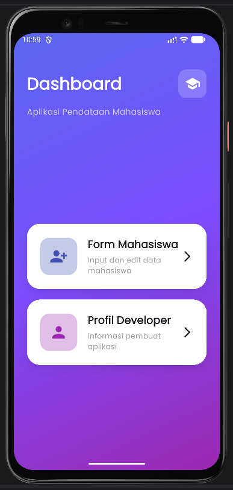

<div align="center">
  <br />
  <h1>LAPORAN PRAKTIKUM <br>APLIKASI BERBASIS PLATFORM</h1>
  <br />
  <h3>MODUL 7<br> NAVIGATION & STATE MANAGEMENT</h3>
  <br />
   
  <br />
  <br />
  <br />
  <h3>Disusun Oleh :</h3>
  <p>
    <strong>BAYU KUNCORO ADI</strong><br>
    <strong>2311102031</strong><br>
    <strong>S1 IF-11-REG01</strong>
  </p>
  <br />
  <br />
  <h3>Dosen Pengampu :</h3>
  <p>
    <strong>Dimas Fanny Hebrasianto Permadi, S.ST., M.Kom</strong>
  </p>
  <br />
  <br />
    <h4>Asisten Praktikum :</h4>
    <strong> Apri Pandu Wicaksono </strong> <br>
    <strong>Rangga Pradarrell Fathi</strong>
  <br />
  <h3>LABORATORIUM HIGH PERFORMANCE
 <br>FAKULTAS INFORMATIKA <br>UNIVERSITAS TELKOM PURWOKERTO <br>2026</h3>
</div>

---

## 1. Dasar Teori

#### 1.1 Mengenal Flutter
Flutter merupakan *framework open-source* besutan Google yang dirancang untuk menciptakan aplikasi multi-platform (mobile, web, dan desktop) hanya dengan mengandalkan satu basis kode (*single codebase*). Berjalan dengan bahasa pemrograman Dart, Flutter mengadopsi prinsip *“Everything is a Widget”*, di mana seluruh elemen visual pembangun antarmuka (UI) diperlakukan sebagai sekumpulan widget. Pada project praktikum ini, Flutter dimanfaatkan untuk merangkai antarmuka interaktif sederhana yang menitikberatkan pada penggunaan layouting dan form input.

#### 1.2 Konsep Widget
Widget bertindak sebagai blok penyusun fundamental dalam setiap aplikasi Flutter, baik sebagai elemen visual langsung maupun sebagai struktur pengatur tata letak. Secara garis besar, Flutter mengklasifikasikan widget ke dalam dua kategori utama:
* **StatelessWidget**: Komponen statis yang tampilannya bersifat permanen dan tidak akan mengalami perubahan *state* selama aplikasi berjalan.
* **StatefulWidget**: Komponen dinamis yang mampu memperbarui atau merender ulang tampilannya secara *real-time* merespons interaksi pengguna atau perubahan data. Pada project ini, `StatefulWidget` digunakan sebagai fondasi halaman utama agar aplikasi siap menangani perubahan data pada area form.

#### 1.3 Pengaturan Tata Letak dengan Column
`Column` adalah widget struktural yang bertugas menyusun sekumpulan widget anak (*children*) secara vertikal dari atas ke bawah. Untuk menyesuaikan perataan elemen di dalamnya secara horizontal, `Column` menyediakan properti seperti `crossAxisAlignment`. Dalam implementasinya di praktikum ini, `Column` difungsikan sebagai kerangka utama untuk menumpuk elemen-elemen seperti teks sapaan dan form input agar berjajar rapi ke bawah.

#### 1.4 Memberikan Ruang dengan Padding
Untuk menghindari tampilan yang terlalu sesak, digunakan widget `Padding`. Fungsinya adalah memberikan ruang kosong (spasi internal) antara suatu komponen dengan komponen lain di sekitarnya atau dengan batas tepi layar perangkat. Pengaplikasian `Padding` pada praktikum ini bertujuan untuk memberikan margin pada area `TextField`, sehingga form input terlihat lebih proporsional, nyaman dipandang, dan tidak menempel langsung pada bezel (*edge*) layar.

#### 1.5 Interaksi Pengguna melalui TextField
Sebagai media input utama, `TextField` memfasilitasi pengguna untuk memasukkan data teks ke dalam aplikasi. Widget ini dilengkapi dengan berbagai properti fungsional, seperti `hintText` yang berfungsi sebagai teks *placeholder* atau panduan singkat, `border` untuk memodifikasi bentuk garis tepi kolom, serta `controller` yang bertugas merekam dan memanipulasi teks yang diketik. Pada program ini, `TextField` dikustomisasi agar memiliki garis tepi melingkar/kotak yang modern memanfaatkan `OutlineInputBorder()`.

#### 1.6 Standarisasi Material Design
Material Design adalah pedoman desain visual komprehensif dari Google yang bertujuan menciptakan pengalaman pengguna (UX) yang konsisten, modern, dan intuitif. Melalui integrasi *library* `material.dart`, Flutter menyediakan akses langsung ke berbagai komponen bawaan Material seperti `Scaffold`, `AppBar`, `Card`, hingga `TextField`. Penerapan `MaterialApp` sebagai akar dari program ini memastikan bahwa seluruh antarmuka yang dibangun otomatis mewarisi gaya desain Material yang familier dan interaktif.

---

## 2. Source Code dan Implementasinya

Berikut adalah kode program yang dipelajari pada Modul 5 ini:

```dart
/*
 * LAPORAN PRAKTIKUM MODUL 7 : NAVIGATION & STATE MANAGEMENT
 * Nama : Bayu Kuncoro Adi
 * NIM  : 2311102031
 */

import 'package:flutter/material.dart';
import 'package:google_fonts/google_fonts.dart';

void main() {
  runApp(const MyApp());
}

class MyApp extends StatelessWidget {
  const MyApp({super.key});

  @override
  Widget build(BuildContext context) {
    return MaterialApp(
      debugShowCheckedModeBanner: false,
      title: 'Data Mahasiswa',
      theme: ThemeData(
        primaryColor: const Color(0xff5B67F1),
        textTheme: GoogleFonts.poppinsTextTheme(),
        scaffoldBackgroundColor: const Color(0xffF5F7FF),
      ),
      home: const HomePage(),
    );
  }
}

// ================= HOME PAGE =================

class HomePage extends StatelessWidget {
  const HomePage({super.key});

  @override
  Widget build(BuildContext context) {
    return Scaffold(
      body: Container(
        width: double.infinity,
        decoration: const BoxDecoration(
          gradient: LinearGradient(
            colors: [
              Color(0xff5B67F1),
              Color(0xff7C4DFF),
              Color(0xff9C27B0),
            ],
            begin: Alignment.topLeft,
            end: Alignment.bottomRight,
          ),
        ),
        child: SafeArea(
          child: Padding(
            padding: const EdgeInsets.all(25),
            child: Column(
              crossAxisAlignment: CrossAxisAlignment.start,
              children: [
                const SizedBox(height: 20),

                Row(
                  mainAxisAlignment: MainAxisAlignment.spaceBetween,
                  children: [
                    const Text(
                      "Dashboard",
                      style: TextStyle(
                        color: Colors.white,
                        fontSize: 32,
                        fontWeight: FontWeight.bold,
                      ),
                    ),
                    Container(
                      padding: const EdgeInsets.all(12),
                      decoration: BoxDecoration(
                        color: Colors.white.withOpacity(0.2),
                        borderRadius: BorderRadius.circular(15),
                      ),
                      child: const Icon(
                        Icons.school,
                        color: Colors.white,
                        size: 30,
                      ),
                    )
                  ],
                ),

                const SizedBox(height: 15),

                const Text(
                  "Aplikasi Pendataan Mahasiswa",
                  style: TextStyle(
                    color: Colors.white70,
                    fontSize: 16,
                  ),
                ),

                const SizedBox(height: 50),

                Expanded(
                  child: Column(
                    mainAxisAlignment: MainAxisAlignment.center,
                    children: [

                      // CARD FORM
                      GestureDetector(
                        onTap: () {
                          Navigator.push(
                            context,
                            MaterialPageRoute(
                              builder: (context) =>
                              const FormMahasiswaPage(),
                            ),
                          );
                        },
                        child: Container(
                          width: double.infinity,
                          padding: const EdgeInsets.all(25),
                          margin: const EdgeInsets.only(bottom: 20),
                          decoration: BoxDecoration(
                            color: Colors.white,
                            borderRadius: BorderRadius.circular(25),
                            boxShadow: [
                              BoxShadow(
                                color: Colors.black.withOpacity(0.1),
                                blurRadius: 15,
                                offset: const Offset(0, 8),
                              )
                            ],
                          ),
                          child: Row(
                            children: [
                              Container(
                                padding: const EdgeInsets.all(18),
                                decoration: BoxDecoration(
                                  color: Colors.indigo.shade100,
                                  borderRadius: BorderRadius.circular(18),
                                ),
                                child: const Icon(
                                  Icons.person_add_alt_1,
                                  size: 35,
                                  color: Colors.indigo,
                                ),
                              ),

                              const SizedBox(width: 20),

                              const Expanded(
                                child: Column(
                                  crossAxisAlignment:
                                  CrossAxisAlignment.start,
                                  children: [
                                    Text(
                                      "Form Mahasiswa",
                                      style: TextStyle(
                                        fontSize: 20,
                                        fontWeight: FontWeight.bold,
                                      ),
                                    ),
                                    SizedBox(height: 5),
                                    Text(
                                      "Input dan edit data mahasiswa",
                                      style: TextStyle(
                                        color: Colors.grey,
                                      ),
                                    ),
                                  ],
                                ),
                              ),

                              const Icon(Icons.arrow_forward_ios),
                            ],
                          ),
                        ),
                      ),

                      // CARD PROFIL
                      GestureDetector(
                        onTap: () {
                          Navigator.push(
                            context,
                            MaterialPageRoute(
                              builder: (context) =>
                              const ProfilDeveloperPage(),
                            ),
                          );
                        },
                        child: Container(
                          width: double.infinity,
                          padding: const EdgeInsets.all(25),
                          decoration: BoxDecoration(
                            color: Colors.white,
                            borderRadius: BorderRadius.circular(25),
                            boxShadow: [
                              BoxShadow(
                                color: Colors.black.withOpacity(0.1),
                                blurRadius: 15,
                                offset: const Offset(0, 8),
                              )
                            ],
                          ),
                          child: Row(
                            children: [
                              Container(
                                padding: const EdgeInsets.all(18),
                                decoration: BoxDecoration(
                                  color: Colors.purple.shade100,
                                  borderRadius: BorderRadius.circular(18),
                                ),
                                child: const Icon(
                                  Icons.person,
                                  size: 35,
                                  color: Colors.purple,
                                ),
                              ),

                              const SizedBox(width: 20),

                              const Expanded(
                                child: Column(
                                  crossAxisAlignment:
                                  CrossAxisAlignment.start,
                                  children: [
                                    Text(
                                      "Profil Developer",
                                      style: TextStyle(
                                        fontSize: 20,
                                        fontWeight: FontWeight.bold,
                                      ),
                                    ),
                                    SizedBox(height: 5),
                                    Text(
                                      "Informasi pembuat aplikasi",
                                      style: TextStyle(
                                        color: Colors.grey,
                                      ),
                                    ),
                                  ],
                                ),
                              ),

                              const Icon(Icons.arrow_forward_ios),
                            ],
                          ),
                        ),
                      ),
                    ],
                  ),
                )
              ],
            ),
          ),
        ),
      ),
    );
  }
}

// ================= FORM PAGE =================

class FormMahasiswaPage extends StatefulWidget {
  const FormMahasiswaPage({super.key});

  @override
  State<FormMahasiswaPage> createState() => _FormMahasiswaPageState();
}

class _FormMahasiswaPageState extends State<FormMahasiswaPage> {
  final TextEditingController namaController = TextEditingController();
  final TextEditingController nimController = TextEditingController();
  final TextEditingController kelasController = TextEditingController();

  String nama = "";
  String nim = "";
  String kelas = "";

  void simpanData() {
    setState(() {
      nama = namaController.text;
      nim = nimController.text;
      kelas = kelasController.text;
    });

    ScaffoldMessenger.of(context).showSnackBar(
      SnackBar(
        behavior: SnackBarBehavior.floating,
        backgroundColor: Colors.green,
        shape: RoundedRectangleBorder(
          borderRadius: BorderRadius.circular(15),
        ),
        content: const Text(
          "Data berhasil disimpan!",
          style: TextStyle(fontSize: 16),
        ),
      ),
    );
  }

  Widget customTextField({
    required String hint,
    required IconData icon,
    required TextEditingController controller,
  }) {
    return Container(
      margin: const EdgeInsets.only(bottom: 20),
      decoration: BoxDecoration(
        color: Colors.white,
        borderRadius: BorderRadius.circular(18),
        boxShadow: [
          BoxShadow(
            color: Colors.black.withOpacity(0.05),
            blurRadius: 10,
          )
        ],
      ),
      child: TextField(
        controller: controller,
        decoration: InputDecoration(
          border: InputBorder.none,
          contentPadding: const EdgeInsets.all(20),
          hintText: hint,
          prefixIcon: Icon(icon, color: Colors.indigo),
        ),
      ),
    );
  }

  @override
  Widget build(BuildContext context) {
    return Scaffold(
      appBar: AppBar(
        title: const Text("Form Mahasiswa"),
        centerTitle: true,
        backgroundColor: const Color(0xff5B67F1),
      ),
      body: SingleChildScrollView(
        padding: const EdgeInsets.all(20),
        child: Column(
          children: [

            Container(
              width: double.infinity,
              padding: const EdgeInsets.all(25),
              decoration: BoxDecoration(
                gradient: const LinearGradient(
                  colors: [
                    Color(0xff5B67F1),
                    Color(0xff7C4DFF),
                  ],
                ),
                borderRadius: BorderRadius.circular(25),
              ),
              child: const Column(
                children: [
                  Icon(
                    Icons.assignment,
                    size: 70,
                    color: Colors.white,
                  ),
                  SizedBox(height: 15),
                  Text(
                    "Input Data Mahasiswa",
                    style: TextStyle(
                      color: Colors.white,
                      fontSize: 24,
                      fontWeight: FontWeight.bold,
                    ),
                  )
                ],
              ),
            ),

            const SizedBox(height: 30),

            customTextField(
              hint: "Masukkan Nama",
              icon: Icons.person,
              controller: namaController,
            ),

            customTextField(
              hint: "Masukkan NIM",
              icon: Icons.badge,
              controller: nimController,
            ),

            customTextField(
              hint: "Masukkan Kelas",
              icon: Icons.class_,
              controller: kelasController,
            ),

            SizedBox(
              width: double.infinity,
              height: 55,
              child: ElevatedButton.icon(
                style: ElevatedButton.styleFrom(
                  backgroundColor: const Color(0xff5B67F1),
                  shape: RoundedRectangleBorder(
                    borderRadius: BorderRadius.circular(18),
                  ),
                ),
                onPressed: simpanData,
                icon: const Icon(Icons.save),
                label: const Text(
                  "Simpan Data",
                  style: TextStyle(fontSize: 18),
                ),
              ),
            ),

            const SizedBox(height: 30),

            Container(
              width: double.infinity,
              padding: const EdgeInsets.all(25),
              decoration: BoxDecoration(
                color: Colors.white,
                borderRadius: BorderRadius.circular(25),
                boxShadow: [
                  BoxShadow(
                    color: Colors.black.withOpacity(0.05),
                    blurRadius: 10,
                  )
                ],
              ),
              child: Column(
                crossAxisAlignment: CrossAxisAlignment.start,
                children: [
                  const Row(
                    children: [
                      Icon(Icons.info, color: Colors.indigo),
                      SizedBox(width: 10),
                      Text(
                        "Data Mahasiswa",
                        style: TextStyle(
                          fontSize: 22,
                          fontWeight: FontWeight.bold,
                        ),
                      ),
                    ],
                  ),

                  const Divider(height: 30),

                  Text(
                    "Nama : $nama",
                    style: const TextStyle(fontSize: 18),
                  ),

                  const SizedBox(height: 10),

                  Text(
                    "NIM : $nim",
                    style: const TextStyle(fontSize: 18),
                  ),

                  const SizedBox(height: 10),

                  Text(
                    "Kelas : $kelas",
                    style: const TextStyle(fontSize: 18),
                  ),
                ],
              ),
            ),
          ],
        ),
      ),
    );
  }
}

// ================= PROFIL =================

class ProfilDeveloperPage extends StatelessWidget {
  const ProfilDeveloperPage({super.key});

  @override
  Widget build(BuildContext context) {
    return Scaffold(
      backgroundColor: const Color(0xffF5F7FF),
      appBar: AppBar(
        title: const Text("Profil Developer"),
        centerTitle: true,
        backgroundColor: const Color(0xff5B67F1),
      ),
      body: Center(
        child: Padding(
          padding: const EdgeInsets.all(25),
          child: Container(
            width: double.infinity,
            padding: const EdgeInsets.all(30),
            decoration: BoxDecoration(
              color: Colors.white,
              borderRadius: BorderRadius.circular(30),
              boxShadow: [
                BoxShadow(
                  color: Colors.black.withOpacity(0.08),
                  blurRadius: 15,
                )
              ],
            ),
            child: Column(
              mainAxisSize: MainAxisSize.min,
              children: [

                Container(
                  padding: const EdgeInsets.all(5),
                  decoration: BoxDecoration(
                    shape: BoxShape.circle,
                    border: Border.all(
                      color: Colors.indigo,
                      width: 3,
                    ),
                  ),
                  child: const CircleAvatar(
                    radius: 60,
                    backgroundColor: Color(0xff5B67F1),
                    child: Icon(
                      Icons.person,
                      size: 70,
                      color: Colors.white,
                    ),
                  ),
                ),

                const SizedBox(height: 25),

                const Text(
                  "Bayu Kuncoro Adi",
                  style: TextStyle(
                    fontSize: 26,
                    fontWeight: FontWeight.bold,
                  ),
                ),

                const SizedBox(height: 10),

                const Text(
                  "2311102031",
                  style: TextStyle(
                    fontSize: 18,
                    color: Colors.grey,
                  ),
                ),

                const SizedBox(height: 10),

                const Text(
                  "S1 Teknik Informatika",
                  style: TextStyle(
                    fontSize: 18,
                    color: Colors.grey,
                  ),
                ),

                const SizedBox(height: 30),

                SizedBox(
                  width: double.infinity,
                  height: 50,
                  child: ElevatedButton.icon(
                    style: ElevatedButton.styleFrom(
                      backgroundColor: const Color(0xff5B67F1),
                      shape: RoundedRectangleBorder(
                        borderRadius: BorderRadius.circular(15),
                      ),
                    ),
                    onPressed: () {
                      Navigator.pop(context);
                    },
                    icon: const Icon(Icons.arrow_back),
                    label: const Text(
                      "Kembali",
                      style: TextStyle(fontSize: 18),
                    ),
                  ),
                )
              ],
            ),
          ),
        ),
      ),
    );
  }
}

```

**IMPLEMENTASI PROGRAM**

1. **Implementasi StatefulWidget**:
```
class FormMahasiswaPage extends StatefulWidget {
  const FormMahasiswaPage({super.key});

  @override
  State<FormMahasiswaPage> createState() => _FormMahasiswaPageState();
}
```
Widget StatefulWidget digunakan pada halaman Form Mahasiswa karena halaman ini memiliki data yang dapat berubah secara dinamis. Pada program ini, StatefulWidget digunakan untuk mengelola input data mahasiswa seperti nama, NIM, dan kelas. Ketika tombol Simpan ditekan, data yang diinput akan diperbarui menggunakan setState() sehingga tampilan data pada layar ikut berubah secara otomatis tanpa perlu memuat ulang halaman.

2. **Implementasi StatelessWidget**
```
class HomePage extends StatelessWidget {
  const HomePage({super.key});

  @override
  Widget build(BuildContext context) {
```

WWidget StatelessWidget digunakan pada halaman Home dan Profil Developer karena halaman tersebut hanya menampilkan tampilan statis dan tidak memiliki perubahan data secara dinamis. Penggunaan StatelessWidget membuat program lebih ringan dan sederhana karena widget tidak perlu melakukan pembaruan state selama aplikasi berjalan.

3. **Implementasi Navigator.push dan Navigator.pop**
```
Navigator.push(
  context,
  MaterialPageRoute(
    builder: (context) => const FormMahasiswaPage(),
  ),
);
```
dan
```
Navigator.pop(context);
```
Navigator.push() digunakan untuk berpindah dari halaman Home menuju halaman lain seperti Form Mahasiswa atau Profil Developer. Method ini bekerja dengan menambahkan halaman baru ke dalam stack navigasi aplikasi.

Sedangkan Navigator.pop() digunakan untuk kembali ke halaman sebelumnya dengan cara menghapus halaman yang sedang aktif dari stack navigasi. Pada program ini, Navigator.pop() diterapkan pada tombol Kembali.

4. **Implementasi Google Fonts Package**
```
textTheme: GoogleFonts.poppinsTextTheme(),
```

Package google_fonts digunakan untuk mempercantik tampilan teks pada aplikasi. Pada program ini digunakan font Poppins agar tampilan aplikasi terlihat lebih modern, menarik, dan tidak monoton dibandingkan font default Flutter. Font diterapkan melalui properti textTheme pada ThemeData sehingga seluruh teks di aplikasi otomatis menggunakan font tersebut.

5. **Implementasi Widget AppBar**
```
appBar: AppBar(
  title: const Text("Form Mahasiswa"),
  centerTitle: true,
),
```
Widget AppBar digunakan sebagai bagian header atau baris atas aplikasi. Pada program ini, AppBar digunakan untuk menampilkan judul halaman seperti Home, Form Mahasiswa, dan Profil Developer. Properti centerTitle: true digunakan agar judul berada tepat di tengah sehingga tampilan aplikasi menjadi lebih rapi dan menarik.

6. **Implementasi Widget Container**
```
Container(
  padding: const EdgeInsets.all(20),
  decoration: BoxDecoration(
    borderRadius: BorderRadius.circular(20),
    color: Colors.white,
  ),
)
```
Widget Container digunakan sebagai pembungkus widget lain untuk mengatur ukuran, warna, jarak, dan dekorasi tampilan. Pada program ini, Container digunakan untuk membentuk tampilan card pada halaman Home serta kotak data mahasiswa agar terlihat lebih modern dan terstruktur.

7. **Implementasi Widget Column**
```
Column(
  mainAxisAlignment: MainAxisAlignment.center,
  children: [
```
Widget Column digunakan untuk menyusun beberapa widget secara vertikal dari atas ke bawah. Pada program ini, Column digunakan untuk menyusun icon, teks, tombol navigasi, dan form input agar tampil teratur dalam satu halaman.

8. **Implementasi Widget ElevatedButton**
```
ElevatedButton(
  onPressed: simpanData,
  child: const Text("Simpan"),
),
```
Widget ElevatedButton digunakan sebagai tombol interaktif pada aplikasi. Pada program ini, ElevatedButton digunakan untuk tombol Simpan data mahasiswa serta tombol navigasi antar halaman. Widget ini dipilih karena memiliki tampilan modern dengan efek elevasi sehingga tombol terlihat lebih jelas dan menarik bagi pengguna.

## 3. TAMPILAN OUTPUT
- Dashboard



- Input Data Mahasiswa


- Data Berhasil Di Simpan


- Data Mahasiswa Tersimpan


- Profil Pengguna


