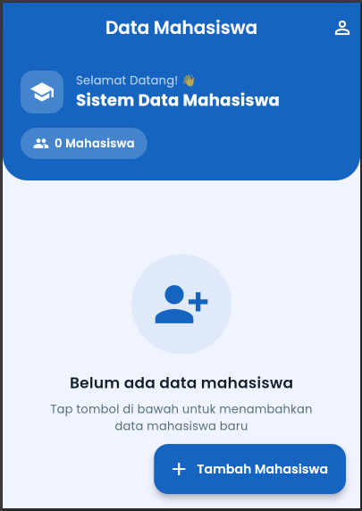
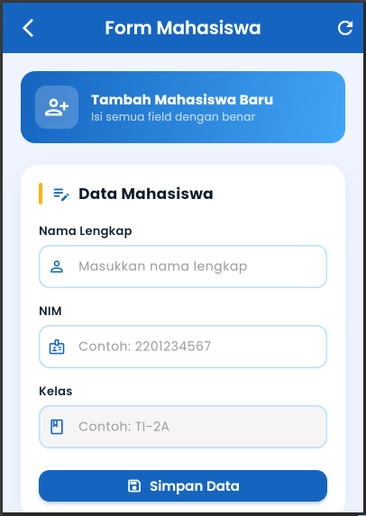
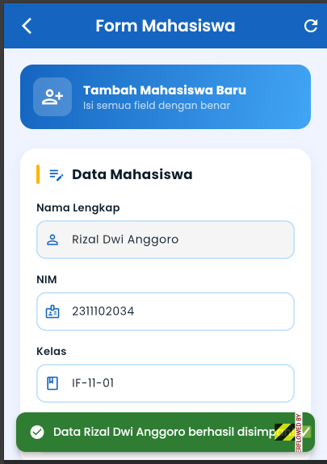
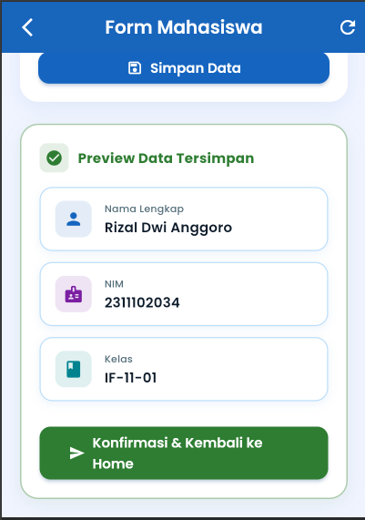
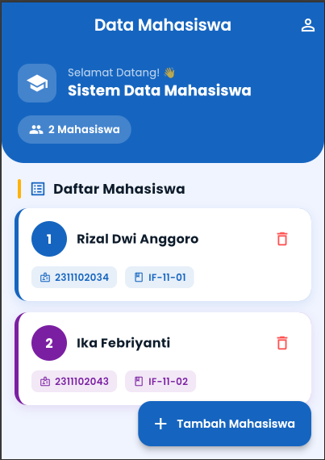
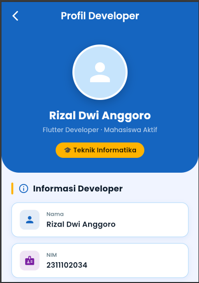
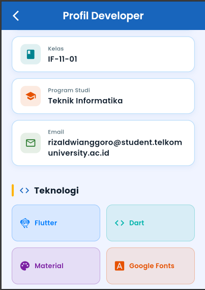
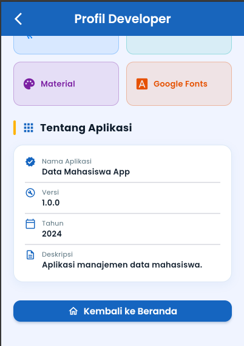

<div align="center">
  <br />
  <h1>LAPORAN PRAKTIKUM <br>APLIKASI BERBASIS PLATFORM</h1>
  <br />
  <h3>MODUL 07 - Flutter <br> Data Mahasiswa  </h3>
  <br />
   
  <br />
  <br />
  <br />
  <h3>Disusun Oleh :</h3>
  <p>
    <strong>Rizal Dwi Anggoro</strong><br>
    <strong>2311102034</strong><br>
    <strong>IF-11-REG01</strong>
  </p>
  <br />
  <h3>Dosen Pengampu :</h3>
  <p>
    <strong>Dimas Fanny Hebrasianto Permadi, S.ST., M.Kom</strong>
  </p>
  <br />
  <br />
    <h4>Asisten Praktikum :</h4>
    <strong> Apri Pandu Wicaksono </strong> <br>
    <strong>Rangga Pradarrell Fathi</strong>
  <br />
  <h3>LABORATORIUM HIGH PERFORMANCE
 <br>FAKULTAS INFORMATIKA <br>UNIVERSITAS TELKOM PURWOKERTO <br>2026</h3>
</div>

---
## 1. Code dan Penjelasan
### Struktur Folder 
```
data_mahasiswa/
├── pubspec.yaml                    # Konfigurasi project & dependencies
│
└── lib/
    ├── main.dart                   # Entry point aplikasi
    │
    ├── theme/
    │   └── app_theme.dart          # Konfigurasi tema & palet warna
    │
    ├── models/
    │   └── mahasiswa_model.dart    # Model data Mahasiswa
    │
    ├── widgets/
    │   └── custom_widgets.dart     # Widget reusable:
    │                               #   • CustomTextField
    │                               #   • InfoCard
    │                               #   • SectionHeader
    │
    └── pages/
        ├── home_page.dart          # Halaman 1: Home (daftar mahasiswa)
        ├── form_mahasiswa_page.dart # Halaman 2: Form input mahasiswa
        └── profil_developer_page.dart # Halaman 3: Profil developer
```

### 1.1 Code main.dart 
```dart
// lib/main.dart
// Entry point aplikasi Data Mahasiswa

import 'package:flutter/material.dart';
import 'theme/app_theme.dart';
import 'pages/home_page.dart';

void main() {
  runApp(const DataMahasiswaApp());
}

/// Root widget — StatelessWidget
class DataMahasiswaApp extends StatelessWidget {
  const DataMahasiswaApp({super.key});

  @override
  Widget build(BuildContext context) {
    return MaterialApp(
      title: 'Data Mahasiswa',
      debugShowCheckedModeBanner: false,
      theme: AppTheme.lightTheme,
      home: const HomePage(),
    );
  }
}
```
Penjelasan :
 
Kode tersebut merupakan file `main.dart` yang berfungsi sebagai titik awal aplikasi Flutter “Data Mahasiswa”. Pada bagian awal terdapat beberapa `import` untuk mengambil library Material Design Flutter, file tema aplikasi (`app_theme.dart`), dan halaman utama (`home_page.dart`). Fungsi `main()` digunakan untuk menjalankan aplikasi melalui `runApp()` dengan widget utama `DataMahasiswaApp`.

Class `DataMahasiswaApp` merupakan turunan dari `StatelessWidget`, yang berarti widget bersifat statis. Di dalam method `build()`, terdapat `MaterialApp` sebagai kerangka utama aplikasi. Properti `title` digunakan untuk memberi nama aplikasi, `debugShowCheckedModeBanner: false` untuk menghilangkan banner debug, `theme` untuk menerapkan tema dari `AppTheme.lightTheme`, dan `home` untuk menentukan halaman pertama yang tampil yaitu `HomePage()`. Secara keseluruhan, kode ini berfungsi untuk menjalankan aplikasi, mengatur tema, dan menampilkan halaman utama.

### 1.2 Code theme/app_theme.dart

```dart
// lib/theme/app_theme.dart

import 'package:flutter/material.dart';
import 'package:google_fonts/google_fonts.dart';

class AppTheme {
  // 🎨 Palet warna utama
  static const Color primaryColor     = Color(0xFF1565C0); // Biru tua
  static const Color secondaryColor   = Color(0xFF42A5F5); // Biru muda
  static const Color accentColor      = Color(0xFFFFB300); // Amber/Kuning
  static const Color backgroundColor  = Color(0xFFF0F4FF); // Biru sangat muda
  static const Color cardColor        = Color(0xFFFFFFFF);
  static const Color textPrimary      = Color(0xFF0D1B2A);
  static const Color textSecondary    = Color(0xFF546E7A);
  static const Color successColor     = Color(0xFF2E7D32);

  static ThemeData get lightTheme {
    return ThemeData(
      useMaterial3: true,
      colorScheme: ColorScheme.fromSeed(
        seedColor: primaryColor,
        primary: primaryColor,
        secondary: secondaryColor,
        surface: backgroundColor,
      ),
      scaffoldBackgroundColor: backgroundColor,
      textTheme: GoogleFonts.poppinsTextTheme().copyWith(
        headlineLarge: GoogleFonts.poppins(
          fontSize: 28,
          fontWeight: FontWeight.w700,
          color: textPrimary,
        ),
        headlineMedium: GoogleFonts.poppins(
          fontSize: 22,
          fontWeight: FontWeight.w600,
          color: textPrimary,
        ),
        titleLarge: GoogleFonts.poppins(
          fontSize: 18,
          fontWeight: FontWeight.w600,
          color: textPrimary,
        ),
        bodyLarge: GoogleFonts.poppins(
          fontSize: 16,
          color: textPrimary,
        ),
        bodyMedium: GoogleFonts.poppins(
          fontSize: 14,
          color: textSecondary,
        ),
      ),
      appBarTheme: AppBarTheme(
        backgroundColor: primaryColor,
        foregroundColor: Colors.white,
        elevation: 0,
        centerTitle: true,
        titleTextStyle: GoogleFonts.poppins(
          fontSize: 20,
          fontWeight: FontWeight.w600,
          color: Colors.white,
        ),
        iconTheme: const IconThemeData(color: Colors.white),
      ),
      elevatedButtonTheme: ElevatedButtonThemeData(
        style: ElevatedButton.styleFrom(
          backgroundColor: primaryColor,
          foregroundColor: Colors.white,
          elevation: 3,
          shadowColor: primaryColor.withOpacity(0.4),
          padding: const EdgeInsets.symmetric(horizontal: 32, vertical: 14),
          shape: RoundedRectangleBorder(
            borderRadius: BorderRadius.circular(12),
          ),
          textStyle: GoogleFonts.poppins(
            fontSize: 15,
            fontWeight: FontWeight.w600,
          ),
        ),
      ),
      inputDecorationTheme: InputDecorationTheme(
        filled: true,
        fillColor: Colors.white,
        contentPadding:
            const EdgeInsets.symmetric(horizontal: 16, vertical: 14),
        border: OutlineInputBorder(
          borderRadius: BorderRadius.circular(12),
          borderSide: const BorderSide(color: Color(0xFFBBDEFB)),
        ),
        enabledBorder: OutlineInputBorder(
          borderRadius: BorderRadius.circular(12),
          borderSide: const BorderSide(color: Color(0xFFBBDEFB), width: 1.5),
        ),
        focusedBorder: OutlineInputBorder(
          borderRadius: BorderRadius.circular(12),
          borderSide: const BorderSide(color: primaryColor, width: 2),
        ),
        errorBorder: OutlineInputBorder(
          borderRadius: BorderRadius.circular(12),
          borderSide: const BorderSide(color: Colors.red, width: 1.5),
        ),
        labelStyle: GoogleFonts.poppins(color: textSecondary),
        hintStyle: GoogleFonts.poppins(color: Colors.grey),
      ),
      cardTheme: CardThemeData(
        color: cardColor,
        elevation: 4,
        shadowColor: primaryColor.withOpacity(0.15),
        shape: RoundedRectangleBorder(
          borderRadius: BorderRadius.circular(16),
        ),
      ),
      bottomNavigationBarTheme: BottomNavigationBarThemeData(
        backgroundColor: Colors.white,
        selectedItemColor: primaryColor,
        unselectedItemColor: Colors.grey,
        elevation: 12,
        type: BottomNavigationBarType.fixed,
      ),
      snackBarTheme: SnackBarThemeData(
        behavior: SnackBarBehavior.floating,
        backgroundColor: successColor,
        contentTextStyle: GoogleFonts.poppins(
          color: Colors.white,
          fontWeight: FontWeight.w500,
        ),
        shape: RoundedRectangleBorder(
          borderRadius: BorderRadius.circular(12),
        ),
      ),
    );
  }
}
```
Penjelasan :

Kode `app_theme.dart` berfungsi untuk mengatur tema dan tampilan visual aplikasi Flutter secara terpusat melalui class `AppTheme`. Pada bagian awal terdapat `import` untuk menggunakan library `material.dart` serta package `google_fonts.dart` agar aplikasi dapat menggunakan font `Poppins`. Di dalam class `AppTheme`, terdapat beberapa konstanta warna seperti `primaryColor`, `secondaryColor`, `accentColor`, `backgroundColor`, `cardColor`, `textPrimary`, `textSecondary`, dan `successColor` yang digunakan sebagai palet warna utama aplikasi.

Method `lightTheme` mengembalikan objek `ThemeData` yang berisi konfigurasi tema aplikasi. Properti `useMaterial3: true` digunakan untuk mengaktifkan desain `Material 3`, sedangkan `colorScheme` mengatur kombinasi warna utama aplikasi berdasarkan `primaryColor`. Properti `scaffoldBackgroundColor` digunakan untuk menentukan warna latar belakang aplikasi.

Pada bagian `textTheme`, aplikasi menggunakan font `Poppins` dengan berbagai ukuran, ketebalan, dan warna untuk judul maupun isi teks. `appBarTheme` digunakan untuk mengatur tampilan `AppBar` seperti warna latar, warna teks, ikon, dan posisi judul. `elevatedButtonTheme` mengatur desain tombol seperti warna, bayangan, padding, bentuk sudut, dan style teks tombol.

Selain itu, `inputDecorationTheme` digunakan untuk mengatur tampilan form input seperti warna latar, border, radius sudut, serta style label dan hint text. `cardTheme` mengatur desain card dengan warna, bayangan, dan sudut melengkung. `bottomNavigationBarTheme` digunakan untuk mengatur tampilan navigasi bawah aplikasi, sedangkan `snackBarTheme` digunakan untuk mengatur tampilan `SnackBar` seperti warna, bentuk, dan style teks notifikasi. Secara keseluruhan, kode ini berfungsi untuk membuat tampilan aplikasi menjadi konsisten, modern, dan lebih menarik.

### 1.3 Code models/mahasiswa_model.dart
```dart
// lib/models/mahasiswa_model.dart

class Mahasiswa {
  final String nama;
  final String nim;
  final String kelas;

  Mahasiswa({
    required this.nama,
    required this.nim,
    required this.kelas,
  });

  // Factory constructor untuk membuat objek dari Map
  factory Mahasiswa.fromMap(Map<String, String> map) {
    return Mahasiswa(
      nama: map['nama'] ?? '',
      nim: map['nim'] ?? '',
      kelas: map['kelas'] ?? '',
    );
  }

  // Konversi ke Map
  Map<String, String> toMap() {
    return {
      'nama': nama,
      'nim': nim,
      'kelas': kelas,
    };
  }

  @override
  String toString() {
    return 'Mahasiswa(nama: $nama, nim: $nim, kelas: $kelas)';
  }
}
```
Penjelasan : 

Kode `mahasiswa_model.dart` berfungsi untuk membuat model data mahasiswa melalui class `Mahasiswa`. Class ini memiliki tiga atribut yaitu `nama`, `nim`, dan `kelas` yang bertipe `String` dan bersifat `final`, sehingga nilainya tidak dapat diubah setelah objek dibuat.

Constructor `Mahasiswa()` digunakan untuk mengisi data mahasiswa dengan parameter `required`, sehingga semua data wajib diisi. Factory constructor `Mahasiswa.fromMap()` digunakan untuk membuat objek `Mahasiswa` dari data bertipe `Map`, sedangkan method `toMap()` digunakan untuk mengubah objek menjadi `Map<String, String>`. Method `toString()` berfungsi menampilkan data objek dalam bentuk teks agar lebih mudah dibaca saat proses debugging atau output program.

### 1.4 Code widgets/custom_widgets.dart
```dart
// lib/widgets/custom_text_field.dart

import 'package:flutter/material.dart';
import 'package:google_fonts/google_fonts.dart';
import '../theme/app_theme.dart';

/// Widget TextField yang dapat digunakan ulang (StatelessWidget)
class CustomTextField extends StatelessWidget {
  final TextEditingController controller;
  final String label;
  final String hint;
  final IconData icon;
  final TextInputType keyboardType;
  final String? Function(String?)? validator;

  const CustomTextField({
    super.key,
    required this.controller,
    required this.label,
    required this.hint,
    required this.icon,
    this.keyboardType = TextInputType.text,
    this.validator,
  });

  @override
  Widget build(BuildContext context) {
    return Column(
      crossAxisAlignment: CrossAxisAlignment.start,
      children: [
        Text(
          label,
          style: GoogleFonts.poppins(
            fontSize: 13,
            fontWeight: FontWeight.w600,
            color: AppTheme.textPrimary,
          ),
        ),
        const SizedBox(height: 6),
        TextFormField(
          controller: controller,
          keyboardType: keyboardType,
          validator: validator,
          style: GoogleFonts.poppins(fontSize: 14),
          decoration: InputDecoration(
            hintText: hint,
            prefixIcon: Icon(icon, color: AppTheme.primaryColor, size: 20),
          ),
        ),
      ],
    );
  }
}

// ──────────────────────────────────────────────────────────────
// lib/widgets/info_card.dart
// ──────────────────────────────────────────────────────────────

/// Card untuk menampilkan satu baris info (label + value)
class InfoCard extends StatelessWidget {
  final IconData icon;
  final String label;
  final String value;
  final Color? iconColor;

  const InfoCard({
    super.key,
    required this.icon,
    required this.label,
    required this.value,
    this.iconColor,
  });

  @override
  Widget build(BuildContext context) {
    return Container(
      margin: const EdgeInsets.only(bottom: 12),
      padding: const EdgeInsets.symmetric(horizontal: 16, vertical: 14),
      decoration: BoxDecoration(
        color: Colors.white,
        borderRadius: BorderRadius.circular(14),
        border: Border.all(color: const Color(0xFFBBDEFB), width: 1.2),
        boxShadow: [
          BoxShadow(
            color: AppTheme.primaryColor.withOpacity(0.07),
            blurRadius: 8,
            offset: const Offset(0, 3),
          ),
        ],
      ),
      child: Row(
        children: [
          Container(
            padding: const EdgeInsets.all(9),
            decoration: BoxDecoration(
              color: (iconColor ?? AppTheme.primaryColor).withOpacity(0.12),
              borderRadius: BorderRadius.circular(10),
            ),
            child: Icon(icon,
                color: iconColor ?? AppTheme.primaryColor, size: 22),
          ),
          const SizedBox(width: 14),
          Expanded(
            child: Column(
              crossAxisAlignment: CrossAxisAlignment.start,
              children: [
                Text(
                  label,
                  style: GoogleFonts.poppins(
                    fontSize: 11,
                    fontWeight: FontWeight.w500,
                    color: AppTheme.textSecondary,
                  ),
                ),
                const SizedBox(height: 2),
                Text(
                  value,
                  style: GoogleFonts.poppins(
                    fontSize: 15,
                    fontWeight: FontWeight.w600,
                    color: AppTheme.textPrimary,
                  ),
                ),
              ],
            ),
          ),
        ],
      ),
    );
  }
}

// ──────────────────────────────────────────────────────────────
// lib/widgets/section_header.dart
// ──────────────────────────────────────────────────────────────

/// Header section dengan garis aksen
class SectionHeader extends StatelessWidget {
  final String title;
  final IconData icon;

  const SectionHeader({
    super.key,
    required this.title,
    required this.icon,
  });

  @override
  Widget build(BuildContext context) {
    return Row(
      children: [
        Container(
          width: 4,
          height: 24,
          decoration: BoxDecoration(
            color: AppTheme.accentColor,
            borderRadius: BorderRadius.circular(4),
          ),
        ),
        const SizedBox(width: 10),
        Icon(icon, color: AppTheme.primaryColor, size: 22),
        const SizedBox(width: 8),
        Text(
          title,
          style: GoogleFonts.poppins(
            fontSize: 17,
            fontWeight: FontWeight.w700,
            color: AppTheme.textPrimary,
          ),
        ),
      ],
    );
  }
}
```
Penjelasan :

Kode pada folder `widgets` berisi beberapa widget yang dapat digunakan ulang agar tampilan aplikasi lebih rapi dan konsisten. Widget `CustomTextField` merupakan turunan `StatelessWidget` yang digunakan untuk membuat input form dengan label, hint, ikon, tipe keyboard, dan validasi. Widget ini memakai `TextFormField` dengan desain yang sudah disesuaikan menggunakan `GoogleFonts.poppins` dan warna dari `AppTheme`.

Widget `InfoCard` digunakan untuk menampilkan informasi dalam bentuk card yang berisi ikon, label, dan value. Tampilan card dibuat dengan `Container`, `BoxDecoration`, border, serta bayangan agar terlihat modern dan menarik. Widget ini cocok digunakan untuk menampilkan data mahasiswa atau informasi lainnya.

Widget `SectionHeader` digunakan sebagai header atau judul section pada halaman aplikasi. Widget ini menampilkan garis aksen berwarna, ikon, dan teks judul dengan style font `Poppins`. Secara keseluruhan, kode ini berfungsi untuk membuat komponen UI yang reusable sehingga tampilan aplikasi lebih konsisten dan mudah dikelola.

### 1.5 Code pages/home_page.dart
```dart
// lib/pages/home_page.dart

import 'package:flutter/material.dart';
import 'package:google_fonts/google_fonts.dart';
import '../models/mahasiswa_model.dart';
import '../theme/app_theme.dart';
import '../widgets/custom_widgets.dart';
import 'form_mahasiswa_page.dart';
import 'profil_developer_page.dart';

/// Halaman utama — menggunakan StatefulWidget
/// karena menyimpan daftar mahasiswa yang bisa berubah
class HomePage extends StatefulWidget {
  const HomePage({super.key});

  @override
  State<HomePage> createState() => _HomePageState();
}

class _HomePageState extends State<HomePage> {
  // Daftar data mahasiswa yang tersimpan
  final List<Mahasiswa> _daftarMahasiswa = [];

  // ── Navigasi ke form dan tunggu hasil (Navigator.push) ───────
  Future<void> _bukaFormMahasiswa() async {
    final Mahasiswa? hasil = await Navigator.push<Mahasiswa>(
      context,
      MaterialPageRoute(builder: (_) => const FormMahasiswaPage()),
    );

    // Jika ada data yang dikembalikan dari form, tambahkan ke list
    if (hasil != null) {
      setState(() {
        _daftarMahasiswa.add(hasil);
      });
    }
  }

  // ── Navigasi ke halaman profil developer ────────────────────
  void _bukaProfilDeveloper() {
    Navigator.push(
      context,
      MaterialPageRoute(builder: (_) => const ProfilDeveloperPage()),
    );
  }

  // ── Hapus data mahasiswa ────────────────────────────────────
  void _hapusMahasiswa(int index) {
    setState(() {
      _daftarMahasiswa.removeAt(index);
    });
    ScaffoldMessenger.of(context).showSnackBar(
      const SnackBar(
        content: Text('Data mahasiswa dihapus'),
        backgroundColor: Colors.redAccent,
      ),
    );
  }

  @override
  Widget build(BuildContext context) {
    return Scaffold(
      // ── AppBar ───────────────────────────────────────────────
      appBar: AppBar(
        title: const Text('Data Mahasiswa'),
        actions: [
          IconButton(
            icon: const Icon(Icons.person_outline),
            tooltip: 'Profil Developer',
            onPressed: _bukaProfilDeveloper,
          ),
        ],
      ),

      // ── Body ─────────────────────────────────────────────────
      body: Column(
        children: [
          // Banner Header
          _buildBannerHeader(),

          // Daftar Mahasiswa
          Expanded(
            child: _daftarMahasiswa.isEmpty
                ? _buildEmptyState()
                : _buildListMahasiswa(),
          ),
        ],
      ),

      // ── FAB Tambah Mahasiswa ──────────────────────────────────
      floatingActionButton: FloatingActionButton.extended(
        onPressed: _bukaFormMahasiswa,
        backgroundColor: AppTheme.primaryColor,
        foregroundColor: Colors.white,
        icon: const Icon(Icons.add),
        label: Text(
          'Tambah Mahasiswa',
          style: GoogleFonts.poppins(fontWeight: FontWeight.w600),
        ),
      ),
    );
  }

  // ── Widget: Banner Header ──────────────────────────────────
  Widget _buildBannerHeader() {
    return Container(
      width: double.infinity,
      padding: const EdgeInsets.fromLTRB(20, 20, 20, 24),
      decoration: const BoxDecoration(
        color: AppTheme.primaryColor,
        borderRadius: BorderRadius.only(
          bottomLeft: Radius.circular(28),
          bottomRight: Radius.circular(28),
        ),
      ),
      child: Column(
        crossAxisAlignment: CrossAxisAlignment.start,
        children: [
          Row(
            children: [
              Container(
                padding: const EdgeInsets.all(10),
                decoration: BoxDecoration(
                  color: Colors.white.withOpacity(0.2),
                  borderRadius: BorderRadius.circular(14),
                ),
                child: const Icon(Icons.school, color: Colors.white, size: 28),
              ),
              const SizedBox(width: 14),
              Expanded(
                child: Column(
                  crossAxisAlignment: CrossAxisAlignment.start,
                  children: [
                    Text(
                      'Selamat Datang! 👋',
                      style: GoogleFonts.poppins(
                        fontSize: 13,
                        color: Colors.white70,
                      ),
                    ),
                    Text(
                      'Sistem Data Mahasiswa',
                      style: GoogleFonts.poppins(
                        fontSize: 18,
                        fontWeight: FontWeight.w700,
                        color: Colors.white,
                      ),
                    ),
                  ],
                ),
              ),
            ],
          ),
          const SizedBox(height: 16),
          // Statistik
          Row(
            children: [
              _buildStatChip(
                Icons.people,
                '${_daftarMahasiswa.length}',
                'Mahasiswa',
              ),
            ],
          ),
        ],
      ),
    );
  }

  Widget _buildStatChip(IconData icon, String value, String label) {
    return Container(
      padding: const EdgeInsets.symmetric(horizontal: 14, vertical: 8),
      decoration: BoxDecoration(
        color: Colors.white.withOpacity(0.2),
        borderRadius: BorderRadius.circular(20),
      ),
      child: Row(
        mainAxisSize: MainAxisSize.min,
        children: [
          Icon(icon, color: Colors.white, size: 18),
          const SizedBox(width: 6),
          Text(
            '$value $label',
            style: GoogleFonts.poppins(
              color: Colors.white,
              fontWeight: FontWeight.w600,
              fontSize: 13,
            ),
          ),
        ],
      ),
    );
  }

  // ── Widget: Empty State ─────────────────────────────────────
  Widget _buildEmptyState() {
    return Center(
      child: Column(
        mainAxisAlignment: MainAxisAlignment.center,
        children: [
          Container(
            padding: const EdgeInsets.all(24),
            decoration: BoxDecoration(
              color: AppTheme.primaryColor.withOpacity(0.08),
              shape: BoxShape.circle,
            ),
            child: const Icon(
              Icons.person_add_alt_1,
              size: 64,
              color: AppTheme.primaryColor,
            ),
          ),
          const SizedBox(height: 20),
          Text(
            'Belum ada data mahasiswa',
            style: GoogleFonts.poppins(
              fontSize: 17,
              fontWeight: FontWeight.w600,
              color: AppTheme.textPrimary,
            ),
          ),
          const SizedBox(height: 8),
          Text(
            'Tap tombol di bawah untuk menambahkan\ndata mahasiswa baru',
            textAlign: TextAlign.center,
            style: GoogleFonts.poppins(
              fontSize: 13,
              color: AppTheme.textSecondary,
            ),
          ),
        ],
      ),
    );
  }

  // ── Widget: List Mahasiswa ──────────────────────────────────
  Widget _buildListMahasiswa() {
    return Column(
      crossAxisAlignment: CrossAxisAlignment.start,
      children: [
        Padding(
          padding: const EdgeInsets.fromLTRB(20, 20, 20, 12),
          child: SectionHeader(
            title: 'Daftar Mahasiswa',
            icon: Icons.list_alt,
          ),
        ),
        Expanded(
          child: ListView.builder(
            padding: const EdgeInsets.fromLTRB(16, 0, 16, 100),
            itemCount: _daftarMahasiswa.length,
            itemBuilder: (context, index) {
              final mhs = _daftarMahasiswa[index];
              return _MahasiswaCard(
                mahasiswa: mhs,
                nomor: index + 1,
                onHapus: () => _hapusMahasiswa(index),
              );
            },
          ),
        ),
      ],
    );
  }
}

// ──────────────────────────────────────────────────────────────
/// Card Mahasiswa (StatelessWidget)
// ──────────────────────────────────────────────────────────────
class _MahasiswaCard extends StatelessWidget {
  final Mahasiswa mahasiswa;
  final int nomor;
  final VoidCallback onHapus;

  const _MahasiswaCard({
    required this.mahasiswa,
    required this.nomor,
    required this.onHapus,
  });

  @override
  Widget build(BuildContext context) {
    final colors = [
      AppTheme.primaryColor,
      const Color(0xFF7B1FA2),
      const Color(0xFF00838F),
      const Color(0xFFE65100),
      const Color(0xFF2E7D32),
    ];
    final cardAccent = colors[(nomor - 1) % colors.length];

    return Container(
      margin: const EdgeInsets.only(bottom: 14),
      decoration: BoxDecoration(
        color: Colors.white,
        borderRadius: BorderRadius.circular(16),
        border: Border(
          left: BorderSide(color: cardAccent, width: 5),
        ),
        boxShadow: [
          BoxShadow(
            color: cardAccent.withOpacity(0.12),
            blurRadius: 10,
            offset: const Offset(0, 4),
          ),
        ],
      ),
      child: Padding(
        padding: const EdgeInsets.all(16),
        child: Column(
          crossAxisAlignment: CrossAxisAlignment.start,
          children: [
            // Header card
            Row(
              children: [
                CircleAvatar(
                  backgroundColor: cardAccent,
                  radius: 22,
                  child: Text(
                    '$nomor',
                    style: GoogleFonts.poppins(
                      color: Colors.white,
                      fontWeight: FontWeight.w700,
                      fontSize: 16,
                    ),
                  ),
                ),
                const SizedBox(width: 12),
                Expanded(
                  child: Text(
                    mahasiswa.nama,
                    style: GoogleFonts.poppins(
                      fontSize: 16,
                      fontWeight: FontWeight.w700,
                      color: AppTheme.textPrimary,
                    ),
                  ),
                ),
                IconButton(
                  icon: const Icon(Icons.delete_outline,
                      color: Colors.redAccent, size: 22),
                  onPressed: onHapus,
                  tooltip: 'Hapus',
                ),
              ],
            ),
            const SizedBox(height: 12),
            // Info detail
            Row(
              children: [
                _DetailChip(
                  icon: Icons.badge_outlined,
                  label: mahasiswa.nim,
                  color: cardAccent,
                ),
                const SizedBox(width: 10),
                _DetailChip(
                  icon: Icons.class_outlined,
                  label: mahasiswa.kelas,
                  color: cardAccent,
                ),
              ],
            ),
          ],
        ),
      ),
    );
  }
}

class _DetailChip extends StatelessWidget {
  final IconData icon;
  final String label;
  final Color color;

  const _DetailChip({
    required this.icon,
    required this.label,
    required this.color,
  });

  @override
  Widget build(BuildContext context) {
    return Container(
      padding: const EdgeInsets.symmetric(horizontal: 10, vertical: 5),
      decoration: BoxDecoration(
        color: color.withOpacity(0.1),
        borderRadius: BorderRadius.circular(8),
      ),
      child: Row(
        mainAxisSize: MainAxisSize.min,
        children: [
          Icon(icon, size: 14, color: color),
          const SizedBox(width: 5),
          Text(
            label,
            style: GoogleFonts.poppins(
              fontSize: 12,
              fontWeight: FontWeight.w600,
              color: color,
            ),
          ),
        ],
      ),
    );
  }
}
```
Penjelasn :

Kode `home_page.dart` berfungsi sebagai halaman utama aplikasi data mahasiswa dan menggunakan `StatefulWidget` karena data mahasiswa dapat berubah. Class `_HomePageState` menyimpan daftar mahasiswa dalam variabel `_daftarMahasiswa`. Method `_bukaFormMahasiswa()` digunakan untuk membuka halaman form mahasiswa menggunakan `Navigator.push`, lalu data yang dikembalikan akan ditambahkan ke list menggunakan `setState()`. Method `_bukaProfilDeveloper()` digunakan untuk berpindah ke halaman profil developer, sedangkan `_hapusMahasiswa()` digunakan untuk menghapus data mahasiswa dan menampilkan `SnackBar` sebagai notifikasi.

Pada method `build()`, terdapat `Scaffold` yang berisi `AppBar`, `Body`, dan `FloatingActionButton`. Bagian body menampilkan banner header, kondisi kosong (`_buildEmptyState`) jika belum ada data, atau daftar mahasiswa (`_buildListMahasiswa`) jika data tersedia. Tombol `FloatingActionButton` digunakan untuk menambahkan data mahasiswa baru.

Selain itu, terdapat widget `_MahasiswaCard` yang digunakan untuk menampilkan data mahasiswa dalam bentuk card berisi nama, NIM, kelas, dan tombol hapus. Widget `_DetailChip` digunakan untuk menampilkan detail kecil seperti NIM dan kelas dengan tampilan yang lebih menarik. Secara keseluruhan, kode ini berfungsi untuk menampilkan, menambah, dan menghapus data mahasiswa dengan tampilan UI yang modern dan rapi. 

### 1.6 Code form_mahasiswa_page.dart
```dart
// lib/pages/form_mahasiswa_page.dart

import 'package:flutter/material.dart';
import 'package:google_fonts/google_fonts.dart';
import '../models/mahasiswa_model.dart';
import '../theme/app_theme.dart';
import '../widgets/custom_widgets.dart';

/// Halaman Form Mahasiswa — StatefulWidget
/// Mengelola input teks dan validasi form
class FormMahasiswaPage extends StatefulWidget {
  const FormMahasiswaPage({super.key});

  @override
  State<FormMahasiswaPage> createState() => _FormMahasiswaPageState();
}

class _FormMahasiswaPageState extends State<FormMahasiswaPage> {
  // GlobalKey untuk akses Form & validasi
  final _formKey = GlobalKey<FormState>();

  // Controller untuk setiap field input
  final _namaController    = TextEditingController();
  final _nimController     = TextEditingController();
  final _kelasController   = TextEditingController();

  // Data yang telah disimpan (ditampilkan setelah tombol ditekan)
  Mahasiswa? _dataTersimpan;

  @override
  void dispose() {
    // Selalu dispose controller agar tidak memory leak
    _namaController.dispose();
    _nimController.dispose();
    _kelasController.dispose();
    super.dispose();
  }

  // ── Simpan & tampilkan data ──────────────────────────────────
  void _simpanData() {
    if (_formKey.currentState!.validate()) {
      final mahasiswaBaru = Mahasiswa(
        nama:  _namaController.text.trim(),
        nim:   _nimController.text.trim(),
        kelas: _kelasController.text.trim(),
      );

      setState(() {
        _dataTersimpan = mahasiswaBaru;
      });

      // Tampilkan SnackBar notifikasi berhasil
      ScaffoldMessenger.of(context).showSnackBar(
        SnackBar(
          content: Row(
            children: [
              const Icon(Icons.check_circle, color: Colors.white, size: 20),
              const SizedBox(width: 10),
              Text(
                'Data ${mahasiswaBaru.nama} berhasil disimpan! ✅',
                style: GoogleFonts.poppins(fontWeight: FontWeight.w500),
              ),
            ],
          ),
          backgroundColor: AppTheme.successColor,
          duration: const Duration(seconds: 3),
        ),
      );
    }
  }

  // ── Kirim data kembali ke HomePage via Navigator.pop ────────
  void _konfirmasiDanKembali() {
    if (_dataTersimpan != null) {
      Navigator.pop(context, _dataTersimpan);
    } else {
      ScaffoldMessenger.of(context).showSnackBar(
        SnackBar(
          content: Text(
            'Simpan data terlebih dahulu!',
            style: GoogleFonts.poppins(),
          ),
          backgroundColor: Colors.orange,
        ),
      );
    }
  }

  // ── Reset form ───────────────────────────────────────────────
  void _resetForm() {
    _formKey.currentState!.reset();
    _namaController.clear();
    _nimController.clear();
    _kelasController.clear();
    setState(() {
      _dataTersimpan = null;
    });
  }

  @override
  Widget build(BuildContext context) {
    return Scaffold(
      // ── AppBar ───────────────────────────────────────────────
      appBar: AppBar(
        title: const Text('Form Mahasiswa'),
        leading: IconButton(
          icon: const Icon(Icons.arrow_back_ios_new),
          onPressed: () => Navigator.pop(context), // Navigator.pop
          tooltip: 'Kembali',
        ),
        actions: [
          IconButton(
            icon: const Icon(Icons.refresh),
            tooltip: 'Reset Form',
            onPressed: _resetForm,
          ),
        ],
      ),

      // ── Body dengan SingleChildScrollView ────────────────────
      body: SingleChildScrollView(
        padding: const EdgeInsets.all(20),
        child: Column(
          crossAxisAlignment: CrossAxisAlignment.start,
          children: [
            // ── Header Section ───────────────────────────────
            _buildFormHeader(),
            const SizedBox(height: 24),

            // ── Form Input ───────────────────────────────────
            Form(
              key: _formKey,
              child: Container(
                padding: const EdgeInsets.all(20),
                decoration: BoxDecoration(
                  color: Colors.white,
                  borderRadius: BorderRadius.circular(20),
                  boxShadow: [
                    BoxShadow(
                      color: AppTheme.primaryColor.withOpacity(0.08),
                      blurRadius: 16,
                      offset: const Offset(0, 6),
                    ),
                  ],
                ),
                child: Column(
                  crossAxisAlignment: CrossAxisAlignment.start,
                  children: [
                    SectionHeader(
                      title: 'Data Mahasiswa',
                      icon: Icons.edit_note,
                    ),
                    const SizedBox(height: 20),

                    // Field Nama
                    CustomTextField(
                      controller: _namaController,
                      label: 'Nama Lengkap',
                      hint: 'Masukkan nama lengkap',
                      icon: Icons.person_outline,
                      validator: (v) {
                        if (v == null || v.trim().isEmpty) {
                          return 'Nama tidak boleh kosong';
                        }
                        if (v.trim().length < 3) {
                          return 'Nama minimal 3 karakter';
                        }
                        return null;
                      },
                    ),
                    const SizedBox(height: 16),

                    // Field NIM
                    CustomTextField(
                      controller: _nimController,
                      label: 'NIM',
                      hint: 'Contoh: 2201234567',
                      icon: Icons.badge_outlined,
                      keyboardType: TextInputType.number,
                      validator: (v) {
                        if (v == null || v.trim().isEmpty) {
                          return 'NIM tidak boleh kosong';
                        }
                        if (v.trim().length < 8) {
                          return 'NIM minimal 8 digit';
                        }
                        return null;
                      },
                    ),
                    const SizedBox(height: 16),

                    // Field Kelas
                    CustomTextField(
                      controller: _kelasController,
                      label: 'Kelas',
                      hint: 'Contoh: TI-2A',
                      icon: Icons.class_outlined,
                      validator: (v) {
                        if (v == null || v.trim().isEmpty) {
                          return 'Kelas tidak boleh kosong';
                        }
                        return null;
                      },
                    ),
                    const SizedBox(height: 24),

                    // Tombol Simpan
                    SizedBox(
                      width: double.infinity,
                      child: ElevatedButton.icon(
                        onPressed: _simpanData,
                        icon: const Icon(Icons.save_outlined),
                        label: const Text('Simpan Data'),
                      ),
                    ),
                  ],
                ),
              ),
            ),

            const SizedBox(height: 24),

            // ── Preview Data Tersimpan ───────────────────────
            if (_dataTersimpan != null) _buildPreviewData(),
          ],
        ),
      ),
    );
  }

  // ── Widget: Form Header ─────────────────────────────────────
  Widget _buildFormHeader() {
    return Container(
      padding: const EdgeInsets.all(16),
      decoration: BoxDecoration(
        gradient: LinearGradient(
          colors: [
            AppTheme.primaryColor,
            AppTheme.secondaryColor,
          ],
          begin: Alignment.topLeft,
          end: Alignment.bottomRight,
        ),
        borderRadius: BorderRadius.circular(16),
      ),
      child: Row(
        children: [
          Container(
            padding: const EdgeInsets.all(10),
            decoration: BoxDecoration(
              color: Colors.white.withOpacity(0.2),
              borderRadius: BorderRadius.circular(12),
            ),
            child:
                const Icon(Icons.person_add_alt, color: Colors.white, size: 28),
          ),
          const SizedBox(width: 14),
          Expanded(
            child: Column(
              crossAxisAlignment: CrossAxisAlignment.start,
              children: [
                Text(
                  'Tambah Mahasiswa Baru',
                  style: GoogleFonts.poppins(
                    fontSize: 15,
                    fontWeight: FontWeight.w700,
                    color: Colors.white,
                  ),
                ),
                Text(
                  'Isi semua field dengan benar',
                  style: GoogleFonts.poppins(
                    fontSize: 12,
                    color: Colors.white70,
                  ),
                ),
              ],
            ),
          ),
        ],
      ),
    );
  }

  // ── Widget: Preview Data ────────────────────────────────────
  Widget _buildPreviewData() {
    return Container(
      padding: const EdgeInsets.all(20),
      decoration: BoxDecoration(
        color: Colors.white,
        borderRadius: BorderRadius.circular(20),
        border: Border.all(
          color: AppTheme.successColor.withOpacity(0.4),
          width: 1.5,
        ),
        boxShadow: [
          BoxShadow(
            color: AppTheme.successColor.withOpacity(0.08),
            blurRadius: 16,
            offset: const Offset(0, 6),
          ),
        ],
      ),
      child: Column(
        crossAxisAlignment: CrossAxisAlignment.start,
        children: [
          // Header preview
          Row(
            children: [
              Container(
                padding: const EdgeInsets.all(6),
                decoration: BoxDecoration(
                  color: AppTheme.successColor.withOpacity(0.12),
                  borderRadius: BorderRadius.circular(8),
                ),
                child: Icon(Icons.check_circle,
                    color: AppTheme.successColor, size: 20),
              ),
              const SizedBox(width: 10),
              Text(
                'Preview Data Tersimpan',
                style: GoogleFonts.poppins(
                  fontSize: 15,
                  fontWeight: FontWeight.w700,
                  color: AppTheme.successColor,
                ),
              ),
            ],
          ),
          const SizedBox(height: 16),

          // Info cards
          InfoCard(
            icon: Icons.person,
            label: 'Nama Lengkap',
            value: _dataTersimpan!.nama,
            iconColor: AppTheme.primaryColor,
          ),
          InfoCard(
            icon: Icons.badge,
            label: 'NIM',
            value: _dataTersimpan!.nim,
            iconColor: const Color(0xFF7B1FA2),
          ),
          InfoCard(
            icon: Icons.class_,
            label: 'Kelas',
            value: _dataTersimpan!.kelas,
            iconColor: const Color(0xFF00838F),
          ),

          const SizedBox(height: 16),

          // Tombol kirim ke home
          SizedBox(
            width: double.infinity,
            child: ElevatedButton.icon(
              onPressed: _konfirmasiDanKembali,
              style: ElevatedButton.styleFrom(
                backgroundColor: AppTheme.successColor,
              ),
              icon: const Icon(Icons.send),
              label: const Text('Konfirmasi & Kembali ke Home'),
            ),
          ),
        ],
      ),
    );
  }
}
```
Penjelasan :

Kode `form_mahasiswa_page.dart` berfungsi sebagai halaman form untuk menambahkan data mahasiswa dan menggunakan `StatefulWidget` karena data input dapat berubah. Class `_FormMahasiswaPageState` memiliki `TextEditingController` untuk mengelola input nama, NIM, dan kelas, serta `GlobalKey<FormState>` untuk validasi form. Method `dispose()` digunakan untuk membersihkan controller agar tidak terjadi memory leak.

Method `_simpanData()` digunakan untuk menyimpan data mahasiswa setelah validasi berhasil, kemudian menampilkan `SnackBar` sebagai notifikasi. Method `_konfirmasiDanKembali()` digunakan untuk mengirim data kembali ke `HomePage` menggunakan `Navigator.pop`, sedangkan `_resetForm()` digunakan untuk mengosongkan seluruh input form.

Pada method `build()`, terdapat `Scaffold` yang berisi `AppBar`, form input, tombol simpan, dan preview data mahasiswa yang sudah disimpan. Widget `CustomTextField`, `SectionHeader`, dan `InfoCard` digunakan kembali agar tampilan lebih rapi dan konsisten. Secara keseluruhan, kode ini berfungsi untuk menginput, memvalidasi, menyimpan, dan menampilkan data mahasiswa dengan tampilan UI yang modern. 

### 1.7 Code pages/profile_developer_page.dart
```dart
// lib/pages/profil_developer_page.dart

import 'package:flutter/material.dart';
import 'package:google_fonts/google_fonts.dart';
import '../theme/app_theme.dart';
import '../widgets/custom_widgets.dart';

/// Halaman Profil Developer — StatelessWidget
/// Tidak ada state yang perlu dikelola
class ProfilDeveloperPage extends StatelessWidget {
  const ProfilDeveloperPage({super.key});

  @override
  Widget build(BuildContext context) {
    return Scaffold(
      // ── AppBar ───────────────────────────────────────────────
      appBar: AppBar(
        title: const Text('Profil Developer'),
        leading: IconButton(
          icon: const Icon(Icons.arrow_back_ios_new),
          onPressed: () => Navigator.pop(context), // Navigator.pop
        ),
      ),

      body: SingleChildScrollView(
        child: Column(
          children: [
            // ── Hero Section ─────────────────────────────────
            _buildHeroSection(),

            // ── Informasi Developer ───────────────────────────
            Padding(
              padding: const EdgeInsets.all(20),
              child: Column(
                crossAxisAlignment: CrossAxisAlignment.start,
                children: [
                  SectionHeader(
                    title: 'Informasi Developer',
                    icon: Icons.info_outline,
                  ),
                  const SizedBox(height: 16),
                  InfoCard(
                    icon: Icons.person,
                    label: 'Nama',
                    value: 'Rizal Dwi Anggoro',
                    iconColor: AppTheme.primaryColor,
                  ),
                  InfoCard(
                    icon: Icons.badge,
                    label: 'NIM',
                    value: '2311102034',
                    iconColor: const Color(0xFF7B1FA2),
                  ),
                  InfoCard(
                    icon: Icons.class_,
                    label: 'Kelas',
                    value: 'IF-11-01',
                    iconColor: const Color(0xFF00838F),
                  ),
                  InfoCard(
                    icon: Icons.school,
                    label: 'Program Studi',
                    value: 'Teknik Informatika',
                    iconColor: const Color(0xFFE65100),
                  ),
                  InfoCard(
                    icon: Icons.email_outlined,
                    label: 'Email',
                    value: 'rizaldwianggoro@student.telkomuniversity.ac.id',
                    iconColor: const Color(0xFF2E7D32),
                  ),

                  const SizedBox(height: 24),

                  // ── Teknologi yang Digunakan ────────────────
                  SectionHeader(
                    title: 'Teknologi',
                    icon: Icons.code,
                  ),
                  const SizedBox(height: 16),
                  _buildTeknologiGrid(),

                  const SizedBox(height: 24),

                  // ── Tentang Aplikasi ─────────────────────────
                  SectionHeader(
                    title: 'Tentang Aplikasi',
                    icon: Icons.apps,
                  ),
                  const SizedBox(height: 16),
                  _buildAboutCard(),

                  const SizedBox(height: 30),

                  // ── Tombol Kembali ───────────────────────────
                  SizedBox(
                    width: double.infinity,
                    child: ElevatedButton.icon(
                      onPressed: () => Navigator.pop(context),
                      icon: const Icon(Icons.home_outlined),
                      label: const Text('Kembali ke Beranda'),
                    ),
                  ),

                  const SizedBox(height: 20),
                ],
              ),
            ),
          ],
        ),
      ),
    );
  }

  // ── Widget: Hero Section ────────────────────────────────────
  Widget _buildHeroSection() {
    return Container(
      width: double.infinity,
      padding: const EdgeInsets.fromLTRB(20, 30, 20, 30),
      decoration: const BoxDecoration(
        color: AppTheme.primaryColor,
        borderRadius: BorderRadius.only(
          bottomLeft: Radius.circular(36),
          bottomRight: Radius.circular(36),
        ),
      ),
      child: Column(
        children: [
          // Avatar
          Container(
            padding: const EdgeInsets.all(4),
            decoration: BoxDecoration(
              color: Colors.white,
              shape: BoxShape.circle,
              boxShadow: [
                BoxShadow(
                  color: Colors.black.withOpacity(0.2),
                  blurRadius: 16,
                  offset: const Offset(0, 6),
                ),
              ],
            ),
            child: CircleAvatar(
              radius: 52,
              backgroundColor: AppTheme.secondaryColor.withOpacity(0.3),
              child: const Icon(
                Icons.person,
                size: 60,
                color: Colors.white,
              ),
            ),
          ),
          const SizedBox(height: 16),
          Text(
            'Rizal Dwi Anggoro',
            style: GoogleFonts.poppins(
              fontSize: 22,
              fontWeight: FontWeight.w700,
              color: Colors.white,
            ),
          ),
          const SizedBox(height: 4),
          Text(
            'Flutter Developer · Mahasiswa Aktif',
            style: GoogleFonts.poppins(
              fontSize: 13,
              color: Colors.white70,
            ),
          ),
          const SizedBox(height: 16),
          // Badge
          Container(
            padding:
                const EdgeInsets.symmetric(horizontal: 16, vertical: 6),
            decoration: BoxDecoration(
              color: AppTheme.accentColor,
              borderRadius: BorderRadius.circular(20),
            ),
            child: Text(
              '🎓 Teknik Informatika',
              style: GoogleFonts.poppins(
                fontSize: 13,
                fontWeight: FontWeight.w600,
                color: Colors.black87,
              ),
            ),
          ),
        ],
      ),
    );
  }

  // ── Widget: Grid Teknologi ──────────────────────────────────
  Widget _buildTeknologiGrid() {
    final tekList = [
      {'icon': Icons.flutter_dash, 'label': 'Flutter', 'color': 0xFF027DFD},
      {'icon': Icons.code,         'label': 'Dart',    'color': 0xFF00B4AB},
      {'icon': Icons.palette,      'label': 'Material', 'color': 0xFF7B1FA2},
      {'icon': Icons.font_download,'label': 'Google Fonts', 'color': 0xFFE65100},
    ];

    return GridView.builder(
      shrinkWrap: true,
      physics: const NeverScrollableScrollPhysics(),
      gridDelegate: const SliverGridDelegateWithFixedCrossAxisCount(
        crossAxisCount: 2,
        crossAxisSpacing: 12,
        mainAxisSpacing: 12,
        childAspectRatio: 2.4,
      ),
      itemCount: tekList.length,
      itemBuilder: (_, i) {
        final item  = tekList[i];
        final color = Color(item['color'] as int);
        return Container(
          padding: const EdgeInsets.symmetric(horizontal: 14, vertical: 10),
          decoration: BoxDecoration(
            color: color.withOpacity(0.1),
            borderRadius: BorderRadius.circular(12),
            border: Border.all(color: color.withOpacity(0.3)),
          ),
          child: Row(
            children: [
              Icon(item['icon'] as IconData, color: color, size: 22),
              const SizedBox(width: 8),
              Text(
                item['label'] as String,
                style: GoogleFonts.poppins(
                  fontSize: 13,
                  fontWeight: FontWeight.w600,
                  color: color,
                ),
              ),
            ],
          ),
        );
      },
    );
  }

  // ── Widget: About Card ──────────────────────────────────────
  Widget _buildAboutCard() {
    return Container(
      padding: const EdgeInsets.all(18),
      decoration: BoxDecoration(
        color: Colors.white,
        borderRadius: BorderRadius.circular(16),
        border: Border.all(
            color: AppTheme.primaryColor.withOpacity(0.15)),
        boxShadow: [
          BoxShadow(
            color: AppTheme.primaryColor.withOpacity(0.06),
            blurRadius: 12,
            offset: const Offset(0, 4),
          ),
        ],
      ),
      child: Column(
        crossAxisAlignment: CrossAxisAlignment.start,
        children: [
          _aboutRow(Icons.verified, 'Nama Aplikasi', 'Data Mahasiswa App'),
          const Divider(height: 16),
          _aboutRow(Icons.build_circle_outlined, 'Versi', '1.0.0'),
          const Divider(height: 16),
          _aboutRow(Icons.calendar_today_outlined, 'Tahun', '2024'),
          const Divider(height: 16),
          _aboutRow(Icons.description_outlined, 'Deskripsi',
              'Aplikasi manajemen data mahasiswa.'),
        ],
      ),
    );
  }

  Widget _aboutRow(IconData icon, String label, String value) {
    return Row(
      crossAxisAlignment: CrossAxisAlignment.start,
      children: [
        Icon(icon, size: 18, color: AppTheme.primaryColor),
        const SizedBox(width: 10),
        Column(
          crossAxisAlignment: CrossAxisAlignment.start,
          children: [
            Text(
              label,
              style: GoogleFonts.poppins(
                fontSize: 11,
                color: AppTheme.textSecondary,
              ),
            ),
            Text(
              value,
              style: GoogleFonts.poppins(
                fontSize: 13,
                fontWeight: FontWeight.w600,
                color: AppTheme.textPrimary,
              ),
            ),
          ],
        ),
      ],
    );
  }
}
```
Penjelasan :

Kode `profil_developer_page.dart` berfungsi sebagai halaman profil developer aplikasi dan menggunakan `StatelessWidget` karena tidak memiliki perubahan data atau state. Pada method `build()`, terdapat `Scaffold` yang berisi `AppBar`, bagian profil developer, informasi developer, teknologi yang digunakan, informasi aplikasi, serta tombol kembali ke halaman utama.

Widget `_buildHeroSection()` digunakan untuk menampilkan bagian header profil seperti avatar, nama developer, status, dan badge program studi dengan desain modern. Widget `InfoCard` digunakan untuk menampilkan informasi developer seperti nama, NIM, kelas, program studi, dan email secara rapi dan konsisten.

Selain itu, widget `_buildTeknologiGrid()` digunakan untuk menampilkan teknologi yang dipakai dalam aplikasi seperti `Flutter`, `Dart`, `Material`, dan `Google Fonts` dalam bentuk grid. Widget `_buildAboutCard()` digunakan untuk menampilkan informasi aplikasi seperti nama aplikasi, versi, tahun, dan deskripsi. Secara keseluruhan, kode ini berfungsi untuk menampilkan profil developer dan informasi aplikasi dengan tampilan UI yang menarik dan terstruktur. 

---
## 2. Hasil
### 2.1 Tampilan Home


### 2.2 Tampilan Form Mahasiswa








### 2.3 Tampilan Profile Developer






