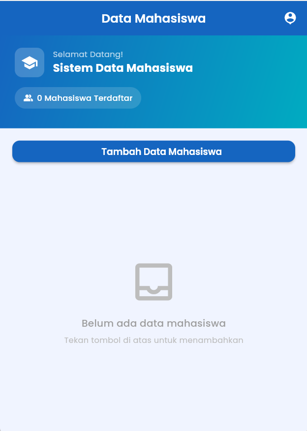
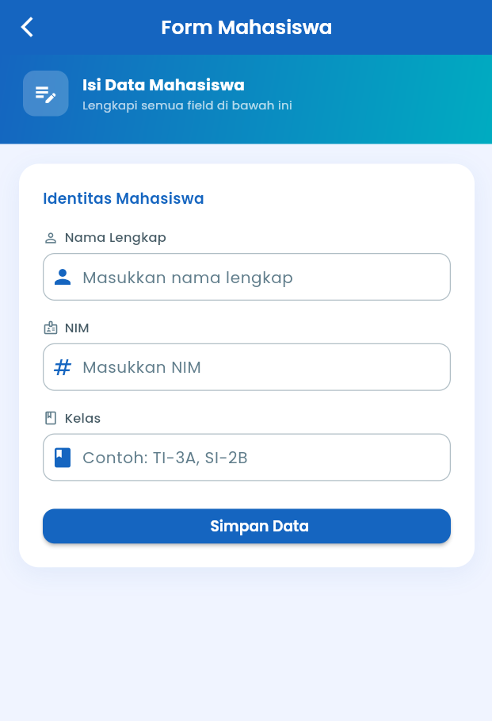
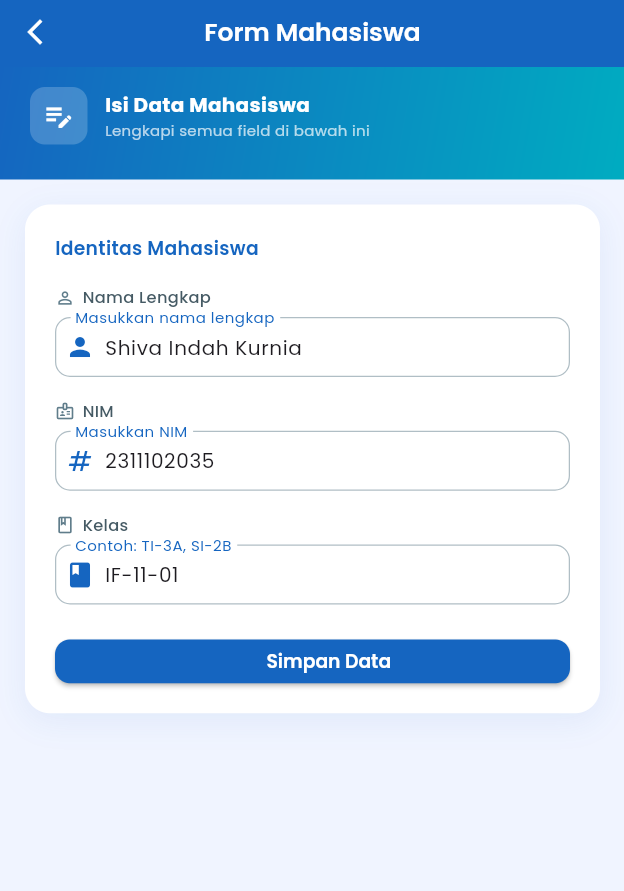
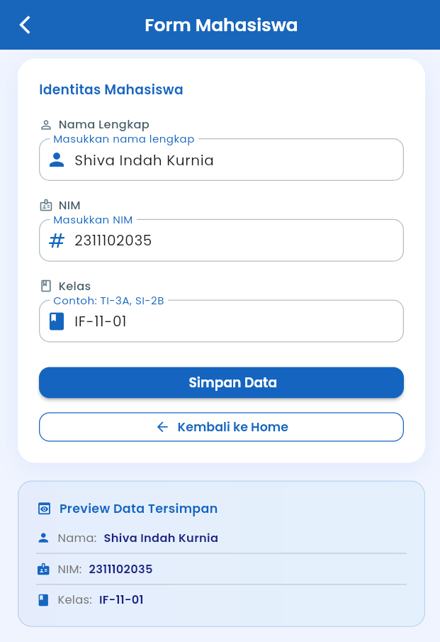
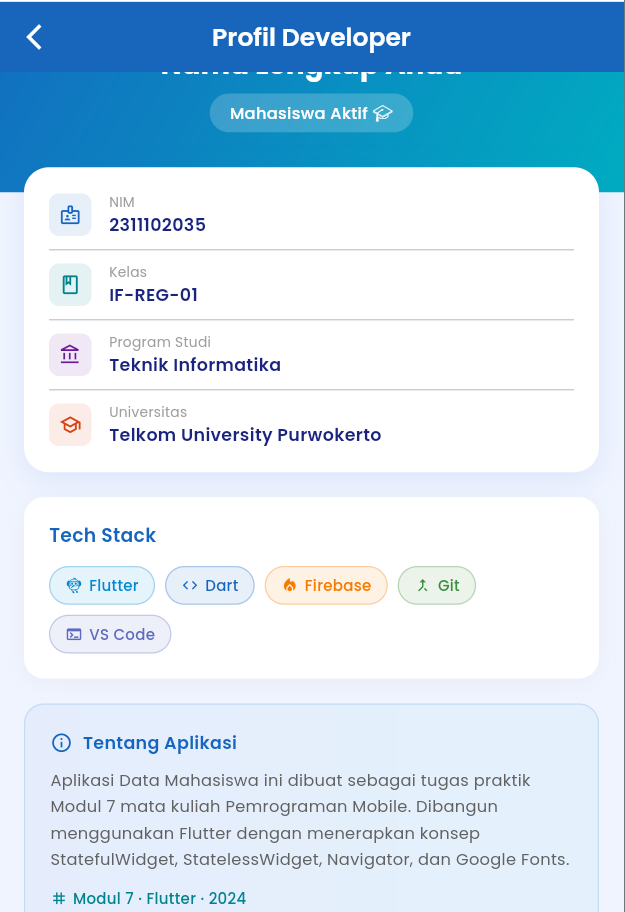

<div align="center">
  <br />
  <h1>LAPORAN PRAKTIKUM <br>APLIKASI BERBASIS PLATFORM</h1>
  <br />
  <h3>TUGAS MODUL 03 & 04 <br> Pengenalan Flutter</h3>
  <br />
  <br />
   
  <br />
  <br />
  <br />
  <br />
  <h3>Disusun Oleh :</h3>
  <p>
    <strong>Shiva Indah Kurnia</strong><br>
    <strong>2311102035</strong><br>
    <strong>S1 IF-11-01</strong>
  </p>
  <br />
  <br />
  <h3>Dosen Pengampu :</h3>
  <p>
    <strong>Dimas Fanny Hebrasianto Permadi, S.ST., M.Kom</strong>
  </p>
  <br />
  <br />
    <h4>Asisten Praktikum :</h4>
    <strong> Apri Pandu Wicaksono </strong> <br>
    <strong>Rangga Pradarrell Fathi</strong>
  <br />
  <h3>LABORATORIUM HIGH PERFORMANCE
 <br>FAKULTAS INFORMATIKA <br>UNIVERSITAS TELKOM PURWOKERTO <br>2026</h3>
</div>

---
# Aplikasi Data Mahasiswa - Flutter

---

## Dasar Teori
**StatelessWidget** adalah widget yang tetap statis dan tidak berubah selama siklus hidup aplikasi setelah dibuat. Widget ini tidak memiliki "state" di dalamnya yang dapat diubah secara otomatis. Informasi atau parameter yang diterimanya hanya "read-only", yang ditunjukkan oleh variabel instansi final. Widget yang tidak bersifat statis sangat cocok untuk menampilkan elemen antarmuka pengguna yang statis, seperti ikon, label teks, gambar, atau halaman profil yang tidak bereaksi terhadap perubahan data internal.

**StatefulWidget** adalah widget yang tetap statis dan tidak berubah selama siklus hidup aplikasi setelah dibuat. Widget ini tidak memiliki "state" di dalamnya yang dapat diubah secara otomatis. Informasi atau parameter yang diterimanya hanya "read-only", yang ditunjukkan oleh variabel instansi final. Widget yang tidak bersifat statis sangat cocok untuk menampilkan elemen antarmuka pengguna yang statis, seperti ikon, label teks, gambar, atau halaman profil yang tidak bereaksi terhadap perubahan data internal.

Dalam Flutter, navigasi (Navigator.push dan Navigator.pop) adalah alat untuk mengelola navigasi halaman yang bekerja seperti tumpukan (*stack*). Navigator.push memungkinkan untuk menumpuk halaman baru ke atas halaman yang sedang aktif. Halaman sebelumnya tetap dipertahankan di dalam memori di bawah halaman baru tersebut. Dengan menggunakan "Navigator.pop", pengguna dapat kembali ke halaman sebelumnya dengan menghapus halaman paling atas dari tumpukan. Selain itu, kita dapat secara asinkron mengembalikan atau mengirimkan data dari halaman aktif ke halaman pemanggil melalui proses pop ini.

**Google Fonts Package** adalah pustaka eksternal resmi Flutter yang memungkinkan pengembang menerapkan secara dinamis ribuan font yang tersedia di direktori Google Fonts tanpa perlu mengunduh berkas font.ttf atau.otf secara manual ke folder aset proyek. Secara instan, buku ini dapat memuat font atau menyimpannya untuk penggunaan offline, meningkatkan estetika tipografi aplikasi.

**AppBar** adalah bagian antarmuka aplikasi di bagian atas layar yang biasanya mengandung judul halaman, tombol aksi navigasi, dan gradien warna untuk membuatnya terlihat lebih premium.

**Container** adalah widget yang memiliki kemampuan dekorasi seperti warna latar, gradien, bayangan shadow, radius batas, margin, dan padding. Ini memungkinkan Anda menyusun dan memformat layout anak widget-nya dengan mudah.

**Column** adalah widget tata letak yang menyusun widget dari atas ke bawah.

**ElevatedButton** adalah tombol material dengan latar belakang warna yang memiliki efek bayangan halus yang menaikkan tombol untuk menunjukkan bahwa pengguna dapat menekannya.

---

## 1. `main.dart`

```dart
import 'package:flutter/material.dart';
import 'package:google_fonts/google_fonts.dart';
import 'screens/home_screen.dart';

void main() {
  runApp(const DataMahasiswaApp());
}

class DataMahasiswaApp extends StatelessWidget {
  const DataMahasiswaApp({super.key});

  @override
  Widget build(BuildContext context) {
    return MaterialApp(
      title: 'Data Mahasiswa',
      debugShowCheckedModeBanner: false,
      theme: ThemeData(
        useMaterial3: true,
        colorScheme: ColorScheme.fromSeed(
          seedColor: const Color(0xFF1565C0),
          primary: const Color(0xFF1565C0),
          secondary: const Color(0xFF00ACC1),
          tertiary: const Color(0xFFFF7043),
          background: const Color(0xFFF0F4FF),
          surface: Colors.white,
          onPrimary: Colors.white,
        ),
        textTheme: GoogleFonts.poppinsTextTheme(),
        elevatedButtonTheme: ElevatedButtonThemeData(
          style: ElevatedButton.styleFrom(
            backgroundColor: const Color(0xFF1565C0),
            foregroundColor: Colors.white,
            padding: const EdgeInsets.symmetric(horizontal: 32, vertical: 14),
            shape: RoundedRectangleBorder(
              borderRadius: BorderRadius.circular(12),
            ),
            elevation: 3,
            textStyle: GoogleFonts.poppins(
              fontWeight: FontWeight.w600,
              fontSize: 15,
            ),
          ),
        ),
        inputDecorationTheme: InputDecorationTheme(
          filled: true,
          fillColor: Colors.white,
          contentPadding:
              const EdgeInsets.symmetric(horizontal: 16, vertical: 14),
          border: OutlineInputBorder(
            borderRadius: BorderRadius.circular(12),
            borderSide: const BorderSide(color: Color(0xFFB0BEC5)),
          ),
          enabledBorder: OutlineInputBorder(
            borderRadius: BorderRadius.circular(12),
            borderSide: const BorderSide(color: Color(0xFFB0BEC5)),
          ),
          focusedBorder: OutlineInputBorder(
            borderRadius: BorderRadius.circular(12),
            borderSide:
                const BorderSide(color: Color(0xFF1565C0), width: 2),
          ),
          labelStyle: GoogleFonts.poppins(color: const Color(0xFF607D8B)),
          floatingLabelStyle:
              GoogleFonts.poppins(color: const Color(0xFF1565C0)),
        ),
        appBarTheme: AppBarTheme(
          backgroundColor: const Color(0xFF1565C0),
          foregroundColor: Colors.white,
          elevation: 0,
          centerTitle: true,
          titleTextStyle: GoogleFonts.poppins(
            fontSize: 20,
            fontWeight: FontWeight.w600,
            color: Colors.white,
          ),
        ),
      ),
      home: const HomeScreen(),
    );
  }
}
```

File main.dart merupakan titik masuk (entry point) dari seluruh aplikasi Flutter. File ini menginisialisasi aplikasi dan mendefinisikan konfigurasi global seperti tema, warna, dan font yang akan digunakan di seluruh halaman.

Komponen Utama:
•	void main():  Fungsi pertama yang dieksekusi saat aplikasi dijalankan, memanggil runApp()
•	DataMahasiswaApp (StatelessWidget):  Widget root yang membungkus seluruh aplikasi
•	MaterialApp:  Widget bawaan Flutter yang menyediakan navigasi, tema, dan konfigurasi Material Design
•	ThemeData:  Mendefinisikan warna utama (biru #1565C0), font Google Fonts Poppins, style AppBar, InputDecoration, dan ElevatedButton secara global
•	home:  HomeScreen(): Menentukan halaman pertama yang tampil saat aplikasi dibuka

---

## 2. `home_screen.dart`

```dart
import 'package:flutter/material.dart';
import 'package:google_fonts/google_fonts.dart';
import 'form_mahasiswa_screen.dart';
import 'profil_developer_screen.dart';

class HomeScreen extends StatefulWidget {
  const HomeScreen({super.key});

  @override
  State<HomeScreen> createState() => _HomeScreenState();
}

class _HomeScreenState extends State<HomeScreen> {
  // Menyimpan daftar data mahasiswa yang sudah diisi
  final List<Map<String, String>> _dataMahasiswaList = [];

  void _onDataSaved(Map<String, String> data) {
    setState(() {
      _dataMahasiswaList.add(data);
    });
  }

  @override
  Widget build(BuildContext context) {
    return Scaffold(
      backgroundColor: const Color(0xFFF0F4FF),
      appBar: AppBar(
        title: const Text('Data Mahasiswa'),
        actions: [
          IconButton(
            icon: const Icon(Icons.person_pin, color: Colors.white),
            tooltip: 'Profil Developer',
            onPressed: () {
              Navigator.push(
                context,
                MaterialPageRoute(
                  builder: (context) => const ProfilDeveloperScreen(),
                ),
              );
            },
          ),
          const SizedBox(width: 8),
        ],
      ),
      body: Column(
        children: [
          // Header Banner
          Container(
            width: double.infinity,
            decoration: const BoxDecoration(
              gradient: LinearGradient(
                colors: [Color(0xFF1565C0), Color(0xFF00ACC1)],
                begin: Alignment.topLeft,
                end: Alignment.bottomRight,
              ),
            ),
            padding: const EdgeInsets.fromLTRB(24, 20, 24, 32),
            child: Column(
              crossAxisAlignment: CrossAxisAlignment.start,
              children: [
                Row(
                  children: [
                    Container(
                      padding: const EdgeInsets.all(10),
                      decoration: BoxDecoration(
                        color: Colors.white.withOpacity(0.2),
                        borderRadius: BorderRadius.circular(12),
                      ),
                      child: const Icon(
                        Icons.school,
                        color: Colors.white,
                        size: 28,
                      ),
                    ),
                    const SizedBox(width: 14),
                    Expanded(
                      child: Column(
                        crossAxisAlignment: CrossAxisAlignment.start,
                        children: [
                          Text(
                            'Selamat Datang!',
                            style: GoogleFonts.poppins(
                              color: Colors.white70,
                              fontSize: 13,
                            ),
                          ),
                          Text(
                            'Sistem Data Mahasiswa',
                            style: GoogleFonts.poppins(
                              color: Colors.white,
                              fontSize: 18,
                              fontWeight: FontWeight.bold,
                            ),
                          ),
                        ],
                      ),
                    ),
                  ],
                ),
                const SizedBox(height: 16),
                Container(
                  padding:
                      const EdgeInsets.symmetric(horizontal: 14, vertical: 8),
                  decoration: BoxDecoration(
                    color: Colors.white.withOpacity(0.15),
                    borderRadius: BorderRadius.circular(20),
                  ),
                  child: Row(
                    mainAxisSize: MainAxisSize.min,
                    children: [
                      const Icon(Icons.people_alt,
                          color: Colors.white, size: 16),
                      const SizedBox(width: 6),
                      Text(
                        '${_dataMahasiswaList.length} Mahasiswa Terdaftar',
                        style: GoogleFonts.poppins(
                          color: Colors.white,
                          fontSize: 13,
                          fontWeight: FontWeight.w500,
                        ),
                      ),
                    ],
                  ),
                ),
              ],
            ),
          ),

          // Tombol Tambah Data
          Padding(
            padding: const EdgeInsets.fromLTRB(20, 20, 20, 12),
            child: SizedBox(
              width: double.infinity,
              child: ElevatedButton.icon(
                icon: const Icon(Icons.add_circle_outline),
                label: const Text('Tambah Data Mahasiswa'),
                onPressed: () async {
                  final result = await Navigator.push(
                    context,
                    MaterialPageRoute(
                      builder: (context) => const FormMahasiswaScreen(),
                    ),
                  );
                  if (result != null && result is Map<String, String>) {
                    _onDataSaved(result);
                  }
                },
              ),
            ),
          ),

          // List Data Mahasiswa
          Expanded(
            child: _dataMahasiswaList.isEmpty
                ? _buildEmptyState()
                : _buildDataList(),
          ),
        ],
      ),
    );
  }

  Widget _buildEmptyState() {
    return Center(
      child: Column(
        mainAxisAlignment: MainAxisAlignment.center,
        children: [
          Icon(
            Icons.inbox_outlined,
            size: 80,
            color: Colors.grey.shade400,
          ),
          const SizedBox(height: 16),
          Text(
            'Belum ada data mahasiswa',
            style: GoogleFonts.poppins(
              fontSize: 16,
              color: Colors.grey.shade500,
              fontWeight: FontWeight.w500,
            ),
          ),
          const SizedBox(height: 6),
          Text(
            'Tekan tombol di atas untuk menambahkan',
            style: GoogleFonts.poppins(
              fontSize: 13,
              color: Colors.grey.shade400,
            ),
          ),
        ],
      ),
    );
  }

  Widget _buildDataList() {
    return ListView.builder(
      padding: const EdgeInsets.fromLTRB(20, 0, 20, 20),
      itemCount: _dataMahasiswaList.length,
      itemBuilder: (context, index) {
        final mahasiswa = _dataMahasiswaList[index];
        return _MahasiswaCard(
          mahasiswa: mahasiswa,
          nomor: index + 1,
        );
      },
    );
  }
}

// ─── StatelessWidget: Kartu Mahasiswa ────────────────────────────────────────
class _MahasiswaCard extends StatelessWidget {
  final Map<String, String> mahasiswa;
  final int nomor;

  const _MahasiswaCard({required this.mahasiswa, required this.nomor});

  @override
  Widget build(BuildContext context) {
    final colors = [
      const Color(0xFF1565C0),
      const Color(0xFF00838F),
      const Color(0xFF6A1B9A),
      const Color(0xFFD84315),
    ];
    final color = colors[(nomor - 1) % colors.length];

    return Container(
      margin: const EdgeInsets.only(bottom: 12),
      decoration: BoxDecoration(
        color: Colors.white,
        borderRadius: BorderRadius.circular(16),
        boxShadow: [
          BoxShadow(
            color: color.withOpacity(0.12),
            blurRadius: 12,
            offset: const Offset(0, 4),
          ),
        ],
      ),
      child: Row(
        children: [
          // Nomor & avatar
          Container(
            width: 60,
            height: 80,
            decoration: BoxDecoration(
              color: color.withOpacity(0.1),
              borderRadius: const BorderRadius.only(
                topLeft: Radius.circular(16),
                bottomLeft: Radius.circular(16),
              ),
            ),
            child: Center(
              child: Text(
                '#$nomor',
                style: GoogleFonts.poppins(
                  fontSize: 18,
                  fontWeight: FontWeight.bold,
                  color: color,
                ),
              ),
            ),
          ),
          const SizedBox(width: 14),
          // Data
          Expanded(
            child: Padding(
              padding: const EdgeInsets.symmetric(vertical: 14),
              child: Column(
                crossAxisAlignment: CrossAxisAlignment.start,
                children: [
                  Text(
                    mahasiswa['nama'] ?? '-',
                    style: GoogleFonts.poppins(
                      fontSize: 15,
                      fontWeight: FontWeight.w600,
                      color: const Color(0xFF1A237E),
                    ),
                  ),
                  const SizedBox(height: 4),
                  Row(
                    children: [
                      Icon(Icons.badge_outlined, size: 13, color: color),
                      const SizedBox(width: 4),
                      Text(
                        mahasiswa['nim'] ?? '-',
                        style: GoogleFonts.poppins(
                          fontSize: 12,
                          color: Colors.grey.shade600,
                        ),
                      ),
                      const SizedBox(width: 12),
                      Icon(Icons.class_outlined, size: 13, color: color),
                      const SizedBox(width: 4),
                      Text(
                        mahasiswa['kelas'] ?? '-',
                        style: GoogleFonts.poppins(
                          fontSize: 12,
                          color: Colors.grey.shade600,
                        ),
                      ),
                    ],
                  ),
                ],
              ),
            ),
          ),
          Padding(
            padding: const EdgeInsets.only(right: 16),
            child: Icon(Icons.chevron_right, color: color.withOpacity(0.5)),
          ),
        ],
      ),
    );
  }
}
```

File home_screen.dart merupakan halaman utama yang pertama kali dilihat pengguna. Halaman ini berfungsi sebagai pusat navigasi sekaligus menampilkan daftar data mahasiswa yang telah diinput melalui form.

Komponen Utama:
•	HomeScreen (StatefulWidget):  Digunakan karena halaman ini perlu menyimpan dan memperbarui daftar _dataMahasiswaList setiap ada data baru
•	_HomeScreenState:  Kelas state yang menyimpan List<Map<String,String>> sebagai penyimpan data mahasiswa
•	Navigator.push:  Digunakan untuk berpindah ke FormMahasiswaScreen dan ProfilDeveloperScreen
•	async/await + result:  Menunggu hasil dari FormMahasiswaScreen dan menyimpan data yang dikembalikan
•	_MahasiswaCard (StatelessWidget):  Widget terpisah untuk menampilkan setiap kartu data mahasiswa
•	AppBar, Container, Column, ElevatedButton, ListView:  Widget UI utama yang digunakan

---

## 3. `form_mahasiswa.dart`

```dart
import 'package:flutter/material.dart';
import 'package:google_fonts/google_fonts.dart';

class FormMahasiswaScreen extends StatefulWidget {
  const FormMahasiswaScreen({super.key});

  @override
  State<FormMahasiswaScreen> createState() => _FormMahasiswaScreenState();
}

class _FormMahasiswaScreenState extends State<FormMahasiswaScreen> {
  final _formKey = GlobalKey<FormState>();
  final _namaController = TextEditingController();
  final _nimController = TextEditingController();
  final _kelasController = TextEditingController();

  bool _isSaved = false;
  String _savedNama = '';
  String _savedNim = '';
  String _savedKelas = '';

  @override
  void dispose() {
    _namaController.dispose();
    _nimController.dispose();
    _kelasController.dispose();
    super.dispose();
  }

  void _simpanData() {
    if (_formKey.currentState!.validate()) {
      setState(() {
        _isSaved = true;
        _savedNama = _namaController.text.trim();
        _savedNim = _nimController.text.trim();
        _savedKelas = _kelasController.text.trim();
      });

      // Tampilkan SnackBar
      ScaffoldMessenger.of(context).showSnackBar(
        SnackBar(
          content: Row(
            children: [
              const Icon(Icons.check_circle, color: Colors.white),
              const SizedBox(width: 10),
              Expanded(
                child: Text(
                  'Data $_savedNama berhasil disimpan!',
                  style: GoogleFonts.poppins(
                      color: Colors.white, fontWeight: FontWeight.w500),
                ),
              ),
            ],
          ),
          backgroundColor: const Color(0xFF2E7D32),
          behavior: SnackBarBehavior.floating,
          shape:
              RoundedRectangleBorder(borderRadius: BorderRadius.circular(12)),
          margin: const EdgeInsets.all(16),
          duration: const Duration(seconds: 3),
        ),
      );
    }
  }

  void _kembaliDenganData() {
    if (_isSaved) {
      Navigator.pop(context, {
        'nama': _savedNama,
        'nim': _savedNim,
        'kelas': _savedKelas,
      });
    } else {
      Navigator.pop(context);
    }
  }

  @override
  Widget build(BuildContext context) {
    return Scaffold(
      backgroundColor: const Color(0xFFF0F4FF),
      appBar: AppBar(
        title: const Text('Form Mahasiswa'),
        leading: IconButton(
          icon: const Icon(Icons.arrow_back_ios_new),
          onPressed: _kembaliDenganData,
        ),
      ),
      body: SingleChildScrollView(
        child: Column(
          children: [
            // Header
            Container(
              width: double.infinity,
              decoration: const BoxDecoration(
                gradient: LinearGradient(
                  colors: [Color(0xFF1565C0), Color(0xFF00ACC1)],
                  begin: Alignment.topLeft,
                  end: Alignment.bottomRight,
                ),
              ),
              padding: const EdgeInsets.fromLTRB(24, 16, 24, 28),
              child: Row(
                children: [
                  Container(
                    padding: const EdgeInsets.all(10),
                    decoration: BoxDecoration(
                      color: Colors.white.withOpacity(0.2),
                      borderRadius: BorderRadius.circular(12),
                    ),
                    child: const Icon(Icons.edit_note,
                        color: Colors.white, size: 26),
                  ),
                  const SizedBox(width: 14),
                  Column(
                    crossAxisAlignment: CrossAxisAlignment.start,
                    children: [
                      Text(
                        'Isi Data Mahasiswa',
                        style: GoogleFonts.poppins(
                          color: Colors.white,
                          fontSize: 16,
                          fontWeight: FontWeight.bold,
                        ),
                      ),
                      Text(
                        'Lengkapi semua field di bawah ini',
                        style: GoogleFonts.poppins(
                          color: Colors.white70,
                          fontSize: 12,
                        ),
                      ),
                    ],
                  ),
                ],
              ),
            ),

            // Form Card
            Container(
              margin: const EdgeInsets.all(20),
              padding: const EdgeInsets.all(24),
              decoration: BoxDecoration(
                color: Colors.white,
                borderRadius: BorderRadius.circular(20),
                boxShadow: [
                  BoxShadow(
                    color: const Color(0xFF1565C0).withOpacity(0.08),
                    blurRadius: 20,
                    offset: const Offset(0, 6),
                  ),
                ],
              ),
              child: Form(
                key: _formKey,
                child: Column(
                  crossAxisAlignment: CrossAxisAlignment.start,
                  children: [
                    Text(
                      'Identitas Mahasiswa',
                      style: GoogleFonts.poppins(
                        fontSize: 15,
                        fontWeight: FontWeight.w600,
                        color: const Color(0xFF1565C0),
                      ),
                    ),
                    const SizedBox(height: 20),

                    // Field Nama
                    _buildFieldLabel('Nama Lengkap', Icons.person_outline),
                    const SizedBox(height: 6),
                    TextFormField(
                      controller: _namaController,
                      textCapitalization: TextCapitalization.words,
                      decoration: const InputDecoration(
                        labelText: 'Masukkan nama lengkap',
                        prefixIcon: Icon(Icons.person, color: Color(0xFF1565C0)),
                      ),
                      validator: (value) {
                        if (value == null || value.trim().isEmpty) {
                          return 'Nama tidak boleh kosong';
                        }
                        return null;
                      },
                    ),
                    const SizedBox(height: 18),

                    // Field NIM
                    _buildFieldLabel('NIM', Icons.badge_outlined),
                    const SizedBox(height: 6),
                    TextFormField(
                      controller: _nimController,
                      keyboardType: TextInputType.number,
                      decoration: const InputDecoration(
                        labelText: 'Masukkan NIM',
                        prefixIcon:
                            Icon(Icons.numbers, color: Color(0xFF1565C0)),
                      ),
                      validator: (value) {
                        if (value == null || value.trim().isEmpty) {
                          return 'NIM tidak boleh kosong';
                        }
                        return null;
                      },
                    ),
                    const SizedBox(height: 18),

                    // Field Kelas
                    _buildFieldLabel('Kelas', Icons.class_outlined),
                    const SizedBox(height: 6),
                    TextFormField(
                      controller: _kelasController,
                      textCapitalization: TextCapitalization.characters,
                      decoration: const InputDecoration(
                        labelText: 'Contoh: TI-3A, SI-2B',
                        prefixIcon: Icon(Icons.class_, color: Color(0xFF1565C0)),
                      ),
                      validator: (value) {
                        if (value == null || value.trim().isEmpty) {
                          return 'Kelas tidak boleh kosong';
                        }
                        return null;
                      },
                    ),
                    const SizedBox(height: 28),

                    // Tombol Simpan
                    SizedBox(
                      width: double.infinity,
                      child: ElevatedButton.icon(
                        icon: const Icon(Icons.save_outlined),
                        label: const Text('Simpan Data'),
                        onPressed: _simpanData,
                      ),
                    ),

                    if (_isSaved) ...[
                      const SizedBox(height: 16),
                      SizedBox(
                        width: double.infinity,
                        child: OutlinedButton.icon(
                          icon: const Icon(Icons.arrow_back),
                          label: const Text('Kembali ke Home'),
                          style: OutlinedButton.styleFrom(
                            foregroundColor: const Color(0xFF1565C0),
                            side: const BorderSide(color: Color(0xFF1565C0)),
                            padding: const EdgeInsets.symmetric(vertical: 14),
                            shape: RoundedRectangleBorder(
                              borderRadius: BorderRadius.circular(12),
                            ),
                            textStyle: GoogleFonts.poppins(
                                fontWeight: FontWeight.w600),
                          ),
                          onPressed: _kembaliDenganData,
                        ),
                      ),
                    ],
                  ],
                ),
              ),
            ),

            // Preview Data (setelah simpan)
            if (_isSaved)
              Container(
                margin: const EdgeInsets.fromLTRB(20, 0, 20, 20),
                padding: const EdgeInsets.all(20),
                decoration: BoxDecoration(
                  gradient: LinearGradient(
                    colors: [
                      const Color(0xFF1565C0).withOpacity(0.05),
                      const Color(0xFF00ACC1).withOpacity(0.05),
                    ],
                  ),
                  borderRadius: BorderRadius.circular(16),
                  border: Border.all(
                    color: const Color(0xFF1565C0).withOpacity(0.2),
                  ),
                ),
                child: Column(
                  crossAxisAlignment: CrossAxisAlignment.start,
                  children: [
                    Row(
                      children: [
                        const Icon(Icons.preview,
                            color: Color(0xFF1565C0), size: 18),
                        const SizedBox(width: 8),
                        Text(
                          'Preview Data Tersimpan',
                          style: GoogleFonts.poppins(
                            fontSize: 14,
                            fontWeight: FontWeight.w600,
                            color: const Color(0xFF1565C0),
                          ),
                        ),
                      ],
                    ),
                    const SizedBox(height: 14),
                    _buildPreviewRow(
                        Icons.person, 'Nama', _savedNama),
                    const Divider(height: 16),
                    _buildPreviewRow(Icons.badge, 'NIM', _savedNim),
                    const Divider(height: 16),
                    _buildPreviewRow(Icons.class_, 'Kelas', _savedKelas),
                  ],
                ),
              ),

            const SizedBox(height: 20),
          ],
        ),
      ),
    );
  }

  Widget _buildFieldLabel(String label, IconData icon) {
    return Row(
      children: [
        Icon(icon, size: 16, color: const Color(0xFF607D8B)),
        const SizedBox(width: 6),
        Text(
          label,
          style: GoogleFonts.poppins(
            fontSize: 13,
            fontWeight: FontWeight.w500,
            color: const Color(0xFF455A64),
          ),
        ),
      ],
    );
  }

  Widget _buildPreviewRow(IconData icon, String label, String value) {
    return Row(
      children: [
        Icon(icon, size: 16, color: const Color(0xFF1565C0)),
        const SizedBox(width: 8),
        Text(
          '$label:',
          style: GoogleFonts.poppins(
            fontSize: 13,
            color: Colors.grey.shade600,
          ),
        ),
        const SizedBox(width: 8),
        Expanded(
          child: Text(
            value,
            style: GoogleFonts.poppins(
              fontSize: 13,
              fontWeight: FontWeight.w600,
              color: const Color(0xFF1A237E),
            ),
          ),
        ),
      ],
    );
  }
}
```

File ini berisi halaman formulir untuk memasukkan data mahasiswa. Halaman ini StatefulWidget karena perlu mengelola state dari tiga TextEditingController, validasi form, dan preview data setelah disimpan.

Komponen Utama:
•	FormMahasiswaScreen (StatefulWidget):  Mengelola state form termasuk controller teks dan status simpan
•	GlobalKey<FormState>:  Kunci unik untuk mengontrol validasi form secara programatik
•	TextEditingController:  Tiga buah controller untuk field Nama, NIM, dan Kelas
•	_simpanData():  Memvalidasi form, menyimpan data ke state, lalu menampilkan SnackBar notifikasi
•	SnackBar:  Notifikasi yang muncul di bagian bawah layar saat data berhasil disimpan
•	Navigator.pop(context, data):  Kembali ke HomeScreen sambil mengirim data mahasiswa sebagai return value
•	Preview Section:  Menampilkan data yang baru disimpan di bawah form sebagai konfirmasi visual


---

## 4. `profil_developer_screen.dart`

```dart
import 'package:flutter/material.dart';
import 'package:google_fonts/google_fonts.dart';

class ProfilDeveloperScreen extends StatelessWidget {
  const ProfilDeveloperScreen({super.key});

  @override
  Widget build(BuildContext context) {
    return Scaffold(
      backgroundColor: const Color(0xFFF0F4FF),
      appBar: AppBar(
        title: const Text('Profil Developer'),
        leading: IconButton(
          icon: const Icon(Icons.arrow_back_ios_new),
          onPressed: () => Navigator.pop(context),
        ),
      ),
      body: SingleChildScrollView(
        child: Column(
          children: [
            // Hero Section
            Container(
              width: double.infinity,
              decoration: const BoxDecoration(
                gradient: LinearGradient(
                  colors: [Color(0xFF1565C0), Color(0xFF00ACC1)],
                  begin: Alignment.topLeft,
                  end: Alignment.bottomRight,
                ),
              ),
              padding: const EdgeInsets.fromLTRB(24, 32, 24, 48),
              child: Column(
                children: [
                  // Avatar
                  Container(
                    width: 100,
                    height: 100,
                    decoration: BoxDecoration(
                      color: Colors.white,
                      shape: BoxShape.circle,
                      boxShadow: [
                        BoxShadow(
                          color: Colors.black.withOpacity(0.2),
                          blurRadius: 16,
                          offset: const Offset(0, 6),
                        ),
                      ],
                    ),
                    child: const Icon(
                      Icons.person,
                      size: 56,
                      color: Color(0xFF1565C0),
                    ),
                  ),
                  const SizedBox(height: 16),
                  Text(
                    'Developer Aplikasi',
                    style: GoogleFonts.poppins(
                      color: Colors.white70,
                      fontSize: 13,
                    ),
                  ),
                  const SizedBox(height: 4),
                  Text(
                    'Nama Lengkap Anda',
                    style: GoogleFonts.poppins(
                      color: Colors.white,
                      fontSize: 22,
                      fontWeight: FontWeight.bold,
                    ),
                  ),
                  const SizedBox(height: 8),
                  Container(
                    padding: const EdgeInsets.symmetric(
                        horizontal: 16, vertical: 6),
                    decoration: BoxDecoration(
                      color: Colors.white.withOpacity(0.2),
                      borderRadius: BorderRadius.circular(20),
                    ),
                    child: Text(
                      'Mahasiswa Aktif 🎓',
                      style: GoogleFonts.poppins(
                        color: Colors.white,
                        fontSize: 13,
                        fontWeight: FontWeight.w500,
                      ),
                    ),
                  ),
                ],
              ),
            ),

            // Info Cards
            Transform.translate(
              offset: const Offset(0, -20),
              child: Container(
                margin: const EdgeInsets.symmetric(horizontal: 20),
                padding: const EdgeInsets.all(20),
                decoration: BoxDecoration(
                  color: Colors.white,
                  borderRadius: BorderRadius.circular(20),
                  boxShadow: [
                    BoxShadow(
                      color: const Color(0xFF1565C0).withOpacity(0.1),
                      blurRadius: 20,
                      offset: const Offset(0, 6),
                    ),
                  ],
                ),
                child: Column(
                  children: [
                    _buildInfoRow(
                      icon: Icons.badge_outlined,
                      label: 'NIM',
                      value: '2311102035',
                      color: const Color(0xFF1565C0),
                    ),
                    const Divider(height: 20),
                    _buildInfoRow(
                      icon: Icons.class_outlined,
                      label: 'Kelas',
                      value: 'IF-REG-01',
                      color: const Color(0xFF00838F),
                    ),
                    const Divider(height: 20),
                    _buildInfoRow(
                      icon: Icons.account_balance_outlined,
                      label: 'Program Studi',
                      value: 'Teknik Informatika',
                      color: const Color(0xFF6A1B9A),
                    ),
                    const Divider(height: 20),
                    _buildInfoRow(
                      icon: Icons.school_outlined,
                      label: 'Universitas',
                      value: 'Telkom University Purwokerto',
                      color: const Color(0xFFD84315),
                    ),
                  ],
                ),
              ),
            ),

            // Skills Section
            Padding(
              padding: const EdgeInsets.fromLTRB(20, 0, 20, 20),
              child: Container(
                width: double.infinity,
                padding: const EdgeInsets.all(20),
                decoration: BoxDecoration(
                  color: Colors.white,
                  borderRadius: BorderRadius.circular(16),
                  boxShadow: [
                    BoxShadow(
                      color: Colors.grey.withOpacity(0.08),
                      blurRadius: 12,
                      offset: const Offset(0, 4),
                    ),
                  ],
                ),
                child: Column(
                  crossAxisAlignment: CrossAxisAlignment.start,
                  children: [
                    Text(
                      'Tech Stack',
                      style: GoogleFonts.poppins(
                        fontSize: 15,
                        fontWeight: FontWeight.w600,
                        color: const Color(0xFF1565C0),
                      ),
                    ),
                    const SizedBox(height: 14),
                    Wrap(
                      spacing: 8,
                      runSpacing: 8,
                      children: [
                        _buildChip('Flutter', Icons.flutter_dash, const Color(0xFF0288D1)),
                        _buildChip('Dart', Icons.code, const Color(0xFF1565C0)),
                        _buildChip('Firebase', Icons.local_fire_department, const Color(0xFFF57C00)),
                        _buildChip('Git', Icons.merge_type, const Color(0xFF388E3C)),
                        _buildChip('VS Code', Icons.terminal, const Color(0xFF5C6BC0)),
                      ],
                    ),
                  ],
                ),
              ),
            ),

            // About Section
            Padding(
              padding: const EdgeInsets.fromLTRB(20, 0, 20, 20),
              child: Container(
                width: double.infinity,
                padding: const EdgeInsets.all(20),
                decoration: BoxDecoration(
                  gradient: LinearGradient(
                    colors: [
                      const Color(0xFF1565C0).withOpacity(0.05),
                      const Color(0xFF00ACC1).withOpacity(0.05),
                    ],
                  ),
                  borderRadius: BorderRadius.circular(16),
                  border: Border.all(
                    color: const Color(0xFF1565C0).withOpacity(0.15),
                  ),
                ),
                child: Column(
                  crossAxisAlignment: CrossAxisAlignment.start,
                  children: [
                    Row(
                      children: [
                        const Icon(Icons.info_outline,
                            color: Color(0xFF1565C0), size: 18),
                        const SizedBox(width: 8),
                        Text(
                          'Tentang Aplikasi',
                          style: GoogleFonts.poppins(
                            fontSize: 14,
                            fontWeight: FontWeight.w600,
                            color: const Color(0xFF1565C0),
                          ),
                        ),
                      ],
                    ),
                    const SizedBox(height: 10),
                    Text(
                      'Aplikasi Data Mahasiswa ini dibuat sebagai tugas praktik Modul 7 mata kuliah Pemrograman Mobile. Dibangun menggunakan Flutter dengan menerapkan konsep StatefulWidget, StatelessWidget, Navigator, dan Google Fonts.',
                      style: GoogleFonts.poppins(
                        fontSize: 13,
                        color: Colors.grey.shade700,
                        height: 1.6,
                      ),
                    ),
                    const SizedBox(height: 12),
                    Row(
                      children: [
                        const Icon(Icons.tag, size: 14, color: Color(0xFF00838F)),
                        const SizedBox(width: 4),
                        Text(
                          'Modul 7 · Flutter · 2024',
                          style: GoogleFonts.poppins(
                            fontSize: 12,
                            color: const Color(0xFF00838F),
                            fontWeight: FontWeight.w500,
                          ),
                        ),
                      ],
                    ),
                  ],
                ),
              ),
            ),

            const SizedBox(height: 20),
          ],
        ),
      ),
    );
  }

  Widget _buildInfoRow({
    required IconData icon,
    required String label,
    required String value,
    required Color color,
  }) {
    return Row(
      children: [
        Container(
          padding: const EdgeInsets.all(8),
          decoration: BoxDecoration(
            color: color.withOpacity(0.1),
            borderRadius: BorderRadius.circular(8),
          ),
          child: Icon(icon, color: color, size: 18),
        ),
        const SizedBox(width: 14),
        Column(
          crossAxisAlignment: CrossAxisAlignment.start,
          children: [
            Text(
              label,
              style: GoogleFonts.poppins(
                fontSize: 11,
                color: Colors.grey.shade500,
              ),
            ),
            Text(
              value,
              style: GoogleFonts.poppins(
                fontSize: 14,
                fontWeight: FontWeight.w600,
                color: const Color(0xFF1A237E),
              ),
            ),
          ],
        ),
      ],
    );
  }

  Widget _buildChip(String label, IconData icon, Color color) {
    return Container(
      padding: const EdgeInsets.symmetric(horizontal: 12, vertical: 6),
      decoration: BoxDecoration(
        color: color.withOpacity(0.1),
        borderRadius: BorderRadius.circular(20),
        border: Border.all(color: color.withOpacity(0.3)),
      ),
      child: Row(
        mainAxisSize: MainAxisSize.min,
        children: [
          Icon(icon, size: 14, color: color),
          const SizedBox(width: 5),
          Text(
            label,
            style: GoogleFonts.poppins(
              fontSize: 12,
              fontWeight: FontWeight.w500,
              color: color,
            ),
          ),
        ],
      ),
    );
  }
}
```

File ini menampilkan informasi tentang developer yang membuat aplikasi. Halaman ini menggunakan StatelessWidget karena seluruh isinya bersifat statis - tidak ada data yang berubah selama halaman ditampilkan.

Komponen Utama:
•	ProfilDeveloperScreen (StatelessWidget):  Tidak memerlukan state karena semua konten bersifat tetap
•	Hero Section:  Bagian atas dengan gradient biru dan avatar lingkaran
•	Info Card:  Tabel informasi developer (NIM, kelas, program studi, universitas)
•	Tech Stack Section:  Chip warna-warni yang menampilkan teknologi yang dikuasai developer
•	About Section:  Deskripsi singkat tentang aplikasi dan tujuan pembuatannya
•	Navigator.pop(context):  Tombol back pada AppBar untuk kembali ke HomeScreen


---

## Konsep Navigator

```
Stack Navigasi:
┌─────────────────┐
│   HomeScreen    │  
├─────────────────┤
│  FormMahasiswa  |
|      Screen     │
├─────────────────┤
│ ProfilDeveloper |
│      Screen     |
└─────────────────┘
```

| Method | Fungsi |
|--------|--------|
| `Navigator.push()` | Menambahkan halaman baru ke atas stack (berpindah maju) |
| `Navigator.pop()` | Menghapus halaman teratas dari stack (kembali) |
| `MaterialPageRoute()` | Membungkus halaman tujuan dengan animasi Material Design |
| `await Navigator.push()` | Menunggu data yang dikembalikan saat pop dipanggil |
| `Navigator.pop(ctx, data)` | Kembali ke halaman sebelumnya + kirim data |

---
## Output
 
 
 
 
 
