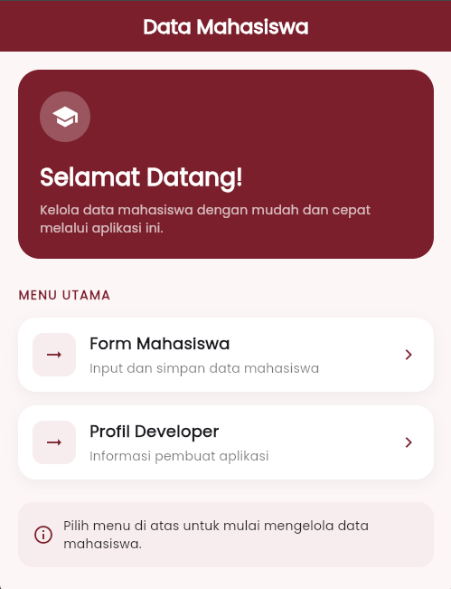
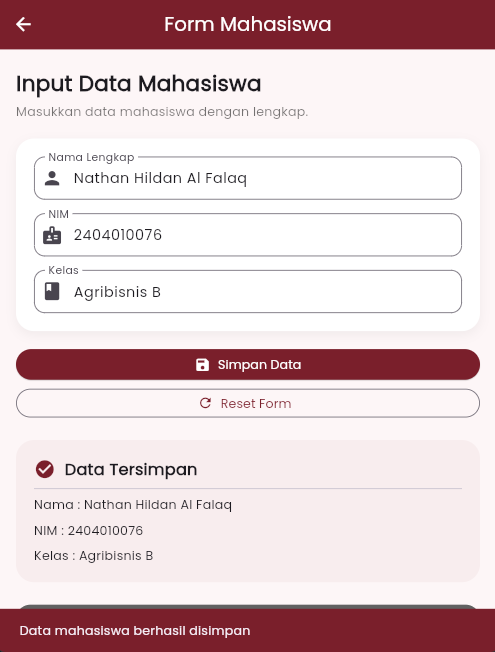
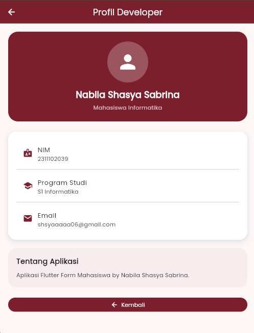

<div align="center">

# LAPORAN PRAKTIKUM
# APLIKASI BERBASIS PLATFORM

## MODUL 7 - Flutter Mobile

<br>


<br><br>

### Disusun Oleh

**Nabila Shasya Sabrina**  
**2311102039**  
**S1 IF-11-01**

<br>

### Dosen Pengampu

**Dimas Fanny Hebrasianto Permadi, S.ST., M.Kom**

<br>

### Asisten Praktikum

**Apri Pandu Wicaksono**  
**Rangga Pradarrell Fathi**

<br>

### LABORATORIUM HIGH PERFORMANCE COMPUTING
### FAKULTAS INFORMATIKA
### UNIVERSITAS TELKOM PURWOKERTO
### 2026

</div>

---

# 1. Dasar Teori

## Navigator

Navigator merupakan komponen yang berfungsi mengatur perpindahan antar halaman dalam aplikasi Flutter. Navigator bekerja menggunakan konsep **stack (tumpukan)**. Saat halaman baru dibuka menggunakan `Navigator.push()`, halaman tersebut akan ditambahkan ke bagian atas stack. Untuk kembali ke halaman sebelumnya digunakan `Navigator.pop()` yang akan menghapus halaman aktif dari stack.

## Form

Form digunakan untuk menerima dan mengelola data yang dimasukkan oleh pengguna. Dalam Flutter, form biasanya menggunakan widget seperti `TextField` untuk menerima input. Agar data input dapat diakses dan diproses, digunakan `TextEditingController`.

## StatelessWidget

`StatelessWidget` merupakan widget yang bersifat statis dan tidak berubah setelah dibuat. Widget ini tidak menyimpan state sehingga tampilannya akan tetap sama selama aplikasi berjalan. Biasanya digunakan untuk menampilkan informasi yang tidak berubah.

## StatefulWidget

`StatefulWidget` adalah widget yang dapat berubah sesuai interaksi pengguna atau perubahan data. Widget ini memiliki objek `State` yang digunakan untuk menyimpan data yang dapat diperbarui menggunakan `setState()`, sehingga tampilan aplikasi dapat diperbarui secara dinamis.

---

# 2. Tentang Aplikasi

## Teknologi yang Digunakan

- Flutter
- Dart
- Material Design
- Google Fonts (Poppins)

## Fitur Aplikasi

- Home Page sebagai halaman utama aplikasi.
- Form Mahasiswa untuk menginput data mahasiswa.
- Profil Developer untuk menampilkan informasi pengembang.
- SnackBar sebagai notifikasi penyimpanan data.
- Navigasi antar halaman menggunakan Navigator.

## Widget yang Digunakan

- StatelessWidget
- StatefulWidget
- Scaffold
- AppBar
- Container
- Column
- TextField
- ElevatedButton
- Icon
- SnackBar
- Navigator

---

# 3. Struktur Project

```text
lib/
│
├── main.dart
│
├── pages/
│   ├── home_page.dart
│   ├── form_mahasiswa_page.dart
│   └── profil_page.dart
│
└── theme/
    └── app_colors.dart
```

---

# 4. Source Code

## main.dart

```dart
import 'package:flutter/material.dart';
import 'package:google_fonts/google_fonts.dart';

import 'pages/home_page.dart';
import 'theme/app_colors.dart';

void main() {
  runApp(const MyApp());
}

class MyApp extends StatelessWidget {
  const MyApp({super.key});

  @override
  Widget build(BuildContext context) {
    return MaterialApp(
      debugShowCheckedModeBanner: false,

      theme: ThemeData(
        scaffoldBackgroundColor: AppColors.softPink,

        appBarTheme: const AppBarTheme(
          backgroundColor: AppColors.primaryMaroon,
          foregroundColor: Colors.white,
          centerTitle: true,
        ),

        textTheme: GoogleFonts.poppinsTextTheme(),
      ),

      home: const HomePage(),
    );
  }
}
```

### Deskripsi

File `main.dart` merupakan file utama yang digunakan untuk menjalankan aplikasi Flutter. Pada file ini dilakukan konfigurasi tema aplikasi, warna utama, font Poppins, serta menentukan halaman awal aplikasi yaitu `HomePage`.

---

## home_page.dart
```dart
import 'package:flutter/material.dart';
import 'form_mahasiswa_page.dart';
import 'profil_page.dart';

class HomePage extends StatelessWidget {
  const HomePage({super.key});

  static const Color primaryMaroon = Color(0xFF7A1F2B);
  static const Color backgroundColor = Color(0xFFFDF6F7);
  static const Color cardColor = Colors.white;

  @override
  Widget build(BuildContext context) {
    return Scaffold(
      backgroundColor: backgroundColor,

      appBar: AppBar(
        elevation: 0,
        centerTitle: true,
        backgroundColor: primaryMaroon,
        title: const Text(
          "Data Mahasiswa",
          style: TextStyle(
            color: Colors.white,
            fontWeight: FontWeight.bold,
          ),
        ),
      ),

      body: SingleChildScrollView(
        padding: const EdgeInsets.all(20),

        child: Column(
          crossAxisAlignment: CrossAxisAlignment.start,
          children: [

            // HERO CARD
            Container(
              width: double.infinity,
              padding: const EdgeInsets.all(24),

              decoration: BoxDecoration(
                color: primaryMaroon,
                borderRadius: BorderRadius.circular(24),
              ),

              child: const Column(
                crossAxisAlignment: CrossAxisAlignment.start,
                children: [

                  CircleAvatar(
                    radius: 28,
                    backgroundColor: Colors.white24,
                    child: Icon(
                      Icons.school,
                      color: Colors.white,
                      size: 30,
                    ),
                  ),

                  SizedBox(height: 20),

                  Text(
                    "Selamat Datang!",
                    style: TextStyle(
                      color: Colors.white,
                      fontSize: 26,
                      fontWeight: FontWeight.bold,
                    ),
                  ),

                  SizedBox(height: 8),

                  Text(
                    "Kelola data mahasiswa dengan mudah dan cepat melalui aplikasi ini.",
                    style: TextStyle(
                      color: Colors.white70,
                      fontSize: 14,
                    ),
                  ),
                ],
              ),
            ),

            const SizedBox(height: 30),

            const Text(
              "MENU UTAMA",
              style: TextStyle(
                fontWeight: FontWeight.bold,
                color: primaryMaroon,
                letterSpacing: 1.2,
              ),
            ),

            const SizedBox(height: 15),

            // FORM MAHASISWA
            _menuCard(
              icon: Icons.edit_document,
              title: "Form Mahasiswa",
              subtitle: "Input dan simpan data mahasiswa",
              onTap: () {
                Navigator.push(
                  context,
                  MaterialPageRoute(
                    builder: (context) =>
                        const FormMahasiswaPage(),
                  ),
                );
              },
            ),

            const SizedBox(height: 15),

            // PROFIL DEVELOPER
            _menuCard(
              icon: Icons.person,
              title: "Profil Developer",
              subtitle: "Informasi pembuat aplikasi",
              onTap: () {
                Navigator.push(
                  context,
                  MaterialPageRoute(
                    builder: (context) =>
                        const ProfilPage(),
                  ),
                );
              },
            ),

            const SizedBox(height: 25),

            Container(
              padding: const EdgeInsets.all(16),

              decoration: BoxDecoration(
                color: const Color(0xFFF8EDEE),
                borderRadius: BorderRadius.circular(16),
              ),

              child: const Row(
                children: [

                  Icon(
                    Icons.info_outline,
                    color: primaryMaroon,
                  ),

                  SizedBox(width: 10),

                  Expanded(
                    child: Text(
                      "Pilih menu di atas untuk mulai mengelola data mahasiswa.",
                      style: TextStyle(
                        color: Colors.black87,
                      ),
                    ),
                  ),
                ],
              ),
            ),
          ],
        ),
      ),
    );
  }

  static Widget _menuCard({
    required IconData icon,
    required String title,
    required String subtitle,
    required VoidCallback onTap,
  }) {
    return InkWell(
      borderRadius: BorderRadius.circular(20),
      onTap: onTap,

      child: Container(
        padding: const EdgeInsets.all(16),

        decoration: BoxDecoration(
          color: cardColor,
          borderRadius: BorderRadius.circular(20),

          boxShadow: [
            BoxShadow(
              color: Colors.black.withOpacity(0.05),
              blurRadius: 12,
              offset: const Offset(0, 4),
            ),
          ],
        ),

        child: Row(
          children: [

            Container(
              padding: const EdgeInsets.all(12),

              decoration: BoxDecoration(
                color: const Color(0xFFF8EDEE),
                borderRadius: BorderRadius.circular(12),
              ),

              child: const Icon(
                Icons.arrow_right_alt,
                color: primaryMaroon,
              ),
            ),

            const SizedBox(width: 15),

            Expanded(
              child: Column(
                crossAxisAlignment:
                    CrossAxisAlignment.start,

                children: [

                  Text(
                    title,
                    style: const TextStyle(
                      fontSize: 18,
                      fontWeight: FontWeight.bold,
                    ),
                  ),

                  const SizedBox(height: 4),

                  Text(
                    subtitle,
                    style: const TextStyle(
                      color: Colors.black54,
                    ),
                  ),
                ],
              ),
            ),

            const Icon(
              Icons.chevron_right,
              color: primaryMaroon,
            ),
          ],
        ),
      ),
    );
  }
}
```

### Deskripsi

File `home_page.dart` berfungsi sebagai halaman utama aplikasi. Halaman ini menampilkan menu navigasi menuju halaman Form Mahasiswa dan Profil Developer menggunakan `Navigator.push()`.

---

## form_mahasiswa_page.dart

```dart
import 'package:flutter/material.dart';

class FormMahasiswaPage extends StatefulWidget {
  const FormMahasiswaPage({super.key});

  @override
  State<FormMahasiswaPage> createState() =>
      _FormMahasiswaPageState();
}

class _FormMahasiswaPageState
    extends State<FormMahasiswaPage> {

  static const Color primaryMaroon =
      Color(0xFF7A1F2B);

  final namaController = TextEditingController();
  final nimController = TextEditingController();
  final kelasController = TextEditingController();

  String nama = "";
  String nim = "";
  String kelas = "";

  void simpanData() {
    setState(() {
      nama = namaController.text;
      nim = nimController.text;
      kelas = kelasController.text;
    });

    ScaffoldMessenger.of(context).showSnackBar(
      const SnackBar(
        backgroundColor: primaryMaroon,
        content: Text(
          "Data mahasiswa berhasil disimpan",
        ),
      ),
    );
  }

  void resetForm() {
    namaController.clear();
    nimController.clear();
    kelasController.clear();

    setState(() {
      nama = "";
      nim = "";
      kelas = "";
    });
  }

  @override
  Widget build(BuildContext context) {
    return Scaffold(
      backgroundColor: const Color(0xFFFDF6F7),

      appBar: AppBar(
        centerTitle: true,
        backgroundColor: primaryMaroon,
        foregroundColor: Colors.white,
        title: const Text(
          "Form Mahasiswa",
        ),
      ),

      body: SingleChildScrollView(
        padding: const EdgeInsets.all(20),

        child: Column(
          crossAxisAlignment:
              CrossAxisAlignment.start,

          children: [

            const Text(
              "Input Data Mahasiswa",
              style: TextStyle(
                fontSize: 24,
                fontWeight: FontWeight.bold,
              ),
            ),

            const SizedBox(height: 5),

            const Text(
              "Masukkan data mahasiswa dengan lengkap.",
              style: TextStyle(
                color: Colors.black54,
              ),
            ),

            const SizedBox(height: 20),

            Container(
              padding: const EdgeInsets.all(20),

              decoration: BoxDecoration(
                color: Colors.white,
                borderRadius:
                    BorderRadius.circular(20),

                boxShadow: [
                  BoxShadow(
                    color:
                        Colors.black.withOpacity(0.05),
                    blurRadius: 10,
                    offset: const Offset(0, 4),
                  ),
                ],
              ),

              child: Column(
                children: [

                  TextField(
                    controller: namaController,

                    decoration: InputDecoration(
                      labelText: "Nama Lengkap",
                      prefixIcon:
                          const Icon(Icons.person),
                      border:
                          OutlineInputBorder(
                        borderRadius:
                            BorderRadius.circular(
                                12),
                      ),
                    ),
                  ),

                  const SizedBox(height: 15),

                  TextField(
                    controller: nimController,

                    decoration: InputDecoration(
                      labelText: "NIM",
                      prefixIcon:
                          const Icon(Icons.badge),
                      border:
                          OutlineInputBorder(
                        borderRadius:
                            BorderRadius.circular(
                                12),
                      ),
                    ),
                  ),

                  const SizedBox(height: 15),

                  TextField(
                    controller: kelasController,

                    decoration: InputDecoration(
                      labelText: "Kelas",
                      prefixIcon:
                          const Icon(Icons.class_),
                      border:
                          OutlineInputBorder(
                        borderRadius:
                            BorderRadius.circular(
                                12),
                      ),
                    ),
                  ),
                ],
              ),
            ),

            const SizedBox(height: 20),

            SizedBox(
              width: double.infinity,

              child: ElevatedButton.icon(
                icon: const Icon(Icons.save),

                style: ElevatedButton.styleFrom(
                  backgroundColor: primaryMaroon,
                  foregroundColor: Colors.white,
                  padding:
                      const EdgeInsets.symmetric(
                    vertical: 15,
                  ),
                ),

                onPressed: simpanData,

                label: const Text(
                  "Simpan Data",
                ),
              ),
            ),

            const SizedBox(height: 10),

            SizedBox(
              width: double.infinity,

              child: OutlinedButton.icon(
                icon: const Icon(Icons.refresh),

                onPressed: resetForm,

                style: OutlinedButton.styleFrom(
                  foregroundColor: primaryMaroon,
                ),

                label: const Text(
                  "Reset Form",
                ),
              ),
            ),

            const SizedBox(height: 25),

            if (nama.isNotEmpty ||
                nim.isNotEmpty ||
                kelas.isNotEmpty)

              Container(
                width: double.infinity,
                padding:
                    const EdgeInsets.all(20),

                decoration: BoxDecoration(
                  color: const Color(0xFFF8EDEE),
                  borderRadius:
                      BorderRadius.circular(20),
                ),

                child: Column(
                  crossAxisAlignment:
                      CrossAxisAlignment.start,

                  children: [

                    Row(
                      children: const [

                        Icon(
                          Icons.check_circle,
                          color: primaryMaroon,
                        ),

                        SizedBox(width: 10),

                        Text(
                          "Data Tersimpan",
                          style: TextStyle(
                            fontSize: 18,
                            fontWeight:
                                FontWeight.bold,
                          ),
                        ),
                      ],
                    ),

                    const Divider(),

                    Text(
                      "Nama : $nama",
                    ),

                    const SizedBox(height: 8),

                    Text(
                      "NIM : $nim",
                    ),

                    const SizedBox(height: 8),

                    Text(
                      "Kelas : $kelas",
                    ),
                  ],
                ),
              ),

            const SizedBox(height: 25),

            SizedBox(
              width: double.infinity,

              child: ElevatedButton.icon(
                icon:
                    const Icon(Icons.arrow_back),

                style: ElevatedButton.styleFrom(
                  backgroundColor:
                      Colors.grey.shade700,
                  foregroundColor:
                      Colors.white,
                ),

                onPressed: () {
                  Navigator.pop(context);
                },

                label: const Text(
                  "Kembali",
                ),
              ),
            ),
          ],
        ),
      ),
    );
  }
}
```

### Deskripsi

File `form_mahasiswa_page.dart` digunakan untuk menerima input data mahasiswa berupa nama, NIM, dan kelas. Halaman ini menggunakan `StatefulWidget` agar data dapat diperbarui secara dinamis menggunakan `setState()`. Selain itu terdapat fitur penyimpanan data dan notifikasi menggunakan `SnackBar`.

---

## profil_page.dart

### Deskripsi

File `profil_page.dart` menampilkan informasi mengenai pengembang aplikasi seperti nama, NIM, program studi, dan email. Halaman ini juga menyediakan tombol kembali menggunakan `Navigator.pop()`.

---

# 5. Screenshot Mobile

## 1. Home Page



## 2. Form Mahasiswa



## 3. Profile Page



---

# Kesimpulan

Aplikasi Form Mahasiswa berhasil dibuat menggunakan Flutter dengan menerapkan konsep dasar pengembangan aplikasi mobile seperti penggunaan `StatefulWidget`, `StatelessWidget`, navigasi antar halaman menggunakan `Navigator`, pengelolaan input menggunakan `TextEditingController`, serta penggunaan `SnackBar` sebagai notifikasi. Tampilan aplikasi dibuat menggunakan Material Design dengan tema warna maroon dan putih sehingga menghasilkan antarmuka yang sederhana dan mudah digunakan.