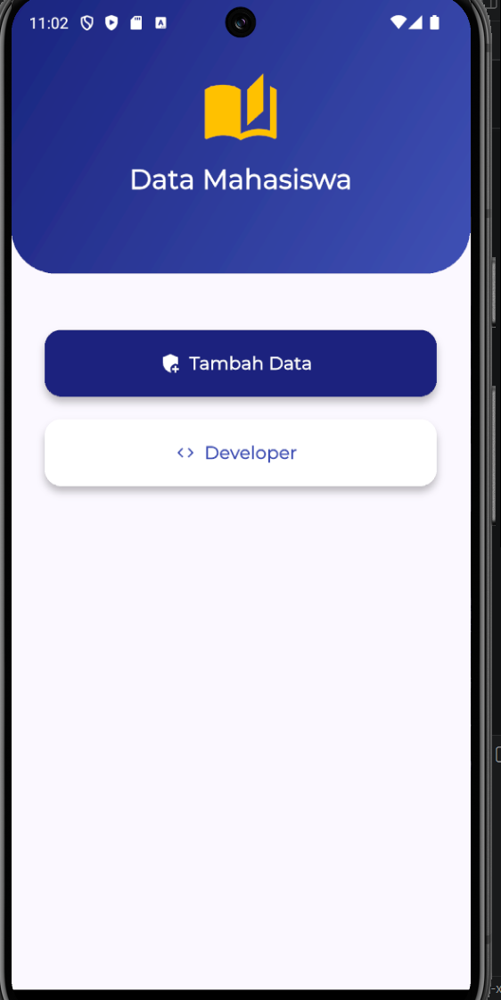
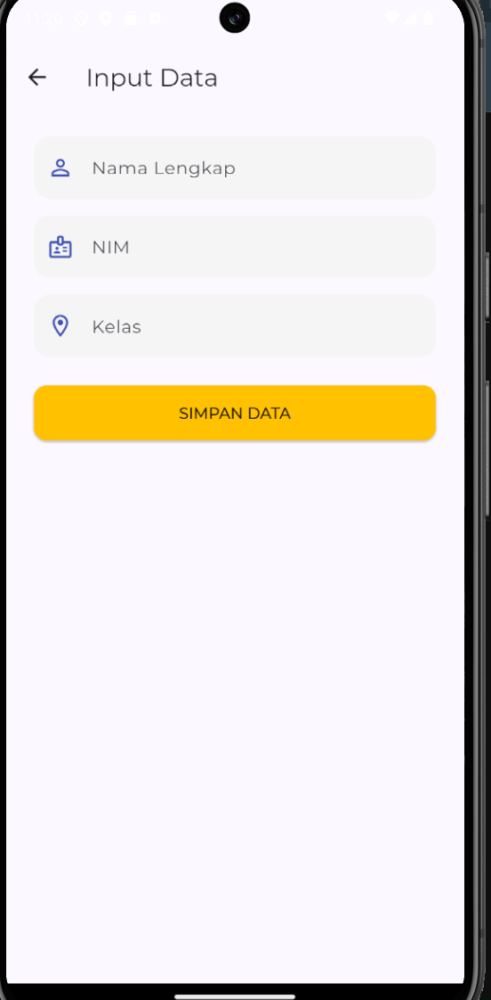
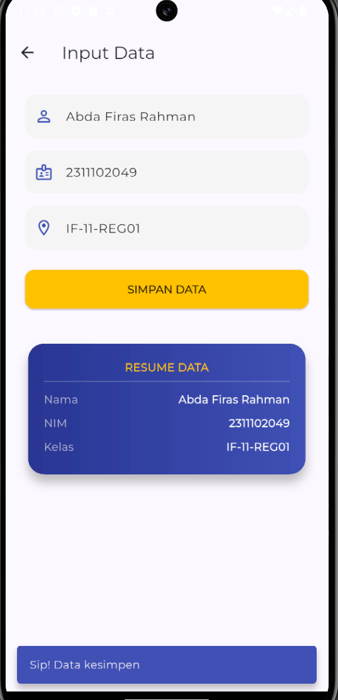
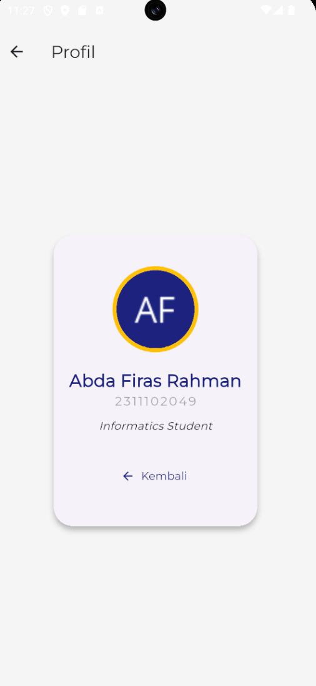

<div align="center">
  <br />

  <h1>LAPORAN PRAKTIKUM <br>
  APLIKASI BERBASIS PLATFORM
  </h1>

  <br />

  <h3>Modul 7 Flutter</h3>
DATA MAHASISWA (NAVIGATOR & FORM)
  <br>
  
  </h3>

  <br />

  <p align="center">

</p>

  <br />
  <br />
  <br />

  <h3>Disusun Oleh :</h3>

  <p>
    <strong>Abda Firas Rahman</strong><br>
    <strong>2311102049</strong><br>
    <strong>S1 IF-11-REG01</strong>
  </p>

  <br />

  <h3>Dosen Pengampu :</h3>

  <p>
    <strong>Dimas Fanny Hebrasianto Permadi, S.ST., M.Kom</strong>
  </p>
  
  <br />
  <br />
    <h4>Asisten Praktikum :</h4>
    <strong>Apri Pandu Wicaksono </strong> <br>
    <strong>Rangga Pradarrell Fathi</strong>
  <br />

  <h3>LABORATORIUM HIGH PERFORMANCE
 <br>FAKULTAS INFORMATIKA <br>UNIVERSITAS TELKOM PURWOKERTO <br>2026</h3>
</div>

<hr>

### Dasar Teori
1. Stateless & StatefulWidget: Dalam Flutter, semua elemen antarmuka disebut Widget. StatelessWidget digunakan untuk tampilan statis yang tidak berubah (seperti label teks atau ikon). Sedangkan StatefulWidget digunakan untuk tampilan dinamis yang bisa berubah saat ada interaksi (seperti form input), menggunakan fungsi setState().

2. Navigasi (Navigator): Perpindahan halaman di Flutter menggunakan sistem tumpukan (stack). Navigator.push berfungsi menumpuk/membuka halaman baru, sedangkan Navigator.pop berfungsi membuang tumpukan teratas untuk kembali ke halaman sebelumnya.

3. Google Fonts: Merupakan package tambahan yang memungkinkan kita menggunakan berbagai jenis huruf (tipografi) secara langsung dari internet, tanpa perlu mengunduh dan memasukkan file font secara manual ke dalam proyek.

4. SnackBar: Elemen antarmuka berbentuk pesan pop-up kecil yang muncul sementara di bagian bawah layar. Komponen ini berfungsi memberikan notifikasi atau umpan balik singkat kepada pengguna, seperti peringatan "Data berhasil disimpan".

### Main.dart
```dart
import 'package:flutter/material.dart';
import 'package:google_fonts/google_fonts.dart';
import 'pages/home_page.dart';

void main() => runApp(const MyApp());

class MyApp extends StatelessWidget {
  const MyApp({super.key});

  @override
  Widget build(BuildContext context) {
    return MaterialApp(
      debugShowCheckedModeBanner: false,
      title: 'Aplikasi Mahasiswa',
      theme: ThemeData(
        useMaterial3: true,
        textTheme: GoogleFonts.montserratTextTheme(),
        colorScheme: ColorScheme.fromSeed(
          seedColor: const Color(0xFF1A237E), 
          primary: const Color(0xFF1A237E),
          secondary: Colors.amber,
        ),
      ),
      home: const HomePage(),
    );
  }
}
```
File main.dart bertindak sebagai titik awal (entry point) berjalannya aplikasi. Di dalamnya, widget MaterialApp diaplikasikan untuk mengatur konfigurasi dasar secara global. Pada bagian ini juga dilakukan setting tema warna dasar dan penerapan package Google Fonts supaya tampilan antarmuka aplikasinya tetap konsisten dan rapi di semua halaman.

### pages/home_page.dart
```dart
import 'package:flutter/material.dart';
import 'form_page.dart';
import 'profil_page.dart';

class HomePage extends StatelessWidget {
  const HomePage({super.key});

  @override
  Widget build(BuildContext context) {
    return Scaffold(
      body: Column(
        children: [
          Container(
            height: 250,
            width: double.infinity,
            decoration: const BoxDecoration(
              gradient: LinearGradient(
                colors: [Color(0xFF1A237E), Color(0xFF3F51B5)],
                begin: Alignment.topLeft,
                end: Alignment.bottomRight,
              ),
              borderRadius: BorderRadius.only(
                bottomLeft: Radius.circular(40),
                bottomRight: Radius.circular(40),
              ),
            ),
            child: const Column(
              mainAxisAlignment: MainAxisAlignment.center,
              children: [
                Icon(Icons.auto_stories, size: 70, color: Colors.amber),
                SizedBox(height: 10),
                Text(
                  "Data Mahasiswa",
                  style: TextStyle(color: Colors.white, fontSize: 24, fontWeight: FontWeight.bold),
                ),
              ],
            ),
          ),
          const SizedBox(height: 50),
          // Menu Buttons
          Padding(
            padding: const EdgeInsets.symmetric(horizontal: 30),
            child: Column(
              children: [
                _buildMenuButton(
                  context, 
                  label: "Tambah Data", 
                  icon: Icons.add_moderator,
                  page: const FormMahasiswaPage(),
                  isPrimary: true
                ),
                const SizedBox(height: 20),
                _buildMenuButton(
                  context, 
                  label: "Developer", 
                  icon: Icons.code,
                  page: const ProfilDeveloperPage(),
                  isPrimary: false
                ),
              ],
            ),
          ),
        ],
      ),
    );
  }

  Widget _buildMenuButton(BuildContext context, {required String label, required IconData icon, required Widget page, required bool isPrimary}) {
    return SizedBox(
      width: double.infinity,
      height: 60,
      child: ElevatedButton.icon(
        onPressed: () => Navigator.push(context, MaterialPageRoute(builder: (context) => page)),
        icon: Icon(icon, color: isPrimary ? Colors.white : Colors.indigo),
        label: Text(label, style: const TextStyle(fontSize: 16, fontWeight: FontWeight.w600)),
        style: ElevatedButton.styleFrom(
          backgroundColor: isPrimary ? const Color(0xFF1A237E) : Colors.white,
          foregroundColor: isPrimary ? Colors.white : Colors.indigo,
          shape: RoundedRectangleBorder(borderRadius: BorderRadius.circular(15)),
          elevation: 5,
        ),
      ),
    );
  }
}
```
File home_page.dart dibangun menggunakan StatelessWidget karena halamannya bersifat statis dan sekadar berfungsi sebagai menu utama. Kode di dalamnya berfokus pada penyusunan tata letak (layout) dan pembuatan tombol menu. Tombol-tombol tersebut secara aktif memanfaatkan fungsi Navigator.push untuk mengarahkan atau memindahkan pengguna dari beranda ke halaman form maupun profil.

### pages/form_page.dart
```dart
import 'package:flutter/material.dart';

class FormMahasiswaPage extends StatefulWidget {
  const FormMahasiswaPage({super.key});

  @override
  State<FormMahasiswaPage> createState() => _FormMahasiswaPageState();
}

class _FormMahasiswaPageState extends State<FormMahasiswaPage> {
  final _nama = TextEditingController();
  final _nim = TextEditingController();
  final _kelas = TextEditingController();

  String n = "", ni = "", k = "";
  bool terpampang = false;

  void prosesSimpan() {
    if (_nama.text.isEmpty || _nim.text.isEmpty) return;
    
    setState(() {
      n = _nama.text;
      ni = _nim.text;
      k = _kelas.text;
      terpampang = true;
    });

    ScaffoldMessenger.of(context).showSnackBar(
      const SnackBar(
        content: Text('Sip! Data kesimpen'),
        backgroundColor: Colors.indigo,
        behavior: SnackBarBehavior.floating,
      ),
    );
  }

  @override
  Widget build(BuildContext context) {
    return Scaffold(
      appBar: AppBar(title: const Text("Input Data"), backgroundColor: Colors.transparent),
      body: SingleChildScrollView(
        padding: const EdgeInsets.all(25),
        child: Column(
          children: [
            _customInput(controller: _nama, hint: "Nama Lengkap", icon: Icons.person_outline),
            const SizedBox(height: 15),
            _customInput(controller: _nim, hint: "NIM", icon: Icons.badge_outlined, isNum: true),
            const SizedBox(height: 15),
            _customInput(controller: _kelas, hint: "Kelas", icon: Icons.room_outlined),
            const SizedBox(height: 25),
            
            SizedBox(
              width: double.infinity,
              height: 50,
              child: ElevatedButton(
                onPressed: prosesSimpan,
                style: ElevatedButton.styleFrom(
                  backgroundColor: Colors.amber,
                  foregroundColor: Colors.black87,
                  shape: RoundedRectangleBorder(borderRadius: BorderRadius.circular(12)),
                ),
                child: const Text("SIMPAN DATA", style: TextStyle(fontWeight: FontWeight.bold)),
              ),
            ),
            
            const SizedBox(height: 40),
            
            if (terpampang)
              Card(
                elevation: 10,
                shape: RoundedRectangleBorder(borderRadius: BorderRadius.circular(20)),
                child: Container(
                  padding: const EdgeInsets.all(20),
                  decoration: BoxDecoration(
                    borderRadius: BorderRadius.circular(20),
                    gradient: LinearGradient(colors: [Colors.indigo.shade800, Colors.indigo.shade500]),
                  ),
                  child: Column(
                    children: [
                      const Text("RESUME DATA", style: TextStyle(color: Colors.amber, fontWeight: FontWeight.bold)),
                      const Divider(color: Colors.white24),
                      _rowHasil("Nama", n),
                      _rowHasil("NIM", ni),
                      _rowHasil("Kelas", k),
                    ],
                  ),
                ),
              )
          ],
        ),
      ),
    );
  }

  Widget _customInput({required TextEditingController controller, required String hint, required IconData icon, bool isNum = false}) {
    return TextField(
      controller: controller,
      keyboardType: isNum ? TextInputType.number : TextInputType.text,
      decoration: InputDecoration(
        prefixIcon: Icon(icon, color: Colors.indigo),
        hintText: hint,
        filled: true,
        fillColor: Colors.grey.shade100,
        border: OutlineInputBorder(borderRadius: BorderRadius.circular(15), borderSide: BorderSide.none),
      ),
    );
  }

  Widget _rowHasil(String label, String value) {
    return Padding(
      padding: const EdgeInsets.symmetric(vertical: 5),
      child: Row(
        mainAxisAlignment: MainAxisAlignment.spaceBetween,
        children: [
          Text(label, style: const TextStyle(color: Colors.white70)),
          Text(value, style: const TextStyle(color: Colors.white, fontWeight: FontWeight.bold)),
        ],
      ),
    );
  }
}
```
File form_page.dart wajib menggunakan StatefulWidget karena harus merespons interaksi pengguna dan menangani perubahan data secara langsung. Melalui pemanggilan setState(), kode ini bertugas menangkap teks yang diketik di dalam text field, lalu menampilkannya sebagai ringkasan ke layar. Pada file ini juga diimplementasikan SnackBar untuk memunculkan pesan notifikasi berhasil secara otomatis sesaat setelah tombol simpan ditekan.

### pages/profil_page.dart
```dart
import 'package:flutter/material.dart';

class ProfilDeveloperPage extends StatelessWidget {
  const ProfilDeveloperPage({super.key});

  @override
  Widget build(BuildContext context) {
    return Scaffold(
      backgroundColor: Colors.grey.shade100,
      appBar: AppBar(title: const Text("Profil"), backgroundColor: Colors.transparent),
      body: Center(
        child: Padding(
          padding: const EdgeInsets.all(30.0),
          child: Card(
            elevation: 5,
            shape: RoundedRectangleBorder(borderRadius: BorderRadius.circular(25)),
            child: Padding(
              padding: const EdgeInsets.symmetric(vertical: 40, horizontal: 20),
              child: Column(
                mainAxisSize: MainAxisSize.min,
                children: [
                  const CircleAvatar(
                    radius: 55,
                    backgroundColor: Colors.amber,
                    child: CircleAvatar(
                      radius: 50,
                      backgroundImage: NetworkImage('https://ui-avatars.com/api/?name=Abda+Firas&background=1A237E&color=fff'),
                    ),
                  ),
                  const SizedBox(height: 20),
                  const Text(
                    "Abda Firas Rahman",
                    style: TextStyle(fontSize: 22, fontWeight: FontWeight.bold, color: Color(0xFF1A237E)),
                  ),
                  const Text(
                    "2311102049",
                    style: TextStyle(fontSize: 16, color: Colors.grey, letterSpacing: 2),
                  ),
                  const SizedBox(height: 10),
                  const Text(
                    "Informatics Student",
                    style: TextStyle(fontStyle: FontStyle.italic),
                  ),
                  const SizedBox(height: 30),
                  TextButton.icon(
                    onPressed: () => Navigator.pop(context),
                    icon: const Icon(Icons.arrow_back),
                    label: const Text("Kembali"),
                  )
                ],
              ),
            ),
          ),
        ),
      ),
    );
  }
}
```
File profil_page.dart kembali menggunakan StatelessWidget karena hanya berfungsi untuk menampilkan informasi identitas secara statis. Kodenya difokuskan untuk menampilkan elemen visual berupa foto, nama, dan NIM di dalam sebuah tata letak yang bersih. Selain itu, terdapat sebuah tombol kembali yang disisipkan fungsi Navigator.pop untuk menutup halaman tersebut dan mengembalikan pengguna ke layar sebelumnya.

## Tampilan
## Tampilan home


## Form input mahasiswa


## Form input mahasiswa (berhasil menambahkan data)


## Profile


