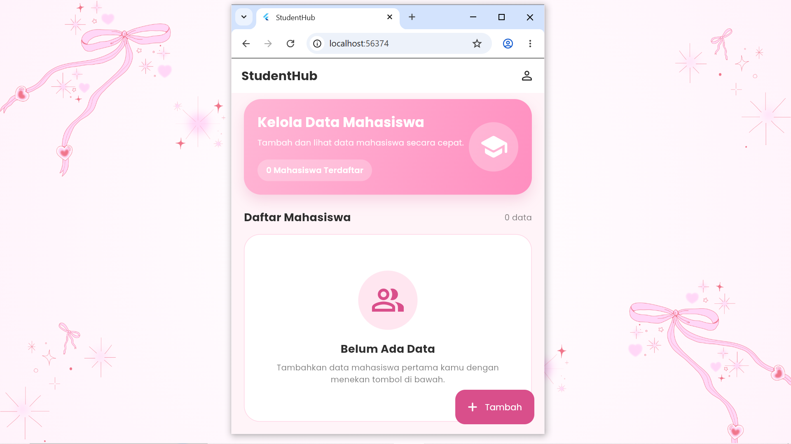
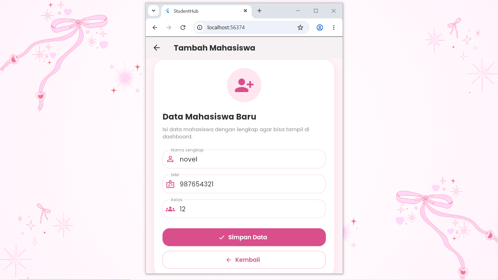
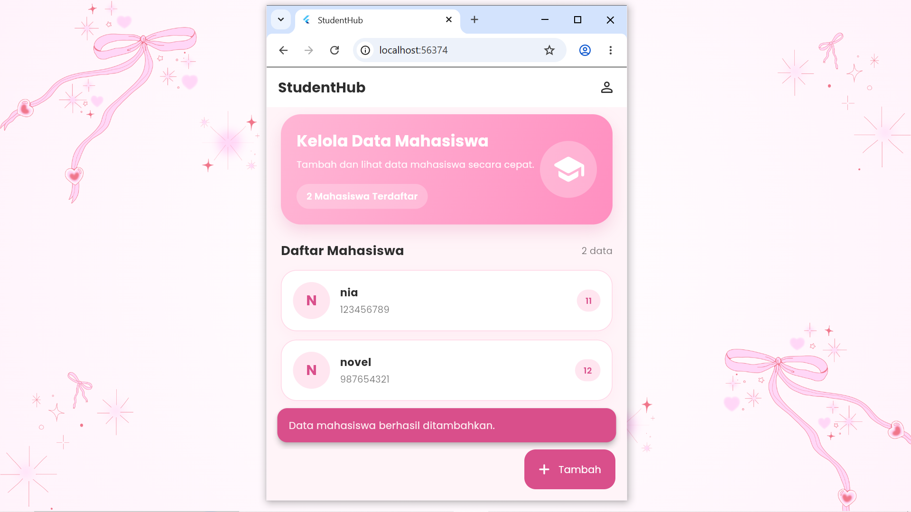
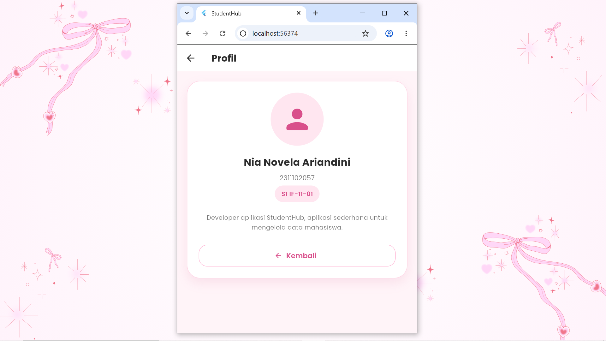

<div align="center">
  <br />

  <h1>
    LAPORAN PRAKTIKUM <br>
    APLIKASI BERBASIS PLATFORM
  </h1>

  <br />

  <h3>Modul 7 Mobile</h3>
  <h3>DATA MAHASISWA</h3>

  <br />

  <p align="center">
    
  </p>

  <br />
  <br />
  <br />

  <h3>Disusun Oleh :</h3>

  <p>
    <strong>Nia Novela Ariandini</strong><br>
    <strong>2311102057</strong><br>
    <strong>S1 IF-11-01</strong>
  </p>

  <br />

  <h3>Dosen Pengampu :</h3>

  <p>
    <strong>Dimas Fanny Hebrasianto Permadi, S.ST., M.Kom</strong>
  </p>
  
  <br />
  <br />

  <h4>Asisten Praktikum :</h4>

  <strong>Apri Pandu Wicaksono</strong><br>
  <strong>Rangga Pradarrell Fathi</strong>

  <br />
  <br />

  <h3>
    LABORATORIUM HIGH PERFORMANCE
    <br>FAKULTAS INFORMATIKA
    <br>UNIVERSITAS TELKOM PURWOKERTO
    <br>2026
  </h3>
</div>

<hr>

## Dasar Teori

Flutter merupakan framework yang digunakan untuk membuat aplikasi multiplatform seperti Android, iOS, web, dan desktop hanya dengan satu basis kode. Dalam Flutter, tampilan aplikasi dibangun menggunakan widget. Setiap bagian aplikasi seperti teks, tombol, form input, ikon, layout, dan halaman dibuat dengan menyusun widget-widget yang tersedia.

Pada praktikum Modul 7 ini, aplikasi yang dibuat adalah aplikasi sederhana bertema **Data Mahasiswa** dengan nama **StudentHub**. Aplikasi ini memiliki tiga halaman utama, yaitu halaman dashboard, halaman tambah mahasiswa, dan halaman profil developer. Aplikasi dibuat dengan tampilan clean dan estetik menggunakan tema warna pink soft serta font Poppins agar terlihat lebih modern.

Widget `MaterialApp` digunakan sebagai struktur utama aplikasi. Widget ini berfungsi untuk mengatur judul aplikasi, tema, font, warna, dan halaman pertama yang akan ditampilkan. Pada aplikasi ini, `MaterialApp` juga digunakan untuk menghilangkan tulisan debug di pojok kanan atas dengan properti `debugShowCheckedModeBanner: false`.

Widget `Scaffold` digunakan sebagai kerangka dasar pada setiap halaman aplikasi. Di dalam `Scaffold`, terdapat beberapa bagian seperti `AppBar`, `body`, dan `FloatingActionButton`. `AppBar` digunakan sebagai bagian header halaman, `body` digunakan untuk menampilkan isi utama aplikasi, sedangkan `FloatingActionButton` digunakan sebagai tombol cepat untuk menambahkan data mahasiswa baru.

Aplikasi ini menggunakan `StatelessWidget` dan `StatefulWidget`. `StatelessWidget` digunakan pada bagian yang tidak membutuhkan perubahan data secara langsung, seperti `MyApp` dan halaman profil developer. Sedangkan `StatefulWidget` digunakan pada halaman dashboard dan halaman form mahasiswa karena terdapat data yang dapat berubah, yaitu daftar mahasiswa yang ditambahkan oleh pengguna.

Navigasi antarhalaman dilakukan menggunakan `Navigator.push` dan `Navigator.pop`. `Navigator.push` digunakan untuk berpindah dari dashboard ke halaman tambah mahasiswa atau halaman profil developer. Sedangkan `Navigator.pop` digunakan untuk kembali ke halaman sebelumnya.

Pada halaman form mahasiswa, digunakan widget `TextField` untuk menerima input dari pengguna. Form tersebut berisi tiga input, yaitu nama lengkap, NIM, dan kelas. Untuk mengambil nilai dari input tersebut, digunakan `TextEditingController`. Setelah pengguna menekan tombol simpan, data akan diproses dan ditambahkan ke daftar mahasiswa yang tampil pada dashboard.

Aplikasi ini juga menggunakan `SnackBar` sebagai notifikasi. SnackBar akan muncul ketika data mahasiswa berhasil ditambahkan atau ketika pengguna belum mengisi semua data. Dengan adanya SnackBar, pengguna dapat mengetahui apakah proses input data berhasil atau masih terdapat data yang belum lengkap.

Package `google_fonts` digunakan untuk menerapkan font Poppins pada aplikasi. Font ini dipilih agar tampilan aplikasi lebih rapi, modern, dan nyaman dilihat. Selain itu, aplikasi juga menggunakan beberapa widget tambahan seperti `Container`, `Column`, `Row`, `Expanded`, `ListView.separated`, `ElevatedButton`, `OutlinedButton`, `Icon`, dan `CircleAvatar` untuk membuat tampilan aplikasi menjadi lebih tertata.

## Code Program

```dart
import 'package:flutter/material.dart';
import 'package:google_fonts/google_fonts.dart';

void main() {
  runApp(const MyApp());
}

class Mahasiswa {
  final String nama;
  final String nim;
  final String kelas;

  Mahasiswa({required this.nama, required this.nim, required this.kelas});
}

class MyApp extends StatelessWidget {
  const MyApp({super.key});

  static const Color softPink = Color(0xFFFFB6D5);
  static const Color lightPink = Color(0xFFFFF4F8);
  static const Color darkPink = Color(0xFFD94F8B);
  static const Color textDark = Color(0xFF2D2D2D);

  @override
  Widget build(BuildContext context) {
    return MaterialApp(
      title: 'StudentHub',
      debugShowCheckedModeBanner: false,
      theme: ThemeData(
        scaffoldBackgroundColor: lightPink,
        textTheme: GoogleFonts.poppinsTextTheme(),
        colorScheme: ColorScheme.fromSeed(
          seedColor: softPink,
          primary: darkPink,
        ),
        appBarTheme: AppBarTheme(
          backgroundColor: Colors.white,
          elevation: 0,
          centerTitle: false,
          iconTheme: const IconThemeData(color: textDark),
          titleTextStyle: GoogleFonts.poppins(
            fontSize: 20,
            fontWeight: FontWeight.w700,
            color: textDark,
          ),
        ),
        inputDecorationTheme: InputDecorationTheme(
          filled: true,
          fillColor: Colors.white,
          labelStyle: GoogleFonts.poppins(color: Colors.black54, fontSize: 14),
          prefixIconColor: darkPink,
          contentPadding: const EdgeInsets.symmetric(
            horizontal: 18,
            vertical: 16,
          ),
          enabledBorder: OutlineInputBorder(
            borderRadius: BorderRadius.circular(18),
            borderSide: const BorderSide(color: Color(0xFFFFD6E6)),
          ),
          focusedBorder: OutlineInputBorder(
            borderRadius: BorderRadius.circular(18),
            borderSide: const BorderSide(color: darkPink, width: 1.8),
          ),
        ),
        elevatedButtonTheme: ElevatedButtonThemeData(
          style: ElevatedButton.styleFrom(
            backgroundColor: darkPink,
            foregroundColor: Colors.white,
            minimumSize: const Size(double.infinity, 54),
            elevation: 0,
            shape: RoundedRectangleBorder(
              borderRadius: BorderRadius.circular(18),
            ),
            textStyle: GoogleFonts.poppins(
              fontSize: 15,
              fontWeight: FontWeight.w600,
            ),
          ),
        ),
        useMaterial3: true,
      ),
      home: const DashboardPage(),
    );
  }
}

class DashboardPage extends StatefulWidget {
  const DashboardPage({super.key});

  @override
  State<DashboardPage> createState() => _DashboardPageState();
}

class _DashboardPageState extends State<DashboardPage> {
  final List<Mahasiswa> daftarMahasiswa = [];

  void tambahMahasiswa(Mahasiswa mahasiswa) {
    setState(() {
      daftarMahasiswa.add(mahasiswa);
    });
  }

  @override
  Widget build(BuildContext context) {
    const Color softPink = Color(0xFFFFB6D5);
    const Color lightPink = Color(0xFFFFF4F8);
    const Color darkPink = Color(0xFFD94F8B);
    const Color textDark = Color(0xFF2D2D2D);

    return Scaffold(
      backgroundColor: lightPink,
      appBar: AppBar(
        title: const Text('StudentHub'),
        actions: [
          IconButton(
            tooltip: 'Profil Developer',
            onPressed: () {
              Navigator.push(
                context,
                MaterialPageRoute(
                  builder: (context) => const ProfilDeveloperPage(),
                ),
              );
            },
            icon: const Icon(Icons.person_outline_rounded),
          ),
          const SizedBox(width: 8),
        ],
      ),
      body: SafeArea(
        child: Padding(
          padding: const EdgeInsets.fromLTRB(20, 10, 20, 20),
          child: Column(
            crossAxisAlignment: CrossAxisAlignment.start,
            children: [
              Container(
                width: double.infinity,
                padding: const EdgeInsets.all(22),
                decoration: BoxDecoration(
                  gradient: const LinearGradient(
                    colors: [Color(0xFFFFB6D5), Color(0xFFFF8FC0)],
                    begin: Alignment.topLeft,
                    end: Alignment.bottomRight,
                  ),
                  borderRadius: BorderRadius.circular(28),
                  boxShadow: [
                    BoxShadow(
                      color: darkPink.withOpacity(0.20),
                      blurRadius: 18,
                      offset: const Offset(0, 10),
                    ),
                  ],
                ),
                child: Row(
                  children: [
                    Expanded(
                      child: Column(
                        crossAxisAlignment: CrossAxisAlignment.start,
                        children: [
                          Text(
                            'Kelola Data Mahasiswa',
                            style: GoogleFonts.poppins(
                              fontSize: 22,
                              fontWeight: FontWeight.w700,
                              color: Colors.white,
                            ),
                          ),
                          const SizedBox(height: 8),
                          Text(
                            'Tambah dan lihat data mahasiswa secara cepat.',
                            style: GoogleFonts.poppins(
                              fontSize: 13,
                              color: Colors.white.withOpacity(0.9),
                            ),
                          ),
                          const SizedBox(height: 18),
                          Container(
                            padding: const EdgeInsets.symmetric(
                              horizontal: 14,
                              vertical: 8,
                            ),
                            decoration: BoxDecoration(
                              color: Colors.white.withOpacity(0.25),
                              borderRadius: BorderRadius.circular(30),
                            ),
                            child: Text(
                              '${daftarMahasiswa.length} Mahasiswa Terdaftar',
                              style: GoogleFonts.poppins(
                                fontSize: 13,
                                fontWeight: FontWeight.w600,
                                color: Colors.white,
                              ),
                            ),
                          ),
                        ],
                      ),
                    ),
                    Container(
                      padding: const EdgeInsets.all(16),
                      decoration: BoxDecoration(
                        color: Colors.white.withOpacity(0.28),
                        shape: BoxShape.circle,
                      ),
                      child: const Icon(
                        Icons.school_rounded,
                        color: Colors.white,
                        size: 48,
                      ),
                    ),
                  ],
                ),
              ),
              const SizedBox(height: 24),
              Row(
                children: [
                  Text(
                    'Daftar Mahasiswa',
                    style: GoogleFonts.poppins(
                      fontSize: 18,
                      fontWeight: FontWeight.w700,
                      color: textDark,
                    ),
                  ),
                  const Spacer(),
                  Text(
                    '${daftarMahasiswa.length} data',
                    style: GoogleFonts.poppins(
                      fontSize: 13,
                      color: Colors.black54,
                    ),
                  ),
                ],
              ),
              const SizedBox(height: 14),
              Expanded(
                child: daftarMahasiswa.isEmpty
                    ? Container(
                        width: double.infinity,
                        padding: const EdgeInsets.all(24),
                        decoration: BoxDecoration(
                          color: Colors.white,
                          borderRadius: BorderRadius.circular(26),
                          border: Border.all(color: const Color(0xFFFFD6E6)),
                        ),
                        child: Column(
                          mainAxisAlignment: MainAxisAlignment.center,
                          children: [
                            Container(
                              padding: const EdgeInsets.all(20),
                              decoration: const BoxDecoration(
                                color: Color(0xFFFFE6F0),
                                shape: BoxShape.circle,
                              ),
                              child: const Icon(
                                Icons.people_alt_outlined,
                                size: 56,
                                color: darkPink,
                              ),
                            ),
                            const SizedBox(height: 18),
                            Text(
                              'Belum Ada Data',
                              style: GoogleFonts.poppins(
                                fontSize: 18,
                                fontWeight: FontWeight.w700,
                                color: textDark,
                              ),
                            ),
                            const SizedBox(height: 8),
                            Text(
                              'Tambahkan data mahasiswa pertama kamu dengan menekan tombol di bawah.',
                              textAlign: TextAlign.center,
                              style: GoogleFonts.poppins(
                                fontSize: 13,
                                color: Colors.black54,
                              ),
                            ),
                          ],
                        ),
                      )
                    : ListView.separated(
                        itemCount: daftarMahasiswa.length,
                        separatorBuilder: (context, index) =>
                            const SizedBox(height: 12),
                        itemBuilder: (context, index) {
                          final mahasiswa = daftarMahasiswa[index];

                          return Container(
                            padding: const EdgeInsets.all(16),
                            decoration: BoxDecoration(
                              color: Colors.white,
                              borderRadius: BorderRadius.circular(22),
                              border: Border.all(
                                color: const Color(0xFFFFD6E6),
                              ),
                              boxShadow: [
                                BoxShadow(
                                  color: softPink.withOpacity(0.12),
                                  blurRadius: 12,
                                  offset: const Offset(0, 6),
                                ),
                              ],
                            ),
                            child: Row(
                              children: [
                                Container(
                                  width: 52,
                                  height: 52,
                                  decoration: const BoxDecoration(
                                    color: Color(0xFFFFE6F0),
                                    shape: BoxShape.circle,
                                  ),
                                  child: Center(
                                    child: Text(
                                      mahasiswa.nama.isNotEmpty
                                          ? mahasiswa.nama[0].toUpperCase()
                                          : '?',
                                      style: GoogleFonts.poppins(
                                        fontSize: 20,
                                        fontWeight: FontWeight.w700,
                                        color: darkPink,
                                      ),
                                    ),
                                  ),
                                ),
                                const SizedBox(width: 14),
                                Expanded(
                                  child: Column(
                                    crossAxisAlignment:
                                        CrossAxisAlignment.start,
                                    children: [
                                      Text(
                                        mahasiswa.nama,
                                        style: GoogleFonts.poppins(
                                          fontSize: 15,
                                          fontWeight: FontWeight.w700,
                                          color: textDark,
                                        ),
                                      ),
                                      const SizedBox(height: 4),
                                      Text(
                                        mahasiswa.nim,
                                        style: GoogleFonts.poppins(
                                          fontSize: 13,
                                          color: Colors.black54,
                                        ),
                                      ),
                                    ],
                                  ),
                                ),
                                Container(
                                  padding: const EdgeInsets.symmetric(
                                    horizontal: 12,
                                    vertical: 7,
                                  ),
                                  decoration: BoxDecoration(
                                    color: const Color(0xFFFFE6F0),
                                    borderRadius: BorderRadius.circular(30),
                                  ),
                                  child: Text(
                                    mahasiswa.kelas,
                                    style: GoogleFonts.poppins(
                                      fontSize: 12,
                                      fontWeight: FontWeight.w600,
                                      color: darkPink,
                                    ),
                                  ),
                                ),
                              ],
                            ),
                          );
                        },
                      ),
              ),
            ],
          ),
        ),
      ),
      floatingActionButton: FloatingActionButton.extended(
        backgroundColor: darkPink,
        foregroundColor: Colors.white,
        elevation: 0,
        onPressed: () {
          Navigator.push(
            context,
            MaterialPageRoute(
              builder: (context) =>
                  FormMahasiswaPage(onSimpan: tambahMahasiswa),
            ),
          );
        },
        icon: const Icon(Icons.add_rounded),
        label: const Text('Tambah'),
      ),
    );
  }
}

class FormMahasiswaPage extends StatefulWidget {
  final Function(Mahasiswa) onSimpan;

  const FormMahasiswaPage({super.key, required this.onSimpan});

  @override
  State<FormMahasiswaPage> createState() => _FormMahasiswaPageState();
}

class _FormMahasiswaPageState extends State<FormMahasiswaPage> {
  final TextEditingController namaController = TextEditingController();
  final TextEditingController nimController = TextEditingController();
  final TextEditingController kelasController = TextEditingController();

  void simpanData() {
    final String nama = namaController.text.trim();
    final String nim = nimController.text.trim();
    final String kelas = kelasController.text.trim();

    if (nama.isEmpty || nim.isEmpty || kelas.isEmpty) {
      ScaffoldMessenger.of(context).showSnackBar(
        SnackBar(
          content: Text(
            'Semua data harus diisi dulu ya.',
            style: GoogleFonts.poppins(),
          ),
          backgroundColor: Colors.redAccent,
          behavior: SnackBarBehavior.floating,
          shape: RoundedRectangleBorder(
            borderRadius: BorderRadius.circular(14),
          ),
        ),
      );
      return;
    }

    final mahasiswa = Mahasiswa(nama: nama, nim: nim, kelas: kelas);

    widget.onSimpan(mahasiswa);

    ScaffoldMessenger.of(context).showSnackBar(
      SnackBar(
        content: Text(
          'Data mahasiswa berhasil ditambahkan.',
          style: GoogleFonts.poppins(),
        ),
        backgroundColor: const Color(0xFFD94F8B),
        behavior: SnackBarBehavior.floating,
        shape: RoundedRectangleBorder(borderRadius: BorderRadius.circular(14)),
      ),
    );

    Future.delayed(const Duration(milliseconds: 800), () {
      if (mounted) {
        Navigator.pop(context);
      }
    });
  }

  @override
  void dispose() {
    namaController.dispose();
    nimController.dispose();
    kelasController.dispose();
    super.dispose();
  }

  @override
  Widget build(BuildContext context) {
    const Color lightPink = Color(0xFFFFF4F8);
    const Color darkPink = Color(0xFFD94F8B);
    const Color textDark = Color(0xFF2D2D2D);

    return Scaffold(
      backgroundColor: lightPink,
      appBar: AppBar(title: const Text('Tambah Mahasiswa')),
      body: SafeArea(
        child: SingleChildScrollView(
          padding: const EdgeInsets.all(20),
          child: Container(
            width: double.infinity,
            padding: const EdgeInsets.all(22),
            decoration: BoxDecoration(
              color: Colors.white,
              borderRadius: BorderRadius.circular(28),
              border: Border.all(color: const Color(0xFFFFD6E6)),
              boxShadow: [
                BoxShadow(
                  color: darkPink.withOpacity(0.12),
                  blurRadius: 18,
                  offset: const Offset(0, 10),
                ),
              ],
            ),
            child: Column(
              crossAxisAlignment: CrossAxisAlignment.start,
              children: [
                Center(
                  child: Container(
                    padding: const EdgeInsets.all(18),
                    decoration: const BoxDecoration(
                      color: Color(0xFFFFE6F0),
                      shape: BoxShape.circle,
                    ),
                    child: const Icon(
                      Icons.person_add_alt_1_rounded,
                      color: darkPink,
                      size: 52,
                    ),
                  ),
                ),
                const SizedBox(height: 22),
                Text(
                  'Data Mahasiswa Baru',
                  style: GoogleFonts.poppins(
                    fontSize: 21,
                    fontWeight: FontWeight.w700,
                    color: textDark,
                  ),
                ),
                const SizedBox(height: 8),
                Text(
                  'Isi data mahasiswa dengan lengkap agar bisa tampil di dashboard.',
                  style: GoogleFonts.poppins(
                    fontSize: 13,
                    color: Colors.black54,
                  ),
                ),
                const SizedBox(height: 24),
                TextField(
                  controller: namaController,
                  decoration: const InputDecoration(
                    labelText: 'Nama Lengkap',
                    prefixIcon: Icon(Icons.person_outline_rounded),
                  ),
                ),
                const SizedBox(height: 16),
                TextField(
                  controller: nimController,
                  keyboardType: TextInputType.number,
                  decoration: const InputDecoration(
                    labelText: 'NIM',
                    prefixIcon: Icon(Icons.badge_outlined),
                  ),
                ),
                const SizedBox(height: 16),
                TextField(
                  controller: kelasController,
                  decoration: const InputDecoration(
                    labelText: 'Kelas',
                    prefixIcon: Icon(Icons.groups_rounded),
                  ),
                ),
                const SizedBox(height: 26),
                ElevatedButton.icon(
                  onPressed: simpanData,
                  icon: const Icon(Icons.check_rounded),
                  label: const Text('Simpan Data'),
                ),
                const SizedBox(height: 12),
                OutlinedButton.icon(
                  style: OutlinedButton.styleFrom(
                    foregroundColor: darkPink,
                    minimumSize: const Size(double.infinity, 54),
                    side: const BorderSide(color: Color(0xFFFFB6D5)),
                    shape: RoundedRectangleBorder(
                      borderRadius: BorderRadius.circular(18),
                    ),
                    textStyle: GoogleFonts.poppins(
                      fontSize: 15,
                      fontWeight: FontWeight.w600,
                    ),
                  ),
                  onPressed: () {
                    Navigator.pop(context);
                  },
                  icon: const Icon(Icons.arrow_back_rounded),
                  label: const Text('Kembali'),
                ),
              ],
            ),
          ),
        ),
      ),
    );
  }
}

class ProfilDeveloperPage extends StatelessWidget {
  const ProfilDeveloperPage({super.key});

  @override
  Widget build(BuildContext context) {
    const Color lightPink = Color(0xFFFFF4F8);
    const Color darkPink = Color(0xFFD94F8B);
    const Color textDark = Color(0xFF2D2D2D);

    return Scaffold(
      backgroundColor: lightPink,
      appBar: AppBar(title: const Text('Profil')),
      body: SafeArea(
        child: Padding(
          padding: const EdgeInsets.all(20),
          child: Container(
            width: double.infinity,
            padding: const EdgeInsets.all(24),
            decoration: BoxDecoration(
              color: Colors.white,
              borderRadius: BorderRadius.circular(28),
              border: Border.all(color: const Color(0xFFFFD6E6)),
              boxShadow: [
                BoxShadow(
                  color: darkPink.withOpacity(0.12),
                  blurRadius: 18,
                  offset: const Offset(0, 10),
                ),
              ],
            ),
            child: Column(
              mainAxisSize: MainAxisSize.min,
              children: [
                const CircleAvatar(
                  radius: 56,
                  backgroundColor: Color(0xFFFFE6F0),
                  child: Icon(Icons.person_rounded, color: darkPink, size: 68),
                ),
                const SizedBox(height: 20),
                Text(
                  'Nia Novela Ariandini',
                  textAlign: TextAlign.center,
                  style: GoogleFonts.poppins(
                    fontSize: 21,
                    fontWeight: FontWeight.w700,
                    color: textDark,
                  ),
                ),
                const SizedBox(height: 8),
                Text(
                  '2311102057',
                  style: GoogleFonts.poppins(
                    fontSize: 14,
                    color: Colors.black54,
                  ),
                ),
                const SizedBox(height: 6),
                Container(
                  padding: const EdgeInsets.symmetric(
                    horizontal: 14,
                    vertical: 8,
                  ),
                  decoration: BoxDecoration(
                    color: const Color(0xFFFFE6F0),
                    borderRadius: BorderRadius.circular(30),
                  ),
                  child: Text(
                    'S1 IF-11-01',
                    style: GoogleFonts.poppins(
                      fontSize: 13,
                      fontWeight: FontWeight.w600,
                      color: darkPink,
                    ),
                  ),
                ),
                const SizedBox(height: 22),
                Text(
                  'Developer aplikasi StudentHub, aplikasi sederhana untuk mengelola data mahasiswa.',
                  textAlign: TextAlign.center,
                  style: GoogleFonts.poppins(
                    fontSize: 13,
                    color: Colors.black54,
                    height: 1.6,
                  ),
                ),
                const SizedBox(height: 26),
                OutlinedButton.icon(
                  style: OutlinedButton.styleFrom(
                    foregroundColor: darkPink,
                    minimumSize: const Size(double.infinity, 54),
                    side: const BorderSide(color: Color(0xFFFFB6D5)),
                    shape: RoundedRectangleBorder(
                      borderRadius: BorderRadius.circular(18),
                    ),
                    textStyle: GoogleFonts.poppins(
                      fontSize: 15,
                      fontWeight: FontWeight.w600,
                    ),
                  ),
                  onPressed: () {
                    Navigator.pop(context);
                  },
                  icon: const Icon(Icons.arrow_back_rounded),
                  label: const Text('Kembali'),
                ),
              ],
            ),
          ),
        ),
      ),
    );
  }
}
```

## Penjelasan Program

Program Flutter ini diawali dengan melakukan import package `material.dart` dan `google_fonts.dart`. Package `material.dart` digunakan untuk memakai komponen Material Design seperti `MaterialApp`, `Scaffold`, `AppBar`, `TextField`, `ElevatedButton`, `SnackBar`, dan beberapa widget lainnya. Sedangkan package `google_fonts.dart` digunakan agar aplikasi dapat memakai font Poppins, sehingga tampilan aplikasi terlihat lebih modern dan rapi.

Fungsi `main()` merupakan fungsi utama yang pertama kali dijalankan saat aplikasi dibuka. Di dalam fungsi tersebut terdapat `runApp(const MyApp());` yang berfungsi untuk menjalankan widget utama aplikasi, yaitu `MyApp`.

Pada program ini terdapat class `Mahasiswa` yang digunakan sebagai model data. Class ini memiliki tiga atribut, yaitu `nama`, `nim`, dan `kelas`. Data dari class ini nantinya digunakan untuk menyimpan input mahasiswa yang dimasukkan oleh pengguna melalui halaman form.

Class `MyApp` merupakan turunan dari `StatelessWidget`. Pada class ini, aplikasi menggunakan `MaterialApp` sebagai struktur utama. Di dalam `MaterialApp`, terdapat pengaturan title aplikasi dengan nama `StudentHub`, menghilangkan banner debug menggunakan `debugShowCheckedModeBanner: false`, dan pengaturan tema aplikasi menggunakan `ThemeData`.

Tema aplikasi dibuat menggunakan warna pink soft agar tampilan lebih menarik dan estetik. Pada bagian `ThemeData`, digunakan `GoogleFonts.poppinsTextTheme()` agar seluruh teks dalam aplikasi menggunakan font Poppins. Selain itu, terdapat pengaturan untuk `AppBarTheme`, `InputDecorationTheme`, dan `ElevatedButtonThemeData` agar tampilan header, input, dan tombol terlihat konsisten.

Halaman utama aplikasi adalah `DashboardPage`. Class ini menggunakan `StatefulWidget` karena data mahasiswa yang tampil di dashboard dapat berubah ketika pengguna menambahkan data baru. Di dalam `_DashboardPageState`, terdapat variabel `daftarMahasiswa` dengan tipe `List<Mahasiswa>` yang digunakan untuk menyimpan seluruh data mahasiswa yang sudah ditambahkan.

Method `tambahMahasiswa()` digunakan untuk menambahkan data mahasiswa baru ke dalam list `daftarMahasiswa`. Method ini menggunakan `setState()` agar tampilan dashboard langsung diperbarui ketika data baru berhasil ditambahkan. Dengan begitu, data mahasiswa yang diinput dari form dapat langsung tampil di halaman dashboard.

Pada halaman dashboard, tampilan dibuat menggunakan `Scaffold` dengan `AppBar` berjudul `StudentHub`. Pada bagian kanan `AppBar`, terdapat icon profil yang dapat ditekan untuk membuka halaman profil developer. Navigasi ke halaman profil dilakukan menggunakan `Navigator.push`.

Bagian utama dashboard menggunakan widget `Column` untuk menyusun komponen secara vertikal. Di bagian atas terdapat `Container` berbentuk card dengan warna gradasi pink. Card ini menampilkan judul “Kelola Data Mahasiswa”, deskripsi singkat, jumlah mahasiswa terdaftar, dan icon sekolah. Jumlah mahasiswa yang tampil pada card diambil dari panjang list `daftarMahasiswa`.

Di bawah card dashboard terdapat bagian daftar mahasiswa. Jika belum ada data yang ditambahkan, maka aplikasi akan menampilkan tampilan kosong dengan teks “Belum Ada Data”. Namun, jika sudah ada data mahasiswa, maka data akan ditampilkan dalam bentuk list menggunakan `ListView.separated`. Penggunaan `ListView.separated` membuat setiap data mahasiswa memiliki jarak antar item sehingga tampilan lebih rapi.

Setiap item mahasiswa ditampilkan dalam bentuk card menggunakan `Container`. Di dalam card terdapat huruf awal nama mahasiswa, nama lengkap, NIM, dan kelas. Kelas ditampilkan dalam bentuk label kecil agar tampilannya lebih clean dan mudah dibaca.

Pada bagian bawah kanan dashboard terdapat `FloatingActionButton.extended` dengan teks “Tambah”. Tombol ini digunakan untuk berpindah ke halaman tambah mahasiswa. Ketika tombol ditekan, aplikasi akan menjalankan `Navigator.push` menuju halaman `FormMahasiswaPage`.

Class `FormMahasiswaPage` merupakan halaman untuk mengisi data mahasiswa. Halaman ini menggunakan `StatefulWidget` karena terdapat input yang dikontrol menggunakan `TextEditingController`. Terdapat tiga controller, yaitu `namaController`, `nimController`, dan `kelasController`, yang masing-masing digunakan untuk mengambil nilai dari input nama, NIM, dan kelas.

Pada method `simpanData()`, program mengambil nilai dari setiap `TextField` menggunakan properti `.text.trim()`. Penggunaan `trim()` bertujuan untuk menghapus spasi kosong di awal dan akhir input. Setelah itu, program melakukan validasi sederhana. Jika salah satu input masih kosong, maka akan muncul `SnackBar` dengan pesan bahwa semua data harus diisi terlebih dahulu.

Jika semua data sudah lengkap, maka program akan membuat object baru dari class `Mahasiswa` yang berisi nama, NIM, dan kelas. Setelah itu, data dikirim kembali ke dashboard melalui `widget.onSimpan(mahasiswa)`. Dengan cara ini, data yang dimasukkan pada halaman form dapat masuk ke list mahasiswa di dashboard.

Setelah data berhasil disimpan, aplikasi akan menampilkan `SnackBar` dengan pesan “Data mahasiswa berhasil ditambahkan.” SnackBar ini berfungsi sebagai notifikasi bahwa proses penyimpanan berhasil dilakukan. Setelah beberapa saat, halaman form akan otomatis kembali ke dashboard menggunakan `Navigator.pop`.

Pada halaman form juga terdapat tombol `OutlinedButton` dengan teks “Kembali”. Tombol ini digunakan untuk kembali ke halaman dashboard tanpa menyimpan data. Proses kembali halaman dilakukan menggunakan `Navigator.pop`.

Class `ProfilDeveloperPage` digunakan untuk menampilkan profil developer aplikasi. Halaman ini menggunakan `StatelessWidget` karena tidak ada data yang berubah. Pada halaman profil, ditampilkan nama, NIM, kelas, dan deskripsi singkat mengenai aplikasi StudentHub. Tampilan profil dibuat menggunakan `Container`, `CircleAvatar`, `Icon`, dan `OutlinedButton` agar terlihat rapi dan konsisten dengan tema aplikasi.

Secara keseluruhan, aplikasi ini sudah menerapkan beberapa ketentuan pada praktikum, yaitu penggunaan `StatefulWidget`, `StatelessWidget`, `Navigator.push`, `Navigator.pop`, package Google Fonts, `AppBar`, `Container`, `Column`, `ElevatedButton`, `Icon`, serta tema warna yang menarik. Selain itu, aplikasi juga dapat menampilkan data mahasiswa yang diinput ke halaman dashboard dan memberikan notifikasi menggunakan `SnackBar`.

## Tampilan

### 1. Tampilan Dashboard Ketika Belum Ada Data



### 2. Tampilan Form Tambah Mahasiswa



### 3. Tampilan Dashboard Setelah Data Ditambahkan



### 4. Tampilan Profil Developer



## Kesimpulan

Berdasarkan praktikum yang telah dilakukan, dapat disimpulkan bahwa Flutter dapat digunakan untuk membuat aplikasi sederhana dengan beberapa halaman yang saling terhubung. Pada aplikasi StudentHub, pengguna dapat berpindah dari dashboard ke halaman form mahasiswa dan halaman profil developer menggunakan `Navigator.push`, serta kembali ke halaman sebelumnya menggunakan `Navigator.pop`.

Aplikasi ini menggunakan `StatefulWidget` pada halaman dashboard dan form mahasiswa karena terdapat data yang dapat berubah, yaitu daftar mahasiswa yang ditambahkan oleh pengguna. Perubahan data dilakukan menggunakan `setState()`, sehingga tampilan dashboard dapat langsung diperbarui ketika data baru berhasil disimpan.

Form mahasiswa dibuat menggunakan `TextField` dan `TextEditingController` untuk mengambil input berupa nama, NIM, dan kelas. Setelah tombol simpan ditekan, data akan divalidasi terlebih dahulu. Jika data masih kosong, aplikasi akan menampilkan notifikasi gagal menggunakan `SnackBar`. Jika data sudah lengkap, aplikasi akan menampilkan notifikasi berhasil dan data mahasiswa akan muncul di dashboard.

Selain memenuhi fungsi utama, aplikasi ini juga dibuat dengan tampilan clean dan estetik menggunakan tema warna pink soft serta font Poppins dari package `google_fonts`. Dari praktikum ini, dapat dipahami bahwa penggunaan widget seperti `MaterialApp`, `Scaffold`, `AppBar`, `Container`, `Column`, `TextField`, `ElevatedButton`, `FloatingActionButton`, `SnackBar`, dan `ListView` sangat penting dalam membangun aplikasi Flutter yang interaktif dan nyaman digunakan.