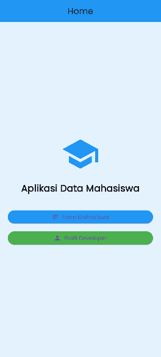
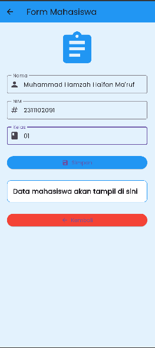
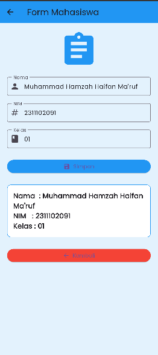
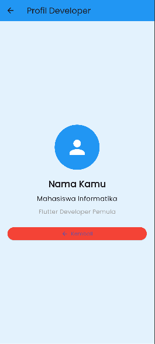

<div align="center">
  <br />
  <h1>LAPORAN PRAKTIKUM <br>APLIKASI BERBASIS PLATFORM</h1>
  <br />
  <h3>Modul 7 Mobile<br> Data Mahasiswa</h3>
  <br />
   
  <br />
  <br />
  <br />
  <h3>Disusun Oleh :</h3>
  <p>
    <strong>Muhammad Hamzah Haifan Ma'ruf</strong><br>
    <strong>2311102091</strong><br>
    <strong>S1 IF-11-REG01</strong>
  </p>
  <br />
  <br />
  <h3>Dosen Pengampu :</h3>
  <p>
    <strong>Dimas Fanny Hebrasianto Permadi, S.ST., M.Kom</strong>
  </p>
  <br />
  <br />
    <h4>Asisten Praktikum :</h4>
    <strong> Apri Pandu Wicaksono </strong> <br>
    <strong>Rangga Pradarrell Fathi</strong>
  <br />
  <h3>LABORATORIUM HIGH PERFORMANCE
 <br>FAKULTAS INFORMATIKA <br>UNIVERSITAS TELKOM PURWOKERTO <br>2026</h3>
</div>

---

# DASAR TEORI

### Flutter

Flutter merupakan framework open-source yang dikembangkan oleh Google untuk membuat aplikasi mobile, web, dan desktop menggunakan satu codebase. Flutter menggunakan bahasa pemrograman Dart dan menyediakan berbagai widget untuk membangun antarmuka aplikasi yang modern dan responsif.

### StatefulWidget

StatefulWidget adalah widget yang dapat berubah tampilannya ketika terjadi perubahan data atau state pada aplikasi. StatefulWidget digunakan pada halaman form karena data yang ditampilkan dapat berubah ketika pengguna menginput data.

### StatelessWidget

StatelessWidget adalah widget yang tampilannya bersifat tetap dan tidak berubah selama aplikasi berjalan. Widget ini digunakan pada halaman Home dan Profil Developer.

### Navigator

Navigator digunakan untuk berpindah halaman pada aplikasi Flutter. Navigator.push digunakan untuk membuka halaman baru sedangkan Navigator.pop digunakan untuk kembali ke halaman sebelumnya.

### SnackBar

SnackBar adalah widget yang digunakan untuk menampilkan notifikasi singkat pada bagian bawah aplikasi. Pada praktikum ini SnackBar digunakan untuk menampilkan pesan bahwa data berhasil disimpan.

### Google Fonts

Google Fonts digunakan untuk menambahkan jenis font eksternal agar tampilan aplikasi menjadi lebih menarik.

---

# PENJELASAN CODE

### main.dart

File main.dart merupakan file utama yang menjalankan aplikasi Flutter.

```dart
void main() {
  runApp(const MyApp());
}
```

Kode di atas digunakan untuk menjalankan widget utama yaitu MyApp.

Pada file ini juga digunakan ThemeData dan Google Fonts untuk mengatur tema dan font aplikasi.

```dart
theme: ThemeData(
  primarySwatch: Colors.blue,
  textTheme: GoogleFonts.poppinsTextTheme(),
),
```

---

### home_page.dart

Halaman Home menggunakan StatelessWidget karena tampilannya tidak berubah.

Pada halaman ini terdapat:
- AppBar
- Icon
- Container
- Column
- ElevatedButton

Navigator.push digunakan untuk berpindah halaman.

```dart
Navigator.push(
  context,
  MaterialPageRoute(
    builder: (context) => const FormPage(),
  ),
);
```

Tombol pertama digunakan untuk menuju halaman Form Mahasiswa dan tombol kedua menuju halaman Profil Developer.

---

### form_page.dart

Halaman Form Mahasiswa menggunakan StatefulWidget karena data dapat berubah ketika pengguna menginput data.

TextEditingController digunakan untuk mengambil input dari TextField.

```dart
final TextEditingController namaController =
    TextEditingController();
```

setState digunakan untuk memperbarui tampilan data mahasiswa.

```dart
setState(() {
  hasilData =
      "Nama : ${namaController.text}\n"
      "NIM : ${nimController.text}\n"
      "Kelas : ${kelasController.text}";
});
```

SnackBar digunakan sebagai notifikasi berhasil menyimpan data.

```dart
ScaffoldMessenger.of(context).showSnackBar(
  const SnackBar(
    content: Text("Data berhasil disimpan!"),
  ),
);
```

Navigator.pop digunakan untuk kembali ke halaman sebelumnya.

```dart
Navigator.pop(context);
```

---

### profile_page.dart

Halaman Profil Developer menggunakan StatelessWidget karena hanya menampilkan informasi tetap.

Pada halaman ini digunakan:
- CircleAvatar
- Text
- ElevatedButton
- Navigator.pop

Halaman ini berfungsi untuk menampilkan identitas developer aplikasi.

---

# HASIL TAMPILAN

### 1. Home Page

Pada halaman Home terdapat:
- Judul aplikasi
- Icon sekolah
- Tombol Form Mahasiswa
- Tombol Profil Developer

### 2. Form Mahasiswa


Pada halaman Form Mahasiswa terdapat:
- Input Nama
- Input NIM
- Input Kelas
- Tombol Simpan
- Tombol Kembali

### 3. Hasil Penyimpanan Data


Ketika tombol Simpan ditekan:
- Data mahasiswa ditampilkan pada layar
- SnackBar muncul dengan pesan “Data berhasil disimpan”

### 4. Profil Developer


Halaman Profil Developer menampilkan:
- Foto/Icon profil
- Nama developer
- Status mahasiswa
- Tombol kembali

---

# KESIMPULAN

Berdasarkan praktikum yang telah dilakukan, aplikasi Data Mahasiswa berhasil dibuat menggunakan Flutter. Aplikasi dapat berpindah halaman menggunakan Navigator, menerima input data mahasiswa menggunakan TextField, serta menampilkan notifikasi SnackBar ketika data berhasil disimpan.

Praktikum ini membantu memahami penggunaan StatefulWidget, StatelessWidget, Navigator, SnackBar, dan Google Fonts dalam pengembangan aplikasi Flutter sederhana.
