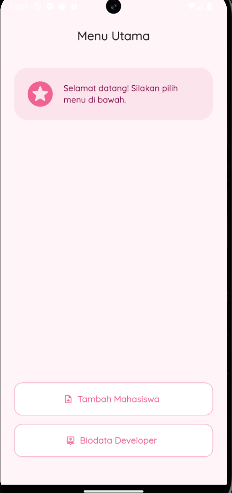
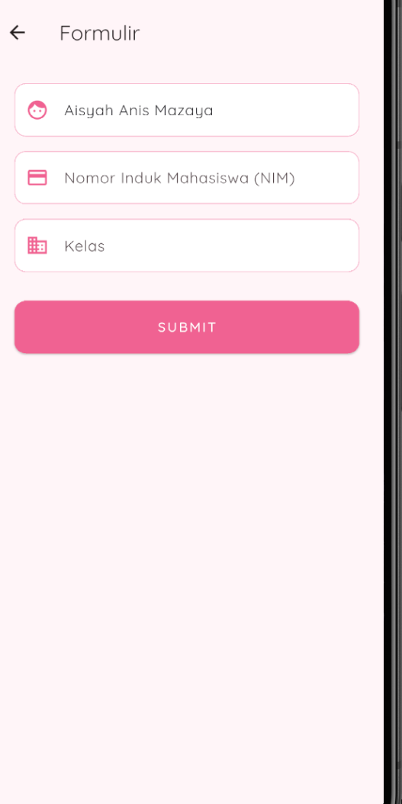
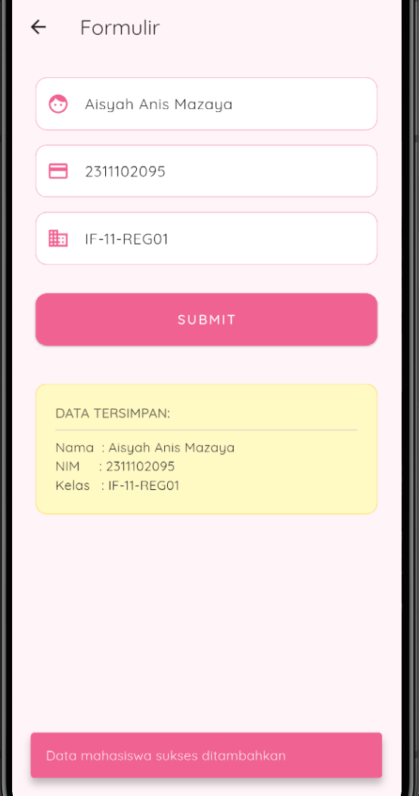
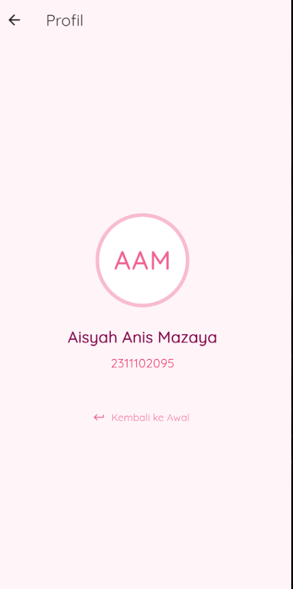

<div align="center">
  <br />

  <h1>LAPORAN PRAKTIKUM <br>
  APLIKASI BERBASIS PLATFORM
  </h1>

  <br />

  <h3>Modul 7 Flutter</h3>
DATA MAHASISWA (NAVIGATOR & FORM)
  <br>
  
  </h3>

  <br />

  <p align="center">

</p>

  <br />
  <br />
  <br />

  <h3>Disusun Oleh :</h3>

  <p>
    <strong>Aisyah Anis Mazaya</strong><br>
    <strong>2311102095</strong><br>
    <strong>S1 IF-11-REG01</strong>
  </p>

  <br />

  <h3>Dosen Pengampu :</h3>

  <p>
    <strong>Dimas Fanny Hebrasianto Permadi, S.ST., M.Kom</strong>
  </p>
  
  <br />
  <br />
    <h4>Asisten Praktikum :</h4>
    <strong>Apri Pandu Wicaksono </strong> <br>
    <strong>Rangga Pradarrell Fathi</strong>
  <br />

  <h3>LABORATORIUM HIGH PERFORMANCE
 <br>FAKULTAS INFORMATIKA <br>UNIVERSITAS TELKOM PURWOKERTO <br>2026</h3>
</div>

<hr>

### Dasar Teori
1. Tinjauan Umum Flutter
Flutter didefinisikan sebagai Software Development Kit (SDK) lintas platform yang dikembangkan oleh Google dengan menggunakan bahasa pemrograman Dart. Pembuatan antarmuka (User Interface) pada Flutter sangat bergantung pada arsitektur deklaratif, di mana seluruh komponen visual dan tata letak diperlakukan sebagai sebuah entitas independen yang disebut widget.

2. Manajemen Status (State): Stateless vs Stateful Widget
Dalam pengembangan Flutter, widget diklasifikasikan berdasarkan kemampuannya dalam mengelola status (state). StatelessWidget bersifat immutable atau tidak dapat diubah setelah proses render pertama kali selesai, sehingga difungsikan khusus untuk antarmuka yang konstan. Sebaliknya, StatefulWidget bersifat mutable, memungkinkannya untuk melakukan pembaruan antarmuka secara langsung (melalui pemanggilan setState) ketika terjadi manipulasi data, seperti pada aktivitas pengisian formulir.

3. Mekanisme Routing (Navigasi)
Pengaturan transisi halaman diimplementasikan melalui mekanisme routing yang beroperasi dengan prinsip struktur data stack (tumpukan). Instruksi Navigator.push() dieksekusi untuk menyisipkan rute halaman baru ke posisi paling atas stack. Sebagai kebalikannya, instruksi Navigator.pop() difungsikan untuk membuang rute teratas tersebut, yang secara otomatis mengembalikan visibilitas ke layar sebelumnya.

4. Pengambilan Data (TextField) dan Validasi
Komponen TextField diintegrasikan sebagai media utama untuk menangkap masukan teks dari interaksi pengguna. Sebagai praktik standar, masukan tersebut perlu melewati tahap validasi dasar—misalnya dengan mendeteksi kondisi kosong melalui metode .isEmpty—guna mencegah masuknya data yang tidak valid sebelum diproses ke tahap penyimpanan.

5. Indikator Feedback (SnackBar)
SnackBar merupakan komponen visual yang beroperasi sebagai indikator respons sistem. Elemen ini muncul sementara di margin bawah layar untuk menyajikan informasi status operasi kepada pengguna, contohnya memberikan notifikasi keberhasilan pasca-pengiriman data formulir, tanpa menginterupsi aktivitas utama di layar.

6. Kustomisasi Tipografi (Google Fonts)
Paket google_fonts dimanfaatkan untuk memperkaya estetika antarmuka dengan berbagai opsi tipografi modern. Implementasi package ini mempermudah proses pemuatan jenis huruf secara dinamis dari jaringan, sehingga pengembang tidak perlu membebani kapasitas proyek dengan penyimpanan fail aset font lokal.

7. Anatomi Widget Pendukung
Konstruksi antarmuka aplikasi ini juga ditunjang oleh sejumlah komponen fundamental berikut:

AppBar: Bilah navigasi atas yang merepresentasikan tajuk atau identitas dari suatu halaman.

Container: Widget pembungkus serbaguna yang mengakomodasi manipulasi desain, meliputi pengaturan ruang (padding), pewarnaan latar, hingga efek radius tepi.

Column: Komponen tata letak (layout) berarah vertikal yang menyusun elemen-elemen di dalamnya dari atas ke bawah.

ElevatedButton: Objek tombol utama berdesain timbul (elevated) yang bertindak sebagai pemicu aksi operasional program.

Icon: Aset grafis berbasis vektor yang disisipkan untuk memperkuat konteks fungsional pada teks atau tombol.

Map & List: Struktur data berbasis memori yang dioperasikan untuk menampung dan mengindeks rekaman data mahasiswa secara temporal.

## TAMPILAN NYA
## Tampilan home


## Form input mahasiswa


## Form input mahasiswa yang berhasil


## Profile


### SOURCE CODE
### Main.dart
```dart
import 'package:flutter/material.dart';
import 'package:google_fonts/google_fonts.dart';
import 'screens/home_screen.dart';

void main() {
  runApp(const MyApp());
}

class MyApp extends StatelessWidget {
  const MyApp({super.key});

  @override
  Widget build(BuildContext context) {
    return MaterialApp(
      debugShowCheckedModeBanner: false,
      title: 'Tugas Praktikum M7',
      theme: ThemeData(
        useMaterial3: true,
        textTheme: GoogleFonts.quicksandTextTheme(),
        colorScheme: ColorScheme.fromSeed(
          seedColor: const Color(0xFFF8BBD0), 
          primary: const Color(0xFFF06292),
          secondary: const Color(0xFFFF80AB),
          surface: const Color(0xFFFFF5F8),
        ),
      ),
      home: const HomeScreen(),
    );
  }
}
```
Berkas main.dart berfungsi sebagai titik awal (entry point) dari eksekusi program melalui pemanggilan fungsi runApp. Pada berkas ini, struktur dasar aplikasi diinisialisasi menggunakan komponen MaterialApp. Tahap ini mencakup pengaturan tema warna global (color scheme) yang bernuansa merah muda pastel serta penerapan tipografi seragam menggunakan pustaka eksternal google_fonts. Setelah konfigurasi antarmuka dasar selesai, instruksi kode akan mengarahkan sistem untuk memuat halaman awal, yaitu HomeScreen.

### home_screen.dart
```dart
import 'package:flutter/material.dart';
import 'form_screen.dart';
import 'profil_screen.dart';

class HomeScreen extends StatelessWidget {
  const HomeScreen({super.key});

  @override
  Widget build(BuildContext context) {
    return Scaffold(
      appBar: AppBar(
        title: const Text('Menu Utama', style: TextStyle(fontWeight: FontWeight.bold)),
        centerTitle: true,
        backgroundColor: Colors.transparent,
      ),
      body: Padding(
        padding: const EdgeInsets.symmetric(horizontal: 25),
        child: Column(
          children: [
            const SizedBox(height: 30),
            // Header Card
            Container(
              padding: const EdgeInsets.all(20),
              decoration: BoxDecoration(
                color: const Color(0xFFFCE4EC),
                borderRadius: BorderRadius.circular(25),
              ),
              child: const Row(
                children: [
                  Icon(Icons.stars_rounded, size: 55, color: Color(0xFFF06292)),
                  SizedBox(width: 15),
                  Expanded(
                    child: Text(
                      "Selamat datang! Silakan pilih menu di bawah.",
                      style: TextStyle(fontSize: 15, color: Color(0xFF880E4F), fontWeight: FontWeight.w600),
                    ),
                  ),
                ],
              ),
            ),
            const Spacer(),
            // Menu buttons
            _buildNavButton(
              context, 
              title: "Tambah Mahasiswa", 
              icon: Icons.note_add_outlined, 
              targetScreen: const FormScreen()
            ),
            const SizedBox(height: 15),
            _buildNavButton(
              context, 
              title: "Biodata Developer", 
              icon: Icons.person_pin_outlined, 
              targetScreen: const ProfilScreen()
            ),
            const SizedBox(height: 50),
          ],
        ),
      ),
    );
  }

  Widget _buildNavButton(BuildContext context, {required String title, required IconData icon, required Widget targetScreen}) {
    return SizedBox(
      width: double.infinity,
      height: 60,
      child: ElevatedButton.icon(
        onPressed: () => Navigator.push(context, MaterialPageRoute(builder: (_) => targetScreen)),
        icon: Icon(icon),
        label: Text(title, style: const TextStyle(fontSize: 16, fontWeight: FontWeight.bold)),
        style: ElevatedButton.styleFrom(
          backgroundColor: Colors.white,
          foregroundColor: const Color(0xFFF06292),
          elevation: 0,
          side: const BorderSide(color: Color(0xFFF8BBD0), width: 1.5),
          shape: RoundedRectangleBorder(borderRadius: BorderRadius.circular(15)),
        ),
      ),
    );
  }
}
```
home_screen.dart berperan sebagai antarmuka menu utama yang direkayasa menggunakan StatelessWidget karena halaman ini bersifat statis dan tidak memerlukan pembaruan status data secara real-time. Konstruksi tata letaknya difokuskan pada penyajian kartu informasi interaktif dan penyusunan tombol navigasi. Setiap tombol operasional pada halaman ini disematkan fungsi Navigator.push yang bertugas untuk merespons ketukan pengguna dan mendorong rute layar baru menuju halaman formulir maupun halaman profil.

### form_screen.dart
```dart
import 'package:flutter/material.dart';

class FormScreen extends StatefulWidget {
  const FormScreen({super.key});

  @override
  State<FormScreen> createState() => _FormScreenState();
}

class _FormScreenState extends State<FormScreen> {
  // Variabel diubah total
  final inputNama = TextEditingController();
  final inputNim = TextEditingController();
  final inputKelas = TextEditingController();

  String hasilNama = "", hasilNim = "", hasilKelas = "";
  bool isSubmitted = false;

  void submitData() {
    if (inputNama.text.isEmpty) return;

    setState(() {
      hasilNama = inputNama.text;
      hasilNim = inputNim.text;
      hasilKelas = inputKelas.text;
      isSubmitted = true;
    });

    ScaffoldMessenger.of(context).showSnackBar(
      const SnackBar(
        content: Text("Data mahasiswa sukses ditambahkan"),
        backgroundColor: Color(0xFFF06292),
        behavior: SnackBarBehavior.floating,
        margin: EdgeInsets.all(20),
      ),
    );
  }

  @override
  Widget build(BuildContext context) {
    return Scaffold(
      appBar: AppBar(title: const Text("Formulir")),
      body: SingleChildScrollView(
        padding: const EdgeInsets.all(25),
        child: Column(
          children: [
            _buildTextField(controller: inputNama, label: "Nama Lengkap", icon: Icons.face),
            const SizedBox(height: 15),
            _buildTextField(controller: inputNim, label: "Nomor Induk Mahasiswa (NIM)", icon: Icons.credit_card, isNumber: true),
            const SizedBox(height: 15),
            _buildTextField(controller: inputKelas, label: "Kelas", icon: Icons.domain),
            const SizedBox(height: 30),
            
            SizedBox(
              width: double.infinity,
              height: 55,
              child: ElevatedButton(
                onPressed: submitData,
                style: ElevatedButton.styleFrom(
                  backgroundColor: const Color(0xFFF06292),
                  foregroundColor: Colors.white,
                  shape: RoundedRectangleBorder(borderRadius: BorderRadius.circular(12)),
                ),
                child: const Text("SUBMIT", style: TextStyle(letterSpacing: 2, fontWeight: FontWeight.bold)),
              ),
            ),
            
            const SizedBox(height: 40),

            if (isSubmitted)
              Container(
                width: double.infinity,
                padding: const EdgeInsets.all(20),
                decoration: BoxDecoration(
                  color: const Color(0xFFFFF9C4), 
                  borderRadius: BorderRadius.circular(12),
                  border: Border.all(color: Colors.amber.shade200),
                ),
                child: Column(
                  crossAxisAlignment: CrossAxisAlignment.start,
                  children: [
                    const Text("DATA TERSIMPAN:", style: TextStyle(fontWeight: FontWeight.bold, color: Colors.black54)),
                    const Divider(),
                    Text("Nama  : $hasilNama"),
                    Text("NIM     : $hasilNim"),
                    Text("Kelas   : $hasilKelas"),
                  ],
                ),
              )
          ],
        ),
      ),
    );
  }

  Widget _buildTextField({required TextEditingController controller, required String label, required IconData icon, bool isNumber = false}) {
    return TextField(
      controller: controller,
      keyboardType: isNumber ? TextInputType.number : TextInputType.text,
      decoration: InputDecoration(
        prefixIcon: Icon(icon, color: const Color(0xFFF06292)),
        hintText: label,
        filled: true,
        fillColor: Colors.white,
        border: OutlineInputBorder(borderRadius: BorderRadius.circular(12), borderSide: const BorderSide(color: Color(0xFFF8BBD0))),
        enabledBorder: OutlineInputBorder(borderRadius: BorderRadius.circular(12), borderSide: const BorderSide(color: Color(0xFFF8BBD0))),
      ),
    );
  }
}
```
File form_screen.dart dirancang secara spesifik menggunakan StatefulWidget guna mengakomodasi interaksi pengguna dalam mengisi data mahasiswa. Kode ini mengelola operasi input teks melalui widget TextField yang ditangkap oleh objek TextEditingController (seperti inputNama). Setelah proses validasi memastikan masukan tidak kosong, sistem akan memanggil fungsi setState() untuk memperbarui status antarmuka dan menampilkan rangkuman masukan tersebut secara instan ke layar. Bersamaan dengan proses tersebut, kode juga mengeksekusi pemunculan komponen SnackBar sebagai umpan balik visual bahwa data berhasil ditambahkan.

### profil_screen.dart
```dart
import 'package:flutter/material.dart';

class ProfilScreen extends StatelessWidget {
  const ProfilScreen({super.key});

  @override
  Widget build(BuildContext context) {
    return Scaffold(
      appBar: AppBar(title: const Text("Profil")),
      body: Center(
        child: Column(
          mainAxisAlignment: MainAxisAlignment.center,
          children: [
            const CircleAvatar(
              radius: 65,
              backgroundColor: Color(0xFFF8BBD0), 
              child: CircleAvatar(
                radius: 60,
                backgroundColor: Colors.white,
                // Widget Text untuk inisial
                child: Text(
                  "AAM",
                  style: TextStyle(
                    fontSize: 35, 
                    fontWeight: FontWeight.bold,
                    color: Color(0xFFF06292), 
                    letterSpacing: 2, 
                  ),
                ),
              ),
            ),
            const SizedBox(height: 25),
            const Text(
              "Aisyah Anis Mazaya",
              style: TextStyle(
                fontSize: 22, 
                fontWeight: FontWeight.bold, 
                color: Color(0xFF880E4F),
              ),
            ),
            const SizedBox(height: 8),
            const Text(
              "2311102095",
              style: TextStyle(
                fontSize: 17, 
                color: Colors.pink, 
                fontWeight: FontWeight.w500,
              ),
            ),
            const SizedBox(height: 40),
            TextButton.icon(
              onPressed: () => Navigator.pop(context),
              icon: const Icon(Icons.keyboard_return, color: Color(0xFFF06292)),
              label: const Text(
                "Kembali ke Awal", 
                style: TextStyle(color: Color(0xFFF06292)),
              ),
            ),
          ],
        ),
      ),
    );
  }
}
```
profil_screen.dart difungsikan sebagai halaman presentasi identitas profil yang kembali menerapkan struktur StatelessWidget. Kodenya diinstruksikan untuk menyusun elemen-elemen visual secara simetris di tengah layar, meliputi penyajian inisial huruf "AAM" di dalam komponen CircleAvatar, serta penulisan identitas nama dan nomor induk mahasiswa. Selain itu, halaman ini dilengkapi dengan tombol berjenis TextButton yang terintegrasi dengan fungsi Navigator.pop, di mana pemicuannya akan menarik layar dari tumpukan navigasi dan mengembalikan visibilitas pengguna ke menu utama.
