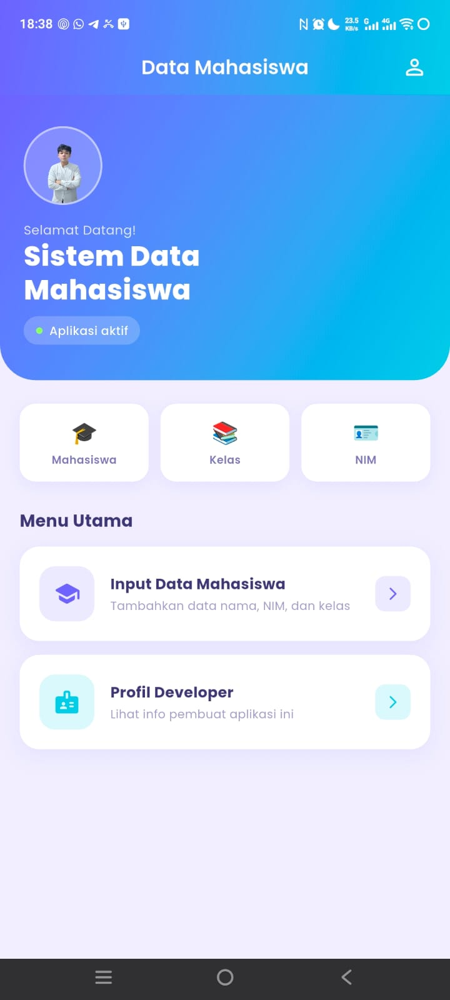
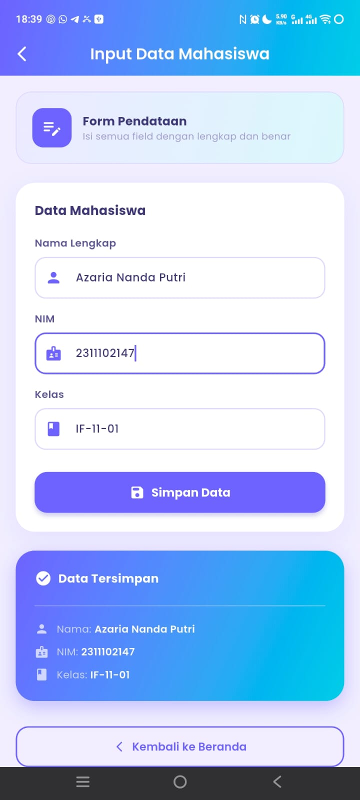

<div align="center">
  <br />
  <h1>LAPORAN PRAKTIKUM <br>APLIKASI BERBASIS PLATFORM</h1>
  <br />
  <h2>MODUL 7 FLUTTER </h2>
  <br /><br />

  

  <br /><br /><br />

  <h3>Disusun Oleh :</h3>

  <p>
    <strong>Rafaldo Al Maqdis</strong><br>
    <strong>2311102099</strong><br>
    <strong>S1 IF-11-REG 01</strong>
  </p>

  <br />

  <h3>Dosen Pengampu :</h3>

  <p>
    <strong>Dimas Fanny Hebrasianto Permadi, S.ST., M.Kom</strong>
  </p>

  <br /><br />

  <h4>Asisten Praktikum :</h4>

  <p>
    <strong>Apri Pandu Wicaksono</strong><br>
    <strong>Rangga Pradarrell Fathi</strong>
  </p>

  <br />

  <h2>
  LABORATORIUM HIGH PERFORMANCE <br>
  FAKULTAS INFORMATIKA <br>
  UNIVERSITAS TELKOM PURWOKERTO <br>
  2026
  </h2>
</div>

---


# 1. Pendahuluan

Flutter merupakan framework yang digunakan untuk membangun aplikasi multiplatform dengan satu basis kode. Dalam Flutter, tampilan aplikasi dibangun menggunakan widget. Setiap komponen antarmuka seperti teks, kolom input, tombol, warna, layout, dan halaman dibuat menggunakan widget yang saling disusun dalam bentuk *widget tree*.

Pada praktikum ini, fokus pembahasan adalah penggunaan **Font Custom (Google Fonts)**, **Form Input dengan TextEditingController**, **Navigasi dengan Navigator**, dan **State Management menggunakan StatefulWidget dan StatelessWidget** pada Flutter.

Aplikasi yang dibuat pada praktikum ini bernama **Aplikasi Data Mahasiswa **. Program menampilkan sistem manajemen data mahasiswa dengan tiga halaman utama:
1. **Home Page** - Halaman utama dengan menu navigasi yang modern
2. **Form Mahasiswa Page** - Halaman form input data dengan validasi lengkap
3. **Profile Page** - Halaman profil developer dengan informasi lengkap

Aplikasi menggunakan Material Design 3, Google Fonts Poppins, dan tema warna biru-ungu yang profesional dan modern di seluruh aplikasi.

---

# 2. Dasar Teori

## 2.1 Flutter

Flutter adalah framework UI open-source yang dikembangkan oleh Google untuk membangun aplikasi pada berbagai platform, seperti Android, iOS, web, dan desktop. Flutter menggunakan bahasa pemrograman Dart dan menerapkan konsep pengembangan berbasis widget.

Dalam Flutter, setiap tampilan dibentuk dari kumpulan widget. Widget tersebut dapat berupa struktur halaman, teks, kolom input, tombol, gambar, ikon, maupun layout. Susunan widget akan membentuk tampilan akhir yang dilihat oleh pengguna.

## 2.2 Dart

Dart adalah bahasa pemrograman yang digunakan pada Flutter. Dart mendukung konsep pemrograman berorientasi objek, sehingga aplikasi dapat disusun menggunakan class dan object.

Pada Flutter, program biasanya dimulai dari fungsi `main()`. Fungsi tersebut menjalankan aplikasi menggunakan `runApp()`. Widget yang dimasukkan ke dalam `runApp()` akan menjadi akar dari aplikasi Flutter.

## 2.3 Google Fonts

Google Fonts adalah library yang menyediakan ratusan font gratis untuk digunakan dalam aplikasi. Pada praktikum ini, font **Poppins** digunakan untuk memberikan tampilan modern dan profesional pada seluruh aplikasi.

```dart
import 'package:google_fonts/google_fonts.dart';

Text(
  'Contoh Teks',
  style: GoogleFonts.poppins(
    fontSize: 20,
    fontWeight: FontWeight.bold,
    color: Colors.deepPurple,
  ),
)
```

## 2.4 TextEditingController

`TextEditingController` adalah class yang digunakan untuk mengontrol widget `TextField`. Dengan controller ini, pengembang dapat mengambil nilai yang diinput pengguna, mengubah nilai, atau mendengarkan perubahan pada field input.

```dart
final TextEditingController _controller = TextEditingController();

@override
void dispose() {
  _controller.dispose();  // Penting untuk mencegah memory leak
  super.dispose();
}

// Mengambil nilai
String value = _controller.text;

// Menghapus isi
_controller.clear();
```

## 2.5 Form Validation

Validasi form adalah proses memastikan data yang diinput pengguna sesuai dengan kriteria yang ditentukan. Pada Flutter, validasi dapat dilakukan menggunakan `GlobalKey<FormState>()` dan `TextFormField`.

```dart
final _formKey = GlobalKey<FormState>();

Form(
  key: _formKey,
  child: TextFormField(
    validator: (value) {
      if (value == null || value.isEmpty) {
        return 'Field tidak boleh kosong';
      }
      return null;  // Valid
    },
  ),
)

// Trigger validasi
if (!_formKey.currentState!.validate()) return;
```

## 2.6 Navigator

`Navigator` adalah widget yang digunakan untuk mengelola riwayat halaman dalam aplikasi. Dengan Navigator, pengguna dapat berpindah antar halaman dan kembali ke halaman sebelumnya.

```dart
// Push halaman baru (tambah ke stack)
Navigator.push(
  context,
  MaterialPageRoute(builder: (_) => HalamanBaru()),
);

// Pop halaman (kembali ke halaman sebelumnya)
Navigator.pop(context);
```

## 2.7 StatefulWidget vs StatelessWidget

**StatelessWidget** adalah widget yang tidak berubah setelah dibuat. Widget ini cocok untuk menampilkan konten statis.

```dart
class MyStateless extends StatelessWidget {
  @override
  Widget build(BuildContext context) {
    return Text('Teks statis');
  }
}
```

**StatefulWidget** adalah widget yang dapat berubah state-nya selama aplikasi berjalan. Widget ini cocok untuk form, animasi, atau komponen yang dinamis.

```dart
class MyStateful extends StatefulWidget {
  @override
  State<MyStateful> createState() => _MyStatefulState();
}

class _MyStatefulState extends State<MyStateful> {
  String _data = 'initial';
  
  void _updateData() {
    setState(() {
      _data = 'updated';
    });
  }
  
  @override
  Widget build(BuildContext context) {
    return Text(_data);
  }
}
```

## 2.8 SnackBar

`SnackBar` adalah widget yang menampilkan notifikasi singkat pada bagian bawah layar. SnackBar digunakan untuk memberikan feedback kepada pengguna tentang aksi yang telah dilakukan.

```dart
ScaffoldMessenger.of(context).showSnackBar(
  SnackBar(
    content: Text('Data berhasil disimpan'),
    backgroundColor: Colors.green,
    duration: Duration(seconds: 3),
    behavior: SnackBarBehavior.floating,
  ),
);
```

## 2.9 InputDecoration

`InputDecoration` adalah properti yang digunakan untuk mengatur tampilan pada `TextField`. Dengan `InputDecoration`, pengembang dapat menambahkan `hintText`, label, ikon, border, warna, dan berbagai dekorasi lain.

```dart
TextField(
  decoration: InputDecoration(
    hintText: 'Masukkan nama',
    labelText: 'Nama Lengkap',
    prefixIcon: Icon(Icons.person),
    border: OutlineInputBorder(
      borderRadius: BorderRadius.circular(12),
    ),
  ),
)
```

## 2.10 Material Design 3

Material Design 3 adalah sistem desain terbaru dari Google yang menghadirkan tampilan modern, konsisten, dan responsif. Fitur utamanya termasuk:
- Color system yang fleksibel dengan `ColorScheme`
- Typography yang terukur
- Komponen UI yang dapat disesuaikan
- Dark mode support

---

# 3. Alat dan Bahan

Alat dan bahan yang digunakan pada praktikum ini adalah sebagai berikut.

1. Laptop atau komputer dengan spesifikasi minimal 4GB RAM
2. Sistem operasi Windows, macOS, atau Linux
3. Flutter SDK versi 3.0.0 atau lebih baru
4. Dart SDK (sudah included dalam Flutter)
5. Android Studio atau XCode (untuk emulator)
6. Visual Studio Code atau IDE favorit lainnya
7. Ekstensi Flutter dan Dart untuk IDE
8. Emulator Android atau perangkat Android fisik
9. Package `google_fonts: ^6.2.1`

---

# 4. Langkah-Langkah Praktikum

## 4.1 Membuat Proyek Flutter

Langkah pertama adalah membuat proyek Flutter baru menggunakan terminal.

```bash
flutter create flutter_mahasiswa
cd flutter_mahasiswa
```

## 4.2 Update pubspec.yaml

Edit file `pubspec.yaml` dan tambahkan dependency untuk Google Fonts.

```yaml
dependencies:
  flutter:
    sdk: flutter
  google_fonts: ^6.2.1
```

Kemudian jalankan:

```bash
flutter pub get
```

## 4.3 Membuat Struktur Folder

Buat folder `pages` di dalam `lib`:

```bash
mkdir lib/pages
```

Struktur akhir akan menjadi:

```
lib/
├── main.dart
└── pages/
    ├── home_page.dart
    ├── form_mahasiswa_page.dart
    └── profile_page.dart
```

## 4.4 Menulis main.dart

File ini berisi entry point aplikasi dan konfigurasi tema global dengan warna biru-ungu.

**Konten penting:**
- Import material dan google_fonts
- Setup MaterialApp dengan ThemeData
- Konfigurasi AppBar, ElevatedButton, TextField style dengan gradient biru-ungu
- Set home halaman ke HomePage

## 4.5 Menulis home_page.dart

Halaman pertama aplikasi yang menampilkan menu utama.

**Konten penting:**
- Buat StatelessWidget bernama HomePage
- Buat Scaffold dengan AppBar gradient biru-ungu
- Tambahkan hero banner dengan gradient dan ikon placeholder
- Buat stat chips untuk menampilkan kategori
- Buat menu card untuk navigasi dengan custom transition
- Implementasi _navigateToForm() dan _navigateToProfile()

## 4.6 Menulis form_mahasiswa_page.dart

Halaman form input data mahasiswa.

**Konten penting:**
- Buat StatefulWidget bernama FormMahasiswaPage
- Buat TextEditingController untuk nama, NIM, kelas
- Setup Form dengan GlobalKey untuk validasi
- Implementasi fungsi _simpanData() dengan validasi lengkap
- Tampilkan SnackBar dengan feedback sukses
- Tampilkan result card dengan gradient biru-ungu

## 4.7 Menulis profile_page.dart

Halaman profil developer.

**Konten penting:**
- Buat StatelessWidget bernama ProfilePage
- Setup data developer sebagai konstanta yang dapat diubah
- Buat hero section dengan avatar dan shadow
- Buat info card dengan layout row-based
- Buat description dan skills card
- Tampilkan hobi dalam bentuk chip collection

## 4.8 Menjalankan Aplikasi

```bash
flutter run
```

atau dengan device spesifik:

```bash
flutter run -d chrome     # Untuk web
flutter run -d emulator   # Untuk emulator
```

---

# 5. Source Code Lengkap

## 5.1 lib/main.dart

```dart
import 'package:flutter/material.dart';
import 'package:google_fonts/google_fonts.dart';
import 'pages/home_page.dart';

void main() {
  runApp(const MyApp());
}

class MyApp extends StatelessWidget {
  const MyApp({super.key});

  @override
  Widget build(BuildContext context) {
    return MaterialApp(
      title: 'Data Mahasiswa',
      debugShowCheckedModeBanner: false,
      theme: ThemeData(
        useMaterial3: true,
        colorScheme: ColorScheme.fromSeed(
          seedColor: const Color(0xFF6C63FF),
          primary: const Color(0xFF6C63FF),
          secondary: const Color(0xFF48CAE4),
          surface: const Color(0xFFF8F7FF),
          background: const Color(0xFFF0EEFF),
        ),
        textTheme: GoogleFonts.poppinsTextTheme(),
        scaffoldBackgroundColor: const Color(0xFFF0EEFF),
        appBarTheme: AppBarTheme(
          backgroundColor: const Color(0xFF6C63FF),
          foregroundColor: Colors.white,
          elevation: 0,
          centerTitle: true,
          titleTextStyle: GoogleFonts.poppins(
            fontSize: 20,
            fontWeight: FontWeight.w600,
            color: Colors.white,
          ),
        ),
        elevatedButtonTheme: ElevatedButtonThemeData(
          style: ElevatedButton.styleFrom(
            backgroundColor: const Color(0xFF6C63FF),
            foregroundColor: Colors.white,
            elevation: 4,
            shadowColor: const Color(0xFF6C63FF).withOpacity(0.4),
            shape: RoundedRectangleBorder(
              borderRadius: BorderRadius.circular(16),
            ),
            padding: const EdgeInsets.symmetric(vertical: 14, horizontal: 24),
            textStyle: GoogleFonts.poppins(
              fontSize: 15,
              fontWeight: FontWeight.w600,
            ),
          ),
        ),
        inputDecorationTheme: InputDecorationTheme(
          filled: true,
          fillColor: Colors.white,
          border: OutlineInputBorder(
            borderRadius: BorderRadius.circular(14),
            borderSide: BorderSide.none,
          ),
          enabledBorder: OutlineInputBorder(
            borderRadius: BorderRadius.circular(14),
            borderSide: const BorderSide(color: Color(0xFFDDD8FF), width: 1.5),
          ),
          focusedBorder: OutlineInputBorder(
            borderRadius: BorderRadius.circular(14),
            borderSide: const BorderSide(color: Color(0xFF6C63FF), width: 2),
          ),
          contentPadding: const EdgeInsets.symmetric(
            horizontal: 18,
            vertical: 16,
          ),
          labelStyle: GoogleFonts.poppins(
            color: const Color(0xFF9E99C8),
            fontSize: 14,
          ),
        ),
      ),
      home: const HomePage(),
    );
  }
}
```

## 5.2 lib/pages/home_page.dart

[Lihat file home_page.dart terpisah]

## 5.3 lib/pages/form_mahasiswa_page.dart

[Lihat file form_mahasiswa_page.dart terpisah]

## 5.4 lib/pages/profile_page.dart

[Lihat file profile_page.dart terpisah]

---

# 6. Hasil Praktikum

  
  
  

---

# 7. Pembahasan

Aplikasi ini mendemonstrasikan beberapa konsep penting dalam Flutter development:

## 7.1 State Management

Penggunaan `StatefulWidget` pada `FormMahasiswaPage` memungkinkan aplikasi untuk:
- Menyimpan state form input dengan kontrol penuh
- Menampilkan loading indicator saat proses penyimpanan
- Menampilkan hasil data yang tersimpan dalam bentuk visual yang menarik
- Melakukan validasi dinamis dengan pesan error yang informatif

Penggunaan `TextEditingController` memberikan:
- Kontrol penuh terhadap input field
- Kemampuan untuk mengambil nilai dengan mudah
- Proper cleanup dengan method `dispose()`

## 7.2 Navigation

Aplikasi menggunakan `Navigator.push()` untuk berpindah antar halaman dengan transisi custom:
- Slide transition dari kanan untuk form page
- Slide transition dari bawah untuk profile page
- Custom `PageRouteBuilder` untuk transisi yang smooth

Penggunaan `Navigator.pop()` memungkinkan navigasi kembali dengan mudah.

## 7.3 Form Validation

Validasi form dilakukan menggunakan:
- `GlobalKey<FormState>()` untuk mengelola state form secara terpusat
- `TextFormField` dengan fungsi `validator` yang custom
- Pesan error yang user-friendly dan informatif

Validasi mencegah penyimpanan data yang tidak valid dengan kriteria:
- Nama minimal 3 karakter
- NIM minimal 5 karakter
- Semua field harus diisi

## 7.4 Design System

Aplikasi menerapkan Material Design 3 dengan:
- Color scheme biru-ungu yang profesional dan modern
- Typography menggunakan Google Fonts Poppins untuk konsistensi
- Shadow dan rounded corner untuk kedalaman visual yang baik
- Gradient pada AppBar dan card untuk efek modern
- Responsive design yang adaptif


---

# 8. Kesimpulan

Berdasarkan praktikum yang telah dilakukan, dapat disimpulkan bahwa:

1. **Flutter** menyediakan widget yang komprehensif untuk membangun aplikasi multiplatform berkualitas
2. **Google Fonts** memudahkan implementasi tipografi custom yang profesional dan konsisten
3. **Form Validation** penting untuk memastikan data yang valid sebelum disimpan
4. **Navigator** memungkinkan navigasi yang smooth dan terstruktur antar halaman
5. **State Management** dengan `StatefulWidget` dan `TextEditingController` memberikan kontrol penuh terhadap data
6. **Material Design 3** menghasilkan tampilan yang konsisten, modern, dan professional
7. **SnackBar dan visual feedback** meningkatkan user experience secara signifikan

Aplikasi Data Mahasiswa (Versi Profesional) berhasil mendemonstrasikan best practice dalam Flutter development dengan implementasi yang clean, profesional, dan user-friendly. Semua konsep yang dipelajari dapat dikembangkan lebih lanjut untuk membangun aplikasi yang lebih kompleks dan feature-rich.

---


# Referensi

1. Flutter Documentation. (2024). *Flutter Official Documentation*. https://docs.flutter.dev/
2. Flutter Documentation. (2024). *Building user interfaces with Flutter*. https://docs.flutter.dev/ui
3. Flutter API Documentation. *Material App Class*. https://api.flutter.dev/flutter/material/MaterialApp-class.html
4. Flutter API Documentation. *TextEditingController Class*. https://api.flutter.dev/flutter/widgets/TextEditingController-class.html
5. Flutter API Documentation. *Form Class*. https://api.flutter.dev/flutter/widgets/Form-class.html
6. Flutter API Documentation. *Navigator Class*. https://api.flutter.dev/flutter/widgets/Navigator-class.html
7. Flutter API Documentation. *SnackBar Class*. https://api.flutter.dev/flutter/material/SnackBar-class.html
8. Google Fonts. (2024). *Google Fonts for Flutter*. https://pub.dev/packages/google_fonts
9. Dart Documentation. (2024). *Dart Official Documentation*. https://dart.dev/
10. Material Design. (2024). *Material Design 3*. https://m3.material.io/

---

<div align="center">


</div>