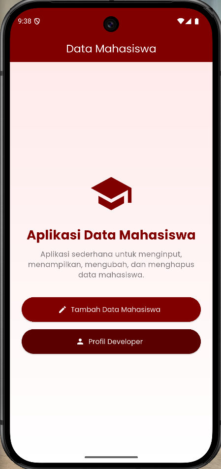
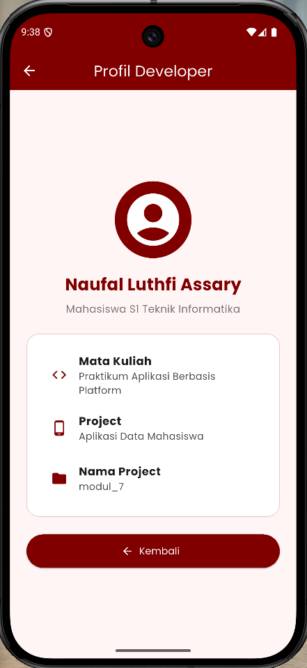
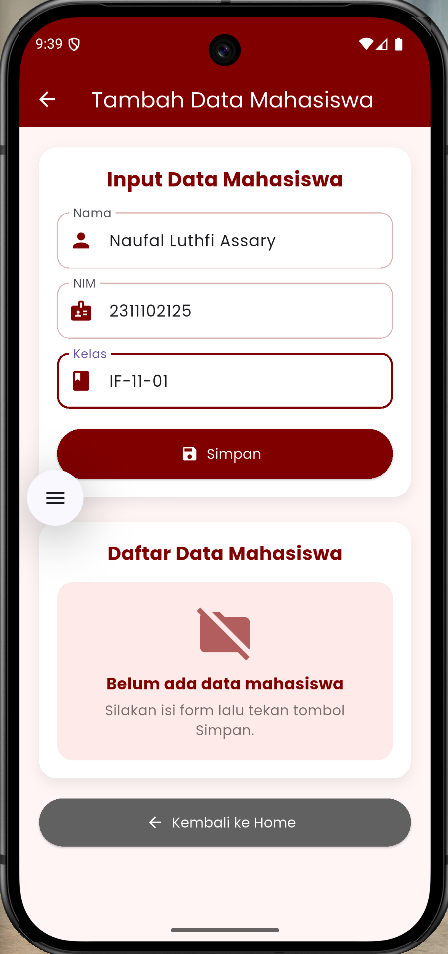
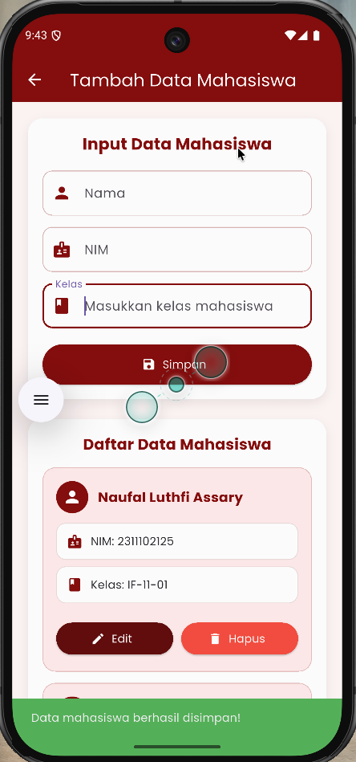
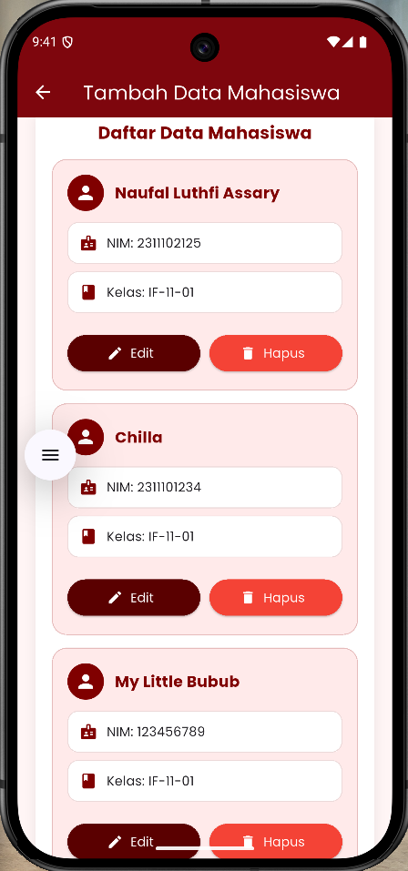
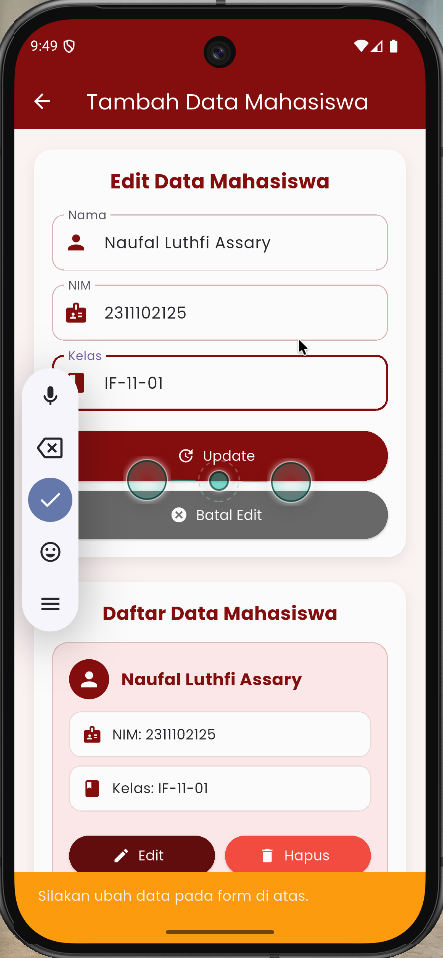
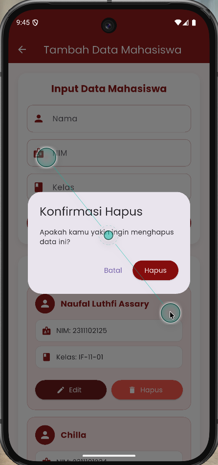

<div align="center">
  <br />
  <h1>LAPORAN PRAKTIKUM</h1>
  <h2>APLIKASI BERBASIS PLATFORM</h2>
  <br />
  <h3>Modul 7 Mobile</h3>
  <br />
  <br />
  
  <br />
  <br />
  <h3>Disusun Oleh :</h3>
  <p>
    <strong>NAUFAL LUTHFI ASSARY</strong><br>
    <strong>2311102125</strong><br>
    <strong>S1 IF-11-REG01</strong>
  </p>
  <br />
  <h3>Dosen Pengampu :</h3>
  <p>
    <strong>Dimas Fanny Hebrasianto Permadi, S.ST., M.Kom</strong>
  </p>
  <br />
  <h4>Asisten Praktikum :</h4>
  <p>
    <strong>Apri Pandu Wicaksono</strong><br>
    <strong>Rangga Pradarrell Fathi</strong>
  </p>
  <br />
  <h3>
    LABORATORIUM HIGH PERFORMANCE<br>
    FAKULTAS INFORMATIKA<br>
    UNIVERSITAS TELKOM PURWOKERTO<br>
    2026
  </h3>
</div>

---

## 1. Dasar Teori

Flutter adalah framework yang digunakan untuk membangun aplikasi multiplatform, termasuk aplikasi mobile Android. Flutter menggunakan bahasa pemrograman Dart dan menerapkan konsep widget sebagai komponen utama dalam pembuatan tampilan. Pada aplikasi Data Mahasiswa, beberapa widget yang digunakan antara lain `MaterialApp`, `Scaffold`, `AppBar`, `Container`, `Column`, `TextField`, `ElevatedButton`, dan `Icon`. Aplikasi ini juga menggunakan package `google_fonts` untuk memperindah tampilan teks dengan font Poppins, serta menggunakan tema warna merah maroon agar tampilan aplikasi lebih menarik dan konsisten.

Dalam Flutter terdapat dua jenis widget utama yang digunakan, yaitu `StatelessWidget` dan `StatefulWidget`. `StatelessWidget` digunakan untuk halaman yang tampilannya tidak berubah, seperti halaman Home dan Profil Developer. Sementara itu, `StatefulWidget` digunakan pada halaman Tambah Data Mahasiswa karena terdapat perubahan data ketika pengguna menambah, mengubah, atau menghapus data mahasiswa. Perubahan tampilan dilakukan menggunakan `setState()`, sedangkan input dari pengguna diambil menggunakan `TextEditingController` pada field Nama, NIM, dan Kelas.

Aplikasi ini juga menerapkan konsep navigasi dan CRUD sederhana. Navigasi antarhalaman dilakukan menggunakan `Navigator.push` untuk berpindah halaman dan `Navigator.pop` untuk kembali ke halaman sebelumnya. CRUD terdiri dari Create, Read, Update, dan Delete, yaitu proses menambah, menampilkan, mengubah, dan menghapus data mahasiswa. Data mahasiswa disimpan sementara menggunakan `List`, kemudian ditampilkan pada bagian Daftar Data Mahasiswa. Selain itu, aplikasi menggunakan `SnackBar` untuk menampilkan notifikasi ketika data berhasil disimpan, diupdate, dihapus, atau ketika input belum lengkap, serta `AlertDialog` untuk memberikan konfirmasi sebelum data dihapus.

---

## 2. Penjelasan Kode

### 1. Home

Halaman **Home** merupakan halaman utama yang pertama kali muncul ketika aplikasi dijalankan. Halaman ini dibuat menggunakan class `HomePage` yang merupakan turunan dari `StatelessWidget`.

```dart
class HomePage extends StatelessWidget {
  const HomePage({super.key});
```

`StatelessWidget` digunakan karena halaman Home hanya menampilkan tampilan statis dan tidak memiliki data yang berubah secara langsung.

Pada halaman Home terdapat `Scaffold` sebagai struktur utama halaman. Di dalamnya terdapat `AppBar` dan `body`.

```dart
return Scaffold(
  appBar: AppBar(
    title: const Text('Data Mahasiswa'),
    backgroundColor: maroon,
    foregroundColor: Colors.white,
    centerTitle: true,
  ),
```

`AppBar` digunakan untuk menampilkan judul halaman yaitu **Data Mahasiswa**. Warna AppBar menggunakan warna `maroon`, teks berwarna putih, dan judul dibuat berada di tengah.

Bagian isi halaman menggunakan `Container` dengan background gradasi.

```dart
body: Container(
  width: double.infinity,
  padding: const EdgeInsets.all(24),
  decoration: const BoxDecoration(
    gradient: LinearGradient(
      colors: [
        Color(0xFFFFEAEA),
        Color(0xFFFFFFFF),
      ],
      begin: Alignment.topCenter,
      end: Alignment.bottomCenter,
    ),
  ),
```

`Container` digunakan sebagai wadah utama. `width: double.infinity` membuat container memenuhi lebar layar. `padding` digunakan untuk memberi jarak bagian dalam. `LinearGradient` digunakan untuk membuat tampilan background menjadi lebih menarik.

Isi halaman disusun menggunakan `Column`.

```dart
child: Column(
  mainAxisAlignment: MainAxisAlignment.center,
  children: [
```

`Column` digunakan untuk menyusun elemen secara vertikal. Pada halaman Home, elemen dibuat berada di tengah layar menggunakan `mainAxisAlignment: MainAxisAlignment.center`.

Di dalam halaman Home terdapat icon, judul aplikasi, deskripsi, dan dua tombol.

```dart
const Icon(
  Icons.school,
  size: 90,
  color: maroon,
),
```

Icon `Icons.school` digunakan untuk memberikan kesan bahwa aplikasi berhubungan dengan data mahasiswa atau pendidikan.

Tombol pertama digunakan untuk masuk ke halaman **Tambah Data Mahasiswa**.

```dart
ElevatedButton.icon(
  icon: const Icon(Icons.edit),
  label: const Text('Tambah Data Mahasiswa'),
  ...
  onPressed: () {
    Navigator.push(
      context,
      MaterialPageRoute(
        builder: (context) => const FormMahasiswaPage(),
      ),
    );
  },
),
```

`ElevatedButton.icon` digunakan karena tombol memiliki icon dan teks. Ketika tombol ditekan, aplikasi menjalankan `Navigator.push` untuk berpindah ke halaman `FormMahasiswaPage`.

Tombol kedua digunakan untuk masuk ke halaman **Profil Developer**.

```dart
ElevatedButton.icon(
  icon: const Icon(Icons.person),
  label: const Text('Profil Developer'),
  ...
  onPressed: () {
    Navigator.push(
      context,
      MaterialPageRoute(
        builder: (context) => const ProfilDeveloperPage(),
      ),
    );
  },
),
```

Tombol ini juga menggunakan `Navigator.push`, tetapi halaman tujuannya adalah `ProfilDeveloperPage`.

---

### 2. Profil Developer

Halaman **Profil Developer** digunakan untuk menampilkan informasi pembuat aplikasi. Halaman ini dibuat menggunakan class `ProfilDeveloperPage`.

```dart
class ProfilDeveloperPage extends StatelessWidget {
  const ProfilDeveloperPage({super.key});
```

Halaman ini menggunakan `StatelessWidget` karena isi halaman bersifat tetap dan tidak mengalami perubahan data.

Struktur utama halaman menggunakan `Scaffold` dengan `AppBar`.

```dart
return Scaffold(
  appBar: AppBar(
    title: const Text('Profil Developer'),
    backgroundColor: maroon,
    foregroundColor: Colors.white,
    centerTitle: true,
  ),
```

`AppBar` menampilkan judul **Profil Developer** dengan warna tema maroon.

Isi halaman menggunakan `Container` dan `Column`.

```dart
body: Container(
  width: double.infinity,
  padding: const EdgeInsets.all(24),
  child: Column(
    mainAxisAlignment: MainAxisAlignment.center,
    children: [
```

`Container` berfungsi sebagai pembungkus utama, sedangkan `Column` digunakan untuk menyusun isi halaman secara vertikal. `mainAxisAlignment: MainAxisAlignment.center` membuat isi halaman berada di tengah.

Bagian profil menggunakan `CircleAvatar`.

```dart
const CircleAvatar(
  radius: 55,
  backgroundColor: maroon,
  child: Icon(
    Icons.account_circle,
    size: 90,
    color: Colors.white,
  ),
),
```

`CircleAvatar` digunakan untuk menampilkan icon profil developer dalam bentuk lingkaran.

Nama developer ditampilkan menggunakan widget `Text`.

```dart
Text(
  'Naufal Luthfi Assary',
  style: GoogleFonts.poppins(
    fontSize: 24,
    fontWeight: FontWeight.bold,
    color: maroon,
  ),
),
```

Nama developer diberi font Poppins, ukuran 24, tebal, dan warna maroon agar terlihat jelas.

Informasi tambahan seperti mata kuliah, project, dan nama project ditampilkan menggunakan `ListTile`.

```dart
ListTile(
  leading: const Icon(Icons.code, color: maroon),
  title: Text(
    'Mata Kuliah',
    style: GoogleFonts.poppins(
      fontWeight: FontWeight.bold,
    ),
  ),
  subtitle: const Text(
    'Praktikum Aplikasi Berbasis Platform',
  ),
),
```

`ListTile` digunakan karena cocok untuk menampilkan informasi berbentuk baris yang terdiri dari icon, judul, dan keterangan.

Pada bagian bawah halaman terdapat tombol **Kembali**.

```dart
ElevatedButton.icon(
  icon: const Icon(Icons.arrow_back),
  label: const Text('Kembali'),
  ...
  onPressed: () {
    Navigator.pop(context);
  },
),
```

`Navigator.pop(context)` digunakan untuk kembali ke halaman sebelumnya, yaitu halaman Home.

---

### 3. Tambah Data Mahasiswa

Halaman **Tambah Data Mahasiswa** dibuat menggunakan class `FormMahasiswaPage`.

```dart
class FormMahasiswaPage extends StatefulWidget {
  const FormMahasiswaPage({super.key});

  @override
  State<FormMahasiswaPage> createState() => _FormMahasiswaPageState();
}
```

Halaman ini menggunakan `StatefulWidget` karena terdapat data yang dapat berubah, seperti data mahasiswa yang ditambahkan, diedit, dan dihapus.

State dari halaman ini berada pada class `_FormMahasiswaPageState`.

```dart
class _FormMahasiswaPageState extends State<FormMahasiswaPage> {
```

Di dalam state terdapat tiga `TextEditingController`.

```dart
final TextEditingController namaController = TextEditingController();
final TextEditingController nimController = TextEditingController();
final TextEditingController kelasController = TextEditingController();
```

Controller ini digunakan untuk mengambil input dari form:

- `namaController` untuk mengambil data nama.
- `nimController` untuk mengambil data NIM.
- `kelasController` untuk mengambil data kelas.

Data mahasiswa disimpan sementara di dalam list.

```dart
final List<Mahasiswa> daftarMahasiswa = [];
```

`daftarMahasiswa` digunakan untuk menyimpan semua data mahasiswa yang berhasil diinput. Data ini disimpan dalam bentuk list dari objek `Mahasiswa`.

Form input dibuat menggunakan fungsi `inputMahasiswa`.

```dart
Widget inputMahasiswa({
  required String label,
  required String hint,
  required IconData icon,
  required TextEditingController controller,
}) {
  return TextField(
    controller: controller,
```

Fungsi ini dibuat agar kode input tidak perlu ditulis berulang-ulang. Fungsi ini menerima parameter `label`, `hint`, `icon`, dan `controller`.

Contoh pemanggilan input untuk nama:

```dart
inputMahasiswa(
  label: 'Nama',
  hint: 'Masukkan nama mahasiswa',
  icon: Icons.person,
  controller: namaController,
),
```

Pada halaman ini terdapat tiga input, yaitu Nama, NIM, dan Kelas.

Tombol Simpan dibuat menggunakan `ElevatedButton.icon`.

```dart
ElevatedButton.icon(
  icon: Icon(sedangEdit ? Icons.update : Icons.save),
  label: Text(sedangEdit ? 'Update' : 'Simpan'),
  ...
  onPressed: simpanData,
),
```

Tombol ini akan menjalankan fungsi `simpanData` ketika ditekan. Jika sedang tidak dalam mode edit, tombol akan bertuliskan **Simpan**. Jika sedang dalam mode edit, tombol berubah menjadi **Update**.

---

### 4. Tambah Data Mahasiswa Berhasil Disimpan

Proses menyimpan data dilakukan di dalam fungsi `simpanData`.

```dart
void simpanData() {
  String nama = namaController.text.trim();
  String nim = nimController.text.trim();
  String kelas = kelasController.text.trim();
```

Data diambil dari masing-masing controller. Method `trim()` digunakan untuk menghapus spasi kosong di awal dan akhir input.

Sebelum data disimpan, aplikasi melakukan validasi.

```dart
if (nama.isEmpty || nim.isEmpty || kelas.isEmpty) {
  ScaffoldMessenger.of(context).showSnackBar(
    const SnackBar(
      content: Text('Semua data wajib diisi!'),
      backgroundColor: Colors.red,
    ),
  );
  return;
}
```

Jika salah satu input kosong, maka aplikasi akan menampilkan `SnackBar` dengan pesan **Semua data wajib diisi!** dan proses penyimpanan dihentikan menggunakan `return`.

Jika data sudah lengkap dan tidak sedang edit, maka data baru akan ditambahkan ke dalam list `daftarMahasiswa`.

```dart
daftarMahasiswa.add(
  Mahasiswa(
    nama: nama,
    nim: nim,
    kelas: kelas,
  ),
);
```

Kode tersebut membuat objek `Mahasiswa` baru berdasarkan input yang dimasukkan, lalu menambahkannya ke dalam list.

Setelah data berhasil disimpan, aplikasi menampilkan notifikasi menggunakan `SnackBar`.

```dart
ScaffoldMessenger.of(context).showSnackBar(
  const SnackBar(
    content: Text('Data mahasiswa berhasil disimpan!'),
    backgroundColor: Colors.green,
  ),
);
```

`SnackBar` ini memberi informasi kepada pengguna bahwa data berhasil disimpan.

Setelah proses simpan selesai, form dikosongkan kembali.

```dart
namaController.clear();
nimController.clear();
kelasController.clear();
```

Bagian ini membuat input Nama, NIM, dan Kelas kosong kembali agar pengguna dapat menginput data baru.

Seluruh perubahan data dimasukkan ke dalam `setState`.

```dart
setState(() {
  ...
});
```

`setState` digunakan agar tampilan aplikasi diperbarui setelah data berhasil ditambahkan.

---

### 5. Daftar Data Mahasiswa

Daftar data mahasiswa ditampilkan pada halaman yang sama dengan form input.

Bagian ini dibuat menggunakan fungsi `daftarDataMahasiswa`.

```dart
Widget daftarDataMahasiswa() {
  if (daftarMahasiswa.isEmpty) {
```

Fungsi ini mengecek apakah list `daftarMahasiswa` masih kosong.

Jika belum ada data, maka aplikasi menampilkan pesan bahwa data mahasiswa belum tersedia.

```dart
Text(
  'Belum ada data mahasiswa',
  style: GoogleFonts.poppins(
    fontSize: 16,
    fontWeight: FontWeight.bold,
    color: maroon,
  ),
),
```

Jika data sudah ada, maka aplikasi akan menampilkan semua data mahasiswa.

```dart
return Column(
  children: daftarMahasiswa.asMap().entries.map((entry) {
    int index = entry.key;
    Mahasiswa mahasiswa = entry.value;

    return dataMahasiswaCard(mahasiswa, index);
  }).toList(),
);
```

`asMap().entries` digunakan agar setiap data memiliki index. Index ini diperlukan untuk proses edit dan hapus data.

Setiap data mahasiswa ditampilkan menggunakan fungsi `dataMahasiswaCard`.

```dart
Widget dataMahasiswaCard(Mahasiswa mahasiswa, int index) {
  return Container(
```

`dataMahasiswaCard` digunakan untuk menampilkan satu data mahasiswa dalam bentuk card.

Dalam card terdapat nama mahasiswa, NIM, kelas, tombol Edit, dan tombol Hapus.

```dart
Text(
  mahasiswa.nama,
  style: GoogleFonts.poppins(
    fontSize: 17,
    fontWeight: FontWeight.bold,
    color: maroon,
  ),
),
```

Kode tersebut digunakan untuk menampilkan nama mahasiswa.

NIM dan kelas ditampilkan menggunakan fungsi `dataItem`.

```dart
dataItem('NIM', mahasiswa.nim, Icons.badge),
dataItem('Kelas', mahasiswa.kelas, Icons.class_),
```

Fungsi `dataItem` membuat tampilan detail data menjadi lebih rapi.

---

### 6. Update Data Mahasiswa

Fitur update data dimulai ketika pengguna menekan tombol **Edit** pada salah satu card mahasiswa.

```dart
ElevatedButton.icon(
  icon: const Icon(Icons.edit),
  label: const Text('Edit'),
  ...
  onPressed: () {
    editData(index);
  },
),
```

Ketika tombol Edit ditekan, fungsi `editData(index)` akan dijalankan.

```dart
void editData(int index) {
  setState(() {
    indexEdit = index;
    namaController.text = daftarMahasiswa[index].nama;
    nimController.text = daftarMahasiswa[index].nim;
    kelasController.text = daftarMahasiswa[index].kelas;
  });
```

Fungsi `editData` menyimpan index data yang sedang diedit ke dalam variabel `indexEdit`.

Kemudian data mahasiswa yang dipilih dimasukkan kembali ke dalam form input.

Variabel `indexEdit` digunakan untuk menentukan apakah aplikasi sedang berada dalam mode edit.

```dart
int? indexEdit;

bool get sedangEdit => indexEdit != null;
```

Jika `indexEdit` tidak kosong, maka `sedangEdit` bernilai true.

Saat sedang edit, judul form berubah menjadi **Edit Data Mahasiswa**.

```dart
sedangEdit
    ? 'Edit Data Mahasiswa'
    : 'Input Data Mahasiswa',
```

Tombol juga berubah dari **Simpan** menjadi **Update**.

```dart
label: Text(sedangEdit ? 'Update' : 'Simpan'),
```

Ketika tombol Update ditekan, fungsi `simpanData` akan memperbarui data pada list.

```dart
daftarMahasiswa[indexEdit!] = Mahasiswa(
  nama: nama,
  nim: nim,
  kelas: kelas,
);
```

Data pada index yang sedang diedit diganti dengan data baru dari form.

Setelah update berhasil, aplikasi menampilkan notifikasi.

```dart
ScaffoldMessenger.of(context).showSnackBar(
  const SnackBar(
    content: Text('Data mahasiswa berhasil diupdate!'),
    backgroundColor: Colors.green,
  ),
);
```

Kemudian `indexEdit` dikembalikan menjadi `null` agar aplikasi keluar dari mode edit.

```dart
indexEdit = null;
```

Jika pengguna tidak jadi mengedit, tersedia tombol **Batal Edit**.

```dart
if (sedangEdit) ...[
  ElevatedButton.icon(
    icon: const Icon(Icons.cancel),
    label: const Text('Batal Edit'),
    ...
    onPressed: batalEdit,
  ),
],
```

Tombol ini hanya muncul ketika sedang dalam mode edit.

Fungsi `batalEdit` digunakan untuk membatalkan proses edit.

```dart
void batalEdit() {
  setState(() {
    indexEdit = null;
    namaController.clear();
    nimController.clear();
    kelasController.clear();
  });
}
```

Fungsi tersebut menghapus isi form dan mengembalikan mode edit menjadi mode tambah data.

---

### 7. Hapus Data Mahasiswa

Fitur hapus data terdapat pada tombol **Hapus** di setiap card mahasiswa.

```dart
ElevatedButton.icon(
  icon: const Icon(Icons.delete),
  label: const Text('Hapus'),
  ...
  onPressed: () {
    konfirmasiHapus(index);
  },
),
```

Ketika tombol Hapus ditekan, aplikasi tidak langsung menghapus data, tetapi menampilkan konfirmasi terlebih dahulu melalui fungsi `konfirmasiHapus`.

```dart
void konfirmasiHapus(int index) {
  showDialog(
    context: context,
    builder: (context) {
      return AlertDialog(
        title: const Text('Konfirmasi Hapus'),
        content: const Text('Apakah kamu yakin ingin menghapus data ini?'),
```

`showDialog` digunakan untuk menampilkan popup konfirmasi. `AlertDialog` berisi pertanyaan apakah pengguna yakin ingin menghapus data.

Di dalam dialog terdapat tombol **Batal** dan **Hapus**.

```dart
TextButton(
  child: const Text('Batal'),
  onPressed: () {
    Navigator.pop(context);
  },
),
```

Tombol Batal digunakan untuk menutup dialog tanpa menghapus data.

```dart
ElevatedButton(
  child: const Text('Hapus'),
  onPressed: () {
    Navigator.pop(context);
    hapusData(index);
  },
),
```

Tombol Hapus digunakan untuk menutup dialog lalu menjalankan fungsi `hapusData(index)`.

Fungsi `hapusData` digunakan untuk menghapus data dari list.

```dart
void hapusData(int index) {
  setState(() {
    daftarMahasiswa.removeAt(index);
```

`removeAt(index)` digunakan untuk menghapus data mahasiswa berdasarkan posisi index di dalam list.

Jika data yang dihapus sedang diedit, maka mode edit akan dibatalkan dan form dikosongkan.

```dart
if (indexEdit == index) {
  indexEdit = null;
  namaController.clear();
  nimController.clear();
  kelasController.clear();
}
```

Setelah data berhasil dihapus, aplikasi menampilkan notifikasi menggunakan SnackBar.

```dart
ScaffoldMessenger.of(context).showSnackBar(
  const SnackBar(
    content: Text('Data mahasiswa berhasil dihapus!'),
    backgroundColor: Colors.red,
  ),
);
```

SnackBar ini memberi informasi bahwa data mahasiswa berhasil dihapus.

---

## 3. Screenshot Hasil

### 1. Home


### 2. Profil Developer


### 3. Tambah Data Mahasiswa


### 4. Tambah Data Mahasiswa Berhasil Disimpan


### 5. Daftar Data Mahasiswa


### 6. Update Data Mahasiswa


### 7. Hapus Data Mahasiswa


---

## 4. Referensi

- [Flutter Docs](https://docs.flutter.dev)
- [Dart](https://dart.dev)
- [Modul](https://telkomuniversityofficial-my.sharepoint.com/:b:/g/personal/dimasfhp_telkomuniversity_ac_id/IQAzpAVjVmeTRYI3rgKxGZE7AcpC_xRo2dpbh8ZyHd3c1lQ?e=pZRgq9)
