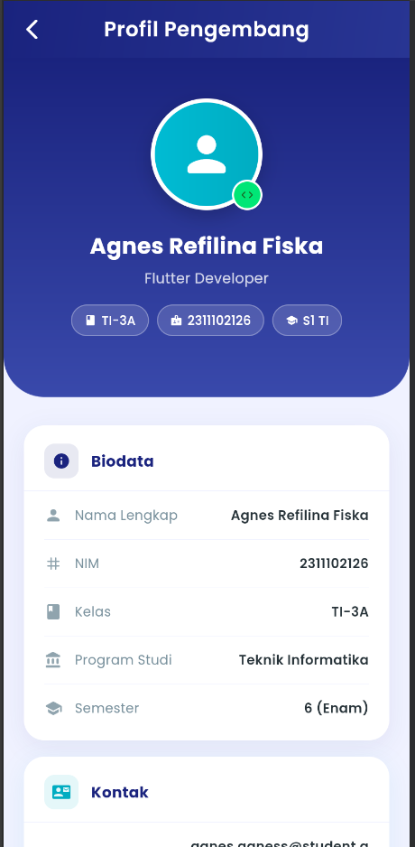
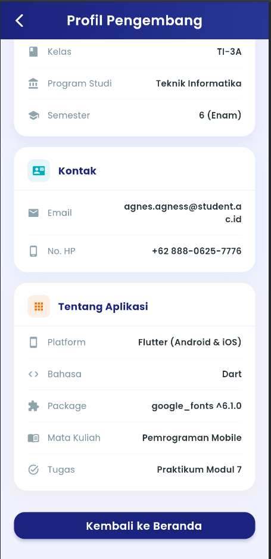
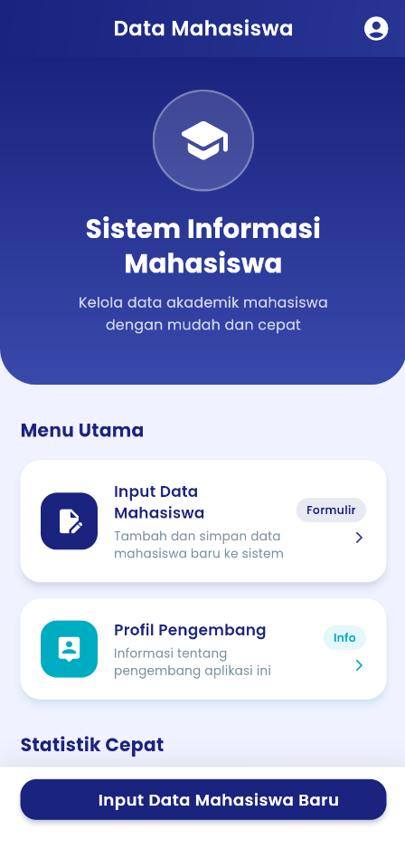
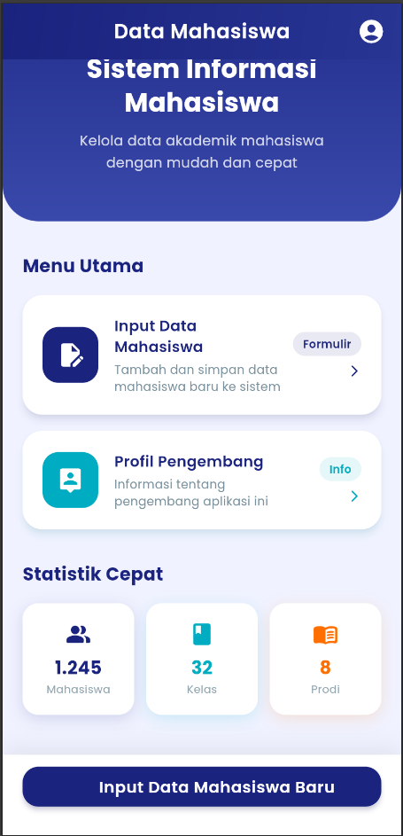
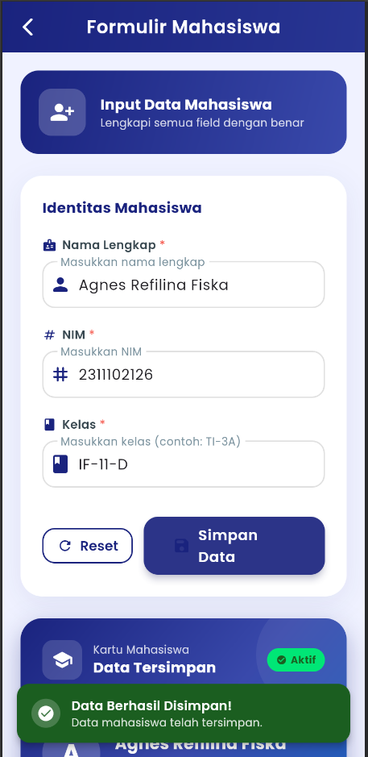
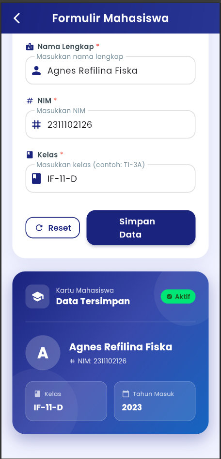

<div align="center">
  <br />
  <h1>LAPORAN PRAKTIKUM <br>APLIKASI BERBASIS PLATFORM</h1>
  <br />
  <h3>MODUL 7 <br> DATA MAHASISWA (NAVIGATOR & FORM) </h3>
  <br />
  <br />
  
  <br />
  <br />
  <br />
  <h3>Disusun Oleh :</h3>
  <p>
    <strong>Agnes Refilina Fiska</strong><br>
    <strong>2311102126</strong><br>
    <strong>S1 IF-11-REG01</strong><br>
  </p>
  <br />
  <h3>Dosen Pengampu :</h3>
  <p>
    <strong>Dimas Fanny Hebrasianto Permadi, S.ST., M.Kom</strong>
  </p>
  <br />
  <h3>Asisten Praktikum :</h3>
  <p>
    <strong>Apri Pandu Wicaksono</strong><br>
    <strong>Rangga Pradarrell Fathi</strong><br>
  </p>
  <br />
  <h3>LABORATORIUM HIGH PERFORMANCE<br>FAKULTAS INFORMATIKA <br>TELKOM UNIVERSITY PURWOKERTO <br>2026</h3>
</div>

---

# A. Dasar Teori

- **StatelessWidget** : Merupakan komponen antarmuka yang bersifat statis, artinya tampilan widget tidak akan berubah setelah proses *rendering* pertama kali. Karena tidak memiliki *state* internal, semua data yang dikelola bersifat *immutable* (tidak dapat diubah). Widget ini ideal untuk elemen UI yang tidak memerlukan interaksi dinamis atau perubahan status, seperti ikon, teks statis, maupun aset visual.
- **StatefulWidget** : Berbeda dengan  *Stateless* , widget ini dirancang untuk menangani elemen aplikasi yang bersifat dinamis. *StatefulWidget* bekerja bersama objek `State` untuk memantau perubahan data. Melalui pemanggilan fungsi `setState()`, Flutter akan secara otomatis melakukan *rebuild* pada UI untuk mencerminkan pembaruan data terkini. Implementasinya mencakup komponen seperti  *input field* ,  *counter* , maupun elemen yang merespons interaksi pengguna secara langsung.
- **Navigasi (`Navigator.push` & `Navigator.pop`)** : Merupakan sistem manajemen rute berbasis *stack* (tumpukan).

  1. **`Navigator.push`** : Digunakan untuk menumpuk layar baru di atas layar saat ini, memungkinkan pengguna berpindah ke halaman lain dengan tetap menjaga konteks halaman sebelumnya.
  2. `Navigator.pop` : Berfungsi untuk mengeluarkan halaman teratas dari  stack , yang secara efektif mengembalikan pengguna ke tampilan sebelumnya.

  **`Navigator.pop`** : Berfungsi untuk mengeluarkan halaman teratas dari  *stack* , yang secara efektif mengembalikan pengguna ke tampilan sebelumnya.
- **Google Fonts Package** : Pustaka yang menyediakan akses langsung ke koleksi tipografi Google Fonts. Penggunaan paket ini menyederhanakan proses integrasi font kustom ke dalam aplikasi tanpa perlu melakukan konfigurasi manual terhadap berkas aset `.ttf` atau `.otf`, sehingga mempermudah penyesuaian estetika tipografi secara efisien.
- **AppBar** : Komponen krusial yang terletak di bagian atas layar aplikasi. Selain berfungsi untuk menampilkan judul halaman, *AppBar* dapat dioptimalkan dengan berbagai elemen dekoratif, seperti gradien warna atau tombol navigasi, untuk meningkatkan pengalaman pengguna ( *UX* ).
- **Container** : Widget fleksibel yang berfungsi sebagai pembungkus ( *wrapper* ) untuk mengatur tata letak dan dekorasi. *Container* memungkinkan pengembang untuk mengonfigurasi properti seperti  *margin* ,  *padding* , warna latar belakang, gradien, serta *border radius* untuk menciptakan visual yang rapi dan konsisten.

* **Column** : Komponen tata letak ( *layout* ) yang berfungsi untuk menyusun daftar widget secara vertikal (berbaris dari atas ke bawah).
* **ElevatedButton** : Tombol berbasis *Material Design* yang memiliki efek elevasi atau bayangan. Tombol ini merepresentasikan elemen interaktif yang menonjol, memberikan umpan balik visual yang jelas bahwa komponen tersebut dapat ditekan oleh pengguna.

---

# B. Kode Program

Berikut adalah rincian fungsionalitas, kode program lengkap, serta penjelasan detail berserta **kode program** dari masing-masing halaman:

### 1. Home

Halaman ini berfungsi sebagai beranda utama aplikasi yang menampilkan daftar nama mahasiswa aktif.

- **Kode Program (`lib/main.dart`):**

```dart
import 'package:flutter/material.dart';
import 'package:google_fonts/google_fonts.dart';
import 'form_page.dart';
import 'profile_page.dart';

class HomePage extends StatelessWidget {
  const HomePage({super.key});

  @override
  Widget build(BuildContext context) {
    final colorScheme = Theme.of(context).colorScheme;

    return Scaffold(
      backgroundColor: colorScheme.background,
      appBar: AppBar(
        title: const Text('Data Mahasiswa'),
        actions: [
          IconButton(
            icon: const Icon(Icons.account_circle_rounded, size: 28),
            tooltip: 'Profil Pengembang',
            onPressed: () {
              Navigator.push(
                context,
                PageRouteBuilder(
                  pageBuilder: (_, animation, __) => const ProfilePage(),
                  transitionsBuilder: (_, animation, __, child) {
                    return FadeTransition(opacity: animation, child: child);
                  },
                ),
              );
            },
          ),
          const SizedBox(width: 8),
        ],
        flexibleSpace: Container(
          decoration: const BoxDecoration(
            gradient: LinearGradient(
              colors: [Color(0xFF1A237E), Color(0xFF283593)],
              begin: Alignment.topLeft,
              end: Alignment.bottomRight,
            ),
          ),
        ),
      ),
      body: SingleChildScrollView(
        child: Column(
          children: [
            // Hero Banner
            Container(
              width: double.infinity,
              decoration: const BoxDecoration(
                gradient: LinearGradient(
                  colors: [Color(0xFF1A237E), Color(0xFF3949AB)],
                  begin: Alignment.topCenter,
                  end: Alignment.bottomCenter,
                ),
                borderRadius: BorderRadius.only(
                  bottomLeft: Radius.circular(36),
                  bottomRight: Radius.circular(36),
                ),
              ),
              padding: const EdgeInsets.fromLTRB(24, 32, 24, 48),
              child: Column(
                children: [
                  Container(
                    width: 100,
                    height: 100,
                    decoration: BoxDecoration(
                      color: Colors.white.withOpacity(0.15),
                      shape: BoxShape.circle,
                      border: Border.all(
                          color: Colors.white.withOpacity(0.3), width: 2),
                    ),
                    child: const Icon(
                      Icons.school_rounded,
                      size: 52,
                      color: Colors.white,
                    ),
                  ),
                  const SizedBox(height: 20),
                  Text(
                    'Sistem Informasi\nMahasiswa',
                    textAlign: TextAlign.center,
                    style: GoogleFonts.poppins(
                      fontSize: 26,
                      fontWeight: FontWeight.w700,
                      color: Colors.white,
                      height: 1.3,
                    ),
                  ),
                  const SizedBox(height: 10),
                  Text(
                    'Kelola data akademik mahasiswa\ndengan mudah dan cepat',
                    textAlign: TextAlign.center,
                    style: GoogleFonts.poppins(
                      fontSize: 14,
                      color: Colors.white.withOpacity(0.8),
                      height: 1.6,
                    ),
                  ),
                ],
              ),
            ),

            const SizedBox(height: 32),

            Padding(
              padding: const EdgeInsets.symmetric(horizontal: 20),
              child: Column(
                crossAxisAlignment: CrossAxisAlignment.start,
                children: [
                  Text(
                    'Menu Utama',
                    style: GoogleFonts.poppins(
                      fontSize: 18,
                      fontWeight: FontWeight.w700,
                      color: const Color(0xFF1A237E),
                    ),
                  ),
                  const SizedBox(height: 16),
                  _MenuCard(
                    icon: Icons.edit_document,
                    iconBg: const Color(0xFF1A237E),
                    title: 'Input Data Mahasiswa',
                    subtitle: 'Tambah dan simpan data mahasiswa baru ke sistem',
                    badge: 'Formulir',
                    onTap: () {
                      Navigator.push(
                        context,
                        PageRouteBuilder(
                          pageBuilder: (_, animation, __) => const FormPage(),
                          transitionsBuilder: (_, animation, __, child) {
                            final tween = Tween(
                                    begin: const Offset(1.0, 0.0),
                                    end: Offset.zero)
                                .chain(
                                    CurveTween(curve: Curves.easeInOutCubic));
                            return SlideTransition(
                              position: animation.drive(tween),
                              child: child,
                            );
                          },
                        ),
                      );
                    },
                  ),
                  const SizedBox(height: 16),
                  _MenuCard(
                    icon: Icons.person_pin_rounded,
                    iconBg: const Color(0xFF00ACC1),
                    title: 'Profil Pengembang',
                    subtitle: 'Informasi tentang pengembang aplikasi ini',
                    badge: 'Info',
                    onTap: () {
                      Navigator.push(
                        context,
                        PageRouteBuilder(
                          pageBuilder: (_, animation, __) =>
                              const ProfilePage(),
                          transitionsBuilder: (_, animation, __, child) {
                            final tween = Tween(
                                    begin: const Offset(1.0, 0.0),
                                    end: Offset.zero)
                                .chain(
                                    CurveTween(curve: Curves.easeInOutCubic));
                            return SlideTransition(
                              position: animation.drive(tween),
                              child: child,
                            );
                          },
                        ),
                      );
                    },
                  ),
                  const SizedBox(height: 32),
                  Text(
                    'Statistik Cepat',
                    style: GoogleFonts.poppins(
                      fontSize: 18,
                      fontWeight: FontWeight.w700,
                      color: const Color(0xFF1A237E),
                    ),
                  ),
                  const SizedBox(height: 16),
                  Row(
                    children: [
                      Expanded(
                        child: _StatCard(
                          icon: Icons.people_alt_rounded,
                          label: 'Mahasiswa',
                          value: '1.245',
                          color: const Color(0xFF1A237E),
                        ),
                      ),
                      const SizedBox(width: 12),
                      Expanded(
                        child: _StatCard(
                          icon: Icons.class_rounded,
                          label: 'Kelas',
                          value: '32',
                          color: const Color(0xFF00ACC1),
                        ),
                      ),
                      const SizedBox(width: 12),
                      Expanded(
                        child: _StatCard(
                          icon: Icons.menu_book_rounded,
                          label: 'Prodi',
                          value: '8',
                          color: const Color(0xFFFF6F00),
                        ),
                      ),
                    ],
                  ),
                  const SizedBox(height: 40),
                ],
              ),
            ),
          ],
        ),
      ),
      bottomNavigationBar: Container(
        padding: const EdgeInsets.fromLTRB(20, 12, 20, 28),
        decoration: BoxDecoration(
          color: Colors.white,
          boxShadow: [
            BoxShadow(
              color: Colors.black.withOpacity(0.08),
              blurRadius: 20,
              offset: const Offset(0, -4),
            )
          ],
        ),
        child: ElevatedButton.icon(
          onPressed: () {
            Navigator.push(
              context,
              PageRouteBuilder(
                pageBuilder: (_, animation, __) => const FormPage(),
                transitionsBuilder: (_, animation, __, child) {
                  final tween =
                      Tween(begin: const Offset(0.0, 1.0), end: Offset.zero)
                          .chain(CurveTween(curve: Curves.easeInOutCubic));
                  return SlideTransition(
                      position: animation.drive(tween), child: child);
                },
              ),
            );
          },
          icon: const Icon(Icons.add_circle_rounded, size: 22),
          label: const Text('Input Data Mahasiswa Baru'),
        ),
      ),
    );
  }
}

class _MenuCard extends StatelessWidget {
  final IconData icon;
  final Color iconBg;
  final String title;
  final String subtitle;
  final String badge;
  final VoidCallback onTap;

  const _MenuCard({
    required this.icon,
    required this.iconBg,
    required this.title,
    required this.subtitle,
    required this.badge,
    required this.onTap,
  });

  @override
  Widget build(BuildContext context) {
    return Material(
      color: Colors.white,
      borderRadius: BorderRadius.circular(20),
      elevation: 6,
      shadowColor: iconBg.withOpacity(0.2),
      child: InkWell(
        onTap: onTap,
        borderRadius: BorderRadius.circular(20),
        child: Padding(
          padding: const EdgeInsets.all(20),
          child: Row(
            children: [
              Container(
                width: 56,
                height: 56,
                decoration: BoxDecoration(
                  color: iconBg,
                  borderRadius: BorderRadius.circular(16),
                ),
                child: Icon(icon, color: Colors.white, size: 28),
              ),
              const SizedBox(width: 16),
              Expanded(
                child: Column(
                  crossAxisAlignment: CrossAxisAlignment.start,
                  children: [
                    Text(
                      title,
                      style: GoogleFonts.poppins(
                        fontSize: 15,
                        fontWeight: FontWeight.w600,
                        color: const Color(0xFF1A237E),
                      ),
                    ),
                    const SizedBox(height: 4),
                    Text(
                      subtitle,
                      style: GoogleFonts.poppins(
                        fontSize: 12,
                        color: const Color(0xFF78909C),
                        height: 1.4,
                      ),
                    ),
                  ],
                ),
              ),
              const SizedBox(width: 8),
              Column(
                crossAxisAlignment: CrossAxisAlignment.end,
                children: [
                  Container(
                    padding:
                        const EdgeInsets.symmetric(horizontal: 10, vertical: 4),
                    decoration: BoxDecoration(
                      color: iconBg.withOpacity(0.1),
                      borderRadius: BorderRadius.circular(20),
                    ),
                    child: Text(
                      badge,
                      style: GoogleFonts.poppins(
                        fontSize: 11,
                        fontWeight: FontWeight.w600,
                        color: iconBg,
                      ),
                    ),
                  ),
                  const SizedBox(height: 8),
                  Icon(Icons.arrow_forward_ios_rounded,
                      size: 14, color: iconBg),
                ],
              ),
            ],
          ),
        ),
      ),
    );
  }
}

class _StatCard extends StatelessWidget {
  final IconData icon;
  final String label;
  final String value;
  final Color color;

  const _StatCard({
    required this.icon,
    required this.label,
    required this.value,
    required this.color,
  });

  @override
  Widget build(BuildContext context) {
    return Container(
      padding: const EdgeInsets.symmetric(vertical: 18, horizontal: 12),
      decoration: BoxDecoration(
        color: Colors.white,
        borderRadius: BorderRadius.circular(16),
        boxShadow: [
          BoxShadow(
            color: color.withOpacity(0.15),
            blurRadius: 12,
            offset: const Offset(0, 4),
          ),
        ],
      ),
      child: Column(
        children: [
          Icon(icon, color: color, size: 26),
          const SizedBox(height: 8),
          Text(
            value,
            style: GoogleFonts.poppins(
              fontSize: 18,
              fontWeight: FontWeight.w700,
              color: color,
            ),
          ),
          Text(
            label,
            style: GoogleFonts.poppins(
              fontSize: 11,
              color: const Color(0xFF90A4AE),
            ),
          ),
        ],
      ),
    );
  }
}

```

- **Penjelasan Penggunaan Elemen:**

  * **StatefulWidget**

    * **Penjelasan:** `HomePage` dideklarasikan sebagai `StatelessWidget` karena halaman ini bersifat statis secara struktural. Halaman ini berfungsi sebagai dasbor (dashboard) yang menampilkan informasi dan navigasi. Karena tidak ada data yang berubah (seperti daftar mahasiswa yang di-update) secara langsung di halaman ini, maka penggunaan `StatelessWidget` adalah pilihan yang efisien untuk performa aplikasi.
    * **Kode Program:**
      ```dart
      class HomePage extends StatelessWidget {
        const HomePage({super.key});

        @override
        Widget build(BuildContext context) {
          // ... (implementasi UI)
        }
      }
      ```
  * **Container**

    * **Penjelasan:** `Container` digunakan secara ekstensif dalam `HomePage` untuk mengatur tata letak dan dekorasi visual. Widget ini membungkus elemen-elemen seperti *Hero Banner* dan *Menu Card* untuk memberikan  *padding* ,  *margin* , dekorasi gradien, hingga pembentukan sudut melengkung ( *border radius* ) agar antarmuka terlihat lebih modern dan premium.
    * **Kode Program:**
      ```dart
      Container(
        width: double.infinity,
        decoration: const BoxDecoration(
          gradient: LinearGradient(colors: [Color(0xFF1A237E), Color(0xFF3949AB)]),
          borderRadius: BorderRadius.only(
            bottomLeft: Radius.circular(36),
            bottomRight: Radius.circular(36),
          ),
        ),
        padding: const EdgeInsets.fromLTRB(24, 32, 24, 48),
        // ...
      )
      ```
  * **Coumn**

    * **Penjelasan:** Widget `Column` digunakan untuk menyusun elemen-elemen UI secara vertikal dari atas ke bawah. Pada `HomePage`, `Column` digunakan dalam struktur utama `body` untuk menampung  *Hero Banner* , daftar menu, dan statistik, sehingga setiap komponen dapat tersusun dengan rapi dalam satu alur antarmuka.
    * **Kode Program:**
      ```dart
      body: SingleChildScrollView(
        child: Column(
          children: [
            // Hero Banner
            // SizedBox
            // Menu Utama
            // ...
          ],
        ),
      ),
      ```
  * **Navigation (Navigator.push)**

    * **Penjelasan:** Navigasi dalam aplikasi ini menggunakan `Navigator.push` yang dibungkus dengan `PageRouteBuilder`. Penggunaan ini memungkinkan perpindahan halaman ke `FormPage` atau `ProfilePage` dengan efek transisi khusus (seperti *FadeTransition* atau  *SlideTransition* ) agar perpindahan antar layar terasa lebih mulus dan interaktif dibandingkan transisi bawaan sistem.
    * **Kode Program:**
      ```dart
      onTap: () {
        Navigator.push(
          context,
          PageRouteBuilder(
            pageBuilder: (_, animation, __) => const FormPage(),
            transitionsBuilder: (_, animation, __, child) {
              final tween = Tween(begin: const Offset(1.0, 0.0), end: Offset.zero)
                  .chain(CurveTween(curve: Curves.easeInOutCubic));
              return SlideTransition(position: animation.drive(tween), child: child);
            },
          ),
        );
      },
      ```
  * **Google Fonts Package**

    * **Penjelasan:** Aplikasi ini menerapkan gaya tipografi dari pustaka `google_fonts`. Dengan menggunakan `GoogleFonts.poppins`, antarmuka aplikasi memiliki tampilan teks yang lebih bersih dan profesional. Pustaka ini memudahkan pengembang untuk mengatur ukuran, ketebalan ( *weight* ), dan warna font tanpa perlu menginstal berkas *font* secara manual ke dalam sistem.
    * **Kode Program:**
      ```dart
      Text(
        'Sistem Informasi\nMahasiswa',
        style: GoogleFonts.poppins(
          fontSize: 26,
          fontWeight: FontWeight.w700,
          color: Colors.white,
        ),
      ),
      ```
  * **ElevatedButton**

    * **Penjelasan:** `ElevatedButton` pada bagian `bottomNavigationBar` berfungsi sebagai tombol aksi utama ( *Primary Action* ) untuk berpindah ke halaman input data. Tombol ini dilengkapi dengan ikon dan teks yang jelas, memberikan umpan balik visual yang kuat kepada pengguna bahwa mereka dapat menekan tombol tersebut untuk melakukan aksi input data baru.
    * **Kode Program:**
      ```dart
      ElevatedButton.icon(
        onPressed: () { /* Navigasi ke FormPage */ },
        icon: const Icon(Icons.add_circle_rounded, size: 22),
        label: const Text('Input Data Mahasiswa Baru'),
      ),
      ```

  ---

### 2. Form Mahasiswa

Halaman ini berfungsi sebagai form input penambahan data mahasiswa baru.

- **Kode Program (`lib/student_form.dart`):**

```dart
import 'package:flutter/material.dart';
import 'package:google_fonts/google_fonts.dart';
import '../widgets/student_data_card.dart';

class MahasiswaData {
  final String nama;
  final String nim;
  final String kelas;

  const MahasiswaData({
    required this.nama,
    required this.nim,
    required this.kelas,
  });
}

class FormPage extends StatefulWidget {
  const FormPage({super.key});

  @override
  State<FormPage> createState() => _FormPageState();
}

class _FormPageState extends State<FormPage>
    with SingleTickerProviderStateMixin {
  final _formKey = GlobalKey<FormState>();
  final _namaController = TextEditingController();
  final _nimController = TextEditingController();
  final _kelasController = TextEditingController();

  MahasiswaData? _savedData;
  bool _isSaved = false;

  late AnimationController _animController;
  late Animation<double> _fadeAnim;
  late Animation<Offset> _slideAnim;

  @override
  void initState() {
    super.initState();
    _animController = AnimationController(
      vsync: this,
      duration: const Duration(milliseconds: 600),
    );
    _fadeAnim = CurvedAnimation(parent: _animController, curve: Curves.easeOut);
    _slideAnim = Tween<Offset>(begin: const Offset(0, 0.3), end: Offset.zero)
        .animate(CurvedAnimation(
            parent: _animController, curve: Curves.easeOutCubic));
  }

  @override
  void dispose() {
    _namaController.dispose();
    _nimController.dispose();
    _kelasController.dispose();
    _animController.dispose();
    super.dispose();
  }

  void _simpanData() {
    if (_formKey.currentState!.validate()) {
      setState(() {
        _savedData = MahasiswaData(
          nama: _namaController.text.trim(),
          nim: _nimController.text.trim(),
          kelas: _kelasController.text.trim(),
        );
        _isSaved = true;
      });

      _animController.forward(from: 0);

      ScaffoldMessenger.of(context).clearSnackBars();
      ScaffoldMessenger.of(context).showSnackBar(
        SnackBar(
          behavior: SnackBarBehavior.floating,
          margin: const EdgeInsets.fromLTRB(16, 0, 16, 16),
          shape:
              RoundedRectangleBorder(borderRadius: BorderRadius.circular(14)),
          backgroundColor: const Color(0xFF1B5E20),
          duration: const Duration(seconds: 3),
          content: Row(
            children: [
              Container(
                padding: const EdgeInsets.all(6),
                decoration: BoxDecoration(
                  color: Colors.white.withOpacity(0.2),
                  shape: BoxShape.circle,
                ),
                child: const Icon(Icons.check_circle_rounded,
                    color: Colors.white, size: 20),
              ),
              const SizedBox(width: 12),
              Expanded(
                child: Column(
                  crossAxisAlignment: CrossAxisAlignment.start,
                  mainAxisSize: MainAxisSize.min,
                  children: [
                    Text(
                      'Data Berhasil Disimpan!',
                      style: GoogleFonts.poppins(
                        fontWeight: FontWeight.w600,
                        color: Colors.white,
                        fontSize: 14,
                      ),
                    ),
                    Text(
                      'Data mahasiswa telah tersimpan.',
                      style: GoogleFonts.poppins(
                        color: Colors.white.withOpacity(0.85),
                        fontSize: 12,
                      ),
                    ),
                  ],
                ),
              ),
            ],
          ),
        ),
      );
    }
  }

  void _resetForm() {
    setState(() {
      _namaController.clear();
      _nimController.clear();
      _kelasController.clear();
      _savedData = null;
      _isSaved = false;
    });
    _formKey.currentState?.reset();
  }

  @override
  Widget build(BuildContext context) {
    return Scaffold(
      backgroundColor: const Color(0xFFF0F2FF),
      appBar: AppBar(
        leading: IconButton(
          icon: const Icon(Icons.arrow_back_ios_new_rounded),
          onPressed: () => Navigator.pop(context),
        ),
        title: const Text('Formulir Mahasiswa'),
        flexibleSpace: Container(
          decoration: const BoxDecoration(
            gradient: LinearGradient(
              colors: [Color(0xFF1A237E), Color(0xFF283593)],
              begin: Alignment.topLeft,
              end: Alignment.bottomRight,
            ),
          ),
        ),
      ),
      body: SingleChildScrollView(
        physics: const BouncingScrollPhysics(),
        child: Padding(
          padding: const EdgeInsets.all(20),
          child: Column(
            crossAxisAlignment: CrossAxisAlignment.start,
            children: [
              // Form Header
              Container(
                width: double.infinity,
                padding: const EdgeInsets.all(20),
                decoration: BoxDecoration(
                  gradient: const LinearGradient(
                    colors: [Color(0xFF1A237E), Color(0xFF3949AB)],
                    begin: Alignment.topLeft,
                    end: Alignment.bottomRight,
                  ),
                  borderRadius: BorderRadius.circular(20),
                ),
                child: Row(
                  children: [
                    Container(
                      padding: const EdgeInsets.all(12),
                      decoration: BoxDecoration(
                        color: Colors.white.withOpacity(0.2),
                        borderRadius: BorderRadius.circular(14),
                      ),
                      child: const Icon(Icons.person_add_alt_1_rounded,
                          color: Colors.white, size: 28),
                    ),
                    const SizedBox(width: 16),
                    Expanded(
                      child: Column(
                        crossAxisAlignment: CrossAxisAlignment.start,
                        children: [
                          Text(
                            'Input Data Mahasiswa',
                            style: GoogleFonts.poppins(
                              fontSize: 16,
                              fontWeight: FontWeight.w700,
                              color: Colors.white,
                            ),
                          ),
                          Text(
                            'Lengkapi semua field dengan benar',
                            style: GoogleFonts.poppins(
                              fontSize: 12,
                              color: Colors.white.withOpacity(0.8),
                            ),
                          ),
                        ],
                      ),
                    ),
                  ],
                ),
              ),

              const SizedBox(height: 24),

              // Form Card
              Container(
                padding: const EdgeInsets.all(24),
                decoration: BoxDecoration(
                  color: Colors.white,
                  borderRadius: BorderRadius.circular(24),
                  boxShadow: [
                    BoxShadow(
                      color: const Color(0xFF1A237E).withOpacity(0.08),
                      blurRadius: 24,
                      offset: const Offset(0, 8),
                    ),
                  ],
                ),
                child: Form(
                  key: _formKey,
                  child: Column(
                    crossAxisAlignment: CrossAxisAlignment.start,
                    children: [
                      Text(
                        'Identitas Mahasiswa',
                        style: GoogleFonts.poppins(
                          fontSize: 16,
                          fontWeight: FontWeight.w700,
                          color: const Color(0xFF1A237E),
                        ),
                      ),
                      const SizedBox(height: 20),
                      _buildLabel('Nama Lengkap', Icons.badge_rounded),
                      const SizedBox(height: 8),
                      TextFormField(
                        controller: _namaController,
                        textCapitalization: TextCapitalization.words,
                        decoration: const InputDecoration(
                          labelText: 'Masukkan nama lengkap',
                          prefixIcon: Icon(Icons.person_rounded,
                              color: Color(0xFF1A237E)),
                        ),
                        validator: (v) => (v == null || v.trim().isEmpty)
                            ? 'Nama tidak boleh kosong'
                            : null,
                      ),
                      const SizedBox(height: 20),
                      _buildLabel('NIM', Icons.numbers_rounded),
                      const SizedBox(height: 8),
                      TextFormField(
                        controller: _nimController,
                        keyboardType: TextInputType.number,
                        decoration: const InputDecoration(
                          labelText: 'Masukkan NIM',
                          prefixIcon:
                              Icon(Icons.tag_rounded, color: Color(0xFF1A237E)),
                        ),
                        validator: (v) {
                          if (v == null || v.trim().isEmpty) {
                            return 'NIM tidak boleh kosong';
                          }
                          if (v.trim().length < 8) {
                            return 'NIM minimal 8 digit';
                          }
                          return null;
                        },
                      ),
                      const SizedBox(height: 20),
                      _buildLabel('Kelas', Icons.class_rounded),
                      const SizedBox(height: 8),
                      TextFormField(
                        controller: _kelasController,
                        textCapitalization: TextCapitalization.characters,
                        decoration: const InputDecoration(
                          labelText: 'Masukkan kelas (contoh: TI-3A)',
                          prefixIcon: Icon(Icons.class_rounded,
                              color: Color(0xFF1A237E)),
                        ),
                        validator: (v) => (v == null || v.trim().isEmpty)
                            ? 'Kelas tidak boleh kosong'
                            : null,
                      ),
                      const SizedBox(height: 32),
                      Row(
                        children: [
                          if (_isSaved) ...[
                            Expanded(
                              child: OutlinedButton.icon(
                                onPressed: _resetForm,
                                icon: const Icon(Icons.refresh_rounded),
                                label: const Text('Reset'),
                                style: OutlinedButton.styleFrom(
                                  padding:
                                      const EdgeInsets.symmetric(vertical: 16),
                                  foregroundColor: const Color(0xFF1A237E),
                                  side: const BorderSide(
                                      color: Color(0xFF1A237E), width: 1.5),
                                  shape: RoundedRectangleBorder(
                                    borderRadius: BorderRadius.circular(14),
                                  ),
                                  textStyle: GoogleFonts.poppins(
                                    fontSize: 15,
                                    fontWeight: FontWeight.w600,
                                  ),
                                ),
                              ),
                            ),
                            const SizedBox(width: 12),
                          ],
                          Expanded(
                            flex: 2,
                            child: ElevatedButton.icon(
                              onPressed: _simpanData,
                              icon: const Icon(Icons.save_rounded, size: 20),
                              label: const Text('Simpan Data'),
                            ),
                          ),
                        ],
                      ),
                    ],
                  ),
                ),
              ),

              const SizedBox(height: 24),

              if (_isSaved && _savedData != null)
                FadeTransition(
                  opacity: _fadeAnim,
                  child: SlideTransition(
                    position: _slideAnim,
                    child: StudentDataCard(data: _savedData!),
                  ),
                ),

              const SizedBox(height: 24),
            ],
          ),
        ),
      ),
    );
  }

  Widget _buildLabel(String text, IconData icon) {
    return Row(
      children: [
        Icon(icon, size: 16, color: const Color(0xFF1A237E)),
        const SizedBox(width: 6),
        Text(
          text,
          style: GoogleFonts.poppins(
            fontSize: 13,
            fontWeight: FontWeight.w600,
            color: const Color(0xFF37474F),
          ),
        ),
        const Text(' *', style: TextStyle(color: Colors.red, fontSize: 13)),
      ],
    );
  }
}

```

- **Penjelasan Penggunaan Elemen:**

  * **StatefulWidget**

    * **Penjelasan:** `FormPage` dideklarasikan sebagai `StatefulWidget` karena halaman ini memerlukan pengelolaan *state* (status) yang dinamis. *State* diperlukan untuk menyimpan nilai dari `TextEditingController` (input teks), mengelola status validasi formulir melalui `GlobalKey<FormState>`, serta menangani animasi dan tampilan data setelah formulir disubmit (`_isSaved`).
    * **Kode Program:**
      ```dart
      class FormPage extends StatefulWidget {
        const FormPage({super.key});

        @override
        State<FormPage> createState() => _FormPageState();
      }

      class _FormPageState extends State<FormPage> with SingleTickerProviderStateMixin {
        final _formKey = GlobalKey<FormState>();
        // ... (controller dan variabel state)
      }
      ```
  * **TextEditingController**

    * **Penjelasan:** `TextEditingController` digunakan untuk mengontrol dan mengambil teks yang diinputkan pengguna ke dalam `TextFormField`. Dengan controller ini, kita dapat mengakses nilai dari input nama, NIM, dan kelas saat tombol simpan ditekan, serta melakukan pembersihan ( *clear* ) pada inputan setelah data berhasil diproses.
    * **Kode Program:**
      ```dart
      final _namaController = TextEditingController();
      final _nimController = TextEditingController();
      final _kelasController = TextEditingController();
      // ...
      _namaController.clear();
      ```
  * **GlobalKey & Validator**

    * **Penjelasan:** `GlobalKey<FormState>` adalah kunci unik yang digunakan untuk mengakses dan memvalidasi `Form` di dalam  *widget tree* . Dengan menggunakan `_formKey.currentState!.validate()`, aplikasi akan secara otomatis mengecek fungsi `validator` pada setiap `TextFormField`. Jika semua input valid, fungsi akan mengembalikan `true`, dan sebaliknya.
    * **Kode Program:**
      ```dart
      TextFormField(
        controller: _nimController,
        validator: (v) {
          if (v == null || v.trim().isEmpty) return 'NIM tidak boleh kosong';
          if (v.trim().length < 8) return 'NIM minimal 8 digit';
          return null;
        },
      ),
      ```
  * **SnackBar**

    * **Penjelasan:** `SnackBar` digunakan untuk memberikan umpan balik visual ( *feedback* ) instan kepada pengguna setelah data berhasil disimpan. SnackBar ini didesain secara kustom dengan memberikan warna latar hijau, ikon sukses, dan pesan notifikasi di bagian bawah layar sehingga pengguna mengetahui bahwa proses simpan telah berhasil.
    * **Kode Program:**
      ```dart
      ScaffoldMessenger.of(context).showSnackBar(
        SnackBar(
          backgroundColor: const Color(0xFF1B5E20),
          content: Row(children: [ /* Widget Pesan */ ]),
        ),
      );
      ```
  * **Animasi (AnimationController & Transitions)**

    * **Penjelasan:** Aplikasi ini mengimplementasikan animasi transisi saat menampilkan kartu data mahasiswa (`StudentDataCard`) setelah tombol simpan ditekan. Dengan menggabungkan `AnimationController`, `FadeTransition`, dan `SlideTransition`, kemunculan kartu data menjadi jauh lebih halus dan memberikan kesan antarmuka yang dinamis dan profesional.
    * **Kode Program:**
      ```dart
      FadeTransition(
        opacity: _fadeAnim,
        child: SlideTransition(
          position: _slideAnim,
          child: StudentDataCard(data: _savedData!),
        ),
      ),
      ```

---

### 3. Profil Developer

Halaman ini berfungsi sebagai profil dan informasi data diri developer.

- **Kode Program (`lib/developer_profile.dart`):**

```dart
import 'package:flutter/material.dart';
import 'package:google_fonts/google_fonts.dart';

class ProfilePage extends StatelessWidget {
  const ProfilePage({super.key});

  @override
  Widget build(BuildContext context) {
    return Scaffold(
      backgroundColor: const Color(0xFFF0F2FF),
      appBar: AppBar(
        leading: IconButton(
          icon: const Icon(Icons.arrow_back_ios_new_rounded),
          onPressed: () => Navigator.pop(context),
        ),
        title: const Text('Profil Pengembang'),
        flexibleSpace: Container(
          decoration: const BoxDecoration(
            gradient: LinearGradient(
              colors: [Color(0xFF1A237E), Color(0xFF283593)],
              begin: Alignment.topLeft,
              end: Alignment.bottomRight,
            ),
          ),
        ),
      ),
      body: SingleChildScrollView(
        physics: const BouncingScrollPhysics(),
        child: Column(
          children: [
            // Profile Hero
            Container(
              width: double.infinity,
              decoration: const BoxDecoration(
                gradient: LinearGradient(
                  colors: [Color(0xFF1A237E), Color(0xFF3949AB)],
                  begin: Alignment.topCenter,
                  end: Alignment.bottomCenter,
                ),
                borderRadius: BorderRadius.only(
                  bottomLeft: Radius.circular(40),
                  bottomRight: Radius.circular(40),
                ),
              ),
              padding: const EdgeInsets.fromLTRB(24, 40, 24, 60),
              child: Column(
                children: [
                  Stack(
                    alignment: Alignment.bottomRight,
                    children: [
                      Container(
                        width: 110,
                        height: 110,
                        decoration: BoxDecoration(
                          shape: BoxShape.circle,
                          gradient: const LinearGradient(
                            colors: [Color(0xFF00BCD4), Color(0xFF00ACC1)],
                          ),
                          border: Border.all(color: Colors.white, width: 4),
                          boxShadow: [
                            BoxShadow(
                              color: Colors.black.withOpacity(0.2),
                              blurRadius: 16,
                              offset: const Offset(0, 6),
                            ),
                          ],
                        ),
                        child: const Icon(Icons.person_rounded,
                            size: 56, color: Colors.white),
                      ),
                      Container(
                        padding: const EdgeInsets.all(6),
                        decoration: BoxDecoration(
                          color: const Color(0xFF00E676),
                          shape: BoxShape.circle,
                          border: Border.all(color: Colors.white, width: 2),
                        ),
                        child: const Icon(Icons.code_rounded,
                            size: 14, color: Color(0xFF1B5E20)),
                      ),
                    ],
                  ),
                  const SizedBox(height: 20),
                  Text(
                    'Agnes Refilina Fiska',
                    style: GoogleFonts.poppins(
                      fontSize: 22,
                      fontWeight: FontWeight.w700,
                      color: Colors.white,
                    ),
                  ),
                  const SizedBox(height: 6),
                  Text(
                    'Flutter Developer',
                    style: GoogleFonts.poppins(
                      fontSize: 14,
                      color: Colors.white.withOpacity(0.8),
                    ),
                  ),
                  const SizedBox(height: 16),
                  Row(
                    mainAxisAlignment: MainAxisAlignment.center,
                    children: [
                      _ProfileBadge(label: 'TI-3A', icon: Icons.class_rounded),
                      const SizedBox(width: 8),
                      _ProfileBadge(
                          label: '2311102126', icon: Icons.badge_rounded),
                      const SizedBox(width: 8),
                      _ProfileBadge(label: 'S1 TI', icon: Icons.school_rounded),
                    ],
                  ),
                ],
              ),
            ),

            const SizedBox(height: 28),

            Padding(
              padding: const EdgeInsets.symmetric(horizontal: 20),
              child: Column(
                children: [
                  _SectionCard(
                    title: 'Biodata',
                    icon: Icons.info_rounded,
                    iconColor: const Color(0xFF1A237E),
                    children: [
                      _InfoRow(
                          icon: Icons.person_rounded,
                          label: 'Nama Lengkap',
                          value: 'Agnes Refilina Fiska'),
                      _InfoRow(
                          icon: Icons.tag_rounded,
                          label: 'NIM',
                          value: '2311102126'),
                      _InfoRow(
                          icon: Icons.class_rounded,
                          label: 'Kelas',
                          value: 'TI-3A'),
                      _InfoRow(
                          icon: Icons.account_balance_rounded,
                          label: 'Program Studi',
                          value: 'Teknik Informatika'),
                      _InfoRow(
                          icon: Icons.school_rounded,
                          label: 'Semester',
                          value: '6 (Enam)',
                          isLast: true),
                    ],
                  ),
                  const SizedBox(height: 16),
                  _SectionCard(
                    title: 'Kontak',
                    icon: Icons.contact_mail_rounded,
                    iconColor: const Color(0xFF00ACC1),
                    children: [
                      _InfoRow(
                          icon: Icons.email_rounded,
                          label: 'Email',
                          value: 'agnes.agness@student.ac.id'),
                      _InfoRow(
                          icon: Icons.phone_android_rounded,
                          label: 'No. HP',
                          value: '+62 888-0625-7776',
                          isLast: true),
                    ],
                  ),
                  const SizedBox(height: 16),
                  _SectionCard(
                    title: 'Tentang Aplikasi',
                    icon: Icons.apps_rounded,
                    iconColor: const Color(0xFFFF6F00),
                    children: [
                      _InfoRow(
                          icon: Icons.smartphone_rounded,
                          label: 'Platform',
                          value: 'Flutter (Android & iOS)'),
                      _InfoRow(
                          icon: Icons.code_rounded,
                          label: 'Bahasa',
                          value: 'Dart'),
                      _InfoRow(
                          icon: Icons.extension_rounded,
                          label: 'Package',
                          value: 'google_fonts ^6.1.0'),
                      _InfoRow(
                          icon: Icons.menu_book_rounded,
                          label: 'Mata Kuliah',
                          value: 'Pemrograman Mobile'),
                      _InfoRow(
                          icon: Icons.task_alt_rounded,
                          label: 'Tugas',
                          value: 'Praktikum Modul 7',
                          isLast: true),
                    ],
                  ),
                  const SizedBox(height: 32),
                  SizedBox(
                    width: double.infinity,
                    child: ElevatedButton.icon(
                      onPressed: () => Navigator.pop(context),
                      icon: const Icon(Icons.home_rounded, size: 20),
                      label: const Text('Kembali ke Beranda'),
                    ),
                  ),
                  const SizedBox(height: 32),
                ],
              ),
            ),
          ],
        ),
      ),
    );
  }
}

class _ProfileBadge extends StatelessWidget {
  final String label;
  final IconData icon;

  const _ProfileBadge({required this.label, required this.icon});

  @override
  Widget build(BuildContext context) {
    return Container(
      padding: const EdgeInsets.symmetric(horizontal: 12, vertical: 6),
      decoration: BoxDecoration(
        color: Colors.white.withOpacity(0.15),
        borderRadius: BorderRadius.circular(20),
        border: Border.all(color: Colors.white.withOpacity(0.3)),
      ),
      child: Row(
        mainAxisSize: MainAxisSize.min,
        children: [
          Icon(icon, size: 12, color: Colors.white),
          const SizedBox(width: 5),
          Text(
            label,
            style: GoogleFonts.poppins(
              fontSize: 12,
              color: Colors.white,
              fontWeight: FontWeight.w500,
            ),
          ),
        ],
      ),
    );
  }
}

class _SectionCard extends StatelessWidget {
  final String title;
  final IconData icon;
  final Color iconColor;
  final List<Widget> children;

  const _SectionCard({
    required this.title,
    required this.icon,
    required this.iconColor,
    required this.children,
  });

  @override
  Widget build(BuildContext context) {
    return Container(
      decoration: BoxDecoration(
        color: Colors.white,
        borderRadius: BorderRadius.circular(20),
        boxShadow: [
          BoxShadow(
            color: iconColor.withOpacity(0.08),
            blurRadius: 20,
            offset: const Offset(0, 6),
          ),
        ],
      ),
      child: Column(
        crossAxisAlignment: CrossAxisAlignment.start,
        children: [
          Padding(
            padding: const EdgeInsets.fromLTRB(20, 18, 20, 12),
            child: Row(
              children: [
                Container(
                  padding: const EdgeInsets.all(8),
                  decoration: BoxDecoration(
                    color: iconColor.withOpacity(0.1),
                    borderRadius: BorderRadius.circular(10),
                  ),
                  child: Icon(icon, color: iconColor, size: 18),
                ),
                const SizedBox(width: 12),
                Text(
                  title,
                  style: GoogleFonts.poppins(
                    fontSize: 15,
                    fontWeight: FontWeight.w700,
                    color: const Color(0xFF1A237E),
                  ),
                ),
              ],
            ),
          ),
          Container(height: 1, color: const Color(0xFFF0F2FF)),
          Padding(
            padding: const EdgeInsets.symmetric(horizontal: 20),
            child: Column(children: children),
          ),
          const SizedBox(height: 8),
        ],
      ),
    );
  }
}

class _InfoRow extends StatelessWidget {
  final IconData icon;
  final String label;
  final String value;
  final bool isLast;

  const _InfoRow({
    required this.icon,
    required this.label,
    required this.value,
    this.isLast = false,
  });

  @override
  Widget build(BuildContext context) {
    return Column(
      children: [
        Padding(
          padding: const EdgeInsets.symmetric(vertical: 14),
          child: Row(
            children: [
              Icon(icon, size: 18, color: const Color(0xFF90A4AE)),
              const SizedBox(width: 12),
              SizedBox(
                width: 110,
                child: Text(
                  label,
                  style: GoogleFonts.poppins(
                    fontSize: 13,
                    color: const Color(0xFF78909C),
                  ),
                ),
              ),
              Expanded(
                child: Text(
                  value,
                  style: GoogleFonts.poppins(
                    fontSize: 13,
                    fontWeight: FontWeight.w600,
                    color: const Color(0xFF263238),
                  ),
                  textAlign: TextAlign.right,
                ),
              ),
            ],
          ),
        ),
        if (!isLast) Container(height: 0.5, color: const Color(0xFFF0F2FF)),
      ],
    );
  }
}

```

- **Penjelasan Penggunaan Elemen:**

  * **StatefulWidget**

    * **Penjelasan:** `ProfilePage` menggunakan `StatelessWidget` karena halaman ini bersifat statis. Data yang ditampilkan, seperti nama, NIM, dan detail lainnya, bersifat tetap dan tidak memerlukan interaksi pengguna untuk mengubah status data di dalam halaman ini. Penggunaan `StatelessWidget` lebih efisien dalam hal penggunaan memori dibandingkan `StatefulWidget`.
    * **Kode Program:**
      ```dart
      class ProfilePage extends StatelessWidget {
        const ProfilePage({super.key});

        @override
        Widget build(BuildContext context) {
          // ... (implementasi UI)
        }
      }
      ```
  * **Gradient Styling & Visual Hierarki**

    * **Penjelasan:** Untuk menciptakan tampilan modern, aplikasi menggunakan `LinearGradient` pada latar belakang `AppBar` dan `Container`. Penggunaan gradasi warna biru (`Color(0xFF1A237E)`) memberikan kesan profesional dan elegan. Selain itu, teknik `BorderRadius` digunakan untuk memberikan sudut melengkung pada elemen *header* profil agar tampilan antarmuka tidak kaku.
    * **Kode Program:**
      ```dart
      decoration: const BoxDecoration(
        gradient: LinearGradient(
          colors: [Color(0xFF1A237E), Color(0xFF3949AB)],
          begin: Alignment.topCenter,
          end: Alignment.bottomCenter,
        ),
        borderRadius: BorderRadius.only(
          bottomLeft: Radius.circular(40),
          bottomRight: Radius.circular(40),
        ),
      ),
      ```
  * **Modularisasi Komponen UI (Custom Widgets)**

    * **Penjelasan:** Agar kode lebih rapi dan mudah dikelola ( *maintainable* ), halaman ini dipecah menjadi beberapa *widget* kecil seperti `_ProfileBadge`, `_SectionCard`, dan `_InfoRow`.

      1. **`_ProfileBadge`** : Komponen ringkas untuk menampilkan ringkasan data (NIM/Kelas) dalam bentuk kapsul.
      2. **`_SectionCard`** : Pembungkus konten dengan bayangan ( *shadow* ) yang memberikan efek  *elevated* .
      3. **`_InfoRow`** : Baris berulang yang digunakan untuk menampilkan pasangan label dan nilai data.
    * **Kode Program:**

      ```dart
      // Contoh penggunaan komponen modular
      _InfoRow(
        icon: Icons.email_rounded,
        label: 'Email',
        value: 'agnes.agness@student.ac.id'
      ),
      ```
  * **SingleChildScrollView & BouncingScrollPhysics**

    * **Penjelasan:** Halaman profil dibungkus di dalam `SingleChildScrollView` untuk memastikan bahwa konten dapat di-*scroll* apabila ukuran layar perangkat pengguna terbatas, mencegah terjadinya  *layout overflow* . `BouncingScrollPhysics` ditambahkan untuk memberikan efek pantulan elastis saat pengguna men-scroll hingga ke ujung halaman, memberikan pengalaman pengguna yang lebih "hidup".
    * **Kode Program:**
      ```dart
      body: SingleChildScrollView(
        physics: const BouncingScrollPhysics(),
        child: Column(children: [ /* Konten */ ]),
      ),
      ```

---

### 4. StudentDataCard

Halaman ini berfungsi mendokumentasikan bagian *interface* kartu data mahasiswa.

- **Kode Program (`lib/developer_profile.dart`):**

```dart
import 'package:flutter/material.dart';
import 'package:google_fonts/google_fonts.dart';
import '../pages/form_page.dart';

class StudentDataCard extends StatelessWidget {
  final MahasiswaData data;

  const StudentDataCard({super.key, required this.data});

  @override
  Widget build(BuildContext context) {
    return Container(
      decoration: BoxDecoration(
        borderRadius: BorderRadius.circular(24),
        gradient: const LinearGradient(
          colors: [Color(0xFF1A237E), Color(0xFF3949AB), Color(0xFF1565C0)],
          begin: Alignment.topLeft,
          end: Alignment.bottomRight,
        ),
        boxShadow: [
          BoxShadow(
            color: const Color(0xFF1A237E).withOpacity(0.35),
            blurRadius: 24,
            offset: const Offset(0, 10),
          ),
        ],
      ),
      child: Stack(
        children: [
          Positioned(
            top: -20,
            right: -20,
            child: Container(
              width: 120,
              height: 120,
              decoration: BoxDecoration(
                shape: BoxShape.circle,
                color: Colors.white.withOpacity(0.06),
              ),
            ),
          ),
          Positioned(
            bottom: -30,
            left: -30,
            child: Container(
              width: 150,
              height: 150,
              decoration: BoxDecoration(
                shape: BoxShape.circle,
                color: Colors.white.withOpacity(0.05),
              ),
            ),
          ),
          Padding(
            padding: const EdgeInsets.all(24),
            child: Column(
              crossAxisAlignment: CrossAxisAlignment.start,
              children: [
                Row(
                  children: [
                    Container(
                      padding: const EdgeInsets.all(10),
                      decoration: BoxDecoration(
                        color: Colors.white.withOpacity(0.15),
                        borderRadius: BorderRadius.circular(12),
                      ),
                      child: const Icon(Icons.school_rounded,
                          color: Colors.white, size: 24),
                    ),
                    const SizedBox(width: 12),
                    Column(
                      crossAxisAlignment: CrossAxisAlignment.start,
                      children: [
                        Text(
                          'Kartu Mahasiswa',
                          style: GoogleFonts.poppins(
                            color: Colors.white.withOpacity(0.8),
                            fontSize: 12,
                          ),
                        ),
                        Text(
                          'Data Tersimpan',
                          style: GoogleFonts.poppins(
                            color: Colors.white,
                            fontSize: 16,
                            fontWeight: FontWeight.w700,
                          ),
                        ),
                      ],
                    ),
                    const Spacer(),
                    Container(
                      padding: const EdgeInsets.symmetric(
                          horizontal: 10, vertical: 5),
                      decoration: BoxDecoration(
                        color: const Color(0xFF00E676),
                        borderRadius: BorderRadius.circular(20),
                      ),
                      child: Row(
                        mainAxisSize: MainAxisSize.min,
                        children: [
                          const Icon(Icons.check_circle_rounded,
                              color: Color(0xFF1B5E20), size: 12),
                          const SizedBox(width: 4),
                          Text(
                            'Aktif',
                            style: GoogleFonts.poppins(
                              color: const Color(0xFF1B5E20),
                              fontSize: 11,
                              fontWeight: FontWeight.w700,
                            ),
                          ),
                        ],
                      ),
                    ),
                  ],
                ),
                const SizedBox(height: 24),
                Container(height: 1, color: Colors.white.withOpacity(0.15)),
                const SizedBox(height: 24),
                Row(
                  children: [
                    CircleAvatar(
                      radius: 32,
                      backgroundColor: Colors.white.withOpacity(0.2),
                      child: Text(
                        data.nama.isNotEmpty
                            ? data.nama[0].toUpperCase()
                            : '?',
                        style: GoogleFonts.poppins(
                          fontSize: 28,
                          fontWeight: FontWeight.w700,
                          color: Colors.white,
                        ),
                      ),
                    ),
                    const SizedBox(width: 16),
                    Expanded(
                      child: Column(
                        crossAxisAlignment: CrossAxisAlignment.start,
                        children: [
                          Text(
                            data.nama,
                            style: GoogleFonts.poppins(
                              fontSize: 18,
                              fontWeight: FontWeight.w700,
                              color: Colors.white,
                            ),
                          ),
                          const SizedBox(height: 4),
                          Row(
                            children: [
                              Icon(Icons.tag_rounded,
                                  size: 12,
                                  color: Colors.white.withOpacity(0.7)),
                              const SizedBox(width: 4),
                              Text(
                                'NIM: ${data.nim}',
                                style: GoogleFonts.poppins(
                                  color: Colors.white.withOpacity(0.8),
                                  fontSize: 12,
                                ),
                              ),
                            ],
                          ),
                        ],
                      ),
                    ),
                  ],
                ),
                const SizedBox(height: 20),
                Row(
                  children: [
                    Expanded(
                      child: _DataItem(
                        icon: Icons.class_rounded,
                        label: 'Kelas',
                        value: data.kelas,
                      ),
                    ),
                    const SizedBox(width: 12),
                    Expanded(
                      child: _DataItem(
                        icon: Icons.calendar_today_rounded,
                        label: 'Tahun Masuk',
                        value: _getYearFromNIM(data.nim),
                      ),
                    ),
                  ],
                ),
              ],
            ),
          ),
        ],
      ),
    );
  }

  String _getYearFromNIM(String nim) {
    if (nim.length >= 2) {
      return '20${nim.substring(0, 2)}';
    }
    return '—';
  }
}

class _DataItem extends StatelessWidget {
  final IconData icon;
  final String label;
  final String value;

  const _DataItem({
    required this.icon,
    required this.label,
    required this.value,
  });

  @override
  Widget build(BuildContext context) {
    return Container(
      padding: const EdgeInsets.all(14),
      decoration: BoxDecoration(
        color: Colors.white.withOpacity(0.12),
        borderRadius: BorderRadius.circular(14),
        border: Border.all(color: Colors.white.withOpacity(0.2)),
      ),
      child: Column(
        crossAxisAlignment: CrossAxisAlignment.start,
        children: [
          Row(
            children: [
              Icon(icon, color: Colors.white.withOpacity(0.7), size: 14),
              const SizedBox(width: 6),
              Text(
                label,
                style: GoogleFonts.poppins(
                  color: Colors.white.withOpacity(0.7),
                  fontSize: 11,
                ),
              ),
            ],
          ),
          const SizedBox(height: 6),
          Text(
            value,
            style: GoogleFonts.poppins(
              color: Colors.white,
              fontSize: 15,
              fontWeight: FontWeight.w700,
            ),
          ),
        ],
      ),
    );
  }
}
```

- **Penjelasan Penggunaan Elemen:**

  * **Implementasi Kartu Data Mahasiswa (`StudentDataCard`)**

    * **Penjelasan:** `StudentDataCard` adalah *widget* kustom yang dirancang untuk menampilkan informasi mahasiswa secara visual dalam bentuk kartu.
      1. **Visual Hierarki:** Menggunakan `Container` dengan `BoxDecoration` yang menerapkan `LinearGradient` (gradasi biru) dan `BoxShadow` untuk memberikan efek kedalaman ( *elevated* ) dan tampilan modern yang profesional.
      2. **Stacking Layout:** Memanfaatkan `Stack` untuk menempatkan elemen dekoratif (lingkaran transparan di pojok) di atas latar belakang kartu guna mempercantik estetika desain.
      3. **Data Handling:** Menggunakan model `MahasiswaData` untuk mengambil data secara dinamis. `CircleAvatar` digunakan untuk menampilkan inisial nama mahasiswa, memberikan personalisasi pada setiap kartu yang muncul.
    * **Kode Program:**
      ```dart
      child: Container(
        decoration: BoxDecoration(
          borderRadius: BorderRadius.circular(24),
          gradient: const LinearGradient(
            colors: [Color(0xFF1A237E), Color(0xFF3949AB), Color(0xFF1565C0)],
            begin: Alignment.topLeft,
            end: Alignment.bottomRight,
          ),
        ),
        // ... konten kartu
      )
      ```
  * **Logika Manipulasi Data pada Widget**

    * **Penjelasan:** `StudentDataCard`, terdapat fungsi *helper* `_getYearFromNIM(String nim)` yang berfungsi untuk melakukan ekstraksi tahun masuk mahasiswa dari data NIM (Nomor Induk Mahasiswa). Ini menunjukkan kemampuan Flutter dalam melakukan pemrosesan string sederhana langsung pada lapisan UI untuk meningkatkan kemudahan akses informasi tanpa perlu memproses data di bagian logika *backend* yang kompleks.
    * **Kode Program:**
      ```dart
      String _getYearFromNIM(String nim) {
        if (nim.length >= 2) {
          return '20${nim.substring(0, 2)}';
        }
        return '—';
      }
      ```
  * **Modularisasi Komponen Data (`_DataItem`)**

    * **Penjelasan:** Untuk menampilkan atribut seperti "Kelas" dan "Tahun Masuk", dibuat *widget* `_DataItem`. Penggunaan *widget* terpisah ini bertujuan agar kode bersifat *reusable* (dapat digunakan kembali), sehingga jika di masa depan diperlukan penambahan baris data baru, pengembang hanya perlu memanggil `_DataItem` tanpa menulis ulang *boilerplate code* (kode yang sama berulang kali) untuk desain `Container`,  *border* , dan  *text style* .
    * **Kode Program:**

      ```dart
      class _DataItem extends StatelessWidget {
        final IconData icon;
        final String label;
        final String value;

        const _DataItem({
          required this.icon,
          required this.label,
          required this.value,
        });

        @override
        Widget build(BuildContext context) {
          return Container(
            padding: const EdgeInsets.all(14),
            decoration: BoxDecoration(
              color: Colors.white.withOpacity(0.12),
              borderRadius: BorderRadius.circular(14),
              border: Border.all(color: Colors.white.withOpacity(0.2)),
            ),
            child: Column(
              crossAxisAlignment: CrossAxisAlignment.start,
              children: [
                Row(
                  children: [
                    Icon(icon, color: Colors.white.withOpacity(0.7), size: 14),
                    const SizedBox(width: 6),
                    Text(
                      label,
                      style: GoogleFonts.poppins(
                        color: Colors.white.withOpacity(0.7),
                        fontSize: 11,
                      ),
                    ),
                  ],
                ),
                const SizedBox(height: 6),
                Text(
                  value,
                  style: GoogleFonts.poppins(
                    color: Colors.white,
                    fontSize: 15,
                    fontWeight: FontWeight.w700,
                  ),
                ),
              ],
            ),
          );
        }
      }
      ```

---

# C. Hasil Tampilan (Screenshot)

### 1. Halaman Beranda (Home Page)



**Deskripsi:** Halaman utama aplikasi yang menampilkan daftar data mahasiswa yang telah tersimpan. Halaman ini menggunakan *list* yang rapi untuk mempermudah pengguna melihat ringkasan data mahasiswa.

---

### 2. Halaman Formulir Tambah Data



**Deskripsi:** Halaman yang menampilkan informasi lengkap mahasiswa dalam bentuk kartu visual yang modern. Halaman ini memberikan akses cepat bagi pengguna untuk melihat rincian data dengan antarmuka yang bersih.

### 3. Halaman Detail Mahasiswa



Halaman yang menampilkan informasi lengkap dari satu mahasiswa (Kartu Data)

---

### 4. Tampilan SnackBar (Notifikasi Berhasil)



**Deskripsi:** Notifikasi berupa *SnackBar* yang muncul setelah pengguna berhasil melakukan tindakan (seperti menyimpan atau mengedit data), memberikan umpan balik ( *feedback* ) instan bahwa operasi telah berhasil dilakukan.

---


### 5. Halaman Profil Pengembang (Bagian Atas)



**Deskripsi:** Bagian *header* dari halaman profil pengembang yang menampilkan foto profil/ikon, nama pengembang, dan posisi *developer* dengan latar belakang gradasi warna yang elegan.

---


### 6. Halaman Profil Pengembang (Bagian Detail)



**Deskripsi:** Bagian detail dari halaman profil yang memuat informasi biodata, kontak, dan spesifikasi aplikasi (seperti bahasa Dart dan *package* yang digunakan) dalam bentuk kartu informasi yang terstruktur.

---

# D. Kesimpulan

Praktikum Modul 7 ini berhasil mendemonstrasikan implementasi aplikasi Data Mahasiswa dengan menerapkan struktur kode yang modular dan efisien. Penggunaan teknik pemisahan *widget* menjadi komponen-komponen mandiri, seperti `_ProfileBadge`, `_SectionCard`, dan `StudentDataCard`, terbukti efektif dalam meningkatkan keterbacaan serta kemudahan pemeliharaan kode. Selain itu, integrasi antara `StatelessWidget` untuk komponen statis dan `StatefulWidget` untuk interaksi formulir yang dinamis memberikan fleksibilitas tinggi dalam pengelolaan alur aplikasi.

Dari sisi antarmuka, aplikasi telah berhasil mengimplementasikan visual hierarki yang modern melalui penggunaan gradasi warna, efek bayangan, dan elemen dekoratif berbasis  *Stack* , yang secara signifikan meningkatkan estetika serta pengalaman pengguna ( *User Experience* ). Pengolahan data secara *real-time* di sisi  *frontend* , seperti ekstraksi tahun masuk melalui fungsi `_getYearFromNIM`, juga menunjukkan efisiensi dalam penanganan informasi tanpa harus bergantung pada logika *backend* yang kompleks. Secara keseluruhan, penerapan navigasi, manajemen formulir, dan struktur desain pada modul ini telah memenuhi tujuan praktikum dalam membangun aplikasi yang intuitif, responsif, dan terstruktur dengan baik.
