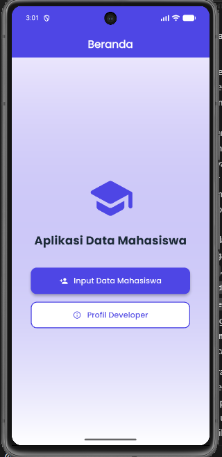
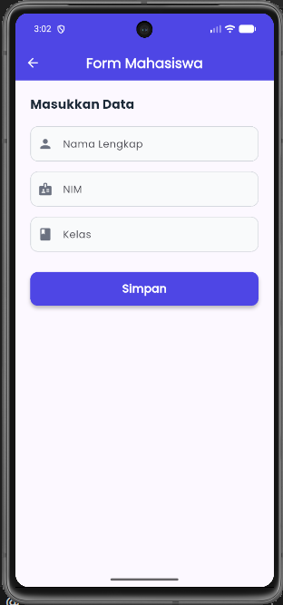
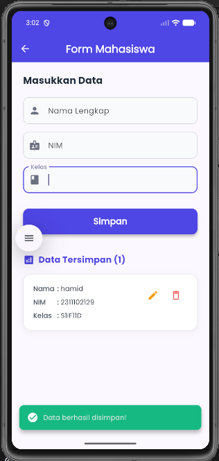
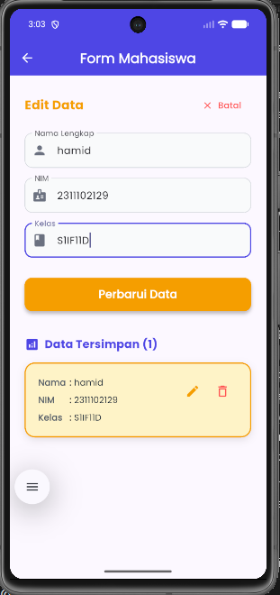
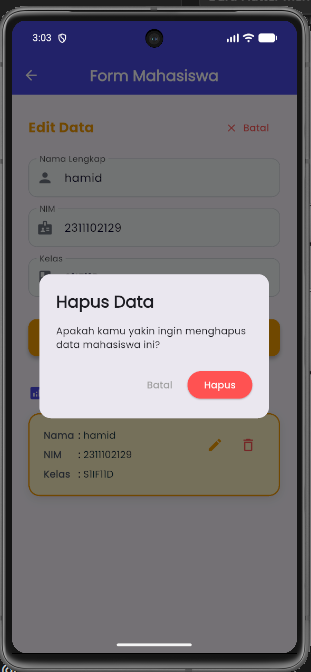
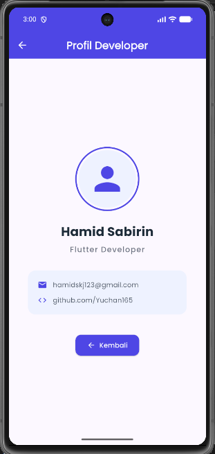

<div align="center">
  <br />
  <h1>LAPORAN PRAKTIKUM <br>APLIKASI BERBASIS PLATFORM</h1>
  <br />
  <h3>MODUL 7<br> NAVIGATION & STATE MANAGEMENT <br>(Aplikasi Data Mahasiswa)</h3>
  <br />
   
  <br />
  <br />
  <br />
  <h3>Disusun Oleh :</h3>
  <p>
    <strong>HAMID SABIRIN</strong><br>
    <strong>2311102129</strong><br>
    <strong>S1 IF-11-REG01</strong>
  </p>
  <br />
  <br />
  <h3>Dosen Pengampu :</h3>
  <p>
    <strong>Dimas Fanny Hebrasianto Permadi, S.ST., M.Kom</strong>
  </p>
  <br />
  <br />
    <h4>Asisten Praktikum :</h4>
    <strong> Apri Pandu Wicaksono </strong> <br>
    <strong>Rangga Pradarrell Fathi</strong>
  <br />
  <h3>LABORATORIUM HIGH PERFORMANCE
 <br>FAKULTAS INFORMATIKA <br>UNIVERSITAS TELKOM PURWOKERTO <br>2026</h3>
</div>

---

## 1. Dasar Teori

### 1.1 Flutter
Flutter adalah framework UI dari Google untuk membuat aplikasi mobile (Android/iOS) menggunakan bahasa Dart. Flutter menerapkan konsep widget sebagai komponen utama untuk membangun tampilan.

### 1.2 StatelessWidget dan StatefulWidget
**StatelessWidget** adalah widget yang tampilannya tidak berubah selama runtime (tanpa state internal). Cocok untuk halaman yang sifatnya statis seperti halaman profil atau beranda awal.

**StatefulWidget** adalah widget yang memiliki state (data) yang dapat berubah dan menyebabkan UI melakukan *rebuild*. Cocok untuk halaman form input dan halaman yang menampilkan data dinamis secara langsung.

### 1.3 Navigator (Navigator.push & Navigator.pop)
Navigator digunakan untuk perpindahan halaman (routing) pada Flutter.
- `Navigator.push()` digunakan untuk berpindah ke halaman baru (menumpuk halaman di atas).
- `Navigator.pop()` digunakan untuk kembali ke halaman sebelumnya (menghapus halaman teratas).

### 1.4 Form, TextField, dan Validasi
TextField digunakan untuk mengelola input teks pengguna. Input dapat divalidasi dengan mengecek apakah nilai di dalamnya kosong (`.isEmpty`) sebelum diizinkan untuk disimpan ke dalam struktur data.

### 1.5 SnackBar
SnackBar adalah komponen notifikasi singkat yang muncul di bagian bawah layar untuk memberikan informasi kepada pengguna, misalnya saat data berhasil disimpan, diperbarui, atau dihapus.

### 1.6 Google Fonts
Package `google_fonts` digunakan untuk menerapkan font Google secara mudah pada aplikasi Flutter agar tampilan lebih menarik, modern, dan konsisten.

### 1.7 Widget yang digunakan
Aplikasi ini menggunakan beberapa widget utama:
- **AppBar**: menampilkan judul halaman.
- **Container**: sebagai kotak dekorasi UI (warna, *border radius*, *shadow*).
- **Column**: menyusun widget secara vertikal ke bawah.
- **ElevatedButton**: tombol utama berbayang (misal tambah data, simpan).
- **Icon**: ikon pada tombol, *form*, dan *list data* (bonus).
- **Map & List**: mengelola koleksi data mahasiswa dalam memori.

---

## 2. Implementasi Program

### 2.1 Deskripsi Aplikasi
Aplikasi bertema “Data Mahasiswa” ini memiliki 3 halaman utama:
1. **Home**: menampilkan tombol navigasi menuju Form Mahasiswa dan Profil Developer.
2. **Form Mahasiswa**: berisi input Nama, NIM, Kelas, beserta tombol Simpan, serta list riwayat data di bawahnya (mendukung fitur Edit dan Hapus).
3. **Profil Developer**: menampilkan informasi statis pembuat aplikasi.

Saat tombol **Simpan** ditekan:
- Sistem melakukan pengecekan apakah form kosong.
- Menyimpan data ke dalam sebuah *List* lokal.
- Menampilkan SnackBar notifikasi berhasil.
- Mereset/mengosongkan form input.

### 2.2 Struktur Halaman

**A. Home Page (StatelessWidget)**
Halaman Home bersifat statis, tugas utamanya adalah memberikan tombol navigasi menggunakan `Navigator.push()` untuk berpindah ke halaman Form atau Profil.

**B. Form Mahasiswa (StatefulWidget)**
Form dibuat menggunakan StatefulWidget karena menangani input dari `TextEditingController`, mengelola data *List* untuk riwayat, serta mengubah state UI setiap kali ada data yang disimpan, diedit, atau dihapus. Fitur utama:
- Input: Nama, NIM, Kelas.
- Logika CRUD ringan (Tambah, Edit, Hapus data dari List).
- `SnackBar` notifikasi sukses.

**C. Profil Developer (StatelessWidget)**
Halaman Profil bersifat statis dan berisi informasi teks beserta tombol "Kembali" yang menjalankan perintah `Navigator.pop(context)`.

---

## 3. Code & Penjelasan

### 3.1 `pubspec.yaml` (Google Fonts)
Menambahkan *package* Google Fonts ke dalam dependensi aplikasi:
```yaml
dependencies:
  flutter:
    sdk: flutter
  google_fonts: ^8.1.0 # Menambahkan package ini
```

### 3.2 `main.dart` (Tema + Home Page)
Mengaktifkan tema aplikasi dengan warna kustom (Indigo & Emerald) dan mendaftarkan font Poppins.
```dart
import 'package:flutter/material.dart';
import 'package:google_fonts/google_fonts.dart';
import 'screens/form_screen.dart';
import 'screens/profile_screen.dart';

void main() => runApp(const MyApp());

class MyApp extends StatelessWidget {
  const MyApp({super.key});

  @override
  Widget build(BuildContext context) {
    return MaterialApp(
      title: 'Data Mahasiswa',
      theme: ThemeData(
        colorScheme: ColorScheme.fromSeed(seedColor: const Color(0xFF4F46E5)),
        textTheme: GoogleFonts.poppinsTextTheme(), // Menerapkan Google Fonts
      ),
      home: const HomeScreen(),
    );
  }
}
```

### 3.3 Navigasi di `HomeScreen` (`main.dart`)
Ketika tombol "Input Data Mahasiswa" ditekan, fungsi `Navigator.push` akan dijalankan.
```dart
ElevatedButton(
  onPressed: () {
    Navigator.push(
      context,
      MaterialPageRoute(builder: (context) => const FormScreen()),
    );
  },
  child: const Text('Input Data Mahasiswa'),
)
```

### 3.4 `form_screen.dart` (Logika Simpan & SnackBar)
Melakukan validasi teks, mengubah isi list, dan menampilkan SnackBar.
```dart
void _simpanData() {
  if (_namaController.text.isEmpty || _nimController.text.isEmpty || _kelasController.text.isEmpty) {
    // Validasi kosong
    return;
  }

  setState(() {
    // Menambah data ke dalam list
    _listMahasiswa.add({
      'nama': _namaController.text,
      'nim': _nimController.text,
      'kelas': _kelasController.text,
    });
    
    // Mengosongkan form
    _namaController.clear();
  });

  // Memunculkan notifikasi
  ScaffoldMessenger.of(context).showSnackBar(
    const SnackBar(content: Text('Data berhasil disimpan!')),
  );
}
```

### 3.5 `profile_screen.dart` (Navigator.pop)
Menerapkan tombol untuk kembali ke halaman sebelumnya.
```dart
ElevatedButton.icon(
  onPressed: () {
    Navigator.pop(context); // Kembali ke halaman utama
  },
  icon: const Icon(Icons.arrow_back),
  label: const Text('Kembali'),
)
```

---

## 4. Hasil Tampilan (*Output*)

Berikut adalah tangkapan layar (screenshot) hasil eksekusi aplikasi Data Mahasiswa:

### A. Halaman Beranda (Home)


### B. Halaman Form Mahasiswa (Tampilan Awal)


### C. Halaman Form Mahasiswa (Berhasil Tambah Data)


### D. Halaman Form Mahasiswa (Mode Edit Data)


### E. Halaman Form Mahasiswa (Konfirmasi Hapus Data)


### F. Halaman Profil Developer

