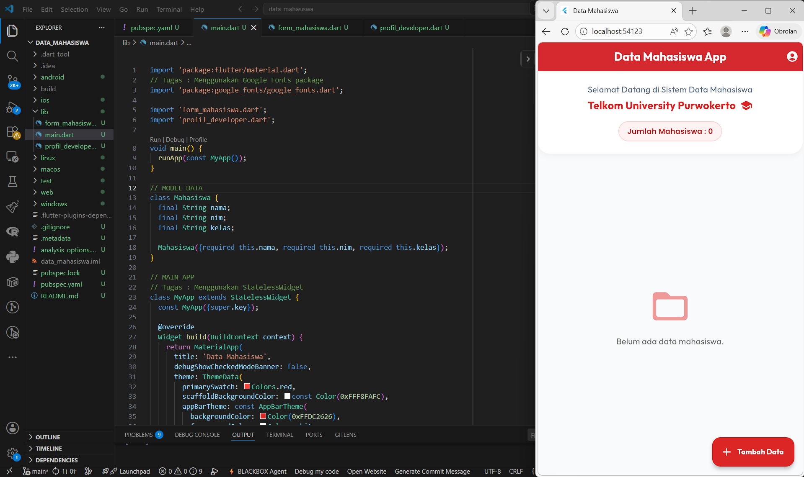
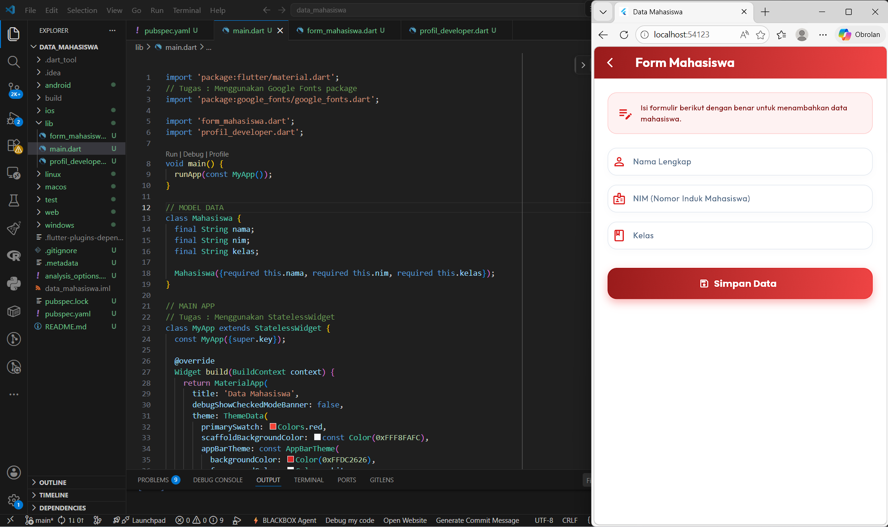
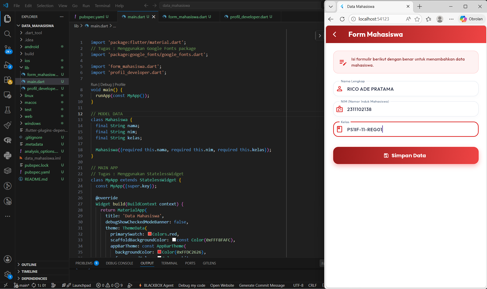
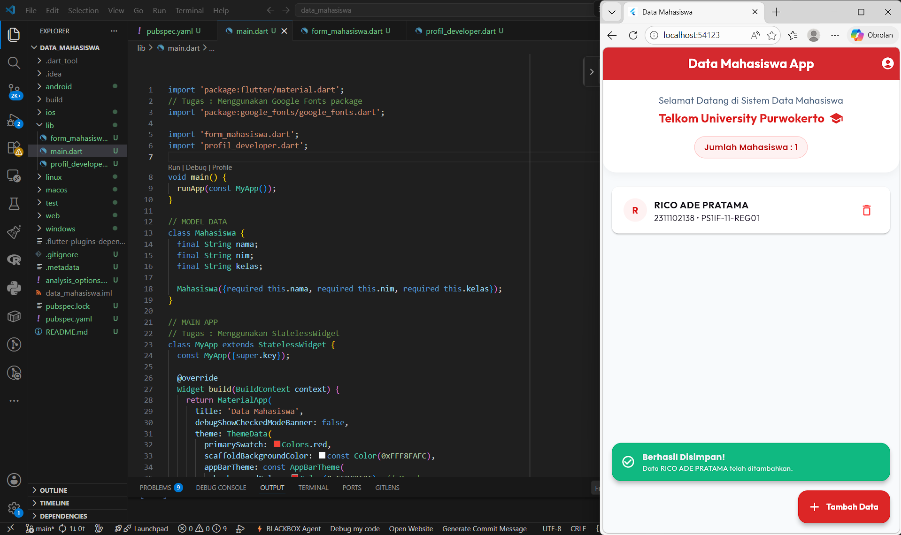
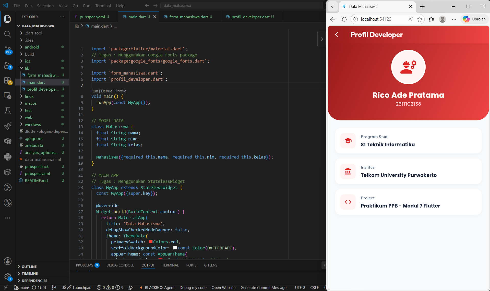
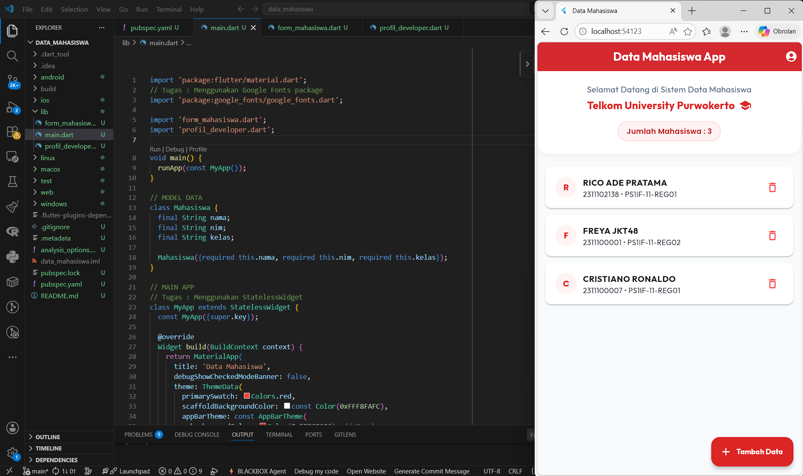
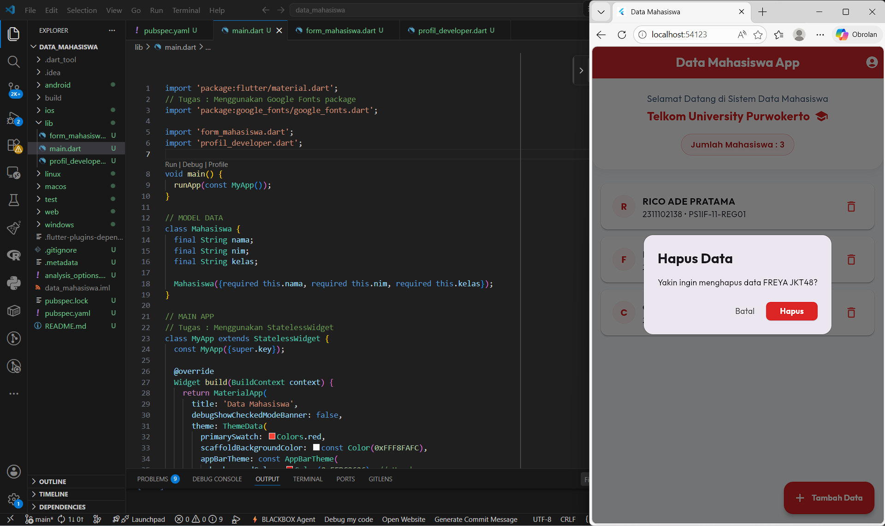
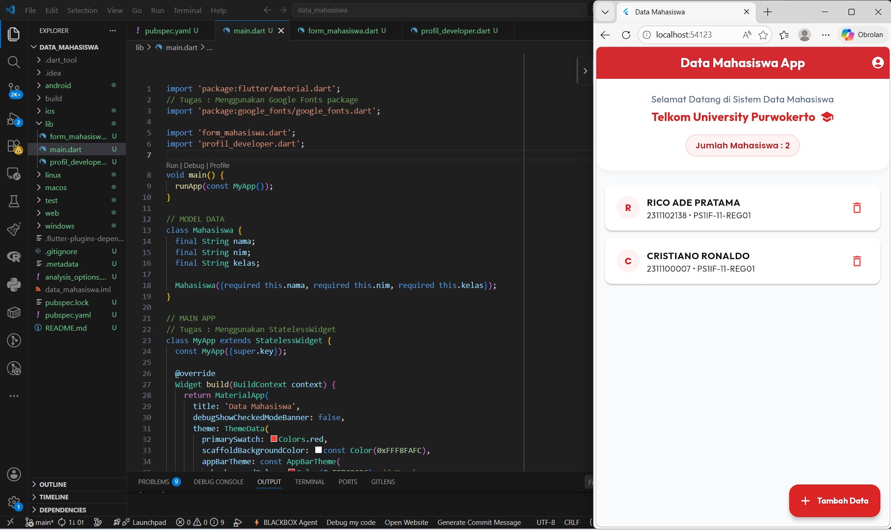

<div align="center">
   <h2>LAPORAN PRAKTIKUM<br>APLIKASI BERBASIS PLATFORM</h2>
   <h>
   <br>
   <h4>MODUL 07 Mobile<br>Data Mahasiswa</h4>
   <br>
   
   <br><br>
 
**Disusun Oleh :**<br>
RICO ADE PRATAMA<br>
2311102138<br>
PS1IF-11-REG01
<br><br>
 
**Dosen Pengampu :**<br>
Dimas Fanny Hebrasianto Permadi, S.ST., M.Kom
<br><br>
 
**Assisten Praktikum :**<br>
Apri Pandu Wicaksono
<br>Rangga Pradarrell Fathi
<br><br>
 
PROGRAM STUDI S1 TEKNIK INFORMATIKA<br>
FAKULTAS INFORMATIKA<br>
UNIVERSITAS TELKOM PURWOKERTO<br>
2026

</div>

---

## 1. Dasar Teori

1. **StatelessWidget** : adalah _widget_ statis yang tidak dapat mengubah tampilannya setelah dirender. Digunakan untuk menampilkan elemen antarmuka yang kontennya bersifat tetap, seperti teks statis atau halaman profil.

2. **StatefulWidget** : adalah _widget_ dinamis yang dapat menyimpan dan memperbarui status (_state_) internalnya. Digunakan pada elemen antarmuka yang memerlukan perubahan tampilan secara _real-time_, seperti pembaruan indikator jumlah data pada formulir.

3. **Navigator.push & Navigator.pop** : adalah metode navigasi antarlayar berbasis tumpukan (_stack_). `Navigator.push` berfungsi untuk menambahkan layar baru ke atas tumpukan, sedangkan `Navigator.pop` berfungsi untuk menghapus layar teratas guna kembali ke layar sebelumnya.

4. **Google Fonts package** : adalah pustaka eksternal yang memungkinkan pengembang mengintegrasikan berbagai jenis huruf (_font_) secara dinamis dari peladen (_server_) Google tanpa perlu mengunduh berkas fisik ke dalam proyek.

5. **AppBar** : adalah bilah navigasi utama yang terletak di bagian paling atas layar, berfungsi untuk menempatkan judul halaman, menu, dan ikon aksi tambahan.

6. **Container** : adalah _widget_ pembungkus multiguna yang digunakan untuk mengatur tata letak, ukuran, jarak (_margin/padding_), warna latar belakang, serta gaya dekorasi (_border radius_) dari elemen di dalamnya.

7. **Column** : adalah _widget_ tata letak yang berfungsi untuk menyusun sekumpulan elemen anak (_children_) secara berurutan dalam satu garis vertikal (dari atas ke bawah).

8. **ElevatedButton** : adalah komponen antarmuka berupa tombol interaktif dari _Material Design_ yang memiliki efek elevasi (timbul) visual, berfungsi untuk memicu eksekusi sebuah perintah atau aksi.

## 2. Kode Program Unguided

Tugas Praktik Modul 7 - Flutter
Buat aplikasi sederhana bertema "Data Mahasiswa" dengan ketentuan:

1. Memiliki 3 halaman:

- Home
- Form Mahasiswa
- Profil Developer

2. Form berisi:

- Nama
- NIM
- Kelas

3. Tambahkan tombol Simpan untuk menampilkan data yang diinput.

4. Saat tombol ditekan, tampilkan SnackBar sebagai notifikasi berhasil.

5. Gunakan:

- StatefulWidget
- StatelessWidget
- Navigator.push & Navigator.pop
- Google Fonts package

6. Tambahkan minimal:

- AppBar
- Container
- Column
- ElevatedButton

7. Bonus

- Icon
- Tema warna menarik

8. Output
   Aplikasi dapat berpindah halaman, menampilkan data mahasiswa, dan menampilkan notifikasi SnackBar.

### Struktur Project

```php
modul_05_06_mobile/  # Folder utama proyek Flutter
├── lib/                          # Direktori utama penyimpanan kode Dart
│   ├── form_mahasiswa.dart       # Halaman form untuk menginput data mahasiswa
│   ├── main.dart                 # Titik awal eksekusi program & Halaman Beranda
│   └── profil_developer.dart     # Halaman informasi profil developer
├── pubspec.yaml                  # File konfigurasi dependensi (tempat mendaftarkan google_fonts)
```

### Kode main.dart (Folder lib)

```dart
import 'package:flutter/material.dart';
// Tugas : Menggunakan Google Fonts package
import 'package:google_fonts/google_fonts.dart';

import 'form_mahasiswa.dart';
import 'profil_developer.dart';

void main() {
  runApp(const MyApp());
}

// MODEL DATA
class Mahasiswa {
  final String nama;
  final String nim;
  final String kelas;

  Mahasiswa({required this.nama, required this.nim, required this.kelas});
}

// MAIN APP
// Tugas : Menggunakan StatelessWidget
class MyApp extends StatelessWidget {
  const MyApp({super.key});

  @override
  Widget build(BuildContext context) {
    return MaterialApp(
      title: 'Data Mahasiswa',
      debugShowCheckedModeBanner: false,
      theme: ThemeData(
        primarySwatch: Colors.red,
        scaffoldBackgroundColor: const Color(0xFFF8FAFC),
        appBarTheme: const AppBarTheme(
          backgroundColor: Color(0xFFDC2626), // Merah
          foregroundColor: Colors.white,
          elevation: 2,
        ),
      ),
      home: const HomeScreen(),
    );
  }
}

// HOME SCREEN
// Tugas : Menggunakan StatefulWidget
class HomeScreen extends StatefulWidget {
  const HomeScreen({super.key});

  @override
  State<HomeScreen> createState() => _HomeScreenState();
}

class _HomeScreenState extends State<HomeScreen> {
  final List<Mahasiswa> _mahasiswaList = [];

  void _navigateAndAddStudent() async {
    // Tugas : Menggunakan Navigator.push (Berpindah Halaman)
    final result = await Navigator.push(
      context,
      MaterialPageRoute(builder: (context) => const StudentFormScreen()),
    );

    if (result != null && result is Mahasiswa) {
      setState(() {
        _mahasiswaList.add(result);
      });
    }
  }

  // Fungsi untuk menghapus data mahasiswa
  void _hapusMahasiswa(int index) {
    showDialog(
      context: context,
      builder: (BuildContext context) {
        return AlertDialog(
          shape: RoundedRectangleBorder(
            borderRadius: BorderRadius.circular(16),
          ),
          title: Text(
            'Hapus Data',
            style: GoogleFonts.outfit(fontWeight: FontWeight.bold),
          ),
          content: Text(
            'Yakin ingin menghapus data ${_mahasiswaList[index].nama}?',
            style: GoogleFonts.outfit(),
          ),
          actions: [
            TextButton(
              onPressed: () => Navigator.pop(context),
              child: Text(
                'Batal',
                style: GoogleFonts.outfit(color: Colors.grey[700]),
              ),
            ),
            ElevatedButton(
              style: ElevatedButton.styleFrom(
                backgroundColor: const Color(0xFFDC2626),
                shape: RoundedRectangleBorder(
                  borderRadius: BorderRadius.circular(8),
                ),
              ),
              onPressed: () {
                final namaTerhapus = _mahasiswaList[index].nama;
                setState(() {
                  _mahasiswaList.removeAt(index);
                });

                Navigator.pop(context);

                ScaffoldMessenger.of(context).showSnackBar(
                  SnackBar(
                    content: Text(
                      '$namaTerhapus berhasil dihapus.',
                      style: GoogleFonts.outfit(),
                    ),
                    backgroundColor: Colors.red[800],
                    behavior: SnackBarBehavior.floating,
                    duration: const Duration(seconds: 2),
                  ),
                );
              },
              child: Text(
                'Hapus',
                style: GoogleFonts.outfit(
                  color: Colors.white,
                  fontWeight: FontWeight.bold,
                ),
              ),
            ),
          ],
        );
      },
    );
  }

  @override
  Widget build(BuildContext context) {
    return Scaffold(
      appBar: AppBar(
        title: Text(
          'Data Mahasiswa App',
          // Tugas : Menggunakan Google Fonts package
          style: GoogleFonts.outfit(fontWeight: FontWeight.bold),
        ),
        centerTitle: true,
        actions: [
          IconButton(
            icon: const Icon(Icons.account_circle),
            onPressed: () {
              // Tugas : Menggunakan Navigator.push (Berpindah Halaman)
              Navigator.push(
                context,
                MaterialPageRoute(builder: (context) => const ProfileScreen()),
              );
            },
          ),
        ],
      ),
      body: SafeArea(
        child: Column(
          crossAxisAlignment: CrossAxisAlignment.stretch,
          children: [
            Container(
              padding: const EdgeInsets.symmetric(vertical: 24, horizontal: 20),
              decoration: const BoxDecoration(
                color: Colors.white,
                borderRadius: BorderRadius.only(
                  bottomLeft: Radius.circular(24),
                  bottomRight: Radius.circular(24),
                ),
                boxShadow: [
                  BoxShadow(
                    color: Color(0x0C000000),
                    blurRadius: 10,
                    offset: Offset(0, 4),
                  ),
                ],
              ),
              child: Column(
                children: [
                  Text(
                    'Selamat Datang di Sistem Data Mahasiswa',
                    style: GoogleFonts.outfit(
                      fontSize: 16,
                      color: const Color(0xFF64748B),
                    ),
                    textAlign: TextAlign.center,
                  ),
                  const SizedBox(height: 4),
                  Row(
                    mainAxisAlignment: MainAxisAlignment.center,
                    children: [
                      Text(
                        'Telkom University Purwokerto',
                        style: GoogleFonts.outfit(
                          fontSize: 20,
                          fontWeight: FontWeight.bold,
                          color: const Color(0xFFDC2626),
                        ),
                        textAlign: TextAlign.center,
                      ),
                      const SizedBox(width: 8),
                      const Icon(
                        Icons.school,
                        color: Color(0xFFDC2626),
                        size: 24,
                      ),
                    ],
                  ),
                  const SizedBox(height: 16),
                  Container(
                    padding: const EdgeInsets.symmetric(
                      horizontal: 16,
                      vertical: 8,
                    ),
                    decoration: BoxDecoration(
                      color: const Color(0xFFFEF2F2),
                      borderRadius: BorderRadius.circular(20),
                      border: Border.all(color: const Color(0xFFFECACA)),
                    ),
                    child: Text(
                      'Jumlah Mahasiswa : ${_mahasiswaList.length}',
                      style: GoogleFonts.poppins(
                        fontSize: 14,
                        fontWeight: FontWeight.w600,
                        color: const Color(0xFFB91C1C),
                      ),
                    ),
                  ),
                ],
              ),
            ),

            const SizedBox(height: 8),

            // DAFTAR MAHASISWA
            Expanded(
              child: _mahasiswaList.isEmpty
                  ? Center(
                      child: Column(
                        mainAxisAlignment: MainAxisAlignment.center,
                        children: [
                          Icon(
                            Icons.folder_open_rounded,
                            size: 80,
                            color: Colors.red[200],
                          ),
                          const SizedBox(height: 16),
                          Text(
                            'Belum ada data mahasiswa.',
                            style: GoogleFonts.outfit(
                              fontSize: 16,
                              color: Colors.grey[600],
                            ),
                          ),
                        ],
                      ),
                    )
                  : ListView.builder(
                      padding: const EdgeInsets.all(16),
                      itemCount: _mahasiswaList.length,
                      itemBuilder: (context, index) {
                        final mhs = _mahasiswaList[index];
                        return Card(
                          margin: const EdgeInsets.only(bottom: 12),
                          elevation: 2,
                          color: Colors.white,
                          shape: RoundedRectangleBorder(
                            borderRadius: BorderRadius.circular(12),
                          ),
                          child: ListTile(
                            contentPadding: const EdgeInsets.symmetric(
                              horizontal: 20,
                              vertical: 8,
                            ),
                            leading: CircleAvatar(
                              backgroundColor: const Color(0xFFFEF2F2),
                              child: Text(
                                mhs.nama[0].toUpperCase(),
                                style: GoogleFonts.poppins(
                                  color: const Color(0xFFDC2626),
                                  fontWeight: FontWeight.bold,
                                ),
                              ),
                            ),
                            title: Text(
                              mhs.nama,
                              style: GoogleFonts.outfit(
                                fontWeight: FontWeight.bold,
                              ),
                            ),
                            subtitle: Text(
                              '${mhs.nim} • ${mhs.kelas}',
                              style: GoogleFonts.outfit(),
                            ),

                            trailing: IconButton(
                              icon: const Icon(
                                Icons.delete_outline_rounded,
                                color: Colors.redAccent,
                              ),
                              onPressed: () => _hapusMahasiswa(index),
                            ),
                          ),
                        );
                      },
                    ),
            ),
          ],
        ),
      ),
      floatingActionButton: FloatingActionButton.extended(
        onPressed: _navigateAndAddStudent,
        backgroundColor: const Color(0xFFDC2626),
        icon: const Icon(Icons.add, color: Colors.white),
        label: Text(
          'Tambah Data',
          style: GoogleFonts.outfit(
            color: Colors.white,
            fontWeight: FontWeight.bold,
          ),
        ),
      ),
    );
  }
}

```

### Penjelasan Kode

Pada kode **main.dart** ini merupakan titik utama saat aplikasi pertama kali dijalankan. Fungsi `main()` memanggil `runApp()` untuk merekatkan widget utama bernama `MyApp` ke layar. `MyApp` sendiri dikonfigurasi sebagai sebuah `MaterialApp` yang berfungsi mengatur identitas aplikasi, menentukan tema warna Menarik, serta menentukan bahwa halaman pertama yang akan langsung dilihat oleh pengguna saat membuka aplikasi adalah halaman `HomeScreen`. Di dalam file ini juga digabungkan antarmuka `HomeScreen` yang menggunakan `StatefulWidget` agar dapat menampilkan daftar mahasiswa dan memperbarui _badge_ jumlah data secara dinamis. Di dalamnya terdapat tombol navigasi utama yang memanfaatkan `Navigator.push()` untuk mengarahkan pengguna menuju halaman pengisian form maupun halaman profil pembuat aplikasi.

### Kode form_mahasiswa.dart (Folder lib)

```dart
import 'package:flutter/material.dart';
// Tugas : Menggunakan Google Fonts package
import 'package:google_fonts/google_fonts.dart';

import 'main.dart';

// Tugas : Menggunakan StatefulWidget
class StudentFormScreen extends StatefulWidget {
  const StudentFormScreen({super.key});

  @override
  State<StudentFormScreen> createState() => _StudentFormScreenState();
}

class _StudentFormScreenState extends State<StudentFormScreen> {
  final _formKey = GlobalKey<FormState>();
  final _namaController = TextEditingController();
  final _nimController = TextEditingController();
  final _kelasController = TextEditingController();

  @override
  void dispose() {
    _namaController.dispose();
    _nimController.dispose();
    _kelasController.dispose();
    super.dispose();
  }

  void _simpanData() {
    if (_formKey.currentState!.validate()) {
      final newStudent = Mahasiswa(
        nama: _namaController.text.trim(),
        nim: _nimController.text.trim(),
        kelas: _kelasController.text.trim(),
      );

      ScaffoldMessenger.of(context).showSnackBar(
        SnackBar(
          content: Row(
            children: [
              const Icon(Icons.check_circle_outline, color: Colors.white),
              const SizedBox(width: 12),
              Expanded(
                child: Column(
                  crossAxisAlignment: CrossAxisAlignment.start,
                  mainAxisSize: MainAxisSize.min,
                  children: [
                    Text(
                      'Berhasil Disimpan!',
                      // Tugas : Menggunakan Google Fonts package
                      style: GoogleFonts.poppins(
                        fontWeight: FontWeight.bold,
                        fontSize: 14,
                      ),
                    ),
                    Text(
                      'Data ${newStudent.nama} telah ditambahkan.',
                      style: GoogleFonts.outfit(fontSize: 12),
                    ),
                  ],
                ),
              ),
            ],
          ),
          behavior: SnackBarBehavior.floating,
          shape: RoundedRectangleBorder(
            borderRadius: BorderRadius.circular(16),
          ),
          backgroundColor: const Color(0xFF10B981),
          duration: const Duration(seconds: 3),
          margin: const EdgeInsets.all(16),
        ),
      );

      // Tugas : Menggunakan Navigator.pop (Kembali Halaman)
      Navigator.pop(context, newStudent);
    }
  }

  @override
  Widget build(BuildContext context) {
    return Scaffold(
      backgroundColor: const Color(0xFFFFFFFF),
      appBar: AppBar(
        title: Text(
          'Form Mahasiswa',
          style: GoogleFonts.outfit(
            fontWeight: FontWeight.bold,
            color: Colors.white,
          ),
        ),
        leading: IconButton(
          icon: const Icon(
            Icons.arrow_back_ios_new,
            color: Colors.white,
            size: 20,
          ),
          // Tugas : Menggunakan Navigator.pop (Kembali Halaman)
          onPressed: () => Navigator.pop(context),
        ),
        flexibleSpace: Container(
          decoration: const BoxDecoration(
            gradient: LinearGradient(
              colors: [Color(0xFF991B1B), Color(0xFFEF4444)],
              begin: Alignment.topLeft,
              end: Alignment.bottomRight,
            ),
          ),
        ),
        elevation: 4,
      ),
      body: SafeArea(
        child: SingleChildScrollView(
          physics: const BouncingScrollPhysics(),
          padding: const EdgeInsets.all(24),
          child: Column(
            crossAxisAlignment: CrossAxisAlignment.stretch,
            children: [
              Container(
                padding: const EdgeInsets.all(16),
                decoration: BoxDecoration(
                  color: const Color(0xFFFEF2F2),
                  borderRadius: BorderRadius.circular(16),
                  border: Border.all(color: const Color(0xFFFECACA)),
                ),
                child: Row(
                  children: [
                    const Icon(
                      Icons.edit_note,
                      color: Color(0xFFDC2626),
                      size: 28,
                    ),
                    const SizedBox(width: 12),
                    Expanded(
                      child: Text(
                        'Isi formulir berikut dengan benar untuk menambahkan data mahasiswa.',
                        style: GoogleFonts.outfit(
                          fontSize: 13,
                          fontWeight: FontWeight.w500,
                          color: const Color(0xFF7F1D1D),
                        ),
                      ),
                    ),
                  ],
                ),
              ),
              const SizedBox(height: 24),

              Form(
                key: _formKey,
                child: Column(
                  children: [
                    _buildTextFormField(
                      controller: _namaController,
                      label: 'Nama Lengkap',
                      hint: 'Masukkan Nama Lengkap',
                      icon: Icons.person_outline,
                      validator: (value) {
                        if (value == null || value.trim().isEmpty)
                          return 'Nama tidak boleh kosong';
                        if (value.trim().length < 3)
                          return 'Nama minimal 3 karakter';
                        return null;
                      },
                    ),
                    const SizedBox(height: 16),
                    _buildTextFormField(
                      controller: _nimController,
                      label: 'NIM (Nomor Induk Mahasiswa)',
                      hint: 'Masukkan NIM Anda',
                      icon: Icons.badge_outlined,
                      keyboardType: TextInputType.number,
                      validator: (value) {
                        if (value == null || value.trim().isEmpty)
                          return 'NIM tidak boleh kosong';
                        if (value.trim().length < 5)
                          return 'NIM minimal 5 digit';
                        if (!RegExp(r'^[0-9]+$').hasMatch(value.trim()))
                          return 'NIM harus berupa angka';
                        return null;
                      },
                    ),
                    const SizedBox(height: 16),
                    _buildTextFormField(
                      controller: _kelasController,
                      label: 'Kelas',
                      hint: 'Masukkan Kelas Anda',
                      icon: Icons.class_outlined,
                      validator: (value) {
                        if (value == null || value.trim().isEmpty)
                          return 'Kelas tidak boleh kosong';
                        return null;
                      },
                    ),
                    const SizedBox(height: 32),

                    Container(
                      height: 54,
                      width: double.infinity,
                      decoration: BoxDecoration(
                        gradient: const LinearGradient(
                          colors: [Color(0xFF991B1B), Color(0xFFEF4444)],
                          begin: Alignment.topLeft,
                          end: Alignment.bottomRight,
                        ),
                        borderRadius: BorderRadius.circular(16),
                        boxShadow: [
                          BoxShadow(
                            color: const Color(0xFFEF4444).withOpacity(0.4),
                            blurRadius: 12,
                            offset: const Offset(0, 6),
                          ),
                        ],
                      ),
                      child: ElevatedButton.icon(
                        style: ElevatedButton.styleFrom(
                          backgroundColor: Colors.transparent,
                          shadowColor: Colors.transparent,
                          shape: RoundedRectangleBorder(
                            borderRadius: BorderRadius.circular(16),
                          ),
                        ),
                        onPressed: _simpanData,
                        icon: const Icon(
                          Icons.save_outlined,
                          color: Colors.white,
                        ),
                        label: Text(
                          'Simpan Data',
                          style: GoogleFonts.poppins(
                            fontWeight: FontWeight.bold,
                            fontSize: 16,
                            color: Colors.white,
                          ),
                        ),
                      ),
                    ),
                  ],
                ),
              ),
            ],
          ),
        ),
      ),
    );
  }

  Widget _buildTextFormField({
    required TextEditingController controller,
    required String label,
    required String hint,
    required IconData icon,
    TextInputType keyboardType = TextInputType.text,
    required String? Function(String?) validator,
  }) {
    return Container(
      decoration: BoxDecoration(
        color: Colors.white,
        borderRadius: BorderRadius.circular(16),
        boxShadow: [
          BoxShadow(
            color: const Color(0xFF0F172A).withOpacity(0.02),
            blurRadius: 10,
            offset: const Offset(0, 4),
          ),
        ],
      ),
      child: TextFormField(
        controller: controller,
        keyboardType: keyboardType,
        validator: validator,
        style: GoogleFonts.outfit(
          fontSize: 15,
          color: const Color(0xFF1E293B),
          fontWeight: FontWeight.w500,
        ),
        decoration: InputDecoration(
          labelText: label,
          labelStyle: GoogleFonts.outfit(
            color: const Color(0xFF64748B),
            fontSize: 14,
          ),
          hintText: hint,
          hintStyle: GoogleFonts.outfit(
            color: const Color(0xFF94A3B8),
            fontSize: 13,
          ),
          prefixIcon: Icon(icon, color: const Color(0xFFDC2626)),
          border: OutlineInputBorder(
            borderRadius: BorderRadius.circular(16),
            borderSide: const BorderSide(color: Color(0xFFE2E8F0)),
          ),
          enabledBorder: OutlineInputBorder(
            borderRadius: BorderRadius.circular(16),
            borderSide: const BorderSide(color: Color(0xFFE2E8F0)),
          ),
          focusedBorder: OutlineInputBorder(
            borderRadius: BorderRadius.circular(16),
            borderSide: const BorderSide(color: Color(0xFFDC2626), width: 2),
          ),
          errorBorder: OutlineInputBorder(
            borderRadius: BorderRadius.circular(16),
            borderSide: const BorderSide(color: Colors.redAccent),
          ),
          focusedErrorBorder: OutlineInputBorder(
            borderRadius: BorderRadius.circular(16),
            borderSide: const BorderSide(color: Colors.redAccent, width: 2),
          ),
          filled: true,
          fillColor: Colors.white,
          contentPadding: const EdgeInsets.symmetric(
            horizontal: 20,
            vertical: 16,
          ),
        ),
      ),
    );
  }
}

```

### Penjelasan Kode

File untuk kode **form_mahasiswa.dart** ini adalah halaman interaktif yang dirancang untuk menerima input data mahasiswa berupa Nama, NIM, dan Kelas menggunakan komponen `TextFormField`. Karena halaman ini harus mengelola perubahan teks secara dinamis dan membersihkan memori dari teks yang diketik melalui fungsi `dispose()`, maka ia diimplementasikan menggunakan `StatefulWidget`. Ketika tombol "Simpan Data" ditekan, fungsi `_simpanData` akan memeriksa apakah form sudah valid dan tidak ada kolom yang kosong. Jika lengkap, sistem akan memunculkan pesan konfirmasi melayang (`SnackBar`) berwarna hijau yang menandakan keberhasilan, lalu memanggil `Navigator.pop(context)` untuk menutup halaman tersebut sambil mengirimkan data baru ke halaman utama.

### Kode form_mahasiswa.dart (Folder lib)

```dart
import 'package:flutter/material.dart';
// Tugas : Menggunakan Google Fonts package
import 'package:google_fonts/google_fonts.dart';

// Tugas : Menggunakan StatelessWidget
class ProfileScreen extends StatelessWidget {
  const ProfileScreen({super.key});

  @override
  Widget build(BuildContext context) {
    return Scaffold(
      backgroundColor: const Color(0xFFF8FAFC),
      appBar: AppBar(
        title: Text(
          'Profil Developer',
          style: GoogleFonts.outfit(
            fontWeight: FontWeight.bold,
            color: Colors.white,
          ),
        ),
        leading: IconButton(
          icon: const Icon(
            Icons.arrow_back_ios_new,
            color: Colors.white,
            size: 20,
          ),
          // Tugas : Menggunakan Navigator.pop (Kembali Halaman)
          onPressed: () => Navigator.pop(context),
        ),
        flexibleSpace: Container(
          decoration: const BoxDecoration(
            gradient: LinearGradient(
              colors: [Color(0xFF991B1B), Color(0xFFEF4444)],
              begin: Alignment.topLeft,
              end: Alignment.bottomRight,
            ),
          ),
        ),
        elevation: 0,
      ),
      body: Column(
        children: [
          Container(
            width: double.infinity,
            padding: const EdgeInsets.only(bottom: 40, top: 20),
            decoration: const BoxDecoration(
              gradient: LinearGradient(
                colors: [Color(0xFF991B1B), Color(0xFFEF4444)],
                begin: Alignment.topLeft,
                end: Alignment.bottomRight,
              ),
              borderRadius: BorderRadius.only(
                bottomLeft: Radius.circular(40),
                bottomRight: Radius.circular(40),
              ),
            ),
            child: Column(
              children: [
                Container(
                  padding: const EdgeInsets.all(4),
                  decoration: const BoxDecoration(
                    color: Colors.white,
                    shape: BoxShape.circle,
                  ),
                  child: const CircleAvatar(
                    radius: 50,
                    backgroundColor: Color(0xFFFEF2F2),
                    child: Icon(
                      Icons.engineering_rounded,
                      size: 55,
                      color: Color(0xFFDC2626),
                    ),
                  ),
                ),
                const SizedBox(height: 16),
                Text(
                  'Rico Ade Pratama',
                  style: GoogleFonts.poppins(
                    fontSize: 24,
                    fontWeight: FontWeight.bold,
                    color: Colors.white,
                  ),
                ),
                Text(
                  '2311102138',
                  style: GoogleFonts.outfit(
                    fontSize: 16,
                    color: Colors.red[100],
                    fontWeight: FontWeight.w500,
                  ),
                ),
              ],
            ),
          ),

          Expanded(
            child: Padding(
              padding: const EdgeInsets.all(24.0),
              child: Column(
                children: [
                  _buildProfileItem(
                    Icons.school_rounded,
                    'Program Studi',
                    'S1 Teknik Informatika',
                  ),
                  const SizedBox(height: 16),
                  _buildProfileItem(
                    Icons.account_balance_rounded,
                    'Institusi',
                    'Telkom University Purwokerto',
                  ),
                  const SizedBox(height: 16),
                  _buildProfileItem(
                    Icons.code_rounded,
                    'Project',
                    'Praktikum PPB - Modul 7 Flutter',
                  ),
                ],
              ),
            ),
          ),
        ],
      ),
    );
  }

  Widget _buildProfileItem(IconData icon, String title, String value) {
    return Container(
      padding: const EdgeInsets.all(16),
      decoration: BoxDecoration(
        color: Colors.white,
        borderRadius: BorderRadius.circular(16),
        boxShadow: [
          BoxShadow(
            color: Colors.black.withOpacity(0.03),
            blurRadius: 10,
            offset: const Offset(0, 4),
          ),
        ],
      ),
      child: Row(
        children: [
          Container(
            padding: const EdgeInsets.all(12),
            decoration: BoxDecoration(
              color: const Color(0xFFFEF2F2),
              borderRadius: BorderRadius.circular(12),
            ),
            child: Icon(icon, color: const Color(0xFFDC2626), size: 24),
          ),
          const SizedBox(width: 16),
          Expanded(
            child: Column(
              crossAxisAlignment: CrossAxisAlignment.start,
              children: [
                Text(
                  title,
                  style: GoogleFonts.outfit(
                    fontSize: 13,
                    color: const Color(0xFF64748B),
                  ),
                ),
                const SizedBox(height: 4),
                Text(
                  value,
                  style: GoogleFonts.poppins(
                    fontSize: 15,
                    fontWeight: FontWeight.bold,
                    color: const Color(0xFF1E293B),
                  ),
                ),
              ],
            ),
          ),
        ],
      ),
    );
  }
}
```

### Penjelasan Kode

File untuk kode **profil_developer.dart** ini merupakan halaman yang menampilkan informasi biodata dari pengembang aplikasi. Halaman ini menggunakan `StatelessWidget` karena penampilannya bersifat statis dan tidak memerlukan perubahan data secara _real-time_. Tampilan pada file ini dikemas secara menarik menggunakan `CircleAvatar` untuk wadah ikon profil dan dibungkus di dalam sebuah `Container` dengan gradasi warna serta sudut melengkung. Di bagian sudut atas layar (AppBar), disediakan tombol panah kembali yang menjalankan perintah `Navigator.pop(context)` untuk menutup halaman profil tersebut dan mengembalikan pengguna ke halaman beranda dengan cepat.

### Hasil Output dan Contoh Langkah-langkah Penyelesaian

1. Tampilan Halaman Utama (Home)
   
2. Tampilan Halaman Form Mahasiswa (Jika klik tombol Tambah Data di Halaman Utama)
   
3. Isikan data mahasiswa dan klik tombol Simpan Data
   
4. Tampilan Halaman Utama yang sudah ada data mahasiswa yang baru ditambahkan
   
5. Tampilan Halaman Profil Developer (Jika klik tombol Profil di Halaman Utama)
   
6. Hapus data mahasiswa (Jika klik icon tombol Hapus)
   
7. Muncul pop up konfirmasi hapus data mahasiswa
   
8. Tampilan Halaman Utama yang sudah terhapus 1 data mahasiswa
   

## 3. Kesimpulan dan Penutup

Tugas Praktikum Modul 7 ini Membuat Data Mahasiswa menggunakan Flutter. Fokus utamanya adalah penerapan perpindahan antarhalaman melalui metode routing Navigator.push dan Navigator.pop, serta pemahaman perbedaan struktural antara StatelessWidget dan StatefulWidget. Selain itu, modul ini mengintegrasikan elemen antarmuka fundamental seperti tata letak dasar, pemrosesan form input, kustomisasi tipografi via Google Fonts, dan pemunculan notifikasi SnackBar. Cocok digunakan sebagai pembelajaran praktikum bagi mahasiswa program studi Informatika untuk merancang aplikasi mobile.

## 4. Referensi

- [1] [Materi Modul 07 Mobile](https://telkomuniversityofficial-my.sharepoint.com/personal/dimasfhp_telkomuniversity_ac_id/_layouts/15/onedrive.aspx?id=%2Fpersonal%2Fdimasfhp_telkomuniversity_ac_id%2FDocuments%2FAplikasi+Berbasis+Platform%2FMODUL+PRAKTIKUM+Pemrograman+Perangkat+Bergerak+2024.pdf&parent=%2Fpersonal%2Fdimasfhp_telkomuniversity_ac_id%2FDocuments%2FAplikasi+Berbasis+Platform&ga=1)
