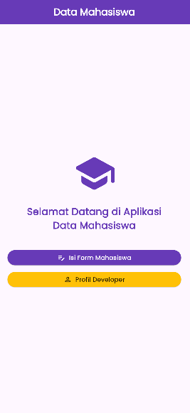
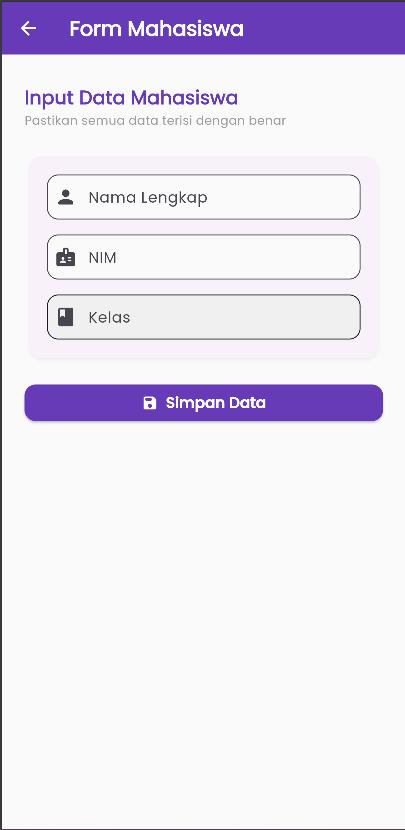
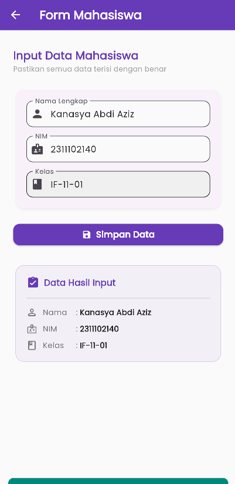
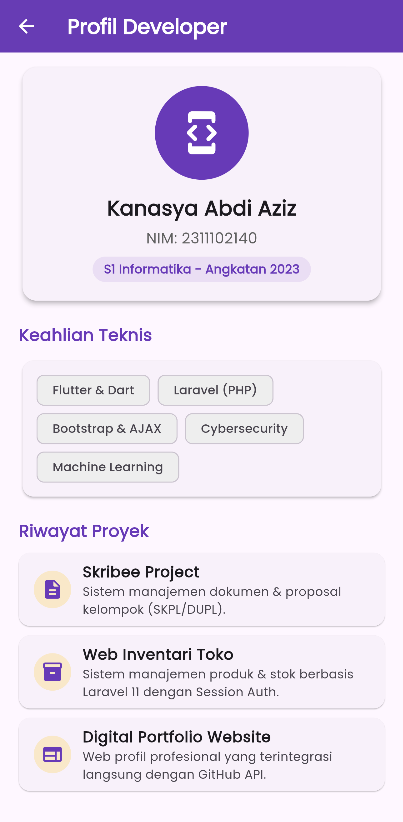

<div align="center">
  <br />
  <h1>LAPORAN PRAKTIKUM <br>APLIKASI BERBASIS PLATFORM</h1>
  <br />
  <h3>TUGAS MODUL 03 & 04 <br> Pengenalan Flutter</h3>
  <br />
  <br />
   
  <br />
  <br />
  <br />
  <br />
  <h3>Disusun Oleh :</h3>
  <p>
    <strong>Kanasya Abdi Aziz</strong><br>
    <strong>2311102140</strong><br>
    <strong>S1 IF-11-01</strong>
  </p>
  <br />
  <br />
  <h3>Dosen Pengampu :</h3>
  <p>
    <strong>Dimas Fanny Hebrasianto Permadi, S.ST., M.Kom</strong>
  </p>
  <br />
  <br />
    <h4>Asisten Praktikum :</h4>
    <strong> Apri Pandu Wicaksono </strong> <br>
    <strong>Rangga Pradarrell Fathi</strong>
  <br />
  <h3>LABORATORIUM HIGH PERFORMANCE
 <br>FAKULTAS INFORMATIKA <br>UNIVERSITAS TELKOM PURWOKERTO <br>2026</h3>
</div>

---
# Aplikasi Data Mahasiswa - Flutter

---

## Dasar Teori
**StatelessWidget** adalah widget yang tetap statis dan tidak berubah selama siklus hidup aplikasi setelah dibuat. Widget ini tidak memiliki "state" di dalamnya yang dapat diubah secara otomatis. Informasi atau parameter yang diterimanya hanya "read-only", yang ditunjukkan oleh variabel instansi final. Widget yang tidak bersifat statis sangat cocok untuk menampilkan elemen antarmuka pengguna yang statis, seperti ikon, label teks, gambar, atau halaman profil yang tidak bereaksi terhadap perubahan data internal.

**StatefulWidget** adalah widget yang tetap statis dan tidak berubah selama siklus hidup aplikasi setelah dibuat. Widget ini tidak memiliki "state" di dalamnya yang dapat diubah secara otomatis. Informasi atau parameter yang diterimanya hanya "read-only", yang ditunjukkan oleh variabel instansi final. Widget yang tidak bersifat statis sangat cocok untuk menampilkan elemen antarmuka pengguna yang statis, seperti ikon, label teks, gambar, atau halaman profil yang tidak bereaksi terhadap perubahan data internal.

Dalam Flutter, navigasi (Navigator.push dan Navigator.pop) adalah alat untuk mengelola navigasi halaman yang bekerja seperti tumpukan (*stack*). Navigator.push memungkinkan untuk menumpuk halaman baru ke atas halaman yang sedang aktif. Halaman sebelumnya tetap dipertahankan di dalam memori di bawah halaman baru tersebut. Dengan menggunakan "Navigator.pop", pengguna dapat kembali ke halaman sebelumnya dengan menghapus halaman paling atas dari tumpukan. Selain itu, kita dapat secara asinkron mengembalikan atau mengirimkan data dari halaman aktif ke halaman pemanggil melalui proses pop ini.

**Google Fonts Package** adalah pustaka eksternal resmi Flutter yang memungkinkan pengembang menerapkan secara dinamis ribuan font yang tersedia di direktori Google Fonts tanpa perlu mengunduh berkas font.ttf atau.otf secara manual ke folder aset proyek. Secara instan, buku ini dapat memuat font atau menyimpannya untuk penggunaan offline, meningkatkan estetika tipografi aplikasi.

**AppBar** adalah bagian antarmuka aplikasi di bagian atas layar yang biasanya mengandung judul halaman, tombol aksi navigasi, dan gradien warna untuk membuatnya terlihat lebih premium.

**Container** adalah widget yang memiliki kemampuan dekorasi seperti warna latar, gradien, bayangan shadow, radius batas, margin, dan padding. Ini memungkinkan Anda menyusun dan memformat layout anak widget-nya dengan mudah.

**Column** adalah widget tata letak yang menyusun widget dari atas ke bawah.

**ElevatedButton** adalah tombol material dengan latar belakang warna yang memiliki efek bayangan halus yang menaikkan tombol untuk menunjukkan bahwa pengguna dapat menekannya.

---

## 1. `main.dart`

```dart
import 'package:flutter/material.dart';
import 'package:google_fonts/google_fonts.dart';
import 'home_page.dart';

void main() {
  runApp(const MyApp());
}

class MyApp extends StatelessWidget {
  const MyApp({super.key});

  @override
  Widget build(BuildContext context) {
    return MaterialApp(
      title: 'Data Mahasiswa',
      debugShowCheckedModeBanner: false,
      // Menggunakan tema warna yang menarik
      theme: ThemeData(
        colorScheme: ColorScheme.fromSeed(
          seedColor: Colors.deepPurple,
          primary: Colors.deepPurple,
          secondary: Colors.amber,
        ),
        textTheme: GoogleFonts.poppinsTextTheme(Theme.of(context).textTheme),
        useMaterial3: true,
      ),
      home: const HomePage(),
    );
  }
}
```

Kode di atas merupakan entry point atau titik awal dari aplikasi Flutter bernama "Data Mahasiswa". Di dalamnya terdapat fungsi utama main() yang bertugas mengeksekusi jalannya aplikasi dengan memanggil widget root bernama MyApp. Widget MyApp ini dibangun menggunakan StatelessWidget karena struktur dasar konfigurasi aplikasinya bersifat statis atau tidak berubah saat aplikasi berjalan. Di dalam method build, widget tersebut mengembalikan sebuah MaterialApp yang berfungsi sebagai wrapper besar untuk mengatur konfigurasi global aplikasi, seperti menonaktifkan banner debug dengan properti debugShowCheckedModeBanner: false dan menentukan bahwa halaman pertama yang akan langsung dibuka saat aplikasi dijalankan adalah HomePage().

Selain mengatur navigasi awal, kode ini juga berfokus pada standarisasi visual aplikasi menggunakan desain modern Material 3. Pengaturan estetika dilakukan melalui properti theme dengan memanfaatkan ColorScheme.fromSeed berbasis warna ungu tua (Colors.deepPurple) sebagai warna utama (primary) dan warna kuning keemasan (Colors.amber) sebagai warna pelengkap (secondary). Terakhir, untuk urusan tipografi, aplikasi ini mengintegrasikan package Google Fonts guna mengubah seluruh gaya teks bawaan aplikasi secara otomatis menjadi font Poppins, sehingga tampilan teks di setiap halaman nantinya terlihat serasi, rapi, dan interaktif.
---

## 2. `home_page.dart`

```dart
import 'package:flutter/material.dart';
import 'form_page.dart';
import 'profile_page.dart';

class HomePage extends StatelessWidget {
  const HomePage({super.key});

  @override
  Widget build(BuildContext context) {
    return Scaffold(
      appBar: AppBar(
        title: const Text(
          'Data Mahasiswa',
          style: TextStyle(fontWeight: FontWeight.bold, color: Colors.white),
        ),
        backgroundColor: Theme.of(context).colorScheme.primary,
        centerTitle: true,
      ),
      body: Container(
        padding: const EdgeInsets.all(20.0),
        child: Column(
          mainAxisAlignment: MainAxisAlignment.center,
          crossAxisAlignment: CrossAxisAlignment.stretch,
          children: [
            // Icon Bonus untuk mempercantik halaman utama
            Icon(
              Icons.school_rounded,
              size: 100,
              color: Theme.of(context).colorScheme.primary,
            ),
            const SizedBox(height: 20),
            Text(
              'Selamat Datang di Aplikasi\nData Mahasiswa',
              textAlign: TextAlign.center,
              style: TextStyle(
                fontSize: 22,
                fontWeight: FontWeight.bold,
                color: Theme.of(context).colorScheme.primary,
              ),
            ),
            const SizedBox(height: 40),

            // Tombol menuju Form Mahasiswa
            ElevatedButton.icon(
              onPressed: () {
                Navigator.push(
                  context,
                  MaterialPageRoute(builder: (context) => const FormPage()),
                );
              },
              icon: const Icon(Icons.edit_note_rounded),
              label: const Text('Isi Form Mahasiswa'),
              style: ElevatedButton.styleFrom(
                padding: const EdgeInsets.symmetric(vertical: 15),
                backgroundColor: Theme.of(context).colorScheme.primary,
                foregroundColor: Colors.white,
              ),
            ),
            const SizedBox(height: 15),

            // Tombol menuju Profil Developer
            ElevatedButton.icon(
              onPressed: () {
                Navigator.push(
                  context,
                  MaterialPageRoute(builder: (context) => const ProfilePage()),
                );
              },
              icon: const Icon(Icons.person_outline_rounded),
              label: const Text('Profil Developer'),
              style: ElevatedButton.styleFrom(
                padding: const EdgeInsets.symmetric(vertical: 15),
                backgroundColor: Theme.of(context).colorScheme.secondary,
                foregroundColor: Colors.black87,
              ),
            ),
          ],
        ),
      ),
    );
  }
}
```

Kode di atas merupakan implementasi dari halaman utama (HomePage) aplikasi yang dibangun menggunakan StatelessWidget. Struktur tampilan halaman ini memanfaatkan widget Scaffold sebagai fondasi dasar, yang menyediakan AppBar di bagian atas dengan judul "Data Mahasiswa" berposisi di tengah (centerTitle: true) serta warna latar belakang yang dinamis mengikuti tema utama aplikasi. Di bagian konten utama (body), seluruh elemen dibungkus menggunakan Container dengan bantalan dalam (padding) sebesar 20 unit untuk memberikan ruang di setiap sisi, kemudian diatur secara vertikal menggunakan widget Column dengan perataan tengah (mainAxisAlignment: MainAxisAlignment.center) dan melebar memenuhi sisi horizontal (crossAxisAlignment: CrossAxisAlignment.stretch).

Di dalam susunan Column tersebut, terdapat beberapa komponen visual dan interaktif yang disusun secara berurutan. Elemen pertama adalah sebuah ikon topi sekolah (Icons.school_rounded) berukuran besar yang berfungsi sebagai visual pemanis, diikuti oleh teks sambutan "Selamat Datang di Aplikasi Data Mahasiswa" yang diberi jarak menggunakan widget SizedBox. Bagian paling krusial dari halaman ini terletak pada dua komponen ElevatedButton.icon di bagian bawah yang berfungsi sebagai sistem kendali navigasi. Ketika tombol pertama ("Isi Form Mahasiswa") atau tombol kedua ("Profil Developer") ditekan, aplikasi akan memicu fungsi Navigator.push yang dipadukan dengan MaterialPageRoute untuk menumpuk halaman baru (FormPage atau ProfilePage) di atas halaman utama, sehingga pengguna dapat berpindah antarhalaman secara mulus dengan animasi bawaan Flutter.
---

## 3. `form_page.dart`

```dart
import 'package:flutter/material.dart';

class FormPage extends StatefulWidget {
  const FormPage({super.key});

  @override
  State<FormPage> createState() => _FormPageState();
}

class _FormPageState extends State<FormPage> {
  final TextEditingController _namaController = TextEditingController();
  final TextEditingController _nimController = TextEditingController();
  final TextEditingController _kelasController = TextEditingController();

  String namaTerinput = '';
  String nimTerinput = '';
  String kelasTerinput = '';

  @override
  void dispose() {
    _namaController.dispose();
    _nimController.dispose();
    _kelasController.dispose();
    super.dispose();
  }

  void _simpanData() {
    setState(() {
      namaTerinput = _namaController.text;
      nimTerinput = _nimController.text;
      kelasTerinput = _kelasController.text;
    });

    ScaffoldMessenger.of(context).showSnackBar(
      SnackBar(
        content: const Row(
          children: [
            Icon(Icons.check_circle_outline_rounded, color: Colors.white),
            SizedBox(width: 12),
            Text(
              'Data Mahasiswa Berhasil Disimpan!',
              style: TextStyle(fontWeight: FontWeight.w500),
            ),
          ],
        ),
        backgroundColor: Colors.teal[600],
        duration: const Duration(seconds: 2),
        behavior: SnackBarBehavior.floating,
        shape: RoundedRectangleBorder(borderRadius: BorderRadius.circular(10)),
      ),
    );
  }

  @override
  Widget build(BuildContext context) {
    return Scaffold(
      appBar: AppBar(
        title: const Text(
          'Form Mahasiswa',
          style: TextStyle(fontWeight: FontWeight.bold),
        ),
        backgroundColor: Theme.of(context).colorScheme.primary,
        foregroundColor: Colors.white,
        elevation: 0,
      ),
      backgroundColor: Colors.grey[50], // Background aplikasi yang lebih soft
      body: SingleChildScrollView(
        padding: const EdgeInsets.symmetric(
          horizontal: 24.0,
          vertical: 32.0,
        ), // Jarak atas diperlebar agar tidak mepet
        child: Column(
          crossAxisAlignment: CrossAxisAlignment.stretch,
          children: [
            // Judul Form
            Text(
              'Input Data Mahasiswa',
              style: TextStyle(
                fontSize: 20,
                fontWeight: FontWeight.bold,
                color: Theme.of(context).colorScheme.primary,
              ),
            ),
            const Text(
              'Pastikan semua data terisi dengan benar',
              style: TextStyle(fontSize: 13, color: Colors.grey),
            ),
            const SizedBox(height: 24),

            // Card Wadah Form agar tampilan terlihat solid dan rapi
            Card(
              elevation: 3,
              shadowColor: Colors.black.withOpacity(0.2),
              shape: RoundedRectangleBorder(
                borderRadius: BorderRadius.circular(16),
              ),
              child: Padding(
                padding: const EdgeInsets.all(20.0),
                child: Column(
                  children: [
                    // Input Nama
                    TextField(
                      controller: _namaController,
                      decoration: InputDecoration(
                        labelText: 'Nama Lengkap',
                        prefixIcon: const Icon(Icons.person_rounded),
                        border: OutlineInputBorder(
                          borderRadius: BorderRadius.circular(12),
                        ),
                        filled: true,
                        fillColor: Colors.grey[50],
                      ),
                    ),
                    const SizedBox(height: 16),

                    // Input NIM
                    TextField(
                      controller: _nimController,
                      keyboardType: TextInputType.number,
                      decoration: InputDecoration(
                        labelText: 'NIM',
                        prefixIcon: const Icon(Icons.badge_rounded),
                        border: OutlineInputBorder(
                          borderRadius: BorderRadius.circular(12),
                        ),
                        filled: true,
                        fillColor: Colors.grey[50],
                      ),
                    ),
                    const SizedBox(height: 16),

                    // Input Kelas
                    TextField(
                      controller: _kelasController,
                      decoration: InputDecoration(
                        labelText: 'Kelas',
                        prefixIcon: const Icon(Icons.class_rounded),
                        border: OutlineInputBorder(
                          borderRadius: BorderRadius.circular(12),
                        ),
                        filled: true,
                        fillColor: Colors.grey[50],
                      ),
                    ),
                  ],
                ),
              ),
            ),
            const SizedBox(height: 24),

            // Tombol Simpan
            ElevatedButton.icon(
              onPressed: _simpanData,
              icon: const Icon(Icons.save_rounded),
              label: const Text(
                'Simpan Data',
                style: TextStyle(fontSize: 16, fontWeight: FontWeight.bold),
              ),
              style: ElevatedButton.styleFrom(
                padding: const EdgeInsets.symmetric(vertical: 16),
                backgroundColor: Theme.of(context).colorScheme.primary,
                foregroundColor: Colors.white,
                shape: RoundedRectangleBorder(
                  borderRadius: BorderRadius.circular(12),
                ),
                elevation: 2,
              ),
            ),
            const SizedBox(height: 32),

            // Tampilan Hasil Input (Hanya muncul jika data diisi)
            if (namaTerinput.isNotEmpty ||
                nimTerinput.isNotEmpty ||
                kelasTerinput.isNotEmpty)
              Card(
                color: Theme.of(context).colorScheme.primary.withOpacity(0.05),
                shape: RoundedRectangleBorder(
                  borderRadius: BorderRadius.circular(16),
                  side: BorderSide(
                    color: Theme.of(
                      context,
                    ).colorScheme.primary.withOpacity(0.2),
                  ),
                ),
                elevation: 0,
                child: Padding(
                  padding: const EdgeInsets.all(20.0),
                  child: Column(
                    crossAxisAlignment: CrossAxisAlignment.start,
                    children: [
                      Row(
                        children: [
                          Icon(
                            Icons.assignment_turned_in_rounded,
                            color: Theme.of(context).colorScheme.primary,
                          ),
                          const SizedBox(width: 8),
                          Text(
                            'Data Hasil Input',
                            style: TextStyle(
                              fontSize: 16,
                              fontWeight: FontWeight.bold,
                              color: Theme.of(context).colorScheme.primary,
                            ),
                          ),
                        ],
                      ),
                      const Padding(
                        padding: EdgeInsets.symmetric(vertical: 8.0),
                        child: Divider(),
                      ),
                      _buildDataRow(
                        Icons.person_outline_rounded,
                        'Nama',
                        namaTerinput,
                      ),
                      const SizedBox(height: 10),
                      _buildDataRow(Icons.badge_outlined, 'NIM', nimTerinput),
                      const SizedBox(height: 10),
                      _buildDataRow(
                        Icons.class_outlined,
                        'Kelas',
                        kelasTerinput,
                      ),
                    ],
                  ),
                ),
              ),
          ],
        ),
      ),
    );
  }

  // Fungsi helper untuk membangun baris data terinput secara rapi
  Widget _buildDataRow(IconData icon, String label, String value) {
    return Row(
      children: [
        Icon(icon, size: 20, color: Colors.grey[600]),
        const SizedBox(width: 10),
        SizedBox(
          width: 60,
          child: Text(
            label,
            style: const TextStyle(
              fontWeight: FontWeight.w500,
              color: Colors.black54,
            ),
          ),
        ),
        const Text(': ', style: TextStyle(color: Colors.black54)),
        Expanded(
          child: Text(
            value,
            style: const TextStyle(
              fontWeight: FontWeight.bold,
              color: Colors.black87,
            ),
          ),
        ),
      ],
    );
  }
}
```

Kode di atas merupakan implementasi halaman FormPage yang dibangun menggunakan StatefulWidget karena memiliki state dinamis untuk menangkap, mengolah, dan menampilkan data masukan pengguna secara langsung (real-time). Di bagian atas kelas state _FormPageState, terdapat tiga variabel TextEditingController (_namaController, _nimController, dan _kelasController) yang berfungsi sebagai pengontrol sekaligus penyadap teks dari setiap kolom input, serta tiga variabel berbasis String untuk menyimpan nilai akhir data mahasiswa yang sukses dimasukkan. Agar tidak terjadi kebocoran memori (memory leak), seluruh pengontrol tersebut wajib dihancurkan saat halaman ditinggalkan melalui pemanggilan metode penutup atau dispose(). Proses pengolahan data difasilitasi oleh fungsi internal _simpanData yang memanfaatkan fungsi setState() guna meredraw layar saat variabel penampung terisi, sekaligus memicu kemunculan sebuah SnackBar melayang (floating) berwarna teal sebagai notifikasi umpan balik sukses yang adaptif.

Sisi visual antarmuka halaman ini didesain menggunakan tata letak Scaffold dengan warna latar belakang abu-abu terang yang dipadukan dengan komponen SingleChildScrollView agar halaman dapat digulirkan dengan lancar jika papan ketik virtual (keyboard) muncul. Seluruh elemen inputan seperti nama, NIM, dan kelas diatur rapat menggunakan Column di dalam sebuah Card melengkung yang elegan, di mana masing-masing bidang diwakili oleh widget TextField lengkap dengan ikon petunjuk dan pembatas kotak (OutlineInputBorder). Di bawah kolom masukan, terdapat sebuah ElevatedButton.icon sebagai tombol eksekusi utama, yang diikuti oleh sebuah kondisi logika if. Kondisi ini memastikan bahwa komponen Card rangkuman data di bagian paling bawah—yang disusun menggunakan fungsi pembantu (helper method) _buildDataRow berpenampilan rapi—hanya akan dirender dan ditampilkan ke layar jika pengguna telah menekan tombol simpan dan mengisi minimal salah satu data mahasiswa tersebut.

---

## 4. `profil_page.dart`

```dart
import 'package:flutter/material.dart';

class ProfilePage extends StatelessWidget {
  const ProfilePage({super.key});

  @override
  Widget build(BuildContext context) {
    return Scaffold(
      appBar: AppBar(
        title: const Text(
          'Profil Developer',
          style: TextStyle(fontWeight: FontWeight.bold),
        ),
        backgroundColor: Theme.of(context).colorScheme.primary,
        foregroundColor: Colors.white,
      ),
      body: SingleChildScrollView(
        padding: const EdgeInsets.all(20.0),
        child: Column(
          crossAxisAlignment: CrossAxisAlignment.stretch,
          children: [
            // 1. Header Profil Card
            Card(
              elevation: 4,
              shape: RoundedRectangleBorder(
                borderRadius: BorderRadius.circular(15),
              ),
              child: Padding(
                padding: const EdgeInsets.all(20.0),
                child: Column(
                  children: [
                    CircleAvatar(
                      radius: 50,
                      backgroundColor: Theme.of(context).colorScheme.primary,
                      child: const Icon(
                        Icons.developer_mode_rounded,
                        size: 50,
                        color: Colors.white,
                      ),
                    ),
                    const SizedBox(height: 15),
                    const Text(
                      'Kanasya Abdi Aziz',
                      style: TextStyle(
                        fontSize: 22,
                        fontWeight: FontWeight.bold,
                      ),
                    ),
                    const SizedBox(height: 5),
                    Text(
                      'NIM: 2311102140',
                      style: TextStyle(
                        fontSize: 16,
                        color: Colors.grey[700],
                        fontWeight: FontWeight.w500,
                      ),
                    ),
                    const SizedBox(height: 8),
                    Container(
                      padding: const EdgeInsets.symmetric(
                        horizontal: 12,
                        vertical: 4,
                      ),
                      decoration: BoxDecoration(
                        color: Theme.of(
                          context,
                        ).colorScheme.primary.withOpacity(0.1),
                        borderRadius: BorderRadius.circular(20),
                      ),
                      child: Text(
                        'S1 Informatika - Angkatan 2023',
                        style: TextStyle(
                          fontSize: 13,
                          fontWeight: FontWeight.bold,
                          color: Theme.of(context).colorScheme.primary,
                        ),
                      ),
                    ),
                  ],
                ),
              ),
            ),
            const SizedBox(height: 20),

            // 2. Bagian Keahlian Teknis (Skills)
            Text(
              'Keahlian Teknis',
              style: TextStyle(
                fontSize: 18,
                fontWeight: FontWeight.bold,
                color: Theme.of(context).colorScheme.primary,
              ),
            ),
            const SizedBox(height: 10),
            Card(
              elevation: 2,
              child: Padding(
                padding: const EdgeInsets.all(15.0),
                child: Wrap(
                  spacing: 8.0,
                  runSpacing: 8.0,
                  children: const [
                    SkillChip(label: 'Flutter & Dart'),
                    SkillChip(label: 'Laravel (PHP)'),
                    SkillChip(label: 'Bootstrap & AJAX'),
                    SkillChip(label: 'Cybersecurity'),
                    SkillChip(label: 'Machine Learning'),
                  ],
                ),
              ),
            ),
            const SizedBox(height: 20),

            // 3. Bagian Riwayat Proyek (Projects)
            Text(
              'Riwayat Proyek',
              style: TextStyle(
                fontSize: 18,
                fontWeight: FontWeight.bold,
                color: Theme.of(context).colorScheme.primary,
              ),
            ),
            const SizedBox(height: 10),

            const ProjectTile(
              title: 'Skribee Project',
              subtitle:
                  'Sistem manajemen dokumen & proposal kelompok (SKPL/DUPL).',
              icon: Icons.description_rounded,
            ),
            const ProjectTile(
              title: 'Web Inventari Toko',
              subtitle:
                  'Sistem manajemen produk & stok berbasis Laravel 11 dengan Session Auth.',
              icon: Icons.inventory_2_rounded,
            ),
            const ProjectTile(
              title: 'Digital Portfolio Website',
              subtitle:
                  'Web profil profesional yang terintegrasi langsung dengan GitHub API.',
              icon: Icons.web_rounded,
            ),

            const SizedBox(height: 30),

            // 4. Tombol Kembali
            ElevatedButton.icon(
              onPressed: () {
                Navigator.pop(context);
              },
              icon: const Icon(Icons.arrow_back),
              label: const Text('Kembali ke Home'),
              style: ElevatedButton.styleFrom(
                padding: const EdgeInsets.symmetric(vertical: 15),
                backgroundColor: Colors.grey[800],
                foregroundColor: Colors.white,
                shape: RoundedRectangleBorder(
                  borderRadius: BorderRadius.circular(10),
                ),
              ),
            ),
          ],
        ),
      ),
    );
  }
}

// Widget Pendukung Kecil untuk Badge Skill (Stateless)
class SkillChip extends StatelessWidget {
  final String label;
  const SkillChip({super.key, required this.label});

  @override
  Widget build(BuildContext context) {
    return Chip(
      label: Text(label, style: const TextStyle(fontSize: 13)),
      backgroundColor: Colors.grey[200],
      shape: RoundedRectangleBorder(borderRadius: BorderRadius.circular(8)),
    );
  }
}

// Widget Pendukung Kecil untuk List Proyek (Stateless)
class ProjectTile extends StatelessWidget {
  final String title;
  final String subtitle;
  final IconData icon;

  const ProjectTile({
    super.key,
    required this.title,
    required this.subtitle,
    required this.icon,
  });

  @override
  Widget build(BuildContext context) {
    return Card(
      margin: const EdgeInsets.only(bottom: 10),
      elevation: 1,
      child: ListTile(
        leading: CircleAvatar(
          backgroundColor: Theme.of(
            context,
          ).colorScheme.secondary.withOpacity(0.2),
          child: Icon(icon, color: Theme.of(context).colorScheme.primary),
        ),
        title: Text(title, style: const TextStyle(fontWeight: FontWeight.bold)),
        subtitle: Text(subtitle, style: const TextStyle(fontSize: 13)),
      ),
    );
  }
}
```

Kode di atas merupakan implementasi halaman profil pengembang (ProfilePage) yang dirancang secara dinamis dan informatif menggunakan struktur dasar StatelessWidget. Fondasi utama antarmukanya dibangun di atas sebuah Scaffold yang dilengkapi dengan AppBar bertuliskan "Profil Developer" dan dilapisi warna primer aplikasi. Agar seluruh konten dapat diakses dengan nyaman tanpa terpotong oleh keterbatasan dimensi layar, konten utama dibungkus menggunakan SingleChildScrollView yang mengalirkan susunan komponen vertikal di dalam widget Column. Struktur konten tersebut dibagi secara sistematis menjadi beberapa bagian utama: bagian kartu identitas (Header Profil Card), daftar kompetensi teknis, portofolio proyek, dan sistem kendali navigasi untuk menutup halaman.

Bagian pembuka halaman menampilkan informasi personal pengembang yang dikemas di dalam sebuah Card berelevasi, menonjolkan visual lingkaran foto menggunakan widget CircleAvatar, nama lengkap, nomor induk mahasiswa (NIM), serta penanda angkatan akademik yang dipercantik menggunakan dekorasi kontainer transparan. Tepat di bawahnya, terdapat segmen "Keahlian Teknis" yang memanfaatkan efisiensi widget Wrap untuk menyusun sekumpulan objek lencana kustom bernama SkillChip secara horizontal, di mana lencana tersebut otomatis berpindah baris secara rapi jika ruang horizontal layar sudah penuh. Selanjutnya, kompilasi rekam jejak digital pengembang disajikan pada segmen "Riwayat Proyek" dengan memanggil komponen berulang bernama ProjectTile, yang mengombinasikan elemen Card dan ListTile untuk memuat ikon representatif, judul proyek, beserta deskripsi singkatnya. Halaman ini ditutup dengan sebuah komponen ElevatedButton.icon di posisi terbawah, yang mengintegrasikan perintah perintah Navigator.pop(context) untuk menghancurkan tumpukan halaman aktif dan mengembalikan pengguna secara langsung ke halaman beranda utama aplikasi.

---

## Konsep Navigator

```
Stack Navigasi:
┌─────────────────┐
│   ProfilPage    │  ← halaman aktif (paling atas)
├─────────────────┤
│    FormPage     │
├─────────────────┤
│    HomePage     │  ← halaman pertama (paling bawah)
└─────────────────┘
```

| Method | Fungsi |
|--------|--------|
| `Navigator.push(context, route)` | Menambah halaman baru di atas stack (maju) |
| `Navigator.pop(context)` | Menghapus halaman teratas dari stack (mundur) |
| `MaterialPageRoute(builder: (_) => Page())` | Membungkus halaman tujuan dengan animasi slide |

---

## Perbedaan StatelessWidget vs StatefulWidget

| | StatelessWidget | StatefulWidget |
|---|---|---|
| **Data** | Tidak berubah | Bisa berubah |
| **Memiliki setState()** | ❌ | ✅ |
| **Digunakan di** | `HomePage`, `ProfilPage` | `FormPage` |
| **Kapan dipakai** | Tampilan statis | Ada input user / data dinamis |

---
## Output
 
 
 
 