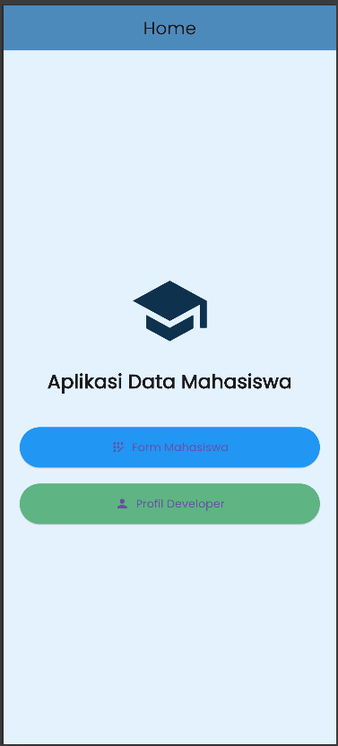
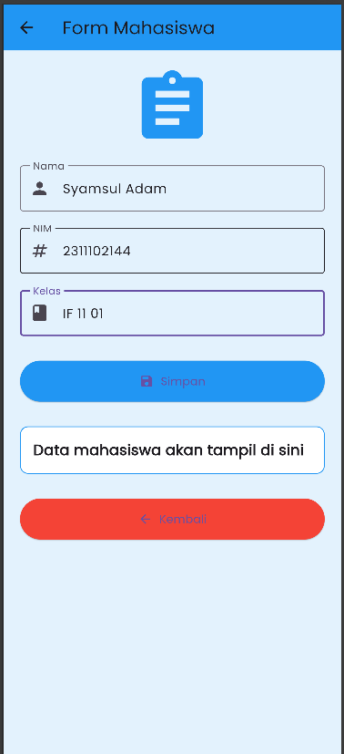
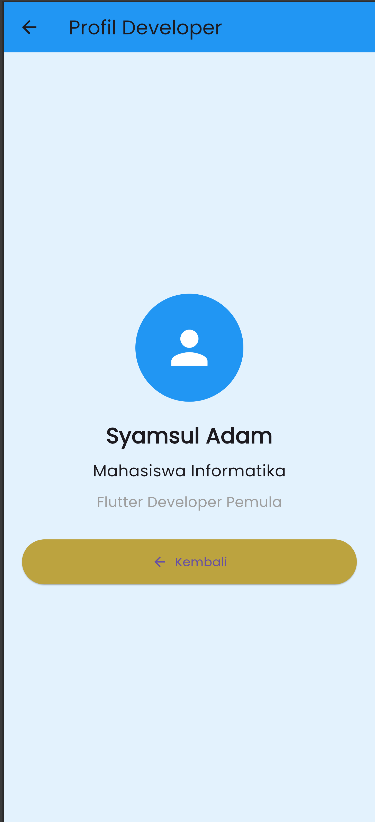

<div align="center">

<br>

# LAPORAN PRAKTIKUM  
# APLIKASI BERBASIS PLATFORM

<br>

## MODUL 7  
## Data Mahasiswa

<br>


<br><br>

### Disusun Oleh

**Syamsul Adam**  
**2311102144**  
**S1 IF-11-REG01**

<br>

### Dosen Pengampu

**Dimas Fanny Hebrasianto Permadi, S.ST., M.Kom**

<br>

### Asisten Praktikum

**Apri Pandu Wicaksono**  
**Rangga Pradarrell Fathi**

<br><br>

### LABORATORIUM HIGH PERFORMANCE  
### FAKULTAS INFORMATIKA  
### UNIVERSITAS TELKOM PURWOKERTO  
### 2026

</div>

---

## 1. DASAR TEORI

### Flutter

Flutter merupakan framework open-source yang dikembangkan oleh Google untuk membuat aplikasi mobile, web, dan desktop menggunakan satu codebase. Flutter menggunakan bahasa pemrograman Dart dan menyediakan berbagai widget untuk membangun antarmuka aplikasi yang modern dan responsif.

### StatefulWidget

StatefulWidget adalah widget yang dapat berubah tampilannya ketika terjadi perubahan data atau state pada aplikasi. StatefulWidget digunakan pada halaman form karena data yang ditampilkan dapat berubah ketika pengguna menginput data.

### StatelessWidget

StatelessWidget adalah widget yang tampilannya bersifat tetap dan tidak berubah selama aplikasi berjalan. Widget ini digunakan pada halaman Home dan Profil Developer.

### Navigator

Navigator digunakan untuk berpindah halaman pada aplikasi Flutter. Navigator.push digunakan untuk membuka halaman baru sedangkan Navigator.pop digunakan untuk kembali ke halaman sebelumnya.

### SnackBar

SnackBar adalah widget yang digunakan untuk menampilkan notifikasi singkat pada bagian bawah aplikasi. Pada praktikum ini SnackBar digunakan untuk menampilkan pesan bahwa data berhasil disimpan.

### Google Fonts

Google Fonts digunakan untuk menambahkan jenis font eksternal agar tampilan aplikasi menjadi lebih menarik.

---

# PENJELASAN CODE

### main.dart


```dart
import 'package:flutter/material.dart';
import 'package:google_fonts/google_fonts.dart';
import 'pages/home_page.dart';

void main() {
  runApp(const MyApp());
}

class MyApp extends StatelessWidget {
  const MyApp({super.key});

  @override
  Widget build(BuildContext context) {
    return MaterialApp(
      debugShowCheckedModeBanner: false,
      title: 'Data Mahasiswa',
      theme: ThemeData(
        primarySwatch: Colors.blue,
        textTheme: GoogleFonts.poppinsTextTheme(),
      ),
      home: const HomePage(),
    );
  }
}
```
main.dart merupakan file utama yang menjalankan aplikasi Flutter.
Kode di atas digunakan untuk menjalankan widget utama yaitu MyApp.

Pada file ini juga digunakan ThemeData dan Google Fonts untuk mengatur tema dan font aplikasi.

```dart
theme: ThemeData(
  primarySwatch: Colors.blue,
  textTheme: GoogleFonts.poppinsTextTheme(),
),
```

---

### home_page.dart
```dart
import 'package:flutter/material.dart';
import 'form_page.dart';
import 'profile_page.dart';

class HomePage extends StatelessWidget {
  const HomePage({super.key});

  @override
  Widget build(BuildContext context) {
    return Scaffold(
      backgroundColor: Colors.blue.shade50,

      appBar: AppBar(
        title: const Text("Home"),
        centerTitle: true,
        backgroundColor: const Color.from(alpha: 1, red: 0.302, green: 0.541, blue: 0.737),
      ),

      body: Center(
        child: Container(
          padding: const EdgeInsets.all(20),

          child: Column(
            mainAxisAlignment: MainAxisAlignment.center,
            children: [

              const Icon(
                Icons.school,
                size: 100,
                color: Color(0xFF0E314E),
              ),

              const SizedBox(height: 20),

              const Text(
                "Aplikasi Data Mahasiswa",
                style: TextStyle(
                  fontSize: 24,
                  fontWeight: FontWeight.bold,
                ),
                textAlign: TextAlign.center,
              ),

              const SizedBox(height: 40),

              SizedBox(
                width: double.infinity,

                child: ElevatedButton.icon(
                  icon: const Icon(Icons.app_registration),
                  label: const Text("Form Mahasiswa"),

                  style: ElevatedButton.styleFrom(
                    padding: const EdgeInsets.symmetric(vertical: 15),
                    backgroundColor: Colors.blue,
                  ),

                  onPressed: () {
                    Navigator.push(
                      context,
                      MaterialPageRoute(
                        builder: (context) => const FormPage(),
                      ),
                    );
                  },
                ),
              ),

              const SizedBox(height: 20),

              SizedBox(
                width: double.infinity,

                child: ElevatedButton.icon(
                  icon: const Icon(Icons.person),
                  label: const Text("Profil Developer"),

                  style: ElevatedButton.styleFrom(
                    padding: const EdgeInsets.symmetric(vertical: 15),
                    backgroundColor: const Color.fromARGB(255, 94, 180, 131),
                  ),

                  onPressed: () {
                    Navigator.push(
                      context,
                      MaterialPageRoute(
                        builder: (context) => const ProfilePage(),
                      ),
                    );
                  },
                ),
              ),
            ],
          ),
        ),
      ),
    );
  }
}
```
Halaman Home menggunakan StatelessWidget karena tampilannya tidak berubah.

Pada halaman ini terdapat:
- AppBar
- Icon
- Container
- Column
- ElevatedButton

Navigator.push digunakan untuk berpindah halaman.

Tombol pertama digunakan untuk menuju halaman Form Mahasiswa dan tombol kedua menuju halaman Profil Developer.

---

### form_page.dart

```dart
import 'package:flutter/material.dart';

class FormPage extends StatefulWidget {
  const FormPage({super.key});

  @override
  State<FormPage> createState() => _FormPageState();
}

class _FormPageState extends State<FormPage> {

  final TextEditingController namaController =
      TextEditingController();

  final TextEditingController nimController =
      TextEditingController();

  final TextEditingController kelasController =
      TextEditingController();

  String hasilData = "";

  void simpanData() {

    setState(() {
      hasilData =
          "Nama  : ${namaController.text}\n"
          "NIM   : ${nimController.text}\n"
          "Kelas : ${kelasController.text}";
    });

    ScaffoldMessenger.of(context).showSnackBar(
      const SnackBar(
        content: Text("Data berhasil disimpan!"),
        backgroundColor: Colors.green,
        duration: Duration(seconds: 2),
      ),
    );
  }

  @override
  Widget build(BuildContext context) {

    return Scaffold(
      backgroundColor: Colors.blue.shade50,

      appBar: AppBar(
        title: const Text("Form Mahasiswa"),
        backgroundColor: Colors.blue,
      ),

      body: SingleChildScrollView(
        child: Container(
          padding: const EdgeInsets.all(20),

          child: Column(
            children: [

              const Icon(
                Icons.assignment,
                size: 100,
                color: Colors.blue,
              ),

              const SizedBox(height: 20),

              TextField(
                controller: namaController,

                decoration: const InputDecoration(
                  labelText: "Nama",
                  hintText: "Masukkan Nama",
                  border: OutlineInputBorder(),
                  prefixIcon: Icon(Icons.person),
                ),
              ),

              const SizedBox(height: 20),

              TextField(
                controller: nimController,

                decoration: const InputDecoration(
                  labelText: "NIM",
                  hintText: "Masukkan NIM",
                  border: OutlineInputBorder(),
                  prefixIcon: Icon(Icons.numbers),
                ),
              ),

              const SizedBox(height: 20),

              TextField(
                controller: kelasController,

                decoration: const InputDecoration(
                  labelText: "Kelas",
                  hintText: "Masukkan Kelas",
                  border: OutlineInputBorder(),
                  prefixIcon: Icon(Icons.class_),
                ),
              ),

              const SizedBox(height: 30),

              SizedBox(
                width: double.infinity,

                child: ElevatedButton.icon(
                  icon: const Icon(Icons.save),
                  label: const Text("Simpan"),

                  style: ElevatedButton.styleFrom(
                    padding: const EdgeInsets.symmetric(vertical: 15),
                    backgroundColor: Colors.blue,
                  ),

                  onPressed: simpanData,
                ),
              ),

              const SizedBox(height: 30),

              Container(
                width: double.infinity,
                padding: const EdgeInsets.all(15),

                decoration: BoxDecoration(
                  color: Colors.white,
                  borderRadius: BorderRadius.circular(10),
                  border: Border.all(color: Colors.blue),
                ),

                child: Text(
                  hasilData.isEmpty
                      ? "Data mahasiswa akan tampil di sini"
                      : hasilData,

                  style: const TextStyle(
                    fontSize: 18,
                    fontWeight: FontWeight.bold,
                  ),
                ),
              ),

              const SizedBox(height: 30),

              SizedBox(
                width: double.infinity,

                child: ElevatedButton.icon(
                  icon: const Icon(Icons.arrow_back),
                  label: const Text("Kembali"),

                  style: ElevatedButton.styleFrom(
                    padding: const EdgeInsets.symmetric(vertical: 15),
                    backgroundColor: Colors.red,
                  ),

                  onPressed: () {
                    Navigator.pop(context);
                  },
                ),
              ),
            ],
          ),
        ),
      ),
    );
  }
}
```
Halaman Form Mahasiswa menggunakan StatefulWidget karena data dapat berubah ketika pengguna menginput data.

TextEditingController digunakan untuk mengambil input dari TextField.
setState digunakan untuk memperbarui tampilan data mahasiswa.

```dart
setState(() {
  hasilData =
      "Nama : ${namaController.text}\n"
      "NIM : ${nimController.text}\n"
      "Kelas : ${kelasController.text}";
});
```

SnackBarsebagai notifikasi berhasil menyimpan data.

```dart
ScaffoldMessenger.of(context).showSnackBar(
  const SnackBar(
    content: Text("Data berhasil disimpan!"),
  ),
);
```

Navigator.pop digunakan untuk kembali ke halaman sebelumnya.

```dart
Navigator.pop(context);
```

---

### profile_page.dart
```dart
import 'package:flutter/material.dart';

class ProfilePage extends StatelessWidget {
  const ProfilePage({super.key});

  @override
  Widget build(BuildContext context) {
    return Scaffold(
      backgroundColor: Colors.blue.shade50,

      appBar: AppBar(
        title: const Text("Profil Developer"),
        backgroundColor: Colors.blue,
      ),

      body: Center(
        child: Container(
          padding: const EdgeInsets.all(20),

          child: Column(
            mainAxisAlignment: MainAxisAlignment.center,
            children: [
              const CircleAvatar(
                radius: 60,
                backgroundColor: Colors.blue,

                child: Icon(Icons.person, size: 60, color: Colors.white),
              ),

              const SizedBox(height: 20),

              const Text(
                "Syamsul Adam",
                style: TextStyle(fontSize: 24, fontWeight: FontWeight.bold),
              ),

              const SizedBox(height: 10),

              const Text(
                "Mahasiswa Informatika",
                style: TextStyle(fontSize: 18),
              ),

              const SizedBox(height: 10),

              const Text(
                "Flutter Developer Pemula",
                style: TextStyle(fontSize: 16, color: Colors.grey),
              ),

              const SizedBox(height: 30),

              SizedBox(
                width: double.infinity,

                child: ElevatedButton.icon(
                  icon: const Icon(Icons.arrow_back),
                  label: const Text("Kembali"),

                  style: ElevatedButton.styleFrom(
                    padding: const EdgeInsets.symmetric(vertical: 15),
                    backgroundColor: const Color.fromARGB(255, 188, 163, 63),
                  ),

                  onPressed: () {
                    Navigator.pop(context);
                  },
                ),
              ),
            ],
          ),
        ),
      ),
    );
  }
}

```

Halaman Profil Developer menggunakan StatelessWidget karena hanya menampilkan informasi tetap.

Pada halaman ini digunakan:
- CircleAvatar
- Text
- ElevatedButton
- Navigator.pop

Halaman ini berfungsi untuk menampilkan identitas developer aplikasi.

---

# HASIL TAMPILAN

### 1. Home Page

Pada halaman Home terdapat:
- Judul aplikasi
- Icon sekolah
- Tombol Form Mahasiswa
- Tombol Profil Developer

### 2. Form Mahasiswa


Pada halaman Form Mahasiswa terdapat:
- Input Nama
- Input NIM
- Input Kelas
- Tombol Simpan
- Tombol Kembali
dan akan di simpan di kolom data

### 3. Profil Developer


Halaman Profil Developer menampilkan:
- Foto/Icon profil
- Nama
- Status mahasiswa
- Tombol kembali

---