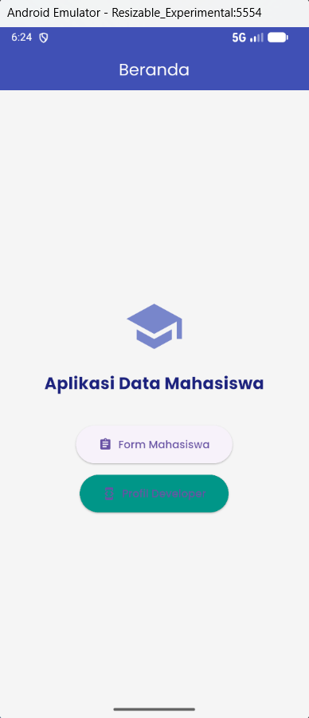
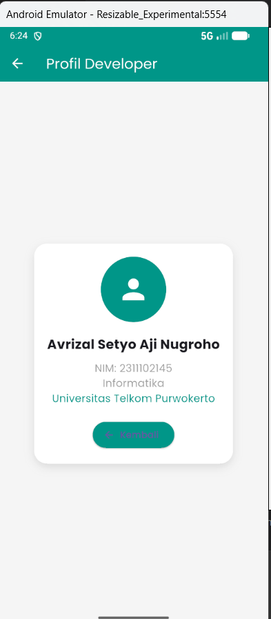
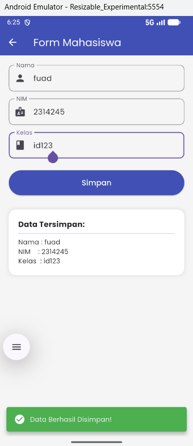

<div align="center">
  <br />
  <h1>LAPORAN PRAKTIKUM</h1>
  <h2>APLIKASI BERBASIS PLATFORM</h2>
  <br />
  <h3>Flutter Modul 7</h3>
  <h3>NAVIGATION & STATE MANAGEMENT</h3>
  <br />
  <br />
  
  <br />
  <br />
  <h3>Disusun Oleh :</h3>
  <p>
    <strong>AVRIZAL SETYO AJI NUGROHO</strong><br>
    <strong>2311102145</strong><br>
    <strong>S1 IF-11-REG01</strong>
  </p>
  <br />
  <h3>Dosen Pengampu :</h3>
  <p>
    <strong>Dimas Fanny Hebrasianto Permadi, S.ST., M.Kom</strong>
  </p>
  <br />
  <h4>Asisten Praktikum :</h4>
  <p>
    <strong>Apri Pandu Wicaksono</strong><br>
    <strong>Rangga Pradarrell Fathi</strong>
  </p>
  <br />
  <h3>
    LABORATORIUM HIGH PERFORMANCE<br>
    FAKULTAS INFORMATIKA<br>
    UNIVERSITAS TELKOM PURWOKERTO<br>
    2026
  </h3>
</div>

---

## 1. Dasar Teori

### Komponen Utama dalam Pengembangan UI Flutter

Aplikasi ini dibangun menggunakan framework Flutter yang menggunakan bahasa pemrograman Dart. Dalam Flutter, hampir semua elemen antarmuka pengguna (UI) adalah **Widget**. Berikut adalah konsep dasar yang diterapkan dalam aplikasi ini:

### 1. State Management Dasar (Widget)
* **StatelessWidget:** Merupakan widget yang bersifat statis. Artinya, setelah widget ini dibangun (*build*), tampilannya tidak akan berubah meskipun ada interaksi dari pengguna. Cocok digunakan untuk halaman yang hanya menampilkan informasi informatif, seperti Home Page atau Profile Page.
* **StatefulWidget:** Merupakan widget yang bersifat dinamis. Widget ini memiliki *state* (keadaan) internal yang dapat diperbarui kapan saja menggunakan fungsi `setState()`. Saat *state* berubah, Flutter akan merender ulang (membangun ulang) widget tersebut untuk menampilkan pembaruan data, seperti pada saat menyimpan data inputan form.

### 2. Navigasi dan Routing
Navigasi di dalam Flutter dikelola oleh class **Navigator** yang bekerja menggunakan prinsip struktur data *Stack* (tumpukan) dengan metode LIFO (*Last In, First Out*).
* **Navigator.push:** Berfungsi untuk menambahkan (*push*) rute/halaman baru ke bagian paling atas tumpukan layar. Pengguna akan melihat ini sebagai transisi ke halaman baru.
* **Navigator.pop:** Berfungsi untuk menghapus (*pop*) halaman yang sedang aktif dari tumpukan, sehingga layar kembali ke halaman yang berada di bawahnya (halaman sebelumnya).

### 3. Komponen Antarmuka (Material Design)
* **AppBar:** Merupakan komponen *header* standar Material Design yang biasanya terletak di bagian paling atas aplikasi. Berfungsi untuk menampilkan judul halaman dan tombol aksi/navigasi.
* **ElevatedButton:** Merupakan tombol berdesain material yang memiliki efek bayangan (elevasi) untuk memberi penekanan visual bahwa elemen tersebut dapat ditekan.
* **SnackBar:** Merupakan pesan *pop-up* ringan yang muncul secara sementara di bagian bawah layar untuk memberikan respon langsung (*feedback*) kepada pengguna setelah melakukan suatu aksi.

### 4. Layouting
* **Container:** Widget serbaguna yang digunakan untuk membungkus widget lain. Container sering digunakan untuk mengatur *padding*, *margin*, ukuran, warna latar belakang, atau menambahkan *border* dan *shadow*.
* **Column:** Widget tata letak yang menyusun anak-anaknya (*children*) secara vertikal dari atas ke bawah.

### 5. Dependency Management (Packages)
Flutter memungkinkan penggunaan pustaka pihak ketiga melalui file konfigurasi **pubspec.yaml**. Pada aplikasi ini, *package* `google_fonts` ditambahkan untuk mengambil dan menerapkan *font* kustom secara langsung dari direktori Google Fonts tanpa perlu mengunduh file `.ttf` secara manual ke dalam aset lokal.

---

## 2. Kode

```dart
import 'package:flutter/material.dart';
import 'package:google_fonts/google_fonts.dart';

void main() {
  runApp(const MyApp());
}

class MyApp extends StatelessWidget {
  const MyApp({super.key});

  @override
  Widget build(BuildContext context) {
    return MaterialApp(
      title: 'Data Mahasiswa',
      theme: ThemeData(
        primarySwatch: Colors.indigo,
        scaffoldBackgroundColor: Colors.grey[100],
        textTheme: GoogleFonts.poppinsTextTheme(Theme.of(context).textTheme),
      ),
      home: const HomePage(),
      debugShowCheckedModeBanner: false,
    );
  }
}

// ==========================================
// 1. HALAMAN HOME (StatelessWidget)
// ==========================================
class HomePage extends StatelessWidget {
  const HomePage({super.key});

  @override
  Widget build(BuildContext context) {
    return Scaffold(
      appBar: AppBar(
        title: const Text('Beranda', style: TextStyle(color: Colors.white)),
        backgroundColor: Colors.indigo,
        centerTitle: true,
      ),
      body: Center(
        child: Column(
          mainAxisAlignment: MainAxisAlignment.center,
          children: [
            Icon(Icons.school, size: 80, color: Colors.indigo[300]),
            const SizedBox(height: 20),
            Text(
              'Aplikasi Data Mahasiswa',
              style: GoogleFonts.poppins(
                fontSize: 22,
                fontWeight: FontWeight.bold,
                color: Colors.indigo[900],
              ),
            ),
            const SizedBox(height: 40),
            ElevatedButton.icon(
              onPressed: () {
                Navigator.push(
                  context,
                  MaterialPageRoute(builder: (context) => const FormPage()),
                );
              },
              icon: const Icon(Icons.assignment),
              label: const Text('Form Mahasiswa'),
              style: ElevatedButton.styleFrom(
                padding: const EdgeInsets.symmetric(
                  horizontal: 30,
                  vertical: 15,
                ),
              ),
            ),
            const SizedBox(height: 15),
            ElevatedButton.icon(
              onPressed: () {
                Navigator.push(
                  context,
                  MaterialPageRoute(builder: (context) => const ProfilePage()),
                );
              },
              icon: const Icon(Icons.developer_mode),
              label: const Text('Profil Developer'),
              style: ElevatedButton.styleFrom(
                backgroundColor: Colors.teal,
                padding: const EdgeInsets.symmetric(
                  horizontal: 30,
                  vertical: 15,
                ),
              ),
            ),
          ],
        ),
      ),
    );
  }
}

// ==========================================
// 2. HALAMAN FORM MAHASISWA (StatefulWidget)
// ==========================================
class FormPage extends StatefulWidget {
  const FormPage({super.key});

  @override
  State<FormPage> createState() => _FormPageState();
}

class _FormPageState extends State<FormPage> {
  // Controller untuk mengambil inputan
  final TextEditingController _namaController = TextEditingController();
  final TextEditingController _nimController = TextEditingController();
  final TextEditingController _kelasController = TextEditingController();

  // Variabel untuk menampung data yang akan ditampilkan
  String tampilNama = "";
  String tampilNim = "";
  String tampilKelas = "";
  bool isDataSaved = false;

  void _simpanData() {
    setState(() {
      tampilNama = _namaController.text;
      tampilNim = _nimController.text;
      tampilKelas = _kelasController.text;
      isDataSaved = true;
    });

    // Menampilkan SnackBar
    ScaffoldMessenger.of(context).showSnackBar(
      SnackBar(
        content: Row(
          children: const [
            Icon(Icons.check_circle, color: Colors.white),
            SizedBox(width: 10),
            Text('Data Berhasil Disimpan!'),
          ],
        ),
        backgroundColor: Colors.green,
        behavior: SnackBarBehavior.floating,
      ),
    );
  }

  @override
  Widget build(BuildContext context) {
    return Scaffold(
      appBar: AppBar(
        title: const Text(
          'Form Mahasiswa',
          style: TextStyle(color: Colors.white),
        ),
        backgroundColor: Colors.indigo,
        iconTheme: const IconThemeData(color: Colors.white),
      ),
      body: SingleChildScrollView(
        padding: const EdgeInsets.all(20.0),
        child: Column(
          crossAxisAlignment: CrossAxisAlignment.stretch,
          children: [
            TextField(
              controller: _namaController,
              decoration: InputDecoration(
                labelText: 'Nama',
                prefixIcon: const Icon(Icons.person),
                border: OutlineInputBorder(
                  borderRadius: BorderRadius.circular(10),
                ),
              ),
            ),
            const SizedBox(height: 15),
            TextField(
              controller: _nimController,
              decoration: InputDecoration(
                labelText: 'NIM',
                prefixIcon: const Icon(Icons.badge),
                border: OutlineInputBorder(
                  borderRadius: BorderRadius.circular(10),
                ),
              ),
              keyboardType: TextInputType.number,
            ),
            const SizedBox(height: 15),
            TextField(
              controller: _kelasController,
              decoration: InputDecoration(
                labelText: 'Kelas',
                prefixIcon: const Icon(Icons.class_),
                border: OutlineInputBorder(
                  borderRadius: BorderRadius.circular(10),
                ),
              ),
            ),
            const SizedBox(height: 25),
            ElevatedButton(
              onPressed: _simpanData,
              style: ElevatedButton.styleFrom(
                backgroundColor: Colors.indigo,
                padding: const EdgeInsets.symmetric(vertical: 15),
              ),
              child: const Text(
                'Simpan',
                style: TextStyle(fontSize: 16, color: Colors.white),
              ),
            ),
            const SizedBox(height: 30),

            // Menampilkan data yang diinput
            if (isDataSaved)
              Container(
                padding: const EdgeInsets.all(20),
                decoration: BoxDecoration(
                  color: Colors.white,
                  borderRadius: BorderRadius.circular(15),
                  boxShadow: [
                    BoxShadow(
                      color: Colors.grey.withOpacity(0.2),
                      spreadRadius: 2,
                      blurRadius: 5,
                    ),
                  ],
                ),
                child: Column(
                  crossAxisAlignment: CrossAxisAlignment.start,
                  children: [
                    Text(
                      'Data Tersimpan:',
                      style: GoogleFonts.poppins(
                        fontWeight: FontWeight.bold,
                        fontSize: 16,
                      ),
                    ),
                    const Divider(),
                    Text('Nama : $tampilNama', style: GoogleFonts.poppins()),
                    Text('NIM    : $tampilNim', style: GoogleFonts.poppins()),
                    Text('Kelas  : $tampilKelas', style: GoogleFonts.poppins()),
                  ],
                ),
              ),
          ],
        ),
      ),
    );
  }
}

// ==========================================
// 3. HALAMAN PROFIL DEVELOPER (StatelessWidget)
// ==========================================
class ProfilePage extends StatelessWidget {
  const ProfilePage({super.key});

  @override
  Widget build(BuildContext context) {
    return Scaffold(
      appBar: AppBar(
        title: const Text(
          'Profil Developer',
          style: TextStyle(color: Colors.white),
        ),
        backgroundColor: Colors.teal,
        iconTheme: const IconThemeData(color: Colors.white),
      ),
      body: Center(
        child: Container(
          margin: const EdgeInsets.all(20),
          padding: const EdgeInsets.all(20),
          decoration: BoxDecoration(
            color: Colors.white,
            borderRadius: BorderRadius.circular(20),
            boxShadow: [
              BoxShadow(
                color: Colors.grey.withOpacity(0.3),
                blurRadius: 10,
                offset: const Offset(0, 5),
              ),
            ],
          ),
          child: Column(
            mainAxisSize: MainAxisSize.min,
            children: [
              const CircleAvatar(
                radius: 50,
                backgroundColor: Colors.teal,
                child: Icon(Icons.person, size: 50, color: Colors.white),
              ),
              const SizedBox(height: 20),
              Text(
                'Avrizal Setyo Aji Nugroho',
                style: GoogleFonts.poppins(
                  fontSize: 20,
                  fontWeight: FontWeight.bold,
                ),
                textAlign: TextAlign.center,
              ),
              const SizedBox(height: 10),
              const Text(
                'NIM: 2311102145',
                style: TextStyle(fontSize: 16, color: Colors.grey),
              ),
              const Text(
                'Informatika',
                style: TextStyle(fontSize: 16, color: Colors.grey),
              ),
              const Text(
                'Universitas Telkom Purwokerto',
                style: TextStyle(fontSize: 16, color: Colors.teal),
              ),
              const SizedBox(height: 20),
              ElevatedButton.icon(
                onPressed: () {
                  Navigator.pop(
                    context,
                  ); // Fungsi kembali ke halaman sebelumnya
                },
                icon: const Icon(Icons.arrow_back),
                label: const Text('Kembali'),
                style: ElevatedButton.styleFrom(backgroundColor: Colors.teal),
              ),
            ],
          ),
        ),
      ),
    );
  }
}


```
### penjelasan
## 1. Struktur Halaman & Widget
Aplikasi terdiri dari 3 halaman utama:
* **Home Page (`StatelessWidget`)**: Bertindak sebagai menu utama aplikasi yang berisi tombol navigasi.
* **Form Page (`StatefulWidget`)**: Digunakan karena halaman ini perlu merubah *state* UI secara dinamis (mengambil input dari `TextField` dan menampilkannya setelah tombol simpan ditekan).
* **Profile Page (`StatelessWidget`)**: Halaman statis yang menampilkan informasi biodata developer.

## 2. Navigasi (Routing)
* **`Navigator.push`**: Digunakan pada `HomePage` untuk berpindah ke halaman `FormPage` dan `ProfilePage`.
* **`Navigator.pop`**: Digunakan pada tombol "Kembali" di `ProfilePage` serta otomatis terpasang pada tombol *back* di `AppBar` untuk kembali ke halaman sebelumnya tanpa menumpuk *stack* memori.

## 3. Komponen UI (User Interface)
* **`AppBar`**: Digunakan di setiap halaman sebagai *header* navigasi.
* **`Container`**: Digunakan untuk membungkus hasil output form dan kartu profil agar bisa diberikan *styling* seperti border radius, warna background, dan shadow.
* **`Column`**: Digunakan untuk menyusun widget secara vertikal (seperti menyusun TextField, tombol, dan teks profil).
* **`ElevatedButton`**: Digunakan sebagai tombol interaktif untuk navigasi dan memicu fungsi *simpan data*.

## 4. Fitur Tambahan (Sesuai Ketentuan & Bonus)
* **SnackBar**: Diimplementasikan menggunakan `ScaffoldMessenger.of(context).showSnackBar`. Saat tombol "Simpan" ditekan, fungsi `_simpanData()` memicu *state update* dan memunculkan notifikasi *pop-up* berwarna hijau.
* **Google Fonts**: Menggunakan package `google_fonts` untuk mengubah tipografi aplikasi menjadi *Poppins* agar tampilan lebih modern.
* **Icon & Tema Warna (Bonus)**: Aplikasi menggunakan kombinasi warna Indigo dan Teal yang kontras namun serasi. Penambahan widget `Icon` diletakkan pada tombol, dekorasi input form (sebagai `prefixIcon`), dan SnackBar untuk mempercantik UI.

---

## 3. Screenshot Hasil





---

## 4. Referensi

- Dart: [https://dart.dev](https://dart.dev)
- Flutter Docs: [https://docs.flutter.dev](https://docs.flutter.dev)
