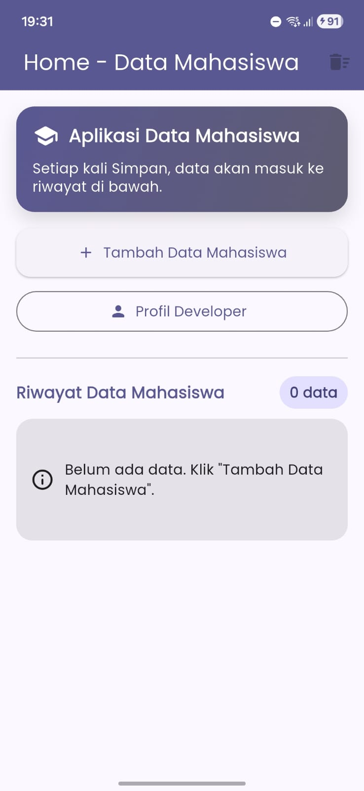
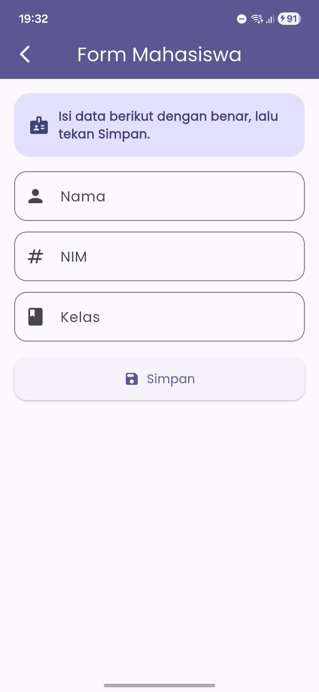
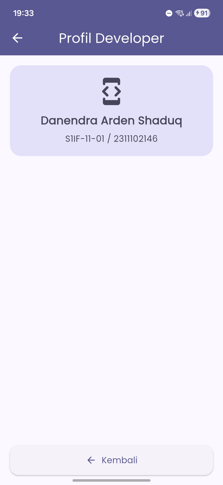
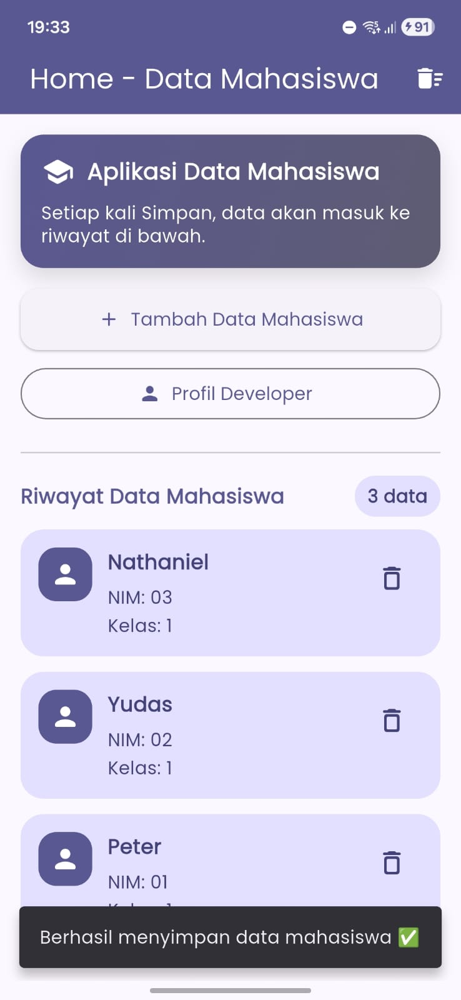

<div align="center">
  <br />
  <h1>LAPORAN PRAKTIKUM <br>APLIKASI BERBASIS PLATFORM</h1>
  <br />
  <h3>MODUL 7<br>DATA MAHASISWA (NAVIGATOR & FORM)</h3>
  <br />
  
  <br />
  <br />
  <br />
  <h3>Disusun Oleh :</h3>
  <p>
    <strong>Danendra Arden Shaduq</strong><br>
    <strong>2311102146</strong><br>
    <strong>S1 IF-11-REG01</strong><br>
  </p>
  <br />
  <h3>Dosen Pengampu :</h3>
  <p>
    <strong>Dimas Fanny Hebrasianto Permadi, S.ST., M.Kom</strong>
  </p>
  <br />
  <h3>Asisten Praktikum :</h3>
  <p>
    <strong>Apri Pandu Wicaksono</strong><br>
    <strong>Rangga Pradarrell Fathi</strong><br>
  </p>
  <br />
  <h3>LABORATORIUM HIGH PERFORMANCE<br>FAKULTAS INFORMATIKA <br>TELKOM UNIVERSITY PURWOKERTO <br>2026</h3>
</div>

---

## 1. Dasar Teori

### 1.1 Flutter
Flutter adalah framework UI dari Google untuk membuat aplikasi mobile (Android/iOS) menggunakan bahasa Dart. Flutter menerapkan konsep widget sebagai komponen utama untuk membangun tampilan.

### 1.2 StatelessWidget dan StatefulWidget
- **StatelessWidget** adalah widget yang tampilannya tidak berubah selama runtime (tanpa state internal). Cocok untuk halaman yang sifatnya statis seperti halaman profil.
- **StatefulWidget** adalah widget yang memiliki state (data) yang dapat berubah dan menyebabkan UI melakukan rebuild. Cocok untuk halaman form input dan halaman yang menampilkan data dinamis.

### 1.3 Navigator (Navigator.push & Navigator.pop)
Navigator digunakan untuk perpindahan halaman (routing) pada Flutter.
- `Navigator.push()` digunakan untuk berpindah ke halaman baru.
- `Navigator.pop()` digunakan untuk kembali ke halaman sebelumnya.  
Pada aplikasi ini, `Navigator.pop(context, data)` digunakan untuk mengirim data dari halaman Form ke halaman Home.

### 1.4 Form, TextField/TextFormField, dan Validasi
Form digunakan untuk mengelola input pengguna. `TextFormField` memiliki fitur validasi melalui `validator` sehingga input bisa dicek (misalnya tidak boleh kosong) sebelum disimpan.

### 1.5 SnackBar
SnackBar adalah komponen notifikasi singkat yang muncul di bagian bawah layar untuk memberikan informasi kepada pengguna, misalnya saat data berhasil disimpan.

### 1.6 Google Fonts
Package `google_fonts` digunakan untuk menerapkan font Google secara mudah pada aplikasi Flutter agar tampilan lebih menarik dan konsisten.

### 1.7 Widget yang digunakan
Aplikasi ini menggunakan beberapa widget utama:
- **AppBar**: menampilkan judul halaman dan tombol aksi.
- **Container**: sebagai kotak dekorasi UI (warna, radius, shadow).
- **Column**: menyusun widget secara vertikal.
- **ElevatedButton**: tombol utama (misal tambah data, simpan).
- **Icon**: ikon pada tombol dan informasi (bonus).
- **ListView.builder**: menampilkan data mahasiswa dalam bentuk list dinamis (riwayat).

---

## 2. Implementasi Program

### 2.1 Deskripsi Aplikasi
Aplikasi bertema **“Data Mahasiswa”** memiliki 3 halaman:
1. **Home**: menampilkan tombol navigasi dan riwayat data mahasiswa.
2. **Form Mahasiswa**: berisi input **Nama, NIM, Kelas** dan tombol **Simpan**.
3. **Profil Developer**: menampilkan informasi pembuat aplikasi.

Saat tombol **Simpan** ditekan:
- Sistem melakukan validasi input.
- Menampilkan **SnackBar** notifikasi berhasil.
- Mengembalikan data ke halaman Home dan menambahkannya ke riwayat list.

---

### 2.2 Struktur Halaman

#### A Home Page (StatefulWidget)
Halaman Home dibuat `StatefulWidget` karena menyimpan state berupa list `riwayatMahasiswa`. Data dari Form diterima melalui `Navigator.push()` dan ditambahkan ke list menggunakan `setState()`.

**Fitur di Home:**
- Tombol **Tambah Data Mahasiswa** (ke Form)
- Tombol **Profil Developer**
- Menampilkan jumlah data
- Menampilkan riwayat data mahasiswa menggunakan `ListView.builder`
- Tombol hapus per item dan hapus semua (opsional)

#### B Form Mahasiswa (StatefulWidget)
Form dibuat `StatefulWidget` karena menangani input dari `TextEditingController` dan validasi `Form`.

**Fitur di Form:**
- Input: Nama, NIM, Kelas
- Tombol **Simpan**
- SnackBar “Berhasil menyimpan”
- `Navigator.pop(context, data)` mengirim data ke Home

#### C Profil Developer (StatelessWidget)
Halaman Profil bersifat statis sehingga menggunakan `StatelessWidget`.

---

## 3. Code & Penjelasan

### 3.1 pubspec.yaml (Google Fonts)
Tambahkan package:

```yaml
dependencies:
  flutter:
    sdk: flutter
  google_fonts: ^6.2.1
```

### 3.2 main.dart (Tema + GoogleFonts)
**Penjelasan singkat:**  
- Mengaktifkan tema (warna menarik)
- Menggunakan `GoogleFonts.poppinsTextTheme()`
- Menjadikan `HomePage` sebagai halaman utama

```dart
import 'package:flutter/material.dart';
import 'package:google_fonts/google_fonts.dart';
import 'pages/home_page.dart';

void main() => runApp(const MyApp());

class MyApp extends StatelessWidget {
  const MyApp({super.key});

  @override
  Widget build(BuildContext context) {
    final colorScheme = ColorScheme.fromSeed(
      seedColor: const Color(0xFF4F46E5),
      brightness: Brightness.light,
    );

    return MaterialApp(
      debugShowCheckedModeBanner: false,
      title: 'Data Mahasiswa',
      theme: ThemeData(
        useMaterial3: true,
        colorScheme: colorScheme,
        textTheme: GoogleFonts.poppinsTextTheme(),
        appBarTheme: AppBarTheme(
          centerTitle: true,
          backgroundColor: colorScheme.primary,
          foregroundColor: Colors.white,
        ),
      ),
      home: const HomePage(),
    );
  }
}
```

---

### 3.3 Home Page (Navigator.push + ListView.builder)
**Penjelasan singkat:**  
- Menekan tombol “Tambah Data Mahasiswa” menjalankan `Navigator.push` menuju `FormMahasiswaPage`.
- Ketika Form selesai, data dikirim balik menggunakan `Navigator.pop(context, data)`.
- Di Home, data ditambahkan ke `riwayatMahasiswa` lalu ditampilkan memakai `ListView.builder`.

```dart
// inti logika di Home:
final result = await Navigator.push(
  context,
  MaterialPageRoute(builder: (_) => const FormMahasiswaPage()),
);

if (result is Map<String, String>) {
  setState(() {
    riwayatMahasiswa.insert(0, result);
  });

  ScaffoldMessenger.of(context).showSnackBar(
    const SnackBar(
      content: Text('Data masuk ke riwayat ✅'),
    ),
  );
}
```

---

### 3.4 Form Mahasiswa (SnackBar + Navigator.pop)
**Penjelasan singkat:**  
- Validasi form menggunakan `_formKey`.
- Jika valid, tampilkan SnackBar lalu `Navigator.pop(context, data)` untuk mengirim data ke Home.

```dart
void _simpan() {
  final isValid = _formKey.currentState?.validate() ?? false;
  if (!isValid) return;

  final data = <String, String>{
    'nama': _namaC.text.trim(),
    'nim': _nimC.text.trim(),
    'kelas': _kelasC.text.trim(),
  };

  ScaffoldMessenger.of(context).showSnackBar(
    const SnackBar(content: Text('Berhasil menyimpan data ✅')),
  );

  Future.delayed(const Duration(milliseconds: 500), () {
    Navigator.pop(context, data);
  });
}
```

---

## 4. Hasil Tampilan (Output)

### 4.1 Halaman Home



### 4.2 Halaman Form Mahasiswa



### 4.3 Halaman Profil Developer



### 4.4 Notifikasi



---

## 5. Kesimpulan
Aplikasi “Data Mahasiswa” berhasil dibuat dengan:
- 3 halaman (Home, Form Mahasiswa, Profil Developer)
- Perpindahan halaman menggunakan `Navigator.push` dan `Navigator.pop`
- Input data mahasiswa (Nama, NIM, Kelas) dengan validasi
- Notifikasi berhasil menggunakan SnackBar
- Menggunakan `StatefulWidget`, `StatelessWidget`, `Google Fonts`
- Menerapkan widget minimal (AppBar, Container, Column, ElevatedButton) serta bonus Icon dan tema warna menarik
