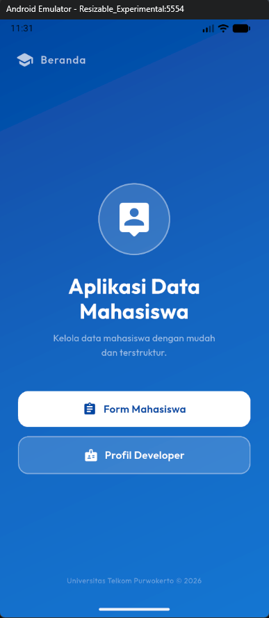
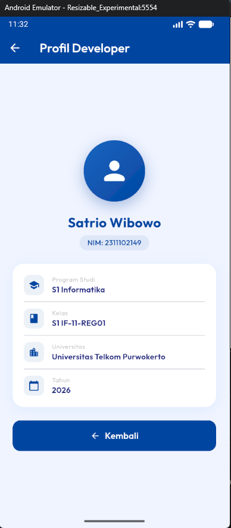
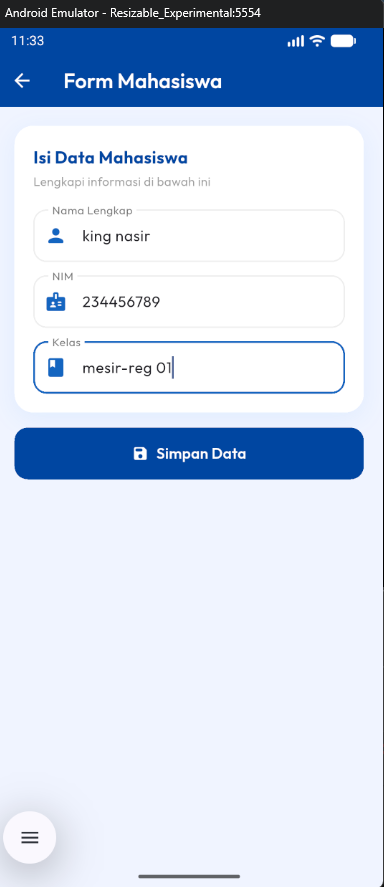
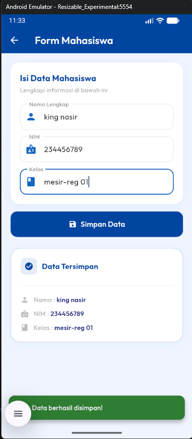

<div align="center">
  <br />
  <h1>LAPORAN PRAKTIKUM <br>APLIKASI BERBASIS PLATFORM</h1>
  <br />
  <h2>MODUL 7 <br>Mobile - NAVIGATION & STATE MANAGEMENT</h2>
  <br />
  <br />
   
  <br />
  <br />
  <br />
  <h3>Disusun Oleh :</h3>
  <p>
    <strong>Satrio Wibowo</strong><br>
    <strong>2311102149</strong><br>
    <strong>S1 IF-11-REG 01</strong>
  </p>
  <br />
  <h3>Dosen Pengampu :</h3>
  <p>
    <strong>Dimas Fanny Hebrasianto Permadi, S.ST., M.Kom</strong>
  </p>
  <br />
  <br />
    <h4>Asisten Praktikum :</h4>
    <strong> Apri Pandu Wicaksono </strong> <br>
    <strong>Rangga Pradarrell Fathi</strong>
  <br />
  <h2>LABORATORIUM HIGH PERFORMANCE
 <br>FAKULTAS INFORMATIKA <br>UNIVERSITAS TELKOM PURWOKERTO <br>2026</h2>
</div>


---

## 1. Dasar Teori
 
### Komponen Utama dalam Pengembangan UI Flutter
 
Aplikasi ini dikembangkan menggunakan framework Flutter dengan bahasa pemrograman Dart. Dalam ekosistem Flutter, seluruh elemen tampilan antarmuka pengguna (UI) dibangun dari **Widget**. Berikut merupakan konsep-konsep fundamental yang diterapkan di dalam aplikasi ini:
 
### 1. State Management Dasar (Widget)
 
- **StatelessWidget:** Widget yang tidak memiliki keadaan (*state*) yang dapat berubah secara internal. Begitu widget ini dirender, tampilannya akan tetap sama walaupun ada interaksi dari pengguna. Jenis widget ini ideal untuk digunakan pada halaman yang hanya bertugas menampilkan informasi yang bersifat tetap, seperti Home Page dan Profile Page.
- **StatefulWidget:** Widget yang memiliki *state* internal yang bersifat mutable (dapat berubah). Setiap kali terjadi perubahan *state* melalui pemanggilan fungsi `setState()`, Flutter secara otomatis akan menjalankan proses *rebuild* pada widget tersebut untuk memperbarui tampilan. Widget ini dipakai pada Form Page karena perlu merespons input pengguna secara real-time.
### 2. Navigasi dan Routing
 
Sistem navigasi Flutter dikelola melalui class **Navigator** yang menerapkan konsep struktur data *Stack* (tumpukan) dengan metode LIFO (*Last In, First Out*).
 
- **Navigator.push:** Digunakan untuk mendorong (*push*) sebuah rute baru ke posisi paling atas pada tumpukan navigasi. Pengguna akan mengalami transisi ke halaman yang baru ditambahkan tersebut.
- **Navigator.pop:** Digunakan untuk mengeluarkan (*pop*) halaman aktif dari tumpukan sehingga aplikasi kembali ke halaman sebelumnya.
### 3. Komponen Antarmuka (Material Design 3)
 
- **AppBar:** Komponen navigasi standar Material Design yang menempati area paling atas layar. Berfungsi sebagai *header* halaman sekaligus menampilkan judul dan ikon aksi.
- **ElevatedButton:** Tombol Material Design dengan efek elevasi (bayangan) yang menandakan elemen tersebut dapat berinteraksi dengan pengguna.
- **SnackBar:** Notifikasi ringan bertipe *pop-up* yang tampil sesaat di bagian bawah layar sebagai umpan balik (*feedback*) langsung kepada pengguna setelah suatu aksi berhasil dijalankan.
### 4. Layouting
 
- **Container:** Widget serbaguna yang berfungsi sebagai pembungkus elemen lain. Mendukung konfigurasi *padding*, *margin*, dimensi, warna, sudut border, dan efek bayangan.
- **Column:** Widget tata letak yang mengatur susunan anak-anaknya secara vertikal dari atas ke bawah.
- **Row:** Widget tata letak yang menyusun elemen secara horizontal, digunakan di sini untuk menampilkan ikon dan teks dalam satu baris.
### 5. Dependency Management (Packages)
 
Flutter memungkinkan integrasi pustaka pihak ketiga melalui file konfigurasi **pubspec.yaml**. Proyek ini memanfaatkan *package* `google_fonts` untuk menerapkan tipografi kustom (font **Outfit**) secara langsung tanpa perlu mengunduh dan mendaftarkan file `.ttf` secara manual ke dalam direktori aset.
 
---
 
## 2. Kode Program
 
```dart
import 'package:flutter/material.dart';
import 'package:google_fonts/google_fonts.dart';
 
void main() {
  runApp(const MyApp());
}
 
class MyApp extends StatelessWidget {
  const MyApp({super.key});
 
  @override
  Widget build(BuildContext context) {
    return MaterialApp(
      title: 'Data Mahasiswa',
      theme: ThemeData(
        colorScheme: ColorScheme.fromSeed(
          seedColor: const Color(0xFF0D47A1),
          brightness: Brightness.light,
        ),
        scaffoldBackgroundColor: const Color(0xFFF0F4FF),
        textTheme: GoogleFonts.outfitTextTheme(Theme.of(context).textTheme),
        useMaterial3: true,
      ),
      home: const HomePage(),
      debugShowCheckedModeBanner: false,
    );
  }
}
 
// ==========================================
// 1. HALAMAN HOME (StatelessWidget)
// ==========================================
class HomePage extends StatelessWidget {
  const HomePage({super.key});
 
  @override
  Widget build(BuildContext context) {
    return Scaffold(
      body: Container(
        decoration: const BoxDecoration(
          gradient: LinearGradient(
            colors: [Color(0xFF0D47A1), Color(0xFF1565C0), Color(0xFF1976D2)],
            begin: Alignment.topLeft,
            end: Alignment.bottomRight,
          ),
        ),
        child: SafeArea(
          child: Column(
            children: [
              // Header
              Padding(
                padding: const EdgeInsets.symmetric(horizontal: 24, vertical: 20),
                child: Row(
                  children: [
                    const Icon(Icons.school_rounded, color: Colors.white70, size: 28),
                    const SizedBox(width: 10),
                    Text(
                      'Beranda',
                      style: GoogleFonts.outfit(
                        color: Colors.white70,
                        fontSize: 16,
                        fontWeight: FontWeight.w500,
                        letterSpacing: 1.2,
                      ),
                    ),
                  ],
                ),
              ),
 
              // Hero Section
              Expanded(
                child: Center(
                  child: Padding(
                    padding: const EdgeInsets.symmetric(horizontal: 28),
                    child: Column(
                      mainAxisAlignment: MainAxisAlignment.center,
                      children: [
                        Container(
                          width: 110,
                          height: 110,
                          decoration: BoxDecoration(
                            color: Colors.white.withOpacity(0.15),
                            shape: BoxShape.circle,
                            border: Border.all(
                              color: Colors.white.withOpacity(0.4),
                              width: 2,
                            ),
                          ),
                          child: const Icon(
                            Icons.person_pin_rounded,
                            size: 60,
                            color: Colors.white,
                          ),
                        ),
                        const SizedBox(height: 28),
                        Text(
                          'Aplikasi Data\nMahasiswa',
                          textAlign: TextAlign.center,
                          style: GoogleFonts.outfit(
                            fontSize: 32,
                            fontWeight: FontWeight.w700,
                            color: Colors.white,
                            height: 1.2,
                          ),
                        ),
                        const SizedBox(height: 12),
                        Text(
                          'Kelola data mahasiswa dengan mudah\ndan terstruktur.',
                          textAlign: TextAlign.center,
                          style: GoogleFonts.outfit(
                            fontSize: 14,
                            color: Colors.white60,
                            height: 1.6,
                          ),
                        ),
                        const SizedBox(height: 48),
                        _buildMenuButton(
                          context,
                          label: 'Form Mahasiswa',
                          icon: Icons.assignment_rounded,
                          color: Colors.white,
                          textColor: const Color(0xFF0D47A1),
                          onTap: () => Navigator.push(
                            context,
                            MaterialPageRoute(builder: (_) => const FormPage()),
                          ),
                        ),
                        const SizedBox(height: 14),
                        _buildMenuButton(
                          context,
                          label: 'Profil Developer',
                          icon: Icons.badge_rounded,
                          color: Colors.white.withOpacity(0.15),
                          textColor: Colors.white,
                          borderColor: Colors.white38,
                          onTap: () => Navigator.push(
                            context,
                            MaterialPageRoute(builder: (_) => const ProfilePage()),
                          ),
                        ),
                      ],
                    ),
                  ),
                ),
              ),
 
              // Footer
              Padding(
                padding: const EdgeInsets.only(bottom: 24),
                child: Text(
                  'Universitas Telkom Purwokerto © 2026',
                  style: GoogleFonts.outfit(
                    color: Colors.white38,
                    fontSize: 11,
                    letterSpacing: 0.5,
                  ),
                ),
              ),
            ],
          ),
        ),
      ),
    );
  }
 
  Widget _buildMenuButton(
    BuildContext context, {
    required String label,
    required IconData icon,
    required Color color,
    required Color textColor,
    Color? borderColor,
    required VoidCallback onTap,
  }) {
    return SizedBox(
      width: double.infinity,
      child: Material(
        color: color,
        borderRadius: BorderRadius.circular(16),
        child: InkWell(
          onTap: onTap,
          borderRadius: BorderRadius.circular(16),
          child: Container(
            padding: const EdgeInsets.symmetric(vertical: 16, horizontal: 20),
            decoration: BoxDecoration(
              borderRadius: BorderRadius.circular(16),
              border: borderColor != null
                  ? Border.all(color: borderColor, width: 1.5)
                  : null,
            ),
            child: Row(
              mainAxisAlignment: MainAxisAlignment.center,
              children: [
                Icon(icon, color: textColor, size: 22),
                const SizedBox(width: 10),
                Text(
                  label,
                  style: GoogleFonts.outfit(
                    color: textColor,
                    fontSize: 16,
                    fontWeight: FontWeight.w600,
                  ),
                ),
              ],
            ),
          ),
        ),
      ),
    );
  }
}
 
// ==========================================
// 2. HALAMAN FORM MAHASISWA (StatefulWidget)
// ==========================================
class FormPage extends StatefulWidget {
  const FormPage({super.key});
 
  @override
  State<FormPage> createState() => _FormPageState();
}
 
class _FormPageState extends State<FormPage> {
  final TextEditingController _namaController = TextEditingController();
  final TextEditingController _nimController = TextEditingController();
  final TextEditingController _kelasController = TextEditingController();
 
  String tampilNama = '';
  String tampilNim = '';
  String tampilKelas = '';
  bool isDataSaved = false;
 
  void _simpanData() {
    setState(() {
      tampilNama = _namaController.text;
      tampilNim = _nimController.text;
      tampilKelas = _kelasController.text;
      isDataSaved = true;
    });
 
    ScaffoldMessenger.of(context).showSnackBar(
      SnackBar(
        content: Row(
          children: const [
            Icon(Icons.check_circle_rounded, color: Colors.white),
            SizedBox(width: 10),
            Text(
              'Data berhasil disimpan!',
              style: TextStyle(fontWeight: FontWeight.w600),
            ),
          ],
        ),
        backgroundColor: const Color(0xFF2E7D32),
        behavior: SnackBarBehavior.floating,
        shape: RoundedRectangleBorder(borderRadius: BorderRadius.circular(12)),
        margin: const EdgeInsets.all(16),
      ),
    );
  }
 
  InputDecoration _inputDecor(String label, IconData icon) {
    return InputDecoration(
      labelText: label,
      labelStyle: GoogleFonts.outfit(color: Colors.grey[600]),
      prefixIcon: Icon(icon, color: const Color(0xFF1565C0)),
      filled: true,
      fillColor: Colors.white,
      contentPadding: const EdgeInsets.symmetric(vertical: 16, horizontal: 16),
      enabledBorder: OutlineInputBorder(
        borderRadius: BorderRadius.circular(14),
        borderSide: BorderSide(color: Colors.grey.shade200, width: 1.5),
      ),
      focusedBorder: OutlineInputBorder(
        borderRadius: BorderRadius.circular(14),
        borderSide: const BorderSide(color: Color(0xFF1565C0), width: 2),
      ),
    );
  }
 
  @override
  Widget build(BuildContext context) {
    return Scaffold(
      backgroundColor: const Color(0xFFF0F4FF),
      appBar: AppBar(
        title: Text(
          'Form Mahasiswa',
          style: GoogleFonts.outfit(color: Colors.white, fontWeight: FontWeight.w600),
        ),
        backgroundColor: const Color(0xFF0D47A1),
        iconTheme: const IconThemeData(color: Colors.white),
        elevation: 0,
      ),
      body: SingleChildScrollView(
        padding: const EdgeInsets.all(20),
        child: Column(
          crossAxisAlignment: CrossAxisAlignment.stretch,
          children: [
            Container(
              padding: const EdgeInsets.all(20),
              decoration: BoxDecoration(
                color: Colors.white,
                borderRadius: BorderRadius.circular(20),
                boxShadow: [
                  BoxShadow(
                    color: Colors.blue.withOpacity(0.08),
                    blurRadius: 20,
                    offset: const Offset(0, 6),
                  ),
                ],
              ),
              child: Column(
                crossAxisAlignment: CrossAxisAlignment.start,
                children: [
                  Text(
                    'Isi Data Mahasiswa',
                    style: GoogleFonts.outfit(
                      fontWeight: FontWeight.w700,
                      fontSize: 18,
                      color: const Color(0xFF0D47A1),
                    ),
                  ),
                  const SizedBox(height: 4),
                  Text(
                    'Lengkapi informasi di bawah ini',
                    style: GoogleFonts.outfit(fontSize: 13, color: Colors.grey[500]),
                  ),
                  const SizedBox(height: 20),
                  TextField(
                    controller: _namaController,
                    decoration: _inputDecor('Nama Lengkap', Icons.person_rounded),
                    style: GoogleFonts.outfit(),
                  ),
                  const SizedBox(height: 14),
                  TextField(
                    controller: _nimController,
                    decoration: _inputDecor('NIM', Icons.badge_rounded),
                    keyboardType: TextInputType.number,
                    style: GoogleFonts.outfit(),
                  ),
                  const SizedBox(height: 14),
                  TextField(
                    controller: _kelasController,
                    decoration: _inputDecor('Kelas', Icons.class_rounded),
                    style: GoogleFonts.outfit(),
                  ),
                ],
              ),
            ),
            const SizedBox(height: 16),
            ElevatedButton.icon(
              onPressed: _simpanData,
              icon: const Icon(Icons.save_rounded, color: Colors.white),
              label: Text(
                'Simpan Data',
                style: GoogleFonts.outfit(
                  fontSize: 16,
                  fontWeight: FontWeight.w600,
                  color: Colors.white,
                ),
              ),
              style: ElevatedButton.styleFrom(
                backgroundColor: const Color(0xFF0D47A1),
                padding: const EdgeInsets.symmetric(vertical: 16),
                shape: RoundedRectangleBorder(borderRadius: BorderRadius.circular(14)),
                elevation: 0,
              ),
            ),
            const SizedBox(height: 24),
            if (isDataSaved)
              Container(
                padding: const EdgeInsets.all(20),
                decoration: BoxDecoration(
                  color: Colors.white,
                  borderRadius: BorderRadius.circular(20),
                  border: Border.all(
                    color: const Color(0xFF1565C0).withOpacity(0.2),
                    width: 1.5,
                  ),
                  boxShadow: [
                    BoxShadow(
                      color: Colors.blue.withOpacity(0.06),
                      blurRadius: 16,
                      offset: const Offset(0, 4),
                    ),
                  ],
                ),
                child: Column(
                  crossAxisAlignment: CrossAxisAlignment.start,
                  children: [
                    Row(
                      children: [
                        Container(
                          padding: const EdgeInsets.all(8),
                          decoration: BoxDecoration(
                            color: const Color(0xFF0D47A1).withOpacity(0.1),
                            borderRadius: BorderRadius.circular(10),
                          ),
                          child: const Icon(
                            Icons.check_circle_rounded,
                            color: Color(0xFF0D47A1),
                            size: 20,
                          ),
                        ),
                        const SizedBox(width: 10),
                        Text(
                          'Data Tersimpan',
                          style: GoogleFonts.outfit(
                            fontWeight: FontWeight.w700,
                            fontSize: 16,
                            color: const Color(0xFF0D47A1),
                          ),
                        ),
                      ],
                    ),
                    const SizedBox(height: 16),
                    Divider(color: Colors.grey.shade100, thickness: 1.5),
                    const SizedBox(height: 12),
                    _dataRow(Icons.person_rounded, 'Nama', tampilNama),
                    const SizedBox(height: 10),
                    _dataRow(Icons.badge_rounded, 'NIM', tampilNim),
                    const SizedBox(height: 10),
                    _dataRow(Icons.class_rounded, 'Kelas', tampilKelas),
                  ],
                ),
              ),
          ],
        ),
      ),
    );
  }
 
  Widget _dataRow(IconData icon, String label, String value) {
    return Row(
      children: [
        Icon(icon, size: 18, color: Colors.grey[400]),
        const SizedBox(width: 10),
        Text('$label : ', style: GoogleFonts.outfit(color: Colors.grey[500], fontSize: 14)),
        Expanded(
          child: Text(
            value,
            style: GoogleFonts.outfit(
              fontWeight: FontWeight.w600,
              fontSize: 14,
              color: const Color(0xFF1A237E),
            ),
          ),
        ),
      ],
    );
  }
}
 
// ==========================================
// 3. HALAMAN PROFIL DEVELOPER (StatelessWidget)
// ==========================================
class ProfilePage extends StatelessWidget {
  const ProfilePage({super.key});
 
  @override
  Widget build(BuildContext context) {
    return Scaffold(
      backgroundColor: const Color(0xFFF0F4FF),
      appBar: AppBar(
        title: Text(
          'Profil Developer',
          style: GoogleFonts.outfit(color: Colors.white, fontWeight: FontWeight.w600),
        ),
        backgroundColor: const Color(0xFF0D47A1),
        iconTheme: const IconThemeData(color: Colors.white),
        elevation: 0,
      ),
      body: Center(
        child: SingleChildScrollView(
          padding: const EdgeInsets.all(24),
          child: Column(
            children: [
              Container(
                width: 110,
                height: 110,
                decoration: BoxDecoration(
                  gradient: const LinearGradient(
                    colors: [Color(0xFF1565C0), Color(0xFF0D47A1)],
                    begin: Alignment.topLeft,
                    end: Alignment.bottomRight,
                  ),
                  shape: BoxShape.circle,
                  boxShadow: [
                    BoxShadow(
                      color: const Color(0xFF0D47A1).withOpacity(0.3),
                      blurRadius: 20,
                      offset: const Offset(0, 8),
                    ),
                  ],
                ),
                child: const Icon(Icons.person_rounded, size: 55, color: Colors.white),
              ),
              const SizedBox(height: 20),
              Text(
                'Satrio Wibowo',
                style: GoogleFonts.outfit(
                  fontSize: 24,
                  fontWeight: FontWeight.w700,
                  color: const Color(0xFF0D47A1),
                ),
              ),
              const SizedBox(height: 6),
              Container(
                padding: const EdgeInsets.symmetric(horizontal: 14, vertical: 4),
                decoration: BoxDecoration(
                  color: const Color(0xFF0D47A1).withOpacity(0.08),
                  borderRadius: BorderRadius.circular(20),
                ),
                child: Text(
                  'NIM: 2311102149',
                  style: GoogleFonts.outfit(
                    fontSize: 13,
                    color: const Color(0xFF0D47A1),
                    fontWeight: FontWeight.w500,
                  ),
                ),
              ),
              const SizedBox(height: 24),
              Container(
                width: double.infinity,
                padding: const EdgeInsets.all(20),
                decoration: BoxDecoration(
                  color: Colors.white,
                  borderRadius: BorderRadius.circular(20),
                  boxShadow: [
                    BoxShadow(
                      color: Colors.blue.withOpacity(0.08),
                      blurRadius: 20,
                      offset: const Offset(0, 6),
                    ),
                  ],
                ),
                child: Column(
                  children: [
                    _infoTile(Icons.school_rounded, 'Program Studi', 'S1 Informatika'),
                    const Divider(height: 24),
                    _infoTile(Icons.class_rounded, 'Kelas', 'S1 IF-11-REG01'),
                    const Divider(height: 24),
                    _infoTile(Icons.location_city_rounded, 'Universitas', 'Universitas Telkom Purwokerto'),
                    const Divider(height: 24),
                    _infoTile(Icons.calendar_today_rounded, 'Tahun', '2026'),
                  ],
                ),
              ),
              const SizedBox(height: 24),
              SizedBox(
                width: double.infinity,
                child: ElevatedButton.icon(
                  onPressed: () => Navigator.pop(context),
                  icon: const Icon(Icons.arrow_back_rounded, color: Colors.white),
                  label: Text(
                    'Kembali',
                    style: GoogleFonts.outfit(
                      color: Colors.white,
                      fontWeight: FontWeight.w600,
                      fontSize: 16,
                    ),
                  ),
                  style: ElevatedButton.styleFrom(
                    backgroundColor: const Color(0xFF0D47A1),
                    padding: const EdgeInsets.symmetric(vertical: 16),
                    shape: RoundedRectangleBorder(borderRadius: BorderRadius.circular(14)),
                    elevation: 0,
                  ),
                ),
              ),
            ],
          ),
        ),
      ),
    );
  }
 
  Widget _infoTile(IconData icon, String label, String value) {
    return Row(
      children: [
        Container(
          padding: const EdgeInsets.all(8),
          decoration: BoxDecoration(
            color: const Color(0xFF0D47A1).withOpacity(0.08),
            borderRadius: BorderRadius.circular(10),
          ),
          child: Icon(icon, color: const Color(0xFF0D47A1), size: 20),
        ),
        const SizedBox(width: 14),
        Column(
          crossAxisAlignment: CrossAxisAlignment.start,
          children: [
            Text(
              label,
              style: GoogleFonts.outfit(fontSize: 11, color: Colors.grey[400], letterSpacing: 0.5),
            ),
            Text(
              value,
              style: GoogleFonts.outfit(
                fontSize: 14,
                fontWeight: FontWeight.w600,
                color: const Color(0xFF1A237E),
              ),
            ),
          ],
        ),
      ],
    );
  }
}
```
 
---
 
## 3. Penjelasan Kode
 
### 3.1. Struktur Halaman & Widget
 
Aplikasi terdiri dari **3 halaman utama** dengan pembagian jenis widget yang disesuaikan dengan kebutuhan masing-masing:
 
- **Home Page (`StatelessWidget`)**: Berfungsi sebagai halaman utama sekaligus pusat navigasi aplikasi. Menggunakan `LinearGradient` pada `Container` sebagai latar belakang agar tampilan lebih modern. Terdapat fungsi helper `_buildMenuButton()` yang dipakai ulang (*reusable*) untuk merender dua tombol navigasi dengan gaya yang konsisten.
- **Form Page (`StatefulWidget`)**: Dipilih karena halaman ini harus merespons interaksi pengguna secara dinamis — mengambil nilai dari `TextField`, memperbarui *state* melalui `setState()`, dan menampilkan kartu hasil input setelah tombol simpan ditekan. Fungsi `_inputDecor()` digunakan untuk memproduksi dekorasi input yang seragam tanpa pengulangan kode.
- **Profile Page (`StatelessWidget`)**: Halaman statis yang menampilkan informasi identitas developer. Menggunakan fungsi helper `_infoTile()` untuk membangun baris informasi dengan tampilan yang rapi dan konsisten.
### 3.2. Navigasi (Routing)
 
- **`Navigator.push`** digunakan pada `HomePage` untuk berpindah ke `FormPage` maupun `ProfilePage`, dengan `MaterialPageRoute` sebagai pembungkus transisi halaman.
- **`Navigator.pop`** diimplementasikan pada tombol "Kembali" di `ProfilePage` untuk kembali ke halaman sebelumnya, serta secara otomatis tersedia pada tombol back di `AppBar`.
### 3.3. Komponen UI (User Interface)
 
- **`AppBar`**: Diterapkan di setiap halaman menggunakan warna solid `0xFF0D47A1` (Deep Blue) dengan `elevation: 0` supaya menyatu dengan desain yang bersih dan flat.
- **`Container`**: Dimanfaatkan secara ekstensif sebagai kartu (card) input form, kartu hasil data, dan avatar profil. Setiap `Container` dilengkapi dengan `borderRadius`, `boxShadow`, dan `border` untuk menciptakan kedalaman visual (depth) yang elegan.
- **`Column` dan `Row`**: `Column` menyusun elemen-elemen secara vertikal (tumpukan form, tombol, dan hasil), sedangkan `Row` dipakai untuk membangun baris horizontal seperti ikon berpasangan dengan teks label pada `_dataRow()` dan `_infoTile()`.
- **`ElevatedButton.icon`**: Digunakan pada semua tombol aksi, dilengkapi ikon yang relevan untuk memperkuat keterbacaan (*affordance*) tampilan.
### 3.4. Fitur Tambahan
 
- **SnackBar Modern**: Diimplementasikan menggunakan `ScaffoldMessenger.of(context).showSnackBar`. SnackBar dikonfigurasi dengan `SnackBarBehavior.floating`, `RoundedRectangleBorder`, dan margin khusus agar terlihat mengapung (*floating*) di atas konten — lebih modern dibanding SnackBar *default*.
- **Google Fonts (Outfit)**: Menggunakan *package* `google_fonts` dengan tipografi **Outfit** yang memberikan kesan bersih, modern, dan mudah dibaca, berbeda dari font generik bawaan Flutter.
- **Material Design 3**: Aplikasi mengaktifkan `useMaterial3: true` dan mendefinisikan `ColorScheme.fromSeed` berbasis warna biru navy (`0xFF0D47A1`), sehingga tema warna terdistribusi secara konsisten ke seluruh komponen secara otomatis.
- **Reusable Helper Widgets**: Fungsi `_buildMenuButton()`, `_inputDecor()`, `_dataRow()`, dan `_infoTile()` dipisahkan sebagai fungsi pembantu untuk menjaga kode tetap bersih, *DRY (Don't Repeat Yourself)*, dan mudah dipelihara.
---
 
## 4. Screenshot Hasil
 




 
---
 
## 5. Referensi
 
- Dart: [https://dart.dev](https://dart.dev)
- Flutter Docs: [https://docs.flutter.dev](https://docs.flutter.dev)
- Google Fonts Package: [https://pub.dev/packages/google_fonts](https://pub.dev/packages/google_fonts)
- Material Design 3: [https://m3.material.io](https://m3.material.io)