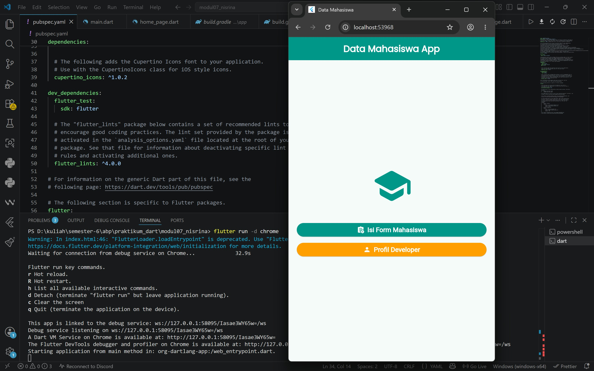
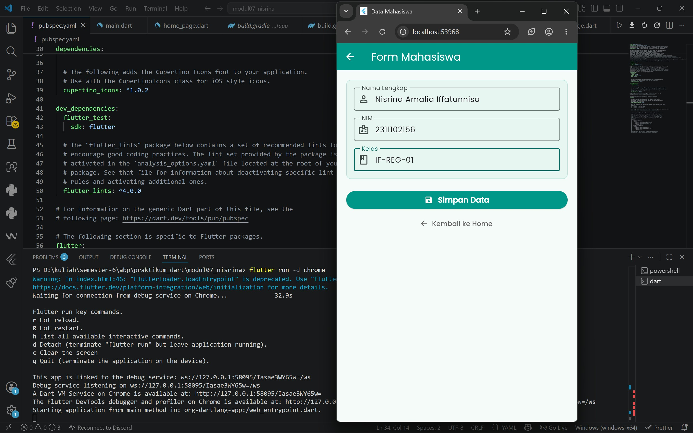
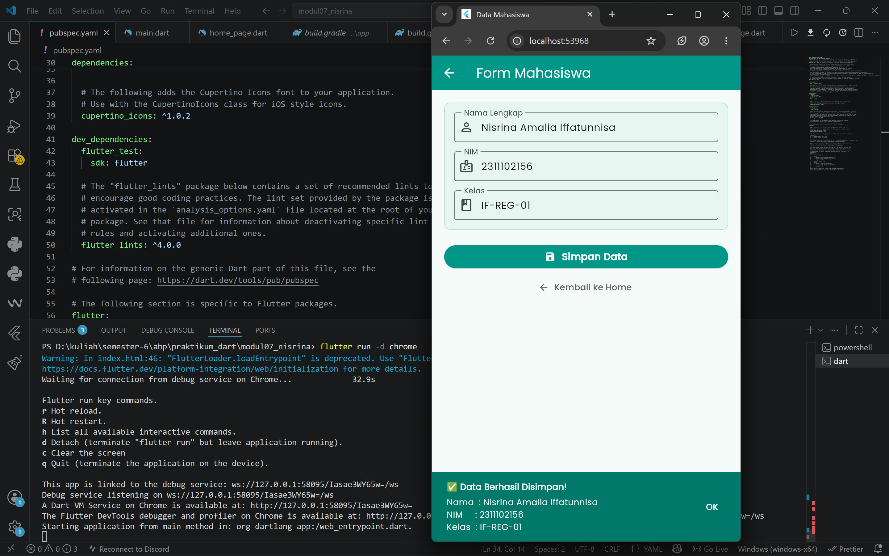
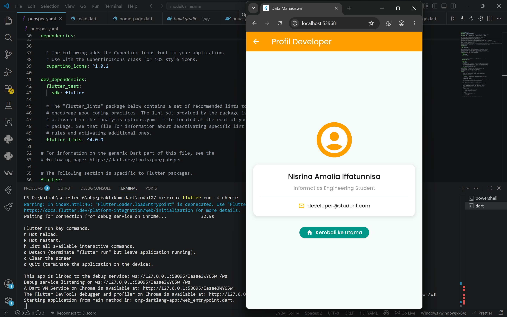

<div align="center">
  <br />
  <h1>LAPORAN PRAKTIKUM <br>APLIKASI BERBASIS PLATFORM</h1>
  <br />
  <h3> Modul 07 MOBILE <br> DATA MAHASISWA (NAVIGATOR & FORM) </h3>
  <br />
   
  <br />
  <br />
  <br />
  <h3>Disusun Oleh :</h3>
  <p>
    <strong>Nisrina Amalia Iffatunnisa</strong><br>
    <strong>2311102156</strong><br>
    <strong>S1 IF-11-01</strong>
  </p>
  <br />
  <h3>Dosen Pengampu :</h3>
  <p>
    <strong>Dimas Fanny Hebrasianto Permadi, S.ST., M.Kom</strong>
  </p>
  <br />
  <br />
    <h4>Asisten Praktikum :</h4>
    <strong> Apri Pandu Wicaksono </strong> <br>
    <strong>Rangga Pradarrell Fathi</strong>
  <br />
  <h3>LABORATORIUM HIGH PERFORMANCE
 <br>FAKULTAS INFORMATIKA <br>UNIVERSITAS TELKOM PURWOKERTO <br>2026</h3>
</div>


## 1. Latar Belakang

Dalam pengembangan aplikasi mobile menggunakan framework Flutter, pembuatan antarmuka yang dinamis dan interaktif didasarkan pada penyusunan komponen-komponen kecil yang disebut dengan widget. Untuk membangun aplikasi penginputan data yang fungsional terdapat empat konsep fundamental yang wajib dipahami, yaitu:

- Navigator: Merupakan sebuah komponen atau kelas yang bertugas untuk mengatur sirkulasi jalannya perpindahan halaman di dalam aplikasi. Navigator bekerja menggunakan prinsip tumpukan struktur data (stack). Ketika aplikasi berpindah ke halaman baru, perintah Navigator.push() akan menumpuk halaman tersebut di atas halaman lama. Sebaliknya, ketika pengguna ingin kembali ke halaman sebelumnya, perintah Navigator.pop() akan menghapus halaman teratas sehingga halaman di bawahnya kembali terlihat.

- Form: Merupakan sebuah wadah atau area khusus yang digunakan untuk mengumpulkan berbagai macam input data dari pengguna. Di dalam form, terdapat komponen pendukung seperti TextField (kolom teks) yang berfungsi menangkap ketikan dari papan ketik (keyboard). Agar data yang diketik bisa dibaca, dimanipulasi, dan dibersihkan dari memori secara real-time, digunakan sebuah pengontrol bernama TextEditingController.

- StatelessWidget (Stateless): Merupakan jenis widget yang bersifat statis atau tidak dapat berubah setelah selesai dibuat. Artinya, tampilan, warna, maupun data yang ada di dalam widget ini akan selalu tetap sejak aplikasi dijalankan dan tidak terpengaruh oleh interaksi pengguna di dalam halaman tersebut. Komponen ini sangat cocok digunakan untuk halaman yang hanya menampilkan informasi atau menu awal yang konstan.

- StatefulWidget (Stateful): Merupakan jenis widget yang bersifat dinamis dan tampilannya dapat berubah sewaktu-waktu secara fleksibel. Perubahan ini terjadi karena adanya variabel "State" yang memantau interaksi pengguna di layar. Ketika ada data baru yang masuk (misalnya pengguna sedang mengetik di kolom form atau menekan tombol simpan), widget ini akan memperbarui atau menggambar ulang (rebuild) dirinya sendiri agar perubahan data tersebut langsung terlihat di layar secara instan.

Kombinasi dari keempat pilar dasar ini memungkinkan pengembang untuk menciptakan aplikasi mobile yang memiliki navigasi halaman yang rapi serta mampu memproses input data pengguna dengan responsif.

## 2. Sourcecode 

### Sourcecode main.dart
``` Dart
import 'package:flutter/material.dart';
import 'package:google_fonts/google_fonts.dart';
import 'home_page.dart';

void main() {
  runApp(const MyApp());
}

class MyApp extends StatelessWidget {
  const MyApp({super.key});

  @override
  Widget build(BuildContext context) {
    return MaterialApp(
      title: 'Data Mahasiswa',
      debugShowCheckedModeBanner: false,
      theme: ThemeData(
        primarySwatch: Colors.teal,
        colorScheme: ColorScheme.fromSeed(seedColor: Colors.teal),
        // Menggunakan Google Fonts untuk textTheme global
        textTheme: GoogleFonts.poppinsTextTheme(Theme.of(context).textTheme),
        useMaterial3: true,
      ),
      home: const HomePage(),
    );
  }
}
```

### Sourcecode form_page.dart
```Dart
import 'package:flutter/material.dart';

class FormPage extends StatefulWidget {
  const FormPage({super.key});

  @override
  State<FormPage> createState() => _FormPageState();
}

class _FormPageState extends State<FormPage> {
  // Controller untuk menangkap input teks
  final TextEditingController _namaController = TextEditingController();
  final TextEditingController _nimController = TextEditingController();
  final TextEditingController _kelasController = TextEditingController();

  @override
  void dispose() {
    _namaController.dispose();
    _nimController.dispose();
    _kelasController.dispose();
    super.dispose();
  }

  void _simpanData() {
    String nama = _namaController.text;
    String nim = _nimController.text;
    String kelas = _kelasController.text;

    if (nama.isEmpty || nim.isEmpty || kelas.isEmpty) {
      ScaffoldMessenger.of(context).showSnackBar(
        const SnackBar(
          content: Text('Semua field harus diisi!'),
          backgroundColor: Colors.red,
        ),
      );
      return;
    }

    // Menampilkan SnackBar Berhasil beserta data yang diinput
    ScaffoldMessenger.of(context).showSnackBar(
      SnackBar(
        content: Column(
          mainAxisSize: MainAxisSize.min,
          crossAxisAlignment: CrossAxisAlignment.start,
          children: [
            const Text('✅ Data Berhasil Disimpan!', style: TextStyle(fontWeight: FontWeight.bold)),
            const SizedBox(height: 5),
            Text('Nama  : $nama'),
            Text('NIM     : $nim'),
            Text('Kelas  : $kelas'),
          ],
        ),
        backgroundColor: Colors.teal[700],
        duration: const Duration(seconds: 4),
        action: SnackBarAction(
          label: 'OK',
          textColor: Colors.white,
          onPressed: () {},
        ),
      ),
    );
  }

  @override
  Widget build(BuildContext context) {
    return Scaffold(
      appBar: AppBar(
        title: const Text('Form Mahasiswa'),
        backgroundColor: Colors.teal,
        foregroundColor: Colors.white,
      ),
      body: SingleChildScrollView(
        padding: const EdgeInsets.all(20.0),
        child: Column(
          crossAxisAlignment: CrossAxisAlignment.stretch,
          children: [
            // Container dekorasi pembungkus input
            Container(
              padding: const EdgeInsets.all(15),
              decoration: BoxDecoration(
                color: Colors.teal.withOpacity(0.05),
                borderRadius: BorderRadius.circular(10),
                border: Border.all(color: Colors.teal.withOpacity(0.2)),
              ),
              child: Column(
                children: [
                  // Input Nama
                  TextField(
                    controller: _namaController,
                    decoration: const InputDecoration(
                      labelText: 'Nama Lengkap',
                      prefixIcon: Icon(Icons.person_outline),
                      border: OutlineInputBorder(),
                    ),
                  ),
                  const SizedBox(height: 15),

                  // Input NIM
                  TextField(
                    controller: _nimController,
                    keyboardType: TextInputType.number,
                    decoration: const InputDecoration(
                      labelText: 'NIM',
                      prefixIcon: Icon(Icons.badge_outlined),
                      border: OutlineInputBorder(),
                    ),
                  ),
                  const SizedBox(height: 15),

                  // Input Kelas
                  TextField(
                    controller: _kelasController,
                    decoration: const InputDecoration(
                      labelText: 'Kelas',
                      prefixIcon: Icon(Icons.class_outlined),
                      border: OutlineInputBorder(),
                    ),
                  ),
                ],
              ),
            ),
            const SizedBox(height: 25),

            // Tombol Simpan
            ElevatedButton(
              onPressed: _simpanData,
              style: ElevatedButton.styleFrom(
                padding: const EdgeInsets.symmetric(vertical: 15),
                backgroundColor: Colors.teal,
                foregroundColor: Colors.white,
              ),
              child: const Row(
                mainAxisAlignment: MainAxisAlignment.center,
                children: [
                  Icon(Icons.save),
                  SizedBox(width: 10),
                  Text('Simpan Data', style: TextStyle(fontSize: 16, fontWeight: FontWeight.bold)),
                ],
              ),
            ),
            const SizedBox(height: 15),
            
            // Tombol Kembali memakai Navigator.pop
            TextButton.icon(
              onPressed: () => Navigator.pop(context),
              icon: const Icon(Icons.arrow_back),
              label: const Text('Kembali ke Home'),
              style: TextButton.styleFrom(foregroundColor: Colors.grey[700]),
            ),
          ],
        ),
      ),
    );
  }
}
```

### Sourcecode home_page.dart
```Dart
import 'package:flutter/material.dart';
import 'form_page.dart';
import 'profile_page.dart';

class HomePage extends StatelessWidget {
  const HomePage({super.key});

  @override
  Widget build(BuildContext context) {
    return Scaffold(
      appBar: AppBar(
        title: const Text('Data Mahasiswa App', style: TextStyle(fontWeight: FontWeight.bold, color: Colors.white)),
        backgroundColor: Colors.teal,
        centerTitle: true,
      ),
      body: Container(
        padding: const EdgeInsets.all(20.0),
        child: Column(
          mainAxisAlignment: MainAxisAlignment.center,
          crossAxisAlignment: CrossAxisAlignment.stretch,
          children: [
            // Icon Bonus untuk pemanis
            const Icon(
              Icons.school_rounded,
              size: 100,
              color: Colors.teal,
            ),
            const SizedBox(height: 40),
            
            // Tombol ke Form Mahasiswa
            ElevatedButton.icon(
              onPressed: () {
                // Navigator.push untuk berpindah halaman
                Navigator.push(
                  context,
                  MaterialPageRoute(builder: (context) => const FormPage()),
                );
              },
              icon: const Icon(Icons.assignment_add),
              label: const Text('Isi Form Mahasiswa'),
              style: ElevatedButton.styleFrom(
                padding: const EdgeInsets.symmetric(vertical: 15),
                backgroundColor: Colors.teal,
                foregroundColor: Colors.white,
                textStyle: const TextStyle(fontSize: 16, fontWeight: FontWeight.bold),
              ),
            ),
            const SizedBox(height: 15),

            // Tombol ke Profil Developer
            ElevatedButton.icon(
              onPressed: () {
                Navigator.push(
                  context,
                  MaterialPageRoute(builder: (context) => const ProfilePage()),
                );
              },
              icon: const Icon(Icons.person),
              label: const Text('Profil Developer'),
              style: ElevatedButton.styleFrom(
                padding: const EdgeInsets.symmetric(vertical: 15),
                backgroundColor: Colors.amber[700],
                foregroundColor: Colors.white,
                textStyle: const TextStyle(fontSize: 16, fontWeight: FontWeight.bold),
              ),
            ),
          ],
        ),
      ),
    );
  }
}
```

### Sourcecode profile_page.dart
```Dart
import 'package:flutter/material.dart';

class ProfilePage extends StatelessWidget {
  const ProfilePage({super.key});

  @override
  Widget build(BuildContext context) {
    return Scaffold(
      appBar: AppBar(
        title: const Text('Profil Developer'),
        backgroundColor: Colors.amber[700],
        foregroundColor: Colors.white,
      ),
      body: Center(
        child: Padding(
          padding: const EdgeInsets.all(20.0),
          child: Column(
            mainAxisAlignment: MainAxisAlignment.center,
            children: [
              // Avatar lingkaran (Bonus Desain)
              CircleAvatar(
                radius: 50,
                backgroundColor: Colors.amber[700],
                child: const Icon(
                  Icons.account_circle,
                  size: 90,
                  color: Colors.white,
                ),
              ),
              const SizedBox(height: 20),
              
              // Container Card untuk info Developer
              Container(
                width: double.infinity,
                padding: const EdgeInsets.all(20),
                decoration: BoxDecoration(
                  color: Colors.white,
                  borderRadius: BorderRadius.circular(15),
                  boxShadow: [
                    BoxShadow(
                      color: Colors.grey.withOpacity(0.2),
                      spreadRadius: 2,
                      blurRadius: 5,
                      offset: const Offset(0, 3),
                    ),
                  ],
                ),
                child: const Column(
                  children: [
                    Text(
                      'Nisrina Amalia Iffatunnisa',
                      style: TextStyle(fontSize: 20, fontWeight: FontWeight.bold),
                      textAlign: TextAlign.center,
                    ),
                    SizedBox(height: 8),
                    Text(
                      'Informatics Engineering Student',
                      style: TextStyle(fontSize: 14, color: Colors.grey),
                    ),
                    Divider(height: 30, thickness: 1),
                    Row(
                      mainAxisAlignment: MainAxisAlignment.center,
                      children: [
                        Icon(Icons.mail_outline, size: 18, color: Colors.amber),
                        SizedBox(width: 8),
                        Text('developer@student.com'),
                      ],
                    ),
                  ],
                ),
              ),
              const SizedBox(height: 30),

              // Navigator.pop untuk kembali ke Home
              ElevatedButton.icon(
                onPressed: () => Navigator.pop(context),
                icon: const Icon(Icons.home),
                label: const Text('Kembali ke Utama'),
                style: ElevatedButton.styleFrom(
                  backgroundColor: Colors.teal,
                  foregroundColor: Colors.white,
                  padding: const EdgeInsets.symmetric(horizontal: 20, vertical: 12),
                ),
              ),
            ],
          ),
        ),
      ),
    );
  }
}
```


### 3. Hasil Penugasan






## 4. Penjelasan 

1. Widget
Konsep: Di Flutter, semua elemen visual yang tampil di layar adalah widget (seperti tombol, teks, ikon, hingga struktur halaman). Digunakan di: Semua file (`main.dart`, `home_page.dart`, `form_page.dart`, `profile_page.dart`).
```dart
// contoh di home_page
const Icon(Icons.school_rounded, size: 100, color: Colors.teal),
const SizedBox(height: 40),
ElevatedButton.icon(...),
```

2. StatelessWidget: *Widget* statis yang tampilannya konstan dan tidak akan berubah bentuk atau datanya saat pengguna berinteraksi dengan halaman tersebut. Digunakan di:** `main.dart`, `home_page.dart`, dan `profile_page.dart` (karena halaman menu dan profil hanya menampilkan info tetap).
```dart
  // Menggunakan StatelessWidget karena isi profil tidak berubah-ubah
  class ProfilePage extends StatelessWidget {
    const ProfilePage({super.key});
    @override
    Widget build(BuildContext context) { ... }
  }
```

3. StatefulWidget: Widget dinamis yang penampilannya bisa berubah secara langsung di layar, misalnya saat teks diketik atau saat memicu pesan peringatan. Digunakan di: form_page.dart (karena halaman ini perlu membaca ketikan pengguna di kolom input dan memproses validasi tombol simpan).
```dart
  // Menggunakan StatelessWidget karena isi profil tidak berubah-ubah
  class ProfilePage extends StatelessWidget {
    const ProfilePage({super.key});
    @override
    Widget build(BuildContext context) { ... }
  }
```

4. Navigator: Komponen pengatur perpindahan halaman. `Navigator.push` untuk membuka halaman baru (menumpuk ke atas), dan `Navigator.pop` untuk kembali (menghapus halaman teratas). Digunakan di: `home_page.dart` (untuk pindah ke form/profil) serta `form_page.dart` & `profile_page.dart` (untuk tombol kembali).
```dart
  // Membuka halaman baru (di home_page.dart)
  Navigator.push(context, MaterialPageRoute(builder: (context) => const FormPage()));

  // Kembali ke halaman sebelumnya (di form_page.dart / profile_page.dart)
  Navigator.pop(context);
```

Pada main.dart merupakan titik utama saat aplikasi pertama kali dijalankan. Fungsi main() memanggil runApp() untuk merekatkan widget utama bernama MyApp ke layar. MyApp sendiri dikonfigurasi sebagai sebuah MaterialApp yang berfungsi mengatur identitas aplikasi, seperti menonaktifkan banner debug, mengintegrasikan gaya font Google Fonts Poppins agar tampilan teks lebih modern, serta menentukan bahwa halaman pertama yang akan langsung dilihat oleh pengguna saat membuka aplikasi adalah halaman HomePage.

File home_page.dart berfungsi sebagai halaman beranda atau menu utama yang menyambut pengguna dengan visual minimalis dan rapi. Halaman ini menggunakan StatelessWidget karena penampilannya bersifat statis dan hanya berfokus untuk menyediakan navigasi ke bagian fitur lain. Di dalamnya terdapat sebuah ikon sekolah sebagai pemanis serta dua tombol utama yang memanfaatkan Navigator.push(): satu tombol berwarna hijau tosca untuk mengarahkan pengguna menuju halaman pengisian form (FormPage), dan satu tombol berwarna amber untuk membawa pengguna melihat profil pembuat aplikasi (ProfilePage).

File form_page.dart adalah halaman interaktif yang dirancang untuk menerima input data mahasiswa berupa Nama, NIM, dan Kelas menggunakan komponen TextField. Karena halaman ini harus mengelola perubahan data secara dinamis dan membersihkan memori dari teks yang diketik melalui fungsi dispose(), maka ia diimplementasikan menggunakan StatefulWidget. Ketika tombol "Simpan Data" ditekan, fungsi _simpanData akan memeriksa apakah ada kolom yang kosong. Jika lengkap, sistem akan memunculkan pesan konfirmasi bawah (SnackBar) berwarna hijau yang merangkum seluruh data yang baru saja diketik oleh pengguna.

File profile_page.dart merupakan halaman yang menampilkan informasi biodata dari pengembang aplikasi. Tampilan pada file ini dikemas secara menarik menggunakan CircleAvatar untuk wadah foto/ikon profil dan dibungkus di dalam sebuah Container bergaya kartu (card). Di bagian paling bawah, disediakan tombol "Kembali ke Utama" yang menjalankan perintah Navigator.pop(context) untuk menutup halaman profil tersebut dan mengembalikan pengguna ke halaman beranda dengan cepat.


### 5. Kesimpulan
Praktikum ini memberikan pemahaman mendalam mengenai implementasi sistem navigasi antarmuka dan pengelolaan form input pada framework Flutter. Mekanisme Navigator.push dan Navigator.pop sangat efektif untuk mengatur alur perpindahan halaman secara terstruktur. Selain itu, penggunaan TextEditingController terbukti mempermudah proses pengambilan dan validasi data dari pengguna secara real-time, sehingga mampu menciptakan aplikasi mobile yang interaktif dan fungsional.

