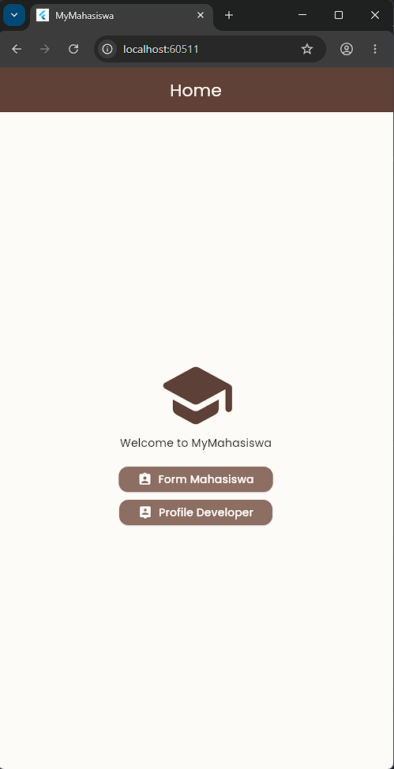
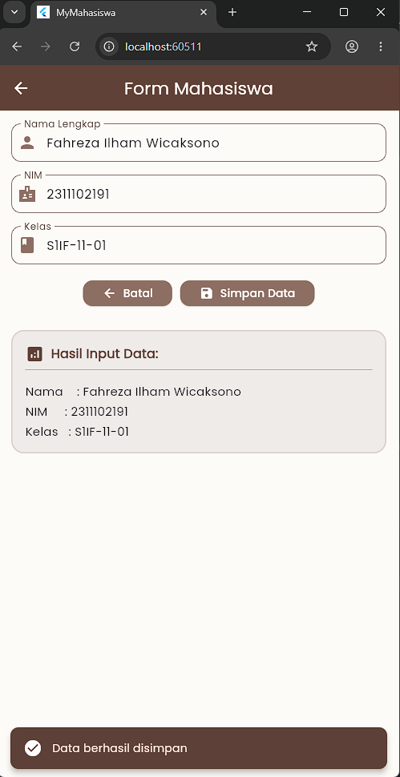
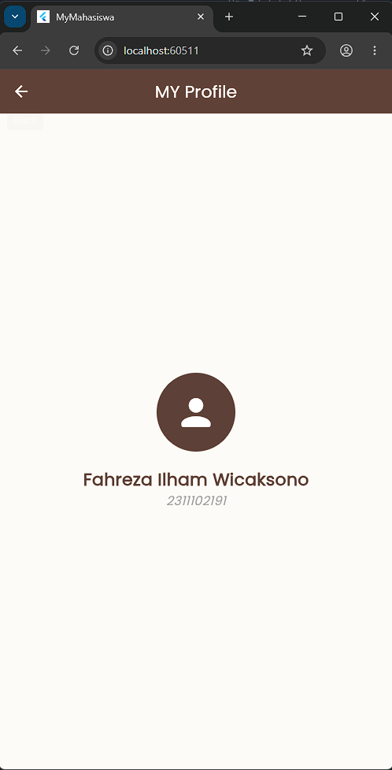
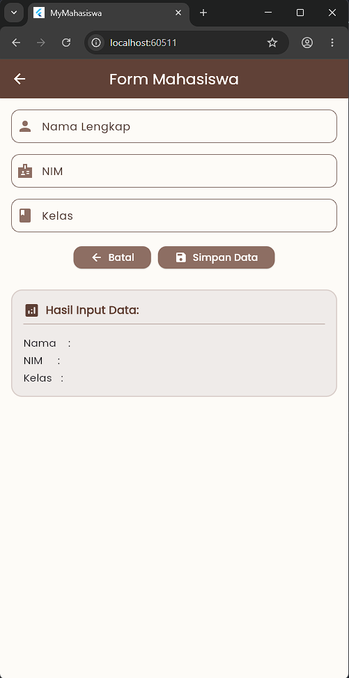

<div align="center">
  <br />

  <h1>LAPORAN PRAKTIKUM <br>
  APLIKASI BERBASIS PLATFORM
  </h1>

  <br />

  <h3>MODUL 7 <br>
  NAVIGASI DAN NOTIFIKASI
  </h3>

  <br />

  

  <br />
  <br />
  <br />

  <h3>Disusun Oleh :</h3>

  <p>
    <strong>Fahreza Ilham Wicaksono</strong><br>
    <strong>2311102191</strong><br>
    <strong>S1 IF-11-REG01</strong>
  </p>

  <br />

  <h3>Dosen Pengampu :</h3>

  <p>
    <strong>Dimas Fanny Hebrasianto Permadi, S.ST., M.Kom</strong>
  </p>
  
  <br />
  <br />
    <h4>Asisten Praktikum :</h4>
    <strong> Apri Pandu Wicaksono </strong> <br>
    <strong>Rangga Pradarrell Fathi</strong>
  <br />

  <h3>LABORATORIUM HIGH PERFORMANCE
 <br>FAKULTAS INFORMATIKA <br>UNIVERSITAS TELKOM PURWOKERTO <br>2026</h3>
</div>

<hr>

## Tugas

Buat aplikasi sederhana bertema **“Data Mahasiswa”** dengan ketentuan:

- Memiliki 3 halaman:
  1. Home
  2. Form Mahasiswa
  3. Profil Developer

- Form berisi:
  - Nama
  - NIM
  - Kelas

- Tambahkan tombol **Simpan** untuk menampilkan data yang diinput.

- Saat tombol ditekan, tampilkan **SnackBar** sebagai notifikasi berhasil.

- Gunakan:
  - StatefulWidget
  - StatelessWidget
  - Navigator.push & Navigator.pop
  - Google Fonts package

- Tambahkan minimal:
  - AppBar
  - Container
  - Column
  - ElevatedButton

## Bonus

- Icon
- Tema warna menarik

## Pengerjaan

Aplikasi ini merupakan aplikasi sederhana untuk menginputkan dan menampilkan data mahasiswa. Di dalam aplikasi terdapat beberapa halaman seperti halaman utama, form input mahasiswa, dan halaman profil developer.

### HomePage

```dart
class MyHomePage extends StatelessWidget {
  const MyHomePage({super.key});

  @override
  Widget build(BuildContext context) {
    return Scaffold(
      appBar: AppBar(title: const Text('Home')),
      body: Center(
        child: Padding(
          padding: const EdgeInsets.all(24.0),
          child: Column(
            mainAxisAlignment: MainAxisAlignment.center,
            children: [
              const Icon(
                Icons.school_rounded,
                size: 100,
                color: Color(0xFF5D4037),
              ),
              const Text('Welcome to MyMahasiswa'),
              const SizedBox(height: 20),
              ElevatedButton.icon(
                onPressed: () {
                  Navigator.push(
                    context,
                    MaterialPageRoute(builder: (context) => const FormPage()),
                  );
                },
                icon: const Icon(Icons.assignment_ind_rounded),
                label: const Text('Form Mahasiswa'),
              ),
              const SizedBox(height: 10),
              ElevatedButton.icon(
                onPressed: () {
                  Navigator.push(
                    context,
                    MaterialPageRoute(
                      builder: (context) => const ProfilePage(),
                    ),
                  );
                },
                icon: const Icon(Icons.person_pin_rounded),
                label: const Text('Profile Developer'),
              ),
            ],
          ),
        ),
      ),
    );
  }
}
```

`HomePage` berfungsi sebagai halaman utama yang pertama kali muncul saat aplikasi dijalankan. Pada halaman ini digunakan widget `Scaffold` sebagai kerangka dasar halaman yang berisi `AppBar` dan `body`. Di dalam `body` terdapat `Column` yang digunakan untuk menyusun komponen secara vertikal agar tampilan lebih rapi. Halaman ini menampilkan icon sekolah sebagai identitas aplikasi, teks sambutan, serta dua tombol navigasi utama.

Widget `ElevatedButton.icon` digunakan untuk membuat tombol yang memiliki icon dan teks. Tombol pertama digunakan untuk membuka halaman form mahasiswa. Ketika tombol ditekan, aplikasi menjalankan `Navigator.push()` untuk berpindah dari halaman `HomePage` menuju `FormPage`. Sementara itu, tombol kedua digunakan untuk membuka halaman profil developer dengan alur navigasi yang sama menuju `ProfilePage`.



### FormPage

```dart
class FormPage extends StatefulWidget {
  const FormPage({super.key});

  @override
  State<FormPage> createState() => _FormPageState();
}

class _FormPageState extends State<FormPage> {
  final TextEditingController _namaController = TextEditingController();
  final TextEditingController _nimController = TextEditingController();
  final TextEditingController _kelasController = TextEditingController();

  String _namaDisplay = '';
  String _nimDisplay = '';
  String _kelasDisplay = '';

  @override
  void dispose() {
    _namaController.dispose();
    _nimController.dispose();
    _kelasController.dispose();
    super.dispose();
  }

  @override
  Widget build(BuildContext context) {
    return Scaffold(
      appBar: AppBar(title: const Text('Form Mahasiswa')),
      body: Padding(
        padding: const EdgeInsets.all(16.0),
        child: SingleChildScrollView(
          child: Column(
            children: [
              TextField(
                controller: _namaController,
                decoration: const InputDecoration(
                  labelText: 'Nama Lengkap',
                  prefixIcon: Icon(Icons.person, color: Color(0xFF8D6E63)),
                  border: OutlineInputBorder(
                    borderRadius: BorderRadius.all(Radius.circular(12)),
                  ),
                ),
              ),
              const SizedBox(height: 16),
              TextField(
                controller: _nimController,
                keyboardType: TextInputType.number,
                decoration: const InputDecoration(
                  labelText: 'NIM',
                  prefixIcon: Icon(Icons.badge_sharp, color: Color(0xFF8D6E63)),
                  border: OutlineInputBorder(
                    borderRadius: BorderRadius.all(Radius.circular(12)),
                  ),
                ),
              ),
              const SizedBox(height: 16),
              TextField(
                controller: _kelasController,
                decoration: const InputDecoration(
                  labelText: 'Kelas',
                  prefixIcon: Icon(
                    Icons.class_rounded,
                    color: Color(0xFF8D6E63),
                  ),
                  border: OutlineInputBorder(
                    borderRadius: BorderRadius.all(Radius.circular(12)),
                  ),
                ),
              ),
              const SizedBox(height: 20),
              Row(
                mainAxisAlignment: MainAxisAlignment.center,
                children: [
                  ElevatedButton.icon(
                    onPressed: () {
                      Navigator.pop(context);
                    },
                    icon: const Icon(Icons.arrow_back),
                    label: const Text('Batal'),
                  ),
                  const SizedBox(width: 10),
                  ElevatedButton.icon(
                    onPressed: () {
                      setState(() {
                        _namaDisplay = _namaController.text;
                        _nimDisplay = _nimController.text;
                        _kelasDisplay = _kelasController.text;
                      });

                      ScaffoldMessenger.of(context).showSnackBar(
                        const SnackBar(
                          content: const Row(
                            children: [
                              Icon(Icons.check_circle, color: Colors.white),
                              SizedBox(width: 12),
                              Text('Data berhasil disimpan'),
                            ],
                          ),
                          backgroundColor: const Color(0xFF5D4037),
                          behavior: SnackBarBehavior.floating,
                          shape: RoundedRectangleBorder(
                            borderRadius: BorderRadius.all(Radius.circular(10)),
                          ),
                        ),
                      );
                    },
                    icon: const Icon(Icons.save_rounded),
                    label: const Text('Simpan Data'),
                  ),
                ],
              ),
              const SizedBox(height: 30),

              // Untuk menampilkan data
              Container(
                width: double.infinity,
                padding: const EdgeInsets.all(16.0),
                decoration: BoxDecoration(
                  color: const Color(0xFFEFEBE9),
                  borderRadius: BorderRadius.circular(16),
                  border: Border.all(
                    color: const Color(0xFFD7CCC8),
                    width: 1.5,
                  ),
                ),
                child: Column(
                  crossAxisAlignment: CrossAxisAlignment.start,
                  children: [
                    const Row(
                      children: [
                        Icon(Icons.analytics_rounded, color: Color(0xFF5D4037)),
                        SizedBox(width: 8),
                        Text(
                          'Hasil Input Data:',
                          style: TextStyle(
                            fontWeight: FontWeight.bold,
                            fontSize: 16,
                            color: Color(0xFF5D4037),
                          ),
                        ),
                      ],
                    ),
                    const Divider(color: Color(0xFFBCAAA4), thickness: 1),
                    const SizedBox(height: 8),
                    Text(
                      'Nama    : $_namaDisplay',
                      style: const TextStyle(fontSize: 15),
                    ),
                    const SizedBox(height: 4),
                    Text(
                      'NIM     : $_nimDisplay',
                      style: const TextStyle(fontSize: 15),
                    ),
                    const SizedBox(height: 4),
                    Text(
                      'Kelas   : $_kelasDisplay',
                      style: const TextStyle(fontSize: 15),
                    ),
                  ],
                ),
              ),
            ],
          ),
        ),
      ),
    );
  }
}
```

`FormPage` digunakan sebagai halaman untuk melakukan input data mahasiswa. Halaman ini memakai `StatefulWidget` karena data pada halaman dapat berubah sesuai input pengguna. Pada bagian awal terdapat beberapa `TextField` yang digunakan untuk menerima masukan berupa nama lengkap, NIM, dan kelas. Masing-masing `TextField` dihubungkan dengan `TextEditingController` agar data yang diketik pengguna dapat diambil dan diproses oleh aplikasi. Di bagian bawah form terdapat dua tombol yang dibuat menggunakan `ElevatedButton.icon`. Tombol pertama adalah tombol batal yang digunakan untuk kembali ke halaman sebelumnya. Saat tombol ditekan, aplikasi menjalankan `Navigator.pop(context)` sehingga halaman form ditutup dan pengguna kembali ke `HomePage`.

Tombol kedua digunakan untuk menyimpan data yang telah diinput pengguna. Ketika tombol ditekan, aplikasi menjalankan `setState()` untuk memperbarui nilai variabel tampilan sesuai isi form. Setelah data berhasil diperbarui, aplikasi menampilkan `SnackBar` sebagai notifikasi bahwa data berhasil disimpan. Data yang telah dimasukkan kemudian ditampilkan kembali pada bagian hasil input data di bawah form sehingga pengguna dapat melihat hasil input secara langsung. Selain itu, widget `Container` digunakan untuk menampilkan hasil data input. Data yang sebelumnya kosong akan berubah sesuai input pengguna setelah tombol simpan ditekan.



### ProfilePage

```dart
class ProfilePage extends StatelessWidget {
  const ProfilePage({super.key});

  @override
  Widget build(BuildContext context) {
    return Scaffold(
      appBar: AppBar(title: const Text('MY Profile')),
      body: Center(
        child: Padding(
          padding: const EdgeInsets.all(24.0),
          child: Column(
            mainAxisAlignment: MainAxisAlignment.center,
            children: [
              const CircleAvatar(
                radius: 50,
                backgroundColor: Color(0xFF5D4037),
                child: Icon(
                  Icons.person_rounded,
                  size: 55,
                  color: Colors.white,
                ),
              ),
              const SizedBox(height: 20),
              const Text(
                'Fahreza Ilham Wicaksono',
                style: TextStyle(
                  fontSize: 22,
                  fontWeight: FontWeight.bold,
                  color: Color(0xFF5D4037),
                ),
              ),
              const Text(
                '2311102191',
                style: TextStyle(
                  fontSize: 16,
                  color: Colors.grey,
                  fontStyle: FontStyle.italic,
                ),
              ),
            ],
          ),
        ),
      ),
    );
  }
}
```

`ProfilePage` digunakan untuk menampilkan identitas developer aplikasi. Pada halaman ini digunakan widget `CircleAvatar` untuk menampilkan avatar berbentuk lingkaran sehingga tampilan profil terlihat lebih menarik. Di bawah avatar terdapat widget `Text` yang digunakan untuk menampilkan nama dan NIM developer. Semua komponen disusun menggunakan `Column` dan diposisikan di tengah layar menggunakan `Center`.



### Icon dan Styling

#### Icon

```dart
const Icon(
Icons.school_rounded,
size: 100,
color: Color(0xFF5D4037),
),
const Text('Welcome to MyMahasiswa'),
const SizedBox(height: 20),
ElevatedButton.icon(
onPressed: () {
    Navigator.push(
    context,
    MaterialPageRoute(builder: (context) => const FormPage()),
    );
},
icon: const Icon(Icons.assignment_ind_rounded),
label: const Text('Form Mahasiswa'),
),
const SizedBox(height: 10),
ElevatedButton.icon(
onPressed: () {
    Navigator.push(
    context,
    MaterialPageRoute(
        builder: (context) => const ProfilePage(),
    ),
    );
},
icon: const Icon(Icons.person_pin_rounded),
label: const Text('Profile Developer'),
),
```

Flutter menyediakan icon bawaan yang dapat dipanggil menggunakan widget `Icon` dan kumpulan icon dari class `Icons`. Pemanggilan icon dilakukan dengan menuliskan widget `Icon()` kemudian menentukan jenis icon yang ingin digunakan, misalnya `Icons.home`, `Icons.person`, atau `Icons.settings`. Setelah dipanggil, icon dapat diatur ukuran, warna, dan posisinya sesuai kebutuhan tampilan aplikasi. Selain digunakan sebagai tampilan biasa, icon juga sering digabungkan dengan komponen lain seperti tombol misalnya pada `ElevatedButton.icon`.

#### Styling

```dart
class MyApp extends StatelessWidget {
  const MyApp({super.key});

  // This widget is the root of your application.
  @override
  Widget build(BuildContext context) {
    return MaterialApp(
      title: 'MyMahasiswa',
      theme: ThemeData(
        scaffoldBackgroundColor: const Color(0xFFFDFBF7),

        colorScheme: ColorScheme.fromSeed(
          seedColor: const Color(0xFF8D6E63),
          primary: const Color(0xFF5D4037),
          secondary: const Color(0xFFD7CCC8),
        ),

        appBarTheme: const AppBarTheme(
          backgroundColor: Color(0xFF5D4037),
          foregroundColor: Colors.white,
          elevation: 2,
          centerTitle: true,
        ),

        elevatedButtonTheme: ElevatedButtonThemeData(
          style: ElevatedButton.styleFrom(
            backgroundColor: const Color(0xFF8D6E63),
            foregroundColor: Colors.white,
            padding: const EdgeInsets.symmetric(horizontal: 24, vertical: 12),
            shape: RoundedRectangleBorder(
              borderRadius: BorderRadius.circular(12),
            ),
          ),
        ),

        textTheme: GoogleFonts.poppinsTextTheme(Theme.of(context).textTheme),
      ),
      home: MyHomePage(),
      debugShowCheckedModeBanner: false,
    );
  }
}
```

Pengaturan warna dilakukan melalui `ThemeData` sehingga seluruh halaman memiliki kombinasi warna yang sama. Selain itu, style pada tombol dibuat menggunakan `ElevatedButtonThemeData` agar semua tombol memiliki bentuk, warna, dan ukuran yang seragam. Penggunaan font `Poppins` melalui `textTheme` juga membuat tampilan teks terlihat lebih modern dan mudah dibaca oleh pengguna.

## Source Code

```dart
import 'package:flutter/material.dart';
import 'package:google_fonts/google_fonts.dart';

void main() {
  runApp(const MyApp());
}

class MyApp extends StatelessWidget {
  const MyApp({super.key});

  // This widget is the root of your application.
  @override
  Widget build(BuildContext context) {
    return MaterialApp(
      title: 'MyMahasiswa',
      theme: ThemeData(
        scaffoldBackgroundColor: const Color(0xFFFDFBF7),

        colorScheme: ColorScheme.fromSeed(
          seedColor: const Color(0xFF8D6E63),
          primary: const Color(0xFF5D4037),
          secondary: const Color(0xFFD7CCC8),
        ),

        appBarTheme: const AppBarTheme(
          backgroundColor: Color(0xFF5D4037),
          foregroundColor: Colors.white,
          elevation: 2,
          centerTitle: true,
        ),

        elevatedButtonTheme: ElevatedButtonThemeData(
          style: ElevatedButton.styleFrom(
            backgroundColor: const Color(0xFF8D6E63),
            foregroundColor: Colors.white,
            padding: const EdgeInsets.symmetric(horizontal: 24, vertical: 12),
            shape: RoundedRectangleBorder(
              borderRadius: BorderRadius.circular(12),
            ),
          ),
        ),

        textTheme: GoogleFonts.poppinsTextTheme(Theme.of(context).textTheme),
      ),
      home: MyHomePage(),
      debugShowCheckedModeBanner: false,
    );
  }
}

class MyHomePage extends StatelessWidget {
  const MyHomePage({super.key});

  @override
  Widget build(BuildContext context) {
    return Scaffold(
      appBar: AppBar(title: const Text('Home')),
      body: Center(
        child: Padding(
          padding: const EdgeInsets.all(24.0),
          child: Column(
            mainAxisAlignment: MainAxisAlignment.center,
            children: [
              const Icon(
                Icons.school_rounded,
                size: 100,
                color: Color(0xFF5D4037),
              ),
              const Text('Welcome to MyMahasiswa'),
              const SizedBox(height: 20),
              ElevatedButton.icon(
                onPressed: () {
                  Navigator.push(
                    context,
                    MaterialPageRoute(builder: (context) => const FormPage()),
                  );
                },
                icon: const Icon(Icons.assignment_ind_rounded),
                label: const Text('Form Mahasiswa'),
              ),
              const SizedBox(height: 10),
              ElevatedButton.icon(
                onPressed: () {
                  Navigator.push(
                    context,
                    MaterialPageRoute(
                      builder: (context) => const ProfilePage(),
                    ),
                  );
                },
                icon: const Icon(Icons.person_pin_rounded),
                label: const Text('Profile Developer'),
              ),
            ],
          ),
        ),
      ),
    );
  }
}

class ProfilePage extends StatelessWidget {
  const ProfilePage({super.key});

  @override
  Widget build(BuildContext context) {
    return Scaffold(
      appBar: AppBar(title: const Text('MY Profile')),
      body: Center(
        child: Padding(
          padding: const EdgeInsets.all(24.0),
          child: Column(
            mainAxisAlignment: MainAxisAlignment.center,
            children: [
              const CircleAvatar(
                radius: 50,
                backgroundColor: Color(0xFF5D4037),
                child: Icon(
                  Icons.person_rounded,
                  size: 55,
                  color: Colors.white,
                ),
              ),
              const SizedBox(height: 20),
              const Text(
                'Fahreza Ilham Wicaksono',
                style: TextStyle(
                  fontSize: 22,
                  fontWeight: FontWeight.bold,
                  color: Color(0xFF5D4037),
                ),
              ),
              const Text(
                '2311102191',
                style: TextStyle(
                  fontSize: 16,
                  color: Colors.grey,
                  fontStyle: FontStyle.italic,
                ),
              ),
            ],
          ),
        ),
      ),
    );
  }
}

class FormPage extends StatefulWidget {
  const FormPage({super.key});

  @override
  State<FormPage> createState() => _FormPageState();
}

class _FormPageState extends State<FormPage> {
  final TextEditingController _namaController = TextEditingController();
  final TextEditingController _nimController = TextEditingController();
  final TextEditingController _kelasController = TextEditingController();

  String _namaDisplay = '';
  String _nimDisplay = '';
  String _kelasDisplay = '';

  @override
  void dispose() {
    _namaController.dispose();
    _nimController.dispose();
    _kelasController.dispose();
    super.dispose();
  }

  @override
  Widget build(BuildContext context) {
    return Scaffold(
      appBar: AppBar(title: const Text('Form Mahasiswa')),
      body: Padding(
        padding: const EdgeInsets.all(16.0),
        child: SingleChildScrollView(
          child: Column(
            children: [
              TextField(
                controller: _namaController,
                decoration: const InputDecoration(
                  labelText: 'Nama Lengkap',
                  prefixIcon: Icon(Icons.person, color: Color(0xFF8D6E63)),
                  border: OutlineInputBorder(
                    borderRadius: BorderRadius.all(Radius.circular(12)),
                  ),
                ),
              ),
              const SizedBox(height: 16),
              TextField(
                controller: _nimController,
                keyboardType: TextInputType.number,
                decoration: const InputDecoration(
                  labelText: 'NIM',
                  prefixIcon: Icon(Icons.badge_sharp, color: Color(0xFF8D6E63)),
                  border: OutlineInputBorder(
                    borderRadius: BorderRadius.all(Radius.circular(12)),
                  ),
                ),
              ),
              const SizedBox(height: 16),
              TextField(
                controller: _kelasController,
                decoration: const InputDecoration(
                  labelText: 'Kelas',
                  prefixIcon: Icon(
                    Icons.class_rounded,
                    color: Color(0xFF8D6E63),
                  ),
                  border: OutlineInputBorder(
                    borderRadius: BorderRadius.all(Radius.circular(12)),
                  ),
                ),
              ),
              const SizedBox(height: 20),
              Row(
                mainAxisAlignment: MainAxisAlignment.center,
                children: [
                  ElevatedButton.icon(
                    onPressed: () {
                      Navigator.pop(context);
                    },
                    icon: const Icon(Icons.arrow_back),
                    label: const Text('Batal'),
                  ),
                  const SizedBox(width: 10),
                  ElevatedButton.icon(
                    onPressed: () {
                      setState(() {
                        _namaDisplay = _namaController.text;
                        _nimDisplay = _nimController.text;
                        _kelasDisplay = _kelasController.text;
                      });

                      ScaffoldMessenger.of(context).showSnackBar(
                        const SnackBar(
                          content: const Row(
                            children: [
                              Icon(Icons.check_circle, color: Colors.white),
                              SizedBox(width: 12),
                              Text('Data berhasil disimpan'),
                            ],
                          ),
                          backgroundColor: const Color(0xFF5D4037),
                          behavior: SnackBarBehavior.floating,
                          shape: RoundedRectangleBorder(
                            borderRadius: BorderRadius.all(Radius.circular(10)),
                          ),
                        ),
                      );
                    },
                    icon: const Icon(Icons.save_rounded),
                    label: const Text('Simpan Data'),
                  ),
                ],
              ),
              const SizedBox(height: 30),

              // Untuk menampilkan data
              Container(
                width: double.infinity,
                padding: const EdgeInsets.all(16.0),
                decoration: BoxDecoration(
                  color: const Color(0xFFEFEBE9),
                  borderRadius: BorderRadius.circular(16),
                  border: Border.all(
                    color: const Color(0xFFD7CCC8),
                    width: 1.5,
                  ),
                ),
                child: Column(
                  crossAxisAlignment: CrossAxisAlignment.start,
                  children: [
                    const Row(
                      children: [
                        Icon(Icons.analytics_rounded, color: Color(0xFF5D4037)),
                        SizedBox(width: 8),
                        Text(
                          'Hasil Input Data:',
                          style: TextStyle(
                            fontWeight: FontWeight.bold,
                            fontSize: 16,
                            color: Color(0xFF5D4037),
                          ),
                        ),
                      ],
                    ),
                    const Divider(color: Color(0xFFBCAAA4), thickness: 1),
                    const SizedBox(height: 8),
                    Text(
                      'Nama    : $_namaDisplay',
                      style: const TextStyle(fontSize: 15),
                    ),
                    const SizedBox(height: 4),
                    Text(
                      'NIM     : $_nimDisplay',
                      style: const TextStyle(fontSize: 15),
                    ),
                    const SizedBox(height: 4),
                    Text(
                      'Kelas   : $_kelasDisplay',
                      style: const TextStyle(fontSize: 15),
                    ),
                  ],
                ),
              ),
            ],
          ),
        ),
      ),
    );
  }
}

```

## Output





