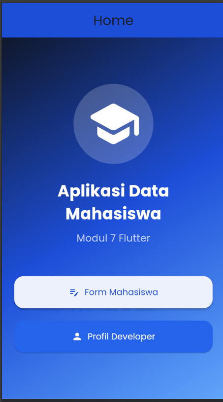

<div align="center">
  <br />

  <h1>LAPORAN PRAKTIKUM <br>
  APLIKASI BERBASIS PLATFORM
  </h1>

  <br />

  <h3>MODUL VII 

  NAVIGASI DAN NOTIFIKASI
  </h3>

  <br />

  

  <br />
  <br />
  <br />

  <h3>Disusun Oleh :</h3>

  <p>
    <strong>Andreas Besar Wibowo</strong><br>
    <strong>2311102198</strong><br>
    <strong>S1 IF-11-REG01</strong>
  </p>

  <br />

  <h3>Dosen Pengampu :</h3>

  <p>
    <strong>Dimas Fanny Hebrasianto Permadi, S.ST., M.Kom</strong>
  </p>
  
  <br />
    <h4>Asisten Praktikum :</h4>
    <strong>Apri Pandu Wicaksono </strong> <br>
    <strong>Rangga Pradarrell Fathi</strong>
  <br />

  <h3>LABORATORIUM HIGH PERFORMANCE
 <br>FAKULTAS INFORMATIKA <br>UNIVERSITAS TELKOM PURWOKERTO <br>2026</h3>
</div>

<hr>

## Dasar Teori
### 7.1. Model
#### 7.1.1 Pengenalan Model
Pada umumnya, hampir seluruh aplikasi yang dibuat akan bekerja dengan data. Data dalam sebuah aplikasi memiliki sangat banyak bentuk, tergantung dari aplikasi yang dibuat. Setiap data yang diterima atau dikirimkan akan lebih baik apabila memiliki standar yang sama. Hampir mustahil untuk melakukan pemeliharaan project yang kompleks tanpa model.

Model sendiri adalah bagian yang bersentuhan langsung dengan database dan mengkonversinya menjadi class dart yang dapat diakses lebih mudah. Umumnya model akan dibuat dari response JSON.

#### 7.1.2 Membuat Model Class
Untuk membuat model, buatlah direktori baru pada folder lib project flutter, kemudian buat sebuah file class dart dengan nama filenya adalah nama data yang ingin dijadikan model.

Sebagai contoh, ketika membuat model user dengan response json seperti di bawah ini.
```dart
{
 “user_id” : 1,
 “id” : 13,
 “title” : “Bedroom Pop”
}
```
Maka buatlah file user.dart di dalam folder models, dengan code seperti di bawah ini:
```dart
class Album {
  final int userId;
  final int id;
  final String title;

  const Album({
    required this.userId,
    required this.id,
    required this.title,
  });

  factory Album.fromJson(Map<String, dynamic> json) {
    return Album(
      userId: json['user_id'],
      id: json['id'],
      title: json['title'],
    );
  }
}
```
### 7.2. Navigation
#### 7.2.1 Navigation Pindah Halaman
Untuk melakukan navigasi ke halaman lain pada Flutter, dapat gunakan code seperti di bawah ini:
```dart
Navigator.push(
 context,
 MaterialPageRoute(builder: (context) => SecondRoute()),
);
```
Untuk melakukan navigasi kembali ke halaman sebelumnya, dapat gunakan code seperti di bawah ini:
```dart
Navigator.pop(context);
```
Potongan code di atas harus diletakkan dalam function sebuah widget, misalnya pada onPressed milik ElevatedButton. SecondRoute pada contoh dapat diubah menjadi halaman baru yang dituju.

#### 7.2.2 Navigation Mengirim Data
Untuk dapat melakukan navigasi dengan mengirimkan data ke halaman lain, perlu disiapkan 2 hal.
1. Halaman baru memiliki parameter data yang diminta.
2. Halaman awal mengirimkan data melalui parameter.
Untuk dapat melakukan hal tersebut, kita dapat membuat sebuah halaman baru seperti di bawah ini:
```dart
class DetailScreen extends StatelessWidget {
  const DetailScreen({
    Key? key,
    required this.title,
  }) : super(key: key);

  final String title;

  @override
  Widget build(BuildContext context) {
    return Scaffold(
      appBar: AppBar(
        title: Text(title),
      ),
    );
  }
}
```
Pada code di atas, telah dibuat halaman baru yang memiliki parameter data yang diinginkan yaitu atribut title dengan tipe data string.
```dart
Navigator.push(
 context,
 MaterialPageRoute(builder: (context) => DetailScreen(title: “Detail User”)),
);
```
Berbeda dengan contoh navigasi sebelumnya, pada navigasi di atas ditambahkan parameter title berisi string “Detail User” yang akan dikirimkan ke halaman baru.

### 7.3. Notification
Untuk mengirimkan notifikasi dalam aplikasi flutter, dapat digunakan package bernama flutter_local_notifications.

Tambahkan terlebih dahulu package tersebut ke dalam aplikasi flutter dengan menuliskan code di bawah pada pubspec.yaml
```dart
dependencies:
  flutter:
    sdk: flutter
  flutter_local_notifications: ^8.0.0
```
Setelah menambahkan package, ubah file AndroidManifest dengan menambahkan barisan kode seperti di bawah ini:
```dart
<uses-permission android:name="android.permission.RECEIVE_BOOT_COMPLETED" />
<uses-permission android:name="android.permission.VIBRATE" />
```
Buatlah sebuah stateful widget yang akan digunakan sebagai halaman aplikasi.

Tambahkan potongan kode di bawah ini di luar build dari stateful widget tersebut
```dart
FlutterLocalNotificationsPlugin flutterLocalNotificationsPlugin =
    FlutterLocalNotificationsPlugin();
```
Dengan membuat sebuah object FlutterLocalNotificationsPlugin, operasi yang terdapat dalam package flutter_notification dapat digunakan.

Override method initState dari widget tersebut dengan menambahkan code seperti di bawah ini:
```dart
void initState() {
  super.initState();

  var initializationSettingsAndroid =
      AndroidInitializationSettings('flutter_devs');

  var initializationSettingsIOs = IOSInitializationSettings();

  var initSetttings = InitializationSettings(
    initializationSettingsAndroid,
    initializationSettingsIOs,
  );

  flutterLocalNotificationsPlugin.initialize(
    initSetttings,
    onSelectNotification: onSelectNotification,
  );
}
```
Kemudian buat sebuah function yang akan mengendalikan ketika notifikasi dipilih:
```dart
Future onSelectNotification(String payload) {
  Navigator.of(context).push(
    MaterialPageRoute(
      builder: (_) {
        return NewScreen(
          payload: payload,
        );
      },
    ),
  );
}
```
Buatlah sebuah widget baru yang akan menjadi halaman berikutnya setelah notifikasi dipilih:
```dart
class NewScreen extends StatelessWidget {
  String payload;

  NewScreen({
    @required this.payload,
  });

  @override
  Widget build(BuildContext context) {
    return Scaffold(
      appBar: AppBar(
        title: Text(payload),
      ),
    );
  }
}
```
Kemudian buat sebuah function yang fungsinya untuk menampilkan notifikasi sederhana untuk android:
```dart
showNotification() async {
  var android = new AndroidNotificationDetails(
    'id',
    'channel ',
    'description',
    priority: Priority.High,
    importance: Importance.Max,
  );

  var iOS = new IOSNotificationDetails();

  var platform = new NotificationDetails(
    android,
    iOS,
  );

  await flutterLocalNotificationsPlugin.show(
    0,
    'Flutter devs',
    'Flutter Local Notification Demo',
    platform,
    payload: 'Welcome to the Local Notification demo ',
  );
}
```
AndroidNotificationDetails akan berisi mengenai detail notifikasi pada android.

IOSNotificationDetails akan berisi mengenai detail notifikasi pada iOS.

Kunci untuk menampilkan notifikasi terletak pada pemanggilan function 
flutterLocalNotificationsPlugin yang berfungsi untuk menampilkan notifikasi sesuai dengan platform yang digunakan.

Keseluruhan code di atas akan membentuk sebuah file seperti di bawah ini:

**main.dart**
```dart
import 'dart:async';

import 'package:flutter/material.dart';
import 'package:flutter_local_notifications/flutter_local_notifications.dart';

void main() => runApp(
      new MaterialApp(
        theme: ThemeData(
          appBarTheme: AppBarTheme(
            color: Colors.amber,
          ),
        ),
        home: new MyApp(),
        debugShowCheckedModeBanner: false,
      ),
    );

class MyApp extends StatefulWidget {
  @override
  _MyAppState createState() => _MyAppState();
}

class _MyAppState extends State<MyApp> {
  FlutterLocalNotificationsPlugin flutterLocalNotificationsPlugin =
      FlutterLocalNotificationsPlugin();

  @override
  void initState() {
    super.initState();

    var initializationSettingsAndroid =
        AndroidInitializationSettings('flutter_devs');

    var initializationSettingsIOs = IOSInitializationSettings();

    var initSetttings = InitializationSettings(
      initializationSettingsAndroid,
      initializationSettingsIOs,
    );

    flutterLocalNotificationsPlugin.initialize(
      initSetttings,
      onSelectNotification: onSelectNotification,
    );
  }

  Future onSelectNotification(String payload) {
    Navigator.of(context).push(
      MaterialPageRoute(
        builder: (_) {
          return NewScreen(
            payload: payload,
          );
        },
      ),
    );
  }

  @override
  Widget build(BuildContext context) {
    return Scaffold(
      appBar: new AppBar(
        backgroundColor: Colors.amber,
        title: new Text('Flutter notification demo'),
      ),
      body: new Center(
        child: Column(
          children: <Widget>[
            ButtonTheme(
              minWidth: 250.0,
              child: RaisedButton(
                color: Colors.blueAccent,
                onPressed: showNotification,
                child: new Text(
                  'showNotification',
                ),
              ),
            ),
          ],
        ),
      ),
    );
  }

  showNotification() async {
    var android = new AndroidNotificationDetails(
      'id',
      'channel ',
      'description',
      priority: Priority.High,
      importance: Importance.Max,
    );

    var iOS = new IOSNotificationDetails();

    var platform = new NotificationDetails(
      android,
      iOS,
    );

    await flutterLocalNotificationsPlugin.show(
      0,
      'Flutter devs',
      'Flutter Local Notification Demo',
      platform,
      payload: 'Welcome to the Local Notification demo ',
    );
  }
}

class NewScreen extends StatelessWidget {
  String payload;

  NewScreen({
    @required this.payload,
  });

  @override
  Widget build(BuildContext context) {
    return Scaffold(
      appBar: AppBar(
        title: Text(payload),
      ),
    );
  }
}
```
Di atas adalah keseluruhan kode yang digunakan untuk menampilkan sebuah notifikasi sederhana.
## Tugas
**Tugas Praktik Modul 7 – Flutter**

Buat aplikasi sederhana bertema “Data Mahasiswa” dengan ketentuan:
1. Memiliki 3 halaman: Home, Form Mahasiswa, Profil Developer
2. Form berisi: Nama, NIM, Kelas
3. Tambahkan tombol Simpan untuk menampilkan data yang diinput.
4. Saat tombol ditekan, tampilkan SnackBar sebagai notifikasi berhasil.
5. Gunakan: StatefulWidget, StatelessWidget, Navigator.push & Navigator.pop, Google Fonts package
6. Tambahkan minimal:AppBar, Container, Column, ElevatedButton
### Bonus
- Icon
- Tema warna menarik
### Output
Aplikasi dapat berpindah halaman, menampilkan data mahasiswa, dan menampilkan notifikasi SnackBar.

## Hasil
### Output



### Source Code
```dart
import 'package:flutter/material.dart';
import 'package:google_fonts/google_fonts.dart';

void main() {
  runApp(const MyApp());
}


/// ROOT APP
class MyApp extends StatelessWidget {
  const MyApp({super.key});

  @override
  Widget build(BuildContext context) {
    return MaterialApp(
      debugShowCheckedModeBanner: false,
      title: 'Data Mahasiswa',
      theme: ThemeData(
        primarySwatch: Colors.blue,
        textTheme: GoogleFonts.poppinsTextTheme(),
        scaffoldBackgroundColor: const Color(0xFFF5F9FF),
      ),
      home: const HomePage(),
    );
  }
}

/// HOME PAGE
class HomePage extends StatelessWidget {
  const HomePage({super.key});

  @override
  Widget build(BuildContext context) {
    return Scaffold(
      appBar: AppBar(
        title: const Text("Home"),
        centerTitle: true,
        backgroundColor: const Color(0xFF1D4ED8),
      ),

      body: Container(
        width: double.infinity,
        padding: const EdgeInsets.all(20),

        decoration: const BoxDecoration(
          gradient: LinearGradient(
            colors: [
              Color(0xFF0F172A),
              Color(0xFF1D4ED8),
              Color(0xFF60A5FA),
            ],
            begin: Alignment.topLeft,
            end: Alignment.bottomRight,
          ),
        ),

        child: Column(
          mainAxisAlignment: MainAxisAlignment.center,
          children: [
            Container(
              padding: const EdgeInsets.all(20),

              decoration: BoxDecoration(
                color: Colors.white.withOpacity(0.2),
                shape: BoxShape.circle,
              ),

              child: const Icon(
                Icons.school_rounded,
                size: 90,
                color: Colors.white,
              ),
            ),

            const SizedBox(height: 25),

            Text(
              "Aplikasi Data Mahasiswa",
              textAlign: TextAlign.center,

              style: GoogleFonts.poppins(
                fontSize: 26,
                fontWeight: FontWeight.bold,
                color: Colors.white,
              ),
            ),

            const SizedBox(height: 10),

            Text(
              "Modul 7 Flutter",

              style: GoogleFonts.poppins(
                fontSize: 16,
                color: Colors.white70,
              ),
            ),

            const SizedBox(height: 50),

            /// BUTTON FORM
            SizedBox(
              width: double.infinity,

              child: ElevatedButton.icon(
                icon: const Icon(Icons.edit_note_rounded),
                label: const Text("Form Mahasiswa"),

                style: ElevatedButton.styleFrom(
                  backgroundColor: Colors.white,
                  foregroundColor: const Color(0xFF1D4ED8),
                  padding: const EdgeInsets.symmetric(vertical: 16),

                  shape: RoundedRectangleBorder(
                    borderRadius: BorderRadius.circular(15),
                  ),
                ),

                onPressed: () {
                  Navigator.push(
                    context,
                    MaterialPageRoute(
                      builder: (context) =>
                      const FormMahasiswaPage(),
                    ),
                  );
                },
              ),
            ),

            const SizedBox(height: 20),

            /// BUTTON PROFILE
            SizedBox(
              width: double.infinity,

              child: ElevatedButton.icon(
                icon: const Icon(Icons.person_rounded),
                label: const Text("Profil Developer"),

                style: ElevatedButton.styleFrom(
                  backgroundColor: const Color(0xFF2563EB),
                  foregroundColor: Colors.white,
                  padding: const EdgeInsets.symmetric(vertical: 16),

                  shape: RoundedRectangleBorder(
                    borderRadius: BorderRadius.circular(15),
                  ),
                ),

                onPressed: () {
                  Navigator.push(
                    context,
                    MaterialPageRoute(
                      builder: (context) => const ProfilePage(),
                    ),
                  );
                },
              ),
            ),
          ],
        ),
      ),
    );
  }
}

/// FORM MAHASISWA PAGE
class FormMahasiswaPage extends StatefulWidget {
  const FormMahasiswaPage({super.key});

  @override
  State<FormMahasiswaPage> createState() =>
      _FormMahasiswaPageState();
}

class _FormMahasiswaPageState
    extends State<FormMahasiswaPage> {
  final TextEditingController namaController =
  TextEditingController();

  final TextEditingController nimController =
  TextEditingController();

  final TextEditingController kelasController =
  TextEditingController();

  String nama = "";
  String nim = "";
  String kelas = "";

  void simpanData() {
    setState(() {
      nama = namaController.text;
      nim = nimController.text;
      kelas = kelasController.text;
    });

    /// SNACKBAR HIJAU
    ScaffoldMessenger.of(context).showSnackBar(
      SnackBar(
        content: const Text(
          "Data berhasil disimpan!",
        ),

        backgroundColor: Colors.green,

        behavior: SnackBarBehavior.floating,

        shape: RoundedRectangleBorder(
          borderRadius: BorderRadius.circular(12),
        ),
      ),
    );
  }

  @override
  Widget build(BuildContext context) {
    return Scaffold(
      appBar: AppBar(
        title: const Text("Form Mahasiswa"),
        centerTitle: true,
        backgroundColor: const Color(0xFF1D4ED8),
      ),

      body: SingleChildScrollView(
        padding: const EdgeInsets.all(20),

        child: Column(
          children: [
            Container(
              padding: const EdgeInsets.all(20),

              decoration: BoxDecoration(
                color: Colors.blue.shade100,
                shape: BoxShape.circle,
              ),

              child: const Icon(
                Icons.account_circle,
                size: 80,
                color: Color(0xFF1D4ED8),
              ),
            ),

            const SizedBox(height: 25),

            /// INPUT NAMA
            TextField(
              controller: namaController,

              decoration: InputDecoration(
                filled: true,
                fillColor: Colors.white,
                labelText: "Nama",
                prefixIcon: const Icon(Icons.person),

                border: OutlineInputBorder(
                  borderRadius:
                  BorderRadius.circular(15),
                ),
              ),
            ),

            const SizedBox(height: 20),

            /// INPUT NIM
            TextField(
              controller: nimController,

              decoration: InputDecoration(
                filled: true,
                fillColor: Colors.white,
                labelText: "NIM",
                prefixIcon: const Icon(Icons.badge),

                border: OutlineInputBorder(
                  borderRadius:
                  BorderRadius.circular(15),
                ),
              ),
            ),

            const SizedBox(height: 20),

            /// INPUT KELAS
            TextField(
              controller: kelasController,

              decoration: InputDecoration(
                filled: true,
                fillColor: Colors.white,
                labelText: "Kelas",
                prefixIcon: const Icon(Icons.class_),

                border: OutlineInputBorder(
                  borderRadius:
                  BorderRadius.circular(15),
                ),
              ),
            ),

            const SizedBox(height: 30),

            /// BUTTON SIMPAN
            SizedBox(
              width: double.infinity,

              child: ElevatedButton.icon(
                onPressed: simpanData,
                icon: const Icon(Icons.save),
                label: const Text("Simpan Data"),

                style: ElevatedButton.styleFrom(
                  backgroundColor:
                  const Color(0xFF1D4ED8),

                  foregroundColor: Colors.white,

                  padding:
                  const EdgeInsets.symmetric(
                    vertical: 16,
                  ),

                  shape: RoundedRectangleBorder(
                    borderRadius:
                    BorderRadius.circular(15),
                  ),
                ),
              ),
            ),

            const SizedBox(height: 30),

            /// HASIL DATA
            Container(
              width: double.infinity,
              padding: const EdgeInsets.all(20),

              decoration: BoxDecoration(
                gradient: const LinearGradient(
                  colors: [
                    Color(0xFF1D4ED8),
                    Color(0xFF2563EB),
                    Color(0xFF60A5FA),
                  ],
                ),

                borderRadius:
                BorderRadius.circular(20),
              ),

              child: Column(
                crossAxisAlignment:
                CrossAxisAlignment.start,

                children: [
                  Row(
                    children: const [
                      Icon(
                        Icons.folder_shared,
                        color: Colors.white,
                      ),

                      SizedBox(width: 10),

                      Text(
                        "Data Mahasiswa",

                        style: TextStyle(
                          fontSize: 20,
                          fontWeight:
                          FontWeight.bold,
                          color: Colors.white,
                        ),
                      ),
                    ],
                  ),

                  const Divider(
                    color: Colors.white70,
                  ),

                  const SizedBox(height: 10),

                  Text(
                    "Nama : $nama",

                    style: const TextStyle(
                      color: Colors.white,
                      fontSize: 16,
                    ),
                  ),

                  const SizedBox(height: 8),

                  Text(
                    "NIM : $nim",

                    style: const TextStyle(
                      color: Colors.white,
                      fontSize: 16,
                    ),
                  ),

                  const SizedBox(height: 8),

                  Text(
                    "Kelas : $kelas",

                    style: const TextStyle(
                      color: Colors.white,
                      fontSize: 16,
                    ),
                  ),
                ],
              ),
            ),

            const SizedBox(height: 25),

            /// BUTTON KEMBALI
            SizedBox(
              width: double.infinity,

              child: ElevatedButton.icon(
                onPressed: () {
                  Navigator.pop(context);
                },

                icon: const Icon(
                  Icons.arrow_back,
                ),

                label: const Text("Kembali"),

                style: ElevatedButton.styleFrom(
                  backgroundColor:
                  const Color(0xFF1E3A8A),

                  foregroundColor: Colors.white,

                  padding:
                  const EdgeInsets.symmetric(
                    vertical: 15,
                  ),

                  shape: RoundedRectangleBorder(
                    borderRadius:
                    BorderRadius.circular(15),
                  ),
                ),
              ),
            ),
          ],
        ),
      ),
    );
  }
}

/// PROFILE PAGE
class ProfilePage extends StatelessWidget {
  const ProfilePage({super.key});

  @override
  Widget build(BuildContext context) {
    return Scaffold(
      appBar: AppBar(
        title: const Text("Profil Developer"),
        centerTitle: true,
        backgroundColor: const Color(0xFF1D4ED8),
      ),

      body: Container(
        width: double.infinity,

        decoration: const BoxDecoration(
          gradient: LinearGradient(
            colors: [
              Color(0xFF0F172A),
              Color(0xFF1D4ED8),
              Color(0xFF60A5FA),
            ],
            begin: Alignment.topCenter,
            end: Alignment.bottomCenter,
          ),
        ),

        child: Center(
          child: Padding(
            padding: const EdgeInsets.all(20),

            child: SingleChildScrollView(
              child: Container(
                width: double.infinity,
                padding: const EdgeInsets.all(25),

                decoration: BoxDecoration(
                  color: Colors.white,
                  borderRadius:
                  BorderRadius.circular(30),

                  boxShadow: const [
                    BoxShadow(
                      color: Colors.black26,
                      blurRadius: 10,
                      offset: Offset(0, 5),
                    ),
                  ],
                ),

                child: Column(
                  mainAxisSize: MainAxisSize.min,
                  children: [
                    /// FOTO PROFILE
                    Container(
                      decoration: BoxDecoration(
                        shape: BoxShape.circle,

                        border: Border.all(
                          color:
                          const Color(0xFF1D4ED8),
                          width: 4,
                        ),
                      ),

                      child: const CircleAvatar(
                        radius: 60,
                        backgroundColor:
                        Color(0xFF1D4ED8),

                        child: Icon(
                          Icons.person,
                          size: 70,
                          color: Colors.white,
                        ),
                      ),
                    ),

                    const SizedBox(height: 20),

                    /// NAMA
                    Text(
                      "Andreas Besar Wibowo",
                      textAlign: TextAlign.center,

                      style: GoogleFonts.poppins(
                        fontSize: 24,
                        fontWeight: FontWeight.bold,
                        color:
                        const Color(0xFF1D4ED8),
                      ),
                    ),

                    const SizedBox(height: 8),

                    Text(
                      "Mahasiswa Rekayasa Informatika '23",

                      style: GoogleFonts.poppins(
                        fontSize: 16,
                        color: Colors.grey[700],
                      ),
                    ),

                    const SizedBox(height: 25),

                    /// CARD INFO
                    Container(
                      width: double.infinity,
                      padding:
                      const EdgeInsets.all(18),

                      decoration: BoxDecoration(
                        color:
                        const Color(0xFFEFF6FF),

                        borderRadius:
                        BorderRadius.circular(
                          20,
                        ),
                      ),

                      child: Column(
                        children: [
                          Row(
                            children: [
                              const Icon(
                                Icons.school,
                                color:
                                Color(0xFF1D4ED8),
                              ),

                              const SizedBox(
                                width: 10,
                              ),

                              Text(
                                "Universitas",

                                style:
                                GoogleFonts
                                    .poppins(
                                  fontWeight:
                                  FontWeight
                                      .w600,
                                ),
                              ),
                            ],
                          ),

                          const SizedBox(height: 8),

                          Text(
                            "Telkom University PuertoRico",

                            style:
                            GoogleFonts.poppins(),
                          ),

                          const SizedBox(height: 15),

                          Row(
                            children: [
                              const Icon(
                                Icons.code,
                                color:
                                Color(0xFF1D4ED8),
                              ),

                              const SizedBox(
                                width: 10,
                              ),

                              Text(
                                "Skill",

                                style:
                                GoogleFonts
                                    .poppins(
                                  fontWeight:
                                  FontWeight
                                      .w600,
                                ),
                              ),
                            ],
                          ),

                          const SizedBox(height: 8),

                          Text(
                            "Frontend Developer",

                            style:
                            GoogleFonts.poppins(),
                          ),
                        ],
                      ),
                    ),

                    const SizedBox(height: 30),

                    /// BUTTON
                    SizedBox(
                      width: double.infinity,

                      child: ElevatedButton.icon(
                        onPressed: () {
                          Navigator.pop(context);
                        },

                        icon: const Icon(
                          Icons.home,
                        ),

                        label: const Text(
                          "Kembali ke Home",
                        ),

                        style:
                        ElevatedButton.styleFrom(
                          backgroundColor:
                          const Color(
                            0xFF1D4ED8,
                          ),

                          foregroundColor:
                          Colors.white,

                          padding:
                          const EdgeInsets.symmetric(
                            vertical: 15,
                          ),

                          shape:
                          RoundedRectangleBorder(
                            borderRadius:
                            BorderRadius
                                .circular(
                              15,
                            ),
                          ),
                        ),
                      ),
                    ),
                  ],
                ),
              ),
            ),
          ),
        ),
      ),
    );
  }
}
```
### Penjelasan Singkat
Aplikasi Flutter untuk Data Mahasiswa yang dibuat untuk menampilkan halaman utama, form input data, dan profile developer. Aplikasi ini dibuat semenarik mungkin dengan adanya navigasi dan notifikasi snackbar jika data berhasil disimpan. Dalam Aplikasi ini memiliki beberapa spesifikasi yaitu : 
- Menggunakan StatelessWidget dan StatefulWidget untuk membangun halaman aplikasi dan mengelola perubahan data.
- Memiliki 3 halaman utama yaitu Home, Form Mahasiswa, dan Profil Developer dengan navigasi menggunakan Navigator.push dan Navigator.pop.
- Form mahasiswa digunakan untuk menginput Nama, NIM, dan Kelas menggunakan TextField dan TextEditingController.
- Tombol Simpan akan menampilkan data yang diinput serta memunculkan SnackBar sebagai notifikasi berhasil.
- Tampilan aplikasi dibuat lebih modern menggunakan Container, Column, dan ElevatedButton.