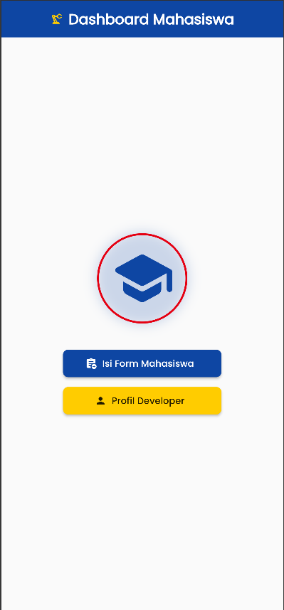
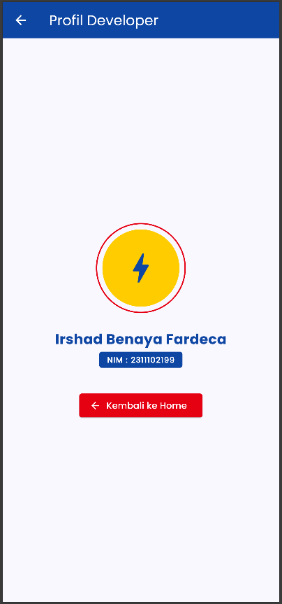
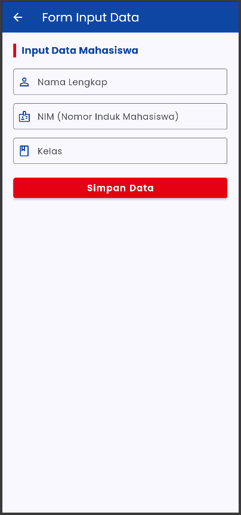
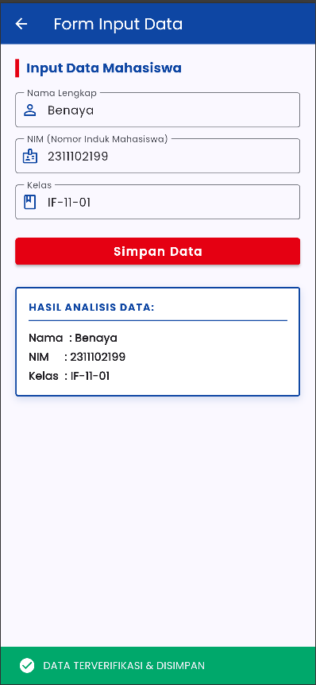

<div align="center">
  <br>

  <h1>LAPORAN PRAKTIKUM <br>
  APLIKASI BERBASIS PLATFORM
  </h1>

  <br>

  <h3>7 Mobile</h3>

  <br>

  


  <br>
  <br>
  <br>

  <h3>Disusun Oleh :</h3>

  <p>
    <strong>Irshad Benaya Fardeca</strong><br>
    <strong>2311102199</strong><br>
    <strong>S1 IF-11-REG01</strong>
  </p>

  <br>

  <h3>Dosen Pengampu :</h3>

  <p>
    <strong>Dimas Fanny Hebrasianto Permadi, S.ST., M.Kom</strong>
  </p>
  
  <br>
  <br>
    <h4>Asisten Praktikum :</h4>
    <strong>Apri Pandu Wicaksono </strong> <br>
    <strong>Rangga Pradarrell Fathi</strong>
  <br>

  <h3>LABORATORIUM HIGH PERFORMANCE
 <br>FAKULTAS INFORMATIKA <br>UNIVERSITAS TELKOM PURWOKERTO <br>2026</h3>
</div>
<hr>

# Dasar Teori

# MODUL 7. NAVIGASI DAN NOTIFIKASI

## 7.1. Model
## 7.1.1 Pengenalan Model
Pada umumnya, hampir seluruh aplikasi yang dibuat akan bekerja dengan data. Data dalam sebuah 
aplikasi memiliki sangat banyak bentuk, tergantung dari aplikasi yang dibuat. Setiap data yang 
diterima atau dikirimkan akan lebih baik apabila memiliki standar yang sama. Hampir mustahil untuk 
melakukan pemeliharaan project yang kompleks tanpa model.
Model sendiri adalah bagian yang bersentuhan langsung dengan database dan mengkonversinya 
menjadi class dart yang dapat diakses lebih mudah. Umumnya model akan dibuat dari response JSON.

## 7.1.2 Membuat Model Class
Untuk membuat model, buatlah direktori baru pada folder lib project flutter, kemudian buat sebuah 
file class dart dengan nama filenya adalah nama data yang ingin dijadikan model.
Sebagai contoh, ketika membuat model user dengan response json seperti di bawah ini:
```
}
 “user_id” : 1,
 “id” : 13,
 “title” : “Bedroom Pop”
}
```

Maka buatlah file user.dart di dalam folder models, dengan code seperti di bawah ini:

```
class Album {
 final int userId;
 final int id;
 final String title;
 const Album({
 required this.userId,
 required this.id,
 required this.title,
 });
 factory Album.fromJson(Map<String, dynamic> json) {
 return Album(
 userId: json['user_id'],
 id: json['id'],
 title: json['title'],
 );
 }
}
```

## 7.2. Navigation
## 7.2.1 Navigation Pindah Halaman
Untuk melakukan navigasi ke halaman lain pada Flutter, dapat gunakan code seperti di bawah ini:
```
Navigator.push(
 context,
 MaterialPageRoute(builder: (context) => SecondRoute()),
);
```
Untuk melakukan navigasi kembali ke halaman sebelumnya, dapat gunakan code seperti di bawah ini:
```
Navigator.pop(context);
```
Potongan code di atas harus diletakkan dalam function sebuah widget, misalnya pada onPressed
milik ElevatedButton. SecondRoute pada contoh dapat diubah menjadi halaman baru yang dituju.

## 7.2.2 Navigation Mengirim Data
Untuk dapat melakukan navigasi dengan mengirimkan data ke halaman lain, perlu disiapkan 2 hal.
1. Halaman baru memiliki parameter data yang diminta.
2. Halaman awal mengirimkan data melalui parameter.
Untuk dapat melakukan hal tersebut, kita dapat membuat sebuah halaman baru seperti di bawah ini:
```
class DetailScreen extends StatelessWidget {
 const DetailScreen({Key? key, required this.title}) : super(key: key)

final String title;
 
 @override
 Widget build(BuildContext context) {
 return Scaffold(
 appBar: AppBar(
 title: Text(title),
 ),
 );
 }
}
```
Pada code di atas, telah dibuat halaman baru yang memiliki parameter data yang diinginkan yaitu 
atribut title dengan tipe data string.
```
Navigator.push(
 context,
 MaterialPageRoute(builder: (context) => DetailScreen(title: “Detail User”)),
);
```
Berbeda dengan contoh navigasi sebelumnya, pada navigasi di atas ditambahkan parameter title 
berisi string “Detail User” yang akan dikirimkan ke halaman baru.

## 7.3. Notification
Untuk mengirimkan notifikasi dalam aplikasi flutter, dapat digunakan package bernama 
flutter_local_notifications. 
Tambahkan terlebih dahulu package tersebut ke dalam aplikasi flutter dengan menuliskan code di 
bawah pada pubspec.yaml.
```
dependencies:
 flutter:
 sdk: flutter
 flutter_local_notifications: ^8.0.0
```
Setelah menambahkan package, ubah file AndroidManifest dengan menambahkan barisan kode 
seperti di bawah ini:
```
<uses-permission android:name="android.permission.RECEIVE_BOOT_COMPLETED"/>
<uses-permission android:name="android.permission.VIBRATE" />
```
Buatlah sebuah stateful widget yang akan digunakan sebagai halaman aplikasi.
Tambahkan potongan kode di bawah ini di luar build dari stateful widget tersebut
```
FlutterLocalNotificationsPlugin flutterLocalNotificationsPlugin =FlutterLocalNotificationsPlugin();
```

Dengan membuat sebuah object FlutterLocalNotificationsPlugin, operasi yang terdapat dalam 
package flutter_notification dapat digunakan.
Override method initState dari widget tersebut dengan menambahkan code seperti di bawah ini:
```
void initState() {
 super.initState();
 var initializationSettingsAndroid =
 AndroidInitializationSettings('flutter_devs');
 var initializationSettingsIOs = IOSInitializationSettings();
 var initSetttings = InitializationSettings(
 initializationSettingsAndroid, initializationSettingsIOs);
 flutterLocalNotificationsPlugin.initialize(initSetttings,
 onSelectNotification: onSelectNotification);
}
```
Kemudian buat sebuah function yang akan mengendalikan ketika notifikasi dipilih:
```
Future onSelectNotification(String payload) {
 Navigator.of(context).push(MaterialPageRoute(builder: (_) {
 return NewScreen(
 payload: payload,
 );
 }));
}
```
Buatlah sebuah widget baru yang akan menjadi halaman berikutnya setelah notifikasi dipilih:
```
class NewScreen extends StatelessWidget {
 String payload;
 NewScreen({
 @required this.payload,
 });
 @override
 Widget build(BuildContext context) {
 return Scaffold(
 appBar: AppBar(
 title: Text(payload),
 ));
 }
}
```

Kemudian buat sebuah function yang fungsinya untuk menampilkan notifikasi sederhana untuk 
android:
```
showNotification() async {
 var android = new AndroidNotificationDetails(
 'id', 'channel ', 'description',
 priority: Priority.High, importance: Importance.Max);
 var iOS = new IOSNotificationDetails();
 var platform = new NotificationDetails(android, iOS);
 await flutterLocalNotificationsPlugin.show(
 0, 'Flutter devs', 'Flutter Local Notification Demo', platform,
 payload: 'Welcome to the Local Notification demo ');
}
```
AndroidNotificationDetails akan berisi mengenai detail notifikasi pada android.
IOSNotificationDetails akan berisi mengenai detail notifikasi pada iOS.
Kunci untuk menampilkan notifikasi terletak pada pemanggilan function 
flutterLocalNotificationsPlugin yang berfungsi untuk menampilkan notifikasi sesuai dengan platform 
yang digunakan.

## Source Code
```dart
import 'package:flutter/material.dart';
import 'package:google_fonts/google_fonts.dart';

void main() {
  runApp(const MyApp());
}

class MyApp extends StatelessWidget {
  const MyApp({super.key});

  @override
  Widget build(BuildContext context) {
    return MaterialApp(
      title: 'Data Mahasiswa',
      debugShowCheckedModeBanner: false,
      theme: ThemeData(
        useMaterial3: true,
        colorScheme: ColorScheme.fromSeed(
          seedColor: const Color(0xFF0E46A3),
          primary: const Color(0xFF0E46A3),
          secondary: const Color(0xFFE50012),
          tertiary: const Color(0xFFFFCC00),
        ),
        textTheme: GoogleFonts.poppinsTextTheme(Theme.of(context).textTheme),
      ),
      home: const HomeScreen(),
    );
  }
}

// ==========================================
// 1. HALAMAN HOME (StatelessWidget)
// ==========================================
class HomeScreen extends StatelessWidget {
  const HomeScreen({super.key});

  @override
  Widget build(BuildContext context) {
    final theme = Theme.of(context).colorScheme;

    return Scaffold(
      backgroundColor: Colors.grey[50],
      appBar: AppBar(
        title: Row(
          mainAxisAlignment: MainAxisAlignment.center,
          children: [
            Icon(Icons.precision_manufacturing_outlined, color: theme.tertiary, size: 20),
            const SizedBox(width: 8),
            const Text(
              'Dashboard Mahasiswa',
              style: TextStyle(fontWeight: FontWeight.bold, color: Colors.white),
            ),
          ],
        ),
        backgroundColor: theme.primary,
        centerTitle: true,
      ),
      body: Center(
        child: SingleChildScrollView(
          child: Column(
            mainAxisAlignment: MainAxisAlignment.center,
            children: [
              Container(
                padding: const EdgeInsets.all(16),
                decoration: BoxDecoration(
                  shape: BoxShape.circle,
                  border: Border.all(color: theme.secondary, width: 3),
                  boxShadow: [
                    BoxShadow(
                      color: theme.primary.withValues(alpha: 0.2),
                      blurRadius: 15,
                      spreadRadius: 2,
                    )
                  ]
                ),
                child: Icon(Icons.school_rounded, size: 100, color: theme.primary),
              ),
              const SizedBox(height: 40),
              ElevatedButton.icon(
                onPressed: () {
                  Navigator.push(
                    context,
                    MaterialPageRoute(builder: (context) => const FormScreen()),
                  );
                },
                icon: const Icon(Icons.assignment_add),
                label: const Text('Isi Form Mahasiswa'),
                style: ElevatedButton.styleFrom(
                  minimumSize: const Size(250, 50),
                  backgroundColor: theme.primary,
                  foregroundColor: Colors.white,
                  elevation: 3,
                  shape: RoundedRectangleBorder(
                    borderRadius: BorderRadius.circular(8),
                  ),
                ),
              ),
              const SizedBox(height: 15),
              
              ElevatedButton.icon(
                onPressed: () {
                  Navigator.push(
                    context,
                    MaterialPageRoute(
                      builder: (context) => const ProfileScreen(),
                    ),
                  );
                },
                icon: const Icon(Icons.person),
                label: const Text('Profil Developer'),
                style: ElevatedButton.styleFrom(
                  minimumSize: const Size(250, 50),
                  backgroundColor: theme.tertiary,
                  foregroundColor: Colors.black87,
                  elevation: 3,
                  shape: RoundedRectangleBorder(
                    borderRadius: BorderRadius.circular(8), // Sudut tegas
                  ),
                ),
              ),
            ],
          ),
        ),
      ),
    );
  }
}

// ==========================================
// 2. HALAMAN FORM MAHASISWA (StatefulWidget)
// ==========================================
class FormScreen extends StatefulWidget {
  const FormScreen({super.key});

  @override
  State<FormScreen> createState() => _FormScreenState();
}

class _FormScreenState extends State<FormScreen> {
  final TextEditingController _namaController = TextEditingController();
  final TextEditingController _nimController = TextEditingController();
  final TextEditingController _kelasController = TextEditingController();

  String nama = '';
  String nim = '';
  String kelas = '';
  bool isSubmitted = false;

  @override
  void dispose() {
    _namaController.dispose();
    _nimController.dispose();
    _kelasController.dispose();
    super.dispose();
  }

  @override
  Widget build(BuildContext context) {
    final theme = Theme.of(context).colorScheme;

    return Scaffold(
      appBar: AppBar(
        title: const Text(
          'Form Input Data',
          style: TextStyle(color: Colors.white),
        ),
        backgroundColor: theme.primary,
        iconTheme: const IconThemeData(color: Colors.white),
      ),
      body: SingleChildScrollView(
        padding: const EdgeInsets.all(20.0),
        child: Column(
          crossAxisAlignment: CrossAxisAlignment.stretch,
          children: [
            Row(
              children: [
                Container(
                  width: 5,
                  height: 25,
                  color: theme.secondary,
                ),
                const SizedBox(width: 10),
                Text(
                  'Input Data Mahasiswa',
                  style: GoogleFonts.poppins(
                    fontSize: 18,
                    fontWeight: FontWeight.bold,
                    color: theme.primary,
                  ),
                ),
              ],
            ),
            const SizedBox(height: 20),
            
            // Input Nama
            TextField(
              controller: _namaController,
              decoration: InputDecoration(
                labelText: 'Nama Lengkap',
                border: const OutlineInputBorder(),
                prefixIcon: Icon(Icons.person_outline, color: theme.primary),
                focusedBorder: OutlineInputBorder(
                  borderSide: BorderSide(color: theme.primary, width: 2),
                ),
              ),
            ),
            const SizedBox(height: 15),
            
            // Input NIM
            TextField(
              controller: _nimController,
              keyboardType: TextInputType.number,
              decoration: InputDecoration(
                labelText: 'NIM (Nomor Induk Mahasiswa)',
                border: const OutlineInputBorder(),
                prefixIcon: Icon(Icons.badge_outlined, color: theme.primary),
                focusedBorder: OutlineInputBorder(
                  borderSide: BorderSide(color: theme.primary, width: 2),
                ),
              ),
            ),
            const SizedBox(height: 15),
            
            // Input Kelas
            TextField(
              controller: _kelasController,
              decoration: InputDecoration(
                labelText: 'Kelas',
                border: const OutlineInputBorder(),
                prefixIcon: Icon(Icons.class_outlined, color: theme.primary),
                focusedBorder: OutlineInputBorder(
                  borderSide: BorderSide(color: theme.primary, width: 2),
                ),
              ),
            ),
            const SizedBox(height: 25),
            
            // Tombol Simpan
            ElevatedButton(
              onPressed: () {
                setState(() {
                  nama = _namaController.text;
                  nim = _nimController.text;
                  kelas = _kelasController.text;
                  isSubmitted = true;
                });

                // SnackBar Sukses
                ScaffoldMessenger.of(context).showSnackBar(
                  SnackBar(
                    content: Row(
                      children: const [
                        Icon(Icons.check_circle, color: Colors.white),
                        SizedBox(width: 10),
                        Text('DATA TERVERIFIKASI & DISIMPAN'),
                      ],
                    ),
                    backgroundColor: const Color(0xFF00A86B),
                    duration: const Duration(seconds: 2),
                  ),
                );
              },
              style: ElevatedButton.styleFrom(
                backgroundColor: theme.secondary,
                foregroundColor: Colors.white,
                padding: const EdgeInsets.symmetric(vertical: 15),
                elevation: 3,
                shape: RoundedRectangleBorder(
                  borderRadius: BorderRadius.circular(4), // Lebih bersudut/tajam
                ),
              ),
              child: const Text(
                'Simpan Data',
                style: TextStyle(fontSize: 16, fontWeight: FontWeight.bold, letterSpacing: 1.5),
              ),
            ),
            const SizedBox(height: 30),

            // Container Menampilkan Hasil Input
            if (isSubmitted)
              Container(
                padding: const EdgeInsets.all(16),
                decoration: BoxDecoration(
                  color: Colors.white,
                  borderRadius: BorderRadius.circular(4),
                  boxShadow: [
                    BoxShadow(
                      color: theme.primary.withValues(alpha: 0.15),
                      blurRadius: 8,
                      offset: const Offset(0, 4),
                    ),
                  ],
                  border: Border.all(color: theme.primary, width: 2),
                ),
                child: Column(
                  crossAxisAlignment: CrossAxisAlignment.start,
                  children: [
                    Row(
                      mainAxisAlignment: MainAxisAlignment.spaceBetween,
                      children: [
                        Text(
                          'HASIL ANALISIS DATA:',
                          style: GoogleFonts.poppins(
                            fontWeight: FontWeight.bold,
                            fontSize: 14,
                            color: theme.primary,
                            letterSpacing: 1
                          ),
                        ),
                      ],
                    ),
                    Divider(color: theme.primary, thickness: 1.5),
                    const SizedBox(height: 5),
                    Text(
                      'Nama  : $nama',
                      style: const TextStyle(
                        fontSize: 15,
                        fontWeight: FontWeight.w600,
                      ),
                    ),
                    const SizedBox(height: 5),
                    Text(
                      'NIM     : $nim',
                      style: const TextStyle(
                        fontSize: 15,
                        fontWeight: FontWeight.w600,
                      ),
                    ),
                    const SizedBox(height: 5),
                    Text(
                      'Kelas  : $kelas',
                      style: const TextStyle(
                        fontSize: 15,
                        fontWeight: FontWeight.w600,
                      ),
                    ),
                  ],
                ),
              ),
          ],
        ),
      ),
    );
  }
}

// ==========================================
// 3. HALAMAN PROFIL DEVELOPER (StatelessWidget)
// ==========================================
class ProfileScreen extends StatelessWidget {
  const ProfileScreen({super.key});

  @override
  Widget build(BuildContext context) {
    final theme = Theme.of(context).colorScheme;

    return Scaffold(
      appBar: AppBar(
        title: const Text(
          'Profil Developer',
          style: TextStyle(color: Colors.white),
        ),
        backgroundColor: theme.primary,
        iconTheme: const IconThemeData(color: Colors.white),
      ),
      body: Center(
        child: Padding(
          padding: const EdgeInsets.all(20.0),
          child: Column(
            mainAxisAlignment: MainAxisAlignment.center,
            children: [
              Stack(
                alignment: Alignment.center,
                children: [
                  Container(
                    width: 140,
                    height: 140,
                    decoration: BoxDecoration(
                      shape: BoxShape.circle,
                      border: Border.all(color: theme.secondary, width: 2, style: BorderStyle.solid),
                    ),
                  ),
                  CircleAvatar(
                    radius: 60,
                    backgroundColor: theme.tertiary,
                    child: Icon(Icons.bolt, size: 60, color: theme.primary),
                  ),
                ],
              ),
              const SizedBox(height: 25),
              Text(
                'Irshad Benaya Fardeca',
                style: GoogleFonts.poppins(
                  fontSize: 22,
                  fontWeight: FontWeight.bold,
                  color: theme.primary,
                ),
              ),
              const SizedBox(height: 4),
              Container(
                padding: const EdgeInsets.symmetric(horizontal: 12, vertical: 4),
                decoration: BoxDecoration(
                  color: theme.primary,
                  borderRadius: BorderRadius.circular(4)
                ),
                child: Text(
                  'NIM : 2311102199',
                  style: const TextStyle(
                    color: Colors.white,
                    fontWeight: FontWeight.bold,
                    fontSize: 12,
                    letterSpacing: 1
                  ),
                ),
              ),
              const SizedBox(height: 40),
              
              // Tombol Kembali
              ElevatedButton.icon(
                onPressed: () {
                  Navigator.pop(context);
                },
                icon: const Icon(Icons.arrow_back),
                label: const Text('Kembali ke Home'),
                style: ElevatedButton.styleFrom(
                  backgroundColor: theme.secondary,
                  foregroundColor: Colors.white,
                  minimumSize: const Size(200, 45),
                  shape: RoundedRectangleBorder(
                    borderRadius: BorderRadius.circular(4),
                  ),
                ),
              ),
            ],
          ),
        ),
      ),
    );
  }
}
```
### 1. Root Aplikasi (`MyApp`)
* **Fungsi:** Mengatur konfigurasi dasar aplikasi seperti judul, menonaktifkan *banner debug*, dan mendefinisikan tema global (`ThemeData`).
* **Tema Warna:** Menggunakan konsep Material 3 dengan dominasi warna:
  * 🔵 **Biru** (`#0E46A3`) sebagai warna *Primary*.
  * 🔴 **Merah** (`#E50012`) sebagai warna *Secondary*.
  * 🟡 **Kuning** (`#FFCC00`) sebagai warna *Tertiary*.

### 2. Halaman Utama (`HomeScreen` - *StatelessWidget*)
* **Fungsi:** Bertindak sebagai *dashboard* atau menu utama aplikasi.
* **Komponen:** 
  * Menampilkan logo ikon sekolah di dalam lingkaran dengan efek *box shadow*.
  * **Tombol "Isi Form Mahasiswa":** Berfungsi untuk berpindah (*navigasi*) ke `FormScreen`.
  * **Tombol "Profil Developer":** Berfungsi untuk berpindah ke `ProfileScreen`.

### 3. Halaman Form (`FormScreen` - *StatefulWidget*)
* **Fungsi:** Tempat pengguna memasukkan data teks mahasiswa menggunakan `TextField`.
* **Mekanisme Kerja:**
  * Menggunakan `TextEditingController` untuk menangkap input teks secara dinamis (Nama, NIM, dan Kelas).
  * Ketika tombol **"Simpan Data"** ditekan, fungsi `setState()` dipicu untuk memperbarui status aplikasi secara *real-time* (`isSubmitted = true`).
  * Menampilkan **SnackBar** (notifikasi hijau di bawah layar) sebagai tanda data berhasil diverifikasi dan disimpan.
  * Menampilkan *container* hasil analisis data di bagian bawah setelah data berhasil disubmit.

### 4. Halaman Profil (`ProfileScreen` - *StatelessWidget*)
* **Fungsi:** Menampilkan identitas resmi dari pembuat aplikasi.
* **Detail Developer:** Irshad Benaya Fardeca (NIM: 2311102199).
* **Komponen:** Menggunakan kombinasi widget `Stack` dan `CircleAvatar` untuk desain bingkai foto profil, serta tombol **"Kembali ke Home"** yang memicu `Navigator.pop(context)` untuk kembali ke halaman sebelumnya.

## Output






