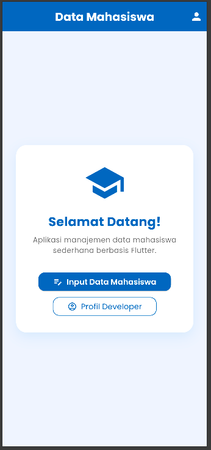
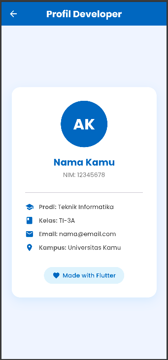
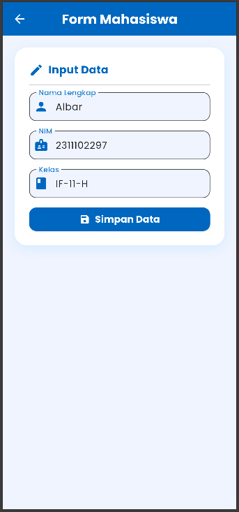
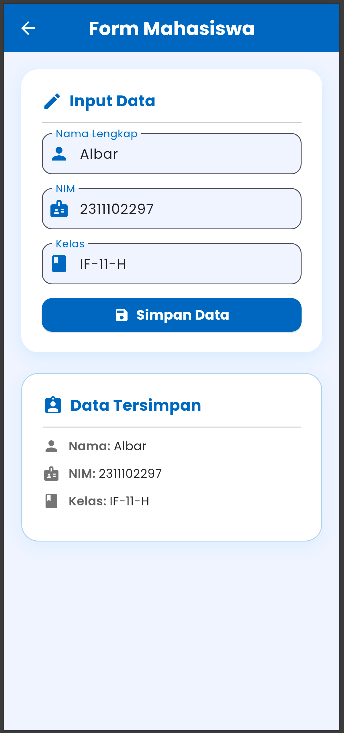

<div align="center">
  <br />
  <h1>LAPORAN PRAKTIKUM <br>APLIKASI BERBASIS PLATFORM</h1>
  <br />
  <h3>TUGAS MODUL 03 & 04 <br> Pengenalan Flutter</h3>
  <br />
  <br />
   
  <br />
  <br />
  <br />
  <br />
  <h3>Disusun Oleh :</h3>
  <p>
    <strong>M. Faleno Albar Firjatulloh</strong><br>
    <strong>2311102297</strong><br>
    <strong>S1 IF-11-01</strong>
  </p>
  <br />
  <br />
  <h3>Dosen Pengampu :</h3>
  <p>
    <strong>Dimas Fanny Hebrasianto Permadi, S.ST., M.Kom</strong>
  </p>
  <br />
  <br />
    <h4>Asisten Praktikum :</h4>
    <strong> Apri Pandu Wicaksono </strong> <br>
    <strong>Rangga Pradarrell Fathi</strong>
  <br />
  <h3>LABORATORIUM HIGH PERFORMANCE
 <br>FAKULTAS INFORMATIKA <br>UNIVERSITAS TELKOM PURWOKERTO <br>2026</h3>
</div>

---
# Aplikasi Data Mahasiswa - Flutter

---

## Struktur Folder
```
data_mahasiswa/
├── pubspec.yaml
└── lib/
    ├── main.dart
    └── pages/
        ├── home_page.dart
        ├── form_page.dart
        └── profil_page.dart
```

---

## 1. `main.dart`

```dart
void main() {
  runApp(const MyApp());
}

class MyApp extends StatelessWidget {
  const MyApp({super.key});

  @override
  Widget build(BuildContext context) {
    return MaterialApp(
      title: 'Data Mahasiswa',
      debugShowCheckedModeBanner: false,
      theme: ThemeData(
        colorScheme: ColorScheme.fromSeed(seedColor: const Color(0xFF1565C0)),
        textTheme: GoogleFonts.poppinsTextTheme(),
        useMaterial3: true,
      ),
      home: const HomePage(),
    );
  }
}
```

Kode ini merupakan file `main.dart` yang berfungsi sebagai titik awal aplikasi Flutter "Data Mahasiswa". Fungsi `main()` digunakan untuk menjalankan aplikasi melalui `runApp()` dengan widget utama `MyApp`.

Class `MyApp` merupakan turunan dari `StatelessWidget`, artinya widget ini bersifat statis dan tidak menyimpan data yang berubah. Di dalam method `build()`, terdapat `MaterialApp` sebagai kerangka utama aplikasi. Properti `title` digunakan untuk memberi nama aplikasi, `debugShowCheckedModeBanner: false` untuk menyembunyikan banner debug, `theme` untuk menerapkan tema global, dan `home` untuk menentukan halaman pertama yang ditampilkan yaitu `HomePage()`.

---

## 2. `pages/home_page.dart`

```dart
class HomePage extends StatelessWidget {
  const HomePage({super.key});

  @override
  Widget build(BuildContext context) {
    return Scaffold(
      backgroundColor: const Color(0xFFF0F4FF),
      appBar: AppBar(
        title: Text('Data Mahasiswa', style: GoogleFonts.poppins(...)),
        backgroundColor: const Color(0xFF1565C0),
        centerTitle: true,
        actions: [
          IconButton(
            icon: const Icon(Icons.person, color: Colors.white),
            onPressed: () {
              Navigator.push(
                context,
                MaterialPageRoute(builder: (_) => const ProfilPage()),
              );
            },
          ),
        ],
      ),
      body: Center(
        child: Container(
          margin: const EdgeInsets.all(24),
          padding: const EdgeInsets.all(32),
          decoration: BoxDecoration(
            color: Colors.white,
            borderRadius: BorderRadius.circular(20),
            boxShadow: [...],
          ),
          child: Column(
            mainAxisSize: MainAxisSize.min,
            children: [
              const Icon(Icons.school, size: 80, color: Color(0xFF1565C0)),
              ElevatedButton.icon(
                onPressed: () {
                  Navigator.push(
                    context,
                    MaterialPageRoute(builder: (_) => const FormPage()),
                  );
                },
                icon: const Icon(Icons.edit_note),
                label: const Text('Input Data Mahasiswa'),
              ),
              OutlinedButton.icon(
                onPressed: () {
                  Navigator.push(
                    context,
                    MaterialPageRoute(builder: (_) => const ProfilPage()),
                  );
                },
                label: const Text('Profil Developer'),
              ),
            ],
          ),
        ),
      ),
    );
  }
}
```

Kode ini merupakan halaman utama aplikasi yang menggunakan `StatelessWidget` karena hanya menampilkan tombol navigasi tanpa menyimpan data yang berubah.

`AppBar` digunakan sebagai bar navigasi di bagian atas layar. Properti `centerTitle: true` memposisikan judul di tengah, sedangkan `actions` digunakan untuk menempatkan `IconButton` di sisi kanan AppBar yang berfungsi membuka halaman profil.

`Navigator.push` digunakan untuk berpindah ke halaman baru dengan menambahkannya ke stack navigasi. `MaterialPageRoute` digunakan untuk membungkus halaman tujuan dengan animasi transisi Material Design.

`Container` digunakan sebagai pembungkus konten utama dengan dekorasi seperti `borderRadius` untuk sudut melengkung dan `boxShadow` untuk efek bayangan. `Column` dengan `mainAxisSize: MainAxisSize.min` menyusun widget secara vertikal dan hanya mengambil tinggi sebesar isi-nya. `ElevatedButton.icon` digunakan sebagai tombol utama yang memiliki ikon dan teks sekaligus.

---

## 3. `pages/form_page.dart`

```dart
class FormPage extends StatefulWidget {
  const FormPage({super.key});

  @override
  State<FormPage> createState() => _FormPageState();
}

class _FormPageState extends State<FormPage> {
  final _namaController  = TextEditingController();
  final _nimController   = TextEditingController();
  final _kelasController = TextEditingController();

  String? _savedNama;
  String? _savedNim;
  String? _savedKelas;

  @override
  void dispose() {
    _namaController.dispose();
    _nimController.dispose();
    _kelasController.dispose();
    super.dispose();
  }

  void _simpanData() {
    if (_namaController.text.isEmpty ||
        _nimController.text.isEmpty ||
        _kelasController.text.isEmpty) {
      ScaffoldMessenger.of(context).showSnackBar(
        SnackBar(content: Text('Semua field harus diisi!')),
      );
      return;
    }

    setState(() {
      _savedNama  = _namaController.text;
      _savedNim   = _nimController.text;
      _savedKelas = _kelasController.text;
    });

    ScaffoldMessenger.of(context).showSnackBar(
      SnackBar(
        content: Text('Data berhasil disimpan!'),
        backgroundColor: const Color(0xFF2E7D32),
        behavior: SnackBarBehavior.floating,
        duration: const Duration(seconds: 2),
      ),
    );
  }

  Widget _buildTextField({
    required TextEditingController controller,
    required String label,
    required String hint,
    required IconData icon,
  }) {
    return TextField(
      controller: controller,
      decoration: InputDecoration(
        labelText: label,
        hintText: hint,
        prefixIcon: Icon(icon, color: const Color(0xFF1565C0)),
        border: OutlineInputBorder(borderRadius: BorderRadius.circular(12)),
        filled: true,
        fillColor: const Color(0xFFF0F4FF),
      ),
    );
  }

  @override
  Widget build(BuildContext context) {
    return Scaffold(
      appBar: AppBar(
        leading: IconButton(
          icon: const Icon(Icons.arrow_back),
          onPressed: () => Navigator.pop(context),
        ),
      ),
      body: Column(
        children: [
          _buildTextField(controller: _namaController, ...),
          _buildTextField(controller: _nimController, ...),
          _buildTextField(controller: _kelasController, ...),
          ElevatedButton.icon(
            onPressed: _simpanData,
            label: const Text('Simpan Data'),
          ),
          if (_savedNama != null) ...[
            Text('Nama: $_savedNama'),
            Text('NIM: $_savedNim'),
            Text('Kelas: $_savedKelas'),
          ],
        ],
      ),
    );
  }
}
```

Kode ini merupakan halaman form input mahasiswa yang menggunakan `StatefulWidget` karena data di dalamnya dapat berubah sesuai input pengguna.

`TextEditingController` digunakan untuk membaca dan mengontrol nilai teks yang diketik pada setiap `TextField`. Variabel `_savedNama`, `_savedNim`, dan `_savedKelas` bertipe `String?` digunakan untuk menyimpan data yang sudah disubmit dan ditampilkan di bawah form.

Method `dispose()` wajib dipanggil untuk membersihkan `TextEditingController` saat halaman ditutup agar tidak terjadi memory leak.

Method `_simpanData()` berfungsi untuk menyimpan data setelah validasi input. Jika ada field kosong, `ScaffoldMessenger.of(context).showSnackBar()` digunakan untuk menampilkan notifikasi peringatan. Jika semua field terisi, `setState()` dipanggil untuk memperbarui variabel state sehingga UI ikut diperbarui, lalu `SnackBar` berhasil ditampilkan. Tanpa `setState()`, perubahan variabel tidak akan terlihat di layar.

Method `_buildTextField()` merupakan helper method pribadi (diawali `_`) untuk menghindari duplikasi kode. Method ini dipanggil tiga kali untuk membuat field Nama, NIM, dan Kelas. `Navigator.pop(context)` pada tombol back digunakan untuk kembali ke halaman sebelumnya dengan mengeluarkan halaman ini dari stack navigasi.

Conditional rendering `if (_savedNama != null) ...[...]` digunakan agar bagian preview data hanya ditampilkan setelah tombol Simpan ditekan dan data berhasil tersimpan.

---

## 4. `pages/profil_page.dart`

```dart
class ProfilPage extends StatelessWidget {
  const ProfilPage({super.key});

  @override
  Widget build(BuildContext context) {
    return Scaffold(
      appBar: AppBar(
        title: Text('Profil Developer'),
        leading: IconButton(
          icon: const Icon(Icons.arrow_back),
          onPressed: () => Navigator.pop(context),
        ),
      ),
      body: Center(
        child: Container(
          margin: const EdgeInsets.all(24),
          padding: const EdgeInsets.all(32),
          decoration: BoxDecoration(
            color: Colors.white,
            borderRadius: BorderRadius.circular(20),
          ),
          child: Column(
            mainAxisSize: MainAxisSize.min,
            children: [
              CircleAvatar(
                radius: 55,
                backgroundColor: const Color(0xFF1565C0),
                child: Text('AK', style: TextStyle(fontSize: 36, color: Colors.white)),
              ),
              Text('Nama Kamu'),
              Text('NIM: 12345678'),
              // info rows...
            ],
          ),
        ),
      ),
    );
  }
}
```

Kode ini merupakan halaman profil developer yang menggunakan `StatelessWidget` karena hanya menampilkan informasi statis tanpa perubahan data.

`Navigator.pop(context)` pada tombol back digunakan untuk kembali ke halaman sebelumnya. Method ini merupakan kebalikan dari `Navigator.push`, yaitu mengeluarkan halaman saat ini dari stack navigasi.

`CircleAvatar` merupakan widget khusus untuk menampilkan gambar atau inisial dalam bentuk lingkaran. Properti `radius` menentukan ukuran jari-jari lingkaran. `Center` digunakan untuk memposisikan seluruh konten di tengah layar secara horizontal dan vertikal.

---

## Konsep Navigator

```
Stack Navigasi:
┌─────────────────┐
│   ProfilPage    │  ← halaman aktif (paling atas)
├─────────────────┤
│    FormPage     │
├─────────────────┤
│    HomePage     │  ← halaman pertama (paling bawah)
└─────────────────┘
```

| Method | Fungsi |
|--------|--------|
| `Navigator.push(context, route)` | Menambah halaman baru di atas stack (maju) |
| `Navigator.pop(context)` | Menghapus halaman teratas dari stack (mundur) |
| `MaterialPageRoute(builder: (_) => Page())` | Membungkus halaman tujuan dengan animasi slide |

---

## Perbedaan StatelessWidget vs StatefulWidget

| | StatelessWidget | StatefulWidget |
|---|---|---|
| **Data** | Tidak berubah | Bisa berubah |
| **Memiliki setState()** | ❌ | ✅ |
| **Digunakan di** | `HomePage`, `ProfilPage` | `FormPage` |
| **Kapan dipakai** | Tampilan statis | Ada input user / data dinamis |

---
## Output
 
 
 
 