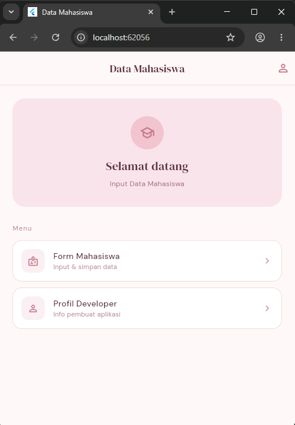
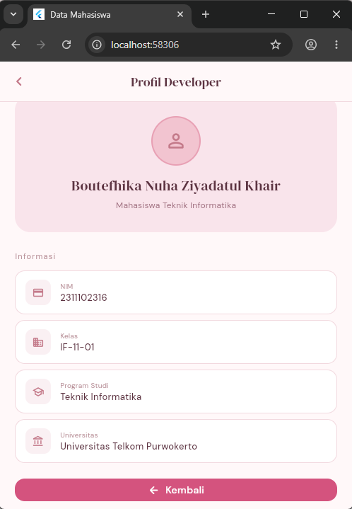
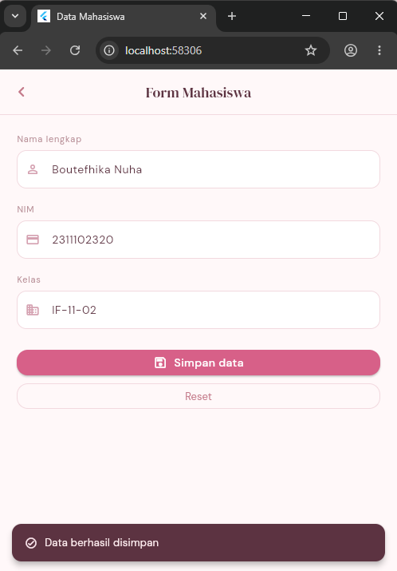
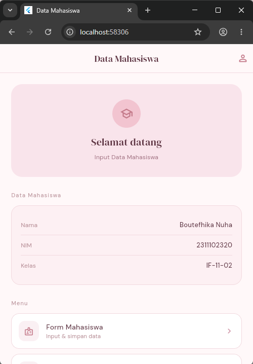

<div align="center">
  <br />

  <h1>LAPORAN PRAKTIKUM <br>
  APLIKASI BERBASIS PLATFORM
  </h1>

  <br />

  <h3>MODUL 7<br>
 NAVIGASI DAN NOTIFIKASI
  </h3>

  <br />

  


  <br />
  <br />
  <br />

  <h3>Disusun Oleh :</h3>

  <p>
    <strong>Boutefhika Nuha Ziyadatul Khair</strong><br>
    <strong>2311102316</strong><br>
    <strong>S1 IF-11-01</strong>
  </p>

  <br />

  <h3>Dosen Pengampu :</h3>

  <p>
    <strong>Dimas Fanny Hebrasianto Permadi, S.ST., M.Kom</strong>
  </p>
  
  <br />
  <br />
    <h4>Asisten Praktikum :</h4>
    <strong>Apri Pandu Wicaksono </strong> <br>
    <strong>Rangga Pradarrell Fathi</strong>
  <br />

  <h3>LABORATORIUM HIGH PERFORMANCE
 <br>FAKULTAS INFORMATIKA <br>UNIVERSITAS TELKOM PURWOKERTO <br>2026</h3>
</div>

<hr>

## Dasar Teori

### 1. Flutter
Flutter adalah framework open-source buatan Google untuk membangun aplikasi multiplatform (Android, iOS, Web, Desktop) dari satu codebase menggunakan bahasa pemrograman Dart. Flutter menggunakan konsep **widget** sebagai unit dasar pembangunan UI — setiap elemen tampilan, mulai dari teks hingga tombol, adalah sebuah widget.

### 2. Widget
Widget adalah blok pembangun utama di Flutter. Semua elemen UI di Flutter merupakan widget, dan widget-widget tersebut disusun membentuk **widget tree**. Ada dua jenis widget utama:

- **StatelessWidget** — widget yang tidak memiliki state (data yang bisa berubah). Tampilannya bersifat statis dan hanya bergantung pada data yang diterima saat widget dibuat. Cocok untuk halaman yang hanya menampilkan informasi tetap.

- **StatefulWidget** — widget yang memiliki state yang bisa berubah selama runtime. Ketika state berubah, Flutter akan merender ulang widget tersebut. Digunakan ketika UI perlu merespons interaksi pengguna seperti input form atau penerimaan data.

### 3. Navigasi (Navigator)
Flutter menggunakan konsep **stack** untuk manajemen halaman. Halaman-halaman disusun seperti tumpukan — halaman baru ditumpuk di atas halaman sebelumnya.

- **`Navigator.push`** — mendorong halaman baru ke atas stack (berpindah ke halaman baru). Dapat dikombinasikan dengan `await` untuk menunggu nilai kembalian dari halaman yang dibuka.

- **`Navigator.pop`** — mengeluarkan halaman teratas dari stack (kembali ke halaman sebelumnya). Dapat membawa data sebagai parameter kedua untuk dikirim balik ke halaman pemanggil.

### 4. State Management dengan setState
`setState()` adalah cara paling dasar untuk memperbarui tampilan di Flutter. Ketika `setState()` dipanggil, Flutter akan menjalankan ulang method `build()` sehingga UI diperbarui sesuai data terbaru.

### 5. Form dan Validasi
Flutter menyediakan widget `Form` bersama `TextFormField` untuk membangun form dengan validasi bawaan. `GlobalKey<FormState>` digunakan sebagai penghubung antara widget `Form` dan logika validasi.

### 6. SnackBar
SnackBar adalah notifikasi ringan yang muncul sementara di bagian bawah layar. Digunakan untuk memberi tahu pengguna bahwa suatu aksi berhasil dilakukan tanpa mengganggu alur aplikasi.

### 7. Google Fonts
Package `google_fonts` memungkinkan penggunaan ratusan font dari Google Fonts langsung di Flutter tanpa perlu mengunduh file font secara manual. Font dimuat secara otomatis saat pertama kali digunakan.

### 8. Material Design 3
Flutter mendukung **Material Design 3** (Material You) sebagai sistem desain bawaan. Komponen seperti `AppBar`, `ElevatedButton`, `Container`, dan `SnackBar` mengikuti panduan Material Design untuk tampilan yang konsisten dan modern. Kustomisasi dilakukan melalui `ThemeData` di `MaterialApp`.

## Penjelasan File

### `main.dart`
Entry point aplikasi. Berisi konfigurasi `MaterialApp` termasuk tema warna pastel pink dan pengaturan Google Fonts secara global.

### `home_screen.dart`
Halaman utama aplikasi. Menggunakan **StatefulWidget** karena perlu menyimpan dan menampilkan data mahasiswa yang dikirim balik dari halaman Form lewat `Navigator.pop`. Menampilkan kartu data mahasiswa setelah form diisi.

### `form_mahasiswa_screen.dart`
Halaman form input data mahasiswa. Menggunakan **StatefulWidget** karena mengelola `TextEditingController` dan validasi form. Setelah tombol Simpan ditekan, data dikirim balik ke Home lewat `Navigator.pop`.

### `profil_developer_screen.dart`
Halaman informasi developer. Menggunakan **StatelessWidget** karena tidak ada state yang berubah — hanya menampilkan data statis.

## Konsep Flutter yang Digunakan

### StatefulWidget
Digunakan di `HomeScreen` dan `FormMahasiswaScreen` karena kedua halaman ini memiliki data yang berubah (state). `HomeScreen` menyimpan data mahasiswa yang diterima dari form, sementara `FormMahasiswaScreen` mengelola input pengguna.

```dart
class HomeScreen extends StatefulWidget {
  const HomeScreen({super.key});
  @override
  State<HomeScreen> createState() => _HomeScreenState();
}
```

### StatelessWidget
Digunakan di `ProfilDeveloperScreen` dan widget-widget kecil seperti `_MenuItem`, `_DataRow`, `_InfoRow` karena tidak memiliki data yang berubah.

```dart
class ProfilDeveloperScreen extends StatelessWidget {
  const ProfilDeveloperScreen({super.key});
  ...
}
```

### Navigator.push
Digunakan untuk berpindah ke halaman baru. Di `HomeScreen`, `push` dikombinasikan dengan `await` untuk menunggu data yang dikirim balik.

```dart
final result = await Navigator.push(
  context,
  MaterialPageRoute(builder: (_) => const FormMahasiswaScreen()),
);
```

### Navigator.pop
Digunakan untuk kembali ke halaman sebelumnya sekaligus **mengirim data** mahasiswa ke `HomeScreen`.

```dart
Navigator.pop(context, {
  'nama': _namaCtrl.text.trim(),
  'nim': _nimCtrl.text.trim(),
  'kelas': _kelasCtrl.text.trim(),
});
```

### Google Fonts
Digunakan di seluruh aplikasi melalui `ThemeData` di `main.dart`. Font yang dipakai: **DM Serif Display** untuk judul dan **DM Sans** untuk teks biasa.

```dart
textTheme: GoogleFonts.dmSerifDisplayTextTheme().copyWith(
  bodyMedium: GoogleFonts.dmSans(...),
),
```

## Widget yang Digunakan

| Widget | Lokasi | Fungsi |
|---|---|---|
| `AppBar` | Semua halaman | Header navigasi tiap halaman |
| `Container` | Home, Form, Profil | Styling hero section, kartu data, info box |
| `Column` | Semua halaman | Menyusun elemen secara vertikal |
| `ElevatedButton` | Form, Profil | Tombol Simpan dan Kembali |
| `TextFormField` | Form | Input nama, NIM, kelas |
| `Form` + `GlobalKey` | Form | Validasi input sebelum disimpan |
| `SnackBar` | Form | Notifikasi data berhasil disimpan |
| `ListView` | Semua halaman | Scroll konten halaman |
| `Material` + `InkWell` | Home | Menu card dengan efek ripple |

## SourceCode

### Dependensi tambahan (`pubspec.yaml`)
```yaml
dependencies:
  google_fonts: ^6.1.0
```

### `main.dart`
```
import 'package:flutter/material.dart';
import 'package:google_fonts/google_fonts.dart';
import 'screens/home_screen.dart';

void main() => runApp(const MyApp());

class MyApp extends StatelessWidget {
  const MyApp({super.key});

  @override
  Widget build(BuildContext context) {
    return MaterialApp(
      title: 'Data Mahasiswa',
      debugShowCheckedModeBanner: false,
      theme: ThemeData(
        colorScheme: ColorScheme.fromSeed(
          seedColor: const Color(0xFFD4537E),
          primary: const Color(0xFFD4537E),
          secondary: const Color(0xFFF2C4D0),
          surface: const Color(0xFFFFF8F9),
          background: const Color(0xFFFFF8F9),
          onPrimary: Colors.white,
          onSurface: const Color(0xFF5C3341),
        ),
        useMaterial3: true,
        scaffoldBackgroundColor: const Color(0xFFFFF8F9),
        textTheme: GoogleFonts.dmSerifDisplayTextTheme().copyWith(
          bodyMedium: GoogleFonts.dmSans(
              color: const Color(0xFF5C3341), fontSize: 14),
          bodySmall: GoogleFonts.dmSans(
              color: const Color(0xFFB89098), fontSize: 12),
        ),
        appBarTheme: AppBarTheme(
          backgroundColor: const Color(0xFFFFF8F9),
          foregroundColor: const Color(0xFF5C3341),
          elevation: 0,
          centerTitle: true,
          scrolledUnderElevation: 0,
          titleTextStyle: GoogleFonts.dmSerifDisplay(
            color: const Color(0xFF5C3341),
            fontSize: 18,
            fontWeight: FontWeight.normal,
          ),
          iconTheme: const IconThemeData(color: Color(0xFFC47A8A)),
        ),
        dividerColor: const Color(0xFFF2D9DF),
        elevatedButtonTheme: ElevatedButtonThemeData(
          style: ElevatedButton.styleFrom(
            backgroundColor: const Color(0xFFD4537E),
            foregroundColor: Colors.white,
            elevation: 0,
            padding: const EdgeInsets.symmetric(horizontal: 28, vertical: 14),
            shape: RoundedRectangleBorder(
                borderRadius: BorderRadius.circular(14)),
            textStyle: GoogleFonts.dmSans(
                fontSize: 14, fontWeight: FontWeight.w500,
                letterSpacing: 0.4),
          ),
        ),
        inputDecorationTheme: InputDecorationTheme(
          filled: true,
          fillColor: Colors.white,
          border: OutlineInputBorder(
            borderRadius: BorderRadius.circular(12),
            borderSide: const BorderSide(color: Color(0xFFF2D9DF)),
          ),
          enabledBorder: OutlineInputBorder(
            borderRadius: BorderRadius.circular(12),
            borderSide: const BorderSide(color: Color(0xFFF2D9DF)),
          ),
          focusedBorder: OutlineInputBorder(
            borderRadius: BorderRadius.circular(12),
            borderSide:
                const BorderSide(color: Color(0xFFD4537E), width: 1.5),
          ),
          labelStyle:
              GoogleFonts.dmSans(color: const Color(0xFFB89098), fontSize: 13),
          prefixIconColor: const Color(0xFFD4A0B0),
          contentPadding:
              const EdgeInsets.symmetric(horizontal: 14, vertical: 13),
        ),
      ),
      home: const HomeScreen(),
    );
  }
}
```

### `home_screen.dart`
```
import 'package:flutter/material.dart';
import 'package:google_fonts/google_fonts.dart';
import 'form_mahasiswa_screen.dart';
import 'profil_developer_screen.dart';

class HomeScreen extends StatefulWidget {
  const HomeScreen({super.key});

  @override
  State<HomeScreen> createState() => _HomeScreenState();
}

class _HomeScreenState extends State<HomeScreen> {
  String? _nama, _nim, _kelas;

  void _bukaForm() async {
    final result = await Navigator.push(
      context,
      MaterialPageRoute(builder: (_) => const FormMahasiswaScreen()),
    );

    if (result != null && result is Map) {
      setState(() {
        _nama = result['nama'];
        _nim = result['nim'];
        _kelas = result['kelas'];
      });
    }
  }

  @override
  Widget build(BuildContext context) {
    return Scaffold(
      appBar: AppBar(
        title: Text('Data Mahasiswa',
            style: GoogleFonts.dmSerifDisplay(fontSize: 18)),
        actions: [
          IconButton(
            icon: const Icon(Icons.person_outline_rounded, size: 22),
            onPressed: () => Navigator.push(context,
                MaterialPageRoute(builder: (_) => const ProfilDeveloperScreen())),
          ),
        ],
        bottom: PreferredSize(
          preferredSize: const Size.fromHeight(1),
          child: Container(height: 1, color: const Color(0xFFF2D9DF)),
        ),
      ),
      body: ListView(
        padding: const EdgeInsets.all(22),
        children: [
          // ── Hero ──
          Container(
            padding: const EdgeInsets.symmetric(vertical: 30, horizontal: 20),
            decoration: BoxDecoration(
              color: const Color(0xFFF9E4EB),
              borderRadius: BorderRadius.circular(22),
            ),
            child: Column(
              children: [
                Container(
                  width: 56,
                  height: 56,
                  decoration: const BoxDecoration(
                    color: Color(0xFFF2C4D0),
                    shape: BoxShape.circle,
                  ),
                  child: const Icon(Icons.school_outlined,
                      size: 26, color: Color(0xFFC47A8A)),
                ),
                const SizedBox(height: 14),
                Text('Selamat datang',
                    style: GoogleFonts.dmSerifDisplay(
                        fontSize: 20, color: const Color(0xFF5C3341))),
                const SizedBox(height: 6),
                Text('Input Data Mahasiswa',
                    textAlign: TextAlign.center,
                    style: GoogleFonts.dmSans(
                        fontSize: 12,
                        color: const Color(0xFFA07080),
                        height: 1.5)),
              ],
            ),
          ),

          const SizedBox(height: 28),

          if (_nama != null) ...[
            Text('Data Mahasiswa',
                style: GoogleFonts.dmSans(
                    fontSize: 11,
                    color: const Color(0xFFB89098),
                    letterSpacing: 1.2)),
            const SizedBox(height: 12),
            Container(
              padding: const EdgeInsets.all(18),
              decoration: BoxDecoration(
                color: const Color(0xFFFDF0F3),
                border: Border.all(color: const Color(0xFFF2D9DF)),
                borderRadius: BorderRadius.circular(18),
              ),
              child: Column(
                children: [
                  _DataRow('Nama', _nama!),
                  const Divider(color: Color(0xFFF2D9DF), height: 1),
                  _DataRow('NIM', _nim!),
                  const Divider(color: Color(0xFFF2D9DF), height: 1),
                  _DataRow('Kelas', _kelas!),
                ],
              ),
            ),
            const SizedBox(height: 28),
          ],

          Text('Menu',
              style: GoogleFonts.dmSans(
                  fontSize: 11,
                  color: const Color(0xFFB89098),
                  letterSpacing: 1.2)),
          const SizedBox(height: 12),

          _MenuItem(
            icon: Icons.badge_outlined,
            title: 'Form Mahasiswa',
            subtitle: 'Input & simpan data',
            onTap: _bukaForm,
          ),
          const SizedBox(height: 10),
          _MenuItem(
            icon: Icons.person_outline_rounded,
            title: 'Profil Developer',
            subtitle: 'Info pembuat aplikasi',
            onTap: () => Navigator.push(context,
                MaterialPageRoute(builder: (_) => const ProfilDeveloperScreen())),
          ),
        ],
      ),
    );
  }
}

class _DataRow extends StatelessWidget {
  final String label, value;
  const _DataRow(this.label, this.value);

  @override
  Widget build(BuildContext context) {
    return Padding(
      padding: const EdgeInsets.symmetric(vertical: 10),
      child: Row(
        mainAxisAlignment: MainAxisAlignment.spaceBetween,
        children: [
          Text(label,
              style: GoogleFonts.dmSans(
                  fontSize: 12, color: const Color(0xFFB89098))),
          Text(value,
              style: GoogleFonts.dmSans(
                  fontSize: 13,
                  color: const Color(0xFF5C3341),
                  fontWeight: FontWeight.w500)),
        ],
      ),
    );
  }
}

class _MenuItem extends StatelessWidget {
  final IconData icon;
  final String title;
  final String subtitle;
  final VoidCallback onTap;

  const _MenuItem({
    required this.icon,
    required this.title,
    required this.subtitle,
    required this.onTap,
  });

  @override
  Widget build(BuildContext context) {
    return Material(
      color: Colors.white,
      borderRadius: BorderRadius.circular(16),
      child: InkWell(
        onTap: onTap,
        borderRadius: BorderRadius.circular(16),
        child: Container(
          padding: const EdgeInsets.symmetric(horizontal: 14, vertical: 14),
          decoration: BoxDecoration(
            border: Border.all(color: const Color(0xFFF2D9DF)),
            borderRadius: BorderRadius.circular(16),
          ),
          child: Row(
            children: [
              Container(
                width: 40,
                height: 40,
                decoration: BoxDecoration(
                  color: const Color(0xFFFAF0F3),
                  borderRadius: BorderRadius.circular(12),
                ),
                child: Icon(icon, size: 19, color: const Color(0xFFC47A8A)),
              ),
              const SizedBox(width: 14),
              Column(
                crossAxisAlignment: CrossAxisAlignment.start,
                children: [
                  Text(title,
                      style: GoogleFonts.dmSans(
                          fontSize: 14,
                          color: const Color(0xFF5C3341),
                          fontWeight: FontWeight.w500)),
                  Text(subtitle,
                      style: GoogleFonts.dmSans(
                          fontSize: 11, color: const Color(0xFFB89098))),
                ],
              ),
              const Spacer(),
              const Icon(Icons.chevron_right_rounded,
                  size: 20, color: Color(0xFFD4A0B0)),
            ],
          ),
        ),
      ),
    );
  }
}
```

### `form_mahasiswa_screen.dart`
```
import 'package:flutter/material.dart';
import 'package:google_fonts/google_fonts.dart';

class FormMahasiswaScreen extends StatefulWidget {
  const FormMahasiswaScreen({super.key});

  @override
  State<FormMahasiswaScreen> createState() => _FormMahasiswaScreenState();
}

class _FormMahasiswaScreenState extends State<FormMahasiswaScreen> {
  final _formKey = GlobalKey<FormState>();
  final _namaCtrl = TextEditingController();
  final _nimCtrl = TextEditingController();
  final _kelasCtrl = TextEditingController();

  @override
  void dispose() {
    _namaCtrl.dispose();
    _nimCtrl.dispose();
    _kelasCtrl.dispose();
    super.dispose();
  }

  void _simpanData() {
    if (_formKey.currentState!.validate()) {
      ScaffoldMessenger.of(context).showSnackBar(
        SnackBar(
          content: Row(children: [
            const Icon(Icons.check_circle_outline_rounded,
                color: Color(0xFFF9E4EB), size: 16),
            const SizedBox(width: 9),
            Text('Data berhasil disimpan',
                style: GoogleFonts.dmSans(fontSize: 13)),
          ]),
          backgroundColor: const Color(0xFF5C3341),
          behavior: SnackBarBehavior.floating,
          shape:
              RoundedRectangleBorder(borderRadius: BorderRadius.circular(12)),
          margin: const EdgeInsets.all(16),
          duration: const Duration(seconds: 2),
        ),
      );

      Future.delayed(const Duration(seconds: 2), () {
        Navigator.pop(context, {
          'nama': _namaCtrl.text.trim(),
          'nim': _nimCtrl.text.trim(),
          'kelas': _kelasCtrl.text.trim(),
        });
      });
    }
  }

  void _resetForm() {
    _formKey.currentState!.reset();
    _namaCtrl.clear();
    _nimCtrl.clear();
    _kelasCtrl.clear();
  }

  @override
  Widget build(BuildContext context) {
    return Scaffold(
      appBar: AppBar(
        title: Text('Form Mahasiswa',
            style: GoogleFonts.dmSerifDisplay(fontSize: 18)),
        leading: IconButton(
          icon: const Icon(Icons.chevron_left_rounded, size: 26),
          onPressed: () => Navigator.pop(context),
        ),
        bottom: PreferredSize(
          preferredSize: const Size.fromHeight(1),
          child: Container(height: 1, color: const Color(0xFFF2D9DF)),
        ),
      ),
      body: ListView(
        padding: const EdgeInsets.all(22),
        children: [
          Form(
            key: _formKey,
            child: Column(
              crossAxisAlignment: CrossAxisAlignment.stretch,
              children: [
                _fieldLabel('Nama lengkap'),
                const SizedBox(height: 6),
                TextFormField(
                  controller: _namaCtrl,
                  decoration: const InputDecoration(
                    hintText: 'Masukkan nama lengkap',
                    prefixIcon: Icon(Icons.person_outline_rounded, size: 18),
                  ),
                  textCapitalization: TextCapitalization.words,
                  style: GoogleFonts.dmSans(
                      fontSize: 14, color: const Color(0xFF5C3341)),
                  validator: (v) => (v == null || v.trim().isEmpty)
                      ? 'Nama tidak boleh kosong'
                      : null,
                ),
                const SizedBox(height: 18),

                _fieldLabel('NIM'),
                const SizedBox(height: 6),
                TextFormField(
                  controller: _nimCtrl,
                  decoration: const InputDecoration(
                    hintText: 'Contoh: 2311102132',
                    prefixIcon: Icon(Icons.credit_card_outlined, size: 18),
                  ),
                  keyboardType: TextInputType.number,
                  style: GoogleFonts.dmSans(
                      fontSize: 14, color: const Color(0xFF5C3341)),
                  validator: (v) {
                    if (v == null || v.trim().isEmpty)
                      return 'NIM tidak boleh kosong';
                    if (v.trim().length < 10) return 'NIM minimal 10 digit';
                    return null;
                  },
                ),
                const SizedBox(height: 18),

                _fieldLabel('Kelas'),
                const SizedBox(height: 6),
                TextFormField(
                  controller: _kelasCtrl,
                  decoration: const InputDecoration(
                    hintText: 'Contoh: IF-11-01',
                    prefixIcon: Icon(Icons.domain_rounded, size: 18),
                  ),
                  textCapitalization: TextCapitalization.characters,
                  style: GoogleFonts.dmSans(
                      fontSize: 14, color: const Color(0xFF5C3341)),
                  validator: (v) => (v == null || v.trim().isEmpty)
                      ? 'Kelas tidak boleh kosong'
                      : null,
                ),
                const SizedBox(height: 26),

                ElevatedButton.icon(
                  onPressed: _simpanData,
                  icon: const Icon(Icons.save_outlined, size: 18),
                  label: const Text('Simpan data'),
                ),
                const SizedBox(height: 10),
                OutlinedButton(
                  onPressed: _resetForm,
                  style: OutlinedButton.styleFrom(
                    foregroundColor: const Color(0xFFC47A8A),
                    side: const BorderSide(color: Color(0xFFF2D9DF)),
                    shape: RoundedRectangleBorder(
                        borderRadius: BorderRadius.circular(14)),
                    padding: const EdgeInsets.symmetric(vertical: 13),
                    textStyle: GoogleFonts.dmSans(fontSize: 13),
                  ),
                  child: const Text('Reset'),
                ),
              ],
            ),
          ),
          const SizedBox(height: 24),
        ],
      ),
    );
  }

  Widget _fieldLabel(String text) => Text(
        text,
        style: GoogleFonts.dmSans(
            fontSize: 11,
            color: const Color(0xFFB89098),
            letterSpacing: 0.8),
      );
}
```

### `profil_developer_screen.dart`
```
import 'package:flutter/material.dart';
import 'package:google_fonts/google_fonts.dart';

class ProfilDeveloperScreen extends StatelessWidget {
  const ProfilDeveloperScreen({super.key});

  @override
  Widget build(BuildContext context) {
    return Scaffold(
      appBar: AppBar(
        title: Text(
          'Profil Developer',
          style: GoogleFonts.dmSerifDisplay(fontSize: 18),
        ),
        leading: IconButton(
          icon: const Icon(Icons.chevron_left_rounded, size: 26),
          onPressed: () => Navigator.pop(context),
        ),
        bottom: PreferredSize(
          preferredSize: const Size.fromHeight(1),
          child: Container(height: 1, color: const Color(0xFFF2D9DF)),
        ),
      ),
      body: ListView(
        padding: const EdgeInsets.all(22),
        children: [
          // ── Avatar section ──
          Container(
            padding: const EdgeInsets.symmetric(vertical: 30),
            decoration: BoxDecoration(
              color: const Color(0xFFF9E4EB),
              borderRadius: BorderRadius.circular(22),
            ),
            child: Column(
              children: [
                Container(
                  width: 70,
                  height: 70,
                  decoration: BoxDecoration(
                    color: const Color(0xFFF2C4D0),
                    shape: BoxShape.circle,
                    border: Border.all(
                      color: const Color(0xFFE8A0B4),
                      width: 2,
                    ),
                  ),
                  child: const Icon(
                    Icons.person_outline_rounded,
                    size: 32,
                    color: Color(0xFFC47A8A),
                  ),
                ),
                const SizedBox(height: 14),
                Text(
                  'Boutefhika Nuha Ziyadatul Khair',
                  style: GoogleFonts.dmSerifDisplay(
                    fontSize: 20,
                    color: const Color(0xFF5C3341),
                  ),
                ),
                const SizedBox(height: 4),
                Text(
                  'Mahasiswa Teknik Informatika',
                  style: GoogleFonts.dmSans(
                    fontSize: 12,
                    color: const Color(0xFFA07080),
                  ),
                ),
              ],
            ),
          ),

          const SizedBox(height: 26),

          Text(
            'Informasi',
            style: GoogleFonts.dmSans(
              fontSize: 11,
              color: const Color(0xFFB89098),
              letterSpacing: 1.2,
            ),
          ),
          const SizedBox(height: 12),

          _InfoRow(
            icon: Icons.credit_card_outlined,
            label: 'NIM',
            value: '2311102316',
          ),
          const SizedBox(height: 8),
          _InfoRow(
            icon: Icons.domain_rounded,
            label: 'Kelas',
            value: 'IF-11-01',
          ),
          const SizedBox(height: 8),
          _InfoRow(
            icon: Icons.school_outlined,
            label: 'Program Studi',
            value: 'Teknik Informatika',
          ),
          const SizedBox(height: 8),
          _InfoRow(
            icon: Icons.account_balance_outlined,
            label: 'Universitas',
            value: 'Universitas Telkom Purwokerto',
          ),

          const SizedBox(height: 22),

          ElevatedButton.icon(
            onPressed: () => Navigator.pop(context),
            icon: const Icon(Icons.arrow_back_rounded, size: 17),
            label: const Text('Kembali'),
          ),
          const SizedBox(height: 24),
        ],
      ),
    );
  }
}

class _InfoRow extends StatelessWidget {
  final IconData icon;
  final String label, value;
  const _InfoRow({
    required this.icon,
    required this.label,
    required this.value,
  });

  @override
  Widget build(BuildContext context) {
    return Container(
      padding: const EdgeInsets.symmetric(horizontal: 14, vertical: 12),
      decoration: BoxDecoration(
        color: Colors.white,
        border: Border.all(color: const Color(0xFFF2D9DF)),
        borderRadius: BorderRadius.circular(14),
      ),
      child: Row(
        children: [
          Container(
            width: 36,
            height: 36,
            decoration: BoxDecoration(
              color: const Color(0xFFFAF0F3),
              borderRadius: BorderRadius.circular(10),
            ),
            child: Icon(icon, size: 17, color: const Color(0xFFC47A8A)),
          ),
          const SizedBox(width: 13),
          Column(
            crossAxisAlignment: CrossAxisAlignment.start,
            children: [
              Text(
                label,
                style: GoogleFonts.dmSans(
                  fontSize: 10,
                  color: const Color(0xFFB89098),
                ),
              ),
              Text(
                value,
                style: GoogleFonts.dmSans(
                  fontSize: 13,
                  color: const Color(0xFF5C3341),
                  fontWeight: FontWeight.w500,
                ),
              ),
            ],
          ),
        ],
      ),
    );
  }
}
```

## Output

Home Page



Profile Developer



Form Mahasiswa



Data Berhasil ditambahkan & terlihat di Home Page


