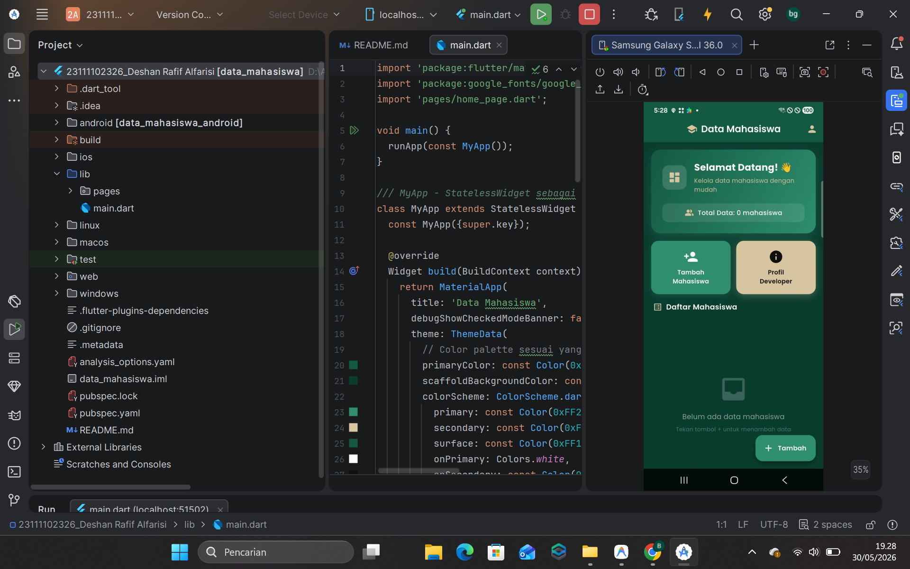
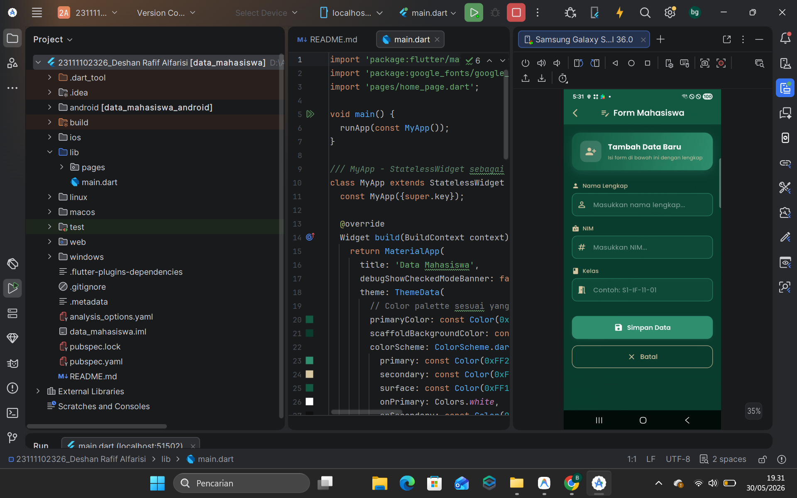
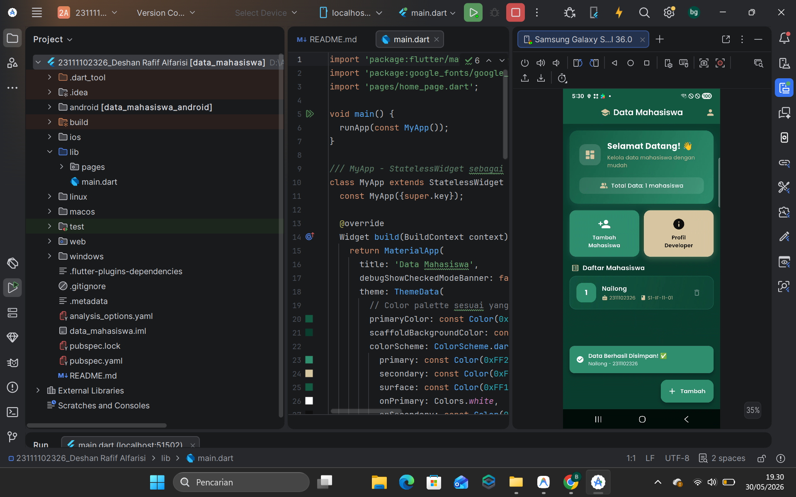
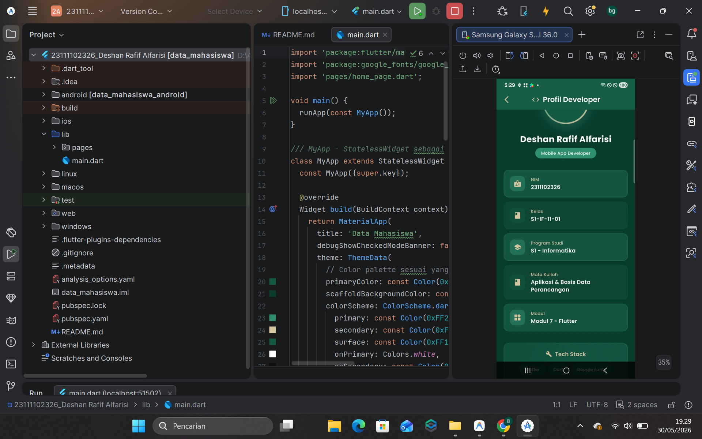

<div align="center">
  <br />
  <h1>LAPORAN PRAKTIKUM <br>APLIKASI BERBASIS PLATFORM</h1>
  <br />
  <h2>MODUL 7 FLUTTER <br>DATA MAHASISWA</h2>
  <br /><br />

  

  <br /><br /><br />

  <h3>Disusun Oleh :</h3>

  <p>
    <strong>Deshan Rafif Alfarisi</strong><br>
    <strong>2311102326</strong><br>
    <strong>S1 IF-11-01</strong>
  </p>

  <br />

  <h3>Dosen Pengampu :</h3>

  <p>
    <strong>Dimas Fanny Hebrasianto Permadi, S.ST., M.Kom</strong>
  </p>

  <br /><br />

  <h4>Asisten Praktikum :</h4>

  <p>
    <strong>Apri Pandu Wicaksono</strong><br>
    <strong>Rangga Pradarrell Fathi</strong>
  </p>

  <br />

  <h2>
  LABORATORIUM HIGH PERFORMANCE <br>
  FAKULTAS INFORMATIKA <br>
  UNIVERSITAS TELKOM PURWOKERTO <br>
  2026
  </h2>
</div>

---
## 1. Pendahuluan

Dalam pengembangan aplikasi mobile multiplatform menggunakan Flutter, kemampuan untuk mengelola data dinamis dan merespons interaksi pengguna secara real-time merupakan aspek yang sangat krusial. Pada praktikum Modul 7 ini, fokus utama pembelajaran adalah membangun aplikasi interaktif bertema **Data Mahasiswa** yang dirancang untuk mengilustrasikan berbagai konsep lanjutan dalam Flutter. 

Aplikasi ini mengintegrasikan interaksi form dinamis dengan validasi input, manajemen state lokal menggunakan widget Stateful, dan sistem navigasi antarhalaman yang responsif. Melalui pengembangan aplikasi Data Mahasiswa ini, mahasiswa diajarkan untuk merancang antarmuka kustom (Custom UI) yang modern menggunakan sistem desain Material 3 bertema gelap (Dark Theme) dengan kombinasi warna hijau hutan (*forest green*) dan aksen emas (*gold*).

Selain estetika visual yang premium dengan memanfaatkan font kustom dari Google Fonts, praktikum ini juga menekankan pada implementasi UX yang halus melalui transisi animasi kustom (*custom routing transition*) seperti gesekan (*slide*) dan pemudaran (*fade*) saat berpindah halaman. Laporan ini menjabarkan seluruh dasar teori, langkah-langkah implementasi kode program, analisis fungsi, pembahasan, serta kesimpulan dari hasil praktikum yang telah dilaksanakan.

---

## 2. Tujuan Praktikum

Tujuan dari praktikum Modul 7 ini adalah sebagai berikut:

1. Memahami konsep dasar pembuatan aplikasi Flutter yang interaktif dan dinamis menggunakan `StatefulWidget`.
2. Mampu mengelola data dinamis dalam bentuk daftar list (`List<Map<String, String>>`) serta melakukan manipulasi data berupa penambahan (*insert*) dan penghapusan (*delete*).
3. Mampu membangun formulir input data menggunakan widget `Form` dan `TextFormField` lengkap dengan fungsi validasi input (*validation*).
4. Memahami mekanisme navigasi dan pengiriman data antarhalaman menggunakan class `Navigator` dengan metode `push` dan `pop`.
5. Mampu menerapkan animasi transisi kustom antarhalaman menggunakan `PageRouteBuilder`, `SlideTransition`, dan `FadeTransition`.
6. Mampu merancang sistem penataan visual bertema gelap (Dark Theme) yang konsisten menggunakan Material 3, skema warna kustom, dan pustaka tipografi Google Fonts.

---

## 3. Dasar Teori

### 3.1 Flutter & Dart

Flutter adalah framework UI *open-source* yang dikembangkan oleh Google untuk membangun aplikasi multiplatform dengan satu basis kode (single codebase) untuk platform Android, iOS, Web, dan Desktop. Flutter menggunakan bahasa pemrograman Dart, yang memiliki karakteristik pemrograman berorientasi objek yang kuat, bertipe data ketat (*strongly typed*), dan mendukung kompilasi *Ahead-of-Time* (AOT) untuk performa native yang mulus, serta *Just-in-Time* (JIT) untuk fitur *Hot Reload* yang mempercepat proses pengembangan.

### 3.2 State Management (Stateless vs Stateful)

Dalam arsitektur Flutter, setiap komponen UI direpresentasikan sebagai sebuah widget. Berdasarkan sifat pembaruan datanya, widget dibagi menjadi dua jenis utama:
- **StatelessWidget**: Merupakan widget statis yang tampilannya tidak dapat berubah setelah dirender pertama kali. Widget ini tidak memiliki keadaan internal (*state*) yang dinamis. Pada praktikum ini, class `MyApp` dan `ProfilDeveloperPage` menggunakan `StatelessWidget` karena konten di dalamnya cenderung tetap.
- **StatefulWidget**: Merupakan widget dinamis yang tampilannya dapat diperbarui secara real-time ketika terjadi interaksi pengguna atau perubahan data. Perubahan tersebut diatur oleh objek `State` pendamping melalui pemanggilan fungsi `setState()`. Fungsi `setState()` memberi tahu framework Flutter bahwa ada bagian dari state widget yang berubah, sehingga framework akan menjadwalkan pembangunan ulang (*rebuild*) pada *widget tree* yang terpengaruh. Class `HomePage` dan `FormMahasiswaPage` menggunakan `StatefulWidget` agar list data mahasiswa dan nilai form dapat diperbarui secara dinamis.

### 3.3 Form & Form Validation

Untuk mengumpulkan informasi dari pengguna, Flutter menyediakan widget `Form` yang berfungsi sebagai kontainer untuk mengelompokkan dan mengelola sekumpulan widget input. Di dalam widget `Form`, digunakan widget `TextFormField` yang menyediakan fitur integrasi langsung dengan mekanisme validasi form.
Proses validasi dilakukan dengan memanfaatkan properti `validator` pada `TextFormField`. Properti ini menerima sebuah fungsi penilai yang akan memeriksa data masukan pengguna; jika masukan tidak valid, fungsi akan mengembalikan string berisi pesan kesalahan, dan jika masukan sudah sesuai, fungsi akan mengembalikan nilai `null`. Untuk memicu fungsi validasi secara menyeluruh, digunakan `GlobalKey<FormState>` yang melacak status form saat ini (`_formKey.currentState!.validate()`).

### 3.4 Navigasi & Routing (Navigator)

Navigasi antarhalaman dalam Flutter dikelola oleh class `Navigator` menggunakan struktur tumpukan (Stack - LIFO). Perpindahan halaman dilakukan dengan dua fungsi utama:
- `Navigator.push()`: Menambahkan (menumpuk) halaman baru di atas halaman saat ini.
- `Navigator.pop()`: Menghapus halaman teratas dan mengembalikan kendali ke halaman sebelumnya. Pada Modul 7, `Navigator.pop` juga dimanfaatkan untuk mengirimkan kembali data bertipe `Map<String, String>` dari halaman form ke halaman utama sebagai hasil dari aksi penyimpanan data.

### 3.5 Animasi Transisi Halaman (PageRouteBuilder)

Secara default, Flutter menyediakan transisi halaman bawaan platform (misalnya geser vertikal pada iOS dan memudar/membesar pada Android). Namun, transisi kustom dapat diimplementasikan menggunakan `PageRouteBuilder`. Dengan class ini, pengembang dapat menyusun transisi kustom melalui parameter `transitionsBuilder`, seperti:
- `SlideTransition`: Menerapkan animasi pergeseran posisi menggunakan koordinat `Offset` berbasis koordinat X dan Y.
- `FadeTransition`: Menerapkan animasi pemudaran transparan dengan mengubah properti `opacity` dari nilai 0.0 (sepenuhnya transparan) hingga 1.0 (sepenuhnya terlihat).

### 3.6 Google Fonts

Package `google_fonts` adalah pustaka eksternal resmi yang memungkinkan pengembang Flutter untuk menggunakan lebih dari 1.000 jenis font yang tersedia di layanan Google Fonts secara dinamis tanpa perlu mengunduh berkas font (.ttf atau .otf) dan mendeklarasikannya di dalam file `pubspec.yaml`. Pada praktikum ini, pustaka Google Fonts digunakan untuk memuat jenis huruf kustom **Poppins** guna meningkatkan estetika teks visual aplikasi agar terlihat modern dan premium.

### 3.7 Material 3 Dark Theming

Material 3 adalah iterasi terbaru dari sistem desain Material Google yang menawarkan peningkatan besar pada tata letak, komponen UI, sistem tipografi, dan skema pewarnaan yang harmonis. Pengaturan tema kustom (Theming) di Flutter dilakukan melalui properti `theme` dalam widget `MaterialApp` dengan menyediakan objek `ThemeData`. Pada praktikum ini, diimplementasikan skema `ColorScheme.dark` dengan memodifikasi parameter warna utama (Primary) menggunakan warna hijau gelap (`Color(0xFF145A43)`), warna latar belakang gelap (`Color(0xFF0B3D2E)`), warna aksen sekunder emas/krem (`Color(0xFFD7C7A1)`), dan warna kartu (`Color(0xFF2F8F6F)`).

---

### 4.1 Menulis Struktur Dasar Aplikasi

Langkah awal praktikum dimulai dengan mengonfigurasi file `lib/main.dart`. File ini berfungsi sebagai titik awal (*entry point*) aplikasi dan mendefinisikan konfigurasi global `MaterialApp` serta skema `ThemeData` bertema gelap kustom menggunakan font Google Fonts Poppins.

```dart
import 'package:flutter/material.dart';
import 'package:google_fonts/google_fonts.dart';
import 'pages/home_page.dart';

void main() {
  runApp(const MyApp());
}

class MyApp extends StatelessWidget {
  const MyApp({super.key});

  @override
  Widget build(BuildContext context) {
    return MaterialApp(
      title: 'Data Mahasiswa',
      debugShowCheckedModeBanner: false,
      theme: ThemeData(
        primaryColor: const Color(0xFF145A43),
        scaffoldBackgroundColor: const Color(0xFF0B3D2E),
        colorScheme: ColorScheme.dark(
          primary: const Color(0xFF2F8F6F),
          secondary: const Color(0xFFD7C7A1),
          surface: const Color(0xFF145A43),
          onPrimary: Colors.white,
          onSecondary: const Color(0xFF0F0F0F),
          onSurface: Colors.white,
        ),
        textTheme: GoogleFonts.poppinsTextTheme(
          ThemeData.dark().textTheme,
        ),
        appBarTheme: AppBarTheme(
          backgroundColor: const Color(0xFF145A43),
          elevation: 0,
          centerTitle: true,
          titleTextStyle: GoogleFonts.poppins(
            fontSize: 20,
            fontWeight: FontWeight.w600,
            color: Colors.white,
          ),
          iconTheme: const IconThemeData(color: Color(0xFFD7C7A1)),
        ),
        // ... (kode theming lainnya)
      ),
      home: const HomePage(),
    );
  }
}
```

Pada kode tersebut, `ThemeData` disetel dengan warna dasar gelap yang elegan. `MaterialApp` mengarahkan halaman utamanya ke widget `HomePage()`.

### 4.2 Membuat Halaman Utama (HomePage)

Halaman utama (`lib/pages/home_page.dart`) dibuat menggunakan `StatefulWidget` untuk menampung daftar data mahasiswa dinamis dalam list objek Map `final List<Map<String, String>> _dataMahasiswa = [];`. Halaman ini menampilkan header statistik, menu navigasi cepat, ilustrasi jika data kosong (*empty state*), serta daftar mahasiswa dalam `ListView.builder`.

```dart
class _HomePageState extends State<HomePage> with TickerProviderStateMixin {
  final List<Map<String, String>> _dataMahasiswa = [];
  late AnimationController _fadeController;
  late Animation<double> _fadeAnimation;

  @override
  void initState() {
    super.initState();
    _fadeController = AnimationController(
      duration: const Duration(milliseconds: 800),
      vsync: this,
    );
    _fadeAnimation = CurvedAnimation(
      parent: _fadeController,
      curve: Curves.easeInOut,
    );
    _fadeController.forward();
  }

  void _navigateToForm() async {
    final result = await Navigator.push<Map<String, String>>(
      context,
      PageRouteBuilder(
        pageBuilder: (context, animation, secondaryAnimation) =>
            const FormMahasiswaPage(),
        transitionsBuilder: (context, animation, secondaryAnimation, child) {
          const begin = Offset(1.0, 0.0);
          const end = Offset.zero;
          const curve = Curves.easeInOutCubic;
          var tween = Tween(begin: begin, end: end).chain(CurveTween(curve: curve));
          return SlideTransition(
            position: animation.drive(tween),
            child: child,
          );
        },
        transitionDuration: const Duration(milliseconds: 400),
      ),
    );

    if (result != null) {
      setState(() {
        _dataMahasiswa.add(result);
      });
    }
  }
  // ...
}
```

Mekanisme routing kustom dengan pergeseran horizontal didefinisikan menggunakan `PageRouteBuilder` dan `SlideTransition` di fungsi `_navigateToForm()`. Data dari form ditangkap menggunakan konsep *asynchronous programming* (`async-await`) dan ditambahkan ke list `_dataMahasiswa` di dalam fungsi `setState()`.

### 4.3 Membuat Form Input Data Mahasiswa (FormMahasiswaPage)

Halaman form (`lib/pages/form_mahasiswa_page.dart`) dibuat menggunakan `StatefulWidget`. Halaman ini berisi form input dengan field Nama, NIM, dan Kelas. Prosedur validasi input diterapkan agar pengguna tidak dapat menyimpan data yang kosong.

```dart
class _FormMahasiswaPageState extends State<FormMahasiswaPage>
    with SingleTickerProviderStateMixin {
  final _formKey = GlobalKey<FormState>();
  final _namaController = TextEditingController();
  final _nimController = TextEditingController();
  final _kelasController = TextEditingController();

  void _simpanData() {
    if (_formKey.currentState!.validate()) {
      final data = {
        'nama': _namaController.text.trim(),
        'nim': _nimController.text.trim(),
        'kelas': _kelasController.text.trim(),
      };

      ScaffoldMessenger.of(context).showSnackBar(
        SnackBar(
          content: Text('Data Berhasil Disimpan! ✅'),
          backgroundColor: const Color(0xFF2F8F6F),
        ),
      );

      Navigator.pop(context, data); // Mengirim data kembali ke HomePage
    }
  }
  // ...
}
```

Ketika tombol Simpan ditekan, status form diperiksa melalui `_formKey.currentState!.validate()`. Jika data valid, sebuah pesan konfirmasi `SnackBar` diluncurkan ke layar dan `Navigator.pop(context, data)` dipanggil untuk menutup halaman sembari membawa data mahasiswa tersebut kembali ke `HomePage`.

### 4.4 Membuat Halaman Profil Developer (ProfilDeveloperPage)

Halaman profil developer (`lib/pages/profil_developer_page.dart`) dibuat sebagai `StatelessWidget`. Halaman ini menampilkan detail informasi akademik pembuat aplikasi (Nama, NIM, Kelas, Program Studi, Mata Kuliah, dan Modul) dalam komponen visual kustom berbentuk deretan kartu informasi serta chip keahlian (*technology chips*).

```dart
class ProfilDeveloperPage extends StatelessWidget {
  const ProfilDeveloperPage({super.key});

  @override
  Widget build(BuildContext context) {
    return Scaffold(
      appBar: AppBar(
        leading: IconButton(
          icon: const Icon(Icons.arrow_back_ios_rounded),
          onPressed: () => Navigator.pop(context),
        ),
        title: const Text('Profil Developer'),
      ),
      body: SingleChildScrollView(
        child: Column(
          children: [
            CircleAvatar(
              radius: 60,
              backgroundColor: const Color(0xFF145A43),
              child: Text(
                'DR',
                style: GoogleFonts.poppins(fontSize: 36, fontWeight: FontWeight.bold),
              ),
            ),
            // ... (Info Cards dan Tech Chips)
          ],
        ),
      ),
    );
  }
}
```

Halaman profil ini didesain menggunakan tata letak `SingleChildScrollView` untuk mengantisipasi keterbatasan ruang vertikal layar, serta menampilkan avatar dengan inisial inisial kustom pengembang ("DR").

---

## 5. Source Code Lengkap

### 5.1 File `lib/main.dart`

Berikut adalah kode lengkap program pada file utama aplikasi `lib/main.dart`:

```dart
import 'package:flutter/material.dart';
import 'package:google_fonts/google_fonts.dart';
import 'pages/home_page.dart';

void main() {
  runApp(const MyApp());
}

/// MyApp - StatelessWidget sebagai root aplikasi
class MyApp extends StatelessWidget {
  const MyApp({super.key});

  @override
  Widget build(BuildContext context) {
    return MaterialApp(
      title: 'Data Mahasiswa',
      debugShowCheckedModeBanner: false,
      theme: ThemeData(
        // Color palette sesuai yang diberikan
        primaryColor: const Color(0xFF145A43),
        scaffoldBackgroundColor: const Color(0xFF0B3D2E),
        colorScheme: ColorScheme.dark(
          primary: const Color(0xFF2F8F6F),
          secondary: const Color(0xFFD7C7A1),
          surface: const Color(0xFF145A43),
          onPrimary: Colors.white,
          onSecondary: const Color(0xFF0F0F0F),
          onSurface: Colors.white,
        ),
        // Google Fonts Poppins sebagai default
        textTheme: GoogleFonts.poppinsTextTheme(
          ThemeData.dark().textTheme,
        ),
        appBarTheme: AppBarTheme(
          backgroundColor: const Color(0xFF145A43),
          elevation: 0,
          centerTitle: true,
          titleTextStyle: GoogleFonts.poppins(
            fontSize: 20,
            fontWeight: FontWeight.w600,
            color: Colors.white,
          ),
          iconTheme: const IconThemeData(color: Color(0xFFD7C7A1)),
        ),
        elevatedButtonTheme: ElevatedButtonThemeData(
          style: ElevatedButton.styleFrom(
            backgroundColor: const Color(0xFF2F8F6F),
            foregroundColor: Colors.white,
            padding: const EdgeInsets.symmetric(horizontal: 32, vertical: 14),
            shape: RoundedRectangleBorder(
              borderRadius: BorderRadius.circular(12),
            ),
            textStyle: GoogleFonts.poppins(
              fontSize: 16,
              fontWeight: FontWeight.w600,
            ),
          ),
        ),
        inputDecorationTheme: InputDecorationTheme(
          filled: true,
          fillColor: const Color(0xFF145A43).withValues(alpha: 0.5),
          border: OutlineInputBorder(
            borderRadius: BorderRadius.circular(12),
            borderSide: const BorderSide(color: Color(0xFF2F8F6F)),
          ),
          enabledBorder: OutlineInputBorder(
            borderRadius: BorderRadius.circular(12),
            borderSide: const BorderSide(color: Color(0xFF2F8F6F), width: 1),
          ),
          focusedBorder: OutlineInputBorder(
            borderRadius: BorderRadius.circular(12),
            borderSide: const BorderSide(color: Color(0xFFD7C7A1), width: 2),
          ),
          labelStyle: GoogleFonts.poppins(color: const Color(0xFFD7C7A1)),
          hintStyle: GoogleFonts.poppins(color: Colors.white54),
          prefixIconColor: const Color(0xFFD7C7A1),
        ),
        snackBarTheme: SnackBarThemeData(
          backgroundColor: const Color(0xFF2F8F6F),
          contentTextStyle: GoogleFonts.poppins(
            color: Colors.white,
            fontSize: 14,
          ),
          shape: RoundedRectangleBorder(
            borderRadius: BorderRadius.circular(12),
          ),
          behavior: SnackBarBehavior.floating,
        ),
      ),
      home: const HomePage(),
    );
  }
}
```

---

### 5.2 File `lib/pages/home_page.dart`

Berikut adalah kode lengkap program pada file `lib/pages/home_page.dart`:

```dart
import 'package:flutter/material.dart';
import 'package:google_fonts/google_fonts.dart';
import 'form_mahasiswa_page.dart';
import 'profil_developer_page.dart';

/// HomePage - StatefulWidget sebagai halaman utama
class HomePage extends StatefulWidget {
  const HomePage({super.key});

  @override
  State<HomePage> createState() => _HomePageState();
}

class _HomePageState extends State<HomePage> with TickerProviderStateMixin {
  // List untuk menyimpan data mahasiswa yang sudah diinput
  final List<Map<String, String>> _dataMahasiswa = [];
  late AnimationController _fadeController;
  late Animation<double> _fadeAnimation;

  @override
  void initState() {
    super.initState();
    _fadeController = AnimationController(
      duration: const Duration(milliseconds: 800),
      vsync: this,
    );
    _fadeAnimation = CurvedAnimation(
      parent: _fadeController,
      curve: Curves.easeInOut,
    );
    _fadeController.forward();
  }

  @override
  void dispose() {
    _fadeController.dispose();
    super.dispose();
  }

  void _navigateToForm() async {
    final result = await Navigator.push<Map<String, String>>(
      context,
      PageRouteBuilder(
        pageBuilder: (context, animation, secondaryAnimation) =>
            const FormMahasiswaPage(),
        transitionsBuilder: (context, animation, secondaryAnimation, child) {
          const begin = Offset(1.0, 0.0);
          const end = Offset.zero;
          const curve = Curves.easeInOutCubic;
          var tween =
              Tween(begin: begin, end: end).chain(CurveTween(curve: curve));
          return SlideTransition(
            position: animation.drive(tween),
            child: child,
          );
        },
        transitionDuration: const Duration(milliseconds: 400),
      ),
    );

    if (result != null) {
      setState(() {
        _dataMahasiswa.add(result);
      });
    }
  }

  void _navigateToProfil() {
    Navigator.push(
      context,
      PageRouteBuilder(
        pageBuilder: (context, animation, secondaryAnimation) =>
            const ProfilDeveloperPage(),
        transitionsBuilder: (context, animation, secondaryAnimation, child) {
          return FadeTransition(
            opacity: animation,
            child: child,
          );
        },
        transitionDuration: const Duration(milliseconds: 400),
      ),
    );
  }

  @override
  Widget build(BuildContext context) {
    return Scaffold(
      appBar: AppBar(
        title: Row(
          mainAxisSize: MainAxisSize.min,
          children: [
            const Icon(Icons.school_rounded, color: Color(0xFFD7C7A1)),
            const SizedBox(width: 8),
            Text('Data Mahasiswa',
                style: GoogleFonts.poppins(
                  fontWeight: FontWeight.w600,
                )),
          ],
        ),
        actions: [
          IconButton(
            icon: const Icon(Icons.person_rounded),
            tooltip: 'Profil Developer',
            onPressed: _navigateToProfil,
          ),
        ],
      ),
      body: FadeTransition(
        opacity: _fadeAnimation,
        child: Column(
          children: [
            // Header Banner
            Container(
              width: double.infinity,
              margin: const EdgeInsets.all(16),
              padding: const EdgeInsets.all(24),
              decoration: BoxDecoration(
                gradient: const LinearGradient(
                  colors: [Color(0xFF145A43), Color(0xFF2F8F6F)],
                  begin: Alignment.topLeft,
                  end: Alignment.bottomRight,
                ),
                borderRadius: BorderRadius.circular(20),
                boxShadow: [
                  BoxShadow(
                    color: const Color(0xFF2F8F6F).withValues(alpha: 0.3),
                    blurRadius: 20,
                    offset: const Offset(0, 8),
                  ),
                ],
              ),
              child: Column(
                crossAxisAlignment: CrossAxisAlignment.start,
                children: [
                  Row(
                    children: [
                      Container(
                        padding: const EdgeInsets.all(12),
                        decoration: BoxDecoration(
                          color: Colors.white.withValues(alpha: 0.15),
                          borderRadius: BorderRadius.circular(14),
                        ),
                        child: const Icon(
                          Icons.dashboard_rounded,
                          color: Color(0xFFD7C7A1),
                          size: 28,
                        ),
                      ),
                      const SizedBox(width: 16),
                      Expanded(
                        child: Column(
                          crossAxisAlignment: CrossAxisAlignment.start,
                          children: [
                            Text(
                              'Selamat Datang! 👋',
                              style: GoogleFonts.poppins(
                                fontSize: 20,
                                fontWeight: FontWeight.bold,
                                color: Colors.white,
                              ),
                            ),
                            const SizedBox(height: 4),
                            Text(
                              'Kelola data mahasiswa dengan mudah',
                              style: GoogleFonts.poppins(
                                fontSize: 13,
                                color: const Color(0xFFD7C7A1),
                              ),
                            ),
                          ],
                        ),
                      ),
                    ],
                  ),
                  const SizedBox(height: 20),
                  // Statistik
                  Container(
                    padding: const EdgeInsets.symmetric(
                        horizontal: 16, vertical: 10),
                    decoration: BoxDecoration(
                      color: Colors.white.withValues(alpha: 0.1),
                      borderRadius: BorderRadius.circular(12),
                    ),
                    child: Row(
                      mainAxisAlignment: MainAxisAlignment.center,
                      children: [
                        const Icon(Icons.people_alt_rounded,
                            color: Color(0xFFD7C7A1), size: 20),
                        const SizedBox(width: 8),
                        Text(
                          'Total Data: ${_dataMahasiswa.length} mahasiswa',
                          style: GoogleFonts.poppins(
                            fontSize: 14,
                            fontWeight: FontWeight.w500,
                            color: Colors.white,
                          ),
                        ),
                      ],
                    ),
                  ),
                ],
              ),
            ),

            // Menu Buttons
            Padding(
              padding: const EdgeInsets.symmetric(horizontal: 16),
              child: Row(
                children: [
                  Expanded(
                    child: _buildMenuCard(
                      icon: Icons.person_add_rounded,
                      label: 'Tambah\nMahasiswa',
                      onTap: _navigateToForm,
                      color: const Color(0xFF2F8F6F),
                    ),
                  ),
                  const SizedBox(width: 12),
                  Expanded(
                    child: _buildMenuCard(
                      icon: Icons.info_rounded,
                      label: 'Profil\nDeveloper',
                      onTap: _navigateToProfil,
                      color: const Color(0xFFD7C7A1),
                      textColor: const Color(0xFF0F0F0F),
                    ),
                  ),
                ],
              ),
            ),

            const SizedBox(height: 16),

            // Section Title
            Padding(
              padding: const EdgeInsets.symmetric(horizontal: 20),
              child: Row(
                children: [
                  const Icon(Icons.list_alt_rounded,
                      color: Color(0xFFD7C7A1), size: 20),
                  const SizedBox(width: 8),
                  Text(
                    'Daftar Mahasiswa',
                    style: GoogleFonts.poppins(
                      fontSize: 16,
                      fontWeight: FontWeight.w600,
                      color: Colors.white,
                    ),
                  ),
                ],
              ),
            ),
            const SizedBox(height: 8),

            // List Mahasiswa
            Expanded(
              child: _dataMahasiswa.isEmpty
                  ? Center(
                      child: Column(
                        mainAxisAlignment: MainAxisAlignment.center,
                        children: [
                          Icon(
                            Icons.inbox_rounded,
                            size: 64,
                            color: Colors.white.withValues(alpha: 0.2),
                          ),
                          const SizedBox(height: 16),
                          Text(
                            'Belum ada data mahasiswa',
                            style: GoogleFonts.poppins(
                              fontSize: 15,
                              color: Colors.white54,
                            ),
                          ),
                          const SizedBox(height: 8),
                          Text(
                            'Tekan tombol + untuk menambah data',
                            style: GoogleFonts.poppins(
                              fontSize: 12,
                              color: Colors.white30,
                            ),
                          ),
                        ],
                      ),
                    )
                  : ListView.builder(
                      padding: const EdgeInsets.symmetric(horizontal: 16),
                      itemCount: _dataMahasiswa.length,
                      itemBuilder: (context, index) {
                        final data = _dataMahasiswa[index];
                        return _buildMahasiswaCard(data, index);
                      },
                    ),
            ),
          ],
        ),
      ),
      // FAB untuk menambah mahasiswa
      floatingActionButton: FloatingActionButton.extended(
        onPressed: _navigateToForm,
        backgroundColor: const Color(0xFF2F8F6F),
        icon: const Icon(Icons.add_rounded, color: Colors.white),
        label: Text(
          'Tambah',
          style: GoogleFonts.poppins(
            fontWeight: FontWeight.w600,
            color: Colors.white,
          ),
        ),
      ),
    );
  }

  /// Widget untuk menu card
  Widget _buildMenuCard({
    required IconData icon,
    required String label,
    required VoidCallback onTap,
    required Color color,
    Color textColor = Colors.white,
  }) {
    return GestureDetector(
      onTap: onTap,
      child: Container(
        padding: const EdgeInsets.all(18),
        decoration: BoxDecoration(
          color: color,
          borderRadius: BorderRadius.circular(16),
          boxShadow: [
            BoxShadow(
              color: color.withValues(alpha: 0.3),
              blurRadius: 12,
              offset: const Offset(0, 4),
            ),
          ],
        ),
        child: Column(
          children: [
            Icon(icon, size: 32, color: textColor),
            const SizedBox(height: 8),
            Text(
              label,
              textAlign: TextAlign.center,
              style: GoogleFonts.poppins(
                fontSize: 13,
                fontWeight: FontWeight.w600,
                color: textColor,
              ),
            ),
          ],
        ),
      ),
    );
  }

  /// Widget untuk card data mahasiswa
  Widget _buildMahasiswaCard(Map<String, String> data, int index) {
    return Container(
      margin: const EdgeInsets.only(bottom: 12),
      padding: const EdgeInsets.all(16),
      decoration: BoxDecoration(
        gradient: LinearGradient(
          colors: [
            const Color(0xFF145A43).withValues(alpha: 0.8),
            const Color(0xFF145A43).withValues(alpha: 0.4),
          ],
          begin: Alignment.topLeft,
          end: Alignment.bottomRight,
        ),
        borderRadius: BorderRadius.circular(16),
        border: Border.all(
          color: const Color(0xFF2F8F6F).withValues(alpha: 0.4),
          width: 1,
        ),
      ),
      child: Row(
        children: [
          // Avatar dengan nomor urut
          Container(
            width: 48,
            height: 48,
            decoration: BoxDecoration(
              color: const Color(0xFF2F8F6F),
              borderRadius: BorderRadius.circular(14),
            ),
            child: Center(
              child: Text(
                '${index + 1}',
                style: GoogleFonts.poppins(
                  fontSize: 18,
                  fontWeight: FontWeight.bold,
                  color: Colors.white,
                ),
              ),
            ),
          ),
          const SizedBox(width: 14),
          // Info mahasiswa
          Expanded(
            child: Column(
              crossAxisAlignment: CrossAxisAlignment.start,
              children: [
                Text(
                  data['nama'] ?? '',
                  style: GoogleFonts.poppins(
                    fontSize: 15,
                    fontWeight: FontWeight.w600,
                    color: Colors.white,
                  ),
                ),
                const SizedBox(height: 4),
                Row(
                  children: [
                    const Icon(Icons.badge_rounded,
                        size: 14, color: Color(0xFFD7C7A1)),
                    const SizedBox(width: 4),
                    Text(
                      data['nim'] ?? '',
                      style: GoogleFonts.poppins(
                        fontSize: 12,
                        color: const Color(0xFFD7C7A1),
                      ),
                    ),
                    const SizedBox(width: 12),
                    const Icon(Icons.class_rounded,
                        size: 14, color: Color(0xFFD7C7A1)),
                    const SizedBox(width: 4),
                    Text(
                      data['kelas'] ?? '',
                      style: GoogleFonts.poppins(
                        fontSize: 12,
                        color: const Color(0xFFD7C7A1),
                      ),
                    ),
                  ],
                ),
              ],
            ),
          ),
          // Delete button
          IconButton(
            icon: const Icon(Icons.delete_outline_rounded,
                color: Colors.white38, size: 20),
            onPressed: () {
              setState(() {
                _dataMahasiswa.removeAt(index);
              });
              ScaffoldMessenger.of(context).showSnackBar(
                SnackBar(
                  content: Row(
                    children: [
                      const Icon(Icons.delete_rounded,
                          color: Colors.white, size: 18),
                      const SizedBox(width: 8),
                      Text('Data berhasil dihapus!',
                          style: GoogleFonts.poppins()),
                    ],
                  ),
                  backgroundColor: Colors.red.shade700,
                  duration: const Duration(seconds: 2),
                ),
              );
            },
          ),
        ],
      ),
    );
  }
}
```

---

### 5.3 File `lib/pages/form_mahasiswa_page.dart`

Berikut adalah kode lengkap program pada file `lib/pages/form_mahasiswa_page.dart`:

```dart
import 'package:flutter/material.dart';
import 'package:google_fonts/google_fonts.dart';

/// FormMahasiswaPage - StatefulWidget untuk input data mahasiswa
class FormMahasiswaPage extends StatefulWidget {
  const FormMahasiswaPage({super.key});

  @override
  State<FormMahasiswaPage> createState() => _FormMahasiswaPageState();
}

class _FormMahasiswaPageState extends State<FormMahasiswaPage>
    with SingleTickerProviderStateMixin {
  final _formKey = GlobalKey<FormState>();
  final _namaController = TextEditingController();
  final _nimController = TextEditingController();
  final _kelasController = TextEditingController();

  late AnimationController _animController;
  late Animation<double> _slideAnimation;

  @override
  void initState() {
    super.initState();
    _animController = AnimationController(
      duration: const Duration(milliseconds: 600),
      vsync: this,
    );
    _slideAnimation = CurvedAnimation(
      parent: _animController,
      curve: Curves.easeOutCubic,
    );
    _animController.forward();
  }

  @override
  void dispose() {
    _namaController.dispose();
    _nimController.dispose();
    _kelasController.dispose();
    _animController.dispose();
    super.dispose();
  }

  void _simpanData() {
    if (_formKey.currentState!.validate()) {
      final data = {
        'nama': _namaController.text.trim(),
        'nim': _nimController.text.trim(),
        'kelas': _kelasController.text.trim(),
      };

      // Tampilkan SnackBar sebagai notifikasi berhasil
      ScaffoldMessenger.of(context).showSnackBar(
        SnackBar(
          content: Row(
            children: [
              const Icon(Icons.check_circle_rounded,
                  color: Colors.white, size: 20),
              const SizedBox(width: 10),
              Expanded(
                child: Column(
                  mainAxisSize: MainAxisSize.min,
                  crossAxisAlignment: CrossAxisAlignment.start,
                  children: [
                    Text(
                      'Data Berhasil Disimpan! ✅',
                      style: GoogleFonts.poppins(
                        fontWeight: FontWeight.w600,
                        fontSize: 14,
                      ),
                    ),
                    Text(
                      '${data['nama']} - ${data['nim']}',
                      style: GoogleFonts.poppins(fontSize: 12),
                    ),
                  ],
                ),
              ),
            ],
          ),
          duration: const Duration(seconds: 3),
          backgroundColor: const Color(0xFF2F8F6F),
          behavior: SnackBarBehavior.floating,
          shape:
              RoundedRectangleBorder(borderRadius: BorderRadius.circular(12)),
          margin: const EdgeInsets.all(16),
        ),
      );

      // Kembali ke halaman sebelumnya dengan data (Navigator.pop)
      Navigator.pop(context, data);
    }
  }

  @override
  Widget build(BuildContext context) {
    return Scaffold(
      appBar: AppBar(
        leading: IconButton(
          icon: const Icon(Icons.arrow_back_ios_rounded),
          onPressed: () => Navigator.pop(context),
        ),
        title: Row(
          mainAxisSize: MainAxisSize.min,
          children: [
            const Icon(Icons.edit_note_rounded, color: Color(0xFFD7C7A1)),
            const SizedBox(width: 8),
            Text('Form Mahasiswa',
                style: GoogleFonts.poppins(fontWeight: FontWeight.w600)),
          ],
        ),
      ),
      body: FadeTransition(
        opacity: _slideAnimation,
        child: SingleChildScrollView(
          padding: const EdgeInsets.all(20),
          child: Form(
            key: _formKey,
            child: Column(
              crossAxisAlignment: CrossAxisAlignment.stretch,
              children: [
                // Header Card
                Container(
                  padding: const EdgeInsets.all(20),
                  decoration: BoxDecoration(
                    gradient: const LinearGradient(
                      colors: [Color(0xFF145A43), Color(0xFF2F8F6F)],
                      begin: Alignment.topLeft,
                      end: Alignment.bottomRight,
                    ),
                    borderRadius: BorderRadius.circular(20),
                    boxShadow: [
                      BoxShadow(
                        color:
                            const Color(0xFF2F8F6F).withValues(alpha: 0.3),
                        blurRadius: 16,
                        offset: const Offset(0, 6),
                      ),
                    ],
                  ),
                  child: Row(
                    children: [
                      Container(
                        padding: const EdgeInsets.all(12),
                        decoration: BoxDecoration(
                          color: Colors.white.withValues(alpha: 0.15),
                          borderRadius: BorderRadius.circular(14),
                        ),
                        child: const Icon(Icons.person_add_alt_1_rounded,
                            color: Color(0xFFD7C7A1), size: 28),
                      ),
                      const SizedBox(width: 16),
                      Expanded(
                        child: Column(
                          crossAxisAlignment: CrossAxisAlignment.start,
                          children: [
                            Text(
                              'Tambah Data Baru',
                              style: GoogleFonts.poppins(
                                fontSize: 18,
                                fontWeight: FontWeight.bold,
                                color: Colors.white,
                              ),
                            ),
                            const SizedBox(height: 4),
                            Text(
                              'Isi form di bawah ini dengan lengkap',
                              style: GoogleFonts.poppins(
                                fontSize: 12,
                                color: const Color(0xFFD7C7A1),
                              ),
                            ),
                          ],
                        ),
                      ),
                    ],
                  ),
                ),
                const SizedBox(height: 28),

                // Input Nama
                _buildFieldLabel('Nama Lengkap', Icons.person_rounded),
                const SizedBox(height: 8),
                TextFormField(
                  controller: _namaController,
                  style: GoogleFonts.poppins(color: Colors.white),
                  decoration: const InputDecoration(
                    hintText: 'Masukkan nama lengkap...',
                    prefixIcon: Icon(Icons.person_outline_rounded),
                  ),
                  validator: (value) {
                    if (value == null || value.trim().isEmpty) {
                      return 'Nama tidak boleh kosong';
                    }
                    return null;
                  },
                  textInputAction: TextInputAction.next,
                ),
                const SizedBox(height: 20),

                // Input NIM
                _buildFieldLabel('NIM', Icons.badge_rounded),
                const SizedBox(height: 8),
                TextFormField(
                  controller: _nimController,
                  style: GoogleFonts.poppins(color: Colors.white),
                  decoration: const InputDecoration(
                    hintText: 'Masukkan NIM...',
                    prefixIcon: Icon(Icons.numbers_rounded),
                  ),
                  keyboardType: TextInputType.number,
                  validator: (value) {
                    if (value == null || value.trim().isEmpty) {
                      return 'NIM tidak boleh kosong';
                    }
                    return null;
                  },
                  textInputAction: TextInputAction.next,
                ),
                const SizedBox(height: 20),

                // Input Kelas
                _buildFieldLabel('Kelas', Icons.class_rounded),
                const SizedBox(height: 8),
                TextFormField(
                  controller: _kelasController,
                  style: GoogleFonts.poppins(color: Colors.white),
                  decoration: const InputDecoration(
                    hintText: 'Contoh: S1-IF-11-01',
                    prefixIcon: Icon(Icons.meeting_room_rounded),
                  ),
                  validator: (value) {
                    if (value == null || value.trim().isEmpty) {
                      return 'Kelas tidak boleh kosong';
                    }
                    return null;
                  },
                  textInputAction: TextInputAction.done,
                  onFieldSubmitted: (_) => _simpanData(),
                ),
                const SizedBox(height: 36),

                // Tombol Simpan
                ElevatedButton(
                  onPressed: _simpanData,
                  style: ElevatedButton.styleFrom(
                    padding: const EdgeInsets.symmetric(vertical: 16),
                    backgroundColor: const Color(0xFF2F8F6F),
                    shape: RoundedRectangleBorder(
                      borderRadius: BorderRadius.circular(14),
                    ),
                    elevation: 4,
                    shadowColor:
                        const Color(0xFF2F8F6F).withValues(alpha: 0.5),
                  ),
                  child: Row(
                    mainAxisAlignment: MainAxisAlignment.center,
                    children: [
                      const Icon(Icons.save_rounded,
                          color: Colors.white, size: 22),
                      const SizedBox(width: 10),
                      Text(
                        'Simpan Data',
                        style: GoogleFonts.poppins(
                          fontSize: 16,
                          fontWeight: FontWeight.w600,
                          color: Colors.white,
                        ),
                      ),
                    ],
                  ),
                ),
                const SizedBox(height: 16),

                // Tombol Batal
                OutlinedButton(
                  onPressed: () => Navigator.pop(context),
                  style: OutlinedButton.styleFrom(
                    padding: const EdgeInsets.symmetric(vertical: 16),
                    side: const BorderSide(color: Color(0xFFD7C7A1)),
                    shape: RoundedRectangleBorder(
                      borderRadius: BorderRadius.circular(14),
                    ),
                  ),
                  child: Row(
                    mainAxisAlignment: MainAxisAlignment.center,
                    children: [
                      const Icon(Icons.close_rounded,
                          color: Color(0xFFD7C7A1), size: 22),
                      const SizedBox(width: 10),
                      Text(
                        'Batal',
                        style: GoogleFonts.poppins(
                          fontSize: 16,
                          fontWeight: FontWeight.w500,
                          color: const Color(0xFFD7C7A1),
                        ),
                      ),
                    ],
                  ),
                ),
              ],
            ),
          ),
        ),
      ),
    );
  }

  /// Widget helper untuk label field
  Widget _buildFieldLabel(String label, IconData icon) {
    return Row(
      children: [
        Icon(icon, size: 18, color: const Color(0xFFD7C7A1)),
        const SizedBox(width: 8),
        Text(
          label,
          style: GoogleFonts.poppins(
            fontSize: 14,
            fontWeight: FontWeight.w500,
            color: const Color(0xFFD7C7A1),
          ),
        ),
      ],
    );
  }
}
```

---

### 5.4 File `lib/pages/profil_developer_page.dart`

Berikut adalah kode lengkap program pada file `lib/pages/profil_developer_page.dart`:

```dart
import 'package:flutter/material.dart';
import 'package:google_fonts/google_fonts.dart';

/// ProfilDeveloperPage - StatelessWidget untuk menampilkan profil developer
class ProfilDeveloperPage extends StatelessWidget {
  const ProfilDeveloperPage({super.key});

  @override
  Widget build(BuildContext context) {
    return Scaffold(
      appBar: AppBar(
        leading: IconButton(
          icon: const Icon(Icons.arrow_back_ios_rounded),
          onPressed: () => Navigator.pop(context),
        ),
        title: Row(
          mainAxisSize: MainAxisSize.min,
          children: [
            const Icon(Icons.code_rounded, color: Color(0xFFD7C7A1)),
            const SizedBox(width: 8),
            Text('Profil Developer',
                style: GoogleFonts.poppins(fontWeight: FontWeight.w600)),
          ],
        ),
      ),
      body: SingleChildScrollView(
        padding: const EdgeInsets.all(20),
        child: Column(
          children: [
            const SizedBox(height: 20),

            // Avatar / Profile Picture
            Container(
              padding: const EdgeInsets.all(4),
              decoration: BoxDecoration(
                shape: BoxShape.circle,
                gradient: const LinearGradient(
                  colors: [Color(0xFF2F8F6F), Color(0xFFD7C7A1)],
                  begin: Alignment.topLeft,
                  end: Alignment.bottomRight,
                ),
                boxShadow: [
                  BoxShadow(
                    color: const Color(0xFF2F8F6F).withValues(alpha: 0.4),
                    blurRadius: 24,
                    offset: const Offset(0, 8),
                  ),
                ],
              ),
              child: CircleAvatar(
                radius: 60,
                backgroundColor: const Color(0xFF145A43),
                child: Text(
                  'DR',
                  style: GoogleFonts.poppins(
                    fontSize: 36,
                    fontWeight: FontWeight.bold,
                    color: const Color(0xFFD7C7A1),
                  ),
                ),
              ),
            ),
            const SizedBox(height: 24),

            // Nama Developer
            Text(
              'Deshan Rafif Alfarisi',
              style: GoogleFonts.poppins(
                fontSize: 24,
                fontWeight: FontWeight.bold,
                color: Colors.white,
              ),
            ),
            const SizedBox(height: 8),

            // Badge Mahasiswa
            Container(
              padding:
                  const EdgeInsets.symmetric(horizontal: 16, vertical: 6),
              decoration: BoxDecoration(
                color: const Color(0xFF2F8F6F),
                borderRadius: BorderRadius.circular(20),
              ),
              child: Text(
                'Mobile App Developer',
                style: GoogleFonts.poppins(
                  fontSize: 12,
                  fontWeight: FontWeight.w500,
                  color: Colors.white,
                ),
              ),
            ),
            const SizedBox(height: 32),

            // Detail Info Cards
            _buildInfoCard(
              icon: Icons.badge_rounded,
              title: 'NIM',
              value: '2311102326',
              color: const Color(0xFF2F8F6F),
            ),
            const SizedBox(height: 12),
            _buildInfoCard(
              icon: Icons.class_rounded,
              title: 'Kelas',
              value: 'S1-IF-11-01',
              color: const Color(0xFF145A43),
            ),
            const SizedBox(height: 12),
            _buildInfoCard(
              icon: Icons.school_rounded,
              title: 'Program Studi',
              value: 'S1 - Informatika',
              color: const Color(0xFF2F8F6F),
            ),
            const SizedBox(height: 12),
            _buildInfoCard(
              icon: Icons.book_rounded,
              title: 'Mata Kuliah',
              value: 'Aplikasi & Basis Data Perancangan',
              color: const Color(0xFF145A43),
            ),
            const SizedBox(height: 12),
            _buildInfoCard(
              icon: Icons.widgets_rounded,
              title: 'Modul',
              value: 'Modul 7 - Flutter',
              color: const Color(0xFF2F8F6F),
            ),
            const SizedBox(height: 32),

            // Tech Stack
            Container(
              width: double.infinity,
              padding: const EdgeInsets.all(20),
              decoration: BoxDecoration(
                gradient: LinearGradient(
                  colors: [
                    const Color(0xFF145A43).withValues(alpha: 0.6),
                    const Color(0xFF2F8F6F).withValues(alpha: 0.3),
                  ],
                  begin: Alignment.topLeft,
                  end: Alignment.bottomRight,
                ),
                borderRadius: BorderRadius.circular(16),
                border: Border.all(
                  color: const Color(0xFF2F8F6F).withValues(alpha: 0.4),
                ),
              ),
              child: Column(
                children: [
                  Row(
                    mainAxisAlignment: MainAxisAlignment.center,
                    children: [
                      const Icon(Icons.build_rounded,
                          color: Color(0xFFD7C7A1), size: 18),
                      const SizedBox(width: 8),
                      Text(
                        'Tech Stack',
                        style: GoogleFonts.poppins(
                          fontSize: 15,
                          fontWeight: FontWeight.w600,
                          color: const Color(0xFFD7C7A1),
                        ),
                      ),
                    ],
                  ),
                  const SizedBox(height: 16),
                  Wrap(
                    spacing: 8,
                    runSpacing: 8,
                    alignment: WrapAlignment.center,
                    children: [
                      _buildTechChip('Flutter'),
                      _buildTechChip('Dart'),
                      _buildTechChip('Google Fonts'),
                      _buildTechChip('Material 3'),
                    ],
                  ),
                ],
              ),
            ),
            const SizedBox(height: 24),

            // Copyright
            Text(
              '© 2025 Deshan Rafif Alfarisi',
              style: GoogleFonts.poppins(
                fontSize: 12,
                color: Colors.white38,
              ),
            ),
            const SizedBox(height: 20),
          ],
        ),
      ),
    );
  }

  /// Widget untuk info card
  Widget _buildInfoCard({
    required IconData icon,
    required String title,
    required String value,
    required Color color,
  }) {
    return Container(
      width: double.infinity,
      padding: const EdgeInsets.all(16),
      decoration: BoxDecoration(
        color: color.withValues(alpha: 0.3),
        borderRadius: BorderRadius.circular(14),
        border: Border.all(
          color: color.withValues(alpha: 0.5),
          width: 1,
        ),
      ),
      child: Row(
        children: [
          Container(
            padding: const EdgeInsets.all(10),
            decoration: BoxDecoration(
              color: color.withValues(alpha: 0.5),
              borderRadius: BorderRadius.circular(12),
            ),
            child: Icon(icon, color: const Color(0xFFD7C7A1), size: 22),
          ),
          const SizedBox(width: 16),
          Expanded(
            child: Column(
              crossAxisAlignment: CrossAxisAlignment.start,
              children: [
                Text(
                  title,
                  style: GoogleFonts.poppins(
                    fontSize: 12,
                    color: const Color(0xFFD7C7A1),
                    fontWeight: FontWeight.w500,
                  ),
                ),
                const SizedBox(height: 2),
                Text(
                  value,
                  style: GoogleFonts.poppins(
                    fontSize: 15,
                    fontWeight: FontWeight.w600,
                    color: Colors.white,
                  ),
                ),
              ],
            ),
          ),
        ],
      ),
    );
  }

  /// Widget untuk tech chip
  Widget _buildTechChip(String label) {
    return Container(
      padding: const EdgeInsets.symmetric(horizontal: 14, vertical: 6),
      decoration: BoxDecoration(
        color: const Color(0xFF2F8F6F).withValues(alpha: 0.4),
        borderRadius: BorderRadius.circular(20),
        border: Border.all(
          color: const Color(0xFF2F8F6F).withValues(alpha: 0.6),
        ),
      ),
      child: Text(
        label,
        style: GoogleFonts.poppins(
          fontSize: 12,
          fontWeight: FontWeight.w500,
          color: Colors.white,
        ),
      ),
    );
  }
}
```

---

## 6. Hasil Praktikum

Setelah seluruh kode diimplementasikan dan program dijalankan pada perangkat, berikut adalah hasil visualisasi dari antarmuka aplikasi Data Mahasiswa:

<div align="center">
  
  &nbsp;&nbsp;&nbsp;&nbsp;
  
  <br><br>
  
  &nbsp;&nbsp;&nbsp;&nbsp;
  
</div>

### Keterangan Gambar:
1. **Halaman Utama (`assets/halaman.png`)**: Menampilkan bagian atas aplikasi berupa `AppBar` bertuliskan "Data Mahasiswa". Di bawahnya terdapat *Header Banner* statistik yang memperlihatkan sapaan penyambutan dan total data mahasiswa. Terdapat juga tombol menu cepat ("Tambah Mahasiswa" dan "Profil Developer") diikuti daftar mahasiswa yang tersusun rapi menggunakan `ListView.builder` dalam format kartu. Di pojok kanan bawah terdapat *Extended FloatingActionButton* berlabel "Tambah".
2. **Form Mahasiswa (`assets/form.png`)**: Berisi formulir input untuk merekam data mahasiswa baru, terdiri dari field input *Nama Lengkap*, *NIM*, dan *Kelas* dengan ikon pembantu bertema senada di bagian tepi dalam (*prefixIcon*). Halaman ini dapat digulir jika ruang layar tidak mencukupi karena dibungkus dengan `SingleChildScrollView`.
3. **Pesan Sukses Simpan (`assets/berhasil.png`)**: Menunjukkan notifikasi umpan balik instan berupa `SnackBar` berwarna hijau dengan ikon centang di bagian kiri bawah ketika data mahasiswa berhasil divalidasi dan disimpan, sebelum pengguna dikembalikan secara otomatis ke Halaman Utama.
4. **Profil Developer (`assets/profile.png`)**: Menampilkan foto profil berupa inisial "DR" dalam lingkaran gradasi warna, diikuti nama lengkap developer, NIM, Kelas, Program Studi, Mata Kuliah, dan Modul serta chip kustom berisi daftar teknologi (*Tech Stack*) yang digunakan pada proyek.

---

## 7. Pembahasan

Mekanisme kerja utama pada aplikasi ini berpusat pada pemanfaatan **StatefulWidget** untuk mengelola aliran data (data flow) secara lokal dan reaktif di dalam memori perangkat. 

1. **Inisialisasi State dan Aliran Data**: 
   Daftar data mahasiswa direpresentasikan sebagai sebuah variabel dinamis `List<Map<String, String>> _dataMahasiswa` di dalam `_HomePageState`. Ketika aplikasi pertama kali dibuka, data ini bernilai kosong, sehingga program secara otomatis menampilkan ilustrasi *empty state* dengan bantuan percabangan ternary di bagian `body`.
   
2. **Proses Pengiriman dan Pengembalian Data (Routing & Transition)**:
   Proses perpindahan halaman dari `HomePage` ke `FormMahasiswaPage` diatur oleh fungsi `_navigateToForm()`. Pemanggilan rute tidak menggunakan navigasi statis bawaan, melainkan menggunakan `PageRouteBuilder` untuk membuat transisi kustom pergeseran horizontal (`SlideTransition`). Karena proses pengisian data di halaman form berlangsung asinkron (memerlukan waktu tunggu tindakan pengguna), maka digunakan kata kunci `async-await` pada fungsi navigasi:
   ```dart
   final result = await Navigator.push<Map<String, String>>(...)
   ```
   Ketika pengguna mengisi data dengan lengkap dan menekan tombol **Simpan Data**, fungsi `_simpanData()` pada `FormMahasiswaPage` melakukan validasi terhadap seluruh field input dengan memeriksa `_formKey.currentState!.validate()`. Jika validasi bernilai sukses (tidak ada field kosong), form akan mengembalikan sebuah objek `Map` yang berisi data masukan tersebut kembali ke halaman pemanggil menggunakan perintah `Navigator.pop(context, data)`. 

3. **Pembaruan UI Dinamis**:
   Begitu data hasil pengembalian (`result`) diterima kembali di `HomePage`, sistem mendeteksi keberadaan objek tersebut. Jika `result != null`, instruksi dimasukkan ke dalam `setState()` untuk menambahkan elemen baru ke dalam `_dataMahasiswa`. Perubahan state lokal ini memicu pemanggilan ulang fungsi `build()` pada `HomePage`, sehingga widget `ListView.builder` merender ulang elemen kartu mahasiswa baru secara otomatis.

4. **Operasi Penghapusan Data (Delete Action)**:
   Mekanisme manipulasi data juga diterapkan untuk proses penghapusan. Setiap kartu mahasiswa kustom (`_buildMahasiswaCard`) dilengkapi dengan `IconButton` bergambar ikon tempat sampah. Saat ikon tersebut ditekan, baris kode `_dataMahasiswa.removeAt(index)` dipanggil di dalam blok `setState()`. Hal ini secara instan menghapus data dari memori dan memicu pembangunan ulang UI. Untuk melengkapi aspek kegunaan (*usability*), sebuah `SnackBar` berwarna merah dimunculkan di bagian bawah layar untuk memberi tahu pengguna bahwa data telah berhasil dihapus dari daftar.

5. **Visual dan Gaya (Theming)**:
   Aplikasi didesain secara manual agar memiliki estetika yang premium dan nyaman dipandang dalam kondisi gelap. Dengan memodifikasi warna primer, sekunder, dan latar belakang di `ThemeData.dark()`, diperoleh nuansa hijau gelap forest green (`Color(0xFF145A43)`) yang melambangkan kestabilan dan keasrian, dipadukan dengan aksen warna krem/emas (`Color(0xFFD7C7A1)`) untuk elemen interaktif penting. Integrasi `GoogleFonts.poppinsTextTheme` memberikan kejelasan tulisan tipografi di setiap komponen halaman.

---

## 8. Kesimpulan

Berdasarkan keseluruhan tahapan praktikum Modul 7 yang telah diselesaikan, dapat diambil kesimpulan sebagai berikut:

1. Konsep **StatefulWidget** sangat vital dalam pembuatan aplikasi Flutter yang memerlukan pengelolaan data dinamis secara real-time, seperti penambahan dan penghapusan data mahasiswa pada daftar utama.
2. Penggunaan **Form** dan **TextFormField** yang dikombinasikan dengan `GlobalKey<FormState>` mempermudah proses validasi masukan data pengguna sebelum disimpan ke dalam memori aplikasi, sehingga mencegah adanya data kosong atau data yang tidak sah.
3. Mekanisme navigasi menggunakan class **Navigator** dengan metode `push` dan `pop` tidak hanya berfungsi untuk berpindah antarhalaman layar, tetapi juga sangat efektif untuk mengirimkan data timbal balik antar-halaman (*two-way data passing*).
4. Animasi transisi halaman kustom dapat dibentuk secara fleksibel menggunakan **PageRouteBuilder** dengan menggabungkan widget transisi bawaan seperti `SlideTransition` dan `FadeTransition` guna meningkatkan kepuasan pengalaman pengguna (UX).
5. Implementasi tema kustom menggunakan sistem desain **Material 3 Theming** yang digabungkan dengan pustaka font **Google Fonts** terbukti mampu menghasilkan antarmuka visual (UI) aplikasi yang premium, modern, dan bernilai estetika tinggi tanpa membebani performa aplikasi.

---

## Referensi

1. Flutter Documentation. *Flutter Navigator Class Reference*. https://api.flutter.dev/flutter/widgets/Navigator-class.html
2. Flutter Documentation. *Validate a form with validation*. https://docs.flutter.dev/cookbook/forms/validation
3. Flutter API Reference. *PageRouteBuilder class*. https://api.flutter.dev/flutter/widgets/PageRouteBuilder-class.html
4. Flutter API Reference. *Animation and transitions*. https://docs.flutter.dev/ui/animations
5. Google Fonts for Flutter Package. *google_fonts package*. https://pub.dev/packages/google_fonts
6. Dart Developer Guide. *Asynchronous Programming: futures, async, await*. https://dart.dev/codelabs/async-await
7. Material Design 3. *Material 3 Dark Theme Guide*. https://m3.material.io/styles/color/the-color-system/key-colors
